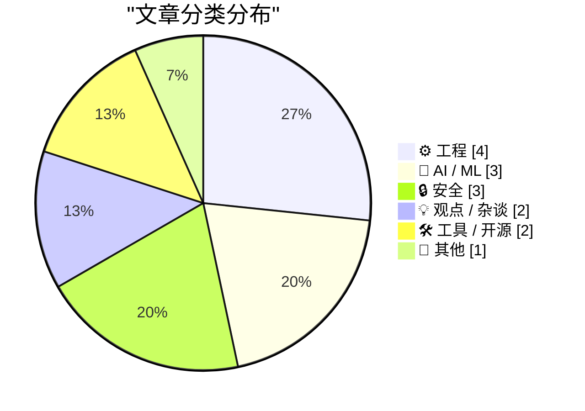
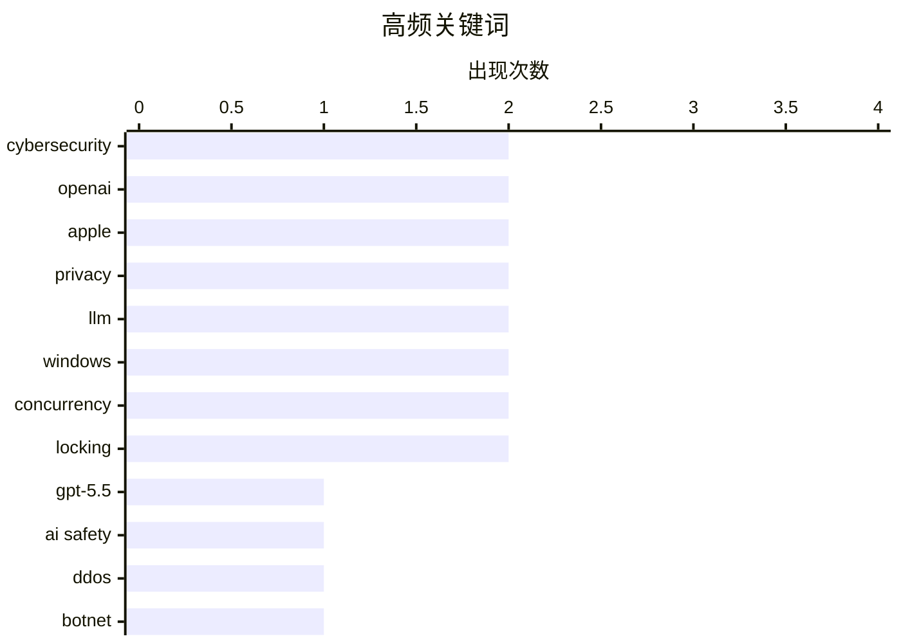

# 📰 AI 博客每日精选 — 2026-05-02

> 来自 Karpathy 推荐的 92 个顶级技术博客，AI 精选 Top 15

## 📝 今日看点

今日技术圈见证了 AI 演进与行业格局的剧烈震荡，OpenAI 新模型安全评估与 Codex 自动化功能的发布标志着 AI 生产力的进一步释放。苹果公司迎来重大人事更迭，蒂姆·库克卸任 CEO 开启了后库克时代的权力交接，而 NHS 关停开源库的举动则引发了开发者对技术透明度的深度忧虑。此外，从巴西安全公司的恶意竞争到 Meta 智能眼镜的隐私丑闻，网络安全与伦理治理依然是行业面临的严峻挑战。

---

## 🏆 今日必读

🥇 **英国 AI 安全研究所对 OpenAI GPT-5.5 网络安全能力的评估报告**

[Our evaluation of OpenAI's GPT-5.5 cyber capabilities](https://simonwillison.net/2026/Apr/30/gpt-55-cyber-capabilities/#atom-everything) — simonwillison.net · 1 天前 · 🤖 AI / ML

> 英国 AI 安全研究所（AISI）发布了针对 OpenAI 最新模型 GPT-5.5 在网络安全领域能力的评估结果。该评估重点测试了模型在发现安全漏洞方面的表现，发现其能力与 Anthropic 尚未公开的 Claude Mythos 相当。与 Mythos 不同的是，GPT-5.5 目前已经面向公众全面开放。这一评估结果表明，顶级大语言模型在自动化安全审计和潜在攻击辅助方面的门槛正在进一步降低。AISI 的持续监测旨在为前沿 AI 模型的发布提供安全基准。

💡 **为什么值得读**: 了解顶级大模型在网络安全实战中的最新基准表现及行业监管机构的评估结论。

🏷️ GPT-5.5, AI safety, cybersecurity, OpenAI

🥈 **巴西反 DDoS 公司被曝对当地运营商发起大规模攻击**

[Anti-DDoS Firm Heaped Attacks on Brazilian ISPs](https://krebsonsecurity.com/2026/04/anti-ddos-firm-heaped-attacks-on-brazilian-isps/) — krebsonsecurity.com · 1 天前 · 🔒 安全

> 知名安全记者 KrebsOnSecurity 披露，一家专门提供 DDoS 防护服务的巴西技术公司竟然在幕后操控僵尸网络，对巴西境内的其他网络运营商发起大规模攻击。调查显示，该公司利用其技术优势实施了长期的恶意活动，试图通过制造故障来获取市场优势。尽管其首席执行官辩称这是由于公司遭受安全漏洞导致，并指责是竞争对手试图抹黑，但证据指向了内部滥用。这起事件揭示了安全服务提供商“贼喊捉贼”的行业乱象。目前相关部门已介入调查这一严重的职业道德崩坏事件。

💡 **为什么值得读**: 揭露网络安全行业中极端的利益冲突与“黑吃黑”的真实案例。

🏷️ DDoS, botnet, cybersecurity, ISP

🥉 **英国国民医疗服务体系（NHS）向开源“开战”**

[NHS Goes To War Against Open Source](https://shkspr.mobi/blog/2026/05/nhs-goes-to-war-against-open-source/) — shkspr.mobi · 19 小时前 · ⚙️ 工程

> 英国国民医疗服务体系（NHS）正计划关闭其几乎所有的开源代码库，这一举动引发了技术界的强烈不满。曾在英国政府多个部门担任开源倡导者的作者指出，NHS England 正在背弃多年来建立的透明与协作准则。过去曾被视为行业标杆的开源政策正面临全面倒退，这将严重影响公共部门的软件复用和技术创新。作者对此表示极度失望，并呼吁重新审视这一决策。此举被视为政府技术透明度的重大倒退。

💡 **为什么值得读**: 关注公共机构在开源政策上的重大转向及其对技术生态的负面影响。

🏷️ Open Source, NHS, Policy, Government Tech

---

## 📊 数据概览

| 扫描源 | 抓取文章 | 时间范围 | 精选 |
|:---:|:---:|:---:|:---:|
| 83/92 | 2445 篇 → 34 篇 | 48h | **15 篇** |

### 分类分布



### 高频关键词



<details>
<summary>📈 纯文本关键词图（终端友好）</summary>

```
cybersecurity │ ████████████████████ 2
openai        │ ████████████████████ 2
apple         │ ████████████████████ 2
privacy       │ ████████████████████ 2
llm           │ ████████████████████ 2
windows       │ ████████████████████ 2
concurrency   │ ████████████████████ 2
locking       │ ████████████████████ 2
gpt-5.5       │ ██████████░░░░░░░░░░ 1
ai safety     │ ██████████░░░░░░░░░░ 1
```

</details>

### 🏷️ 话题标签

**cybersecurity**(2) · **openai**(2) · **apple**(2) · privacy(2) · llm(2) · windows(2) · concurrency(2) · locking(2) · gpt-5.5(1) · ai safety(1) · ddos(1) · botnet(1) · isp(1) · open source(1) · nhs(1) · policy(1) · government tech(1) · tim cook(1) · ceo(1) · leadership(1)

---

## ⚙️ 工程

### 1. 英国国民医疗服务体系（NHS）向开源“开战”

[NHS Goes To War Against Open Source](https://shkspr.mobi/blog/2026/05/nhs-goes-to-war-against-open-source/) — **shkspr.mobi** · 19 小时前 · ⭐ 27/30

> 英国国民医疗服务体系（NHS）正计划关闭其几乎所有的开源代码库，这一举动引发了技术界的强烈不满。曾在英国政府多个部门担任开源倡导者的作者指出，NHS England 正在背弃多年来建立的透明与协作准则。过去曾被视为行业标杆的开源政策正面临全面倒退，这将严重影响公共部门的软件复用和技术创新。作者对此表示极度失望，并呼吁重新审视这一决策。此举被视为政府技术透明度的重大倒退。

🏷️ Open Source, NHS, Policy, Government Tech

---

### 2. 开发跨进程读写锁（四）：处理进程异常退出

[Developing a cross-process reader/writer lock with limited readers, part 4: Abandonment](https://devblogs.microsoft.com/oldnewthing/20260501-00/?p=112291) — **devblogs.microsoft.com/oldnewthing** · 17 小时前 · ⭐ 24/30

> 微软资深工程师 Raymond Chen 在本系列第四部分探讨了跨进程读写锁中极具挑战性的“遗弃”（Abandonment）问题。文章重点介绍了当锁的持有者进程突然崩溃或被终止时，如何确保同步对象不会进入永久阻塞状态。通过利用 Windows 系统的同步原语特性，方案实现了对死亡进程所持锁的自动清理和状态恢复。这对于构建高可靠性的多进程协作系统至关重要。文章提供了底层 API 的调用细节和状态机处理逻辑。

🏷️ Windows, concurrency, locking, systems programming

---

### 3. 开发跨进程读写锁（三）：实现公平性

[Developing a cross-process reader/writer lock with limited readers, part 3: Fairness](https://devblogs.microsoft.com/oldnewthing/20260430-00/?p=112288) — **devblogs.microsoft.com/oldnewthing** · 1 天前 · ⭐ 24/30

> 本文是 Raymond Chen 关于跨进程读写锁系列的第三篇，核心讨论了如何实现读写操作之间的公平性。在传统的读写锁设计中，密集的读取请求往往会导致写入者“饥饿”，无法获得执行机会。文章提出了一种技术方案，让独占式写入请求在竞争中获得公平的排队机会，从而避免系统死锁或响应延迟。该方案在保证并发性能的同时，兼顾了多进程环境下的执行确定性。这对于需要频繁跨进程同步的复杂 Windows 应用开发具有指导意义。

🏷️ Windows, concurrency, fairness, locking

---

### 4. 单板机集群性价比极低，但依然充满乐趣

[SBC Clusters are a terrible value, but they're fun anyway](https://www.jeffgeerling.com/blog/2026/deskpi-super4c-sbc-cluster/) — **jeffgeerling.com** · 17 小时前 · ⭐ 22/30

> 评测了基于树莓派 CM5 的四节点集群板 DeskPi Super4C 及其在 8U 小型机架中的表现。尽管单板机（SBC）集群在计算性能和性价比上远不如一台二手迷你 PC，但它在学习分布式计算和容器编排方面具有独特价值。Super4C 解决了旧款型号的痛点，提供了更紧凑的集成方案。作者通过实际组装展示了硬件折腾的魅力，并指出这类项目更适合作为教学或实验平台。结论认为，虽然从财务角度看它是一笔“糟糕”的投资，但其带来的极客乐趣无可替代。

🏷️ SBC, cluster, hardware, homelab

---

## 🤖 AI / ML

### 5. 英国 AI 安全研究所对 OpenAI GPT-5.5 网络安全能力的评估报告

[Our evaluation of OpenAI's GPT-5.5 cyber capabilities](https://simonwillison.net/2026/Apr/30/gpt-55-cyber-capabilities/#atom-everything) — **simonwillison.net** · 1 天前 · ⭐ 28/30

> 英国 AI 安全研究所（AISI）发布了针对 OpenAI 最新模型 GPT-5.5 在网络安全领域能力的评估结果。该评估重点测试了模型在发现安全漏洞方面的表现，发现其能力与 Anthropic 尚未公开的 Claude Mythos 相当。与 Mythos 不同的是，GPT-5.5 目前已经面向公众全面开放。这一评估结果表明，顶级大语言模型在自动化安全审计和潜在攻击辅助方面的门槛正在进一步降低。AISI 的持续监测旨在为前沿 AI 模型的发布提供安全基准。

🏷️ GPT-5.5, AI safety, cybersecurity, OpenAI

---

### 6. 修改我由 LLM 辅助撰写的文章

[Editing my LLM assisted Articles](https://idiallo.com/byte-size/editing-llm-assisted-articles?src=feed) — **idiallo.com** · 4 小时前 · ⭐ 23/30

> 探讨了过度依赖大语言模型（LLM）辅助写作带来的长期负面影响。虽然 AI 能显著节省初稿撰写时间，但作者发现 AI 生成的内容往往缺乏个人独特的表达方式，导致日后引用时感到尴尬且陌生。为了找回写作时的真实想法和个人风格，作者决定对过去一年由 AI 辅助生成的文章进行全面重写。这一过程揭示了 AI 可能会稀释创作者的独特性，使文章失去深度。作者强调，真正的创作应当能准确捕捉并表达作者当时的真实思绪。

🏷️ LLM, AI Writing, Content Quality

---

### 7. 求导 ReLU 函数的三种方法

[Three ways to differentiate ReLU](https://www.johndcook.com/blog/2026/04/30/derivative-of-relu/) — **johndcook.com** · 1 天前 · ⭐ 22/30

> 探讨了深度学习中 ReLU 激活函数在经典意义下不可导（在 0 点处）的问题。文章详细介绍了三种计算广义导数的方法：子导数（Subderivative）、分布导数（Distributional derivative）以及在数值计算中常用的近似处理。这些数学工具为神经网络的反向传播算法提供了理论支撑，确保了梯度下降在非光滑函数上的可行性。通过对比不同定义，读者可以更深入地理解深度学习框架底层处理激活函数的方式。作者旨在通过数学严谨性提升对模型训练机制的认知。

🏷️ ReLU, calculus, deep learning, gradient

---

## 🔒 安全

### 8. 巴西反 DDoS 公司被曝对当地运营商发起大规模攻击

[Anti-DDoS Firm Heaped Attacks on Brazilian ISPs](https://krebsonsecurity.com/2026/04/anti-ddos-firm-heaped-attacks-on-brazilian-isps/) — **krebsonsecurity.com** · 1 天前 · ⭐ 28/30

> 知名安全记者 KrebsOnSecurity 披露，一家专门提供 DDoS 防护服务的巴西技术公司竟然在幕后操控僵尸网络，对巴西境内的其他网络运营商发起大规模攻击。调查显示，该公司利用其技术优势实施了长期的恶意活动，试图通过制造故障来获取市场优势。尽管其首席执行官辩称这是由于公司遭受安全漏洞导致，并指责是竞争对手试图抹黑，但证据指向了内部滥用。这起事件揭示了安全服务提供商“贼喊捉贼”的行业乱象。目前相关部门已介入调查这一严重的职业道德崩坏事件。

🏷️ DDoS, botnet, cybersecurity, ISP

---

### 9. Pluralistic：如何“不”禁止监控定价

[Pluralistic: How not to ban surveillance pricing (30 Apr 2026)](https://pluralistic.net/2026/04/30/something-must-be-done/) — **pluralistic.net** · 1 天前 · ⭐ 25/30

> 著名作家 Cory Doctorow 批评了马里兰州新出台的消费者保护法，认为该法律在禁止“监控定价”（Surveillance Pricing）方面形同虚设。文章指出，法律中充斥着各种漏洞，使得企业依然能利用收集的个人数据进行差异化定价。除了政策分析，文中还穿插讨论了谷歌维护 8,000 台 Linux 服务器的经验以及技术行业的“屎味化”（Enshittification）现象。作者认为，缺乏实质性约束的立法只会给企业提供合规的遮羞布，无法真正保护消费者隐私。

🏷️ Privacy, Surveillance Pricing, Regulation

---

### 10. Meta 宣称已解决肯尼亚外包人员通过 AI 眼镜偷窥用户隐私的问题

[Meta Solved Their Problem With Kenyan Contractors Seeing Footage of AI Glasses Wearers on the Toilet](https://www.bbc.com/news/articles/c5y7yvgy0w6o) — **daringfireball.net** · 10 小时前 · ⭐ 23/30

> 针对此前曝光的 Meta AI 智能眼镜严重侵犯隐私的丑闻，Meta 声称已采取措施解决该问题。此前调查发现，肯尼亚的外包审核员在处理数据时，能看到用户在脱衣、如厕甚至性行为时的第一视角画面。Meta 的所谓“解决方案”旨在限制人工审核员接触此类极端敏感素材的权限，并加强数据脱敏。然而，这一事件引发了公众对可穿戴 AI 设备在数据采集和后端审核流程中透明度的深度质疑。尽管 Meta 试图平息争议，但用户对隐私泄露的担忧依然存在。

🏷️ Meta, privacy, smart glasses, AI ethics

---

## 💡 观点 / 杂谈

### 11. The Talk Show 播客：苹果高层变动与 John Ternus 接任 CEO

[The Talk Show: ‘Food and Beverage Director’](https://daringfireball.net/thetalkshow/2026/04/30/ep-446) — **daringfireball.net** · 1 天前 · ⭐ 25/30

> 本期播客讨论了苹果公司的一项重大人事公告：蒂姆·库克（Tim Cook）将卸任首席执行官一职并转任执行主席，由约翰·特努斯（John Ternus）接任 CEO。MG Siegler 作为嘉宾参与讨论，深入分析了这次权力交接对苹果未来产品走向和企业文化的影响。节目还探讨了特努斯作为硬件工程背景出身的领导者，将如何塑造苹果的下一个十年。这是苹果近年来最核心的高层架构调整，标志着“后库克时代”的正式开启。

🏷️ Apple, Tim Cook, CEO, Leadership

---

### 12. AI 将创造就业机会

[AI will create jobs](https://geohot.github.io//blog/jekyll/update/2026/05/01/ai-will-create-jobs.html) — **geohot.github.io** · 1 天前 · ⭐ 23/30

> 简要回应了英伟达 CEO 黄仁勋关于人工智能将增加就业岗位的观点。作者认为这一结论在深入思考后是显而易见的，反驳了 AI 只会消灭工作的普遍担忧。虽然文章篇幅极短，但其核心立场在于 AI 技术的普及将催生出全新的职业需求和经济增长点。这种乐观态度与当前技术圈对生产力提升带动就业的预期相一致。作者通过支持行业领袖的观点，传达了对技术进步正面社会影响的信心。

🏷️ AI, economy, jobs, future of work

---

## 🛠 工具 / 开源

### 13. 使用 TranslateGemma 和 Ollama 实现离线命令行翻译

[Offline command line translation with TranslateGemma + Ollama](https://evanhahn.com/offline-cli-translation-with-translategemma-and-ollama/) — **evanhahn.com** · 1 天前 · ⭐ 25/30

> 开发者 Evan Hahn 分享了一个简单的脚本，利用 Google 的 TranslateGemma 模型和 Ollama 框架在命令行实现完全离线的文本翻译。该方案解决了在线翻译 API 存在的隐私泄露和费用问题，让用户可以在本地终端快速处理翻译任务。通过简单的管道命令（如 `echo '...' | translate`），即可获得高质量的翻译结果。这为需要频繁处理敏感数据或在无网环境下工作的开发者提供了高效工具。这种本地化部署方案充分发挥了轻量级大模型的实用价值。

🏷️ Ollama, Gemma, LLM, translation

---

### 14. Codex CLI 0.128.0 版本新增 /goal 自动化目标功能

[Codex CLI 0.128.0 adds /goal](https://simonwillison.net/2026/Apr/30/codex-goals/#atom-everything) — **simonwillison.net** · 1 天前 · ⭐ 24/30

> OpenAI 的 Codex CLI 编程助手在 0.128.0 版本中引入了 `/goal` 命令，实现了类似 Ralph 循环的自主执行模式。用户现在可以设定一个具体目标，Codex 将持续循环执行任务并自我评估，直到目标达成或耗尽配置的 Token 预算。该功能标志着命令行编程工具从简单的代码补全向具备自主解决问题能力的 Agent 演进。这种闭环评估机制显著提升了复杂编程任务的自动化程度。开发者可以通过该功能更高效地完成重构或多步骤的开发任务。

🏷️ OpenAI, Codex, CLI, AI agent

---

## 📝 其他

### 15. 苹果 2026 年第二财季财报分析

[Apple Q2 2026 Results](https://www.apple.com/newsroom/2026/04/apple-reports-second-quarter-results/) — **daringfireball.net** · 1 天前 · ⭐ 22/30

> 汇总了苹果公司 2026 年第二财季的财务表现，该季度营收达到 1112 亿美元，创下历年 3 月份季度的最高纪录。得益于 iPhone 17 系列的强劲需求，iPhone 业务营收创下新高，且所有地理区域均实现两位数增长。服务业务（Services）再次刷新历史营收纪录，显示出苹果生态系统极高的用户粘性。CEO Tim Cook 表示，这一成绩归功于公司历史上最强大的产品阵容。财报数据反映了苹果在高端硬件迭代和服务转型上的持续成功。

🏷️ Apple, Finance, iPhone, Earnings

---

*生成于 2026-05-02 07:28 | 扫描 83 源 → 获取 2445 篇 → 精选 15 篇*
*基于 [Hacker News Popularity Contest 2025](https://refactoringenglish.com/tools/hn-popularity/) RSS 源列表，由 [Andrej Karpathy](https://x.com/karpathy) 推荐*
