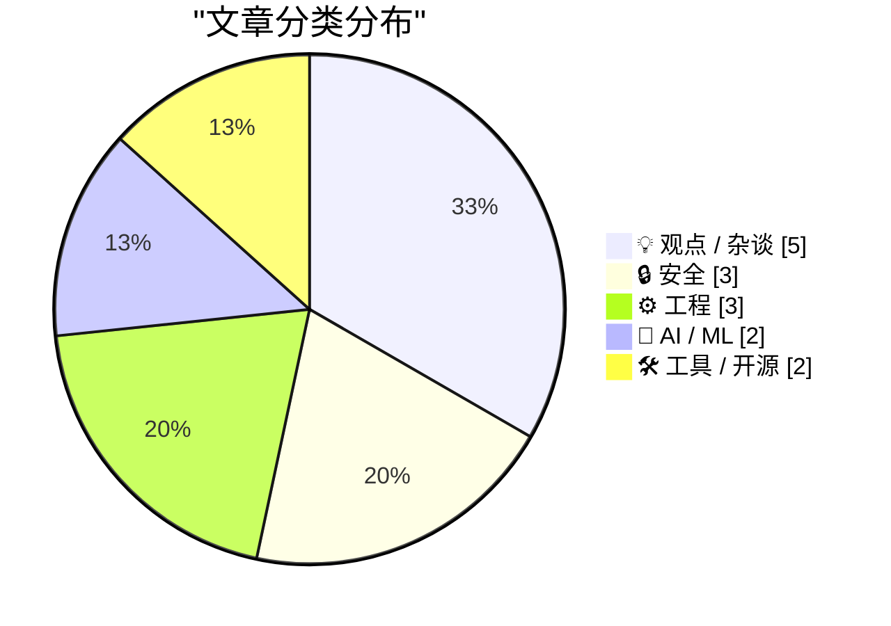
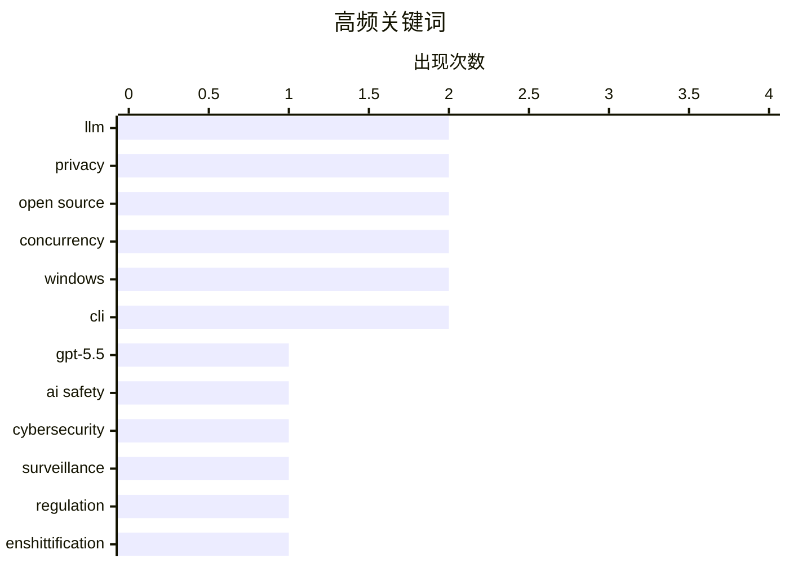

# 📰 AI 博客每日精选 — 2026-05-02

> 来自 Karpathy 推荐的 92 个顶级技术博客，AI 精选 Top 15

## 📝 今日看点

今日技术圈见证了AI能力的持续演进与治理挑战，从GPT-5.5的安全评估到自动化编程工具的迭代，AI正向更深层的生产力环节渗透。与此同时，数字治理与技术伦理冲突加剧，英国NHS对开源政策的倒退以及安全服务商的“反水”事件引发了行业对透明度与信任的广泛讨论。此外，苹果公司迎来重大人事更迭，库克卸任CEO标志着巨头战略转型的关键节点，科技行业的权力交接与未来布局成为焦点。

---

## 🏆 今日必读

🥇 **英国 AI 安全研究所对 OpenAI GPT-5.5 网络安全能力的评估报告**

[Our evaluation of OpenAI's GPT-5.5 cyber capabilities](https://simonwillison.net/2026/Apr/30/gpt-55-cyber-capabilities/#atom-everything) — simonwillison.net · 1 天前 · 🤖 AI / ML

> 英国 AI 安全研究所（AISI）发布了针对 OpenAI 最新模型 GPT-5.5 的网络安全能力评估。该评估重点测试了模型在发现安全漏洞方面的表现，结果显示其能力与 Anthropic 的 Claude Mythos 相当。与尚未完全公开的 Mythos 不同，GPT-5.5 目前已面向公众开放使用。AISI 的测试旨在衡量前沿模型在自动化网络攻击和防御任务中的潜在风险。这一评估为监管机构理解大模型在网络空间的安全边界提供了关键数据。

💡 **为什么值得读**: 了解顶级 AI 模型在网络安全攻防领域的真实水平及监管机构的最新评估标准。

🏷️ GPT-5.5, AI safety, cybersecurity, LLM

🥈 **监控定价禁令的失败案例：马里兰州新法的漏洞分析**

[Pluralistic: How not to ban surveillance pricing (30 Apr 2026)](https://pluralistic.net/2026/04/30/something-must-be-done/) — pluralistic.net · 1 天前 · 🔒 安全

> 著名科技评论家 Cory Doctorow 深入剖析了马里兰州新颁布的消费者保护法，该法律旨在禁止基于个人数据的“监控定价”。作者指出，该法律由于存在大量豁免条款和定义模糊，实际上沦为了充满漏洞的摆设。文章批评了科技公司如何利用法律漏洞继续推行动态定价策略，损害消费者利益。Doctorow 呼吁建立更严格、无死角的监管框架，以防止算法歧视和价格剥削。这反映了当前立法在对抗大型科技公司数据滥用时的无力感。

💡 **为什么值得读**: 深度反思科技监管法律在执行层面的复杂性，以及企业如何规避隐私保护政策。

🏷️ surveillance, privacy, regulation, enshittification

🥉 **英国国家医疗服务体系（NHS）向开源软件“宣战”**

[NHS Goes To War Against Open Source](https://shkspr.mobi/blog/2026/05/nhs-goes-to-war-against-open-source/) — shkspr.mobi · 15 小时前 · ⚙️ 工程

> 英国国家医疗服务体系（NHS）正计划关闭其几乎所有的开源代码仓库，引发了技术社区的强烈不满。作者作为曾在 GDS 和 NHSX 推动开源政策的前政府官员，详细描述了这一政策倒退对公共透明度和技术协作的负面影响。NHS 曾是政府开源倡议的先驱，此次转向闭源被视为对多年来建立的开放标准和协作文化的背叛。这一举动可能导致由公共资金支持的软件开发变得更加封闭且难以审计。作者呼吁相关部门重新审视这一决策，以维护公共利益。

💡 **为什么值得读**: 关注公共机构在开源政策上的重大转向及其对技术生态和透明度的深远影响。

🏷️ open source, NHS, government tech, policy

---

## 📊 数据概览

| 扫描源 | 抓取文章 | 时间范围 | 精选 |
|:---:|:---:|:---:|:---:|
| 84/92 | 2463 篇 → 33 篇 | 48h | **15 篇** |

### 分类分布



### 高频关键词



<details>
<summary>📈 纯文本关键词图（终端友好）</summary>

```
llm           │ ████████████████████ 2
privacy       │ ████████████████████ 2
open source   │ ████████████████████ 2
concurrency   │ ████████████████████ 2
windows       │ ████████████████████ 2
cli           │ ████████████████████ 2
gpt-5.5       │ ██████████░░░░░░░░░░ 1
ai safety     │ ██████████░░░░░░░░░░ 1
cybersecurity │ ██████████░░░░░░░░░░ 1
surveillance  │ ██████████░░░░░░░░░░ 1
```

</details>

### 🏷️ 话题标签

**llm**(2) · **privacy**(2) · **open source**(2) · concurrency(2) · windows(2) · cli(2) · gpt-5.5(1) · ai safety(1) · cybersecurity(1) · surveillance(1) · regulation(1) · enshittification(1) · nhs(1) · government tech(1) · policy(1) · ddos(1) · cybercrime(1) · isp(1) · brazil(1) · apple(1)

---

## 💡 观点 / 杂谈

### 1. The Talk Show 播客：苹果高层变动与“餐饮总监”

[The Talk Show: ‘Food and Beverage Director’](https://daringfireball.net/thetalkshow/2026/04/30/ep-446) — **daringfireball.net** · 23 小时前 · ⭐ 25/30

> 本期节目讨论了苹果公司的重大高层人事变动：蒂姆·库克（Tim Cook）将卸任首席执行官一职，转任执行董事长。现任硬件工程高级副总裁约翰·特努斯（John Ternus）将接任苹果 CEO。主持人 John Gruber 与嘉宾 MG Siegler 深入探讨了这一权力交接对苹果未来产品走向和企业文化的影响。节目还涉及了苹果近期在组织架构调整方面的其他细节，包括对高管角色的幽默解读。这一变动标志着苹果正式进入“特努斯时代”。

🏷️ Apple, CEO, Tim Cook, leadership

---

### 2. 论苹果 Vision 平台的未来

[★ On the Future of Apple’s Vision Platform](https://daringfireball.net/2026/04/on_the_future_of_apples_vision_platform) — **daringfireball.net** · 1 天前 · ⭐ 23/30

> 针对近期关于苹果可能放弃 Vision Pro 平台的传闻，知名科技博主 John Gruber 发表了深度见解。他认为，尽管 Vision Pro 目前面临市场挑战，但苹果不太可能在没有任何内部预兆的情况下突然终止该项目。文章分析了苹果在空间计算领域的长期战略投入，并指出此类重大平台的调整通常会有更明显的组织架构变动信号。作者强调，目前断言该平台失败还为时过早，苹果仍在按计划推进其愿景。这种观点为观察苹果的长期硬件战略提供了稳健的视角。

🏷️ Apple Vision Pro, AR/VR, hardware, strategy

---

### 3. AI will create jobs

[AI will create jobs](https://geohot.github.io//blog/jekyll/update/2026/05/01/ai-will-create-jobs.html) — **geohot.github.io** · 19 小时前 · ⭐ 23/30

> AI will create jobs

🏷️ AI, economics, jobs, automation

---

### 4. If I Could Make My Own GitHub

[If I Could Make My Own GitHub](https://matduggan.com/if-i-could-make-my-own-github/) — **matduggan.com** · 1 天前 · ⭐ 23/30

> If I Could Make My Own GitHub

🏷️ GitHub, developer tools, product design

---

### 5. Quoting Andrew Kelley

[Quoting Andrew Kelley](https://simonwillison.net/2026/Apr/30/andrew-kelley/#atom-everything) — **simonwillison.net** · 1 天前 · ⭐ 22/30

> Quoting Andrew Kelley

🏷️ Zig, LLM, open source, code review

---

## 🔒 安全

### 6. 监控定价禁令的失败案例：马里兰州新法的漏洞分析

[Pluralistic: How not to ban surveillance pricing (30 Apr 2026)](https://pluralistic.net/2026/04/30/something-must-be-done/) — **pluralistic.net** · 1 天前 · ⭐ 27/30

> 著名科技评论家 Cory Doctorow 深入剖析了马里兰州新颁布的消费者保护法，该法律旨在禁止基于个人数据的“监控定价”。作者指出，该法律由于存在大量豁免条款和定义模糊，实际上沦为了充满漏洞的摆设。文章批评了科技公司如何利用法律漏洞继续推行动态定价策略，损害消费者利益。Doctorow 呼吁建立更严格、无死角的监管框架，以防止算法歧视和价格剥削。这反映了当前立法在对抗大型科技公司数据滥用时的无力感。

🏷️ surveillance, privacy, regulation, enshittification

---

### 7. 巴西抗 DDoS 服务商被曝反向攻击当地互联网服务提供商

[Anti-DDoS Firm Heaped Attacks on Brazilian ISPs](https://krebsonsecurity.com/2026/04/anti-ddos-firm-heaped-attacks-on-brazilian-isps/) — **krebsonsecurity.com** · 1 天前 · ⭐ 26/30

> 网络安全专家 Brian Krebs 披露，一家专门提供 DDoS 防护的巴西技术公司被发现利用僵尸网络对该国其他网络运营商发动大规模攻击。调查显示，该公司的基础设施被用于执行持续的恶意流量攻击，直接损害了其竞争对手的业务。尽管该公司首席执行官辩称这是由于系统遭入侵或竞争对手栽赃，但证据指向了其内部资源的滥用。这起事件揭示了安全行业内部“贼喊捉贼”的极端案例及其对网络生态的破坏。目前相关部门已介入调查这一严重的行业丑闻。

🏷️ DDoS, cybercrime, ISP, Brazil

---

### 8. Meta 解决了肯尼亚外包人员查看 AI 眼镜用户私密影像的问题

[Meta Solved Their Problem With Kenyan Contractors Seeing Footage of AI Glasses Wearers on the Toilet](https://www.bbc.com/news/articles/c5y7yvgy0w6o) — **daringfireball.net** · 5 小时前 · ⭐ 23/30

> 针对此前曝光的肯尼亚外包员工在审核 Meta 智能眼镜内容时看到用户如厕、性爱等极端私密画面的丑闻，Meta 宣称已采取措施解决该问题。此前调查显示，外包人员在不知情的情况下审查了大量敏感的个人生活片段，引发了巨大的隐私争议。文章回顾了这一令人不安的事件，并对 Meta 所谓的“解决方案”及其背后的隐私保护机制表示质疑。这反映了可穿戴 AI 设备在数据采集与人工审核环节中存在的严重伦理风险。用户对于此类“智能”设备的隐私边界需要有更清醒的认识。

🏷️ Meta, privacy, smart glasses, AI ethics

---

## ⚙️ 工程

### 9. 英国国家医疗服务体系（NHS）向开源软件“宣战”

[NHS Goes To War Against Open Source](https://shkspr.mobi/blog/2026/05/nhs-goes-to-war-against-open-source/) — **shkspr.mobi** · 15 小时前 · ⭐ 27/30

> 英国国家医疗服务体系（NHS）正计划关闭其几乎所有的开源代码仓库，引发了技术社区的强烈不满。作者作为曾在 GDS 和 NHSX 推动开源政策的前政府官员，详细描述了这一政策倒退对公共透明度和技术协作的负面影响。NHS 曾是政府开源倡议的先驱，此次转向闭源被视为对多年来建立的开放标准和协作文化的背叛。这一举动可能导致由公共资金支持的软件开发变得更加封闭且难以审计。作者呼吁相关部门重新审视这一决策，以维护公共利益。

🏷️ open source, NHS, government tech, policy

---

### 10. 开发限制读者数量的跨进程读写锁（四）：所有权遗弃处理

[Developing a cross-process reader/writer lock with limited readers, part 4: Abandonment](https://devblogs.microsoft.com/oldnewthing/20260501-00/?p=112291) — **devblogs.microsoft.com/oldnewthing** · 12 小时前 · ⭐ 24/30

> 微软资深工程师 Raymond Chen 在本系列第四部分中探讨了跨进程读写锁在所有者进程意外终止时的恢复机制。文章重点解决了“遗弃”（Abandonment）问题，即当持有锁的进程崩溃时，如何确保系统资源不被永久锁定。作者详细介绍了利用 Windows 内核对象特性来检测并自动释放被遗弃锁的技术方案。这对于构建高可用、健壮的多进程协作系统至关重要。通过这种机制，系统可以在不重启的情况下从进程崩溃中快速恢复同步状态。

🏷️ concurrency, windows, systems programming, synchronization

---

### 11. Developing a cross-process reader/writer lock with limited readers, part 3: Fairness

[Developing a cross-process reader/writer lock with limited readers, part 3: Fairness](https://devblogs.microsoft.com/oldnewthing/20260430-00/?p=112288) — **devblogs.microsoft.com/oldnewthing** · 1 天前 · ⭐ 22/30

> Developing a cross-process reader/writer lock with limited readers, part 3: Fairness

🏷️ concurrency, locking, Windows, fairness

---

## 🤖 AI / ML

### 12. 英国 AI 安全研究所对 OpenAI GPT-5.5 网络安全能力的评估报告

[Our evaluation of OpenAI's GPT-5.5 cyber capabilities](https://simonwillison.net/2026/Apr/30/gpt-55-cyber-capabilities/#atom-everything) — **simonwillison.net** · 1 天前 · ⭐ 28/30

> 英国 AI 安全研究所（AISI）发布了针对 OpenAI 最新模型 GPT-5.5 的网络安全能力评估。该评估重点测试了模型在发现安全漏洞方面的表现，结果显示其能力与 Anthropic 的 Claude Mythos 相当。与尚未完全公开的 Mythos 不同，GPT-5.5 目前已面向公众开放使用。AISI 的测试旨在衡量前沿模型在自动化网络攻击和防御任务中的潜在风险。这一评估为监管机构理解大模型在网络空间的安全边界提供了关键数据。

🏷️ GPT-5.5, AI safety, cybersecurity, LLM

---

### 13. Three ways to differentiate ReLU

[Three ways to differentiate ReLU](https://www.johndcook.com/blog/2026/04/30/derivative-of-relu/) — **johndcook.com** · 1 天前 · ⭐ 22/30

> Three ways to differentiate ReLU

🏷️ ReLU, calculus, machine-learning, optimization

---

## 🛠 工具 / 开源

### 14. 使用 TranslateGemma 和 Ollama 实现离线命令行翻译

[Offline command line translation with TranslateGemma + Ollama](https://evanhahn.com/offline-cli-translation-with-translategemma-and-ollama/) — **evanhahn.com** · 1 天前 · ⭐ 24/30

> 本文介绍了一种利用 TranslateGemma 模型和 Ollama 框架在本地实现完全离线翻译的简单脚本方案。作者展示了如何通过简单的 Shell 命令将文本输入翻译器，并获得高质量的输出结果。该方案不依赖任何外部 API，极大地保护了翻译内容的隐私并降低了延迟。对于需要在终端环境下快速处理多语言文本的开发者来说，这是一个轻量且高效的工具。这种方法展示了本地大模型在日常生产力工具中的实际应用潜力。

🏷️ Ollama, Gemma, translation, CLI

---

### 15. Codex CLI 0.128.0 版本发布：引入 /goal 自动任务循环

[Codex CLI 0.128.0 adds /goal](https://simonwillison.net/2026/Apr/30/codex-goals/#atom-everything) — **simonwillison.net** · 1 天前 · ⭐ 23/30

> OpenAI 的 Codex CLI 编程助手在 0.128.0 版本中新增了 `/goal` 功能，实现了类似 Ralph 循环的自动化逻辑。用户只需设定一个最终目标，Codex 将自动进入循环执行模式，直到评估任务完成或耗尽预设的 Token 预算。该功能主要通过 Rust 实现，增强了 AI 代理在处理复杂、多步骤编程任务时的自主性。这一更新标志着命令行编程工具向全自动 AI 智能体迈出了重要一步。开发者现在可以更高效地完成端到端的代码生成与调试任务。

🏷️ Codex CLI, OpenAI, AI coding, CLI

---

*生成于 2026-05-02 02:57 | 扫描 84 源 → 获取 2463 篇 → 精选 15 篇*
*基于 [Hacker News Popularity Contest 2025](https://refactoringenglish.com/tools/hn-popularity/) RSS 源列表，由 [Andrej Karpathy](https://x.com/karpathy) 推荐*
