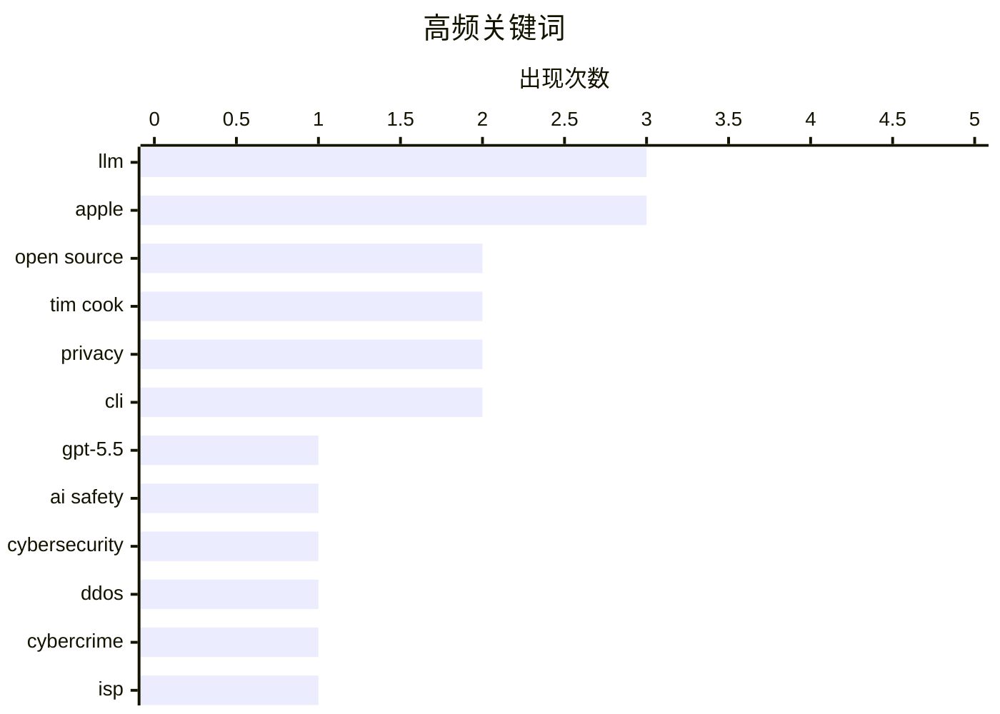

# 📰 AI 博客每日精选 — 2026-05-02

> 来自 Karpathy 推荐的 92 个顶级技术博客，AI 精选 Top 15

## 📝 今日看点

今日技术圈聚焦于 AI 治理与开发者文化的深度反思。随着 AI 安全评估的深入，技术社区开始警惕 AI 生成内容带来的“数字异味”，Zig 等项目甚至明确禁止 AI 代码以维护工程纯粹性。与此同时，从苹果 CEO 的权力交接，到英国 NHS 撤离开源阵营，再到网络安全领域的恶意竞争，大型机构与基础设施的治理策略正面临重大转向与信任挑战。

---

## 🏆 今日必读

🥇 **英国 AI 安全研究所对 OpenAI GPT-5.5 网络能力的评估报告**

[Our evaluation of OpenAI's GPT-5.5 cyber capabilities](https://simonwillison.net/2026/Apr/30/gpt-55-cyber-capabilities/#atom-everything) — simonwillison.net · 1 天前 · 🤖 AI / ML

> 英国人工智能安全研究所（AISI）发布了针对 OpenAI GPT-5.5 网络安全能力的最新评估结果。评估重点测试了该模型在发现和利用安全漏洞方面的表现，发现其能力水平与 Anthropic 的 Claude Mythos 相当。与目前仍处于受限预览阶段的 Mythos 不同，GPT-5.5 已经向公众全面开放。这意味着高性能的自动化漏洞挖掘能力已进入大众市场，对现有的网络防御体系提出了新的挑战。AISI 的这一评估为监管机构理解前沿大模型的潜在风险提供了关键数据。

💡 **为什么值得读**: 了解顶级大模型在网络攻防实战中的真实水平以及监管机构的最新评估标准。

🏷️ GPT-5.5, AI safety, cybersecurity, LLM

🥈 **巴西抗 DDoS 服务商被指控对当地 ISP 发动流量攻击**

[Anti-DDoS Firm Heaped Attacks on Brazilian ISPs](https://krebsonsecurity.com/2026/04/anti-ddos-firm-heaped-attacks-on-brazilian-isps/) — krebsonsecurity.com · 1 天前 · 🔒 安全

> 巴西一家专门提供抗 DDoS 服务的技术公司被曝光利用僵尸网络对当地其他网络运营商发动大规模流量攻击。KrebsOnSecurity 的调查显示，该公司的基础设施被用于执行这些恶意活动，旨在打击竞争对手。该公司首席执行官辩称，这些攻击是由于其系统遭受安全漏洞入侵所致，并暗示是竞争对手在栽赃嫁祸。此事件揭示了网络安全行业中“既当警察又当贼”的恶性竞争现象。目前相关调查仍在进行中，暴露了供应链安全和行业自律的严重问题。

💡 **为什么值得读**: 揭露网络安全行业“黑吃黑”的丑闻，警惕安全服务提供商本身可能带来的安全风险。

🏷️ DDoS, cybercrime, ISP, Brazil

🥉 **英国 NHS 转向反对开源：计划关闭大量代码库**

[NHS Goes To War Against Open Source](https://shkspr.mobi/blog/2026/05/nhs-goes-to-war-against-open-source/) — shkspr.mobi · 15 小时前 · ⚙️ 工程

> 英国国家医疗服务体系（NHS）正准备关闭其绝大部分开源代码库，这一举动引发了技术社区的强烈不满。作者作为曾为英国政府制定开源指南的专家，指出 NHS England 的这一决策背离了多年来倡导的透明、协作和公共资金购买公共代码的原则。此前，NHS 在 GDS 和 NHSX 等部门的推动下曾是开源的坚定支持者。这一政策倒退不仅会阻碍技术创新，还可能增加长期维护成本。此举反映了大型公共机构在数字化转型过程中对开源政策的反复与保守倾向。

💡 **为什么值得读**: 关注公共机构技术政策的重大转向及其对开源生态系统的负面影响。

🏷️ open source, NHS, government tech, policy

---

## 📊 数据概览

| 扫描源 | 抓取文章 | 时间范围 | 精选 |
|:---:|:---:|:---:|:---:|
| 83/92 | 2445 篇 → 34 篇 | 48h | **15 篇** |

### 分类分布


### 高频关键词



<details>
<summary>📈 纯文本关键词图（终端友好）</summary>

```
llm           │ ████████████████████ 3
apple         │ ████████████████████ 3
open source   │ █████████████░░░░░░░ 2
tim cook      │ █████████████░░░░░░░ 2
privacy       │ █████████████░░░░░░░ 2
cli           │ █████████████░░░░░░░ 2
gpt-5.5       │ ███████░░░░░░░░░░░░░ 1
ai safety     │ ███████░░░░░░░░░░░░░ 1
cybersecurity │ ███████░░░░░░░░░░░░░ 1
ddos          │ ███████░░░░░░░░░░░░░ 1
```

</details>

### 🏷️ 话题标签

**llm**(3) · **apple**(3) · **open source**(2) · tim cook(2) · privacy(2) · cli(2) · gpt-5.5(1) · ai safety(1) · cybersecurity(1) · ddos(1) · cybercrime(1) · isp(1) · brazil(1) · nhs(1) · government tech(1) · policy(1) · ceo(1) · leadership(1) · surveillance(1) · regulation(1)

---

## 💡 观点 / 杂谈

### 1. The Talk Show 播客：探讨苹果 CEO 权力交接

[The Talk Show: ‘Food and Beverage Director’](https://daringfireball.net/thetalkshow/2026/04/30/ep-446) — **daringfireball.net** · 1 天前 · ⭐ 25/30

> 本期节目深入探讨了苹果公司的重大领导层变动：蒂姆·库克（Tim Cook）将卸任 CEO 并转任执行主席，由硬件工程主管约翰·特努斯（John Ternus）接任。MG Siegler 作为嘉宾分析了特努斯的背景及其对苹果未来产品走向的影响。特努斯被认为是一位更关注产品细节的领导者，这可能预示着苹果将回归以硬件创新为核心的战略。节目还回顾了库克时代的财务成就，并讨论了新任 CEO 在 AI 浪潮下所面临的挑战。这次交接标志着苹果一个时代的结束和新篇章的开始。

🏷️ Apple, Tim Cook, CEO, leadership

---

### 2. 如果让我重新打造一个 GitHub

[If I Could Make My Own GitHub](https://matduggan.com/if-i-could-make-my-own-github/) — **matduggan.com** · 1 天前 · ⭐ 24/30

> 作者构思了在拥有无限资金的前提下，如何重新设计一个理想的代码托管平台。文章批评了当前 GitHub 在社交功能和代码审查流程上的臃肿，认为其偏离了开发者的核心需求。理想的平台应具备更强大的离线支持、更简洁的 CI/CD 集成以及更纯粹的代码协作逻辑。作者提出应取消不必要的社交噪音，回归到以代码质量和开发者效率为中心的设计哲学。这种“推倒重来”的设想反映了资深开发者对现有主流工具演进方向的深刻反思。

🏷️ GitHub, developer tools, product design

---

### 3. 我们需要 RSS 来分享海量的“氛围编码”应用

[We need RSS for sharing abundant vibe-coded apps](https://simonwillison.net/2026/Apr/30/rss-vibe-coded-apps/#atom-everything) — **simonwillison.net** · 1 天前 · ⭐ 23/30

> 随着“氛围编码”（vibe-coding）大幅加速应用开发，软件正变得更加个人化、场景化且高频产出。传统的应用商店分发模式难以承载这种微型应用的爆发，Matt Webb 提出应利用 RSS 订阅源来分发这些应用页面。每个订阅项可以包含一个“安装”按钮，将分发逻辑从中心化平台转向去中心化的流式更新。这种模式将软件发布从“重大发布”转变为类似博客更新的日常行为，解决了海量 AI 生成工具的发现与获取难题。作者认为，在 AI 时代我们需要一种类似 Atom 的标准来同步这些不断涌现的软件。

🏷️ RSS, vibe-coding, AI apps, syndication

---

### 4. 深度解析苹果应对关税退税难题的逻辑方案

[More on Apple’s Logically Elegant Tariff Refund Puzzle Solution](https://daringfireball.net/linked/2026/05/01/tim-cooks-clever-solution-to-the-tariff-refund-puzzle) — **daringfireball.net** · 2 小时前 · ⭐ 23/30

> 面对特朗普政府可能的关税退税，蒂姆·库克采取了一种巧妙的政治与公关策略。为了避免因领取巨额退税而招致“政府补贴”或“不当得利”的舆论攻击，库克承诺将所有退税资金专项用于“美国创新和先进制造业”。这一方案在逻辑上非常严密，既接受了资金，又将其定性为对美国本土产业的再投资而非单纯的企业利润。这种处理方式化解了苹果在关税政策中的尴尬处境，避免了与政府潜在的冲突。该案例展示了库克在处理复杂政商关系和企业形象维护时的卓越手腕。

🏷️ Apple, Tim Cook, tariffs, business strategy

---

## 🔒 安全

### 5. 巴西抗 DDoS 服务商被指控对当地 ISP 发动流量攻击

[Anti-DDoS Firm Heaped Attacks on Brazilian ISPs](https://krebsonsecurity.com/2026/04/anti-ddos-firm-heaped-attacks-on-brazilian-isps/) — **krebsonsecurity.com** · 1 天前 · ⭐ 28/30

> 巴西一家专门提供抗 DDoS 服务的技术公司被曝光利用僵尸网络对当地其他网络运营商发动大规模流量攻击。KrebsOnSecurity 的调查显示，该公司的基础设施被用于执行这些恶意活动，旨在打击竞争对手。该公司首席执行官辩称，这些攻击是由于其系统遭受安全漏洞入侵所致，并暗示是竞争对手在栽赃嫁祸。此事件揭示了网络安全行业中“既当警察又当贼”的恶性竞争现象。目前相关调查仍在进行中，暴露了供应链安全和行业自律的严重问题。

🏷️ DDoS, cybercrime, ISP, Brazil

---

### 6. Pluralistic：如何避免监控定价禁令沦为一纸空文

[Pluralistic: How not to ban surveillance pricing (30 Apr 2026)](https://pluralistic.net/2026/04/30/something-must-be-done/) — **pluralistic.net** · 1 天前 · ⭐ 25/30

> 马里兰州新颁布的消费者保护法旨在限制“监控定价”，但因存在大量漏洞而遭到科利·多克托罗（Cory Doctorow）的严厉批评。文章指出，该法律未能有效阻止企业利用个人数据进行动态加价，反而可能使某些剥削行为合法化。除了法律分析，文中还提到了 Google 运行 8000 台 Linux 服务器的运维细节以及技术岗位“劣质化”的行业趋势。作者呼吁建立更严格的隐私保护机制，以防止算法定价对消费者利益的持续侵害。这种对立法细节的剖析揭示了科技巨头游说力量对政策制定的影响。

🏷️ surveillance, privacy, regulation

---

### 7. Meta 解决了肯尼亚外包商通过 AI 眼镜偷窥用户隐私的问题

[Meta Solved Their Problem With Kenyan Contractors Seeing Footage of AI Glasses Wearers on the Toilet](https://www.bbc.com/news/articles/c5y7yvgy0w6o) — **daringfireball.net** · 6 小时前 · ⭐ 23/30

> 此前瑞典记者揭露 Meta 聘请的肯尼亚外包人员在审核 AI 眼镜拍摄的内容时，看到了用户脱衣、性行为及如厕等极端私密画面。Meta 声称已解决这一问题，但核心矛盾在于 AI 模型训练对真实场景数据的渴求与用户隐私保护之间的冲突。虽然 Meta 可能通过技术手段或更换外包商来堵漏，但智能眼镜“始终在线”的摄像头属性依然是巨大的隐私隐患。该事件提醒用户，所谓的“AI 智能”背后往往隐藏着大量人工审核，且隐私边界极其脆弱。作者对此类“已解决”的说法持保留态度，认为硬件设计本身的风险并未消除。

🏷️ Meta, privacy, smart glasses, AI ethics

---

## ⚙️ 工程

### 8. 英国 NHS 转向反对开源：计划关闭大量代码库

[NHS Goes To War Against Open Source](https://shkspr.mobi/blog/2026/05/nhs-goes-to-war-against-open-source/) — **shkspr.mobi** · 15 小时前 · ⭐ 27/30

> 英国国家医疗服务体系（NHS）正准备关闭其绝大部分开源代码库，这一举动引发了技术社区的强烈不满。作者作为曾为英国政府制定开源指南的专家，指出 NHS England 的这一决策背离了多年来倡导的透明、协作和公共资金购买公共代码的原则。此前，NHS 在 GDS 和 NHSX 等部门的推动下曾是开源的坚定支持者。这一政策倒退不仅会阻碍技术创新，还可能增加长期维护成本。此举反映了大型公共机构在数字化转型过程中对开源政策的反复与保守倾向。

🏷️ open source, NHS, government tech, policy

---

### 9. 单板机集群虽然性价比极低，但折腾起来乐趣无穷

[SBC Clusters are a terrible value, but they're fun anyway](https://www.jeffgeerling.com/blog/2026/deskpi-super4c-sbc-cluster/) — **jeffgeerling.com** · 13 小时前 · ⭐ 24/30

> 硬件博主 Jeff Geerling 评测了新型 DeskPi Super4C 集群板，该设备可容纳 4 个树莓派 CM5 核心模块。尽管单板机（SBC）集群在算力性价比上远不如二手迷你 PC，但它在学习 Kubernetes 架构和分布式计算方面具有独特价值。Super4C 解决了前代产品的多个痛点，并能完美适配 Waveshare HomeRack 迷你机架。作者强调，这类项目的核心在于实验的乐趣和对硬件底层的掌控感。对于想要在桌面上搭建微型数据中心的爱好者来说，这依然是一个极具吸引力的方案。

🏷️ SBC, Raspberry Pi, cluster, homelab

---

### 10. 引用 Andrew Kelley：为何 Zig 项目禁止 AI 生成的代码

[Quoting Andrew Kelley](https://simonwillison.net/2026/Apr/30/andrew-kelley/#atom-everything) — **simonwillison.net** · 1 天前 · ⭐ 23/30

> Zig 语言创始人 Andrew Kelley 解释了为何在项目中严禁 AI 生成的拉取请求（PR）。他指出，AI 产生的幻觉与人类犯的错误有本质区别，具有一种明显的“数字异味”，经验丰富的维护者可以轻易识别。Kelley 认为，依赖 Agent 编码的开发者往往忽视代码库的整体一致性和长期可维护性。这种缺乏深度理解的代码贡献会增加维护者的负担，甚至破坏项目的技术底蕴。这一观点引发了关于 AI 在高质量开源软件开发中角色定位的广泛讨论。

🏷️ Zig, LLM, code review, open source

---

## 🤖 AI / ML

### 11. 英国 AI 安全研究所对 OpenAI GPT-5.5 网络能力的评估报告

[Our evaluation of OpenAI's GPT-5.5 cyber capabilities](https://simonwillison.net/2026/Apr/30/gpt-55-cyber-capabilities/#atom-everything) — **simonwillison.net** · 1 天前 · ⭐ 28/30

> 英国人工智能安全研究所（AISI）发布了针对 OpenAI GPT-5.5 网络安全能力的最新评估结果。评估重点测试了该模型在发现和利用安全漏洞方面的表现，发现其能力水平与 Anthropic 的 Claude Mythos 相当。与目前仍处于受限预览阶段的 Mythos 不同，GPT-5.5 已经向公众全面开放。这意味着高性能的自动化漏洞挖掘能力已进入大众市场，对现有的网络防御体系提出了新的挑战。AISI 的这一评估为监管机构理解前沿大模型的潜在风险提供了关键数据。

🏷️ GPT-5.5, AI safety, cybersecurity, LLM

---

### 12. 重写我那些由 AI 辅助撰写的文章

[Editing my LLM assisted articles](https://idiallo.com/byte-size/editing-llm-assisted-articles?src=feed) — **idiallo.com** · 8 分钟前 · ⭐ 24/30

> 作者在回顾去年利用 AI 辅助创作的文章时，发现这些内容缺乏个人特质，甚至在引用时感到尴尬。AI 生成的文本虽然节省了写作时间，但往往无法准确捕捉作者当时的真实想法，产生了一种难以言喻的“数字异味”。为了找回自己的“声音”，作者决定重新改写这些文章，以确保内容能够真实反映其个人观点。这一反思揭示了过度依赖大模型进行内容创作可能导致的个人品牌稀释和思想深度缺失。作者通过实例展示了如何将 AI 生成的平庸内容转化为具有生命力的个人表达。

🏷️ LLM, AI writing, content creation

---

## 🛠 工具 / 开源

### 13. Codex CLI 0.128.0 版本新增 /goal 指令

[Codex CLI 0.128.0 adds /goal](https://simonwillison.net/2026/Apr/30/codex-goals/#atom-everything) — **simonwillison.net** · 1 天前 · ⭐ 23/30

> OpenAI 的 Codex CLI 发布了 0.128.0 版本，引入了关键的 `/goal` 功能。该功能实现了类似于 Ralph 循环的自主逻辑，允许用户设定一个目标，Codex 将持续循环执行任务，直到评估目标达成或耗尽配置的 Token 预算。这一更新标志着命令行编码助手正从简单的代码补全向具备自主规划能力的 Agent 演进。开发者现在可以通过更高级别的意图描述来驱动复杂的重构或功能实现任务。该版本还优化了 Rust 环境下的运行性能和稳定性。

🏷️ OpenAI, CLI, AI agents, Codex

---

### 14. 使用 TranslateGemma 和 Ollama 实现离线命令行翻译

[Offline command line translation with TranslateGemma + Ollama](https://evanhahn.com/offline-cli-translation-with-translategemma-and-ollama/) — **evanhahn.com** · 1 天前 · ⭐ 23/30

> 开发者 Evan Hahn 分享了一个利用 TranslateGemma 模型和 Ollama 框架实现的离线命令行翻译方案。通过编写简单的 Shell 脚本，用户可以直接在终端通过管道符（Pipe）处理文本翻译，例如执行 `echo '¿Cómo estás?' | translate`。该方案完全在本地运行，无需联网，有效保护了数据隐私并消除了 API 调用成本。TranslateGemma 作为专门优化的翻译模型，配合 Ollama 的轻量化部署，为开发者提供了一个高效、私密的生产力工具。这种方法证明了本地大模型在微型工具开发中的实用价值。

🏷️ Ollama, Gemma, translation, CLI

---

## 📝 其他

### 15. 苹果发布 2026 财年第二季度财报

[Apple Q2 2026 Results](https://www.apple.com/newsroom/2026/04/apple-reports-second-quarter-results/) — **daringfireball.net** · 1 天前 · ⭐ 23/30

> 苹果公司发布了 2026 年 3 月季度财报，营收达到 1112 亿美元，创下历史同期最高纪录。在 iPhone 17 系列强劲需求的推动下，iPhone 业务营收刷新了 3 月季度纪录，同时服务业务也创下历史新高。报告显示，苹果在所有地理区域均实现了两位数的营收增长，显示出极强的全球市场扩张能力。蒂姆·库克强调，这是公司历史上最强大的产品阵容，反映了硬件迭代与服务生态的双重成功。尽管面临宏观经济挑战，苹果的各项核心指标依然表现强劲。

🏷️ Apple, finance, iPhone, revenue

---

*生成于 2026-05-02 03:09 | 扫描 83 源 → 获取 2445 篇 → 精选 15 篇*
*基于 [Hacker News Popularity Contest 2025](https://refactoringenglish.com/tools/hn-popularity/) RSS 源列表，由 [Andrej Karpathy](https://x.com/karpathy) 推荐*
