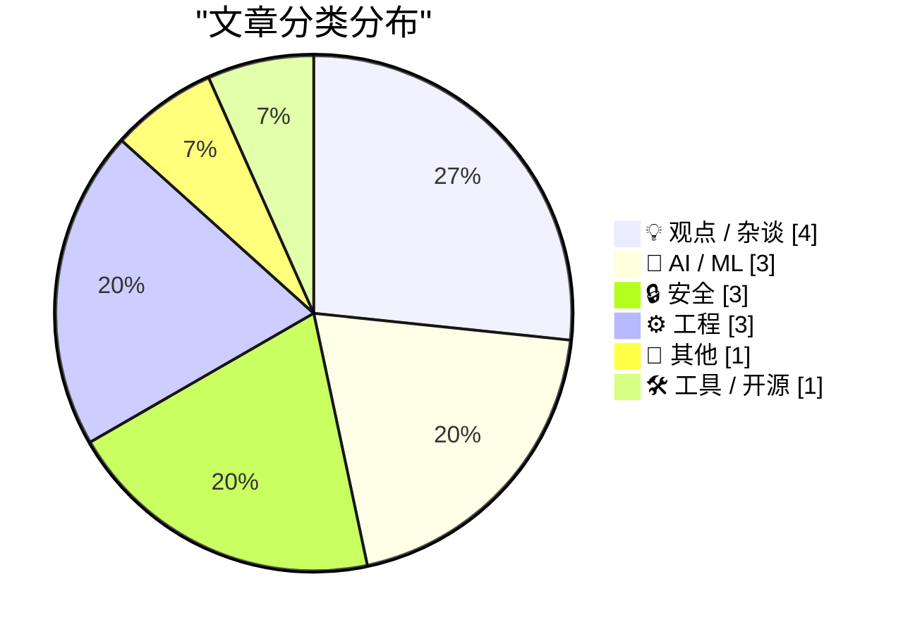
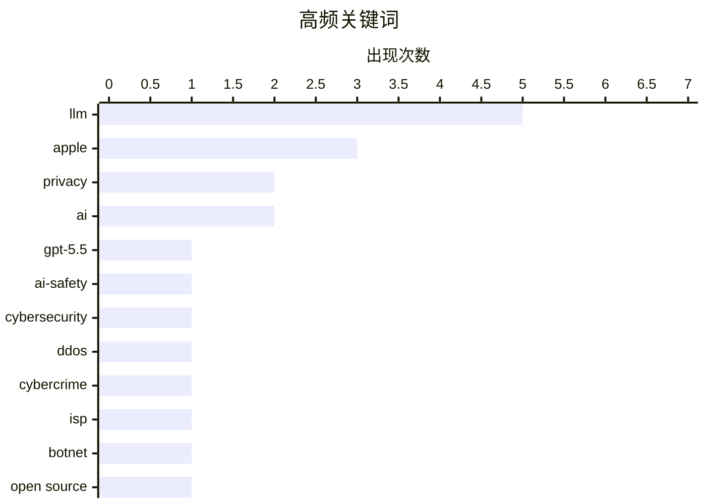

# 📰 AI 博客每日精选 — 2026-05-02

> 来自 Karpathy 推荐的 92 个顶级技术博客，AI 精选 Top 15

## 📝 今日看点

今日技术圈聚焦 AI 能力演进与苹果公司的重大权力更迭。OpenAI GPT-5.5 的安全评估与 Codex 自动化功能的发布，标志着大模型正从内容生成向深度任务执行迈进；与此同时，苹果在创纪录财报背景下迎来 CEO 换届，正式开启后库克时代。此外，NHS 关闭开源库及网络安全领域的恶性竞争事件，也引发了业界对技术伦理与开放政策的广泛讨论。

---

## 🏆 今日必读

🥇 **英国 AI 安全研究所对 OpenAI GPT-5.5 网络安全能力的评估报告**

[Our evaluation of OpenAI's GPT-5.5 cyber capabilities](https://simonwillison.net/2026/Apr/30/gpt-55-cyber-capabilities/#atom-everything) — simonwillison.net · 1 天前 · 🤖 AI / ML

> 英国人工智能安全研究所（AISI）发布了针对 OpenAI GPT-5.5 在网络安全领域能力的最新评估结果。该评估重点测试了模型在发现和挖掘安全漏洞方面的表现，发现其能力水平与 Anthropic 的 Claude Mythos 相当。与尚未完全公开的 Mythos 不同，GPT-5.5 目前已处于普遍可用状态。尽管展示了强大的辅助潜力，但评估也暗示了此类模型在复杂攻防场景中仍面临特定局限。这一对比为安全研究人员选择自动化漏洞扫描工具提供了重要参考。

💡 **为什么值得读**: 了解权威机构对顶级 AI 模型在网络攻防实战中真实水平的最新评测结论。

🏷️ GPT-5.5, AI-safety, cybersecurity, LLM

🥈 **抗 DDoS 服务商被指控对巴西运营商发动大规模流量攻击**

[Anti-DDoS Firm Heaped Attacks on Brazilian ISPs](https://krebsonsecurity.com/2026/04/anti-ddos-firm-heaped-attacks-on-brazilian-isps/) — krebsonsecurity.com · 1 天前 · 🔒 安全

> 网络安全专家 KrebsOnSecurity 披露，一家专门提供抗 DDoS 服务的巴西技术公司被发现操纵僵尸网络，对该国其他网络运营商发动持续的大规模 DDoS 攻击。调查显示，该公司在宣称保护网络安全的同时，却在幕后破坏竞争对手的业务。该公司首席执行官辩称，这些恶意活动源于其自身系统遭受的安全漏洞，并暗示是竞争对手试图栽赃抹黑。这一事件揭示了网络安全行业中“既当警察又当贼”的潜在利益冲突与道德风险。

💡 **为什么值得读**: 揭露网络安全行业背后的阴暗面，警惕服务提供商可能存在的恶意竞争行为。

🏷️ DDoS, cybercrime, ISP, botnet

🥉 **英国 NHS 计划关闭几乎所有开源代码库引发争议**

[NHS Goes To War Against Open Source](https://shkspr.mobi/blog/2026/05/nhs-goes-to-war-against-open-source/) — shkspr.mobi · 15 小时前 · ⚙️ 工程

> 英国国家医疗服务体系（NHS）正准备关闭其绝大部分开源存储库，这一举动引发了技术界的广泛批评。作者作为曾在 GDS 和 NHSX 推动开源政策的前政府官员，对 NHS England 背离开源指导方针的行为表示极度失望。此前，NHS 的开源实践曾被视为政府透明度和技术协作的典范，并有专门的指导方针支持。此举可能导致公共资金开发的软件被封闭，降低医疗系统的技术创新效率和透明度。该事件反映了大型公共机构在技术开放性政策上的重大倒退。

💡 **为什么值得读**: 探讨公共机构在开源政策上的动向及其对技术生态和公共利益的负面影响。

🏷️ Open Source, NHS, Government Tech, Policy

---

## 📊 数据概览

| 扫描源 | 抓取文章 | 时间范围 | 精选 |
|:---:|:---:|:---:|:---:|
| 81/92 | 2404 篇 → 34 篇 | 48h | **15 篇** |

### 分类分布



### 高频关键词



<details>
<summary>📈 纯文本关键词图（终端友好）</summary>

```
llm           │ ████████████████████ 5
apple         │ ████████████░░░░░░░░ 3
privacy       │ ████████░░░░░░░░░░░░ 2
ai            │ ████████░░░░░░░░░░░░ 2
gpt-5.5       │ ████░░░░░░░░░░░░░░░░ 1
ai-safety     │ ████░░░░░░░░░░░░░░░░ 1
cybersecurity │ ████░░░░░░░░░░░░░░░░ 1
ddos          │ ████░░░░░░░░░░░░░░░░ 1
cybercrime    │ ████░░░░░░░░░░░░░░░░ 1
isp           │ ████░░░░░░░░░░░░░░░░ 1
```

</details>

### 🏷️ 话题标签

**llm**(5) · **apple**(3) · **privacy**(2) · ai(2) · gpt-5.5(1) · ai-safety(1) · cybersecurity(1) · ddos(1) · cybercrime(1) · isp(1) · botnet(1) · open source(1) · nhs(1) · government tech(1) · policy(1) · tim cook(1) · ceo(1) · leadership(1) · surveillance(1) · regulation(1)

---

## 💡 观点 / 杂谈

### 1. The Talk Show：讨论 Tim Cook 卸任 CEO 及 John Ternus 接任

[The Talk Show: ‘Food and Beverage Director’](https://daringfireball.net/thetalkshow/2026/04/30/ep-446) — **daringfireball.net** · 1 天前 · ⭐ 25/30

> 在最新一期《The Talk Show》播客中，MG Siegler 与 John Gruber 深入探讨了苹果公司重大的领导层变动。苹果官方宣布 Tim Cook 将卸任首席执行官并转任执行主席，由 John Ternus 接任 CEO 一职。节目分析了这一权力交接对苹果未来产品走向、公司文化以及硬件开发战略的潜在影响。此外，两人还讨论了苹果近期的财报表现和未来的市场预期。这标志着苹果正式进入“后库克时代”的过渡期。

🏷️ Apple, Tim Cook, CEO, Leadership

---

### 2. AI 将创造就业机会

[AI will create jobs](https://geohot.github.io//blog/jekyll/update/2026/05/01/ai-will-create-jobs.html) — **geohot.github.io** · 20 小时前 · ⭐ 23/30

> Geohot 认同英伟达 CEO 黄仁勋的观点，认为 AI 的普及将通过提高生产力上限来催生更多岗位。AI 降低了复杂任务的执行门槛，使得原本因成本过高而无法立项的创意变得可行，从而扩大了整体市场规模。技术进步的历史规律表明，效率提升往往伴随着对人类劳动力需求的重新分配而非简单消灭。最终，AI 不会减少工作总量，而是将人类引导至更高价值、更具创造性的领域。这种转变虽然会带来阵痛，但长远看将创造出目前无法想象的新职业。

🏷️ AI, employment, economy, Jensen Huang

---

### 3. 深度解析苹果处理关税退税难题的逻辑优雅方案

[More on Apple’s Logically Elegant Tariff Refund Puzzle Solution](https://daringfireball.net/linked/2026/05/01/tim-cooks-clever-solution-to-the-tariff-refund-puzzle) — **daringfireball.net** · 2 小时前 · ⭐ 22/30

> 蒂姆·库克针对特朗普政府可能提供的关税退税提出了一套巧妙的公关与财务方案，旨在化解潜在的政治压力。苹果承诺将任何获得的退税款项全部投入到美国的创新和先进制造业中，而非直接计入利润或回购股票。这一策略实际上是将原本就计划好的研发支出与退税挂钩，实现了逻辑上的闭环。如果拿到退税，则顺水推舟宣称为美国建设做贡献；如果没拿到，原有的支出计划依然照旧。这种处理方式既满足了政治诉求，又保持了公司财务决策的灵活性。

🏷️ Apple, Tim-Cook, tariffs, business-strategy

---

### 4. 如果我可以打造自己的 GitHub

[If I Could Make My Own GitHub](https://matduggan.com/if-i-could-make-my-own-github/) — **matduggan.com** · 1 天前 · ⭐ 22/30

> 作者构思了一个理想化的代码托管平台，旨在解决当前 GitHub 逐渐臃肿和社交化过度的问题。该方案核心在于回归“代码协作”本质，精简不必要的社交功能，并提供更强大的代码搜索与深度集成工具。技术上将优先考虑极速的响应时间、纯粹的开发者体验以及更合理的权限管理模型。这不仅是对现有垄断地位的挑战，更是对开发者工具应有的“简洁美学”的重新思考。作者认为，一个真正好用的平台应该让开发者专注于代码本身，而非被繁杂的 UI 和社交通知干扰。

🏷️ GitHub, dev tools, software design

---

## 🤖 AI / ML

### 5. 英国 AI 安全研究所对 OpenAI GPT-5.5 网络安全能力的评估报告

[Our evaluation of OpenAI's GPT-5.5 cyber capabilities](https://simonwillison.net/2026/Apr/30/gpt-55-cyber-capabilities/#atom-everything) — **simonwillison.net** · 1 天前 · ⭐ 28/30

> 英国人工智能安全研究所（AISI）发布了针对 OpenAI GPT-5.5 在网络安全领域能力的最新评估结果。该评估重点测试了模型在发现和挖掘安全漏洞方面的表现，发现其能力水平与 Anthropic 的 Claude Mythos 相当。与尚未完全公开的 Mythos 不同，GPT-5.5 目前已处于普遍可用状态。尽管展示了强大的辅助潜力，但评估也暗示了此类模型在复杂攻防场景中仍面临特定局限。这一对比为安全研究人员选择自动化漏洞扫描工具提供了重要参考。

🏷️ GPT-5.5, AI-safety, cybersecurity, LLM

---

### 6. Codex CLI 0.128.0 引入 /goal 指令实现自动化任务循环

[Codex CLI 0.128.0 adds /goal](https://simonwillison.net/2026/Apr/30/codex-goals/#atom-everything) — **simonwillison.net** · 1 天前 · ⭐ 23/30

> OpenAI 发布了 Codex CLI 0.128.0 版本，新增了关键的 `/goal` 指令功能。该功能实现了类似于 Ralph 循环的自动化机制，允许用户设定一个具体目标，Codex 代理将持续循环执行任务直至完成。系统会自动评估目标达成情况，或者在达到预设的 Token 预算上限时强制停止。这一更新标志着 Codex 从简单的代码补全工具向具备自主目标导向能力的编程代理迈进。开发者现在可以利用该功能实现更复杂的自动化重构或功能开发流程。

🏷️ OpenAI, CLI, coding-agent, LLM

---

### 7. 反思 AI 写作：为何我要重写那些由 LLM 辅助的文章

[Editing my LLM assisted articles](https://idiallo.com/byte-size/editing-llm-assisted-articles?src=feed) — **idiallo.com** · 12 分钟前 · ⭐ 23/30

> 开发者 Idriss Diallo 分享了他在重写过去一年中使用 AI 辅助撰写的文章时的深刻反思。他发现，虽然 AI 能显著节省写作时间，但回看这些文章时会感到尴尬，因为内容未能准确捕捉他当时的真实想法和个人风格。作者认为 AI 生成的文本往往缺乏深度，导致他在引用自己过去的作品时感到陌生。他决定重新润色这些内容，以确保文章能够体现其独特的“声音”并具备真正的思想价值。文章通过对比展示了如何将平庸的 AI 文本转化为具有个性的原创内容。

🏷️ LLM, AI Writing, Content Creation

---

## 🔒 安全

### 8. 抗 DDoS 服务商被指控对巴西运营商发动大规模流量攻击

[Anti-DDoS Firm Heaped Attacks on Brazilian ISPs](https://krebsonsecurity.com/2026/04/anti-ddos-firm-heaped-attacks-on-brazilian-isps/) — **krebsonsecurity.com** · 1 天前 · ⭐ 27/30

> 网络安全专家 KrebsOnSecurity 披露，一家专门提供抗 DDoS 服务的巴西技术公司被发现操纵僵尸网络，对该国其他网络运营商发动持续的大规模 DDoS 攻击。调查显示，该公司在宣称保护网络安全的同时，却在幕后破坏竞争对手的业务。该公司首席执行官辩称，这些恶意活动源于其自身系统遭受的安全漏洞，并暗示是竞争对手试图栽赃抹黑。这一事件揭示了网络安全行业中“既当警察又当贼”的潜在利益冲突与道德风险。

🏷️ DDoS, cybercrime, ISP, botnet

---

### 9. Pluralistic：马里兰州新法为何无法有效禁止“监控定价”

[Pluralistic: How not to ban surveillance pricing (30 Apr 2026)](https://pluralistic.net/2026/04/30/something-must-be-done/) — **pluralistic.net** · 1 天前 · ⭐ 25/30

> 著名作家 Cory Doctorow 撰文批评了马里兰州新通过的消费者保护法，认为该法律在禁止“监控定价”（Surveillance Pricing）方面存在巨大漏洞。文章指出，法律条文的缺陷使得企业依然可以利用收集到的个人数据进行差异化定价，从而剥削消费者。除了定价问题，文中还穿插讨论了 Google 运行 8000 台 Linux 服务器的运维细节以及科技行业普遍存在的“屎化”现象。作者呼吁建立更严格、无死角的监管机制，以应对算法驱动的商业不公。该文对当前隐私立法现状提出了深刻的质疑。

🏷️ Privacy, Surveillance, Regulation, Tech Policy

---

### 10. Meta 解决肯尼亚外包员工通过智能眼镜侵犯用户隐私问题

[Meta Solved Their Problem With Kenyan Contractors Seeing Footage of AI Glasses Wearers on the Toilet](https://www.bbc.com/news/articles/c5y7yvgy0w6o) — **daringfireball.net** · 6 小时前 · ⭐ 23/30

> 针对此前瑞典记者曝光的肯尼亚外包员工在审核 Meta 智能眼镜视频时看到用户如厕、性行为等极端隐私画面的丑闻，Meta 宣布已采取措施解决该问题。此前，这些外包人员负责为 AI 训练审核内容，导致大量用户在不知情的情况下泄露了高度敏感的私人生活片段。Meta 现在的方案旨在加强数据脱敏和审核流程的合规性，以平息公众对可穿戴 AI 设备隐私保护的巨大担忧。该事件凸显了 AI 训练数据采集与个人隐私边界之间的尖锐矛盾。Meta 试图通过技术手段重新赢得用户对智能眼镜产品的信任。

🏷️ Meta, privacy, AI-glasses, data-protection

---

## ⚙️ 工程

### 11. 英国 NHS 计划关闭几乎所有开源代码库引发争议

[NHS Goes To War Against Open Source](https://shkspr.mobi/blog/2026/05/nhs-goes-to-war-against-open-source/) — **shkspr.mobi** · 15 小时前 · ⭐ 27/30

> 英国国家医疗服务体系（NHS）正准备关闭其绝大部分开源存储库，这一举动引发了技术界的广泛批评。作者作为曾在 GDS 和 NHSX 推动开源政策的前政府官员，对 NHS England 背离开源指导方针的行为表示极度失望。此前，NHS 的开源实践曾被视为政府透明度和技术协作的典范，并有专门的指导方针支持。此举可能导致公共资金开发的软件被封闭，降低医疗系统的技术创新效率和透明度。该事件反映了大型公共机构在技术开放性政策上的重大倒退。

🏷️ Open Source, NHS, Government Tech, Policy

---

### 12. 引用 Andrew Kelley：识别 AI 生成代码的“数字气味”

[Quoting Andrew Kelley](https://simonwillison.net/2026/Apr/30/andrew-kelley/#atom-everything) — **simonwillison.net** · 1 天前 · ⭐ 22/30

> Zig 语言创始人 Andrew Kelley 指出，尽管 LLM 辅助的代码提交日益增多，但 AI 幻觉引发的错误与人类逻辑错误有本质区别。AI 生成的代码往往带有一种难以言喻的“数字气味”，在代码结构、注释风格以及对边缘情况的处理上呈现出非自然的特征。经验丰富的维护者可以轻易识别出这种由 Agentic Coding 工具产生的特定模式。这种辨识力成为了开源项目抵御 AI 垃圾代码入侵、维持代码库质量的关键防线。Kelley 强调，这种直觉是当前自动化工具尚无法完全模拟的。

🏷️ Zig, LLM, code-review, open-source

---

### 13. 我们需要 RSS 来分享海量的“氛围感编程”应用

[We need RSS for sharing abundant vibe-coded apps](https://simonwillison.net/2026/Apr/30/rss-vibe-coded-apps/#atom-everything) — **simonwillison.net** · 1 天前 · ⭐ 22/30

> 随着“氛围感编程”（Vibe-coding）让应用开发变得极度廉价和快速，微型应用和个性化工具正呈现爆发式增长。Matt Webb 提出需要一种类似 RSS 的分发协议，让用户能够订阅并一键安装这些碎片化的工具。在这种模式下，软件发布不再是重大事件，而更像是一种日常的流式分享。核心挑战在于建立一个通用的“安装”标准，以承载这些高度场景化、甚至是一次性的个人应用。这种设想预示着软件消费将从“购买产品”转向“订阅创意流”。

🏷️ RSS, vibe-coding, app-distribution, AI

---

## 📝 其他

### 14. 苹果发布 2026 财年第二季度财报：营收创纪录达 1112 亿美元

[Apple Q2 2026 Results](https://www.apple.com/newsroom/2026/04/apple-reports-second-quarter-results/) — **daringfireball.net** · 1 天前 · ⭐ 23/30

> 苹果公司公布了 2026 财年第二季度（截至 3 月）的财务业绩，营收达 1112 亿美元，创下历史同期新高。在 iPhone 17 系列强劲需求的推动下，苹果在所有地理区域均实现了两位数的增长。服务业务（Services）再次刷新历史营收纪录，显示出极高的用户粘性。首席执行官 Tim Cook 表示，这一业绩得益于公司有史以来最强大的产品阵容。尽管面临领导层更迭，苹果的财务表现依然展现出极强的市场统治力。

🏷️ Apple, Earnings, iPhone, Finance

---

## 🛠 工具 / 开源

### 15. 利用 TranslateGemma 和 Ollama 实现离线命令行翻译

[Offline command line translation with TranslateGemma + Ollama](https://evanhahn.com/offline-cli-translation-with-translategemma-and-ollama/) — **evanhahn.com** · 1 天前 · ⭐ 23/30

> 开发者 Evan Hahn 展示了如何利用 TranslateGemma 模型和 Ollama 框架构建一个完全离线的命令行翻译工具。通过编写简单的 Shell 脚本，用户可以直接在终端通过管道符将文本发送给本地运行的 LLM 进行翻译。该方案有效解决了在线翻译 API 的隐私泄露风险和订阅费用问题，且在本地环境下响应速度极快。文章提供了完整的脚本代码示例和配置步骤，适合希望提升生产力且注重隐私的开发者参考。这种轻量化的本地 AI 应用展示了开源模型在日常工具中的巨大潜力。

🏷️ Ollama, Gemma, translation, LLM

---

*生成于 2026-05-02 03:13 | 扫描 81 源 → 获取 2404 篇 → 精选 15 篇*
*基于 [Hacker News Popularity Contest 2025](https://refactoringenglish.com/tools/hn-popularity/) RSS 源列表，由 [Andrej Karpathy](https://x.com/karpathy) 推荐*
