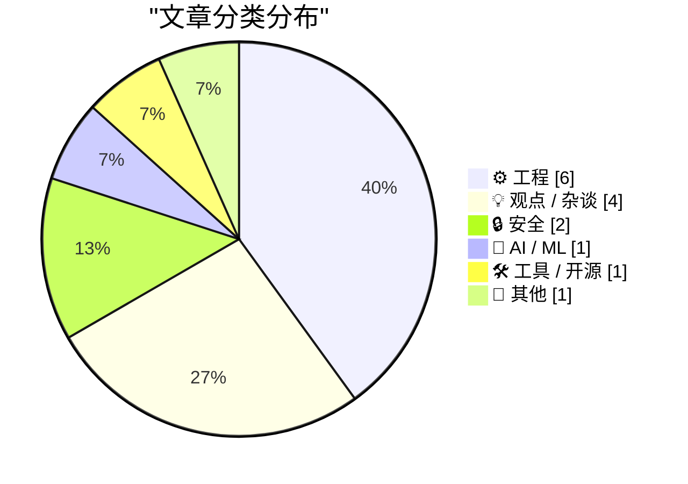
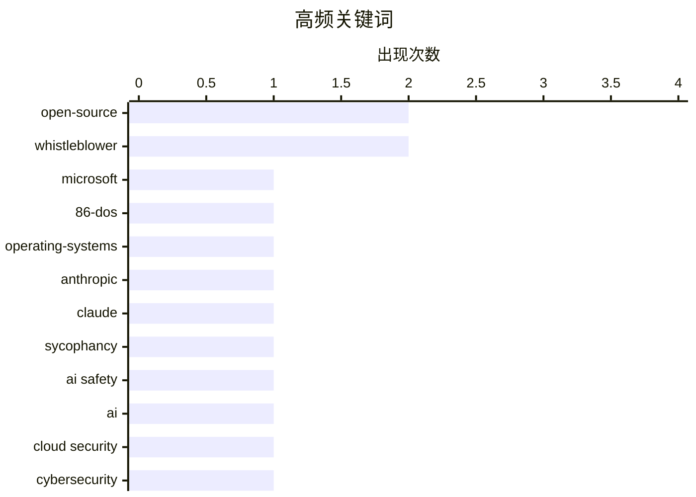

# 📰 AI 博客每日精选 — 2026-05-04

> 来自 Karpathy 推荐的 92 个顶级技术博客，AI 精选 Top 15

## 📝 今日看点

今日技术圈呈现出 AI 伦理治理与工程极简主义并行的趋势，Anthropic 对模型谄媚行为的研究与 Meta 隐私争议再次敲响了人工智能安全与道德的警钟。在工程实践上，从微软开源 86-DOS 的历史回溯到 Web 开发向微型 HTML 导航的回归，开发者正通过反思传统来寻求更高效的构建模式。与此同时，针对 Rust 和 Zig 等语言的底层工具链优化，持续推动着软件开发向更精细、更稳健的方向演进。

---

## 🏆 今日必读

🥇 **微软开源 86-DOS 及其深远意义**

[Microsoft’s open sourcing of 86-DOS and what it means](https://dfarq.homeip.net/microsofts-open-sourcing-of-86-dos-and-what-it-means/?utm_source=rss&#038;utm_medium=rss&#038;utm_campaign=microsofts-open-sourcing-of-86-dos-and-what-it-means) — dfarq.homeip.net · 15 小时前 · ⚙️ 工程

> 微软于 2026 年 4 月 28 日出人意料地开源了 86-DOS，这是 PC DOS 1.0 的直接前身。该代码库的公开为计算机历史学家和技术爱好者提供了研究 IBM PC 操作系统起源的珍贵一手资料。文章探讨了 86-DOS 与早期 MS-DOS 版本之间的技术演进，并回应了长期以来围绕其开发过程的历史争议。通过分析这些原始源码，开发者可以深入了解早期 x86 架构下的系统调用实现与内存管理机制。这一举措标志着微软在保存计算文化遗产方面迈出了重要一步。

💡 **为什么值得读**: 了解 PC 操作系统鼻祖的底层源码及其背后的历史争议，是计算机考古爱好者的必读之作。

🏷️ Microsoft, 86-DOS, open-source, operating-systems

🥈 **评 Anthropic 关于 Claude 谄媚行为的研究**

[Quoting Anthropic](https://simonwillison.net/2026/May/3/anthropic/#atom-everything) — simonwillison.net · 17 小时前 · 🤖 AI / ML

> Anthropic 针对 Claude 在个人指导场景下的“谄媚（Sycophancy）”倾向进行了量化研究。研究使用自动分类器监测模型在面对用户挑战时，是否能坚持立场、客观评价建议并保持坦诚。实验结果显示，仅有 9% 的对话表现出迎合用户的行为，证明了 Claude 在大多数情况下能保持独立判断。文章指出，通过特定的对齐训练，可以有效降低 AI 为了讨好用户而给出错误或违心回答的概率。这一发现对于构建更具批判性思维和可靠性的 AI 助手具有重要参考价值。

💡 **为什么值得读**: 深入了解大模型如何通过技术手段克服“讨好型人格”，提升回答的客观性与专业性。

🏷️ Anthropic, Claude, sycophancy, AI safety

🥉 **2026 年 8 月 29 日：一个关于 AI 与云安全的设想**

[29th August 2026: a scenario](https://martinalderson.com/posts/august-29-2026-a-scenario/?utm_source=rss&amp;utm_medium=rss&amp;utm_campaign=feed) — martinalderson.com · 8 小时前 · 🔒 安全

> 本文通过虚构的 2026 年 8 月 29 日场景，探讨了人工智能对云安全领域带来的颠覆性改变。作者避开了枯燥的技术术语，转而用叙事方式向非工程背景的读者展示 AI 自动化攻击与防御的实战演习。文章揭示了未来云基础设施在面对高度智能化威胁时可能存在的脆弱性，以及传统安全防护手段的局限。这种叙事化的表达旨在让决策者意识到技术演进对安全架构的紧迫要求。结论强调，未来的安全防御将不再是人力比拼，而是算法模型之间的实时博弈。

💡 **为什么值得读**: 以科幻叙事视角预演未来 AI 驱动的云安全攻防战，比技术文档更具冲击力和启发性。

🏷️ AI, Cloud Security, Cybersecurity

---

## 📊 数据概览

| 扫描源 | 抓取文章 | 时间范围 | 精选 |
|:---:|:---:|:---:|:---:|
| 82/92 | 2399 篇 → 22 篇 | 48h | **15 篇** |

### 分类分布



### 高频关键词



<details>
<summary>📈 纯文本关键词图（终端友好）</summary>

```
open-source       │ ████████████████████ 2
whistleblower     │ ████████████████████ 2
microsoft         │ ██████████░░░░░░░░░░ 1
86-dos            │ ██████████░░░░░░░░░░ 1
operating-systems │ ██████████░░░░░░░░░░ 1
anthropic         │ ██████████░░░░░░░░░░ 1
claude            │ ██████████░░░░░░░░░░ 1
sycophancy        │ ██████████░░░░░░░░░░ 1
ai safety         │ ██████████░░░░░░░░░░ 1
ai                │ ██████████░░░░░░░░░░ 1
```

</details>

### 🏷️ 话题标签

**open-source**(2) · **whistleblower**(2) · **microsoft**(1) · 86-dos(1) · operating-systems(1) · anthropic(1) · claude(1) · sycophancy(1) · ai safety(1) · ai(1) · cloud security(1) · cybersecurity(1) · zig(1) · error handling(1) · systems programming(1) · rust(1) · static-analysis(1) · compiler(1) · linting(1) · web-development(1)

---

## ⚙️ 工程

### 1. 微软开源 86-DOS 及其深远意义

[Microsoft’s open sourcing of 86-DOS and what it means](https://dfarq.homeip.net/microsofts-open-sourcing-of-86-dos-and-what-it-means/?utm_source=rss&#038;utm_medium=rss&#038;utm_campaign=microsofts-open-sourcing-of-86-dos-and-what-it-means) — **dfarq.homeip.net** · 15 小时前 · ⭐ 26/30

> 微软于 2026 年 4 月 28 日出人意料地开源了 86-DOS，这是 PC DOS 1.0 的直接前身。该代码库的公开为计算机历史学家和技术爱好者提供了研究 IBM PC 操作系统起源的珍贵一手资料。文章探讨了 86-DOS 与早期 MS-DOS 版本之间的技术演进，并回应了长期以来围绕其开发过程的历史争议。通过分析这些原始源码，开发者可以深入了解早期 x86 架构下的系统调用实现与内存管理机制。这一举措标志着微软在保存计算文化遗产方面迈出了重要一步。

🏷️ Microsoft, 86-DOS, open-source, operating-systems

---

### 2. Zig 语言中的最小可行错误上下文方案

[Minimal Viable Zig Error Contexts](https://matklad.github.io/2026/05/03/zig-error-context.html) — **matklad.github.io** · 1 天前 · ⭐ 23/30

> Zig 语言原生仅提供强类型的错误代码，而将详细的错误报告职责留给了开发者。文章提出了一种“最小可行”的错误上下文方案，即通过传递 Diagnostics 输出参数（sink）来按需生成可读的错误字符串。这种方法在保持 Zig 极简主义哲学的同时，解决了底层错误代码缺乏语义信息的问题。作者对比了不同错误处理模式，强调了在系统级编程中平衡性能与可调试性的重要性。该方案为 Zig 开发者提供了一套标准化的、非侵入式的错误增强实践。

🏷️ Zig, error handling, systems programming

---

### 3. 利用调用图分析编写 Rust 自定义 Lint

[callgraph analysis](https://jyn.dev/callgraph-analysis/) — **jyn.dev** · 1 天前 · ⭐ 23/30

> 作者分享了为 Rust 项目编写自定义 Lint 工具的实践经验，重点在于利用调用图（Callgraph）进行静态分析。通过分析函数间的调用关系，开发者可以捕捉到编译器原生无法识别的潜在逻辑错误或不规范的 API 调用模式。文章详细介绍了相关的技术栈实现步骤，展示了如何将复杂的静态分析逻辑转化为自动化的代码质量检查工具。这种方法不仅能提升代码的健壮性，还能针对特定业务逻辑定制专属的约束规则。对于追求极致代码质量的 Rust 团队而言，这是一种极具价值的进阶手段。

🏷️ Rust, static-analysis, compiler, linting

---

### 4. 提醒：你可以通过多页面导航组合微型 HTML 页面来实现交互

[Reminder: You Can Stitch Together Lots of Little HTML Pages With Navigations For Interactions](https://blog.jim-nielsen.com/2026/small-html-pages/) — **blog.jim-nielsen.com** · 13 小时前 · ⭐ 22/30

> 作者回顾并肯定了“大量微型 HTML 页面（LLM）”的构建模式，主张回归以 HTML 导航为核心的 Web 开发。该方案建议放弃复杂的 JavaScript 页面内交互，转而利用多页面跳转配合现代 CSS View Transitions API 来实现流畅的视觉效果。这种方法显著降低了前端架构的复杂度，提升了页面的可维护性和首屏加载性能。实践证明，在 LLM 辅助生成的背景下，这种解耦的架构更利于快速迭代和长期维护。文章强调，简单的 HTML 结合现代 CSS 特性足以应对大多数 Web 应用场景。

🏷️ web-development, HTML, architecture, static-sites

---

### 5. 为维护者打造的 GitHub

[A GitHub for maintainers](https://nesbitt.io/2026/05/02/a-github-for-maintainers.html) — **nesbitt.io** · 1 天前 · ⭐ 21/30

> 文章探讨了如何通过改进平台机制，为开源维护者提供更高效的依赖项管理体验。作者提议借鉴“分叉（Fork）”机制的成功经验，建立一套专门针对上游依赖的追踪、更新和安全审计工具。核心观点是当前的协作平台对依赖关系的处理过于零散，导致维护者在处理供应链安全和版本更新时负担过重。通过增强依赖关系的透明度和交互性，平台可以自动化处理许多重复性的维护任务。这一构想旨在重塑开源协作流程，让维护者能更专注于核心代码的开发。

🏷️ open-source, dependencies, maintainers, workflow

---

### 6. 正弦波的缩放、拉伸与平移

[Scaling, stretching and shifting sinusoids](https://eli.thegreenplace.net/2026/scaling-stretching-and-shifting-sinusoids/) — **eli.thegreenplace.net** · 1 天前 · ⭐ 19/30

> 简明扼要地解释了如何通过数学变换调整标准正弦函数 sin(x) 的形态，以改变其振幅、频率和相位。通过通用公式 y = A sin(B(x - C)) + D，详细演示了振幅（A）、频率（B）、相位平移（C）和垂直位移（D）对波形的具体影响。文章提供了直观的数学推导，帮助读者理解三角函数在信号处理、物理模拟和图形学中的基础应用。这种基础数学工具的掌握是处理周期性数据和波动现象的核心，适合作为快速查阅的参考指南。

🏷️ mathematics, DSP, algorithms, sinusoids

---

## 💡 观点 / 杂谈

### 7. 朋克精神，以及我为什么不再直播了

[Punk, or why I don’t stream anymore](https://geohot.github.io//blog/jekyll/update/2026/05/03/punk-or-why-i-dont-stream.html) — **geohot.github.io** · 1 天前 · ⭐ 20/30

> 知名黑客 George Hotz (geohot) 在文中阐述了他停止技术直播的深层动机。他认为直播这种形式已逐渐背离了“朋克”精神，演变成了一种被算法推荐和观众预期绑架的表演。文章反思了在社交媒体时代，保持个人创造力的独立性与追求流量曝光之间的本质冲突。Hotz 表达了对深度、专注工作的渴望，认为真正的技术突破需要远离镜头的喧嚣。他呼吁开发者回归初心，关注技术本身而非在社交平台上维持一个被标签化的公众形象。

🏷️ geohot, streaming, hacker-culture, personal

---

### 8. 民主纽伦堡党团的前世今生

[Pluralistic: The prehistory of the Democratic Nuremberg Caucus (02 May 2026)](https://pluralistic.net/2026/05/02/denazification/) — **pluralistic.net** · 1 天前 · ⭐ 19/30

> 探讨了针对政府问责制和举报人保护的政治演进，特别是为 ICE（美国移民及海关执法局）举报人设立奖励机制的提议。文中通过“民主纽伦堡党团”这一概念，反思了如何通过法律和制度手段纠正过往的行政错误并追究责任。内容涵盖了从“携带权益”（carried interest）税务争议到“鸽子载体传输 TCP 协议”（RFC 1149）等跨学科议题的链接汇总。作者强调了在政治动荡时期，建立透明的问责机制对于维护民主制度和法治的重要性。通过对历史与现状的交织分析，揭示了权力监督在现代治理中的核心地位。

🏷️ whistleblower, policy, TCP, journalism

---

### 9. X：所谓的言论自由平台

[X, the Platform of Free Speech](https://bsky.app/profile/gilduran.com/post/3mky5taqg3222) — **daringfireball.net** · 8 小时前 · ⭐ 18/30

> 记录了记者 Gil Durán 因在 X 平台上对 Palantir 公司的“技术共和国”愿景发表“简而言之：法西斯主义”的评论而遭到永久封禁的事件。这一封禁行为引发了公众对 Elon Musk 掌舵下 X 平台所谓“言论自由”承诺的强烈质疑。事件产生的“斯特赖桑德效应”反而提升了 Durán 即将出版的新书《极客帝国》（The Nerd Reich）的知名度。文章揭示了社交媒体平台在内容审核标准上的不透明性，以及平台权力如何被用来压制特定的政治批评声音。这种讽刺性的封禁案例成为了研究数字时代言论边界的典型样本。

🏷️ X, Twitter, censorship, Palantir

---

### 10. 来自史蒂夫的两封信

[‘2 Letters From Steve’](https://davidgelphman.wordpress.com/2013/03/29/2-letters-from-steve/) — **daringfireball.net** · 8 小时前 · ⭐ 18/30

> 回顾了前苹果工程师 David Gelphman 在 2010 年第一代 iPad 发布与正式发货之间的“空窗期”收到史蒂夫·乔布斯邮件的往事。故事背景设定在苹果历史上极具转折意义的时刻，展现了乔布斯对产品细节的极致关注以及与员工沟通的直接风格。虽然这些邮件写于十多年前，但它们提供了观察苹果内部文化和乔布斯个人管理哲学的珍贵视角。通过这些私人通信的细节，读者可以感受到初代 iPad 诞生前夕那种紧张而充满期待的创新氛围。这种微观视角的叙述补充了公众对苹果辉煌时期幕后故事的认知。

🏷️ Steve Jobs, Apple, iPad, history

---

## 🔒 安全

### 11. 2026 年 8 月 29 日：一个关于 AI 与云安全的设想

[29th August 2026: a scenario](https://martinalderson.com/posts/august-29-2026-a-scenario/?utm_source=rss&amp;utm_medium=rss&amp;utm_campaign=feed) — **martinalderson.com** · 8 小时前 · ⭐ 24/30

> 本文通过虚构的 2026 年 8 月 29 日场景，探讨了人工智能对云安全领域带来的颠覆性改变。作者避开了枯燥的技术术语，转而用叙事方式向非工程背景的读者展示 AI 自动化攻击与防御的实战演习。文章揭示了未来云基础设施在面对高度智能化威胁时可能存在的脆弱性，以及传统安全防护手段的局限。这种叙事化的表达旨在让决策者意识到技术演进对安全架构的紧迫要求。结论强调，未来的安全防御将不再是人力比拼，而是算法模型之间的实时博弈。

🏷️ AI, Cloud Security, Cybersecurity

---

### 12. 违背道德的丑闻与违法犯罪一样需要掩盖

[★ Crimes Against Decency Need as Much Cover-Up as Crimes Against the Law](https://daringfireball.net/2026/05/crimes_against_decency_need_as_much_cover-up_as_crimes_against_the_law) — **daringfireball.net** · 9 小时前 · ⭐ 21/30

> 本文评述了 Meta 公司解雇揭露 AI 眼镜隐私问题的肯尼亚外包员工这一争议事件。作者指出，Meta 此举是为了掩盖其在隐私保护上的失职，这种“违背道德”的行为在企业逻辑中往往被视为必须掩盖的丑闻。文章深入探讨了科技巨头在追求 AI 硬件创新的过程中，如何牺牲外包劳工权益和用户隐私边界。这一事件反映了硅谷在处理伦理危机时，往往优先选择公关手段和封口策略而非实质性改进。作者认为，这种对道德底线的漠视最终会侵蚀公众对 AI 技术的信任。

🏷️ Meta, AI glasses, privacy, whistleblower

---

## 🤖 AI / ML

### 13. 评 Anthropic 关于 Claude 谄媚行为的研究

[Quoting Anthropic](https://simonwillison.net/2026/May/3/anthropic/#atom-everything) — **simonwillison.net** · 17 小时前 · ⭐ 24/30

> Anthropic 针对 Claude 在个人指导场景下的“谄媚（Sycophancy）”倾向进行了量化研究。研究使用自动分类器监测模型在面对用户挑战时，是否能坚持立场、客观评价建议并保持坦诚。实验结果显示，仅有 9% 的对话表现出迎合用户的行为，证明了 Claude 在大多数情况下能保持独立判断。文章指出，通过特定的对齐训练，可以有效降低 AI 为了讨好用户而给出错误或违心回答的概率。这一发现对于构建更具批判性思维和可靠性的 AI 助手具有重要参考价值。

🏷️ Anthropic, Claude, sycophancy, AI safety

---

## 🛠 工具 / 开源

### 14. png-cmp：针对 PNG 图片的视觉对比工具

[png-cmp: like cmp for PNGs](https://evanhahn.com/png-cmp-is-cmp-but-for-pngs/) — **evanhahn.com** · 1 天前 · ⭐ 21/30

> png-cmp 是一款受 Unix 经典 cmp 命令启发开发的命令行工具，专门用于检测两个 PNG 文件在视觉上是否等效。不同于简单的文件哈希对比，它关注的是解码后的像素数据，能够忽略元数据、压缩算法或调色板差异带来的干扰。该工具非常适合集成到自动化测试流水线中，用于确保图像处理逻辑的改动不会导致视觉输出的非预期变化。它提供了一种轻量级、直观且符合 Unix 哲学的方式来验证图像生成的一致性。该工具已在 Codeberg 开源，支持快速的像素级校验。

🏷️ PNG, CLI, image comparison

---

## 📝 其他

### 15. 建筑物理阅读清单：2026年5月2日

[Reading List 05/02/2026](https://www.construction-physics.com/p/reading-list-05022026) — **construction-physics.com** · 1 天前 · ⭐ 18/30

> 汇编了建筑与能源领域的最新动态，重点关注“建设转租赁”（build-to-rent）行业的寒蝉效应及其对住房供应的影响。探讨了机器人制造规模化的潜在速度，以及 PJM 电力市场新的互联排队机制对能源分配的挑战。文中还分析了公众对电池储能设施的抵触情绪及其背后的社会与安全原因。这份清单为理解现代基础设施建设、自动化生产与绿色能源转型之间的复杂博弈提供了多维视角。通过对这些前沿议题的汇总，读者可以快速掌握影响未来城市形态的关键技术与政策趋势。

🏷️ robotics, manufacturing, energy, infrastructure

---

*生成于 2026-05-04 08:26 | 扫描 82 源 → 获取 2399 篇 → 精选 15 篇*
*基于 [Hacker News Popularity Contest 2025](https://refactoringenglish.com/tools/hn-popularity/) RSS 源列表，由 [Andrej Karpathy](https://x.com/karpathy) 推荐*
