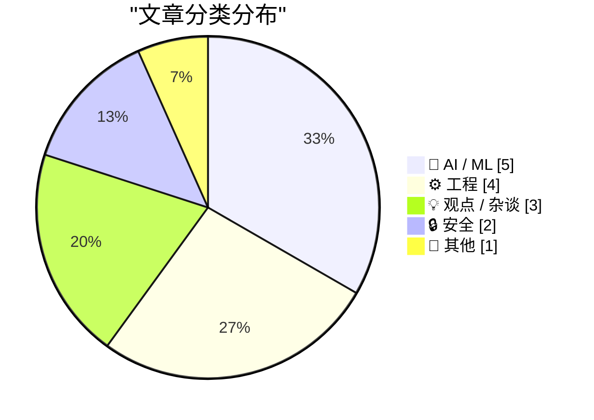
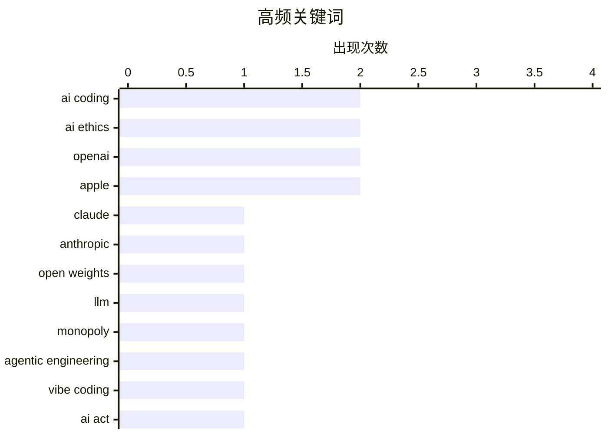

# 📰 May 7, 2026

> 来自 Karpathy 推荐的 92 个顶级技术博客，AI 精选 Top 15

## 📝 今日看点

AI 编程正从辅助生成迈向代理化新阶段，Anthropic 的最新发布与“氛围编程”的兴起标志着开发者工作流的根本性重塑。与此同时，开源权重的收紧与监管政策的滞后引发了行业对大模型垄断及治理失灵的深层忧虑。在硬件供应波动与 SEO 传统观念受挑战的背景下，技术圈也开始重新审视软件开发的工艺本质与独立生态的价值。

---

## 🏆 今日必读

🥇 **现场博客：2026 年 Code w/ Claude 大会**

[Live blog: Code w/ Claude 2026](https://simonwillison.net/2026/May/6/code-w-claude-2026/#atom-everything) — simonwillison.net · 17 小时前 · 🤖 AI / ML

> Anthropic 举办的 Code w/ Claude 开发者大会展示了 Claude 在编程领域的最新进展。核心发布围绕 Claude Code 命令行工具展开，旨在通过更深度的集成提升开发者的生产力。会议探讨了模型在理解复杂代码库、自动化重构以及处理长上下文方面的能力提升。Simon Willison 记录了主题演讲中关于 AI 编程范式转移的讨论，强调了从单纯的代码补全向代理式工程（Agentic Engineering）的转变。

💡 **为什么值得读**: 实时了解 Anthropic 在 AI 编程工具领域的最新布局和 Claude Code 的实战表现。

🏷️ Claude, Anthropic, AI Coding

🥈 **开放权重模型正悄然收紧——这是一个严重的问题**

[Open weights are quietly closing up - and that's a problem](https://martinalderson.com/posts/open-weights-are-quietly-closing-up/?utm_source=rss&amp;utm_medium=rss&amp;utm_campaign=feed) — martinalderson.com · 1 天前 · 🤖 AI / ML

> 开放权重模型（Open Weights）在制衡闭源大模型厂商定价权方面发挥着关键作用。然而，当前的趋势显示，领先的实验室正逐渐减少权重的开放程度，这可能导致市场被少数几家寡头垄断。如果缺乏开源替代品的竞争，消费者剩余将被厂商过度榨取，技术创新的民主化进程也将受阻。作者呼吁关注这种“伪开源”现象，以维持 AI 生态的健康竞争。

💡 **为什么值得读**: 深入探讨 AI 行业竞争格局，警示开源生态萎缩对开发者和成本控制的长期负面影响。

🏷️ open weights, LLM, AI ethics, monopoly

🥉 **“氛围编程”与代理工程的界限正变得模糊**

[Vibe coding and agentic engineering are getting closer than I'd like](https://simonwillison.net/2026/May/6/vibe-coding-and-agentic-engineering/#atom-everything) — simonwillison.net · 19 小时前 · 💡 观点 / 杂谈

> 随着 AI 编程工具的进化，“氛围编程”（Vibe Coding）与代理式工程（Agentic Engineering）正在发生令人不安的融合。开发者不再仅仅依赖 AI 生成代码片段，而是开始让 AI 代理自主处理复杂的工程任务。这种转变意味着编程范式正从精确的逻辑构建转向对 AI 意图的引导和验证。Simon Willison 分享了他在实际工作中观察到的这种趋势，并探讨了这种“黑盒化”开发对软件工程质量的潜在影响。

💡 **为什么值得读**: 探讨 AI 时代下程序员角色的本质变化，以及如何应对从“写代码”到“调教代理”的范式转移。

🏷️ AI Coding, Agentic Engineering, Vibe Coding

---

## 📊 数据概览

| 扫描源 | 抓取文章 | 时间范围 | 精选 |
|:---:|:---:|:---:|:---:|
| 82/92 | 2401 篇 → 37 篇 | 48h | **15 篇** |

### 分类分布



### 高频关键词



<details>
<summary>📈 纯文本关键词图（终端友好）</summary>

```
ai coding           │ ████████████████████ 2
ai ethics           │ ████████████████████ 2
openai              │ ████████████████████ 2
apple               │ ████████████████████ 2
claude              │ ██████████░░░░░░░░░░ 1
anthropic           │ ██████████░░░░░░░░░░ 1
open weights        │ ██████████░░░░░░░░░░ 1
llm                 │ ██████████░░░░░░░░░░ 1
monopoly            │ ██████████░░░░░░░░░░ 1
agentic engineering │ ██████████░░░░░░░░░░ 1
```

</details>

### 🏷️ 话题标签

**ai coding**(2) · **ai ethics**(2) · **openai**(2) · apple(2) · claude(1) · anthropic(1) · open weights(1) · llm(1) · monopoly(1) · agentic engineering(1) · vibe coding(1) · ai act(1) · regulation(1) · robotics(1) · safety(1) · api design(1) · sdk(1) · backward compatibility(1) · data breach(1) · shinyhunters(1)

---

## 🤖 AI / ML

### 1. 现场博客：2026 年 Code w/ Claude 大会

[Live blog: Code w/ Claude 2026](https://simonwillison.net/2026/May/6/code-w-claude-2026/#atom-everything) — **simonwillison.net** · 17 小时前 · ⭐ 26/30

> Anthropic 举办的 Code w/ Claude 开发者大会展示了 Claude 在编程领域的最新进展。核心发布围绕 Claude Code 命令行工具展开，旨在通过更深度的集成提升开发者的生产力。会议探讨了模型在理解复杂代码库、自动化重构以及处理长上下文方面的能力提升。Simon Willison 记录了主题演讲中关于 AI 编程范式转移的讨论，强调了从单纯的代码补全向代理式工程（Agentic Engineering）的转变。

🏷️ Claude, Anthropic, AI Coding

---

### 2. 开放权重模型正悄然收紧——这是一个严重的问题

[Open weights are quietly closing up - and that's a problem](https://martinalderson.com/posts/open-weights-are-quietly-closing-up/?utm_source=rss&amp;utm_medium=rss&amp;utm_campaign=feed) — **martinalderson.com** · 1 天前 · ⭐ 26/30

> 开放权重模型（Open Weights）在制衡闭源大模型厂商定价权方面发挥着关键作用。然而，当前的趋势显示，领先的实验室正逐渐减少权重的开放程度，这可能导致市场被少数几家寡头垄断。如果缺乏开源替代品的竞争，消费者剩余将被厂商过度榨取，技术创新的民主化进程也将受阻。作者呼吁关注这种“伪开源”现象，以维持 AI 生态的健康竞争。

🏷️ open weights, LLM, AI ethics, monopoly

---

### 3. 速度与合法性之战：监管已追不上 AI 的脚步

[The war between fast and legitimate is here](https://www.joanwestenberg.com/the-war-between-fast-and-legitimate-is-here/) — **joanwestenberg.com** · 8 小时前 · ⭐ 25/30

> 欧盟耗时四年制定的《AI 法案》在发布时已显得过时，因为 OpenAI 等公司仅用两个月就让 GPT-4 触达了亿级用户。监管机构对“高风险系统”的定义尚未尘埃落定，AI 技术已经历了数次迭代并演化出全新的形态。这种技术爆发速度与官僚立法周期之间的巨大鸿沟，导致法律框架难以有效约束快速演进的通用人工智能。文章指出，传统的监管模式在面对指数级增长的技术时正面临前所未有的失效危机。

🏷️ AI Act, regulation, OpenAI

---

### 4. 阿西莫夫三定律对现代 AI 而言仅仅是建议

[Asimov's three laws are merely a suggestion](https://idiallo.com/blog/asimov-three-laws-dont-work-with-ai?src=feed) — **idiallo.com** · 21 小时前 · ⭐ 24/30

> 阿西莫夫的机器人三定律在逻辑上看似完美，但在现代 AI 的实际应用中却难以落地。由于 LLM 等系统缺乏对“伤害”和“命令”的物理理解，这些定律在复杂的现实场景中往往变成了一纸空谈。AI 的对齐问题比科幻小说中描述的更为复杂，涉及道德边界、多重指令冲突以及不可预测的涌现行为。作者认为，将简单的逻辑规则强加给黑盒模型并不能解决安全性问题，我们需要更深层的技术手段而非文学准则。

🏷️ AI ethics, robotics, safety

---

### 5. 苹果因虚假宣传未上线的 AI 功能支付 2.5 亿美元达成集体诉讼和解

[Apple Settles Class Action Lawsuit Over AI Features That Were Advertised but Didn’t Ship for $250 Million](https://9to5mac.com/2026/05/05/apple-reaches-250m-settlement-over-siri-delays-users-could-get-up-to-95-per-device/) — **daringfireball.net** · 1 天前 · ⭐ 22/30

> 苹果公司因在 WWDC 2024 上承诺但未能如期交付“更具个性化的 Siri”等 AI 功能，面临集体诉讼并最终达成 2.5 亿美元的和解协议。根据和解条款，受影响的用户每台设备预计可获得 25 美元赔偿，最高可达 95 美元。这起诉讼凸显了科技巨头在营销前沿 AI 技术时，若实际进度与宣传不符所面临的法律风险。该事件为行业敲响了警钟，即 AI 功能的跳票不仅是技术挑战，更可能演变为昂贵的法律代价。

🏷️ Apple, Siri, Lawsuit

---

## ⚙️ 工程

### 6. 为什么 API 行为不能取决于你链接的 SDK 版本？

[Why not have changes in API behavior depend on the SDK you link against?](https://devblogs.microsoft.com/oldnewthing/20260506-00/?p=112303) — **devblogs.microsoft.com/oldnewthing** · 19 小时前 · ⭐ 24/30

> 开发者常提议让 API 的行为根据编译时链接的 SDK 版本自动切换，以实现向后兼容。然而，Raymond Chen 指出这种方案在面对静态库时会彻底失效，因为同一个二进制文件可能链接了不同 SDK 编译的多个库。这种不一致会导致运行时行为的混乱，甚至引发难以调试的崩溃。Windows 最终选择通过清单文件（Manifest）或显式的版本化 API 来解决此类问题，而非依赖 SDK 链接。

🏷️ API design, SDK, backward compatibility

---

### 7. RSS 订阅为我带来的流量竟然超过了谷歌

[RSS Feeds Send Me More Traffic Than Google](https://shkspr.mobi/blog/2026/05/rss-feeds-send-me-more-traffic-than-google/) — **shkspr.mobi** · 1 天前 · ⭐ 23/30

> 作者通过分析个人博客的访问数据发现，RSS 订阅源带来的流量已经超过了谷歌搜索。尽管这只是一个个案，但它挑战了“SEO 为王”的传统观念，显示了忠实读者群体的价值。作者并未刻意进行激进的 SEO 优化，而是专注于语义化布局和元数据维护，让内容在订阅器中更易读。这一现象表明，在算法推荐泛滥的今天，RSS 这种去中心化的内容分发方式依然具有强大的生命力。

🏷️ RSS, SEO, web traffic

---

### 8. Claris 首席执行官 Ryan McCann 谈代理编码时代的 FileMaker

[Claris CEO Ryan McCann on FileMaker in the Age of Agentic Coding](https://www.claris.com/blog/2026/how-claris-is-building-for-what-comes-next) — **daringfireball.net** · 14 小时前 · ⭐ 21/30

> 在 AI 自动生成代码（Agentic Coding）兴起的背景下，Claris 首席执行官 Ryan McCann 探讨了低代码平台的新定位。他指出，尽管 AI 可以快速生成应用逻辑，但应用仍面临数据库存储、用户认证、权限控制及备份恢复等底层运维难题。Claris 旨在为 AI 生成的应用提供一个现成的、安全的运行环境，解决“代码生成后如何部署与管理”的痛点。文章强调，在 AI 时代，像 FileMaker 这样成熟的低代码基础设施将成为 AI 代理的最佳落地载体。

🏷️ FileMaker, Agentic Coding, Low-code

---

### 9. SQLAlchemy 2 实战 - 第 7 章：异步 SQLAlchemy

[SQLAlchemy 2 In Practice - Chapter 7: Asynchronous SQLAlchemy](https://blog.miguelgrinberg.com/post/sqlalchemy-2-in-practice---chapter-7-asynchronous-sqlalchemy) — **miguelgrinberg.com** · 12 小时前 · ⭐ 21/30

> 本章深入讲解了 SQLAlchemy 2.0 中基于 asyncio 的异步编程支持，这是现代 Python 异步 Web 开发的核心技能。文章详细介绍了如何配置 create_async_engine 以及如何正确管理 AsyncSession 的生命周期。通过对比同步模式，展示了使用 await 关键字执行数据库查询的具体实现路径。对于使用 FastAPI 或 Sanic 等异步框架的开发者，掌握这些异步数据库操作模式能显著提升高并发场景下的应用性能。

🏷️ SQLAlchemy, Python, asynchronous, database

---

## 💡 观点 / 杂谈

### 10. “氛围编程”与代理工程的界限正变得模糊

[Vibe coding and agentic engineering are getting closer than I'd like](https://simonwillison.net/2026/May/6/vibe-coding-and-agentic-engineering/#atom-everything) — **simonwillison.net** · 19 小时前 · ⭐ 25/30

> 随着 AI 编程工具的进化，“氛围编程”（Vibe Coding）与代理式工程（Agentic Engineering）正在发生令人不安的融合。开发者不再仅仅依赖 AI 生成代码片段，而是开始让 AI 代理自主处理复杂的工程任务。这种转变意味着编程范式正从精确的逻辑构建转向对 AI 意图的引导和验证。Simon Willison 分享了他在实际工作中观察到的这种趋势，并探讨了这种“黑盒化”开发对软件工程质量的潜在影响。

🏷️ AI Coding, Agentic Engineering, Vibe Coding

---

### 11. 软件是痴迷与表达的乘积

[★ Software as the Product of Obsession Times Voice](https://daringfireball.net/2026/05/software_as_the_product_of_obsession_times_voice) — **daringfireball.net** · 1 天前 · ⭐ 23/30

> 文章探讨了软件开发的本质，将其定义为开发者“痴迷程度”与“个人表达（Voice）”的乘积。作者批评了当前一种纯粹将软件视为实现目的之手段、而忽视其艺术性和工艺性的倾向。这种“软件脑”思维导致了设计质量的严重下滑，因为开发者不再关注软件作为一种创作媒介的独特性。真正的优秀软件应当是开发者对细节的极致追求与独特设计见解的产物，而非单纯的功能堆砌。

🏷️ software design, craftsmanship, product philosophy

---

### 12. 我应该感到惊艳吗？

[Am I Meant To Be Impressed?](https://www.wheresyoured.at/am-i-meant-to-be-impressed/) — **wheresyoured.at** · 18 小时前 · ⭐ 23/30

> 针对当前 NVIDIA、Anthropic 和 OpenAI 等巨头营造的 AI 繁荣景象，文章提出了尖锐的质疑与批判。作者认为，尽管技术演示看似惊人，但在实际生产力转化和商业逻辑上仍存在巨大鸿沟。通过分析 AI 行业的估值泡沫与高昂的订阅成本，揭示了技术叙事与现实应用之间的脱节。核心观点指出，不应盲目追随大厂的宣传口号，而应审视这些技术是否真正解决了核心问题。

🏷️ AI industry, NVIDIA, OpenAI

---

## 🔒 安全

### 13. Troy Hunt 每周更新 502 期

[Weekly Update 502](https://www.troyhunt.com/weekly-update-502/) — **troyhunt.com** · 1 天前 · ⭐ 24/30

> 本期更新重点关注了黑客组织 ShinyHunters 如何利用极少的资源和经验，频繁攻破大型跨国品牌的防御。这些黑客大多是青少年或二十出头的年轻人，他们并非仅靠高超的技术，而是通过对供应链和凭据管理的精准杠杆打击实现目标。Troy Hunt 强调了当前企业在面对这种非对称威胁时的脆弱性，尤其是数据泄露后的连锁反应。此外，文章还简要提及了近期其他重大安全漏洞和数据泄露事件的后续影响。

🏷️ data breach, ShinyHunters, cybersecurity

---

### 14. 包管理器威胁模型

[Package Manager Threat Models](https://nesbitt.io/2026/05/05/package-manager-threat-models.html) — **nesbitt.io** · 1 天前 · ⭐ 23/30

> 软件供应链安全不仅限于代码漏洞（CVE），更涉及包管理器的运营与信任机制。文章深入探讨了抢注域名（Typosquatting）、依赖混淆（Dependency Confusion）以及账户接管等非技术性漏洞威胁。通过分析 npm、PyPI 等主流仓库的防御策略，揭示了双因子认证（2FA）、命名空间所有权和包签名在构建安全生态中的核心作用。开发者必须理解包管理器的信任边界，才能在依赖管理中有效规避供应链攻击。

🏷️ package manager, threat model, security

---

## 📝 其他

### 15. 内存短缺加剧，苹果削减 Mac Studio 和 Mac Mini 配置选项

[Apple Cuts More Mac Studio and Mac Mini RAM Options as Memory Shortage Worsens](https://www.macrumors.com/2026/05/05/apple-mac-studio-mac-mini-ram-cuts/) — **daringfireball.net** · 1 天前 · ⭐ 23/30

> 受全球内存短缺影响，苹果已从其在线商店中移除了多款高配桌面 Mac。目前 Mac mini 已不再提供 32GB 和 64GB 内存版本，而搭载 M3 Ultra 的 Mac Studio 也取消了 256GB 的顶配选项。目前 M3 Ultra 仅剩 96GB 配置可选，且 M3/M4 Max 系列机型的预计发货时间已延长至 9 到 10 周。这一举动反映了供应链压力对高端计算设备市场的直接冲击。

🏷️ Apple, Hardware, Supply Chain

---

*生成于 2026-05-07 09:54 | 扫描 82 源 → 获取 2401 篇 → 精选 15 篇*
*基于 [Hacker News Popularity Contest 2025](https://refactoringenglish.com/tools/hn-popularity/) RSS 源列表，由 [Andrej Karpathy](https://x.com/karpathy) 推荐*
