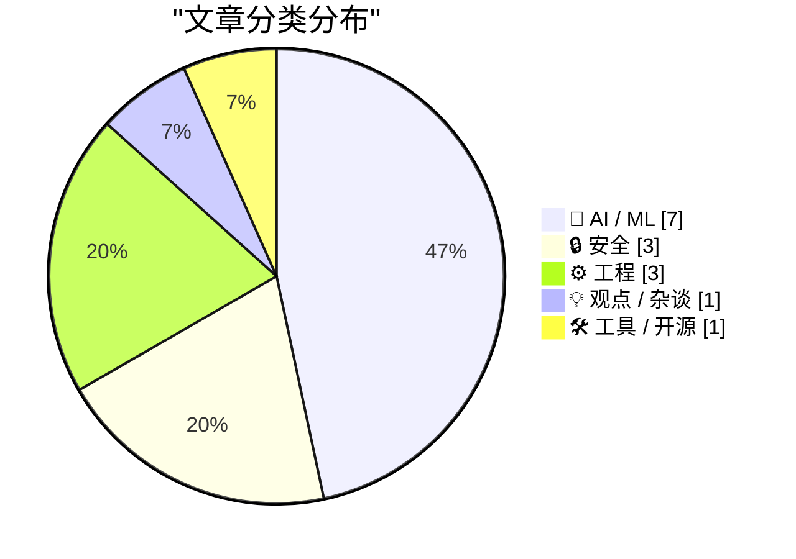
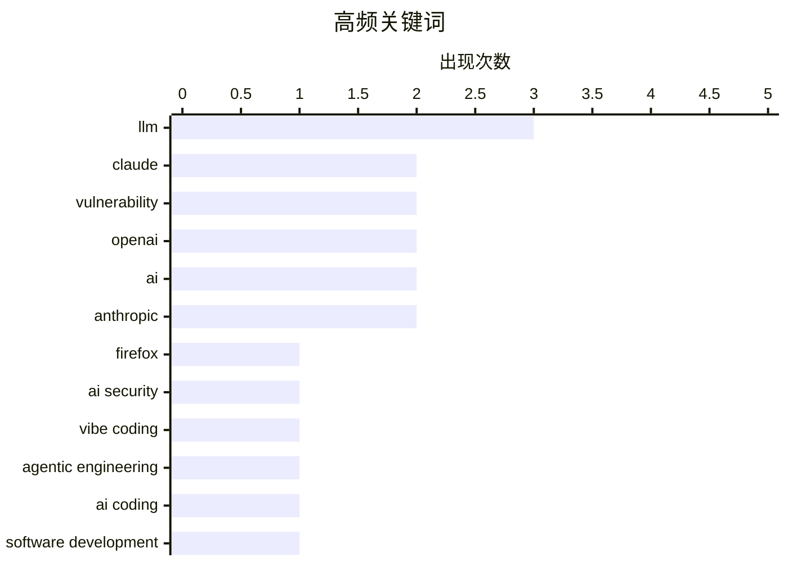

# 📰 May 8, 2026

> 来自 Karpathy 推荐的 92 个顶级技术博客，AI 精选 Top 15

## 📝 今日看点

AI 正在从辅助工具进化为重塑开发范式的核心力量，Anthropic 与 xAI 的算力联姻及 Claude 在代码修复上的突破，标志着代理工程与“氛围编程”正深度融合。然而，技术的狂飙突进也带来了严峻的安全挑战，Linux 内核漏洞与 Canvas 勒索事件迫使业界反思软件供应链的脆弱性。在效率与风险的博弈中，AI 监管的滞后与商业模式的实际价值正面临前所未有的审视与质疑。

---

## 🏆 今日必读

🥇 **幕后揭秘：利用 Claude Mythos 预览版强化 Firefox 安全性**

[Behind the Scenes Hardening Firefox with Claude Mythos Preview](https://simonwillison.net/2026/May/7/firefox-claude-mythos/#atom-everything) — simonwillison.net · 13 小时前 · 🔒 安全

> Mozilla 披露了如何利用 Anthropic 的 Claude Mythos 预览版模型，在 Firefox 庞大的代码库中定位并修复了数百个安全漏洞。过去 AI 生成的漏洞报告质量参差不齐，但 Mythos 展示了极高的准确性，能够识别复杂的内存安全问题。该方案标志着 AI 从简单的代码补全演进为能够进行深度安全审计的专家工具。通过这种自动化强化手段，Firefox 显著提升了其抵御零日攻击的能力。

💡 **为什么值得读**: 揭示了顶级浏览器厂商如何将最前沿的 AI 模型应用于核心安全工程，展示了 AI 在复杂系统漏洞挖掘中的实战潜力。

🏷️ Firefox, Claude, Vulnerability, AI Security

🥈 **“氛围编程”与代理工程正趋于融合，这令我有些不安**

[Vibe coding and agentic engineering are getting closer than I'd like](https://simonwillison.net/2026/May/6/vibe-coding-and-agentic-engineering/#atom-everything) — simonwillison.net · 1 天前 · 💡 观点 / 杂谈

> Simon Willison 在播客中探讨了 AI 编程范式的转变，指出“氛围编程”（Vibe Coding）与“代理工程”（Agentic Engineering）正在他的日常工作中发生合流。开发者正从编写具体逻辑转向通过设定意图（氛围）来驱动 AI 代理自主完成复杂任务。这种转变虽然极大提升了效率，但也引发了关于工程控制权和代码理解深度的担忧。文章强调，AI 编码工具已不再仅仅是辅助助手，而是逐渐演变为具备自主决策能力的工程实体。

💡 **为什么值得读**: 深入探讨了 AI 编程的最新趋势，帮助开发者理解从“写代码”到“指挥 AI 代理”这一职业角色的深刻转变。

🏷️ Vibe Coding, Agentic Engineering, AI Coding, Software Development

🥉 **也许你最近该暂时停止安装新软件**

[Maybe you shouldn't install new software for a bit](https://xeiaso.net/blog/2026/abstain-from-install/) — xeiaso.net · 1 天前 · 🔒 安全

> 针对近期频繁爆发的 Linux 内核漏洞，作者建议用户在短期内审慎对待新软件的安装和系统更新。文章指出，当前的软件供应链和内核层存在较高的安全风险，盲目追求最新版本可能引入未修复的严重漏洞。这种“软件禁欲”策略旨在规避处于爆发期的零日攻击风险。作者认为，在安全补丁完全稳定之前，保持现有环境的静态比追求新功能更重要。

💡 **为什么值得读**: 针对近期 Linux 安全态势的警示，提醒开发者和运维人员在漏洞高发期采取保守的防御策略。

🏷️ Linux, kernel, vulnerability

---

## 📊 数据概览

| 扫描源 | 抓取文章 | 时间范围 | 精选 |
|:---:|:---:|:---:|:---:|
| 82/92 | 2419 篇 → 40 篇 | 48h | **15 篇** |

### 分类分布



### 高频关键词



<details>
<summary>📈 纯文本关键词图（终端友好）</summary>

```
llm                 │ ████████████████████ 3
claude              │ █████████████░░░░░░░ 2
vulnerability       │ █████████████░░░░░░░ 2
openai              │ █████████████░░░░░░░ 2
ai                  │ █████████████░░░░░░░ 2
anthropic           │ █████████████░░░░░░░ 2
firefox             │ ███████░░░░░░░░░░░░░ 1
ai security         │ ███████░░░░░░░░░░░░░ 1
vibe coding         │ ███████░░░░░░░░░░░░░ 1
agentic engineering │ ███████░░░░░░░░░░░░░ 1
```

</details>

### 🏷️ 话题标签

**llm**(3) · **claude**(2) · **vulnerability**(2) · openai(2) · ai(2) · anthropic(2) · firefox(1) · ai security(1) · vibe coding(1) · agentic engineering(1) · ai coding(1) · software development(1) · linux(1) · kernel(1) · ai act(1) · regulation(1) · policy(1) · nvidia(1) · industry analysis(1) · xai(1)

---

## 🤖 AI / ML

### 1. “速度”与“合法性”之战已经打响

[The war between fast and legitimate is here](https://www.joanwestenberg.com/the-war-between-fast-and-legitimate-is-here/) — **joanwestenberg.com** · 1 天前 · ⭐ 25/30

> 文章探讨了 AI 技术的指数级增长与政府监管滞后之间的尖锐矛盾。欧盟耗时四年制定的《AI 法案》在发布时，其定义的“高风险系统”早已被 OpenAI 等公司快速迭代的技术甩在身后。监管机构试图用传统的法律框架约束瞬息万变的生成式 AI，导致法律条文在生效前就已过时。这种“快技术”与“慢法律”的冲突，正迫使社会重新思考如何在不扼杀创新的前提下建立有效的治理机制。

🏷️ AI Act, regulation, OpenAI, policy

---

### 2. 我该为此感到惊艳吗？

[Am I Meant To Be Impressed?](https://www.wheresyoured.at/am-i-meant-to-be-impressed/) — **wheresyoured.at** · 1 天前 · ⭐ 25/30

> 作者对当前 AI 行业的狂热氛围提出了尖锐质疑，审视了 NVIDIA、Anthropic 和 OpenAI 等巨头的商业模式。文章通过详尽的财务和技术分析，探讨了巨额资本投入与实际产出价值之间的脱节。作者认为，尽管 AI 在特定领域表现出色，但行业宣传的 AGI 愿景往往掩盖了其高昂的能源成本和不可持续的增长路径。核心观点指出，公众不应被宏大的叙事所迷惑，而应关注 AI 技术的实际落地效果与社会代价。

🏷️ AI, NVIDIA, OpenAI, industry analysis

---

### 3. 关于 xAI 与 Anthropic 数据中心交易的观察

[Notes on the xAI/Anthropic data center deal](https://simonwillison.net/2026/May/7/xai-anthropic/#atom-everything) — **simonwillison.net** · 14 小时前 · ⭐ 24/30

> 在 Anthropic 的 Code w/ Claude 活动中，最引人注目的消息是其与 xAI 达成的协议，将使用后者 Colossus 数据中心的全部算力容量。Colossus 是由 Elon Musk 旗下的 xAI 建设的超大规模设施，因使用大量燃气轮机供电而备受争议。这一合作凸显了当前顶级 AI 模型对算力的极度饥渴，甚至促使竞争对手在基础设施层面达成深度绑定。文章分析了这一交易对 Anthropic 未来模型训练能力及行业格局的潜在影响。

🏷️ Anthropic, xAI, Data Center, GPU

---

### 4. 现场直播：Code w/ Claude 2026 开发者大会

[Live blog: Code w/ Claude 2026](https://simonwillison.net/2026/May/6/code-w-claude-2026/#atom-everything) — **simonwillison.net** · 1 天前 · ⭐ 24/30

> 本文是 Anthropic 举办的 Code w/ Claude 2026 活动的现场实录，重点介绍了 Claude 在编程领域的最新进展。活动发布了针对开发者优化的新功能，旨在进一步提升 Claude Code 的自动化水平和代码理解力。直播涵盖了主题演讲中关于模型推理能力提升、长上下文处理以及与开发环境深度集成的技术细节。Anthropic 明确展示了其将 Claude 打造为全自动软件工程代理的野心。

🏷️ Anthropic, Claude, AI Event, LLM

---

### 5. 为什么长程训练没有放缓 AI 的进步速度？

[Why hasn't longer-horizon training slowed AI progress?](https://seangoedecke.com/why-hasnt-longer-horizon-training-slowed-ai-progress/) — **seangoedecke.com** · 1 天前 · ⭐ 24/30

> 作者回应了 Dwarkesh Patel 关于 AI 进步速度的公开挑战，探讨了为何在任务复杂度增加的情况下，AI 的发展并未如预期般减速。文章分析了长程训练（Long-horizon training）中的效率补偿机制，指出算法优化和架构改进抵消了计算成本的上升。通过对扩展定律（Scaling Laws）的深入解读，作者解释了模型如何在处理多步骤复杂推理时保持进化节奏。结论认为，AI 领域的进步并非仅靠堆砌算力，而是源于对训练数据和学习效率的持续压榨。

🏷️ AI Progress, Training, LLM, Efficiency

---

### 6. 阿西莫夫的三大定律仅仅是一个建议

[Asimov's three laws are merely a suggestion](https://idiallo.com/blog/asimov-three-laws-dont-work-with-ai?src=feed) — **idiallo.com** · 1 天前 · ⭐ 23/30

> 文章批判性地审视了阿西莫夫的“机器人三定律”在现代 AI 背景下的局限性，认为这些科幻设定无法作为现实的安全约束。作者指出，当前的 AI 系统基于概率和模式识别运行，并不具备理解或执行抽象道德准则的能力。在复杂的现实场景中，什么是“伤害”往往难以定义，导致简单的逻辑指令在处理边界案例时失效。文章呼吁建立更具技术可行性的安全框架，而不是依赖过时的哲学隐喻来约束日益强大的 AI。

🏷️ AI safety, robotics, ethics

---

### 7. Claris 首席执行官 Ryan McCann 谈代理式编程时代的 FileMaker

[Claris CEO Ryan McCann on FileMaker in the Age of Agentic Coding](https://www.claris.com/blog/2026/how-claris-is-building-for-what-comes-next) — **daringfireball.net** · 1 天前 · ⭐ 22/30

> Claris CEO Ryan McCann 探讨了在 AI 自动生成代码（Agentic Coding）时代，低代码平台 FileMaker 的核心价值。他指出 AI 虽然能快速生成应用逻辑，但无法解决数据库托管、身份验证、权限管理及备份恢复等底层基础设施问题。FileMaker 提供了一个集成的运行环境，能够承接 AI 生成的应用，解决其部署和安全管理的“最后一公里”难题。这种策略将 AI 视为应用构建的加速器，而将 FileMaker 定位为 AI 应用落地的稳固基座。通过这种方式，企业可以更安全地利用 AI 提升开发效率，同时保持系统的稳健性。

🏷️ AI, agentic coding, low-code

---

## 🔒 安全

### 8. 幕后揭秘：利用 Claude Mythos 预览版强化 Firefox 安全性

[Behind the Scenes Hardening Firefox with Claude Mythos Preview](https://simonwillison.net/2026/May/7/firefox-claude-mythos/#atom-everything) — **simonwillison.net** · 13 小时前 · ⭐ 26/30

> Mozilla 披露了如何利用 Anthropic 的 Claude Mythos 预览版模型，在 Firefox 庞大的代码库中定位并修复了数百个安全漏洞。过去 AI 生成的漏洞报告质量参差不齐，但 Mythos 展示了极高的准确性，能够识别复杂的内存安全问题。该方案标志着 AI 从简单的代码补全演进为能够进行深度安全审计的专家工具。通过这种自动化强化手段，Firefox 显著提升了其抵御零日攻击的能力。

🏷️ Firefox, Claude, Vulnerability, AI Security

---

### 9. 也许你最近该暂时停止安装新软件

[Maybe you shouldn't install new software for a bit](https://xeiaso.net/blog/2026/abstain-from-install/) — **xeiaso.net** · 1 天前 · ⭐ 25/30

> 针对近期频繁爆发的 Linux 内核漏洞，作者建议用户在短期内审慎对待新软件的安装和系统更新。文章指出，当前的软件供应链和内核层存在较高的安全风险，盲目追求最新版本可能引入未修复的严重漏洞。这种“软件禁欲”策略旨在规避处于爆发期的零日攻击风险。作者认为，在安全补丁完全稳定之前，保持现有环境的静态比追求新功能更重要。

🏷️ Linux, kernel, vulnerability

---

### 10. Canvas 数据泄露事件导致全美学校及大学陷入瘫痪

[Canvas Breach Disrupts Schools & Colleges Nationwide](https://krebsonsecurity.com/2026/05/canvas-breach-disrupts-schools-colleges-nationwide/) — **krebsonsecurity.com** · 4 小时前 · ⭐ 24/30

> 广泛使用的教育技术平台 Canvas 遭遇大规模数据勒索攻击，导致全美范围内的大量学校和大学课程中断。网络犯罪组织篡改了服务的登录页面并索要赎金，威胁要泄露来自近 9,000 个教育机构的 2.75 亿学生和教职员工的数据。此次攻击不仅造成了严重的教学秩序混乱，还引发了对敏感个人信息泄露的巨大担忧。这是教育领域近年来规模最大的安全事件之一，暴露了中心化教育平台在面对勒索软件时的脆弱性。

🏷️ Data Breach, Canvas, Cybersecurity, Ransomware

---

## ⚙️ 工程

### 11. 程序员逻辑学新进展（以及本简报的未来）

[New Logic for Programmers (and the future of this newsletter)](https://buttondown.com/hillelwayne/archive/new-logic-for-programmers-and-the-future-of-this/) — **buttondown.com/hillelwayne** · 1 天前 · ⭐ 23/30

> 《程序员逻辑学》（Logic for Programmers）电子书发布了 0.14 版本，该版本在 0.13 的基础上进行了大量重写，重点优化了排版、文案编辑和技术校对。作者 Hillel Wayne 已开始进行实体书的印刷测试，标志着该项目从纯数字化向出版阶段迈进。书中涵盖了形式化方法、逻辑推导等对提升编程思维至关重要的底层理论。此次更新还涉及作者个人简报订阅方式的调整，旨在为读者提供更稳定的内容输出。作者计划在未来将更多精力投入到书籍的最终完成和物理出版中。

🏷️ logic, formal methods, education

---

### 12. SQLAlchemy 2 实战 - 第 7 章：异步 SQLAlchemy

[SQLAlchemy 2 In Practice - Chapter 7: Asynchronous SQLAlchemy](https://blog.miguelgrinberg.com/post/sqlalchemy-2-in-practice---chapter-7-asynchronous-sqlalchemy) — **miguelgrinberg.com** · 1 天前 · ⭐ 23/30

> 本章深入探讨了 SQLAlchemy 自 1.4 版本起引入并在 2.0 版本中完善的 asyncio 异步编程支持。技术核心在于使用 create_async_engine 创建异步引擎，并通过 AsyncSession 管理异步数据库事务。文章详细演示了如何配合 aiosqlite 或 asyncpg 等异步驱动程序，在 FastAPI 或 Quart 等异步框架中实现非阻塞的数据库操作。相比传统的同步模式，异步 SQLAlchemy 能够显著提升高并发场景下的 I/O 吞吐能力。文中还提供了完整的代码示例，展示了从模型定义到异步查询的完整链路。

🏷️ Python, SQLAlchemy, asynchronous, database

---

### 13. 关于故障处理的随笔

[Notes on incidents](https://seangoedecke.com/notes-on-incidents/) — **seangoedecke.com** · 7 小时前 · ⭐ 21/30

> 故障处理（Incidents）在现实中往往是枯燥且充满等待的，而非充满英雄主义的即时修复。作者指出，大部分线上故障实际上会随着时间推移自行恢复，或者在等待部署、调查结果的过程中逐渐明朗。相比于寻找“英雄程序员”的瞬间灵感，建立稳定的监控体系和耐心的排查流程更为关键。文章强调了在压力环境下保持冷静的重要性，并反思了过度干预可能带来的负面影响。有效的故障管理应侧重于团队协作和信息同步，而非单纯的技术突击。

🏷️ Incident Management, SRE, DevOps, Engineering Culture

---

## 💡 观点 / 杂谈

### 14. “氛围编程”与代理工程正趋于融合，这令我有些不安

[Vibe coding and agentic engineering are getting closer than I'd like](https://simonwillison.net/2026/May/6/vibe-coding-and-agentic-engineering/#atom-everything) — **simonwillison.net** · 1 天前 · ⭐ 26/30

> Simon Willison 在播客中探讨了 AI 编程范式的转变，指出“氛围编程”（Vibe Coding）与“代理工程”（Agentic Engineering）正在他的日常工作中发生合流。开发者正从编写具体逻辑转向通过设定意图（氛围）来驱动 AI 代理自主完成复杂任务。这种转变虽然极大提升了效率，但也引发了关于工程控制权和代码理解深度的担忧。文章强调，AI 编码工具已不再仅仅是辅助助手，而是逐渐演变为具备自主决策能力的工程实体。

🏷️ Vibe Coding, Agentic Engineering, AI Coding, Software Development

---

## 🛠 工具 / 开源

### 15. llm-gemini 0.31 版本发布

[llm-gemini 0.31](https://simonwillison.net/2026/May/7/llm-gemini/#atom-everything) — **simonwillison.net** · 11 小时前 · ⭐ 21/30

> Simon Willison 发布了 llm-gemini 插件的 0.31 版本，核心更新是将 gemini-3.1-flash-lite 模型标记为正式商用版（GA）。该模型此前处于预览阶段，现在用户可以通过 LLM 命令行工具稳定调用这一轻量级、高性能的 Google 模型。Flash-Lite 版本在保持极快响应速度的同时，进一步降低了推理成本，非常适合大规模文本处理任务。此次更新确保了工具链与 Google 最新 API 状态的同步，提升了开发者调用 Gemini 系列模型的便捷性。该插件支持流式输出和多轮对话，是命令行使用 LLM 的利器。

🏷️ LLM, Gemini, CLI, Google Cloud

---

*生成于 2026-05-08 07:52 | 扫描 82 源 → 获取 2419 篇 → 精选 15 篇*
*基于 [Hacker News Popularity Contest 2025](https://refactoringenglish.com/tools/hn-popularity/) RSS 源列表，由 [Andrej Karpathy](https://x.com/karpathy) 推荐*
