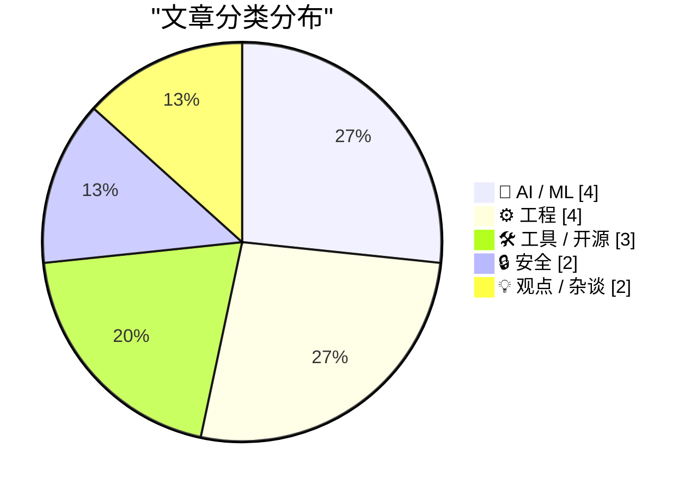
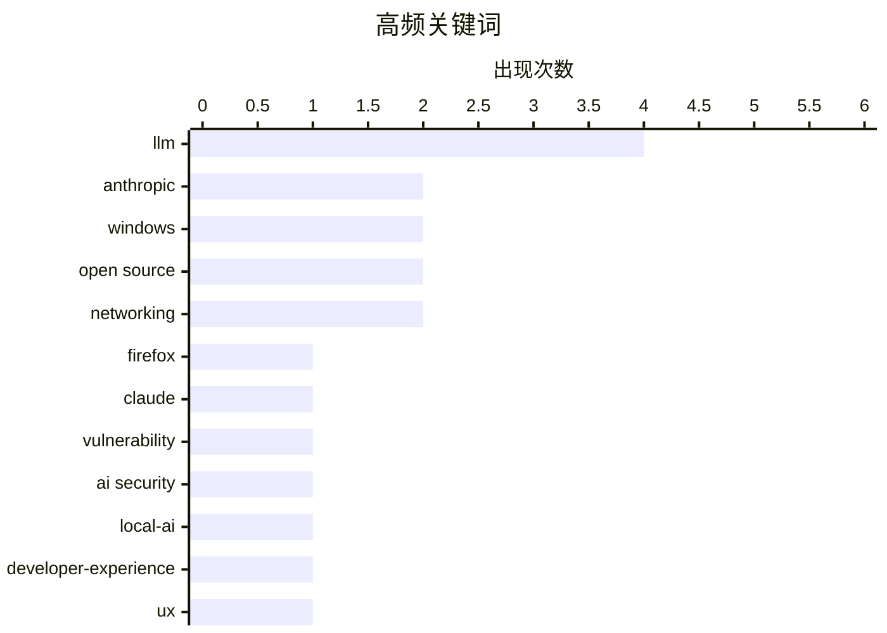

# 📰 May 9, 2026

> 来自 Karpathy 推荐的 92 个顶级技术博客，AI 精选 Top 15

## 📝 今日看点

AI 算力竞赛与行业可持续性成为焦点，Anthropic 在扩张基础设施的同时，其背后的“循环经济”融资模式正面临深度审视。技术落地方面，AI 正在从简单的对话工具演变为加固浏览器安全及优化结构化输出的核心生产力，而本地模型的可用性仍是开发者关注的痛点。此外，Canvas 遭遇的大规模数据勒索事件再次警示了关键教育基础设施在网络攻击面前的脆弱性。

---

## 🏆 今日必读

🥇 **幕后故事：利用 Claude Mythos 预览版加固 Firefox 浏览器**

[Behind the Scenes Hardening Firefox with Claude Mythos Preview](https://simonwillison.net/2026/May/7/firefox-claude-mythos/#atom-everything) — simonwillison.net · 1 天前 · 🔒 安全

> Mozilla 团队利用 Anthropic 的 Claude Mythos 预览版对 Firefox 浏览器进行了深度的安全加固。通过向 AI 提供代码库访问权限，Mozilla 成功定位并修复了数百个此前难以发现的安全漏洞。这一转变标志着 AI 生成的漏洞报告质量从过去的“低质量干扰”进化到了具备极高实战价值的阶段。作者详细介绍了如何通过提示词工程和上下文注入让 AI 理解复杂的 C++ 代码逻辑。最终，这种 AI 辅助审计模式显著提升了 Firefox 的内存安全性和整体防御能力。

💡 **为什么值得读**: 揭示了顶级浏览器厂商如何利用最前沿的 AI 模型进行大规模自动化漏洞挖掘的实战案例。

🏷️ Firefox, Claude, vulnerability, AI security

🥈 **追求极致：打磨本地模型的可用性与专注度**

[Pushing Local Models With Focus And Polish](https://lucumr.pocoo.org/2026/5/8/local-models/) — lucumr.pocoo.org · 1 天前 · 🤖 AI / ML

> 本文探讨了本地大模型在编程场景中的现状，表达了对本地模型达到“开箱即用”且具备竞争力的迫切需求。作者指出，目前的本地编程助手在体验上往往难以维持五分钟，导致用户频繁切换回托管 API。文章强调了本地化对开发者实验自由度的重要性，认为不应将所有创新都锁定在闭源 API 之后。作者呼吁通过更专注的打磨和优化，让本地模型在实际开发流程中真正变得可用。

💡 **为什么值得读**: 深入探讨了本地模型与云端 API 在开发者体验上的差距，以及为何本地化对软件开发的未来至关重要。

🏷️ LLM, local-AI, developer-experience, UX

🥉 **关于 xAI 与 Anthropic 数据中心交易的观察**

[Notes on the xAI/Anthropic data center deal](https://simonwillison.net/2026/May/7/xai-anthropic/#atom-everything) — simonwillison.net · 1 天前 · 🤖 AI / ML

> Anthropic 在 Code w/ Claude 活动中宣布了一项重大交易，将租用 SpaceX/xAI 旗下 Colossus 数据中心的所有算力资源。Colossus 是目前全球规模最大的 AI 超算集群之一，但也因使用燃气轮机发电而面临空气污染许可等环境争议。这一合作反映了顶级 AI 实验室对算力的极度饥渴，甚至不惜与竞争对手达成基础设施共享协议。文章还分析了这一举动对 Anthropic 模型训练能力和未来竞争格局的潜在影响。

💡 **为什么值得读**: 揭示了 AI 巨头之间在算力短缺背景下的“竞合”关系，以及超大规模数据中心背后的环境代价。

🏷️ Anthropic, xAI, data center, GPU

---

## 📊 数据概览

| 扫描源 | 抓取文章 | 时间范围 | 精选 |
|:---:|:---:|:---:|:---:|
| 82/92 | 2405 篇 → 36 篇 | 48h | **15 篇** |

### 分类分布



### 高频关键词



<details>
<summary>📈 纯文本关键词图（终端友好）</summary>

```
llm           │ ████████████████████ 4
anthropic     │ ██████████░░░░░░░░░░ 2
windows       │ ██████████░░░░░░░░░░ 2
open source   │ ██████████░░░░░░░░░░ 2
networking    │ ██████████░░░░░░░░░░ 2
firefox       │ █████░░░░░░░░░░░░░░░ 1
claude        │ █████░░░░░░░░░░░░░░░ 1
vulnerability │ █████░░░░░░░░░░░░░░░ 1
ai security   │ █████░░░░░░░░░░░░░░░ 1
local-ai      │ █████░░░░░░░░░░░░░░░ 1
```

</details>

### 🏷️ 话题标签

**llm**(4) · **anthropic**(2) · **windows**(2) · open source(2) · networking(2) · firefox(1) · claude(1) · vulnerability(1) · ai security(1) · local-ai(1) · developer-experience(1) · ux(1) · xai(1) · data center(1) · gpu(1) · ai economy(1) · venture capital(1) · canvas(1) · data breach(1) · cybersecurity(1)

---

## 🤖 AI / ML

### 1. 追求极致：打磨本地模型的可用性与专注度

[Pushing Local Models With Focus And Polish](https://lucumr.pocoo.org/2026/5/8/local-models/) — **lucumr.pocoo.org** · 1 天前 · ⭐ 27/30

> 本文探讨了本地大模型在编程场景中的现状，表达了对本地模型达到“开箱即用”且具备竞争力的迫切需求。作者指出，目前的本地编程助手在体验上往往难以维持五分钟，导致用户频繁切换回托管 API。文章强调了本地化对开发者实验自由度的重要性，认为不应将所有创新都锁定在闭源 API 之后。作者呼吁通过更专注的打磨和优化，让本地模型在实际开发流程中真正变得可用。

🏷️ LLM, local-AI, developer-experience, UX

---

### 2. 关于 xAI 与 Anthropic 数据中心交易的观察

[Notes on the xAI/Anthropic data center deal](https://simonwillison.net/2026/May/7/xai-anthropic/#atom-everything) — **simonwillison.net** · 1 天前 · ⭐ 26/30

> Anthropic 在 Code w/ Claude 活动中宣布了一项重大交易，将租用 SpaceX/xAI 旗下 Colossus 数据中心的所有算力资源。Colossus 是目前全球规模最大的 AI 超算集群之一，但也因使用燃气轮机发电而面临空气污染许可等环境争议。这一合作反映了顶级 AI 实验室对算力的极度饥渴，甚至不惜与竞争对手达成基础设施共享协议。文章还分析了这一举动对 Anthropic 模型训练能力和未来竞争格局的潜在影响。

🏷️ Anthropic, xAI, data center, GPU

---

### 3. 深度解析：AI 行业的循环经济怪圈

[Premium: AI's Circular Psychosis](https://www.wheresyoured.at/premium-ais-circular-psychosis/) — **wheresyoured.at** · 17 小时前 · ⭐ 26/30

> 本文犀利地揭示了 AI 行业中存在的“循环经济”乱象，将其形容为一种“循环精神病”。作者以 Anthropic 为例，指出这些 AI 公司目前并没有足够的收入来支付巨额的云服务账单，其运营资金主要依赖于投资。而这些投资往往又流回了作为投资者的云服务巨头手中，形成了一个缺乏实际产出的资金闭环。文章警告称，这种依赖外部输血而非真实业务盈利的模式正面临严重的泡沫风险。

🏷️ AI economy, Anthropic, venture capital, LLM

---

### 4. 使用 Claude Code：HTML 在结构化输出中的惊人效果

[Using Claude Code: The Unreasonable Effectiveness of HTML](https://simonwillison.net/2026/May/8/unreasonable-effectiveness-of-html/#atom-everything) — **simonwillison.net** · 11 小时前 · ⭐ 24/30

> Anthropic 的 Claude Code 团队成员 Thariq Shihipar 提出，在请求 AI 生成结构化内容时，HTML 相比 Markdown 具有“不合理的有效性”。通过将 HTML 作为输出格式，AI 能够更精确地表达复杂的 UI 组件、交互逻辑和嵌套结构。文章展示了多个实战案例，证明 HTML 能够显著降低 AI 在处理复杂布局时的幻觉率。作者还提供了一系列针对性的提示词建议，帮助开发者利用这一特性提升代码生成的质量。

🏷️ Claude Code, HTML, LLM, prompting

---

## ⚙️ 工程

### 5. 利用 ReadDirectoryChangesW 跟踪重命名操作的可靠方法

[Developing more confidence when tracking renames via Read­Directory­ChangesW](https://devblogs.microsoft.com/oldnewthing/20260508-00/?p=112310) — **devblogs.microsoft.com/oldnewthing** · 18 小时前 · ⭐ 23/30

> 在 Windows 系统中使用 ReadDirectoryChangesW API 跟踪文件重命名操作时，仅依赖文件名变化往往不够可靠。Raymond Chen 建议通过跟踪文件 ID（File ID）来增强监控的准确性。由于文件 ID 在重命名过程中保持不变，开发者可以将其作为唯一标识符来匹配重命名的前后期状态。这种方法有效解决了在高并发文件操作下，重命名通知可能出现的配对失败或歧义问题。

🏷️ Windows, Win32, file-system, API

---

### 6. 升级资源字符串至 Unicode 时务必添加 L 前缀

[When you upgrade your resource strings to Unicode, don’t forget to specify the L prefix](https://devblogs.microsoft.com/oldnewthing/20260507-00/?p=112307) — **devblogs.microsoft.com/oldnewthing** · 1 天前 · ⭐ 23/30

> 在将 C++ 资源字符串升级为 Unicode 编码时，开发者常犯的一个错误是忘记添加 L 前缀。如果没有这个前缀，编译器会将字符串视为多字节字符集，并将其映射回 8 位的代码页，从而导致字符丢失或乱码。文章强调了在 .rc 文件和代码中保持一致性的重要性，以确保 Unicode 字符能够被正确处理。这是一个典型的由于遗留系统迁移导致的隐蔽 Bug，特别是在处理国际化支持时。

🏷️ C++, Unicode, Windows, programming

---

### 7. WebRTC 的设计缺陷：为什么它会主动丢弃你的语音数据

[Quoting Luke Curley](https://simonwillison.net/2026/May/9/luke-curley/#atom-everything) — **simonwillison.net** · 7 小时前 · ⭐ 20/30

> WebRTC 协议为了追求极低延迟，在网络状况不佳时会采取激进的丢包策略，导致语音通话出现严重失真。Luke Curley 指出，这种“宁可丢弃也不延迟”的设计逻辑在现代高带宽环境下已显得过时，尤其是在处理 AI 提示词等需要数据完整性的场景中。相比之下，用户往往更愿意接受短暂的延迟以换取清晰、完整的音频质量。文章探讨了 MoQ（Media over QUIC）等新兴协议如何通过更灵活的权衡来解决 WebRTC 的固有弊端。这种技术演进反映了实时通信需求从单纯的“快”向“质”的转变。

🏷️ WebRTC, latency, networking, audio

---

### 8. 伯尼的周末：识别那些“名存实亡”的软件依赖

[Weekend at Bernie’s](https://nesbitt.io/2026/05/08/weekend-at-bernies.html) — **nesbitt.io** · 22 小时前 · ⭐ 20/30

> 借用电影《伯尼的周末》中“伪装尸体”的桥段，作者探讨了现代软件开发中那些已经停止维护却仍在被广泛使用的依赖项。许多项目表面上看起来运行正常，实则核心维护者早已离去，安全漏洞和兼容性问题正被掩盖在看似稳定的 API 之下。开发者需要建立更敏锐的审计机制，识别哪些库是真正的活跃项目，哪些只是被社区惯性“架着走”的僵尸代码。忽视这些“名存实亡”的依赖将为生产环境埋下巨大的安全隐患。维护软件供应链的健康，首先要学会从表面繁荣中识别出真正的技术债务。

🏷️ dependencies, maintenance, supply chain

---

## 🛠 工具 / 开源

### 9. Zig Fmt 使用与实现技巧指南

[Steering Zig Fmt](https://matklad.github.io/2026/05/08/steering-zig-fmt.html) — **matklad.github.io** · 1 天前 · ⭐ 23/30

> 本文分享了高效使用 Zig 语言官方格式化工具 zig fmt 的两个核心技巧。作者不仅面向 Zig 开发者提供了实用的配置建议，还从实现者的角度探讨了代码格式化器的逻辑设计。文章重点讨论了如何通过特定的代码结构引导格式化工具输出更具可读性的结果。对于正在学习 Zig 语言或对编译器前端工具链感兴趣的读者，这些经验具有很强的参考价值。

🏷️ Zig, formatter, developer-tools

---

### 10. llm-gemini 0.31 版本发布

[llm-gemini 0.31](https://simonwillison.net/2026/May/7/llm-gemini/#atom-everything) — **simonwillison.net** · 1 天前 · ⭐ 22/30

> 开发者 Simon Willison 发布了 llm-gemini 插件的 0.31 版本。该版本最核心的更新是正式支持了 Google 的 gemini-3.1-flash-lite 模型，该模型现已结束预览状态进入正式商用（GA）。作为一款主打轻量化和高响应速度的模型，Flash-Lite 在保持较低延迟的同时提供了出色的推理能力。用户现在可以通过 LLM 命令行工具直接调用这一最新的稳定版模型进行各类任务处理。

🏷️ Gemini, LLM, open source, Google

---

### 11. 在 FreeBSD 上使用 LibreNMS 监控你的设备

[Monitor your devices with LibreNMS on FreeBSD](https://it-notes.dragas.net/2026/05/07/monitor-your-services-with-librenms-on-freebsd/) — **it-notes.dragas.net** · 1 天前 · ⭐ 20/30

> LibreNMS 是一款基于 PHP、MySQL 和 SNMP 的开源网络监控工具，被认为是比 Zabbix 更轻量且易于上手的替代方案。本文详细介绍了在 FreeBSD 系统环境下部署 LibreNMS 的完整流程，包括环境配置、自动发现功能的使用以及告警系统的设置。LibreNMS 能够自动识别网络中的服务器、交换机等设备，并生成直观的性能图表和流量数据。对于追求系统稳定性和简洁性的运维人员，FreeBSD 与 LibreNMS 的组合提供了一个高效的监控基石。该方案特别适合需要快速部署且不希望系统资源被监控工具过度占用的场景。

🏷️ LibreNMS, FreeBSD, monitoring, networking

---

## 🔒 安全

### 12. 幕后故事：利用 Claude Mythos 预览版加固 Firefox 浏览器

[Behind the Scenes Hardening Firefox with Claude Mythos Preview](https://simonwillison.net/2026/May/7/firefox-claude-mythos/#atom-everything) — **simonwillison.net** · 1 天前 · ⭐ 27/30

> Mozilla 团队利用 Anthropic 的 Claude Mythos 预览版对 Firefox 浏览器进行了深度的安全加固。通过向 AI 提供代码库访问权限，Mozilla 成功定位并修复了数百个此前难以发现的安全漏洞。这一转变标志着 AI 生成的漏洞报告质量从过去的“低质量干扰”进化到了具备极高实战价值的阶段。作者详细介绍了如何通过提示词工程和上下文注入让 AI 理解复杂的 C++ 代码逻辑。最终，这种 AI 辅助审计模式显著提升了 Firefox 的内存安全性和整体防御能力。

🏷️ Firefox, Claude, vulnerability, AI security

---

### 13. Canvas 数据泄露事件导致全美多所学校教学中断

[Canvas Breach Disrupts Schools & Colleges Nationwide](https://krebsonsecurity.com/2026/05/canvas-breach-disrupts-schools-colleges-nationwide/) — **krebsonsecurity.com** · 1 天前 · ⭐ 25/30

> 广泛使用的教育技术平台 Canvas 遭遇大规模数据勒索攻击，导致全美多所中小学和大学的教学活动中断。网络犯罪组织通过篡改登录页面发布勒索声明，声称已窃取来自近 9,000 个教育机构的 2.75 亿名学生和教职员工的数据。此次攻击不仅造成了服务停摆，还面临严重的隐私泄露风险。目前相关机构正在紧急评估受损范围，并应对黑客提出的赎金要求。

🏷️ Canvas, data breach, cybersecurity, ransomware

---

## 💡 观点 / 杂谈

### 14. 网络自由意志主义令人无法忍受的虚伪

[The Intolerable Hypocrisy of Cyberlibertarianism](https://matduggan.com/the-intolerable-hypocrisy-of-cyberlibertarianism/) — **matduggan.com** · 1 天前 · ⭐ 22/30

> 互联网早期精神倡导的“网络自由意志主义”在现实中正面临严重的逻辑崩塌。作者通过对比纸质地图时代的低效与现代互联网的便利，指出许多宣扬去中心化和绝对自由的技术精英，实际上极度依赖于他们所抨击的中心化基础设施和政府监管保护。这种意识形态往往忽视了互联网作为公共产品的社会责任，导致了平台垄断与用户权利的失衡。技术圈需要重新审视技术与权力的真实关系，而非沉溺于虚幻的无政府主义理想。最终，这种虚伪性正在破坏互联网作为开放平台的根基。

🏷️ cyberlibertarianism, tech ethics, internet history, ideology

---

### 15. 自由如“特里布尔”：开源软件的新隐喻

[Free as in Tribbles](https://nesbitt.io/2026/05/07/free-as-in-tribbles.html) — **nesbitt.io** · 1 天前 · ⭐ 21/30

> 继“免费啤酒”和“免费小狗”之后，作者提出了“自由如特里布尔（Tribbles）”这一新隐喻来描述现代开源软件的现状。特里布尔是《星际迷航》中一种繁殖极快、看似可爱却会迅速消耗所有资源的生物。开源项目在引入初期往往显得轻量且免费，但随着依赖链的指数级膨胀，它们会像特里布尔一样迅速占领并消耗整个系统的维护资源。这种失控的复杂性使得开发者在享受便利的同时，不得不面对沉重的技术债。开发者必须意识到，每一个新增的依赖都可能演变成一场无法收拾的资源灾难。

🏷️ open source, OSS sustainability, software maintenance

---

*生成于 2026-05-09 08:06 | 扫描 82 源 → 获取 2405 篇 → 精选 15 篇*
*基于 [Hacker News Popularity Contest 2025](https://refactoringenglish.com/tools/hn-popularity/) RSS 源列表，由 [Andrej Karpathy](https://x.com/karpathy) 推荐*
