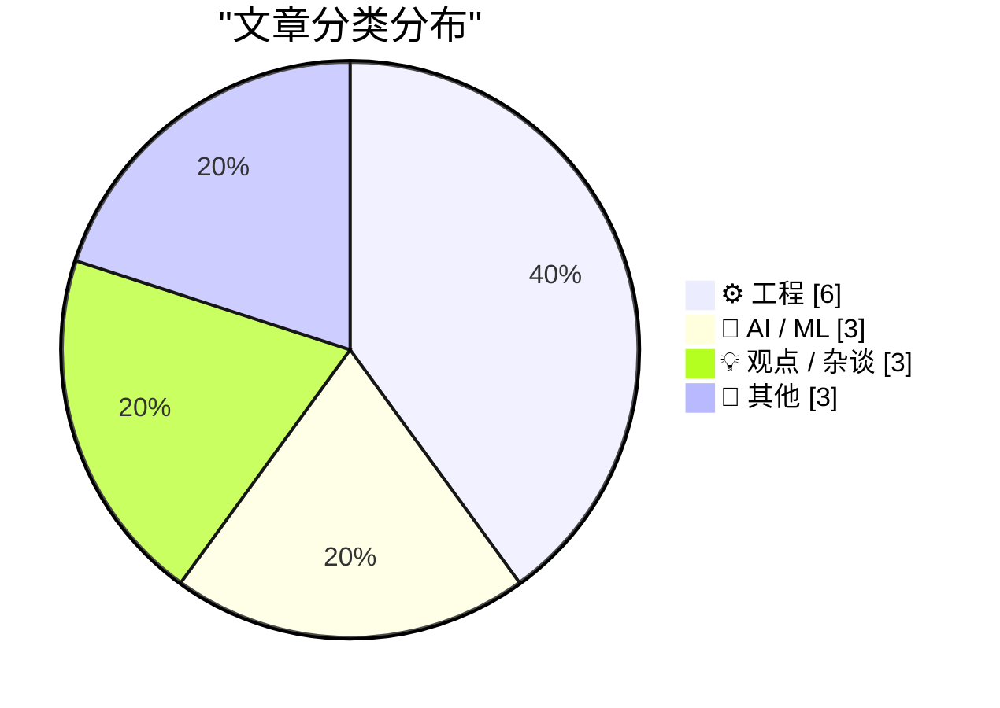
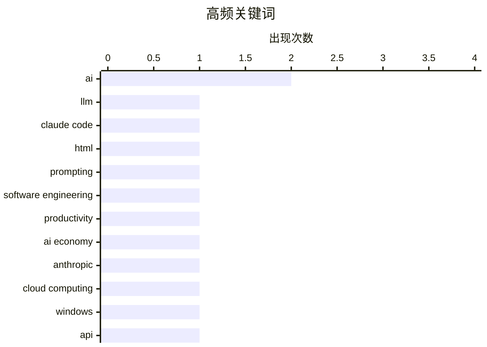

# 📰 May 10, 2026

> 来自 Karpathy 推荐的 92 个顶级技术博客，AI 精选 Top 15

## 📝 今日看点

AI 正在从宏观叙事转向深度实践，开发者开始重新审视 HTML 输出与 WebRTC 协议等底层适配，同时警惕其背后的财务泡沫与奇点幻象。开源生态的健康度引发广泛关注，虚假的活跃指标与“僵尸项目”正掩盖着供应链中真实的安全与维护危机。此外，从 Windows 文件追踪到极低频潜艇通信，技术边界的探索依然在工程细节与物理极限中稳步推进。

---

## 🏆 今日必读

🥇 **使用 Claude Code：HTML 作为输出格式的惊人效果**

[Using Claude Code: The Unreasonable Effectiveness of HTML](https://simonwillison.net/2026/May/8/unreasonable-effectiveness-of-html/#atom-everything) — simonwillison.net · 1 天前 · 🤖 AI / ML

> Anthropic 的 Claude Code 团队成员 Thariq Shihipar 提出，在请求 LLM 生成结构化内容时，HTML 比 Markdown 更具优势。HTML 拥有更丰富的语义标签和更严谨的结构，能有效减少 Markdown 在处理复杂嵌套或多媒体内容时的歧义。通过提供专门的示例网站和提示词建议，作者展示了 HTML 如何让 AI 生成的界面更具交互性和表现力。这种方法利用了 LLM 对 Web 标准的深度理解，从而提升了 AI 工具的输出质量和用户体验。结论是开发者应重新审视 HTML 作为 AI 协作首选格式的潜力。

💡 **为什么值得读**: 本文为提示词工程（Prompt Engineering）提供了新思路，展示了如何利用 HTML 提升 AI 输出的结构化能力。

🏷️ LLM, Claude Code, HTML, prompting

🥈 **AI 让平庸的工程师减少危害**

[AI makes weak engineers less harmful](https://seangoedecke.com/ai-makes-weak-engineers-less-harmful/) — seangoedecke.com · 1 天前 · 💡 观点 / 杂谈

> 软件工程能力呈现长尾分布，顶尖工程师产出巨大，而平庸工程师往往因制造 Bug 而产生负向产出。AI（如 LLM）的介入正在改变这一现状，它能自动处理样板代码、基础逻辑并进行初步纠错。这使得原本可能拖累项目的低水平开发者能够独立完成任务，减少了同事修复其错误的时间成本。AI 实际上提高了工程能力的底线，将原本的“负值”产出拉升至“零”或“正值”。作者认为，AI 的最大价值不在于让天才更强，而在于降低了平庸者对团队的破坏力。

💡 **为什么值得读**: 从独特的管理视角探讨了 AI 如何改变团队人才结构和生产力分布。

🏷️ AI, software engineering, productivity

🥉 **AI 的循环心理危机：不可持续的财务怪圈**

[Premium: AI's Circular Psychosis](https://www.wheresyoured.at/premium-ais-circular-psychosis/) — wheresyoured.at · 1 天前 · 🤖 AI / ML

> 当前的 AI 经济正陷入一种危险的循环模式，Anthropic 等头部公司的财务状况极度依赖云服务巨头的注资。这些公司通过融资获得资金，但大部分资金随即以“云服务费”的形式回流给亚马逊或谷歌等投资者。这种模式掩盖了 AI 公司目前缺乏真实盈利能力的事实，形成了一个巨大的财务泡沫。如果外部投资放缓或云成本持续高企，这种缺乏外部现金流入的循环将难以为继。作者警告称，这种“左手倒右手”的经济结构预示着 AI 行业可能面临严重的估值修正。

💡 **为什么值得读**: 深入剖析了 AI 巨头背后脆弱的财务逻辑，适合关注行业趋势和投资风险的读者。

🏷️ AI economy, Anthropic, cloud computing

---

## 📊 数据概览

| 扫描源 | 抓取文章 | 时间范围 | 精选 |
|:---:|:---:|:---:|:---:|
| 83/92 | 2435 篇 → 21 篇 | 48h | **15 篇** |

### 分类分布



### 高频关键词



<details>
<summary>📈 纯文本关键词图（终端友好）</summary>

```
ai                   │ ████████████████████ 2
llm                  │ ██████████░░░░░░░░░░ 1
claude code          │ ██████████░░░░░░░░░░ 1
html                 │ ██████████░░░░░░░░░░ 1
prompting            │ ██████████░░░░░░░░░░ 1
software engineering │ ██████████░░░░░░░░░░ 1
productivity         │ ██████████░░░░░░░░░░ 1
ai economy           │ ██████████░░░░░░░░░░ 1
anthropic            │ ██████████░░░░░░░░░░ 1
cloud computing      │ ██████████░░░░░░░░░░ 1
```

</details>

### 🏷️ 话题标签

**ai**(2) · **llm**(1) · **claude code**(1) · html(1) · prompting(1) · software engineering(1) · productivity(1) · ai economy(1) · anthropic(1) · cloud computing(1) · windows(1) · api(1) · file system(1) · webrtc(1) · networking(1) · latency(1) · streaming(1) · open source(1) · metrics(1) · project health(1)

---

## ⚙️ 工程

### 1. 利用 ReadDirectoryChangesW 提高文件重命名追踪的可靠性

[Developing more confidence when tracking renames via Read­Directory­ChangesW](https://devblogs.microsoft.com/oldnewthing/20260508-00/?p=112310) — **devblogs.microsoft.com/oldnewthing** · 1 天前 · ⭐ 23/30

> 在 Windows 系统中使用 ReadDirectoryChangesW 监控文件重命名时，开发者常面临事件关联不明确的挑战。通过引入文件 ID（File ID）追踪机制，可以利用 GetFileInformationByHandleEx 获取文件的唯一标识。这种方法允许程序在接收到重命名通知时，通过对比文件 ID 确信“旧名称”和“新名称”指向的是同一个物理文件。这解决了标准通知在并发操作或复杂文件系统变动时的歧义问题。结论是，结合文件 ID 是构建稳健文件监控系统的关键技术手段。

🏷️ Windows, API, file system

---

### 2. WebRTC 是 AI 语音交互的障碍

[Quoting Luke Curley](https://simonwillison.net/2026/May/9/luke-curley/#atom-everything) — **simonwillison.net** · 1 天前 · ⭐ 22/30

> WebRTC 协议的设计初衷是优先保证低延迟，因此在网络波动时会激进地丢弃音频包。这种设计虽然适合人类通话，但对 AI 模型却是灾难性的，因为丢包会导致语音转文字（STT）出现严重畸变。Luke Curley 指出，用户在与 AI 交流时，宁愿多等几百毫秒以换取清晰的音频，也不愿让 AI 接收损坏的数据。目前的 WebRTC 实现缺乏针对 AI 场景的权衡配置，导致 AI 无法准确理解用户指令。文章呼吁针对 AI 语音交互需求，重新调整流媒体传输协议的优先级。

🏷️ WebRTC, networking, latency, streaming

---

### 3. 开源界的“僵尸项目”现象

[Weekend at Bernie’s](https://nesbitt.io/2026/05/08/weekend-at-bernies.html) — **nesbitt.io** · 1 天前 · ⭐ 21/30

> 许多现代软件依赖的开源项目实际上处于“僵尸”状态，即表面上有自动化脚本或微小改动在维持活跃度，但核心维护早已停滞。这种现象被称为“Weekend at Bernie’s”，掩盖了供应链中巨大的安全和维护风险。开发者往往被虚假的活跃提交记录所误导，直到出现重大漏洞时才发现无人修复。文章强调，识别哪些依赖项只是在“戴着墨镜装活人”是现代工程管理的重要技能。结论是，必须加强对深层依赖项真实维护状态的审查。

🏷️ dependencies, supply chain, maintenance

---

### 4. 极低频通信：潜艇通信的物理极限

[extremely low frequencies](https://computer.rip/2026-05-09-extremely-low-frequencies.html) — **computer.rip** · 1 天前 · ⭐ 20/30

> 潜艇通信面临极大的物理挑战，因为高频无线电波无法穿透导电的海水。极低频（ELF）通信利用 3-30 Hz 的电磁波，能够深入水下数百英尺，但其代价是极其低下的带宽。为了发射这种电波，需要建设长达数十公里的巨型天线阵列，且每分钟只能传输几个比特的数据。这种技术主要用于在核威慑场景下向潜艇发送简单的预设指令。文章回顾了从冷战至今 ELF 技术的发展，展示了在物理限制下人类工程学的极致应用。

🏷️ ELF, communication, signal-processing, physics

---

### 5. 曲率计算

[Calculating curvature](https://www.johndcook.com/blog/2026/05/08/calculating-curvature/) — **johndcook.com** · 1 天前 · ⭐ 18/30

> 探讨了水平集曲线 f(x, y) = c 的曲率计算方法。虽然曲率在概念上简单，但在实际计算中往往非常复杂，尤其是当函数 f 的表达式较为繁琐时。文章给出了曲率 κ 的标准数学公式，涉及一阶和二阶偏导数的组合。通过定义特定的偏导数项，可以更系统地处理这些复杂的数学表达式。这对于从事计算机图形学、物理建模或微分几何研究的开发者具有重要的参考价值。

🏷️ mathematics, geometry, algorithm

---

### 6. 我不会在你的 URL 中添加查询字符串

[I Will Not Add Query Strings to Your URLs](https://susam.net/no-query-strings.html) — **susam.net** · 1 天前 · ⭐ 17/30

> 响应 Chris Morgan 关于“禁用查询字符串”的观点，主张保持 URL 的简洁与纯净。作者认为查询字符串（Query Strings）是一种“错误特性”（Misfeature），会导致 URL 变得脆弱且难以维护。文章强调了 Web 链接的持久性（Object Permanence），认为结构化的路径比参数化的查询更符合 Web 的长远发展。通过移除不必要的参数，可以提升用户体验并减少链接失效的风险。

🏷️ web development, URL design, clean URLs

---

## 🤖 AI / ML

### 7. 使用 Claude Code：HTML 作为输出格式的惊人效果

[Using Claude Code: The Unreasonable Effectiveness of HTML](https://simonwillison.net/2026/May/8/unreasonable-effectiveness-of-html/#atom-everything) — **simonwillison.net** · 1 天前 · ⭐ 27/30

> Anthropic 的 Claude Code 团队成员 Thariq Shihipar 提出，在请求 LLM 生成结构化内容时，HTML 比 Markdown 更具优势。HTML 拥有更丰富的语义标签和更严谨的结构，能有效减少 Markdown 在处理复杂嵌套或多媒体内容时的歧义。通过提供专门的示例网站和提示词建议，作者展示了 HTML 如何让 AI 生成的界面更具交互性和表现力。这种方法利用了 LLM 对 Web 标准的深度理解，从而提升了 AI 工具的输出质量和用户体验。结论是开发者应重新审视 HTML 作为 AI 协作首选格式的潜力。

🏷️ LLM, Claude Code, HTML, prompting

---

### 8. AI 的循环心理危机：不可持续的财务怪圈

[Premium: AI's Circular Psychosis](https://www.wheresyoured.at/premium-ais-circular-psychosis/) — **wheresyoured.at** · 1 天前 · ⭐ 26/30

> 当前的 AI 经济正陷入一种危险的循环模式，Anthropic 等头部公司的财务状况极度依赖云服务巨头的注资。这些公司通过融资获得资金，但大部分资金随即以“云服务费”的形式回流给亚马逊或谷歌等投资者。这种模式掩盖了 AI 公司目前缺乏真实盈利能力的事实，形成了一个巨大的财务泡沫。如果外部投资放缓或云成本持续高企，这种缺乏外部现金流入的循环将难以为继。作者警告称，这种“左手倒右手”的经济结构预示着 AI 行业可能面临严重的估值修正。

🏷️ AI economy, Anthropic, cloud computing

---

### 9. 真正的奇点是我们在路上结识的朋友

[The Real Singularity is the Friends We Made Along the Way](https://geohot.github.io//blog/jekyll/update/2026/05/09/real-singularity.html) — **geohot.github.io** · 1 天前 · ⭐ 19/30

> 著名黑客 George Hotz (geohot) 针对《金融时报》刊登的一张关于 AI 奇点的荒谬图表发表了讽刺性评论。该图表试图用夸张的指数曲线预测 AI 的进化，Hotz 认为这完全脱离了技术现实，反映了主流媒体对 AI 发展的盲目崇拜。他通过幽默的方式解构了这种“奇点焦虑”，认为 AI 的进步应当回归到实际的工程突破而非虚无的预测。文章以一种消解严肃性的态度，嘲讽了当前科技圈过度炒作奇点理论的氛围。结论是，与其担忧虚无缥缈的奇点，不如关注当下的技术实践与协作。

🏷️ singularity, AI, George Hotz

---

## 💡 观点 / 杂谈

### 10. AI 让平庸的工程师减少危害

[AI makes weak engineers less harmful](https://seangoedecke.com/ai-makes-weak-engineers-less-harmful/) — **seangoedecke.com** · 1 天前 · ⭐ 26/30

> 软件工程能力呈现长尾分布，顶尖工程师产出巨大，而平庸工程师往往因制造 Bug 而产生负向产出。AI（如 LLM）的介入正在改变这一现状，它能自动处理样板代码、基础逻辑并进行初步纠错。这使得原本可能拖累项目的低水平开发者能够独立完成任务，减少了同事修复其错误的时间成本。AI 实际上提高了工程能力的底线，将原本的“负值”产出拉升至“零”或“正值”。作者认为，AI 的最大价值不在于让天才更强，而在于降低了平庸者对团队的破坏力。

🏷️ AI, software engineering, productivity

---

### 11. 开源项目评估的误区：路灯效应

[The Mismeasure of Open Source](https://nesbitt.io/2026/05/09/the-mismeasure-of-open-source.html) — **nesbitt.io** · 22 小时前 · ⭐ 21/30

> 当前衡量开源项目健康状况的指标普遍存在“路灯效应”，即只关注容易获取的数据而忽略了核心问题。GitHub Stars、提交频率等指标并不能真实反映项目的安全性、维护质量或长期可持续性。许多安全漏洞和维护危机往往隐藏在这些看似繁荣的数字背后。这种错误的评估方式导致企业在选择依赖项时产生了虚假的安全感。作者主张建立更深层次、更关注代码质量和社区治理的评估体系，而非仅仅依赖表面数据。

🏷️ open source, metrics, project health

---

### 12. 特朗普的徒劳寻找：亿万富翁与生活成本的博弈

[Pluralistic: Trump's fruitless search for a goreable ox (09 May 2026)](https://pluralistic.net/2026/05/09/cossie-livvie-crissie/) — **pluralistic.net** · 19 小时前 · ⭐ 19/30

> Cory Doctorow 探讨了现代政治经济中一个不可调和的矛盾：既要取悦亿万富翁，又要解决普通民众的生活成本危机。文章指出，当前的政策往往倾向于保护资本利益，导致通胀压力和生活负担向底层转移。作者通过分析扎克伯格的新技术尝试、巴拿马文件泄密者的后续影响以及劳工法案，揭示了权力结构如何操纵经济规则。核心观点是，如果不打破对亿万富翁阶层的利益保护，任何缓解生活成本危机的尝试都将是徒劳的。文章呼吁通过更激进的制度改革来重塑社会公平。

🏷️ politics, economics, tech industry

---

## 📝 其他

### 13. Pluralistic：Lee Lai 的《大炮》

[Pluralistic: Lee Lai's "Cannon" (08 May 2026)](https://pluralistic.net/2026/05/08/gung-gung/) — **pluralistic.net** · 1 天前 · ⭐ 18/30

> 核心内容是评介 Lee Lai 的漫画新作《大炮》（Cannon），讲述了一个关于责任、性以及在糟糕餐厅老板手下工作的细腻故事。博文同时汇集了多个社会技术议题，包括 eBay 资助报纸分类广告、FBI 与 TOR 的对抗，以及托儿所与高盛的对比。文中还提到了针对新冠鼻拭子的诈骗行为和 Chuck Tingle 对抗 Sad Puppies 的往事。作者 Cory Doctorow 通过这些碎片化的链接，探讨了权力结构、技术隐私与社会公平的复杂交织。

🏷️ culture, privacy, security

---

### 14. HomePod mini 感觉像魔法，但其实只是时机凑巧

[HomePod mini feels like magic, but it's just good timing](https://www.jeffgeerling.com/blog/2026/homepod-mini-feels-like-magic--but-it-s-just-good-timing/) — **jeffgeerling.com** · 1 天前 · ⭐ 16/30

> 回顾了苹果在 2020 年推出的 HomePod mini 在发布六年后的使用体验。文章重点分析了其“接力”（Handoff）功能的实现，这种看似魔法的无缝音频切换实际上依赖于 U1 芯片的超宽带（UWB）技术。作者指出，虽然智能音箱市场竞争激烈，但苹果通过精准的硬件协同和时机把握，创造了极佳的用户感知。尽管发布已久，其立体声配对功能在家庭音响系统中依然具有竞争力。

🏷️ Apple, HomePod, smart home

---

### 15. David Reich：为什么青铜时代是人类进化的转折点

[David Reich – Why the Bronze Age was an inflection point in human evolution](https://www.dwarkesh.com/p/david-reich-2) — **dwarkesh.com** · 1 天前 · ⭐ 15/30

> 访谈了遗传学家 David Reich，探讨了青铜时代对人类进化产生的深远影响。核心观点认为自然选择并非处于静止状态，而是在人类历史中无处不在，尤其是在人口大迁徙频繁的青铜时代。通过古 DNA 测序技术，研究揭示了该时期大规模的人群更替和基因流动如何塑造了现代人类的遗传图谱。访谈还涉及了社会结构变化与生物进化之间的复杂互动关系。

🏷️ genetics, evolution, history

---

*生成于 2026-05-10 08:20 | 扫描 83 源 → 获取 2435 篇 → 精选 15 篇*
*基于 [Hacker News Popularity Contest 2025](https://refactoringenglish.com/tools/hn-popularity/) RSS 源列表，由 [Andrej Karpathy](https://x.com/karpathy) 推荐*
