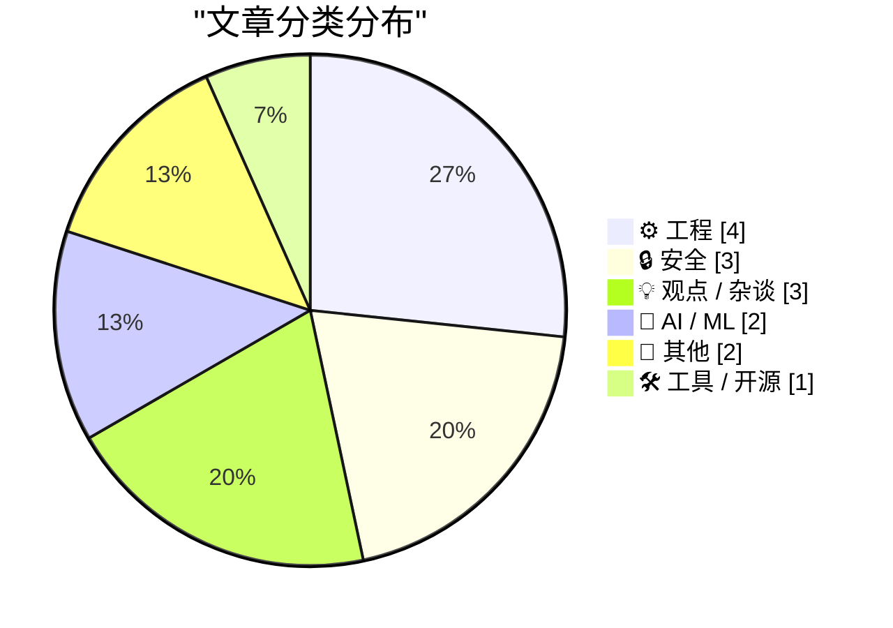
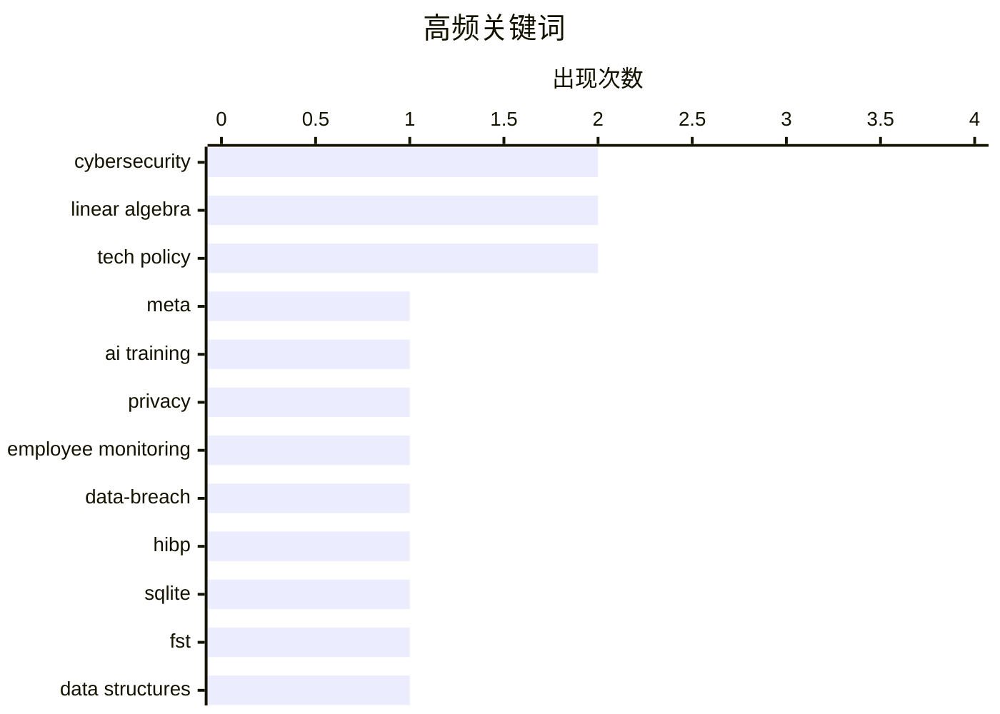

# 📰 May 11, 2026

> 来自 Karpathy 推荐的 92 个顶级技术博客，AI 精选 Top 15

## 📝 今日看点

今日技术圈聚焦 AI 训练数据的边界与伦理，Meta 极端的员工行为采集与《纽约时报》的 AI 引用错误引发了关于数据获取与生成质量的深度讨论。底层工程实践回归数学本质，开发者通过线性代数与状态机实现了从算法逆向到海量数据压缩的极致优化。同时，全球范围内的网络安全协作与对开源治理、社会博弈的反思，揭示了技术在复杂现实环境中的多重挑战。

---

## 🏆 今日必读

🥇 **Meta 将开始采集员工鼠标轨迹与按键数据用于 AI 训练**

[Meta to Start Capturing Employee Mouse Movements, Keystrokes for AI Training Data](https://www.reuters.com/sustainability/boards-policy-regulation/meta-start-capturing-employee-mouse-movements-keystrokes-ai-training-data-2026-04-21/) — daringfireball.net · 19 小时前 · 🤖 AI / ML

> Meta 正在美国员工电脑上安装名为 Model Capability Initiative (MCI) 的新型追踪软件，用于捕获鼠标移动、点击和按键数据。这些数据将直接用于训练其人工智能模型，旨在开发能够自主执行办公任务的 AI 智能体（AI agents）。该工具会在工作相关的应用程序和网站上运行，引发了关于员工隐私与工作自动化的广泛讨论。Meta 内部备忘录显示，这是其构建全自动工作流宏大计划的一部分。这种大规模的员工行为数据采集标志着企业 AI 训练进入了一个极具争议的新阶段。

💡 **为什么值得读**: 揭示了科技巨头如何利用海量员工行为数据来训练下一代自动化 AI 智能体，涉及隐私与技术的边界。

🏷️ Meta, AI training, privacy, employee monitoring

🥈 **欢迎哥斯达黎加政府加入 Have I Been Pwned**

[Welcoming the Costa Rican Government to Have I Been Pwned](https://www.troyhunt.com/welcoming-the-costa-rican-government-to-have-i-been-pwned/) — troyhunt.com · 9 小时前 · 🔒 安全

> 哥斯达黎加政府正式加入 Have I Been Pwned (HIBP) 的免费政府服务，成为第 42 个加入该平台的国家。哥斯达黎加计算机安全应急响应小组 (CSIRT) 现在可以监控其政府域名在已知数据泄露事件中的暴露情况。这一合作使国家级网络安全团队能够实时识别凭据泄露风险，并迅速采取补救措施。HIBP 的政府服务旨在通过共享泄露情报，提升全球公共部门的网络防御能力。目前已有数十个国家通过该平台加强了其国家级网络安全态势。

💡 **为什么值得读**: 了解国家级网络安全防御如何利用公开的泄露数据库来增强基础设施的安全性。

🏷️ cybersecurity, data-breach, HIBP

🥉 **引用 Andrew Quinn：用 7 MB 的 FST 替换 3 GB 的 SQLite 数据库**

[Quoting Andrew Quinn](https://simonwillison.net/2026/May/10/andrew-quinn/#atom-everything) — simonwillison.net · 18 小时前 · ⚙️ 工程

> 开发者 Andrew Quinn 分享了将一个 3 GB 的 SQLite 数据库替换为仅 7 MB 的有限状态转换器（FST）二进制文件的技术实践。他指出，许多现代编程任务往往在几十年前就已经有了更优的实现方案，只是被开发者忽视了。通过使用 FST 这种紧凑的数据结构，他在保持搜索效率的同时，实现了数据体积近 400 倍的压缩。这种方法特别适用于处理大规模静态文本搜索和替换任务，挑战了“万物皆可数据库”的思维定式。这一案例提醒开发者应重新审视经典算法在解决现代大数据问题中的潜力。

💡 **为什么值得读**: 极具启发性的工程优化案例，展示了经典算法在现代大数据处理中依然具备降维打击的威力。

🏷️ SQLite, FST, data structures, optimization

---

## 📊 数据概览

| 扫描源 | 抓取文章 | 时间范围 | 精选 |
|:---:|:---:|:---:|:---:|
| 81/92 | 2396 篇 → 17 篇 | 48h | **15 篇** |

### 分类分布



### 高频关键词



<details>
<summary>📈 纯文本关键词图（终端友好）</summary>

```
cybersecurity       │ ████████████████████ 2
linear algebra      │ ████████████████████ 2
tech policy         │ ████████████████████ 2
meta                │ ██████████░░░░░░░░░░ 1
ai training         │ ██████████░░░░░░░░░░ 1
privacy             │ ██████████░░░░░░░░░░ 1
employee monitoring │ ██████████░░░░░░░░░░ 1
data-breach         │ ██████████░░░░░░░░░░ 1
hibp                │ ██████████░░░░░░░░░░ 1
sqlite              │ ██████████░░░░░░░░░░ 1
```

</details>

### 🏷️ 话题标签

**cybersecurity**(2) · **linear algebra**(2) · **tech policy**(2) · meta(1) · ai training(1) · privacy(1) · employee monitoring(1) · data-breach(1) · hibp(1) · sqlite(1) · fst(1) · data structures(1) · optimization(1) · prng(1) · reverse engineering(1) · cryptography(1) · ai hallucination(1) · journalism(1) · llm(1) · misinformation(1)

---

## ⚙️ 工程

### 1. 引用 Andrew Quinn：用 7 MB 的 FST 替换 3 GB 的 SQLite 数据库

[Quoting Andrew Quinn](https://simonwillison.net/2026/May/10/andrew-quinn/#atom-everything) — **simonwillison.net** · 18 小时前 · ⭐ 24/30

> 开发者 Andrew Quinn 分享了将一个 3 GB 的 SQLite 数据库替换为仅 7 MB 的有限状态转换器（FST）二进制文件的技术实践。他指出，许多现代编程任务往往在几十年前就已经有了更优的实现方案，只是被开发者忽视了。通过使用 FST 这种紧凑的数据结构，他在保持搜索效率的同时，实现了数据体积近 400 倍的压缩。这种方法特别适用于处理大规模静态文本搜索和替换任务，挑战了“万物皆可数据库”的思维定式。这一案例提醒开发者应重新审视经典算法在解决现代大数据问题中的潜力。

🏷️ SQLite, FST, data structures, optimization

---

### 2. 位运算中的线性代数

[The linear algebra of bit twiddling](https://www.johndcook.com/blog/2026/05/10/the-linear-algebra-of-bit-twiddling/) — **johndcook.com** · 15 小时前 · ⭐ 23/30

> 位运算（Bit Twiddling）在本质上可以被视为有限域 GF(2) 上的线性代数运算。文章深入探讨了梅森旋转算法中的位移和异或操作如何对应于模 2 矩阵的变换。虽然线性代数通常在实数或复数域上讨论，但其定理在任何标量域下均成立。通过这种数学视角，开发者可以更深刻地理解底层位操作的代数结构及其可逆性。这种理论框架为分析和设计高效的位处理算法提供了严谨的基础。

🏷️ linear algebra, bit twiddling, Mersenne Twister, math

---

### 3. 开源项目的错误度量

[The Mismeasure of Open Source](https://nesbitt.io/2026/05/09/the-mismeasure-of-open-source.html) — **nesbitt.io** · 1 天前 · ⭐ 23/30

> 开源项目的健康度评估往往陷入“路灯效应”，即过度依赖易于获取但可能具有误导性的量化指标。目前的评估体系（如 GitHub Star 数或提交频率）可能无法真实反映项目的长期可持续性或安全性。文章指出，这种错误的测量方式会导致资源分配不当，甚至掩盖了关键基础设施的潜在风险。作者呼吁建立更深层次、更具定性的评估标准，以避免被表面的活跃度数据所蒙蔽。对于依赖开源组件的企业来说，理解这些指标的局限性至关重要。

🏷️ open-source, metrics, OSS

---

### 4. 语义化版本夫人为您占卜

[Madame Semver Will See You Now](https://nesbitt.io/2026/05/10/madame-semver-will-see-you-now.html) — **nesbitt.io** · 23 小时前 · ⭐ 16/30

> 这篇文章以一种幽默且带有神秘色彩的方式，探讨了软件开发中语义化版本（SemVer）的复杂性与不可预测性。作者通过“占卜”的隐喻，讽刺了开发者在决定版本号（Major.Minor.Patch）时面临的纠结与随意性。虽然 SemVer 旨在提供清晰的依赖管理规则，但在实际执行中，破坏性变更往往难以界定。这种文学化的表达方式揭示了技术规范在现实工程实践中遇到的执行困境。

🏷️ SemVer, versioning, software-development

---

## 🔒 安全

### 5. 欢迎哥斯达黎加政府加入 Have I Been Pwned

[Welcoming the Costa Rican Government to Have I Been Pwned](https://www.troyhunt.com/welcoming-the-costa-rican-government-to-have-i-been-pwned/) — **troyhunt.com** · 9 小时前 · ⭐ 25/30

> 哥斯达黎加政府正式加入 Have I Been Pwned (HIBP) 的免费政府服务，成为第 42 个加入该平台的国家。哥斯达黎加计算机安全应急响应小组 (CSIRT) 现在可以监控其政府域名在已知数据泄露事件中的暴露情况。这一合作使国家级网络安全团队能够实时识别凭据泄露风险，并迅速采取补救措施。HIBP 的政府服务旨在通过共享泄露情报，提升全球公共部门的网络防御能力。目前已有数十个国家通过该平台加强了其国家级网络安全态势。

🏷️ cybersecurity, data-breach, HIBP

---

### 6. 利用线性代数逆向工程梅森旋转算法

[Reverse engineering Mersenne Twister with Linear Algebra](https://www.johndcook.com/blog/2026/05/10/reverse-mersenne-twister/) — **johndcook.com** · 16 小时前 · ⭐ 24/30

> 梅森旋转算法（Mersenne Twister）虽然具有良好的统计特性，但在密码学上并不安全。通过线性代数方法，可以从该生成器的输出中完全恢复其内部状态。文章详细演示了如何将 MT 的回火（tempering）步骤建模为模 2 域上的矩阵乘法。利用矩阵的可逆性，攻击者可以逆转位运算过程，从而预测未来的随机数序列。这再次证明了在安全敏感场景中必须使用密码学安全的伪随机数生成器（CSPRNG）。

🏷️ PRNG, reverse engineering, linear algebra, cryptography

---

### 7. 每周更新 503：Instructure 勒索事件进展

[Weekly Update 503](https://www.troyhunt.com/weekly-update-503/) — **troyhunt.com** · 10 小时前 · ⭐ 23/30

> 在网络安全专家 Troy Hunt 的第 503 期周报中，重点关注了 Instructure 公司面临的数据泄露威胁。目前该公司已从黑客组织 ShinyHunters 的泄露名单中移除，但其官方声明依然含糊其辞，未明确是否支付了赎金。文章还讨论了“支付或泄露”这一最后期限对企业决策的影响。此外，周报还涵盖了近期其他的网络安全动态和 HIBP 平台的最新进展。这种对真实案例的持续追踪为安全从业者提供了宝贵的实战参考。

🏷️ ransomware, cybersecurity, incident-response

---

## 💡 观点 / 杂谈

### 8. Pluralistic：回顾 2024 年的技术与社会博弈

[Pluralistic: 2024 (apart from the obvious) (11 May 2026)](https://pluralistic.net/2026/05/11/postmortem/) — **pluralistic.net** · 11 分钟前 · ⭐ 21/30

> Cory Doctorow 在本期专栏中回顾了 2024 年一系列关键的技术与社会议题，涵盖了从数字版权管理（DRM）抗议到隐私保护的多个领域。内容涉及丹麦音乐交易合法化、专利局引入同行评审以及 Facebook 与青少年隐私等争议性话题。作者通过对这些历史事件的重新审视，剖析了技术垄断如何侵蚀用户权利。文章以其一贯的犀利视角，探讨了版权过滤器和工资盗窃等深层社会不公问题。这是一份关于数字时代权力分配的深度观察。

🏷️ DRM, patent, copyright, tech policy

---

### 9. Pluralistic：亿万富翁与生活成本危机的矛盾

[Pluralistic: Trump's fruitless search for a goreable ox (09 May 2026)](https://pluralistic.net/2026/05/09/cossie-livvie-crissie/) — **pluralistic.net** · 1 天前 · ⭐ 20/30

> 本文探讨了政治决策在讨好亿万富翁与解决生活成本危机之间的固有矛盾。作者 Cory Doctorow 评述了包括巴拿马文件举报人现状、扎克伯格的新技术动向以及劳工法案在内的多项议题。文章指出，当前的经济结构往往牺牲普通民众的利益来维持顶层财富的增长。通过对这些看似孤立的事件进行串联，作者揭示了技术权力如何被用来巩固既有的经济不平等。内容涵盖了从隐私监控到全球金融透明度的广泛范畴。

🏷️ economics, tech policy, Phrack, inequality

---

### 10. 恐惧即信息

[Fear is information.](https://www.joanwestenberg.com/fear-is-information/) — **joanwestenberg.com** · 6 小时前 · ⭐ 15/30

> 励志产业常将恐惧视为需要被击败或压制的敌人，但这种武断的观点忽略了恐惧的本质。恐惧实际上是一种高价值的生物信号和信息流，它揭示了我们价值观的边界以及潜在的风险点。与其通过“战斗”来消耗心理能量，不如将其视为一种数据输入，用于指导决策和自我认知。作者主张通过接纳和分析恐惧，将其转化为推动个人成长的动力，而非单纯的阻碍。

🏷️ psychology, mindset, productivity

---

## 🤖 AI / ML

### 11. Meta 将开始采集员工鼠标轨迹与按键数据用于 AI 训练

[Meta to Start Capturing Employee Mouse Movements, Keystrokes for AI Training Data](https://www.reuters.com/sustainability/boards-policy-regulation/meta-start-capturing-employee-mouse-movements-keystrokes-ai-training-data-2026-04-21/) — **daringfireball.net** · 19 小时前 · ⭐ 25/30

> Meta 正在美国员工电脑上安装名为 Model Capability Initiative (MCI) 的新型追踪软件，用于捕获鼠标移动、点击和按键数据。这些数据将直接用于训练其人工智能模型，旨在开发能够自主执行办公任务的 AI 智能体（AI agents）。该工具会在工作相关的应用程序和网站上运行，引发了关于员工隐私与工作自动化的广泛讨论。Meta 内部备忘录显示，这是其构建全自动工作流宏大计划的一部分。这种大规模的员工行为数据采集标志着企业 AI 训练进入了一个极具争议的新阶段。

🏷️ Meta, AI training, privacy, employee monitoring

---

### 12. 引用《纽约时报》编辑说明：AI 摘要引发的引用错误

[Quoting New York Times Editors’ Note](https://simonwillison.net/2026/May/10/new-york-times-editors-note/#atom-everything) — **simonwillison.net** · 9 小时前 · ⭐ 23/30

> 《纽约时报》发布编辑说明，承认在一篇关于加拿大政客 Pierre Poilievre 的报道中错误地引用了 AI 生成的摘要。该错误源于记者直接使用了 AI 工具对 Poilievre 政治观点的总结，并将其误认为真实引言，而未进行事实核查。目前该文章已根据 Poilievre 在 4 月份的实际演讲内容进行了修正。这一事件凸显了新闻行业在使用 AI 辅助写作时面临的真实性风险和核查责任。它也为所有依赖 AI 进行内容创作的专业人士敲响了警钟。

🏷️ AI hallucination, journalism, LLM, misinformation

---

## 📝 其他

### 13. 建筑物理周报：2026年5月9日阅读清单

[Reading List 05/09/2026](https://www.construction-physics.com/p/reading-list-05092026) — **construction-physics.com** · 1 天前 · ⭐ 19/30

> 本期阅读清单聚焦于建筑与工程领域的奇特现象与前沿趋势。内容涵盖了因产权纠纷被困在新建公寓中的“钉子户”建筑，以及利用家庭供暖系统作为小型数据中心散热器的新型能源利用方案。文中还探讨了低成本纸板军用无人机在现代冲突中的应用，并深度分析了美国私铁公司 Brightline 面临的破产风险及其财务困境。通过这些案例，作者揭示了技术创新与法律、经济因素在基础设施建设中的复杂博弈。

🏷️ hardware, infrastructure, data-centers

---

### 14. 高等数学教学法中的问题

[The Problem of Pedagogy in Advanced Mathematics](https://susam.net/advanced-mathematics-pedagogy.html) — **susam.net** · 9 小时前 · ⭐ 18/30

> 许多教育机构在数学教学法上存在严重缺陷，尤其是在学生初次接触新概念的关键阶段。糟糕的讲解往往会将学生推开，导致只有极少数动力极强的人能坚持探索数学的严谨与美感。文章指出，当前的教学往往过于注重计算而忽视了逻辑推理的严密性，导致学生无法领悟数学作为思维工具的本质。作者呼吁教育者应重新审视教学方式，将数学的奇迹感与逻辑训练重新带回课堂。

🏷️ mathematics, education, pedagogy

---

## 🛠 工具 / 开源

### 15. WorkOS：助力 B2B SaaS 快速进入企业级市场

[WorkOS](https://workos.com/?utm_source=daringfireball&amp;utm_medium=newsletter&amp;utm_campaign=q22026) — **daringfireball.net** · 19 小时前 · ⭐ 12/30

> 对于构建 B2B SaaS（尤其是 AI 应用）的团队而言，单点登录（SSO）、目录同步（SCIM）和审计日志等企业级功能是进入大客户市场的门槛。WorkOS 提供了一套生产就绪的 API，旨在帮助开发者快速集成这些复杂的身份验证和访问控制基础设施。通过外包这些非核心但高难度的功能，开发团队可以将精力集中在产品差异化竞争上。该方案特别适合需要快速合规并交付企业级特性的初创公司。

🏷️ SaaS, Auth, SSO, B2B

---

*生成于 2026-05-11 09:55 | 扫描 81 源 → 获取 2396 篇 → 精选 15 篇*
*基于 [Hacker News Popularity Contest 2025](https://refactoringenglish.com/tools/hn-popularity/) RSS 源列表，由 [Andrej Karpathy](https://x.com/karpathy) 推荐*
