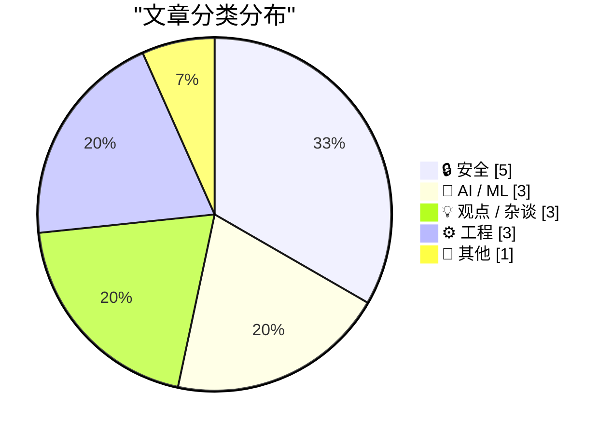
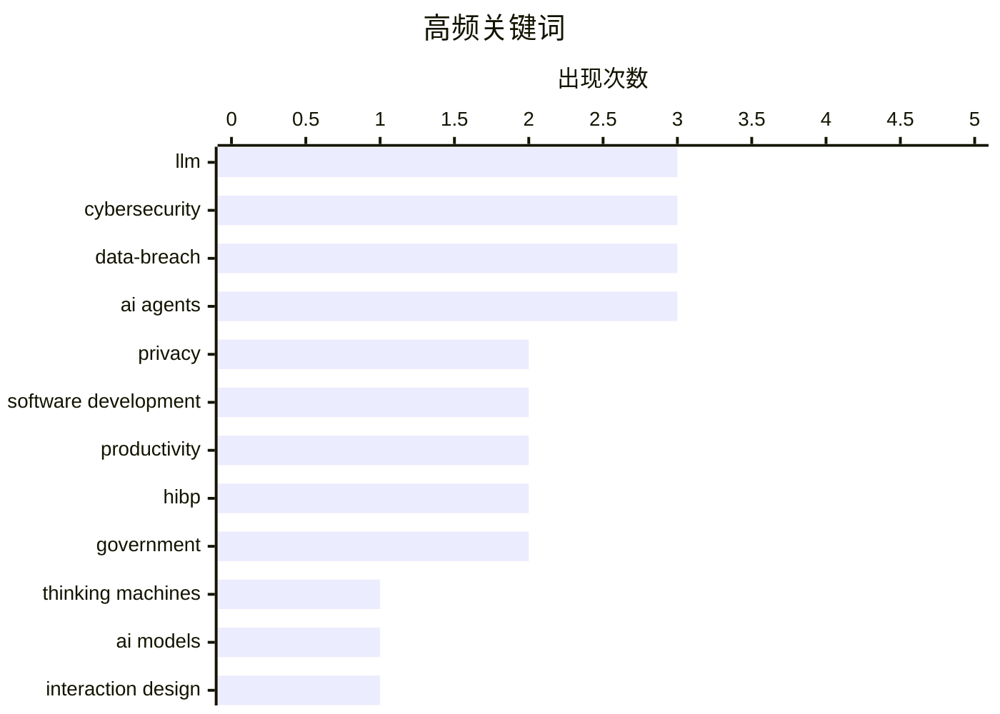

# 📰 May 12, 2026

> 来自 Karpathy 推荐的 92 个顶级技术博客，AI 精选 Top 15

## 📝 今日看点

今日技术圈聚焦AI从“辅助对话”向“深度协作”的范式转移，Meta与Shopify正通过行为追踪与公开协作重塑AI智能体的训练与应用边界。与此同时，业界对AI产出质量的忧虑持续升温，强调开发效率的提升必须以降低维护成本为前提，以警惕“僵尸互联网”带来的内容危机。安全领域亦迎来关键进展，苹果正式在iOS测试版中支持RCS端到端加密，标志着跨平台通信隐私保护迈入新阶段。

---

## 🏆 今日必读

🥇 **Thinking Machines 与交互模型**

[Thinking Machines and interaction models](https://seangoedecke.com/interaction-models/) — seangoedecke.com · 8 小时前 · 🤖 AI / ML

> Thinking Machines 在投入 20 亿美元研发资金和一年工作后，发布了其首个 AI 模型“交互模型”（Interaction Models）。该模型并非旨在与 OpenAI 或 Google 的前沿大模型（Frontier Models）直接竞争，而是专注于解决 AI 的交互层问题。它探索了用户如何更有效地与智能体协作，而非单纯追求模型规模或原始智能。作者指出，这种差异化路线反映了 AI 领域从“模型智能”向“系统交互”重心的转移。这种定位避开了算力竞赛，试图在应用层建立竞争壁垒。

💡 **为什么值得读**: 揭示了 AI 独角兽在巨额融资后如何通过差异化交互模型避开与巨头的正面硬刚。

🏷️ Thinking Machines, AI models, interaction design, LLM

🥈 **Troy Hunt 周报 503：Instructure 勒索危机与静默应对**

[Weekly Update 503](https://www.troyhunt.com/weekly-update-503/) — troyhunt.com · 1 天前 · 🔒 安全

> 本期周报关注 Instructure 公司面临 ShinyHunters 黑客组织的“支付或泄露”最后通牒。目前该公司已从黑客网站的泄露名单中移除，但其发布的官方声明仅表示“不发表任何评论”。这种模糊的应对策略引发了关于其是否已支付赎金或达成私下协议的猜测。Troy Hunt 持续追踪此类网络安全事件的后续进展及企业公关策略。文章强调了在数据泄露威胁下，企业透明度与危机处理之间的博弈。

💡 **为什么值得读**: 了解企业在面对顶级黑客组织勒索时的典型公关反应与安全博弈。

🏷️ cybersecurity, ransomware, data-breach

🥉 **iOS 26.5 测试版支持端到端加密的 RCS 消息**

[iOS 26.5 Includes Beta Support for End-to-End Encrypted RCS Messaging](https://www.apple.com/newsroom/2026/05/end-to-end-encrypted-rcs-messaging-begins-rolling-out-today-in-beta/) — daringfireball.net · 9 小时前 · 🔒 安全

> 苹果在 iOS 26.5 测试版中正式推出端到端加密（E2EE）的 RCS 消息功能，实现了 iPhone 与最新版 Android 谷歌信息之间的加密通信。当对话受 E2EE 保护时，用户会在 RCS 聊天界面看到新的锁形图标，确保第三方无法读取传输内容。该功能默认开启，并将在支持的运营商网络中逐步自动启用。这一举措标志着跨平台短信安全性的一次重大飞跃，解决了长期以来跨系统短信明文传输的安全隐患。

💡 **为什么值得读**: 关注苹果与安卓之间跨平台通信安全性的里程碑式进展。

🏷️ iOS, RCS, encryption, privacy

---

## 📊 数据概览

| 扫描源 | 抓取文章 | 时间范围 | 精选 |
|:---:|:---:|:---:|:---:|
| 80/92 | 2403 篇 → 37 篇 | 48h | **15 篇** |

### 分类分布



### 高频关键词



<details>
<summary>📈 纯文本关键词图（终端友好）</summary>

```
llm                  │ ████████████████████ 3
cybersecurity        │ ████████████████████ 3
data-breach          │ ████████████████████ 3
ai agents            │ ████████████████████ 3
privacy              │ █████████████░░░░░░░ 2
software development │ █████████████░░░░░░░ 2
productivity         │ █████████████░░░░░░░ 2
hibp                 │ █████████████░░░░░░░ 2
government           │ █████████████░░░░░░░ 2
thinking machines    │ ███████░░░░░░░░░░░░░ 1
```

</details>

### 🏷️ 话题标签

**llm**(3) · **cybersecurity**(3) · **data-breach**(3) · ai agents(3) · privacy(2) · software development(2) · productivity(2) · hibp(2) · government(2) · thinking machines(1) · ai models(1) · interaction design(1) · ransomware(1) · ios(1) · rcs(1) · encryption(1) · gitlab(1) · strategy(1) · workforce(1) · maintenance(1)

---

## 🔒 安全

### 1. Troy Hunt 周报 503：Instructure 勒索危机与静默应对

[Weekly Update 503](https://www.troyhunt.com/weekly-update-503/) — **troyhunt.com** · 1 天前 · ⭐ 25/30

> 本期周报关注 Instructure 公司面临 ShinyHunters 黑客组织的“支付或泄露”最后通牒。目前该公司已从黑客网站的泄露名单中移除，但其发布的官方声明仅表示“不发表任何评论”。这种模糊的应对策略引发了关于其是否已支付赎金或达成私下协议的猜测。Troy Hunt 持续追踪此类网络安全事件的后续进展及企业公关策略。文章强调了在数据泄露威胁下，企业透明度与危机处理之间的博弈。

🏷️ cybersecurity, ransomware, data-breach

---

### 2. iOS 26.5 测试版支持端到端加密的 RCS 消息

[iOS 26.5 Includes Beta Support for End-to-End Encrypted RCS Messaging](https://www.apple.com/newsroom/2026/05/end-to-end-encrypted-rcs-messaging-begins-rolling-out-today-in-beta/) — **daringfireball.net** · 9 小时前 · ⭐ 24/30

> 苹果在 iOS 26.5 测试版中正式推出端到端加密（E2EE）的 RCS 消息功能，实现了 iPhone 与最新版 Android 谷歌信息之间的加密通信。当对话受 E2EE 保护时，用户会在 RCS 聊天界面看到新的锁形图标，确保第三方无法读取传输内容。该功能默认开启，并将在支持的运营商网络中逐步自动启用。这一举措标志着跨平台短信安全性的一次重大飞跃，解决了长期以来跨系统短信明文传输的安全隐患。

🏷️ iOS, RCS, encryption, privacy

---

### 3. 利用线性代数逆向工程梅森旋转算法

[Reverse engineering Mersenne Twister with Linear Algebra](https://www.johndcook.com/blog/2026/05/10/reverse-mersenne-twister/) — **johndcook.com** · 1 天前 · ⭐ 23/30

> 梅森旋转算法（Mersenne Twister）虽然具有良好的统计特性，但并不具备加密安全性。本文展示了如何利用线性代数方法，仅通过观察输出序列就恢复出该伪随机数生成器（PRNG）的内部状态。相比传统的位运算逆向方法，线性代数提供了一种更系统化的视角来破解其生成机制。这一案例再次证明了在安全敏感场景下，必须使用密码学安全的伪随机数生成器（CSPRNG）而非普通 PRNG。文章详细解释了状态转换矩阵及其逆运算的数学原理。

🏷️ cryptography, PRNG, reverse-engineering, Mersenne-Twister

---

### 4. 孟加拉国政府加入 Have I Been Pwned 免费政府服务

[Welcoming the Bangladesh Government to Have I Been Pwned](https://www.troyhunt.com/welcoming-the-bangladesh-government-to-have-i-been-pwned/) — **troyhunt.com** · 10 小时前 · ⭐ 22/30

> 孟加拉国正式成为第 43 个加入 Have I Been Pwned (HIBP) 免费政府服务的国家。其国家计算机安全事件响应小组（BGD e-GOV CIRT）现在拥有完整的 API 访问权限，可以查询所有政府域名的泄露情况。该服务允许政府部门实时监控其域名是否出现在未来的数据泄露事件中，从而提升国家级网络安全防御能力。孟加拉国的加入标志着 HIBP 在全球政府合作网络中的进一步扩张。

🏷️ cybersecurity, HIBP, data-breach, government

---

### 5. 哥斯达黎加政府加入 Have I Been Pwned 免费政府服务

[Welcoming the Costa Rican Government to Have I Been Pwned](https://www.troyhunt.com/welcoming-the-costa-rican-government-to-have-i-been-pwned/) — **troyhunt.com** · 1 天前 · ⭐ 22/30

> 哥斯达黎加政府作为第 42 个成员加入了 Have I Been Pwned 的免费政府监控计划。该国的计算机安全事件响应小组（CSIRT）获得了监控政府域名数据暴露情况的权限。通过 HIBP 提供的工具，哥斯达黎加能够更早地识别政府凭据泄露风险并采取补救措施。此举是该国加强国家网络安全基础设施、应对日益增长的数据泄露威胁的重要一步。

🏷️ cybersecurity, HIBP, data-breach, government

---

## 🤖 AI / ML

### 6. Thinking Machines 与交互模型

[Thinking Machines and interaction models](https://seangoedecke.com/interaction-models/) — **seangoedecke.com** · 8 小时前 · ⭐ 27/30

> Thinking Machines 在投入 20 亿美元研发资金和一年工作后，发布了其首个 AI 模型“交互模型”（Interaction Models）。该模型并非旨在与 OpenAI 或 Google 的前沿大模型（Frontier Models）直接竞争，而是专注于解决 AI 的交互层问题。它探索了用户如何更有效地与智能体协作，而非单纯追求模型规模或原始智能。作者指出，这种差异化路线反映了 AI 领域从“模型智能”向“系统交互”重心的转移。这种定位避开了算力竞赛，试图在应用层建立竞争壁垒。

🏷️ Thinking Machines, AI models, interaction design, LLM

---

### 7. 引用 James Shore：AI 必须降低维护成本

[Quoting James Shore](https://simonwillison.net/2026/May/11/james-shore/#atom-everything) — **simonwillison.net** · 13 小时前 · ⭐ 23/30

> James Shore 提出一个严峻的观点：AI 编程助手必须显著降低代码维护成本，否则将成为开发者的负担。如果 AI 让编写代码的速度提升了两倍，那么维护成本也必须减半，否则开发者只是在用暂时的速度提升换取永久的债务。单纯追求产出量的增加而不解决代码质量和可维护性，最终会导致系统不可持续。这一逻辑提醒团队在引入 AI 工具时，应将维护效率作为核心衡量指标。开发者必须警惕 AI 带来的“技术债爆炸”。

🏷️ AI agents, maintenance, software development, productivity

---

### 8. Meta 将采集员工鼠标动作与按键数据以训练 AI

[Meta to Start Capturing Employee Mouse Movements, Keystrokes for AI Training Data](https://www.reuters.com/sustainability/boards-policy-regulation/meta-start-capturing-employee-mouse-movements-keystrokes-ai-training-data-2026-04-21/) — **daringfireball.net** · 1 天前 · ⭐ 23/30

> Meta 正在美国员工的电脑上安装名为 Model Capability Initiative (MCI) 的追踪软件，用于采集鼠标移动、点击和按键数据。这些细粒度的行为数据将被用于训练能够自主执行办公任务的 AI 智能体。该工具运行在工作相关的应用和网站上，旨在通过模仿人类操作来实现工作流程的自动化。这一举措引发了关于员工隐私以及 AI 是否最终会取代这些被采集者的广泛讨论。Meta 试图通过内部数据闭环构建更具竞争力的办公 AI。

🏷️ Meta, AI training, privacy, employee monitoring

---

## 💡 观点 / 杂谈

### 9. 思考 GitLab 的裁员与“第二幕”战略决策

[Thoughts on GitLab's workforce reduction" and "structural and strategic decisions"](https://simonwillison.net/2026/May/11/gitlab-act-2/#atom-everything) — **simonwillison.net** · 8 小时前 · ⭐ 23/30

> GitLab 宣布进入“第二幕”战略转型，伴随而来的包括裁员和针对智能体（Agentic）时代的结构性调整。公司计划将业务覆盖的国家数量减少 30%，以优化此前过于分散的全球远程协作模式。这一决策反映了 GitLab 试图从传统的 DevOps 平台向深度集成 AI 智能体的开发平台转型。Simon Willison 认为，这种收缩是为了在 AI 驱动的软件开发新范式中重新聚焦资源。这标志着远程办公标杆企业在效率压力下的重大转向。

🏷️ GitLab, AI agents, strategy, workforce

---

### 10. 你的 AI 用法让我崩溃

[Your AI Use Is Breaking My Brain](https://simonwillison.net/2026/May/11/zombie-internet/#atom-everything) — **simonwillison.net** · 13 小时前 · ⭐ 23/30

> Jason Koebler 批判了互联网上泛滥的 AI 生成内容，认为这些内容正变得避无可避且令人精疲力竭。他提出了“僵尸互联网”（Zombie Internet）的概念，用以描述那种由 AI 驱动、看似活跃实则空洞的互联网生态。这种现象不仅增加了读者的信息过滤成本，甚至开始扭曲人类正常的写作风格。文章表达了对 AI 污染公共信息空间以及破坏人类交流真实性的深度担忧。这种“僵尸化”比“死寂互联网”更具隐蔽性和破坏性。

🏷️ AI content, internet culture, LLM, mental health

---

### 11. 我们无法在 AI 问题上达成共识

[We Are Not Going to Agree on AI](https://idiallo.com/blog/we-are-not-going-to-agree-on-ai?src=feed) — **idiallo.com** · 20 小时前 · ⭐ 23/30

> 开发者社区对 AI 的态度呈现出极端的两极分化：有人利用 AI 每月产出 3 万行代码并获得巨额收益，有人则认为 AI 极其愚蠢且产出垃圾。文章引用了 Medvi 公司年入 18 亿美元的案例（尽管伴随欺诈争议）以及微软宣称其 30% 代码由 AI 生成的数据。这种分歧源于不同场景下 AI 表现的巨大差异，以及人们对“效率”与“质量”权衡标准的不统一。作者认为，关于 AI 价值的争论在短期内无法平息，因为双方都能找到支撑其观点的极端证据。这种认知鸿沟正随着 AI 的普及而不断扩大。

🏷️ AI, productivity, software development

---

## ⚙️ 工程

### 12. 在车间学习：Shopify 的内部 AI 编程助手 River

[Learning on the Shop floor](https://simonwillison.net/2026/May/11/learning-on-the-shop-floor/#atom-everything) — **simonwillison.net** · 17 小时前 · ⭐ 23/30

> Shopify CEO Tobias Lütke 介绍了公司内部的 AI 编程助手 River，其核心特点是完全在公共 Slack 频道中运行。River 拒绝私聊请求，强制要求用户在公开频道与其协作，以便其他员工能实时观察和学习 AI 的使用技巧。目前 Tobi 本人就在 #tobi_river 频道中展示其工作流，许多员工也纷纷效仿。这种“公开透明”的交互模式极大地促进了组织内部关于 AI 提示词工程和协作经验的隐性知识传播。这种做法将 AI 使用从私人技能转变为组织资产。

🏷️ Shopify, AI agents, Slack, engineering culture

---

### 13. 引用 Andrew Quinn：用 7MB 的有限状态转换器替换 3GB 的 SQLite 数据库

[Quoting Andrew Quinn](https://simonwillison.net/2026/May/10/andrew-quinn/#atom-everything) — **simonwillison.net** · 1 天前 · ⭐ 21/30

> 开发者 Andrew Quinn 分享了将 3GB 的 SQLite 数据库成功替换为仅 7MB 的有限状态转换器（FST）二进制文件的技术实践。他反思了编程中的一种“愧疚感”，即担心自己正在构建的工具其实早在 30 或 40 年前就已经被更优雅的方案所取代。FST 在特定搜索和替换场景下展现出了极高的空间效率和性能优势。文章强调了深入研究计算机科学经典算法对于优化现代大规模数据处理任务的重要性。这种从“重量级数据库”到“轻量级算法结构”的转变，为资源受限场景提供了新的优化思路。

🏷️ SQLite, FST, database, performance

---

### 14. 在 8 位单片机上托管网站

[Hosting a website on an 8-bit microcontroller.](https://maurycyz.com/projects/mcusite/) — **maurycyz.com** · 1 天前 · ⭐ 21/30

> 本项目展示了如何在资源极度受限的 AVR64DD32 8 位单片机上搭建 Web 服务器。该芯片主频仅 24 MHz，拥有 8 KB RAM 和 64 KB Flash，相比传统的 ATmega328 具有更低的价格和更现代的外设。作者通过优化存储和网络协议栈，使这台“木制服务器”能够处理基础的 HTTP 请求并展示演示页面。文章详细列出了硬件规格，包括 256 字节的 EEPROM 和 1.8-5.5V 的工作电压。这种“极简主义”工程实践探讨了嵌入式设备在极低功耗和极小内存下的联网潜力。

🏷️ microcontroller, AVR, web server, embedded

---

## 📝 其他

### 15. 引用《纽约时报》编辑说明：AI 幻觉导致的虚假引言

[Quoting New York Times Editors’ Note](https://simonwillison.net/2026/May/10/new-york-times-editors-note/#atom-everything) — **simonwillison.net** · 1 天前 · ⭐ 22/30

> 《纽约时报》因记者误将 AI 生成的总结当作真实引言而发布了更正说明。该事件涉及加拿大保守党领袖 Pierre Poilievre 的言论，AI 工具将对其政治观点的概括渲染成了直接引语。记者在撰稿过程中未能核实 AI 输出内容的准确性，导致报道出现了严重的真实性问题。目前该文章已根据 Poilievre 4 月份的实际演讲内容进行了修正。这一案例凸显了新闻行业在使用 AI 辅助写作时，缺乏人工核实（Fact-checking）所带来的职业伦理风险。

🏷️ AI hallucination, journalism, ethics, LLM

---

*生成于 2026-05-12 08:51 | 扫描 80 源 → 获取 2403 篇 → 精选 15 篇*
*基于 [Hacker News Popularity Contest 2025](https://refactoringenglish.com/tools/hn-popularity/) RSS 源列表，由 [Andrej Karpathy](https://x.com/karpathy) 推荐*
