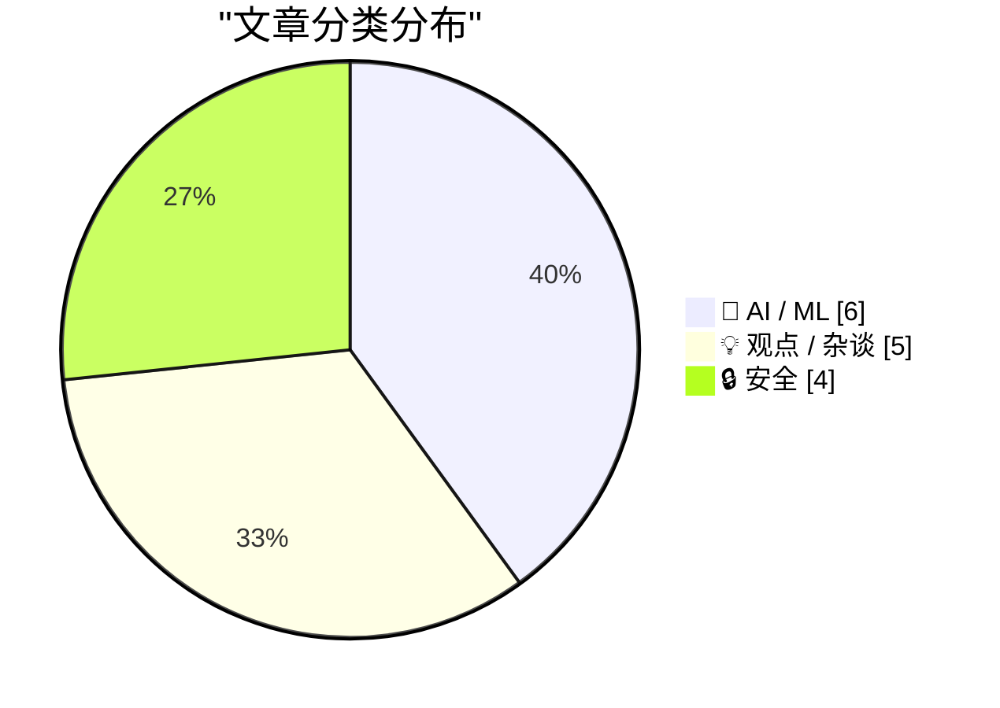
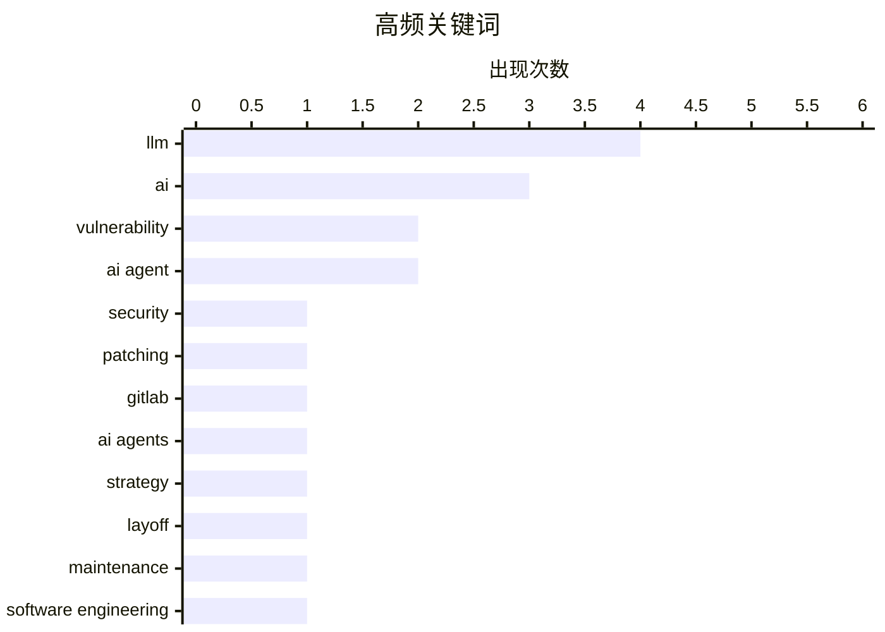

# 📰 May 13, 2026

> 来自 Karpathy 推荐的 92 个顶级技术博客，AI 精选 Top 15

## 📝 今日看点

AI 正在全方位重塑软件工程与安全攻防的底层逻辑，从 GitLab 裁员转型“智能体时代”到补丁星期二的漏洞修复激增，技术范式转移已进入深水区。然而，AI 的爆发也引发了“效用悖论”：开发者在享受编码提速的同时，正面临维护成本攀升、虚假漏洞报告泛滥以及“僵尸互联网”内容污染的严峻挑战。当前技术圈的焦点正从单纯的大模型军备竞赛，转向对 AI 长期维护成本、物理基础设施版图以及数字生态可持续性的深度反思。

---

## 🏆 今日必读

🥇 **2026年5月补丁星期二：AI 正在重塑漏洞挖掘与修复节奏**

[Patch Tuesday, May 2026 Edition](https://krebsonsecurity.com/2026/05/patch-tuesday-may-2026-edition/) — krebsonsecurity.com · 11 小时前 · 🔒 安全

> 2026年5月的“补丁星期二”见证了安全漏洞修复数量的激增。AI 平台在发现人类编写代码中的安全漏洞方面表现卓越，迫使 Apple、Google、Microsoft、Mozilla 和 Oracle 等主流软件厂商发布近乎创纪录的补丁量。这些厂商正在加快补丁发布节奏，以应对 AI 辅助挖掘漏洞带来的安全挑战。尽管 AI 同样容易受到社交工程攻击，但其在自动化代码审计方面的效率已显著改变了网络安全态势。作者指出，AI 既是威胁的放大器，也是安全防御必须依赖的工具。

💡 **为什么值得读**: 揭示了 AI 如何通过自动化漏洞挖掘重塑软件安全补丁的发布节奏，是了解安全前沿动态的必读篇章。

🏷️ security, vulnerability, AI, patching

🥈 **关于 GitLab 裁员及“智能体时代”战略转型的思考**

[Thoughts on GitLab's workforce reduction" and "structural and strategic decisions"](https://simonwillison.net/2026/May/11/gitlab-act-2/#atom-everything) — simonwillison.net · 1 天前 · 💡 观点 / 杂谈

> GitLab 宣布进入“第二阶段（Act 2）”战略转型，伴随而来的还有裁员和组织架构调整。为了迎接“智能体时代（agentic era）”，公司计划将业务覆盖的国家数量减少 30%，重点削减团队规模较小的地区。这一举措标志着 GitLab 从分布式的远程办公先驱向更聚焦 AI 驱动开发的战略重心转移。文章探讨了这种结构性决策对 GitLab 长期愿景及全球化团队模式的影响。作者认为，这种收缩是为了在 AI 智能体驱动的软件开发新范式中保持竞争力。

💡 **为什么值得读**: 了解知名远程办公先驱 GitLab 如何在 AI 浪潮下进行激进的组织架构与战略转型。

🏷️ GitLab, AI agents, strategy, layoff

🥉 **引用 James Shore：AI 编程必须降低维护成本，否则就是陷阱**

[Quoting James Shore](https://simonwillison.net/2026/May/11/james-shore/#atom-everything) — simonwillison.net · 1 天前 · 🤖 AI / ML

> 软件专家 James Shore 警告称，AI 编程助手必须显著降低维护成本，否则将成为开发者的负担。如果 AI 使编码速度提升了两倍，那么维护成本也必须减半，否则开发者只是在用短期的速度提升换取长期的“债务奴役”。单纯提高代码产出量而不优化代码质量和可维护性，会导致维护工作量呈指数级增长。作者认为，AI 的真正价值应体现在降低系统的长期持有成本，而非仅仅是生成更多代码。这种“数学逻辑”决定了 AI 辅助开发的最终成败。

💡 **为什么值得读**: 警示开发者不要盲目追求 AI 带来的编码速度，而应关注其对长期维护成本和技术债务的影响。

🏷️ AI agent, maintenance, software engineering

---

## 📊 数据概览

| 扫描源 | 抓取文章 | 时间范围 | 精选 |
|:---:|:---:|:---:|:---:|
| 83/92 | 2436 篇 → 48 篇 | 48h | **15 篇** |

### 分类分布



### 高频关键词



<details>
<summary>📈 纯文本关键词图（终端友好）</summary>

```
llm           │ ████████████████████ 4
ai            │ ███████████████░░░░░ 3
vulnerability │ ██████████░░░░░░░░░░ 2
ai agent      │ ██████████░░░░░░░░░░ 2
security      │ █████░░░░░░░░░░░░░░░ 1
patching      │ █████░░░░░░░░░░░░░░░ 1
gitlab        │ █████░░░░░░░░░░░░░░░ 1
ai agents     │ █████░░░░░░░░░░░░░░░ 1
strategy      │ █████░░░░░░░░░░░░░░░ 1
layoff        │ █████░░░░░░░░░░░░░░░ 1
```

</details>

### 🏷️ 话题标签

**llm**(4) · **ai**(3) · **vulnerability**(2) · ai agent(2) · security(1) · patching(1) · gitlab(1) · ai agents(1) · strategy(1) · layoff(1) · maintenance(1) · software engineering(1) · data-center(1) · ai-infrastructure(1) · nvidia(1) · ai content(1) · internet culture(1) · productivity(1) · software development(1) · curl(1)

---

## 🤖 AI / ML

### 1. 引用 James Shore：AI 编程必须降低维护成本，否则就是陷阱

[Quoting James Shore](https://simonwillison.net/2026/May/11/james-shore/#atom-everything) — **simonwillison.net** · 1 天前 · ⭐ 26/30

> 软件专家 James Shore 警告称，AI 编程助手必须显著降低维护成本，否则将成为开发者的负担。如果 AI 使编码速度提升了两倍，那么维护成本也必须减半，否则开发者只是在用短期的速度提升换取长期的“债务奴役”。单纯提高代码产出量而不优化代码质量和可维护性，会导致维护工作量呈指数级增长。作者认为，AI 的真正价值应体现在降低系统的长期持有成本，而非仅仅是生成更多代码。这种“数学逻辑”决定了 AI 辅助开发的最终成败。

🏷️ AI agent, maintenance, software engineering

---

### 2. 数据中心都去哪了？AI 热潮背后的物理版图

[Where Are All The Data Centers?](https://www.wheresyoured.at/where-are-all-the-data-centers/) — **wheresyoured.at** · 16 小时前 · ⭐ 26/30

> 本文深入探讨了支撑当前 AI 热潮的物理基础设施——数据中心的分布与扩张现状。文章分析了 NVIDIA、Anthropic 和 OpenAI 等巨头对算力的巨大需求，以及这种需求如何驱动全球范围内数据中心的建设。作者详细剖析了这些设施在能源消耗、地理选址以及对当地经济影响方面的复杂性。通过对数据中心规模的量化分析，揭示了 AI 竞赛背后沉重的硬件与资源代价。文章强调，AI 的未来不仅取决于算法，更取决于电力和土地的供应。

🏷️ data-center, AI-infrastructure, NVIDIA

---

### 3. 关于 AI 的效用，我们注定无法达成共识

[We Are Not Going to Agree on AI](https://idiallo.com/blog/we-are-not-going-to-agree-on-ai?src=feed) — **idiallo.com** · 1 天前 · ⭐ 25/30

> 开发者社区对 AI 的评价呈现出极端的两极分化。一方是每月产出 3 万行代码的“高产”开发者，另一方则坚称 AI 毫无用处，且双方均有实例支撑。微软声称其 30% 的代码由 AI 生成，而 Medvi 等公司的巨额营收也常与 AI 挂钩，尽管背后可能隐藏着欺诈争议。这种分歧反映了 AI 在实际应用中效果的复杂性，取决于具体的使用场景、开发者水平以及对“成功”的定义。文章结论认为，AI 的价值在不同人眼中具有完全不同的形态，这种争论将长期存在。

🏷️ AI, productivity, software development, LLM

---

### 4. Thinking Machines 及其“交互模型”：避开大模型正面竞争的战略

[Thinking Machines and interaction models](https://seangoedecke.com/interaction-models/) — **seangoedecke.com** · 1 天前 · ⭐ 24/30

> Thinking Machines 在投入 20 亿美元研发后，发布了其首个 AI 模型“交互模型（Interaction Models）”。该模型并非旨在与 OpenAI 或 Google 的前沿大模型直接竞争，而是专注于解决 AI 与人类或系统之间的交互难题。作者指出，这家公司避开了单纯追求参数规模的军备竞赛，转而深耕如何让 AI 更有效地融入现有工作流。这种差异化战略反映了 AI 市场正从通用大模型向特定功能模型演进。文章详细分析了这种“交互优先”思路的技术逻辑与市场前景。

🏷️ AI model, interaction design, LLM

---

### 5. LLM 命令行工具 0.32a2 版本发布

[llm 0.32a2](https://simonwillison.net/2026/May/12/llm/#atom-everything) — **simonwillison.net** · 15 小时前 · ⭐ 23/30

> LLM 命令行工具发布 0.32a2 预览版，重点改进了对 OpenAI 推理模型的支持。该版本将大多数推理模型的 API 端点从 /v1/chat/completions 迁移至最新的 /v1/responses。这一转变实现了“交织推理”（interleaved reasoning）功能，允许用户在输出中同时获取思维链和最终答案。此外，该版本还包含了一系列针对 Datasette 生态系统的实用更新，进一步增强了本地 LLM 的管理能力。

🏷️ LLM, OpenAI, CLI, tool

---

### 6. 在“车间”学习：Shopify 的公开 AI 协作模式

[Learning on the Shop floor](https://simonwillison.net/2026/May/11/learning-on-the-shop-floor/#atom-everything) — **simonwillison.net** · 1 天前 · ⭐ 23/30

> Shopify CEO Tobias Lütke 介绍了内部 AI 编程助手 River 的独特运作机制。River 拒绝通过私聊（DM）响应请求，强制要求用户在公开 Slack 频道中与其交互。这种设计模拟了传统制造业的“车间”环境，让所有员工都能实时观察 AI 如何解决问题。通过这种透明化协作，团队成员可以相互学习提示词技巧和系统架构知识，极大地加速了 AI 工具在全公司的知识沉淀与普及。

🏷️ Shopify, AI agent, Slack, internal tools

---

## 💡 观点 / 杂谈

### 7. 关于 GitLab 裁员及“智能体时代”战略转型的思考

[Thoughts on GitLab's workforce reduction" and "structural and strategic decisions"](https://simonwillison.net/2026/May/11/gitlab-act-2/#atom-everything) — **simonwillison.net** · 1 天前 · ⭐ 26/30

> GitLab 宣布进入“第二阶段（Act 2）”战略转型，伴随而来的还有裁员和组织架构调整。为了迎接“智能体时代（agentic era）”，公司计划将业务覆盖的国家数量减少 30%，重点削减团队规模较小的地区。这一举措标志着 GitLab 从分布式的远程办公先驱向更聚焦 AI 驱动开发的战略重心转移。文章探讨了这种结构性决策对 GitLab 长期愿景及全球化团队模式的影响。作者认为，这种收缩是为了在 AI 智能体驱动的软件开发新范式中保持竞争力。

🏷️ GitLab, AI agents, strategy, layoff

---

### 8. AI 的滥用正在摧毁互联网体验

[Your AI Use Is Breaking My Brain](https://simonwillison.net/2026/May/11/zombie-internet/#atom-everything) — **simonwillison.net** · 1 天前 · ⭐ 25/30

> Jason Koebler 提出“僵尸互联网（Zombie Internet）”概念，描述了 AI 生成内容在网络上泛滥成灾且难以回避的现状。与“死掉的互联网”理论不同，僵尸互联网强调 AI 内容正在扭曲真实人类的写作风格，使过滤信息的心理成本大幅增加。这种无处不在的 AI 文本不仅降低了信息质量，还让读者在辨别真伪和原创性时感到精疲力竭。文章表达了对互联网生态系统被低质量 AI 内容侵蚀的强烈担忧。作者呼吁重新审视 AI 在内容创作中的边界，以保护人类交流的真实性。

🏷️ AI content, internet culture, LLM

---

### 9. 软件架构学习指南

[Learning Software Architecture](https://matklad.github.io/2026/05/12/software-architecture.html) — **matklad.github.io** · 1 天前 · ⭐ 23/30

> 本文是作者针对一名物理学研究员关于如何学习软件设计技能的回信。作者强调软件架构并非纯粹的理论学科，而是需要在实际工程实践中不断磨练的技艺。文章建议学习者应从理解底层原理出发，而非盲目追求设计模式。通过对比物理学的严谨性与软件工程的权衡艺术，为跨学科背景的学习者提供了清晰的进阶路径，强调了在真实项目中解决复杂性的重要性。

🏷️ Software Architecture, Learning, Career, Design

---

### 10. 软件构建需要“消化”过程

[Building Software Requires Digestion](https://blog.jim-nielsen.com/2026/software-requires-digestion/) — **blog.jim-nielsen.com** · 13 小时前 · ⭐ 23/30

> 文章探讨了聊天机器人界面对深度思考的潜在负面影响。作者引用 Scott Jenson 的观点指出，当前的对话式 AI 界面本质上是响应式的，诱导用户快速阅读并立即反馈，从而破坏了必要的认知消化过程。这种“输入-反应”的循环缺乏日本空间美学中的“间”（Ma），即留白与停顿。构建高质量软件需要深度的认知参与，而不仅仅是维持与 AI 的对话动力，过度依赖 AI 可能会导致思维的浅薄化。

🏷️ software-development, AI-productivity, UX

---

### 11. 引用 Mitchell Hashimoto：技术决策者的生存法则

[Quoting Mitchell Hashimoto](https://simonwillison.net/2026/May/12/mitchell-hashimoto/#atom-everything) — **simonwillison.net** · 10 小时前 · ⭐ 22/30

> HashiCorp 创始人 Mitchell Hashimoto 揭示了 90% 技术决策者（TDM）的真实动机：首要目标是“不被解雇”。这些决策者通常不活跃于技术社区，也不在周末贡献代码，而是严格遵守 9 到 5 的工作节奏。为了降低职业风险，他们倾向于追随 Gartner 等分析机构定义的行业趋势和大众舆论，而非追求技术上的最优解。这种避险心理深刻影响了企业级软件的选型逻辑，解释了为何平庸但“安全”的技术方案往往能胜出。

🏷️ management, decision-making, industry

---

## 🔒 安全

### 12. 2026年5月补丁星期二：AI 正在重塑漏洞挖掘与修复节奏

[Patch Tuesday, May 2026 Edition](https://krebsonsecurity.com/2026/05/patch-tuesday-may-2026-edition/) — **krebsonsecurity.com** · 11 小时前 · ⭐ 27/30

> 2026年5月的“补丁星期二”见证了安全漏洞修复数量的激增。AI 平台在发现人类编写代码中的安全漏洞方面表现卓越，迫使 Apple、Google、Microsoft、Mozilla 和 Oracle 等主流软件厂商发布近乎创纪录的补丁量。这些厂商正在加快补丁发布节奏，以应对 AI 辅助挖掘漏洞带来的安全挑战。尽管 AI 同样容易受到社交工程攻击，但其在自动化代码审计方面的效率已显著改变了网络安全态势。作者指出，AI 既是威胁的放大器，也是安全防御必须依赖的工具。

🏷️ security, vulnerability, AI, patching

---

### 13. 并非安全问题：curl 如何过滤 AI 扫描器的虚假报告

[Not a Security Issue](https://nesbitt.io/2026/05/12/not-a-security-issue.html) — **nesbitt.io** · 22 小时前 · ⭐ 25/30

> 本文记录了 curl 项目如何通过其披露政策，在源头过滤掉由 AI 扫描器生成的虚假安全漏洞报告。作者详细说明了 AI 发现的所谓“漏洞”在实际运行环境中并不成立，往往缺乏对代码逻辑的深度理解。curl 团队通过严格的审核流程，成功抵御了低质量 AI 报告对维护者精力的消耗。这一案例凸显了在 AI 辅助安全审计时代，制定清晰的漏洞定义和披露政策的重要性。作者认为，目前的 AI 扫描器在减少误报方面仍有很长的路要走。

🏷️ Curl, AI, Security Policy, Vulnerability

---

### 14. iOS 26.5 包含端到端加密 RCS 消息的 Beta 支持

[iOS 26.5 Includes Beta Support for End-to-End Encrypted RCS Messaging](https://www.apple.com/newsroom/2026/05/end-to-end-encrypted-rcs-messaging-begins-rolling-out-today-in-beta/) — **daringfireball.net** · 1 天前 · ⭐ 24/30

> Apple 在 iOS 26.5 Beta 版中正式推出了支持端到端加密（E2EE）的 RCS 消息功能。该功能实现了 iPhone 用户与使用最新版 Google 信息的 Android 用户之间的加密通信，确保消息在传输过程中无法被第三方读取。用户可以通过聊天界面新增的“锁”图标识别加密状态，且该功能默认开启。这一更新标志着跨平台短信标准在安全性上迈出了重要一步，解决了长期以来跨系统通信不安全的问题。目前该功能需配合支持的运营商使用。

🏷️ RCS, E2EE, encryption, messaging

---

### 15. 欢迎孟加拉国政府加入 Have I Been Pwned 服务

[Welcoming the Bangladesh Government to Have I Been Pwned](https://www.troyhunt.com/welcoming-the-bangladesh-government-to-have-i-been-pwned/) — **troyhunt.com** · 1 天前 · ⭐ 24/30

> 孟加拉国政府正式加入 Have I Been Pwned (HIBP) 的免费政府服务，成为第 43 个合作国家。孟加拉国电子政府网络安全应急响应小组（BGD e-GOV CIRT）现在拥有通过 API 查询其所有政府域名的权限，以监控未来的数据泄露风险。此举旨在利用 HIBP 庞大的泄露数据库，提升国家级网络安全预警能力。随着越来越多国家加入，HIBP 已成为全球政府应对身份信息泄露的关键基础设施。作者 Troy Hunt 强调了这种公私合作在保护公民数据安全中的重要作用。

🏷️ HIBP, data-breach, cybersecurity

---

*生成于 2026-05-13 08:55 | 扫描 83 源 → 获取 2436 篇 → 精选 15 篇*
*基于 [Hacker News Popularity Contest 2025](https://refactoringenglish.com/tools/hn-popularity/) RSS 源列表，由 [Andrej Karpathy](https://x.com/karpathy) 推荐*
