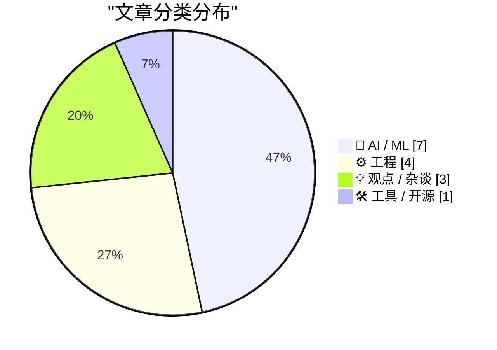
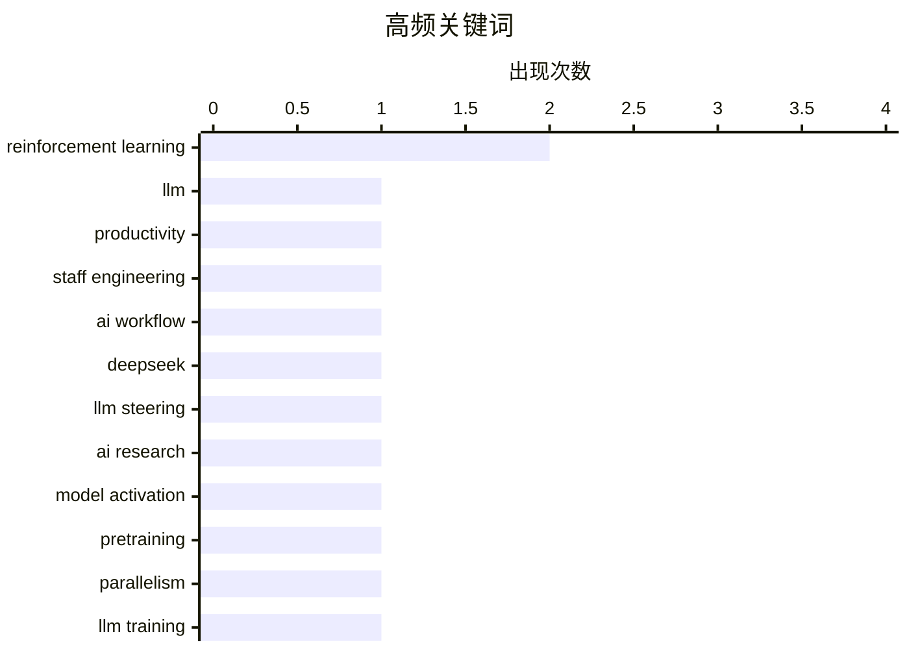

# 📰 May 17, 2026

> 来自 Karpathy 推荐的 92 个顶级技术博客，AI 精选 Top 15

## 📝 今日看点

今日技术圈呈现出从技术狂热向工程落地与理性反思转型的态势。大模型研发正深入底层架构与并行策略的实战复盘，推动资深工程师工作流向高度集成化演进。与此同时，学术界对AI垃圾论文的严厉制裁与业界对AI泡沫的深度质疑，标志着行业正进入一个治理趋严且认知重构的新阶段。此外，OpenAI等头部机构的架构重组也预示着AI产品战略正走向高度统一。

---

## 🏆 今日必读

🥇 **2026年资深工程师如何使用大模型**

[How I use LLMs as a staff engineer in 2026](https://seangoedecke.com/how-i-use-llms-in-2026/) — seangoedecke.com · 8 小时前 · 🤖 AI / ML

> 本文探讨了资深工程师在 2026 年如何深度集成大模型（LLM）到日常工作流。从最初的 Copilot 自动补全演进到处理复杂重构、跨模块代码审查及快速理解遗留系统。通过构建上下文感知的 Agent 模式，LLM 能够协助处理非核心领域的战术变更，并生成可抛弃的研究性代码。作者强调，虽然 LLM 提升了效率，但关键逻辑仍需领域专家（SME）严格把关以规避幻觉。LLM 已从辅助工具转变为工程生命周期的核心组成部分。

💡 **为什么值得读**: 提供了从初级使用到资深架构视角的 AI 协作演进路径，对职业规划极具参考价值。

🏷️ LLM, Productivity, Staff Engineering, AI Workflow

🥈 **DeepSeek-V4-Flash 让模型转向技术重获关注**

[DeepSeek-V4-Flash means LLM steering is interesting again](https://seangoedecke.com/steering-vectors/) — seangoedecke.com · 1 天前 · 🤖 AI / ML

> 探讨通过直接操纵模型中间层激活值（Steering）来引导 LLM 输出的技术回归。受 antirez 的 DwarfStar 4 项目启发，文章分析了 DeepSeek V4 Flash 模型在激活操纵方面的潜力。相比于传统的 Prompt 工程，这种“转向向量”技术能更精准地控制模型语气、风格或知识偏解。作者认为这种底层干预手段将成为未来模型微调和行为对齐的重要补充。该技术有望解决模型在特定任务中难以通过提示词纠正的顽固偏见。

💡 **为什么值得读**: 深入探讨了除 Prompt 之外的另一种模型控制范式，适合对模型底层原理感兴趣的开发者。

🏷️ DeepSeek, LLM Steering, AI Research, Model Activation

🥉 **预训练并行策略与训练失败案例笔记**

[Notes on pretraining parallelisms and failed training runs.](https://www.dwarkesh.com/p/notes-on-pretraining-parallelisms) — dwarkesh.com · 13 小时前 · 🤖 AI / ML

> 深度剖析大模型预训练中的并行计算策略及训练失败的实战教训。文章详细介绍了数据并行、张量并行和流水线并行等核心技术栈，以及在数千个 GPU 集群上维持训练稳定性的挑战。通过复盘失败的训练案例，揭示了硬件故障、梯度爆炸和通信瓶颈等导致项目中断的常见诱因。作者指出，预训练的成功不仅取决于算法，更取决于对分布式系统工程细节的极致掌控。这对于理解大模型背后的基础设施成本至关重要。

💡 **为什么值得读**: 揭秘了大模型背后昂贵且复杂的工程实现细节，是了解 AI 基础设施的硬核指南。

🏷️ pretraining, parallelism, LLM training

---

## 📊 数据概览

| 扫描源 | 抓取文章 | 时间范围 | 精选 |
|:---:|:---:|:---:|:---:|
| 82/92 | 2415 篇 → 32 篇 | 48h | **15 篇** |

### 分类分布



### 高频关键词



<details>
<summary>📈 纯文本关键词图（终端友好）</summary>

```
reinforcement learning │ ████████████████████ 2
llm                    │ ██████████░░░░░░░░░░ 1
productivity           │ ██████████░░░░░░░░░░ 1
staff engineering      │ ██████████░░░░░░░░░░ 1
ai workflow            │ ██████████░░░░░░░░░░ 1
deepseek               │ ██████████░░░░░░░░░░ 1
llm steering           │ ██████████░░░░░░░░░░ 1
ai research            │ ██████████░░░░░░░░░░ 1
model activation       │ ██████████░░░░░░░░░░ 1
pretraining            │ ██████████░░░░░░░░░░ 1
```

</details>

### 🏷️ 话题标签

**reinforcement learning**(2) · **llm**(1) · **productivity**(1) · staff engineering(1) · ai workflow(1) · deepseek(1) · llm steering(1) · ai research(1) · model activation(1) · pretraining(1) · parallelism(1) · llm training(1) · arxiv(1) · ai slop(1) · research ethics(1) · academic integrity(1) · openai(1) · greg brockman(1) · product strategy(1) · rlvr(1)

---

## 🤖 AI / ML

### 1. 2026年资深工程师如何使用大模型

[How I use LLMs as a staff engineer in 2026](https://seangoedecke.com/how-i-use-llms-in-2026/) — **seangoedecke.com** · 8 小时前 · ⭐ 28/30

> 本文探讨了资深工程师在 2026 年如何深度集成大模型（LLM）到日常工作流。从最初的 Copilot 自动补全演进到处理复杂重构、跨模块代码审查及快速理解遗留系统。通过构建上下文感知的 Agent 模式，LLM 能够协助处理非核心领域的战术变更，并生成可抛弃的研究性代码。作者强调，虽然 LLM 提升了效率，但关键逻辑仍需领域专家（SME）严格把关以规避幻觉。LLM 已从辅助工具转变为工程生命周期的核心组成部分。

🏷️ LLM, Productivity, Staff Engineering, AI Workflow

---

### 2. DeepSeek-V4-Flash 让模型转向技术重获关注

[DeepSeek-V4-Flash means LLM steering is interesting again](https://seangoedecke.com/steering-vectors/) — **seangoedecke.com** · 1 天前 · ⭐ 28/30

> 探讨通过直接操纵模型中间层激活值（Steering）来引导 LLM 输出的技术回归。受 antirez 的 DwarfStar 4 项目启发，文章分析了 DeepSeek V4 Flash 模型在激活操纵方面的潜力。相比于传统的 Prompt 工程，这种“转向向量”技术能更精准地控制模型语气、风格或知识偏解。作者认为这种底层干预手段将成为未来模型微调和行为对齐的重要补充。该技术有望解决模型在特定任务中难以通过提示词纠正的顽固偏见。

🏷️ DeepSeek, LLM Steering, AI Research, Model Activation

---

### 3. 预训练并行策略与训练失败案例笔记

[Notes on pretraining parallelisms and failed training runs.](https://www.dwarkesh.com/p/notes-on-pretraining-parallelisms) — **dwarkesh.com** · 13 小时前 · ⭐ 26/30

> 深度剖析大模型预训练中的并行计算策略及训练失败的实战教训。文章详细介绍了数据并行、张量并行和流水线并行等核心技术栈，以及在数千个 GPU 集群上维持训练稳定性的挑战。通过复盘失败的训练案例，揭示了硬件故障、梯度爆炸和通信瓶颈等导致项目中断的常见诱因。作者指出，预训练的成功不仅取决于算法，更取决于对分布式系统工程细节的极致掌控。这对于理解大模型背后的基础设施成本至关重要。

🏷️ pretraining, parallelism, LLM training

---

### 4. ArXiv 将对提交 AI 垃圾论文的研究者处以一年禁投处罚

[ArXiv to Ban Researchers for a Year if They Submit AI Slop](https://www.404media.co/new-arxiv-rules-ai-generated-papers-ban/) — **daringfireball.net** · 13 小时前 · ⭐ 24/30

> ArXiv 针对 AI 生成的低质量论文（AI Slop）出台严厉新规。计算机科学板块主席 Thomas Dietterich 宣布，若提交的论文包含 AI 生成的错误引用、剽窃内容或误导性信息，作者将面临禁投一年的处罚。该政策强调作者对论文中任何 AI 输出负有最终责任，旨在遏制学术界日益严重的 AI 滥用现象。这一举措标志着预印本平台开始通过制度化手段维护科研诚信。此举反映了学术界对生成式 AI 污染科研成果的深度担忧。

🏷️ ArXiv, AI Slop, Research Ethics, Academic Integrity

---

### 5. Greg Brockman 正式掌管 OpenAI 产品部门

[Greg Brockman Officially Takes Control of Products at OpenAI, a Very Stable Well-Run Company](https://www.wired.com/story/openai-reorg-greg-brockman-product/) — **daringfireball.net** · 1 天前 · ⭐ 24/30

> OpenAI 宣布重组，联合创始人兼总裁 Greg Brockman 正式接管产品部门。Brockman 将在负责 AI 基础设施的基础上，全面领导公司的产品战略，旨在统一 OpenAI 的产品线。此前该职位由 Fidji Simo 临时担任，此次变动反映了公司在追求通用人工智能（AGI）过程中对产品与技术整合的迫切需求。这一人事调整被视为 OpenAI 在经历管理层动荡后，试图通过核心元老回归来稳固产品方向。公司正致力于将研究成果更快速地转化为商业化产品。

🏷️ OpenAI, Greg Brockman, product strategy

---

### 6. RLVR 在科学发现领域可能表现极差

[RLVR might be disproportionately bad at science](https://www.dwarkesh.com/p/rlvr-might-be-disproportionately) — **dwarkesh.com** · 13 小时前 · ⭐ 24/30

> 探讨基于可验证奖励的强化学习（RLVR）在科学研究领域可能存在的局限性。RLVR 在代码编写和数学证明等反馈周期短的领域表现优异，但科学理论的验证往往跨越数十年。文章指出，这种学习机制可能导致模型过度优化短期可验证性，而忽视了那些初期预测较差但长远来看更正确的理论。作者认为，科学发现的本质与目前主流的强化学习反馈回路存在天然的错位。这暗示了 AI 在处理深层科学创新时需要全新的训练范式。

🏷️ RLVR, reinforcement learning, scientific discovery

---

### 7. Eric Jang：从零构建 AlphaGo

[Eric Jang – Building AlphaGo from scratch](https://www.dwarkesh.com/p/eric-jang) — **dwarkesh.com** · 1 天前 · ⭐ 24/30

> 通过从零构建 AlphaGo 的视角，重新审视智能的三大核心原语：搜索、经验学习和自我博弈。文章回顾了蒙特卡洛树搜索（MCTS）与神经网络结合的经典架构，认为这是目前最纯粹的智能实现案例。Eric Jang 详细解析了 AlphaGo 如何通过海量对局自我进化，并讨论了这些原始技术在当今大模型时代的延续与演变。作者强调，即便在 LLM 盛行的今天，AlphaGo 的底层逻辑依然是理解复杂决策系统的基石。这种基于搜索的强化学习思路正重新成为提升 LLM 推理能力的关键。

🏷️ AlphaGo, reinforcement learning, search

---

## ⚙️ 工程

### 8. CreateFileMapping 始终报告 ERROR_ALREADY_EXISTS 的案例分析

[The case of the Create­File­Mapping that always reported ERROR_ALREADY_EXISTS](https://devblogs.microsoft.com/oldnewthing/20260515-00/?p=112327) — **devblogs.microsoft.com/oldnewthing** · 1 天前 · ⭐ 23/30

> 深入解析 Windows API 中 CreateFileMapping 函数始终返回 ERROR_ALREADY_EXISTS 错误的底层原因。文章指出，当开发者尝试创建一个已存在的命名内核对象时，系统会返回现有对象的句柄并设置该错误码，这通常源于命名冲突或对共享内存生命周期的误解。通过具体的调试案例，作者演示了如何正确处理这种“非错误型错误”以确保多进程协作的稳定性。这是典型的 Windows 系统编程陷阱，涉及内核对象命名空间的细微差别。理解这一机制对于编写健壮的底层并发程序至关重要。

🏷️ Windows API, debugging, systems programming

---

### 9. 语言包管理器注册表默认是不稳定的

[Language Registries Are Unstable by Default](https://nesbitt.io/2026/05/15/language-registries-are-unstable-by-default.html) — **nesbitt.io** · 1 天前 · ⭐ 22/30

> 现代编程语言的包管理器注册表（如 npm、PyPI、Cargo）在设计哲学上倾向于快速迭代，导致其默认状态具有高度的不稳定性。开发者在依赖这些注册表时，本质上是将整个开发环境置于类似于 Debian 'unstable' 分支的风险之中。文章探讨了这种“默认不稳定”现状如何破坏软件的长期维护性与构建的可重复性。虽然这种机制加速了新特性的分发，但也迫使开发者必须投入大量精力去应对频繁的依赖冲突和版本漂移问题。

🏷️ package manager, dependency, stability

---

### 10. 引用 Julia Evans：从 Tailwind 回归原生 CSS 的反思

[Quoting Julia Evans](https://simonwillison.net/2026/May/16/julia-evans/#atom-everything) — **simonwillison.net** · 15 小时前 · ⭐ 21/30

> 知名技术博主 Julia Evans 分享了她从依赖 Tailwind CSS 转向深入学习并尊重原生 CSS 的心路历程。她指出，过去十年中 CSS 已经发生了巨大演进，许多曾经被诟病的难题（如垂直居中）早已通过 Flexbox 和 Grid 等现代特性得到了优雅解决。通过将 CSS 视为一门严肃的技术而非“难以捉摸的麻烦”，开发者可以构建更具结构化且易于维护的代码库。这种转变不仅减少了对外部框架的依赖，也显著提升了对 Web 基础技术的掌握深度。

🏷️ CSS, Tailwind, Frontend, Web Development

---

### 11. 还原 xorshift128 伪随机数生成器的内部状态

[Recovering the state of xorshift128](https://www.johndcook.com/blog/2026/05/15/xorshift128-state/) — **johndcook.com** · 1 天前 · ⭐ 21/30

> 本文深入探讨了如何通过观察输出序列来逆向推导 xorshift128 伪随机数生成器（RNG）的 128 位内部状态。作者继分析 Mersenne Twister 和 lehmer64 之后，展示了针对 xorshift 算法的数学攻击方法。通过建立线性方程组并利用位运算的特性，可以从极少量的连续随机数输出中完全恢复种子状态。这一研究再次强调了在安全敏感场景下，非加密级随机数生成器所面临的可预测性风险。

🏷️ cryptography, RNG, reverse engineering

---

## 💡 观点 / 杂谈

### 12. 如果我们正处于 AI 泡沫中会怎样？（第一部分）

[Premium: What If...We're In An AI Bubble? (Part 1)](https://www.wheresyoured.at/premium-what-if-were-in-an-ai-bubble-part-1/) — **wheresyoured.at** · 1 天前 · ⭐ 24/30

> 深度质疑当前 AI 热潮是否存在泡沫，并反驳了关于 AGI 将导致“永久底层阶级”的激进预测。文章批评了将当前模型能力进行盲目线性外推的逻辑谬误，指出这种预测忽略了技术落地的实际阻力。作者分析了 AI 行业在软件开发和就业市场上的真实影响，认为目前的估值与实际产出之间存在巨大鸿沟。第一部分重点讨论了市场对 AI 替代人类能力的过度乐观情绪及其潜在风险。作者呼吁回归商业本质，审视 AI 技术的实际投资回报率。

🏷️ AI bubble, economics, hype

---

### 13. 混淆“智能”与“权力”的错误

[The mistake of conflating intelligence and power](https://www.dwarkesh.com/p/the-mistake-of-conflating-intelligence) — **dwarkesh.com** · 13 小时前 · ⭐ 23/30

> 探讨将“智能”与“权力”混为一谈的认知误区。文章挑战了将智能定义为“在多领域实现目标的能力”的流行观点，指出若以此为标准，历史上的独裁者可能被视为最聪明的人。作者主张将认知层面的解决问题能力与社会/物理层面的支配权力区分开来，认为这种混淆误导了我们对 AGI 风险的评估。通过哲学思辨，文章呼吁重新定义智能，以更准确地预测 AI 对人类社会的潜在影响。这种区分有助于我们更理性地讨论 AI 的安全边界与治理。 

🏷️ intelligence, AI alignment, philosophy

---

### 14. Reddit 开始阻止部分移动端用户访问其网页版

[Reddit Is Blocking Some Users From Accessing Its Website From Mobile Devices](https://arstechnica.com/information-technology/2026/05/why-reddit-blocked-my-daily-visit-to-its-mobile-website/) — **daringfireball.net** · 11 小时前 · ⭐ 21/30

> Reddit 正在采取激进措施强制移动端用户下载其官方 App，通过在移动网页版上设置无法跳过、无法关闭的弹窗遮罩来阻断正常访问。这种“围墙花园”策略剥夺了用户在浏览器中自由阅读内容的权利，且没有提供任何绕过选项或替代方案。Ars Technica 的作者指出，这种做法严重破坏了 Web 的开放性体验，旨在将流量强行导向受控的 App 环境以利于商业变现。这一举动引发了用户对于平台中心化控制和移动端网页生态持续恶化的广泛担忧。

🏷️ Reddit, Mobile Web, User Experience, Dark Patterns

---

## 🛠 工具 / 开源

### 15. 使用 ZIP Shrinker 缩小 ZIP 文件体积

[Make ZIP files smaller with ZIP Shrinker](https://evanhahn.com/make-zip-files-smaller-with-zip-shrinker/) — **evanhahn.com** · 1 天前 · ⭐ 22/30

> ZIP Shrinker 是一款基于浏览器的轻量级工具，专门用于优化 ZIP 及其衍生格式（如 APK、EPUB、JAR）的存储效率。该工具通过三个核心步骤实现瘦身：使用更高强度的压缩算法重新压缩归档内的每个文件、彻底移除冗余的元数据、以及删除目录条目。由于它完全在浏览器本地运行，用户无需上传文件即可完成操作，兼顾了隐私与处理速度。这种方法能在不改变文件内容的前提下，通过消除 ZIP 结构的冗余开销实现极致压缩。

🏷️ compression, ZIP, web tool

---

*生成于 2026-05-17 08:30 | 扫描 82 源 → 获取 2415 篇 → 精选 15 篇*
*基于 [Hacker News Popularity Contest 2025](https://refactoringenglish.com/tools/hn-popularity/) RSS 源列表，由 [Andrej Karpathy](https://x.com/karpathy) 推荐*
