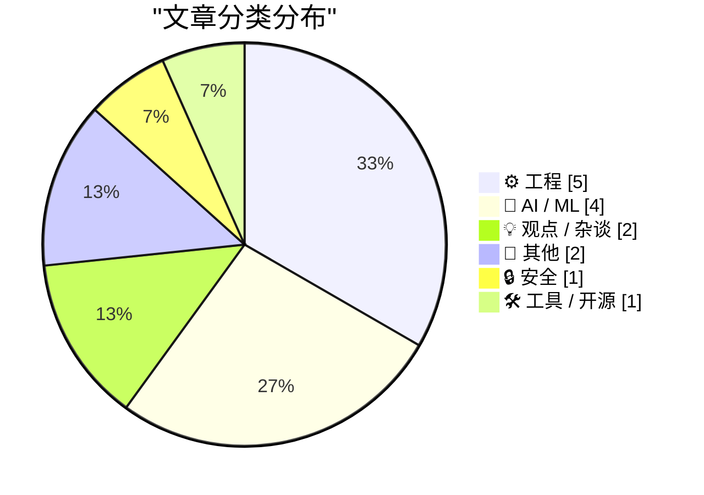
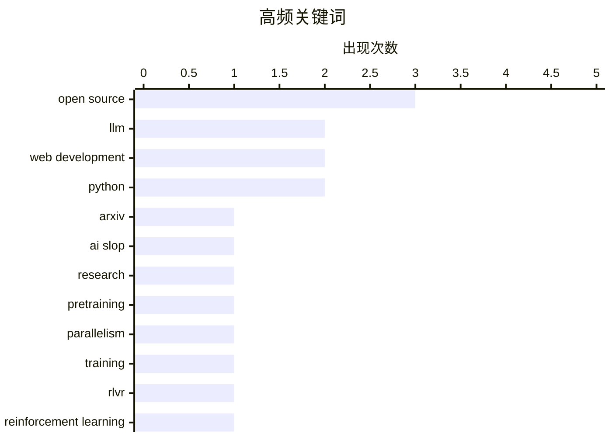

# 📰 May 18, 2026

> 来自 Karpathy 推荐的 92 个顶级技术博客，AI 精选 Top 15

## 📝 今日看点

今日技术圈呈现出从狂热转向理性的治理与回归趋势。ArXiv 严惩 AI 垃圾论文与业界对“AI 是技术而非产品”的讨论，标志着 AI 正在经历从应用噱头向底层基础设施的范式转移。与此同时，NHS 退出开源引发的政策博弈以及开发者重拾原生 CSS，映射出工程领域在面对安全与效率挑战时，正重新审视透明度与技术底座的价值。此外，Reddit 强制引流 App 等行为也再次引发了关于平台控制权与用户体验边界的广泛讨论。

---

## 🏆 今日必读

🥇 **ArXiv 将对提交 AI 垃圾论文的研究员处以一年禁令**

[ArXiv to Ban Researchers for a Year if They Submit AI Slop](https://www.404media.co/new-arxiv-rules-ai-generated-papers-ban/) — daringfireball.net · 1 天前 · 🤖 AI / ML

> ArXiv 计算机科学板块主席 Thomas Dietterich 宣布了针对 AI 生成内容的新规。如果提交的论文包含由生成式 AI 产生的错误引用、剽窃内容、偏见或误导性信息，作者将承担全部责任。一旦发现论文中存在不可辩驳的“AI 垃圾（AI Slop）”证据，相关研究人员将被禁止在 ArXiv 提交文章一年。此举旨在维护学术诚信，防止低质量、未经审核的 AI 内容充斥预印本平台。ArXiv 强调 AI 只是工具，不能作为产生学术错误的借口。

💡 **为什么值得读**: 了解学术界如何通过严厉惩罚措施应对 AI 生成内容带来的学术诚信危机。

🏷️ ArXiv, AI slop, research, LLM

🥈 **关于预训练并行化与训练失败案例的笔记**

[Notes on pretraining parallelisms and failed training runs.](https://www.dwarkesh.com/p/notes-on-pretraining-parallelisms) — dwarkesh.com · 1 天前 · 🤖 AI / ML

> 本文深入探讨了大语言模型（LLM）预训练中的多种并行策略，包括数据并行、张量并行和流水线并行。作者通过调研揭示了大规模训练任务失败的常见原因，如硬件故障、损失函数激增（Loss Spikes）以及互联带宽瓶颈。文中详细记录了在数千个 GPU 集群上维持训练稳定性的工程细节。这些笔记强调了在追求模型规模的同时，底层基础设施的鲁棒性才是决定训练成败的关键。对于从事大规模分布式训练的工程师具有极高的参考价值。

💡 **为什么值得读**: 深入理解大规模模型训练背后的工程复杂性，以及如何应对实际生产中的训练中断。

🏷️ Pretraining, Parallelism, LLM, Training

🥉 **RLVR 在科学研究领域可能表现极差**

[RLVR might be disproportionately bad at science](https://www.dwarkesh.com/p/rlvr-might-be-disproportionately) — dwarkesh.com · 1 天前 · 🤖 AI / ML

> 文章分析了基于可验证奖励的强化学习（RLVR）在科学发现中的局限性。RLVR 在数学证明或代码生成等具有即时、客观验证反馈的领域表现优异。然而，科学理论的验证周期往往长达数十年甚至数世纪，且当前的“最佳理论”在短期预测上可能反而不如旧理论。这种反馈延迟和验证的复杂性使得 RLVR 难以捕捉科学探索中的深层逻辑。作者认为，过度依赖短期可验证性可能会阻碍真正的科学突破。

💡 **为什么值得读**: 探讨强化学习在科学发现中的本质局限，反思 AI 评估机制与科学规律的错位。

🏷️ RLVR, Reinforcement Learning, Science

---

## 📊 数据概览

| 扫描源 | 抓取文章 | 时间范围 | 精选 |
|:---:|:---:|:---:|:---:|
| 79/92 | 2179 篇 → 21 篇 | 48h | **15 篇** |

### 分类分布



### 高频关键词



<details>
<summary>📈 纯文本关键词图（终端友好）</summary>

```
open source     │ ████████████████████ 3
llm             │ █████████████░░░░░░░ 2
web development │ █████████████░░░░░░░ 2
python          │ █████████████░░░░░░░ 2
arxiv           │ ███████░░░░░░░░░░░░░ 1
ai slop         │ ███████░░░░░░░░░░░░░ 1
research        │ ███████░░░░░░░░░░░░░ 1
pretraining     │ ███████░░░░░░░░░░░░░ 1
parallelism     │ ███████░░░░░░░░░░░░░ 1
training        │ ███████░░░░░░░░░░░░░ 1
```

</details>

### 🏷️ 话题标签

**open source**(3) · **llm**(2) · **web development**(2) · python(2) · arxiv(1) · ai slop(1) · research(1) · pretraining(1) · parallelism(1) · training(1) · rlvr(1) · reinforcement learning(1) · science(1) · security(1) · ransomware(1) · data breach(1) · css(1) · tailwind(1) · frontend(1) · ai(1)

---

## ⚙️ 工程

### 1. 引用 Julia Evans：从 Tailwind 回归原生 CSS 的思考

[Quoting Julia Evans](https://simonwillison.net/2026/May/16/julia-evans/#atom-everything) — **simonwillison.net** · 1 天前 · ⭐ 23/30

> Julia Evans 分享了她从依赖 Tailwind CSS 框架回归到深入学习原生 CSS 的心路历程。她指出，过去十年中 CSS 发生了巨大变化，Flexbox 和 Grid 等现代特性已经解决了“居中难”等历史痛点。通过放弃抽象框架并认真对待 CSS 技术，她发现能够更优雅地构建页面结构并减少挫败感。文章强调了掌握底层技术标准的重要性，而非仅仅依赖工具层。这种转变让她重新获得了对前端开发的掌控感和尊重。

🏷️ CSS, Tailwind, frontend, web development

---

### 2. GDS 评英国国民医疗服务体系（NHS）退出开源的决策

[GDS weighs in on the NHS's decision to retreat from Open Source](https://simonwillison.net/2026/May/17/gds-weighs-in/#atom-everything) — **simonwillison.net** · 18 小时前 · ⭐ 21/30

> 英国政府数字服务局（GDS）对 NHS 因安全漏洞报告而关闭开源代码库的行为表示关切。NHS 的这一决策被批评为“通过隐晦实现安全”的倒退，违背了政府“默认开源”的原则。Terence Eden 指出，关闭代码库不仅无法消除漏洞，反而阻碍了社区贡献和透明度。GDS 介入此事暗示了政府内部对于如何平衡安全风险与开源策略存在严重分歧。此事件引发了关于公共部门软件开发透明度的广泛讨论。

🏷️ open source, NHS, GDS, government tech

---

### 3. GDS 介入 NHS 退出开源事件：一场“没有饼干的会议”

[GDS weighs in on the NHS's decision to retreat from Open Source](https://shkspr.mobi/blog/2026/05/gds-weighs-in-on-the-nhss-decision-to-retreat-from-open-source/) — **shkspr.mobi** · 22 小时前 · ⭐ 21/30

> 本文详细描述了英国 GDS 与 NHS 之间就开源政策发生的公开冲突。NHS 在收到漏洞报告后选择关闭其 GitHub 仓库，这一举动被 GDS 视为对现代开发实践的背叛。文中使用了“没有饼干的会议”这一英国公务员术语，暗示双方讨论气氛极其冷淡且严肃。GDS 强调，公开代码是发现并修复漏洞的最佳途径，而非掩盖它们。这场争论标志着英国政府内部在数字化转型路径上的核心矛盾公开化。

🏷️ Open Source, Government IT, Policy

---

### 4. FediMeteo、HAProxy 与节省 snac 线程的艺术

[FediMeteo, HAProxy, and the art of not wasting snac threads](https://it-notes.dragas.net/2026/05/18/fedimeteo-haproxy-and-the-art-of-not-wasting-snac-threads/) — **it-notes.dragas.net** · 36 分钟前 · ⭐ 21/30

> 作者分享了在极低配置的 FreeBSD VPS 上运行全球天气服务 FediMeteo 的优化经验。该服务基于 snac（一种轻量级 ActivityPub 服务器），但在高并发下容易耗尽线程资源。通过引入 HAProxy 作为前置代理，作者实现了对请求的精细化调度和线程复用。这种架构调整显著降低了 CPU 和内存占用，使微型服务器也能稳定处理数千名用户的请求。文章提供了具体的配置思路，展示了如何通过精巧的运维手段压榨硬件性能。

🏷️ HAProxy, FreeBSD, Fediverse, Performance

---

### 5. SQLAlchemy 2 实战 - 第 8 章：SQLAlchemy 与 Web 开发

[SQLAlchemy 2 In Practice - Chapter 8: SQLAlchemy and the Web](https://blog.miguelgrinberg.com/post/sqlalchemy-2-in-practice---chapter-8-sqlalchemy-and-the-web) — **miguelgrinberg.com** · 1 天前 · ⭐ 21/30

> 在 Web 应用程序中集成 SQLAlchemy 2 需要妥善处理数据库会话（Session）的生命周期，以确保连接池的高效利用和事务一致性。在 Flask 等同步框架中，推荐使用 scoped_session 实现线程安全的会话管理；而在 FastAPI 等异步框架中，则需利用 AsyncSession 配合依赖注入机制。文章详细演示了如何通过中间件或装饰器在请求开始时创建会话并在响应结束时自动关闭，避免连接泄露。针对高并发场景，作者还探讨了连接池配置优化及异常回滚的最佳实践。

🏷️ Python, SQLAlchemy, ORM, Web Development

---

## 🤖 AI / ML

### 6. ArXiv 将对提交 AI 垃圾论文的研究员处以一年禁令

[ArXiv to Ban Researchers for a Year if They Submit AI Slop](https://www.404media.co/new-arxiv-rules-ai-generated-papers-ban/) — **daringfireball.net** · 1 天前 · ⭐ 26/30

> ArXiv 计算机科学板块主席 Thomas Dietterich 宣布了针对 AI 生成内容的新规。如果提交的论文包含由生成式 AI 产生的错误引用、剽窃内容、偏见或误导性信息，作者将承担全部责任。一旦发现论文中存在不可辩驳的“AI 垃圾（AI Slop）”证据，相关研究人员将被禁止在 ArXiv 提交文章一年。此举旨在维护学术诚信，防止低质量、未经审核的 AI 内容充斥预印本平台。ArXiv 强调 AI 只是工具，不能作为产生学术错误的借口。

🏷️ ArXiv, AI slop, research, LLM

---

### 7. 关于预训练并行化与训练失败案例的笔记

[Notes on pretraining parallelisms and failed training runs.](https://www.dwarkesh.com/p/notes-on-pretraining-parallelisms) — **dwarkesh.com** · 1 天前 · ⭐ 26/30

> 本文深入探讨了大语言模型（LLM）预训练中的多种并行策略，包括数据并行、张量并行和流水线并行。作者通过调研揭示了大规模训练任务失败的常见原因，如硬件故障、损失函数激增（Loss Spikes）以及互联带宽瓶颈。文中详细记录了在数千个 GPU 集群上维持训练稳定性的工程细节。这些笔记强调了在追求模型规模的同时，底层基础设施的鲁棒性才是决定训练成败的关键。对于从事大规模分布式训练的工程师具有极高的参考价值。

🏷️ Pretraining, Parallelism, LLM, Training

---

### 8. RLVR 在科学研究领域可能表现极差

[RLVR might be disproportionately bad at science](https://www.dwarkesh.com/p/rlvr-might-be-disproportionately) — **dwarkesh.com** · 1 天前 · ⭐ 24/30

> 文章分析了基于可验证奖励的强化学习（RLVR）在科学发现中的局限性。RLVR 在数学证明或代码生成等具有即时、客观验证反馈的领域表现优异。然而，科学理论的验证周期往往长达数十年甚至数世纪，且当前的“最佳理论”在短期预测上可能反而不如旧理论。这种反馈延迟和验证的复杂性使得 RLVR 难以捕捉科学探索中的深层逻辑。作者认为，过度依赖短期可验证性可能会阻碍真正的科学突破。

🏷️ RLVR, Reinforcement Learning, Science

---

### 9. 混淆智能与权力的误区

[The mistake of conflating intelligence and power](https://www.dwarkesh.com/p/the-mistake-of-conflating-intelligence) — **dwarkesh.com** · 1 天前 · ⭐ 20/30

> 将“智能”简单定义为“在广泛领域实现目标的能力”会导致逻辑偏差，因为这模糊了认知能力与社会权力之间的界限。如果仅以目标达成度衡量智能，斯大林可能会被视为史上最聪明的人，但这忽略了社会资源、政治手段和暴力工具在权力运作中的核心作用。真正的智能应侧重于认知、推理和解决问题的复杂性，而非单纯的执行结果或影响力。作者指出，高智能并不等同于必然获得高权力，厘清两者边界有助于更理性地评估 AI 的潜在风险。

🏷️ Intelligence, Power, Philosophy

---

## 💡 观点 / 杂谈

### 10. AI 是技术，而非产品

[★ AI Is Technology, Not a Product](https://daringfireball.net/2026/05/ai_is_technology_not_a_product) — **daringfireball.net** · 1 天前 · ⭐ 23/30

> John Gruber 提出 AI 不应被视为独立的产品或功能，而是一种底层技术。他类比了电力和互联网，认为 AI 最终将无感地融入到所有软件和服务中。目前市场上将其作为噱头推销的做法是阶段性的误区，真正的价值在于 AI 如何增强现有工作流。文章批评了那些为了 AI 而 AI 的产品设计，主张开发者应关注解决具体问题。结论是，当 AI 变得不再是新闻时，它才真正发挥了作为技术的潜力。

🏷️ AI, product strategy, technology

---

### 11. 间隔重复法的适用性探讨

[The Applicability of Spaced Repetition](https://borretti.me/article/the-applicability-of-spaced-repetition) — **borretti.me** · 1 天前 · ⭐ 18/30

> 间隔重复（Spaced Repetition）在记忆事实性知识方面效果显著，但在处理复杂的概念性知识时面临挑战。文章探讨了如何将这种记忆技术应用于需要深度理解的领域，强调了将复杂概念拆解为原子化事实的重要性。作者指出，单纯的记忆并不能替代理解，但通过合理的卡片设计，可以利用间隔重复来巩固思维模型和逻辑框架。有效的学习策略应当结合主动召回与知识关联，使间隔重复成为构建长期知识体系的辅助工具而非唯一手段。

🏷️ Spaced Repetition, Learning, Knowledge Management

---

## 📝 其他

### 12. Reddit 阻止部分移动端用户访问其网页版

[Reddit Is Blocking Some Users From Accessing Its Website From Mobile Devices](https://arstechnica.com/information-technology/2026/05/why-reddit-blocked-my-daily-visit-to-its-mobile-website/) — **daringfireball.net** · 1 天前 · ⭐ 21/30

> Reddit 近期开始强制部分移动端网页用户使用其原生 App，通过不可跳过的全屏遮罩层阻断访问。用户在移动浏览器访问时会收到“获取 App 以继续使用”的提示，且没有任何关闭或绕过选项。这种激进的引流策略引起了广泛不满，被认为是对开放 Web 生态的破坏。Ars Technica 的报道指出，这是平台为了提高用户留存和广告收入而采取的“围墙花园”策略。此举反映了大型社交平台在用户体验与商业利益之间的极端取舍。

🏷️ Reddit, mobile web, UX, dark patterns

---

### 13. 圣克拉拉县起诉 Meta：指控其纵容诈骗广告牟利

[Santa Clara County Sues Meta Over Alleged Scam Ads](https://sanjosespotlight.com/santa-clara-county-sues-meta-over-alleged-scam-ads/) — **daringfireball.net** · 1 天前 · ⭐ 19/30

> 圣克拉拉县对 Meta 提起诉讼，指控其为了每年高达 70 亿美元的诈骗广告收入，蓄意削弱内部反欺诈团队并协助虚假公司绕过过滤机制。起诉书指出，Meta 不仅未能履行打击误导性广告的责任，反而通过技术手段帮助诈骗者规避监管，导致大量用户遭受经济损失。该诉讼要求法院禁止 Meta 继续违反虚假广告法，并支付律师费及相关赔偿。这一案件揭示了大型社交平台在广告营收压力下，可能存在的系统性监管缺失和道德风险。

🏷️ Meta, lawsuit, advertising, fraud

---

## 🔒 安全

### 14. Troy Hunt 每周更新 504 期

[Weekly Update 504](https://www.troyhunt.com/weekly-update-504/) — **troyhunt.com** · 6 小时前 · ⭐ 24/30

> 本期更新重点讨论了企业在面对黑客勒索时是否应该支付赎金以防止数据泄露。知名安全专家 Troy Hunt 引用了 Grafana 最近采取的“拒绝支付”策略作为案例。文章分析了支付赎金并不能保证数据不被二次泄露的风险，以及这种行为对黑客产业的助长作用。此外，文中还涵盖了近期多起重大数据泄露事件的后续影响和行业应对措施。Hunt 呼吁企业应转向透明化管理，而非通过私下交易掩盖安全漏洞。

🏷️ Security, Ransomware, Data Breach

---

## 🛠 工具 / 开源

### 15. 从 Warelay 到 OpenClaw：追踪项目更名历程

[Warelay -> OpenClaw](https://simonwillison.net/2026/May/16/openclaw-names/#atom-everything) — **simonwillison.net** · 1 天前 · ⭐ 18/30

> 开发者 Simon Willison 在准备 PyCon US 演讲时，回顾了其开源项目 OpenClaw（原名 Warelay）自去年 11 月首次提交以来的更名历程。通过使用自研的 first_line_history.py 脚本，他精确追踪了项目代码库中名称演变的每一个节点。OpenClaw 作为一个旨在简化 LLM 交互的工具，其命名变化反映了项目定位的不断迭代与清晰化。文章展示了如何利用 Python 自动化工具挖掘 Git 历史中的元数据，为项目演进提供数据支撑。

🏷️ Python, PyCon, OpenClaw, open source

---

*生成于 2026-05-18 10:20 | 扫描 79 源 → 获取 2179 篇 → 精选 15 篇*
*基于 [Hacker News Popularity Contest 2025](https://refactoringenglish.com/tools/hn-popularity/) RSS 源列表，由 [Andrej Karpathy](https://x.com/karpathy) 推荐*
