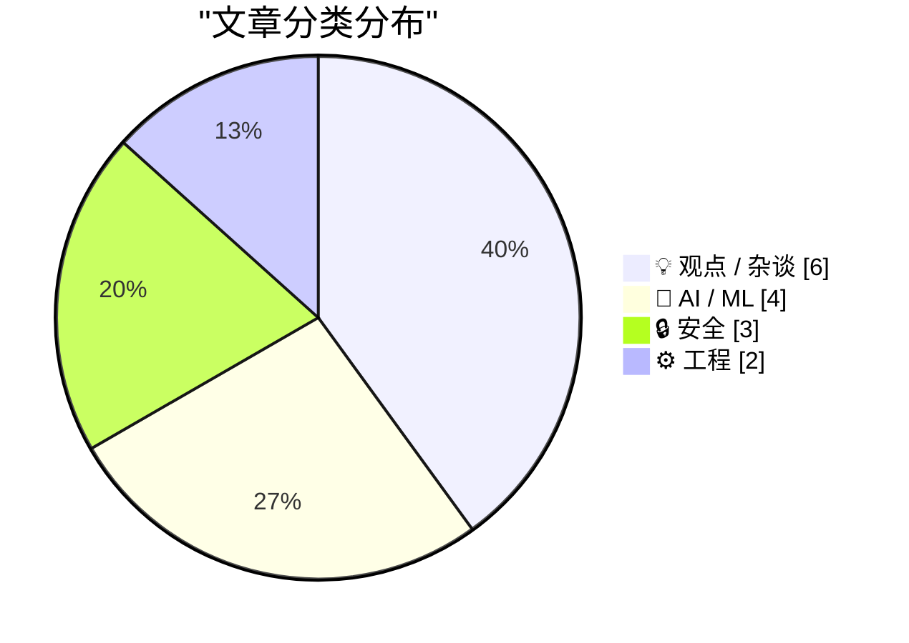
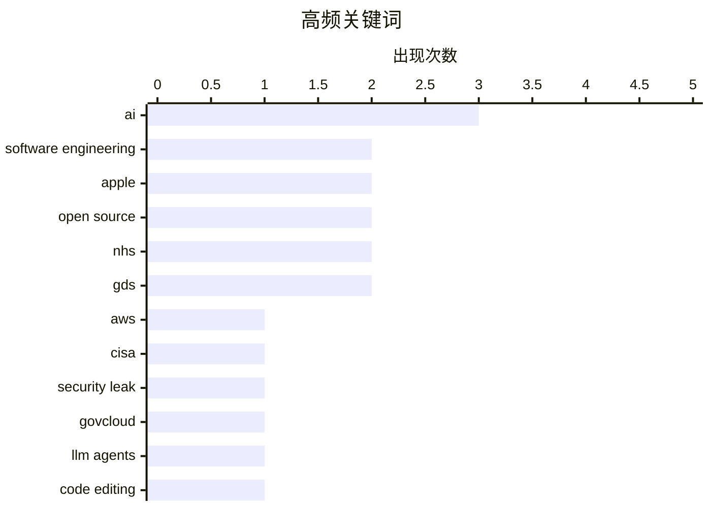

# 📰 May 19, 2026

> 来自 Karpathy 推荐的 92 个顶级技术博客，AI 精选 Top 15

## 📝 今日看点

今日技术圈聚焦于 AI 驱动下的职业身份重塑与数字安全治理的深层博弈。随着大模型应用进入深水区，开发者正从传统编码者向“AI 赋能工程师”转型，但人类认知的带宽瓶颈与法律诉讼的尘埃落定，正为这场技术狂飙划定边界。与此同时，从 CISA 密钥泄露到身份验证争议，数据安全风险再次敲响警钟，迫使行业在效率至上的工程文化中重新审视隐私保护与代码溯源的底层价值。

---

## 🏆 今日必读

🥇 **CISA 管理员在 GitHub 泄露 AWS GovCloud 密钥**

[CISA Admin Leaked AWS GovCloud Keys on Github](https://krebsonsecurity.com/2026/05/cisa-admin-leaked-aws-govcloud-keys-on-github/) — krebsonsecurity.com · 13 小时前 · 🔒 安全

> 美国网络安全与基础设施安全局（CISA）的一名承包商在 GitHub 公开仓库中意外泄露了多个高权限 AWS GovCloud 账户凭据。泄露内容不仅包含访问权限，还涉及大量 CISA 内部系统的敏感信息，以及详细记录软件构建、测试和部署流程的内部文件。安全专家评价此次事件为近年来最严重的政府数据泄露之一，暴露了顶级安全机构在基础运维安全上的漏洞。该事件直接威胁到国家关键基础设施的安全，再次引发了对政府外包人员权限管理的广泛质疑。

💡 **为什么值得读**: 揭示了顶级安全机构在基础运维安全上的低级失误及其带来的巨大风险，是云安全管理的典型反面教材。

🏷️ AWS, CISA, security leak, GovCloud

🥈 **LLM Agent 编辑工具的替代方案**

[Alternatives for the EDIT tool of LLM agents](http://antirez.com/news/166) — antirez.com · 2 小时前 · 🤖 AI / ML

> Redis 创始人 Salvatore Sanfilippo 针对 LLM Agent 在代码编辑任务中 Token 消耗过高的问题提出了优化方案。目前的 EDIT 工具通常要求模型完整输出旧代码以定位修改位置，这在 Token 资源受限的本地推理场景中效率极低。作者探讨了通过 CRC32 校验等技术手段在保证修改准确性的同时减少冗余输出的权衡方案。这种优化对于提升本地大模型在处理复杂项目（如 DS4）时的响应速度和处理能力至关重要。文章最后还讨论了在性能与可靠性之间的技术取舍。

💡 **为什么值得读**: Redis 作者亲述如何通过底层技术优化 LLM Agent 的执行效率，极具实战参考价值。

🏷️ LLM agents, code editing, algorithms

🥉 **五分钟回顾 LLM 领域的过去半年**

[The last six months in LLMs in five minutes](https://simonwillison.net/2026/May/19/5-minute-llms/#atom-everything) — simonwillison.net · 8 小时前 · 🤖 AI / ML

> Simon Willison 在 PyCon US 2026 上的闪电演讲总结了过去六个月大语言模型（LLM）领域的爆发式进展。文章通过带注释的幻灯片形式，梳理了从模型架构演进到应用工具链更新的关键节点。内容涵盖了多模态能力的普及、长文本上下文处理的突破以及开源模型与闭源模型之间的竞争态势。这为开发者提供了一个快速同步行业前沿动态的高效窗口，帮助读者在信息过载的环境中抓住核心趋势。作者利用其开发的标注工具，使演示文稿在网页端也具备极佳的可读性。

💡 **为什么值得读**: 由顶级技术博主对 AI 领域半年动态进行的极简总结，适合快速补齐行业认知。

🏷️ LLM, AI, PyCon, summary

---

## 📊 数据概览

| 扫描源 | 抓取文章 | 时间范围 | 精选 |
|:---:|:---:|:---:|:---:|
| 83/92 | 2434 篇 → 32 篇 | 48h | **15 篇** |

### 分类分布



### 高频关键词



<details>
<summary>📈 纯文本关键词图（终端友好）</summary>

```
ai                   │ ████████████████████ 3
software engineering │ █████████████░░░░░░░ 2
apple                │ █████████████░░░░░░░ 2
open source          │ █████████████░░░░░░░ 2
nhs                  │ █████████████░░░░░░░ 2
gds                  │ █████████████░░░░░░░ 2
aws                  │ ███████░░░░░░░░░░░░░ 1
cisa                 │ ███████░░░░░░░░░░░░░ 1
security leak        │ ███████░░░░░░░░░░░░░ 1
govcloud             │ ███████░░░░░░░░░░░░░ 1
```

</details>

### 🏷️ 话题标签

**ai**(3) · **software engineering**(2) · **apple**(2) · open source(2) · nhs(2) · gds(2) · aws(1) · cisa(1) · security leak(1) · govcloud(1) · llm agents(1) · code editing(1) · algorithms(1) · llm(1) · pycon(1) · summary(1) · productivity(1) · human factors(1) · privacy(1) · age verification(1)

---

## 💡 观点 / 杂谈

### 1. “只会说不”的工程师是零利率政策时代的产物

[The just-say-no engineer was a ZIRP phenomenon](https://seangoedecke.com/the-just-say-no-engineer-was-a-zirp-phenomenon/) — **seangoedecke.com** · 1 天前 · ⭐ 23/30

> 本文分析了资深工程师中常见的“只会说不”这一典型角色，并将其归结为零利率政策（ZIRP）时期的特殊产物。在资金充裕的年代，这类工程师通过减缓开发速度、拒绝复杂功能和减少代码量来规避技术债务，被视为“风险控制者”。然而，随着经济环境变化，这种单纯的阻碍行为正逐渐失去市场，企业更需要能够创造实际业务价值的开发者。文章指出，工程师的角色正在从“问题规避者”向更具建设性的方向转型。这种转变要求资深开发者重新思考如何通过技术手段支持业务增长而非仅仅是防御。

🏷️ engineering culture, ZIRP, career development, senior engineer

---

### 2. 别再自称软件工程师，你现在是“AI 赋能工程师”

[Don't call yourself a Software Engineer, you are an AI Enabled Engineer.](https://idiallo.com/blog/you-are-an-ai-enabled-engineer-now?src=feed) — **idiallo.com** · 22 小时前 · ⭐ 23/30

> 作者探讨了在 AI 普及的背景下，程序员职业身份的根本性转变。文章指出，传统的计算机科学教育与当前由 AI 驱动的就业市场之间存在严重脱节，学生和从业者必须重新审视自己的核心价值。与其坚守传统的编码角色，不如接受自己作为“AI 赋能工程师”的新身份，利用工具提升效率。作者还批判了 LinkedIn 等社交平台在职业连接上的虚假性，强调在 AI 时代建立真实技术能力的重要性。结论是，适应 AI 工具将成为未来工程师的核心竞争力。

🏷️ software engineering, AI education, career

---

### 3. 请定义什么是“爆发”

[Define ‘Boom’ Please](https://www.nytimes.com/2026/04/21/business/how-apple-became-a-4-trillion-company-under-tim-cook.html?unlocked_article_code=1.jVA.MV8m.0JfUOJOME5WH) — **daringfireball.net** · 16 小时前 · ⭐ 22/30

> 针对《纽约时报》称苹果因错过 AI 爆发期而增长受阻的观点，作者提出了尖锐质疑。文章指出，除了 Nvidia 这种硬件供应商外，微软、谷歌等科技巨头的实际销售额并未因 AI 产生显著提升。苹果在库克领导下市值突破 4 万亿美元，利润和股价持续增长，证明了其商业模式的稳健性。作者认为媒体对“AI 爆发”的定义过于模糊，忽视了苹果在生态系统和盈利能力上的核心优势。这种叙事往往忽略了苹果在将技术转化为利润方面的长期成功。

🏷️ Apple, AI, Tim Cook, journalism

---

### 4. 英国政府数字服务局（GDS）对国民医疗服务体系（NHS）放弃开源的决定发表看法

[GDS weighs in on the NHS's decision to retreat from Open Source](https://shkspr.mobi/blog/2026/05/gds-weighs-in-on-the-nhss-decision-to-retreat-from-open-source/) — **shkspr.mobi** · 1 天前 · ⭐ 22/30

> 英国国民医疗服务体系（NHS）在收到漏洞报告后，决定关闭其开源代码库，这一举动引发了政府内部的罕见公开分歧。政府数字服务局（GDS）对此表示反对，认为这种“通过隐蔽实现安全”的做法违背了现代软件开发的透明原则。文章探讨了公共部门在面对安全挑战时，应坚持开源协作还是回归封闭系统的路线之争。作者强调，关闭代码库并不能消除漏洞，反而会阻碍社区修复和技术进步。这种内部冲突的公开化，反映了英国政府在数字化转型策略上的深层矛盾。

🏷️ Open Source, NHS, GDS, Policy

---

### 5. 针对 NHS 放弃开源决策的深度评述

[GDS weighs in on the NHS's decision to retreat from Open Source](https://simonwillison.net/2026/May/17/gds-weighs-in/#atom-everything) — **simonwillison.net** · 1 天前 · ⭐ 21/30

> 本文追踪报道了英国 NHS 因安全漏洞报告而关闭开源仓库的争议性决策。作者引用了 Terence Eden 的观点，批评 NHS 的反应是“考虑不周”的防御性举措，而非解决安全问题的根本方案。GDS 的介入标志着该事件已上升为政府技术战略层面的讨论，涉及开源透明度与风险管理的平衡。文章呼吁公共机构应建立更成熟的漏洞披露机制，而非简单地切断公众访问。这不仅是技术问题，更是关于公共资金开发的软件是否应保持透明的原则问题。

🏷️ Open Source, NHS, GDS, government tech

---

### 6. 既有利益相关者对未来拥有话语权

[Existing Stakeholders Have a Say in the Future](https://daringfireball.net/2026/05/ai_is_technology_not_a_product) — **daringfireball.net** · 17 小时前 · ⭐ 21/30

> 针对“AI 智能体将取代 Uber 等 App 交互”的激进观点，作者提出了现实主义的反驳。文章认为，像 Uber 和 Lyft 这样的平台不会坐视 AI 代理绕过其精心设计的用户界面和商业闭环。AI 应当被视为一种底层技术而非独立产品，其落地必须考虑现有商业生态中各方利益的博弈。作者预测，未来的交互将是 AI 与现有 App 的深度集成，而非简单的替代关系。既有的利益相关者（Stakeholders）在技术变革中拥有巨大的惯性和话语权，不容忽视。

🏷️ Apple, AI strategy, product design

---

## 🤖 AI / ML

### 7. LLM Agent 编辑工具的替代方案

[Alternatives for the EDIT tool of LLM agents](http://antirez.com/news/166) — **antirez.com** · 2 小时前 · ⭐ 27/30

> Redis 创始人 Salvatore Sanfilippo 针对 LLM Agent 在代码编辑任务中 Token 消耗过高的问题提出了优化方案。目前的 EDIT 工具通常要求模型完整输出旧代码以定位修改位置，这在 Token 资源受限的本地推理场景中效率极低。作者探讨了通过 CRC32 校验等技术手段在保证修改准确性的同时减少冗余输出的权衡方案。这种优化对于提升本地大模型在处理复杂项目（如 DS4）时的响应速度和处理能力至关重要。文章最后还讨论了在性能与可靠性之间的技术取舍。

🏷️ LLM agents, code editing, algorithms

---

### 8. 五分钟回顾 LLM 领域的过去半年

[The last six months in LLMs in five minutes](https://simonwillison.net/2026/May/19/5-minute-llms/#atom-everything) — **simonwillison.net** · 8 小时前 · ⭐ 26/30

> Simon Willison 在 PyCon US 2026 上的闪电演讲总结了过去六个月大语言模型（LLM）领域的爆发式进展。文章通过带注释的幻灯片形式，梳理了从模型架构演进到应用工具链更新的关键节点。内容涵盖了多模态能力的普及、长文本上下文处理的突破以及开源模型与闭源模型之间的竞争态势。这为开发者提供了一个快速同步行业前沿动态的高效窗口，帮助读者在信息过载的环境中抓住核心趋势。作者利用其开发的标注工具，使演示文稿在网页端也具备极佳的可读性。

🏷️ LLM, AI, PyCon, summary

---

### 9. 人类瓶颈：为何 AI 难以大幅提升人类能力

[Human Bottlenecks](https://borretti.me/article/human-bottlenecks) — **borretti.me** · 1 天前 · ⭐ 26/30

> 本文深入探讨了 AI 在增强人类能力方面面临的根本性限制，即“人类瓶颈”。作者认为，尽管 AI 的处理速度和信息量呈指数级增长，但人类接收、理解和决策的带宽基本保持不变。这种认知能力的恒定性意味着 AI 产生的过剩产出往往无法被有效转化为实际的生产力提升。文章指出，真正的瓶颈不在于算法的先进程度，而在于人类组织和个体处理复杂性的生理与心理极限。结论是 AI 的影响将被人类这一环的固定带宽所锚定。

🏷️ AI, Productivity, Human Factors

---

### 10. 陪审团一致裁定驳回埃隆·马斯克对萨姆·奥特曼的诉讼

[Jury Rejects Elon Musk’s Claim Against Sam Altman in Unanimous Verdict](https://www.nytimes.com/live/2026/05/18/technology/openai-trial-verdict-altman-musk?unlocked_article_code=1.jVA.Cc2V.IwYuu2r4SJfQ) — **daringfireball.net** · 16 小时前 · ⭐ 24/30

> 九人陪审团一致裁定驳回埃隆·马斯克对 OpenAI 及其首席执行官萨姆·奥特曼的诉讼。裁决的关键点在于马斯克起诉时已超过了三年的诉讼时效。虽然马斯克在 2024 年夏季才正式起诉这家估值 7300 亿美元的公司，但陪审团认定他早在 2021 年就已察觉到诉状中所指控的行为。这一裁决标志着这场备受瞩目的 AI 行业法律纠纷因程序性原因告一段落。法官 Yvonne Gonzalez Rogers 引用了相关证据支持了这一时效性判定。

🏷️ OpenAI, Elon Musk, lawsuit, Sam Altman

---

## 🔒 安全

### 11. CISA 管理员在 GitHub 泄露 AWS GovCloud 密钥

[CISA Admin Leaked AWS GovCloud Keys on Github](https://krebsonsecurity.com/2026/05/cisa-admin-leaked-aws-govcloud-keys-on-github/) — **krebsonsecurity.com** · 13 小时前 · ⭐ 28/30

> 美国网络安全与基础设施安全局（CISA）的一名承包商在 GitHub 公开仓库中意外泄露了多个高权限 AWS GovCloud 账户凭据。泄露内容不仅包含访问权限，还涉及大量 CISA 内部系统的敏感信息，以及详细记录软件构建、测试和部署流程的内部文件。安全专家评价此次事件为近年来最严重的政府数据泄露之一，暴露了顶级安全机构在基础运维安全上的漏洞。该事件直接威胁到国家关键基础设施的安全，再次引发了对政府外包人员权限管理的广泛质疑。

🏷️ AWS, CISA, security leak, GovCloud

---

### 12. 根本不存在所谓的“年龄验证”

[Pluralistic: There's no such thing as "age verification" (19 May 2026)](https://pluralistic.net/2026/05/19/shes-dead-of-course/) — **pluralistic.net** · 2 小时前 · ⭐ 25/30

> Cory Doctorow 猛烈抨击了当前流行的网络年龄验证立法，指出其本质上是强制性的身份验证。这种做法不仅无法有效保护未成年人，反而强制所有用户交出敏感生物识别或身份数据，造成了巨大的隐私风险。文章分析了“必须做点什么”这种政治冲动如何导致了技术上的灾难性决策，并列举了数据经纪人、算法残酷性等相关社会问题。作者认为，这种监管尝试是数字时代对匿名权和隐私权的严重侵蚀。最终，这类政策往往会演变成对所有网民的无差别监控。

🏷️ privacy, age verification, surveillance

---

### 13. Troy Hunt 每周更新 504：是否该向黑客支付赎金

[Weekly Update 504](https://www.troyhunt.com/weekly-update-504/) — **troyhunt.com** · 1 天前 · ⭐ 25/30

> 网络安全专家 Troy Hunt 在本期更新中聚焦于企业在遭遇数据泄露时是否应支付赎金的争议。文章对比了不同企业的应对策略，特别提到了 Grafana 坚持“不支付”原则的最新案例。通过分析黑客的心理和历史数据，探讨了支付赎金是否真的能阻止数据泄露，还是仅仅在助长犯罪。作者结合当前网络安全态势，为企业在面临勒索威胁时提供了决策参考。此外，更新还涵盖了近期多起重大安全事件的简评。

🏷️ Security, Data Breach, Ransomware

---

## ⚙️ 工程

### 14. 永远在溯源：提升代码理解力的 4D 技巧

[Always Be Blaming](https://matklad.github.io/2026/05/18/always-be-blaming.html) — **matklad.github.io** · 1 天前 · ⭐ 23/30

> 本文介绍了如何通过深入挖掘版本控制历史（如 `git blame`）来提升代码理解能力。作者提出了“4D 代码阅读法”，即不仅看代码当前的逻辑（三维），还要通过历史提交记录理解其演进过程和设计动机（第四维）。通过追踪代码的变更轨迹，开发者可以快速定位 Bug 根源并理解复杂的遗留系统。掌握这些溯源技巧能让工程师在面对陌生代码库时，比单纯阅读源码更高效地掌握核心逻辑。文章提供了一系列实用的工具和操作建议来实践这一方法。

🏷️ Git, Code Comprehension, Software Engineering

---

### 15. FediMeteo、HAProxy 与节约 snac 线程的艺术

[FediMeteo, HAProxy, and the art of not wasting snac threads](https://it-notes.dragas.net/2026/05/18/fedimeteo-haproxy-and-the-art-of-not-wasting-snac-threads/) — **it-notes.dragas.net** · 1 天前 · ⭐ 21/30

> FediMeteo 作为一个运行在微型 FreeBSD VPS 上的全球天气服务，面临着高并发下 snac 线程资源耗尽的挑战。作者通过引入 HAProxy 作为反向代理，利用其连接池和请求排队机制，有效缓解了后端 ActivityPub 服务器的压力。文章详细介绍了如何配置 HAProxy 以优化轻量级社交协议服务器的性能，确保在有限的硬件资源下维持数千用户的服务稳定。这种方案展示了传统负载均衡技术在现代去中心化社交网络中的创新应用。通过精准的线程管理，该服务在极低成本下实现了高可用性。

🏷️ HAProxy, Fediverse, Networking, Performance

---

*生成于 2026-05-19 10:00 | 扫描 83 源 → 获取 2434 篇 → 精选 15 篇*
*基于 [Hacker News Popularity Contest 2025](https://refactoringenglish.com/tools/hn-popularity/) RSS 源列表，由 [Andrej Karpathy](https://x.com/karpathy) 推荐*
