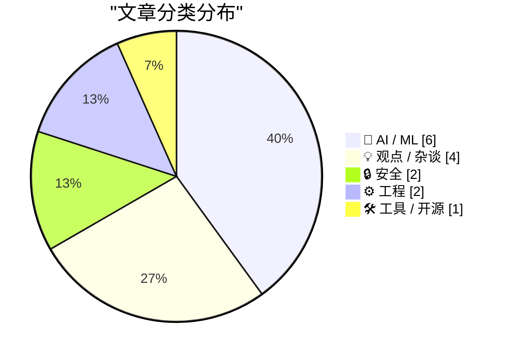
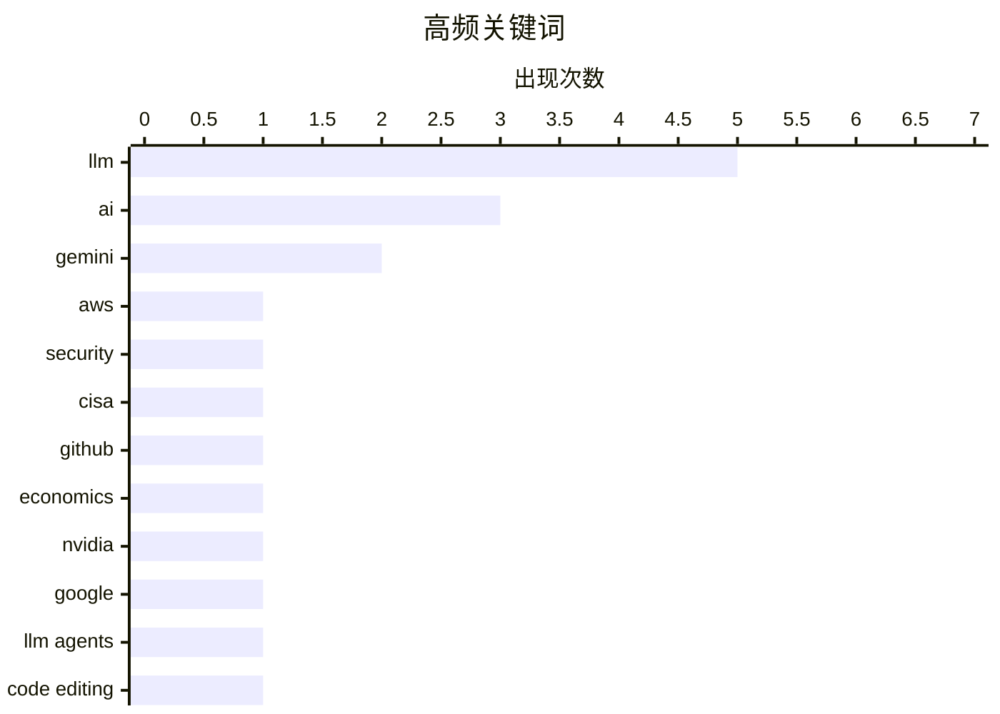

# 📰 May 20, 2026

> 来自 Karpathy 推荐的 92 个顶级技术博客，AI 精选 Top 15

## 📝 今日看点

AI 产业正步入成本反思与范式重构的关键期，在 Karpathy 加盟 Anthropic 及 Gemini 新模型发布的背后，高昂的算力投入与“提示词技术债”正成为行业必须面对的治理难题。与此同时，计算领域迎来“第四个时代”的极性反转，AI 代理的崛起正促使开发者重新审视从 GUI 到底层协议的交互逻辑。安全领域亦不平静，CISA 发生的重大云凭据泄露事件再次给全球政务云安全治理敲响了警钟。

---

## 🏆 今日必读

🥇 **CISA 管理员在 GitHub 泄露 AWS GovCloud 密钥**

[CISA Admin Leaked AWS GovCloud Keys on Github](https://krebsonsecurity.com/2026/05/cisa-admin-leaked-aws-govcloud-keys-on-github/) — krebsonsecurity.com · 1 天前 · 🔒 安全

> 美国网络安全与基础设施安全局（CISA）的一名外包人员在 GitHub 公开仓库中意外泄露了多个具有高权限的 AWS GovCloud 凭据。泄露内容不仅包含敏感系统的访问权限，还涉及 CISA 内部软件构建、测试和部署的详细流程文件。安全专家将其描述为近年来最严重的政府数据泄露事件之一，因为它直接暴露了国家级安全机构的内部运作机制。目前该仓库已被清理，但其造成的潜在安全风险仍在评估中。此次事故再次凸显了供应链管理和云凭据保护在政府机构中的脆弱性。

💡 **为什么值得读**: 了解顶级安全机构如何因低级失误导致重大泄露，警示云原生环境下的凭据管理风险。

🏷️ AWS, Security, CISA, GitHub

🥈 **AI 的成本过于昂贵**

[AI Is Too Expensive](https://www.wheresyoured.at/ai-is-too-expensive/) — wheresyoured.at · 18 小时前 · 💡 观点 / 杂谈

> 当前 AI 产业正面临严峻的财务挑战，昂贵的算力与研发投入使得商业模式难以闭环。文章深入分析了 NVIDIA、Anthropic 等巨头的成本结构，指出高昂的订阅费用（如每年 70 美元）反映了底层基础设施的沉重负担。作者认为，如果 AI 无法在短期内证明其产出价值远超投入，这种高成本模式将难以为继。这种“昂贵”不仅体现在资金上，也体现在对社会资源和能源的巨大消耗上。这种不可持续性可能导致 AI 泡沫的最终破裂。

💡 **为什么值得读**: 从经济视角审视 AI 热潮，剖析大模型背后不可忽视的财务与资源成本问题。

🏷️ AI, economics, NVIDIA

🥉 **Gemini 3.5 Flash 发布：价格更高，但 Google 计划将其应用于所有产品**

[Gemini 3.5 Flash: more expensive, but Google plan to use it for everything](https://simonwillison.net/2026/May/19/gemini-35-flash/#atom-everything) — simonwillison.net · 11 小时前 · 🤖 AI / ML

> Google 在 I/O 大会上正式发布了 Gemini 3.5 Flash，并跳过预览阶段直接进入通用（GA）状态。尽管该模型的使用成本较前代有所上升，但 Google 计划将其作为核心引擎，全面推向数十亿用户使用的 Gemini 应用及 AI 模式中。该版本在推理速度与模型能力的平衡上进行了深度优化，旨在成为 Google 全线产品的通用底座。这标志着 Google 正在从实验性 AI 阶段转向大规模、全产品线的商业化部署。开发者现在可以通过 Google 的平台直接调用这一性能更强的生产级模型。

💡 **为什么值得读**: 关注 Google AI 战略的重大转折点，了解 Gemini 3.5 Flash 如何定位其未来的全线产品生态。

🏷️ Gemini, Google, LLM

---

## 📊 数据概览

| 扫描源 | 抓取文章 | 时间范围 | 精选 |
|:---:|:---:|:---:|:---:|
| 83/92 | 2461 篇 → 37 篇 | 48h | **15 篇** |

### 分类分布



### 高频关键词



<details>
<summary>📈 纯文本关键词图（终端友好）</summary>

```
llm       │ ████████████████████ 5
ai        │ ████████████░░░░░░░░ 3
gemini    │ ████████░░░░░░░░░░░░ 2
aws       │ ████░░░░░░░░░░░░░░░░ 1
security  │ ████░░░░░░░░░░░░░░░░ 1
cisa      │ ████░░░░░░░░░░░░░░░░ 1
github    │ ████░░░░░░░░░░░░░░░░ 1
economics │ ████░░░░░░░░░░░░░░░░ 1
nvidia    │ ████░░░░░░░░░░░░░░░░ 1
google    │ ████░░░░░░░░░░░░░░░░ 1
```

</details>

### 🏷️ 话题标签

**llm**(5) · **ai**(3) · **gemini**(2) · aws(1) · security(1) · cisa(1) · github(1) · economics(1) · nvidia(1) · google(1) · llm agents(1) · code editing(1) · crc32(1) · automation(1) · ai agents(1) · api(1) · future of computing(1) · pycon(1) · ai trends(1) · technical debt(1)

---

## 🤖 AI / ML

### 1. Gemini 3.5 Flash 发布：价格更高，但 Google 计划将其应用于所有产品

[Gemini 3.5 Flash: more expensive, but Google plan to use it for everything](https://simonwillison.net/2026/May/19/gemini-35-flash/#atom-everything) — **simonwillison.net** · 11 小时前 · ⭐ 26/30

> Google 在 I/O 大会上正式发布了 Gemini 3.5 Flash，并跳过预览阶段直接进入通用（GA）状态。尽管该模型的使用成本较前代有所上升，但 Google 计划将其作为核心引擎，全面推向数十亿用户使用的 Gemini 应用及 AI 模式中。该版本在推理速度与模型能力的平衡上进行了深度优化，旨在成为 Google 全线产品的通用底座。这标志着 Google 正在从实验性 AI 阶段转向大规模、全产品线的商业化部署。开发者现在可以通过 Google 的平台直接调用这一性能更强的生产级模型。

🏷️ Gemini, Google, LLM

---

### 2. LLM 代理编辑工具的替代方案

[Alternatives for the EDIT tool of LLM agents](http://antirez.com/news/166) — **antirez.com** · 1 天前 · ⭐ 26/30

> 在开发 DS4 项目的 LLM 代理时，作者发现现有的 EDIT 工具在本地推理环境下效率极低，因为它们强迫模型输出大量冗余的旧代码。由于本地推理受限于 Token 吞吐量，这种浪费严重影响了代理的响应速度。文章探讨了多种优化编辑指令的技术方案，并提出了一种基于 CRC32 校验的折中方案。该方案旨在减少模型输出量，同时确保代码修改的准确性与一致性。这种优化对于在资源受限设备上运行高效 AI 代理具有重要的工程参考价值。

🏷️ LLM agents, code editing, CRC32, automation

---

### 3. 计算的第四个时代

[The Fourth Era of Computing](https://danieldelaney.net/fourth-era/) — **danieldelaney.net** · 1 天前 · ⭐ 26/30

> 计算机科学正在经历第四个进化时代，其核心特征是“难”与“易”的极性反转。过去被认为复杂的原始配置文件、API 和终端应用，因其对 AI 代理极其友好而变得“简单”；相反，精美的图形界面（GUI）因需要人工操作而变得相对“困难”。这种转变意味着软件开发的重心将从人机交互转向代理交互（Agent-first）。开发者需要重新审视系统架构，以适应这种以 AI 代理为核心用户的计算新范式。未来，软件的成功将取决于它与 AI 代理的集成程度，而非仅仅是人类用户的体验。

🏷️ AI agents, API, future of computing

---

### 4. 五分钟回顾 LLM 的过去半年

[The last six months in LLMs in five minutes](https://simonwillison.net/2026/May/19/5-minute-llms/#atom-everything) — **simonwillison.net** · 1 天前 · ⭐ 25/30

> Simon Willison 在 PyCon US 2026 上通过 5 分钟的闪电演讲，高浓度回顾了过去半年 LLM 领域的剧烈变革。演讲涵盖了模型能力的阶跃式演进、开源生态的爆发以及开发者工具链的快速迭代。作者利用自研的幻灯片注释工具，展示了 AI 技术从理论突破到工程落地的关键节点。这份总结为快节奏的 AI 行业提供了一个清晰的技术快照，帮助开发者理清纷繁复杂的技术路线。它不仅是历史的回顾，更是对未来半年技术趋势的预判。

🏷️ LLM, PyCon, AI Trends

---

### 5. Andrej Karpathy 加入 Anthropic

[Andrej Karpathy Joined Anthropic](https://x.com/karpathy/status/2056753169888334312) — **daringfireball.net** · 18 小时前 · ⭐ 23/30

> AI 领域的明星科学家 Andrej Karpathy 正式宣布加入 Anthropic，重返研发一线。作为 OpenAI 的联合创始人和前 Tesla AI 总监，Karpathy 的加盟被视为 Anthropic 在大模型前沿竞争中的重要筹码。他表示未来几年将是 LLM 发展的关键成型期，他将在推动技术突破的同时继续关注 AI 教育。这一人事变动引发了行业对 Anthropic 未来模型架构调整的广泛猜测。Karpathy 的回归预示着顶级 AI 实验室之间的人才争夺战已进入白热化阶段。

🏷️ Andrej Karpathy, Anthropic, LLM, R&D

---

### 6. 陪审团一致裁定驳回埃隆·马斯克对萨姆·奥特曼的诉讼

[Jury Rejects Elon Musk’s Claim Against Sam Altman in Unanimous Verdict](https://www.nytimes.com/live/2026/05/18/technology/openai-trial-verdict-altman-musk?unlocked_article_code=1.jVA.Cc2V.IwYuu2r4SJfQ) — **daringfireball.net** · 1 天前 · ⭐ 21/30

> 九人陪审团一致裁定驳回埃隆·马斯克对 OpenAI 及其首席执行官萨姆·奥特曼的诉讼。裁决的核心依据是该诉讼已超过三年的诉讼时效。尽管马斯克在 2024 年夏天才正式起诉这家估值数千亿美元的 AI 巨头，但陪审团认定他早在 2021 年就已察觉到诉状中所指控的相关行为。法官 Yvonne Gonzalez Rogers 引用了这一结论，判定马斯克失去了追究法律责任的权利。这一判决标志着 OpenAI 在这场备受瞩目的法律纠纷中取得了关键性的程序胜利。

🏷️ OpenAI, Elon Musk, Sam Altman, lawsuit

---

## 💡 观点 / 杂谈

### 7. AI 的成本过于昂贵

[AI Is Too Expensive](https://www.wheresyoured.at/ai-is-too-expensive/) — **wheresyoured.at** · 18 小时前 · ⭐ 27/30

> 当前 AI 产业正面临严峻的财务挑战，昂贵的算力与研发投入使得商业模式难以闭环。文章深入分析了 NVIDIA、Anthropic 等巨头的成本结构，指出高昂的订阅费用（如每年 70 美元）反映了底层基础设施的沉重负担。作者认为，如果 AI 无法在短期内证明其产出价值远超投入，这种高成本模式将难以为继。这种“昂贵”不仅体现在资金上，也体现在对社会资源和能源的巨大消耗上。这种不可持续性可能导致 AI 泡沫的最终破裂。

🏷️ AI, economics, NVIDIA

---

### 8. 提示词也是一种技术债

[Prompts are technical debt too](https://seangoedecke.com/prompts-are-technical-debt-too/) — **seangoedecke.com** · 9 小时前 · ⭐ 24/30

> 软件工程中“代码即技术债”的原则同样适用于 Prompt 工程。随着 AI 系统积累大量提示词，其维护成本和复杂度会呈指数级增长，最终导致单人难以完全掌控。提示词的微小变动可能引发不可预测的系统行为，这种不确定性与传统代码的回归风险如出一辙。作者呼吁开发者应像管理核心代码一样，对 Prompt 进行版本控制、单元测试和定期重构。忽视提示词的维护将导致系统在未来变得僵化且难以升级。

🏷️ LLM, Technical Debt, Prompt Engineering

---

### 9. 现有利益相关者对未来拥有发言权

[Existing Stakeholders Have a Say in the Future](https://daringfireball.net/2026/05/ai_is_technology_not_a_product) — **daringfireball.net** · 1 天前 · ⭐ 22/30

> 文章探讨了 AI 究竟是一种底层技术还是最终产品的争议，并分析了现有利益相关者对未来的影响力。以 Apple 为例，讨论了其硬件主管 John Ternus 是否应转向构建“杀手级 AI 产品”，例如取代 Uber 等 App 的自动代理。作者指出，未来的交互可能不再是点击图标，而是由始终在线的代理自动完成任务。然而，这种转型必须平衡现有生态系统、合作伙伴利益与新技术范式之间的冲突。现有的市场参与者不会坐视被取代，他们的博弈将决定 AI 产品的最终形态。

🏷️ AI, Apple, product design, user experience

---

### 10. 别再自称软件工程师了，你现在是“AI 赋能工程师”

[Don't call yourself a Software Engineer, you are an AI Enabled Engineer.](https://idiallo.com/blog/you-are-an-ai-enabled-engineer-now?src=feed) — **idiallo.com** · 1 天前 · ⭐ 22/30

> 软件开发者的职业身份正在从传统的“软件工程师”转向“AI 赋能工程师”。在当前的就业市场和教育环境下，单纯掌握编程语言已不足够，开发者需要学会如何利用 AI 工具来加速交付和解决复杂问题。文章探讨了在 LinkedIn 社交泡沫与现实招聘需求脱节的背景下，学生和从业者应如何调整心态。作者认为，未来的核心竞争力在于人机协作的能力，而非单纯的手工编码。这种转变要求开发者从关注代码实现转向关注系统设计与 AI 提示词工程的结合。

🏷️ AI, software engineering, career, productivity

---

## 🔒 安全

### 11. CISA 管理员在 GitHub 泄露 AWS GovCloud 密钥

[CISA Admin Leaked AWS GovCloud Keys on Github](https://krebsonsecurity.com/2026/05/cisa-admin-leaked-aws-govcloud-keys-on-github/) — **krebsonsecurity.com** · 1 天前 · ⭐ 27/30

> 美国网络安全与基础设施安全局（CISA）的一名外包人员在 GitHub 公开仓库中意外泄露了多个具有高权限的 AWS GovCloud 凭据。泄露内容不仅包含敏感系统的访问权限，还涉及 CISA 内部软件构建、测试和部署的详细流程文件。安全专家将其描述为近年来最严重的政府数据泄露事件之一，因为它直接暴露了国家级安全机构的内部运作机制。目前该仓库已被清理，但其造成的潜在安全风险仍在评估中。此次事故再次凸显了供应链管理和云凭据保护在政府机构中的脆弱性。

🏷️ AWS, Security, CISA, GitHub

---

### 12. Pluralistic：根本不存在所谓的“年龄验证”

[Pluralistic: There's no such thing as "age verification" (19 May 2026)](https://pluralistic.net/2026/05/19/shes-dead-of-course/) — **pluralistic.net** · 1 天前 · ⭐ 22/30

> 互联网“年龄验证”在技术逻辑和隐私保护上是一个伪命题，其本质是强制性的身份识别。这种政策往往源于政客“必须做点什么”的冲动，却忽视了由此产生的海量敏感身份数据池所带来的巨大安全风险。文章指出，所谓的年龄验证会彻底摧毁网络匿名性，并为数据经纪人和监控行为提供便利。作者警告称，这种“算法残忍”不仅无法保护未成年人，反而让所有用户暴露在更严重的隐私威胁和身份盗用风险之下。最终，这种做法只会加剧互联网的中心化监控，而非解决社会问题。

🏷️ privacy, age verification, policy, surveillance

---

## ⚙️ 工程

### 13. Wi-Wi：纳秒级的无线时间同步技术

[Wi-Wi Is Wireless Time Sync at 1 nanosecond](https://www.jeffgeerling.com/blog/2026/wi-wi-is-wireless-time-sync-less-than-5ns/) — **jeffgeerling.com** · 19 小时前 · ⭐ 23/30

> 在 NAB 展会上亮相的 Wi-Wi STAMP 协议，实现了精度低于 5 纳秒（目标 1 纳秒）的无线时间同步。该技术源自日本 NICT 研究机构，旨在解决高精度工业自动化和广播影视领域的无线同步难题。相比传统的有线同步方案，Wi-Wi 在保持极高精度的同时提供了更大的部署灵活性。这一突破性进展为需要毫秒级以下同步的应用场景开辟了无线化的可能。它解决了无线环境下多设备时钟漂移的痛点，是通信基础设施领域的重要进展。

🏷️ Wireless, Time Sync, Networking

---

### 14. 开源项目“猝死”的愚蠢方式

[Dumb Ways for an Open Source Project to Die](https://nesbitt.io/2026/05/19/dumb-ways-for-an-open-source-project-to-die.html) — **nesbitt.io** · 23 小时前 · ⭐ 21/30

> 开源项目往往死于一些本可以避免的低级错误，其中最核心的问题在于依赖项管理不当。文章提出了“依赖项变成 Bernie（寄生者）”的概念，描述了当项目引入过多或不稳定的第三方库时，维护成本如何呈指数级增长。开发者往往在初期为了开发便利而牺牲了长期的可维护性，导致项目最终因技术债过重而停滞。作者呼吁开源维护者在引入依赖时应保持极度克制，并定期清理冗余组件。只有建立健康的依赖策略，才能确保开源项目在快速迭代的技术生态中存活。

🏷️ open-source, dependencies, maintenance

---

## 🛠 工具 / 开源

### 15. llm-gemini 0.32 版本发布

[llm-gemini 0.32](https://simonwillison.net/2026/May/19/llm-gemini-2/#atom-everything) — **simonwillison.net** · 10 小时前 · ⭐ 21/30

> 命令行工具 LLM 的 Gemini 插件发布了 0.32 版本，正式增加了对 Google 最新 gemini-3.5-flash 模型的支持。该版本允许开发者通过简单的 CLI 指令直接调用 Gemini 3.5 Flash，利用其极高的推理速度和更强的长上下文处理能力。作者同步分享了关于该模型的技术笔记，探讨了其在不同任务场景下的性能表现。此次更新进一步丰富了本地 LLM 工具链对主流闭源大模型的集成，方便开发者在终端进行快速原型开发和测试。

🏷️ LLM, Gemini, Python

---

*生成于 2026-05-20 09:50 | 扫描 83 源 → 获取 2461 篇 → 精选 15 篇*
*基于 [Hacker News Popularity Contest 2025](https://refactoringenglish.com/tools/hn-popularity/) RSS 源列表，由 [Andrej Karpathy](https://x.com/karpathy) 推荐*
