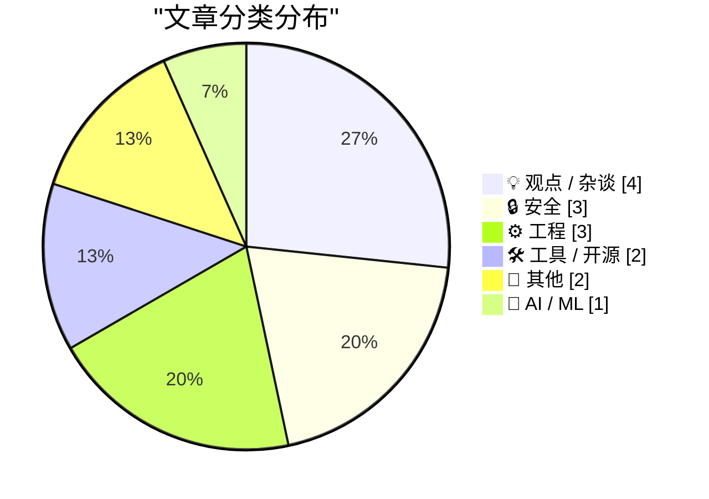
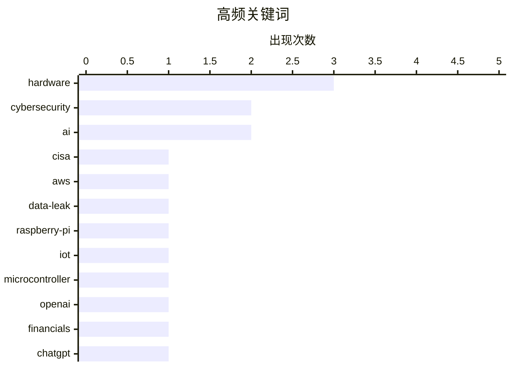

# 📰 May 24, 2026

> 来自 Karpathy 推荐的 92 个顶级技术博客，AI 精选 Top 15

## 📝 今日看点

AI 产业正迎来深度反思期，OpenAI 的巨额亏损与市场对技术泡沫及就业冲击的担忧，揭示了繁荣背后的经济阵痛。与此同时，AI 算力需求正重塑硬件生态，不仅引发了全球内存供应链的定价危机，也倒逼芯片设计与底层架构的持续演进。在安全与工程领域，CISA 的重大泄露事件再次敲响合规警钟，而开发者则在依赖项修剪与硬件迭代中寻求更高效的系统优化。

---

## 🏆 今日必读

🥇 **美国国会议员就 CISA 数据泄露事件要求问责**

[Lawmakers Demand Answers as CISA Tries to Contain Data Leak](https://krebsonsecurity.com/2026/05/lawmakers-demand-answers-as-cisa-tries-to-contain-data-leak/) — krebsonsecurity.com · 1 天前 · 🔒 安全

> 美国网络安全与基础设施安全局（CISA）的一名承包商故意在公共 GitHub 账号上发布了 AWS GovCloud 密钥及大量机构机密。此次泄露规模巨大，导致国会两院议员正式要求 CISA 做出解释。目前 CISA 仍在努力控制泄露范围并尝试作废已泄露的凭据，但进展缓慢。该事件凸显了顶级安全机构在内部人员管理和云凭据保护方面的脆弱性。

💡 **为什么值得读**: 了解顶级安全机构如何在全球关注下处理严重的内部泄露事故。

🏷️ CISA, AWS, data-leak, cybersecurity

🥈 **树莓派 6 与微控制器开发最新进展**

[News about Raspberry Pi 6 and Microcontroller Development](https://www.jeffgeerling.com/blog/2026/news-about-raspberry-pi-6-and-microcontroller-development/) — jeffgeerling.com · 1 天前 · 🛠 工具 / 开源

> 树莓派 CEO Eben Upton 及核心工程师在 Reddit AMA 中分享了未来硬件规划。虽然树莓派 6 尚处于早期阶段，但团队正专注于提升单核性能和 I/O 能力。在微控制器领域，RP2350 延续了 RP2040 的成功，并针对工业应用增强了安全性。讨论还涉及了供应链稳定性以及对 RISC-V 架构的持续探索。

💡 **为什么值得读**: 硬件爱好者和嵌入式开发者获取树莓派官方路线图的第一手资料。

🏷️ Raspberry-Pi, hardware, IoT, microcontroller

🥉 **OpenAI 2026 年一季度非 GAAP 营业利润率为 -122%，ChatGPT 增长停滞**

[News: OpenAI Had A Negative 122% Non-GAAP Operating Margin In Q1 2026, and ChatGPT Growth Has Stalled](https://www.wheresyoured.at/news-openai-had-a-negative-122-operating-margin-in-q1-2026-and-chatgpt-growth-has-stalled/) — wheresyoured.at · 1 天前 · 🤖 AI / ML

> OpenAI 在 2026 年第一季度实现了 57 亿美元营收，但其财务状况依然严峻。数据显示其调整后利润率为 -122%，意味着每赚取 1 美元就要额外亏损 1.22 美元。与此同时，曾经爆发式增长的 ChatGPT 用户增速已陷入停滞。这种高昂的算力成本与收入增长放缓的矛盾，引发了市场对 AI 商业模式可持续性的深度质疑。

💡 **为什么值得读**: 揭示 AI 巨头光鲜营收背后的巨额亏损真相与增长瓶颈。

🏷️ OpenAI, financials, ChatGPT, business

---

## 📊 数据概览

| 扫描源 | 抓取文章 | 时间范围 | 精选 |
|:---:|:---:|:---:|:---:|
| 82/92 | 2453 篇 → 29 篇 | 48h | **15 篇** |

### 分类分布



### 高频关键词



<details>
<summary>📈 纯文本关键词图（终端友好）</summary>

```
hardware        │ ████████████████████ 3
cybersecurity   │ █████████████░░░░░░░ 2
ai              │ █████████████░░░░░░░ 2
cisa            │ ███████░░░░░░░░░░░░░ 1
aws             │ ███████░░░░░░░░░░░░░ 1
data-leak       │ ███████░░░░░░░░░░░░░ 1
raspberry-pi    │ ███████░░░░░░░░░░░░░ 1
iot             │ ███████░░░░░░░░░░░░░ 1
microcontroller │ ███████░░░░░░░░░░░░░ 1
openai          │ ███████░░░░░░░░░░░░░ 1
```

</details>

### 🏷️ 话题标签

**hardware**(3) · **cybersecurity**(2) · **ai**(2) · cisa(1) · aws(1) · data-leak(1) · raspberry-pi(1) · iot(1) · microcontroller(1) · openai(1) · financials(1) · chatgpt(1) · business(1) · ai bubble(1) · economics(1) · tech industry(1) · memory(1) · supply-chain(1) · chip design(1) · gpu(1)

---

## 💡 观点 / 杂谈

### 1. 深度思考：如果我们正处于 AI 泡沫之中会怎样？（第二部分）

[Premium: What If...We're In An AI Bubble? (Part 2)](https://www.wheresyoured.at/premium-what-if-were-in-an-ai-bubble-part-2/) — **wheresyoured.at** · 1 天前 · ⭐ 26/30

> 本文探讨了当前 AI 投资热潮可能演变为泡沫的多种情景及其后果。作者分析了当企业发现 AI 无法带来预期投资回报（ROI）时，市场可能出现的连锁反应。文章重点讨论了算力需求虚高、估值脱离实际以及技术落地难等核心矛盾。如果泡沫破裂，不仅会重创科技股，还可能导致 AI 研发资金的长期枯竭。

🏷️ AI bubble, economics, tech industry

---

### 2. 震撼世界的毕业典礼演讲：埃里克·施密特谈 AI 冲击

[The commencement speech that shook the world](https://idiallo.com/blog/the-commencement-speech-that-shook-the-world?src=feed) — **idiallo.com** · 1 天前 · ⭐ 23/30

> 前 Google CEO 埃里克·施密特在毕业典礼上发表了关于 AI 必然性的激进演讲。他直言不讳地指出，企业正将 AI 作为裁员的借口，未来的就业市场将面临前所未有的挑战。演讲揭示了技术精英阶层对 AI 取代人工的真实看法，引发了关于社会公平和职业转型的激烈讨论。作者对此进行了反思，认为毕业生必须在 AI 驱动的现实中寻找新的生存法则。

🏷️ AI, Google, career, leadership

---

### 3. George Hotz：AI 威胁论中唯一真实的糟糕场景

[There is only one bad AI scenario](https://geohot.github.io//blog/jekyll/update/2026/05/23/one-bad-scenario.html) — **geohot.github.io** · 1 天前 · ⭐ 23/30

> 著名黑客 George Hotz 驳斥了“天网”或“灰蛊”等科幻式的 AI 毁灭论，认为这些场景脱离现实。他提出，真正的危险在于 AI 会持续优化人类社会，使其变成一个失去开放性进化的封闭系统。在这种情境下，人类并非被暴力消灭，而是被困在由算法定义的极致效率中，导致文明进化的终结。这一观点挑战了主流的 AI 安全讨论框架，转向了更深层的哲学思考。

🏷️ AI safety, alignment, AGI

---

### 4. 如何与你的同事高效沟通

[How to Talk to Your Coworkers](https://idiallo.com/blog/how-to-talk-to-your-coworkers?src=feed) — **idiallo.com** · 1 天前 · ⭐ 21/30

> 针对开发者经常遇到的“为什么同事不看文档又来问我”这一痛点，提出了改进职场沟通的实用策略。文章指出，沟通的本质是建立理解而非单纯的信息传递，单纯依靠 Jira 或文档往往无法消除认知偏差。开发者应意识到，同事请求通话并非因为“懒”或“笨”，而是为了更高效地同步上下文并确认细节。通过培养同理心、选择合适的沟通媒介（如适时的同步会议而非无休止的异步拉锯）并优化表达方式，可以显著减少重复劳动。改善沟通不仅能提升团队协作效率，还能减少开发者的职业倦怠感。

🏷️ communication, soft-skills, collaboration

---

## 🔒 安全

### 5. 美国国会议员就 CISA 数据泄露事件要求问责

[Lawmakers Demand Answers as CISA Tries to Contain Data Leak](https://krebsonsecurity.com/2026/05/lawmakers-demand-answers-as-cisa-tries-to-contain-data-leak/) — **krebsonsecurity.com** · 1 天前 · ⭐ 29/30

> 美国网络安全与基础设施安全局（CISA）的一名承包商故意在公共 GitHub 账号上发布了 AWS GovCloud 密钥及大量机构机密。此次泄露规模巨大，导致国会两院议员正式要求 CISA 做出解释。目前 CISA 仍在努力控制泄露范围并尝试作废已泄露的凭据，但进展缓慢。该事件凸显了顶级安全机构在内部人员管理和云凭据保护方面的脆弱性。

🏷️ CISA, AWS, data-leak, cybersecurity

---

### 6. Troy Hunt 每周更新 505 期

[Weekly Update 505](https://www.troyhunt.com/weekly-update-505/) — **troyhunt.com** · 7 小时前 · ⭐ 24/30

> 知名安全专家 Troy Hunt 追踪了黑客组织 ShinyHunters 的最新动态。在针对 Instructure 的大规模勒索攻击后，该组织一度陷入沉寂，有传言称赎金已支付。本期还讨论了近期多起数据泄露事件的后续影响以及身份验证安全的最新趋势。作者通过实战案例提醒企业，即便在黑客静默期也不应放松警惕。

🏷️ data breach, cybersecurity, ransomware

---

### 7. 关于我们如何依赖 Palantir 以及如何替换它的思考

[Some notes on how we ended up with Palantir & how to replace it](https://berthub.eu/articles/posts/some-notes-on-palantir/) — **berthub.eu** · 1 天前 · ⭐ 22/30

> 探讨了政府高度依赖 Palantir 软件的深层原因以及构建替代方案的现实挑战。Palantir 的核心价值不在于数据收集，而在于其强大的数据集成能力，能将政府内部支离破碎且格式不一的数据库转化为可操作的洞察。文章指出，简单的软件替代无法奏效，因为 Palantir 解决的是“脏数据”处理和非技术人员易用性的痛点。要实现真正的技术自主，必须从数据治理标准、跨部门协作机制以及对用户体验的重视入手，而非仅仅编写开源代码。作者强调，理解 Palantir 的工程实现是构建“欧洲价值观”替代方案的前提。

🏷️ Palantir, data privacy, government tech

---

## ⚙️ 工程

### 8. Reiner Pope：自下而上的芯片设计全解析

[Reiner Pope – Chip design from the bottom up](https://www.dwarkesh.com/p/reiner-pope-2) — **dwarkesh.com** · 1 天前 · ⭐ 24/30

> 访谈深入探讨了从基础逻辑门到复杂处理器的构建过程。Reiner Pope 详细解释了 GPU、TPU 和 FPGA 在架构设计上的本质差异，以及它们如何适应不同的计算负载。讨论还延伸到了人类大脑的生物结构与硅基芯片的对比，揭示了计算效率的物理极限。读者可以从中理解为什么现代 AI 算力必须依赖特定类型的硬件架构。

🏷️ chip design, GPU, TPU, hardware architecture

---

### 9. 为什么说 COM STA 线程必须处理消息循环，即使示例代码没这么做？

[Why do you say that a COM STA thread must pump messages if I see sample code creating STA threads and not pumping messages?](https://devblogs.microsoft.com/oldnewthing/20260522-00/?p=112348) — **devblogs.microsoft.com/oldnewthing** · 1 天前 · ⭐ 22/30

> COM 单线程单元 (STA) 线程必须运行消息循环以处理跨线程调用，但许多示例代码为了简化演示而省略了这一步。这是因为示例代码通常执行单一任务后立即退出，从未进入“空闲”状态。然而，任何长生命周期的 STA 线程若不处理消息，将导致 COM 封送（Marshalling）机制失效，引发死锁或调用超时。开发者应理解消息循环是 STA 线程响应外部请求的必要基础设施，而非可选配置。只有在确定线程永远不会接收外部调用且生命周期极短时，才能忽略消息泵。

🏷️ Windows, COM, threading, Win32

---

### 10. 逆向工程：1980 年代航天飞机 Spacelab 计算机电路分析

[Reverse engineering circuitry in a Spacelab computer from 1980](http://www.righto.com/feeds/872292081485114047/comments/default) — **righto.com** · 16 小时前 · ⭐ 22/30

> 本文对 1980 年代用于航天飞机 Spacelab 的 Mitra 125 MS 小型机进行了深度逆向工程。该 16 位处理器并非基于现代单片微处理器，而是由多块包含大量 TTL 芯片和 AMD Am2901 位片（bit-slice）架构的电路板组成。文章详细解析了算术逻辑单元（ALU）板的布线逻辑、指令执行流程以及早期航天级计算机的硬件构造。通过对这些离散元件的拆解，展示了在高度集成电路普及前，复杂计算任务是如何通过基础逻辑芯片实现的。这种硬核分析揭示了早期空间计算技术的复杂性与可靠性设计。

🏷️ reverse engineering, hardware, retrocomputing, space

---

## 🛠 工具 / 开源

### 11. 树莓派 6 与微控制器开发最新进展

[News about Raspberry Pi 6 and Microcontroller Development](https://www.jeffgeerling.com/blog/2026/news-about-raspberry-pi-6-and-microcontroller-development/) — **jeffgeerling.com** · 1 天前 · ⭐ 27/30

> 树莓派 CEO Eben Upton 及核心工程师在 Reddit AMA 中分享了未来硬件规划。虽然树莓派 6 尚处于早期阶段，但团队正专注于提升单核性能和 I/O 能力。在微控制器领域，RP2350 延续了 RP2040 的成功，并针对工业应用增强了安全性。讨论还涉及了供应链稳定性以及对 RISC-V 架构的持续探索。

🏷️ Raspberry-Pi, hardware, IoT, microcontroller

---

### 12. 依赖项修剪：清理项目中无用的依赖

[Dependency Pruning](https://nesbitt.io/2026/05/22/dependency-pruning.html) — **nesbitt.io** · 1 天前 · ⭐ 23/30

> 软件项目往往充斥着大量从未被调用的第三方库，增加了安全风险和构建负担。本文系统地调研了多种“无用依赖检测工具”，评估了它们在不同编程语言环境下的准确性。通过修剪这些冗余依赖，开发者可以显著减小镜像体积并缩短 CI/CD 流程。文章为如何维持一个精简、安全的生产环境提供了实用的技术选型建议。

🏷️ dependencies, optimization, devops

---

## 📝 其他

### 13. 内存短缺正引发消费电子产品重新定价

[The memory shortage is causing a repricing of consumer electronics](https://simonwillison.net/2026/May/22/memory-shortage/#atom-everything) — **simonwillison.net** · 1 天前 · ⭐ 24/30

> 内存制造商目前仅剩三家巨头，其晶圆产能已接近极限。由于 AI 服务器对高带宽内存（HBM）的爆发式需求，原本用于手机和电脑的内存产能被严重挤占。这种供需失衡将导致未来几年内，所有依赖内存的消费电子产品价格大幅上涨。文章指出，AI 的繁荣正在以牺牲普通消费者购买力为代价，改变硬件市场的定价逻辑。

🏷️ AI, hardware, memory, supply-chain

---

### 14. 第九巡回法院关于“Epic 诉苹果案”的上诉裁决书全文

[The Ninth Circuit Appeal Ruling in ‘Epic v. Apple’ That Apple Is Seeking to Overturn at the Supreme Court (PDF)](https://cdn.ca9.uscourts.gov/datastore/opinions/2025/12/11/25-2935.pdf) — **daringfireball.net** · 1 天前 · ⭐ 21/30

> 本文提供了第九巡回上诉法院关于 Epic Games 诉苹果公司案的完整裁决文件，该案目前正由苹果公司上诉至美国最高法院。争议核心在于苹果的“反导向”规则（禁止开发者引导用户使用外部支付）是否违反竞争法。裁决书第 50 页重点讨论了苹果的一个关键法律论据：根据 Trump v. CASA 先例，针对佣金规则的禁令应仅适用于原告 Epic Games，而非全美所有 App Store 开发者。此案的最终走向将直接决定苹果是否必须向所有美国应用开放第三方支付跳转。这份 PDF 文档是理解移动应用生态法律博弈的最权威资料。

🏷️ Apple, Epic-Games, App-Store, legal

---

## 🤖 AI / ML

### 15. OpenAI 2026 年一季度非 GAAP 营业利润率为 -122%，ChatGPT 增长停滞

[News: OpenAI Had A Negative 122% Non-GAAP Operating Margin In Q1 2026, and ChatGPT Growth Has Stalled](https://www.wheresyoured.at/news-openai-had-a-negative-122-operating-margin-in-q1-2026-and-chatgpt-growth-has-stalled/) — **wheresyoured.at** · 1 天前 · ⭐ 27/30

> OpenAI 在 2026 年第一季度实现了 57 亿美元营收，但其财务状况依然严峻。数据显示其调整后利润率为 -122%，意味着每赚取 1 美元就要额外亏损 1.22 美元。与此同时，曾经爆发式增长的 ChatGPT 用户增速已陷入停滞。这种高昂的算力成本与收入增长放缓的矛盾，引发了市场对 AI 商业模式可持续性的深度质疑。

🏷️ OpenAI, financials, ChatGPT, business

---

*生成于 2026-05-24 08:41 | 扫描 82 源 → 获取 2453 篇 → 精选 15 篇*
*基于 [Hacker News Popularity Contest 2025](https://refactoringenglish.com/tools/hn-popularity/) RSS 源列表，由 [Andrej Karpathy](https://x.com/karpathy) 推荐*
