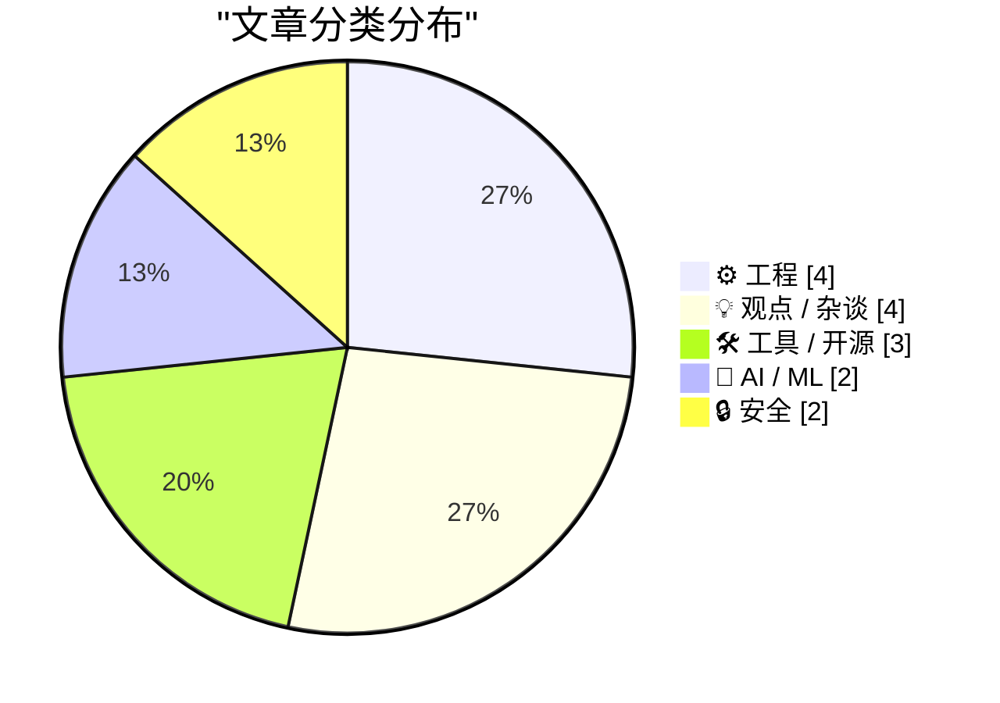
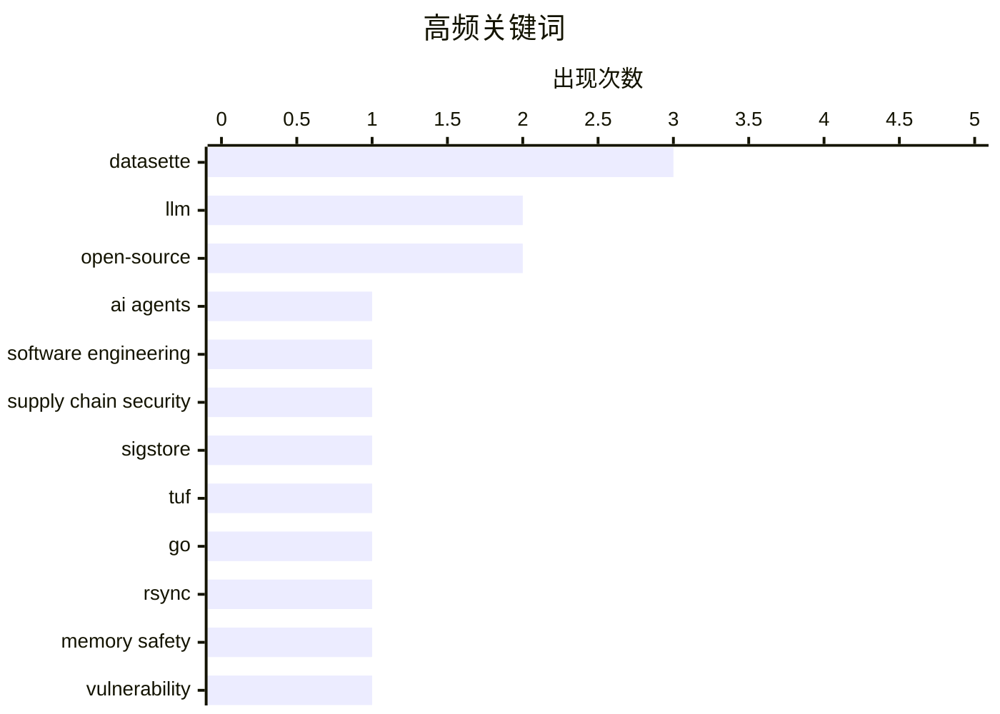

# 📰 May 25, 2026

> 来自 Karpathy 推荐的 92 个顶级技术博客，AI 精选 Top 15

## 📝 今日看点

AI 代理在软件开发中的滥用正引发行业反思，其生成的“垃圾 Issue”与逻辑缺陷被指可能对开源生态造成长期损害。与此同时，安全领域正加速向内存安全转型，通过 Go 语言重构经典工具并强化供应链框架，以应对日益复杂的系统风险。此外，广告技术行业的信任危机与复古计算的逆向工程也折射出技术演进中的伦理与传承挑战。

---

## 🏆 今日必读

🥇 **永恒的垃圾九月：AI 代理将成为软件开发史上的惨重错误**

[The Eternal Sloptember](https://geohot.github.io//blog/jekyll/update/2026/05/24/the-eternal-sloptember.html) — geohot.github.io · 1 天前 · 🤖 AI / ML

> 软件开发中引入 AI 代理（Agents）可能成为行业历史上代价最惨重的错误。AI 代理本质上是高度复杂的统计模型，旨在模仿编程语言的分布，而非真正理解编程逻辑。其生成的代码虽然在统计学上日益精确，但往往包含难以察觉的逻辑缺陷。这种“垃圾内容”的大规模涌现正导致软件质量的隐形退化，且检测难度随模型进步而不断增加。作者认为 AI 无法真正编程，目前的热潮只是在制造更难被发现的错误。

💡 **为什么值得读**: 听取顶级黑客 geohot 对当前 AI 编程热潮的冷思考，警惕统计学模型带来的代码质量陷阱。

🏷️ AI agents, software engineering, LLM

🥈 **签名是为了应对糟糕的日子**

[Signing is for the bad days](https://nesbitt.io/2026/05/24/signing-is-for-the-bad-days.html) — nesbitt.io · 1 天前 · 🔒 安全

> 供应链安全框架如 TUF、in-toto 和 Sigstore 在系统正常运行时往往显得冗余且增加了开发复杂度。然而，这些工具的核心价值在于安全危机爆发时的防御能力。它们通过验证软件包的完整性和来源，防止恶意篡改在分发链中扩散。只有在遭遇攻击或私钥泄露的“糟糕日子”里，这些预先部署的签名机制才能体现其不可替代的价值。作者强调，安全投入的意义往往在灾难发生时才会被真正理解。

💡 **为什么值得读**: 深入理解供应链安全工具的“保险”属性，明白为什么在没出事时也必须部署它们。

🏷️ supply chain security, Sigstore, TUF

🥉 **内存安全的 Go 语言版 rsync 如何规避漏洞**

[How my minimal, memory-safe Go rsync steers clear of vulnerabilities](https://michael.stapelberg.ch/posts/2026-05-24-minimal-memory-safe-go-rsync-vulns/) — michael.stapelberg.ch · 20 小时前 · ⚙️ 工程

> 传统的 C 语言版 rsync 近期被曝出校验和长度验证不当等严重安全漏洞。作者通过使用内存安全的 Go 语言重写了一个极简版 rsync，从根本上消除了缓冲区溢出等内存安全隐患。该实现专注于核心同步功能，通过严格的类型检查和边界验证来处理不信任的输入。这种方法证明了通过现代语言特性和减少代码复杂度可以显著提升基础工具的安全性。该项目展示了在不牺牲核心功能的前提下，如何通过重构规避陈旧代码库的顽疾。

💡 **为什么值得读**: 学习如何利用 Go 语言的内存安全特性重构经典工具，以规避困扰 C 语言数十年的安全漏洞。

🏷️ Go, rsync, memory safety, vulnerability

---

## 📊 数据概览

| 扫描源 | 抓取文章 | 时间范围 | 精选 |
|:---:|:---:|:---:|:---:|
| 82/92 | 2439 篇 → 23 篇 | 48h | **15 篇** |

### 分类分布



### 高频关键词



<details>
<summary>📈 纯文本关键词图（终端友好）</summary>

```
datasette             │ ████████████████████ 3
llm                   │ █████████████░░░░░░░ 2
open-source           │ █████████████░░░░░░░ 2
ai agents             │ ███████░░░░░░░░░░░░░ 1
software engineering  │ ███████░░░░░░░░░░░░░ 1
supply chain security │ ███████░░░░░░░░░░░░░ 1
sigstore              │ ███████░░░░░░░░░░░░░ 1
tuf                   │ ███████░░░░░░░░░░░░░ 1
go                    │ ███████░░░░░░░░░░░░░ 1
rsync                 │ ███████░░░░░░░░░░░░░ 1
```

</details>

### 🏷️ 话题标签

**datasette**(3) · **llm**(2) · **open-source**(2) · ai agents(1) · software engineering(1) · supply chain security(1) · sigstore(1) · tuf(1) · go(1) · rsync(1) · memory safety(1) · vulnerability(1) · ad-tech(1) · enshittification(1) · internet-policy(1) · reverse-engineering(1) · hardware-history(1) · space-computing(1) · cybersecurity(1) · data breach(1)

---

## ⚙️ 工程

### 1. 内存安全的 Go 语言版 rsync 如何规避漏洞

[How my minimal, memory-safe Go rsync steers clear of vulnerabilities](https://michael.stapelberg.ch/posts/2026-05-24-minimal-memory-safe-go-rsync-vulns/) — **michael.stapelberg.ch** · 20 小时前 · ⭐ 25/30

> 传统的 C 语言版 rsync 近期被曝出校验和长度验证不当等严重安全漏洞。作者通过使用内存安全的 Go 语言重写了一个极简版 rsync，从根本上消除了缓冲区溢出等内存安全隐患。该实现专注于核心同步功能，通过严格的类型检查和边界验证来处理不信任的输入。这种方法证明了通过现代语言特性和减少代码复杂度可以显著提升基础工具的安全性。该项目展示了在不牺牲核心功能的前提下，如何通过重构规避陈旧代码库的顽疾。

🏷️ Go, rsync, memory safety, vulnerability

---

### 2. 逆向工程 1980 年太空实验室计算机电路

[Reverse engineering circuitry in a Spacelab computer from 1980](http://www.righto.com/feeds/872292081485114047/comments/default) — **righto.com** · 1 天前 · ⭐ 24/30

> 1980 年代的太空实验室（Spacelab）由法国制造的 Mitra 125 MS 小型机控制，该机器并未使用现代微处理器芯片。其 16 位处理器由多块装满分立芯片的电路板构成，结构极其复杂。作者对其中的算术逻辑单元（ALU）板进行了深度逆构，解析了其硬件架构和指令执行逻辑。这项研究揭示了在超大规模集成电路普及前，航天级计算机是如何通过离散逻辑实现高性能计算的。文章通过高清电路照片和逻辑图，还原了 40 年前的顶尖硬件设计。

🏷️ Reverse-engineering, Hardware-history, Space-computing

---

### 3. 深入理解 HTML 定义列表元素 <dl>

[On the <dl>](https://simonwillison.net/2026/May/23/on-the-dl/#atom-everything) — **simonwillison.net** · 1 天前 · ⭐ 20/30

> 本文总结了 HTML 中 `<dl>`（定义列表）元素的一些鲜为人知的使用技巧。关键点包括：一个 `<dt>`（术语）后面可以跟随多个 `<dd>`（描述）；可以使用 `<div>` 对 `dt/dd` 进行分组以便于 CSS 布局，这是规范允许的唯一分组标签。此外，文章还介绍了如何利用 ARIA 属性增强列表的可访问性。这些技巧有助于开发者编写更语义化且易于样式的 Web 页面。作者纠正了长期以来对该标签用途的误解。

🏷️ HTML, Web-development, Frontend

---

### 4. FediMeteo 与时区处理：不破坏现有功能的开发艺术

[FediMeteo, timezones, and the art of not breaking what already works](https://it-notes.dragas.net/2026/05/25/fedimeteo-timezones-and-the-art-of-not-breaking-what-already-works/) — **it-notes.dragas.net** · 1 小时前 · ⭐ 19/30

> 探讨了全球天气服务 FediMeteo 在引入时区支持时面临的技术挑战。为了在不破坏现有数千名用户体验的前提下实现精准的本地时间预报，作者详细介绍了在 FreeBSD VPS 环境下的后端逻辑重构。核心方案涉及对 HAProxy 转发逻辑的微调以及对底层时区数据库的平滑集成，确保了系统的高可用性。文章强调了在快速迭代中保持向后兼容性的重要性，分享了处理地理空间数据时的工程实践。最终实现了一套既能满足新功能需求又不干扰旧版本运行的稳健系统。

🏷️ timezones, Fediverse, software maintenance

---

## 💡 观点 / 杂谈

### 5. 广告技术贼帮之间毫无信义

[Pluralistic: No honor among (ad-tech) thieves (25 May 2026)](https://pluralistic.net/2026/05/25/lying-spies/) — **pluralistic.net** · 2 小时前 · ⭐ 24/30

> 广告技术（Ad-tech）行业正陷入严重的信任危机，平台方与广告商之间的欺诈行为层出不穷。文章探讨了 Airbnb 和 Oculus 等平台的“平台劣化”（Enshittification）现象，揭示了这些公司如何通过垄断地位损害用户和开发者利益。此外，内容还涉及了任天堂版权滥用、功利主义演变为优生学等社会技术议题。作者指出，缺乏监管的数字市场正演变成一场互相收割的零和博弈。这种系统性的腐败正在侵蚀互联网的开放性与公正性。

🏷️ Ad-tech, Enshittification, Internet-policy

---

### 6. 引用 Armin Ronacher：AI 生成的 Issue 乱象

[Quoting Armin Ronacher](https://simonwillison.net/2026/May/24/armin-ronacher/#atom-everything) — **simonwillison.net** · 15 小时前 · ⭐ 23/30

> Flask 作者 Armin Ronacher 指出开源项目正面临一种新型的“垃圾邮件”：AI 代理生成的 Issue。这些 Issue 通常由用户将问题丢给 AI 后直接复制而来，语气充满自信但内容往往包含错误的根因分析和虚假的复现步骤。这种“AI 废话”极大地增加了维护者的负担，因为他们必须花费大量精力去证伪这些看似专业实则误导的建议。这种现象正在破坏开源社区基于真实反馈的协作模式。作者呼吁开发者在提交反馈时保持真实的人类声音。

🏷️ Open-Source, AI-generated, GitHub-issues

---

### 7. 用 Pi 构建 Pi：开源项目中的 AI 代理反思

[Building Pi With Pi](https://lucumr.pocoo.org/2026/5/24/pi-oss/) — **lucumr.pocoo.org** · 1 天前 · ⭐ 22/30

> 作者在开发 Pi 项目时，深度体验了使用 AI 代理处理 Issue 追踪器的过程。虽然 AI 可以辅助开发，但开源项目正被大量“垃圾 Issue（Slop Issues）”淹没，这些内容由 AI 生成且缺乏人类的逻辑验证。文章反思了开发者与 AI 协作的边界，指出过度依赖代理可能导致项目维护成本激增。作者强调，AI 应当作为辅助工具而非替代人类在社区中的真实沟通。这种“AI 代理流量”正在改变开源协作的生态环境。

🏷️ open source, agents, software development

---

### 8. 为什么我讨厌“驱动”（driven）这个词

[Why I can't stand the word "driven"](https://www.joanwestenberg.com/why-i-cant-stand-the-word-driven/) — **joanwestenberg.com** · 10 小时前 · ⭐ 19/30

> 批判了现代商业和技术语境中滥用“数据驱动”、“使命驱动”等词汇的现象。作者通过 19 世纪澳大利亚牧民驱赶牛群的历史典故，指出“驱动”一词在本质上带有强迫、盲目和缺乏自主性的负面含义。文章认为，这种用词反映了现代职场中对效率的病态追求，往往掩盖了真正的创造力和人性化决策。作者主张用更具主动性和协作感的词汇替代这些陈词滥调，以重塑更健康的组织文化。这种语言层面的反思揭示了技术术语对企业文化的潜在负面影响。

🏷️ tech culture, buzzwords, communication

---

## 🛠 工具 / 开源

### 9. Datasette 1.0a30 版本发布

[datasette 1.0a30](https://simonwillison.net/2026/May/24/datasette/#atom-everything) — **simonwillison.net** · 10 小时前 · ⭐ 21/30

> Datasette 发布了 1.0a30 预览版，核心更新是引入了可自定义的“跳转到（Jump to...）”菜单。用户现在可以通过快捷键 `/` 快速调出搜索框，在不同的数据库、表和视图之间进行导航。该功能支持高度扩展，允许开发者通过插件自定义菜单项和搜索逻辑。这一改进显著提升了在大规模数据集中的交互效率和用户体验。此外，该版本还包含了一系列针对 1.0 正式版的稳定性修复。

🏷️ Datasette, SQLite, Open-Source

---

### 10. datasette-agent 0.1a4 发布：利用新钩子优化交互界面

[datasette-agent 0.1a4](https://simonwillison.net/2026/May/24/datasette-agent/#atom-everything) — **simonwillison.net** · 11 小时前 · ⭐ 19/30

> Datasette 生态下的 AI 助手插件 datasette-agent 发布了 0.1a4 版本。该版本充分利用了 Datasette 1.0a30 新引入的 makeJumpSections() JavaScript 插件钩子。通过该技术，插件现在能在界面顶部直接呈现“开始新 Agent 对话”的入口，显著提升了用户在处理大型数据集时的交互效率。这一更新标志着 Datasette 插件系统在 UI 扩展性上的进一步成熟，为构建更复杂的数据库 AI 界面奠定了基础。

🏷️ Datasette, AI-agent, JavaScript-plugins

---

### 11. datasette-fixtures 0.1a0 发布：简化测试数据填充

[datasette-fixtures 0.1a0](https://simonwillison.net/2026/May/24/datasette-fixtures/#atom-everything) — **simonwillison.net** · 12 小时前 · ⭐ 19/30

> datasette-fixtures 发布了首个预览版 0.1a0，旨在简化 Datasette 插件的测试流程。它调用了 Datasette 1.0a30 中新增的 datasette.fixtures.populate_fixture_database(conn) 辅助函数。该工具允许开发者快速向 SQLite 数据库中填充预设的测试数据，从而在编写插件测试用例时无需手动构建复杂的 SQL 语句。这对于提升 Datasette 插件生态的开发效率和代码质量具有重要意义。

🏷️ Datasette, Testing, Database

---

## 🤖 AI / ML

### 12. 永恒的垃圾九月：AI 代理将成为软件开发史上的惨重错误

[The Eternal Sloptember](https://geohot.github.io//blog/jekyll/update/2026/05/24/the-eternal-sloptember.html) — **geohot.github.io** · 1 天前 · ⭐ 27/30

> 软件开发中引入 AI 代理（Agents）可能成为行业历史上代价最惨重的错误。AI 代理本质上是高度复杂的统计模型，旨在模仿编程语言的分布，而非真正理解编程逻辑。其生成的代码虽然在统计学上日益精确，但往往包含难以察觉的逻辑缺陷。这种“垃圾内容”的大规模涌现正导致软件质量的隐形退化，且检测难度随模型进步而不断增加。作者认为 AI 无法真正编程，目前的热潮只是在制造更难被发现的错误。

🏷️ AI agents, software engineering, LLM

---

### 13. 与 Claude 一边遛狗一边对话：化繁为简的艺术

[Walking the dog with Claude](http://xania.org/202605/walking-the-dog?utm_source=feed&amp;utm_medium=rss) — **xania.org** · 17 小时前 · ⭐ 20/30

> 探讨如何利用大语言模型（LLM）以通俗易懂的方式解释复杂概念。作者在遛狗过程中通过语音与 Claude 进行了一场深度访谈，测试其在非正式场景下的逻辑组织能力。Claude 展示了通过类比、分层叙述等技巧将硬核技术知识转化为常识的能力，证明了 AI 作为“思维教练”的潜力。这种移动端的交互方式打破了传统提示词工程的刻板印象，体现了自然语言交互在即时思考中的灵活性。最终展示了 AI 如何在碎片化时间内辅助人类理清复杂逻辑。

🏷️ Claude, LLM, AI interaction

---

## 🔒 安全

### 14. 签名是为了应对糟糕的日子

[Signing is for the bad days](https://nesbitt.io/2026/05/24/signing-is-for-the-bad-days.html) — **nesbitt.io** · 1 天前 · ⭐ 25/30

> 供应链安全框架如 TUF、in-toto 和 Sigstore 在系统正常运行时往往显得冗余且增加了开发复杂度。然而，这些工具的核心价值在于安全危机爆发时的防御能力。它们通过验证软件包的完整性和来源，防止恶意篡改在分发链中扩散。只有在遭遇攻击或私钥泄露的“糟糕日子”里，这些预先部署的签名机制才能体现其不可替代的价值。作者强调，安全投入的意义往往在灾难发生时才会被真正理解。

🏷️ supply chain security, Sigstore, TUF

---

### 15. Troy Hunt 每周更新 505 期

[Weekly Update 505](https://www.troyhunt.com/weekly-update-505/) — **troyhunt.com** · 1 天前 · ⭐ 24/30

> 本期更新重点关注了黑客组织 ShinyHunters 的最新动态，该组织在涉及 Instructure 的大规模勒索事件后陷入沉寂。作者追踪了传闻中的赎金支付情况，并分析了近期多起数据泄露事件对用户隐私的影响。此外，文章还讨论了网络安全社区在应对此类高调攻击时的反应速度。作为 Have I Been Pwned 的创始人，Troy Hunt 提供了关于个人数据保护和企业安全防御的最新建议。视频中还包含了对近期安全趋势的随笔式评论。

🏷️ cybersecurity, data breach, ransomware

---

*生成于 2026-05-25 10:24 | 扫描 82 源 → 获取 2439 篇 → 精选 15 篇*
*基于 [Hacker News Popularity Contest 2025](https://refactoringenglish.com/tools/hn-popularity/) RSS 源列表，由 [Andrej Karpathy](https://x.com/karpathy) 推荐*
