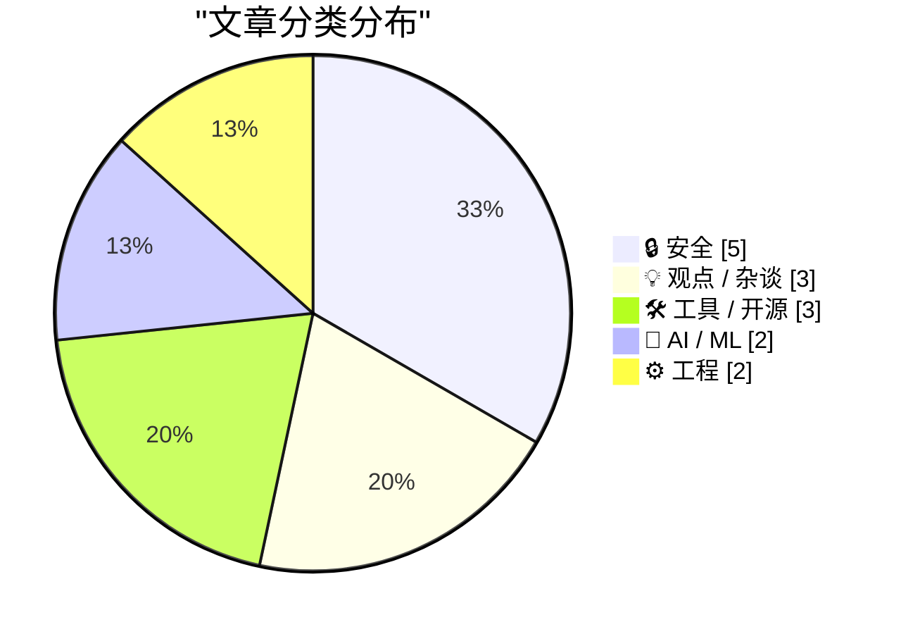
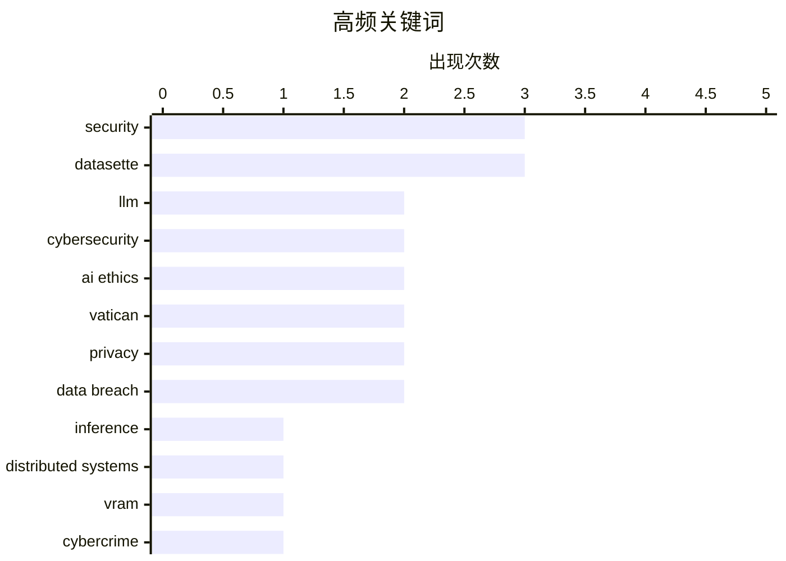

# 📰 May 26, 2026

> 来自 Karpathy 推荐的 92 个顶级技术博客，AI 精选 Top 15

## 📝 今日看点

今日技术圈呈现出 AI 深度反思与安全防御升级的双重趋势。业界正从单纯的技术狂热转向对 AI 伦理、市场泡沫及开源社区负面影响的审慎评估，强调技术应回归人类尊严与实际效用。与此同时，全球网络安全治理持续收紧，从跨国打击犯罪基础设施到利用内存安全语言重构底层工具，基础设施的韧性与合规性正成为核心关注点。

---

## 🏆 今日必读

🥇 **在 DwarfStar 中实现分布式 LLM 推理**

[Distributing LLM inference in DwarfStar](http://antirez.com/news/167) — antirez.com · 19 小时前 · 🤖 AI / ML

> DwarfStar 旨在解决运行大规模 LLM 时昂贵的显卡和 VRAM 成本问题。该项目探索了在多台机器上分布式运行推理的方案，作为昂贵 NVIDIA 服务器或带宽受限的 Apple 硬件（如 Mac Studio）的替代选择。文中对比了 Mac Studio 的 512GB 统一内存方案与传统服务器的优劣，重点关注预填充（prefill）速度和内存带宽的平衡。作者通过 DwarfStar 实现了跨节点的高效推理，降低了个人开发者运行大模型的门槛。这种分布式架构允许利用旧硬件或多台低成本设备组合出强大的推理能力。

💡 **为什么值得读**: Redis 作者 antirez 亲自动手解决大模型推理的硬件成本痛点，其分布式架构思路对开发者极具参考价值。

🏷️ LLM, inference, distributed systems, VRAM

🥈 **荷兰查封 800 台服务器并逮捕两名协助网络攻击的嫌疑人**

[Netherlands Seizes 800 Servers, Arrests 2 for Aiding Cyberattacks](https://krebsonsecurity.com/2026/05/netherlands-seizes-800-servers-arrests-2-for-aiding-cyberattacks/) — krebsonsecurity.com · 20 小时前 · 🔒 安全

> 荷兰当局查封了两个相关托管公司的 800 台服务器，并逮捕了两名共同所有者，指控其为俄罗斯提供网络攻击基础设施。这些服务器被用于在欧盟内部发起网络攻击、影响力行动和虚假信息宣传。调查显示，这两名嫌疑人接管了去年被欧盟制裁的 Stark Industries Solutions 的技术架构。此行动是打击跨国网络犯罪和政治干预的重要里程碑。该案件揭示了“防弹托管”服务如何成为国家级网络行动的温床。

💡 **为什么值得读**: 揭示了网络犯罪背后的基础设施托管内幕，以及国际执法机构如何通过技术溯源打击国家级背景的攻击。

🏷️ Cybersecurity, cybercrime, geopolitics

🥉 **关于教皇利奥十四世人工智能通谕的笔记**

[Notes on Pope Leo XIV's encyclical on AI](https://simonwillison.net/2026/May/25/encyclical-on-ai/#atom-everything) — simonwillison.net · 10 小时前 · 🤖 AI / ML

> 梵蒂冈发布了教皇利奥十四世关于人工智能的通谕《Magnifica Humanitas》，探讨在 AI 时代如何保护人类尊严。该文件被认为是目前关于 AI 融入现代社会伦理最清晰的论述之一。通谕强调了技术进步必须服务于人类福祉，而非取代人的主体性。Simon Willison 对此进行了深度解读，分析了宗教视角对技术伦理演进的影响。文章指出，这种跨学科的对话对于制定全球 AI 治理框架至关重要。

💡 **为什么值得读**: 罕见地从宗教和伦理最高维度审视 AI 技术，为技术开发者提供了跳出代码逻辑的人文思考框架。

🏷️ AI ethics, regulation, Vatican

---

## 📊 数据概览

| 扫描源 | 抓取文章 | 时间范围 | 精选 |
|:---:|:---:|:---:|:---:|
| 83/92 | 2470 篇 → 30 篇 | 48h | **15 篇** |

### 分类分布



### 高频关键词



<details>
<summary>📈 纯文本关键词图（终端友好）</summary>

```
security            │ ████████████████████ 3
datasette           │ ████████████████████ 3
llm                 │ █████████████░░░░░░░ 2
cybersecurity       │ █████████████░░░░░░░ 2
ai ethics           │ █████████████░░░░░░░ 2
vatican             │ █████████████░░░░░░░ 2
privacy             │ █████████████░░░░░░░ 2
data breach         │ █████████████░░░░░░░ 2
inference           │ ███████░░░░░░░░░░░░░ 1
distributed systems │ ███████░░░░░░░░░░░░░ 1
```

</details>

### 🏷️ 话题标签

**security**(3) · **datasette**(3) · **llm**(2) · cybersecurity(2) · ai ethics(2) · vatican(2) · privacy(2) · data breach(2) · inference(1) · distributed systems(1) · vram(1) · cybercrime(1) · geopolitics(1) · regulation(1) · ai bubble(1) · economics(1) · tech industry(1) · analysis(1) · open source(1) · github issues(1)

---

## 🔒 安全

### 1. 荷兰查封 800 台服务器并逮捕两名协助网络攻击的嫌疑人

[Netherlands Seizes 800 Servers, Arrests 2 for Aiding Cyberattacks](https://krebsonsecurity.com/2026/05/netherlands-seizes-800-servers-arrests-2-for-aiding-cyberattacks/) — **krebsonsecurity.com** · 20 小时前 · ⭐ 28/30

> 荷兰当局查封了两个相关托管公司的 800 台服务器，并逮捕了两名共同所有者，指控其为俄罗斯提供网络攻击基础设施。这些服务器被用于在欧盟内部发起网络攻击、影响力行动和虚假信息宣传。调查显示，这两名嫌疑人接管了去年被欧盟制裁的 Stark Industries Solutions 的技术架构。此行动是打击跨国网络犯罪和政治干预的重要里程碑。该案件揭示了“防弹托管”服务如何成为国家级网络行动的温床。

🏷️ Cybersecurity, cybercrime, geopolitics

---

### 2. Python 软件包中的 GitHub Actions 安全性

[GitHub Actions security in Python packages](https://nesbitt.io/2026/05/25/github-actions-security-in-python-packages.html) — **nesbitt.io** · 1 天前 · ⭐ 23/30

> 本文聚焦于 Python 软件包发布流程中 GitHub Actions 的安全配置问题。作者推荐并探讨了名为 Dr. Zizmor 的安全扫描工具，用于检测 GitHub Actions 工作流中的潜在漏洞。文章强调了在自动化构建和发布环节中，不当的权限设置或第三方 Action 引用可能导致供应链攻击。通过具体的配置示例，展示了如何加固 CI/CD 流水线以保护 Python 生态的安全性。这对于维护高下载量的开源库尤为重要。

🏷️ GitHub Actions, Python, security, CI/CD

---

### 3. 欢迎不丹政府加入 Have I Been Pwned

[Welcoming the Bhutanese Government to Have I Been Pwned](https://www.troyhunt.com/welcoming-the-bhutanese-government-to-have-i-been-pwned/) — **troyhunt.com** · 11 小时前 · ⭐ 23/30

> 不丹政府正式加入 Have I Been Pwned (HIBP) 的免费政府服务，成为第 45 个合作的国家机构。不丹计算机应急响应小组 (BtCIRT) 现在可以利用 HIBP 的数据监控其政府域名的泄露情况。这项合作旨在提升不丹的国家网络安全防御能力，及时发现并应对针对政府人员的凭据泄露风险。Troy Hunt 强调了这种跨国数据共享在应对全球性数据泄露威胁中的关键作用。该服务已覆盖全球多个国家，成为公共安全基础设施的一部分。

🏷️ Have I Been Pwned, cybersecurity, data breach

---

### 4. 特朗普移动（Trump Mobile）网站泄露预购订单信息——包含已完成与已放弃订单及关联客户资料

[Trump Mobile Website Exposed the Number of Pre-Orders — Both Completed and Abandoned — and the Associated Customer Information](https://www.theguardian.com/us-news/2026/may/23/trump-mobile-investigating-potential-exposure-of-would-be-customers-personal-information) — **daringfireball.net** · 15 小时前 · ⭐ 22/30

> 特朗普移动（Trump Mobile）官方网站近期被曝存在严重数据泄露风险，涉及已完成及中途放弃预购的客户信息。哥伦比亚大学教授 Jonathan Soma 在审查网站代码后确认，该站点暴露了包含用户全名、地址和电话号码的预购表单数据。泄露源于网站代码实现中的安全漏洞，使得原本应受保护的后台数据可被外部访问。目前该公司已聘请独立网络安全专家介入调查，以评估受影响的用户规模及具体漏洞成因。

🏷️ data breach, privacy, web security, leak

---

### 5. 伦敦手机窃贼向受害者发送恐吓短信进行二次勒索

[Thieves Are Texting Threats to Victims of iPhone Theft in London](https://www.nytimes.com/2026/05/23/world/europe/phone-theft-threats-london.html?unlocked_article_code=1.lFA.OUt7.VJ_FoDpINr0L) — **daringfireball.net** · 14 小时前 · ⭐ 20/30

> 伦敦的 iPhone 盗窃案正演变为一种更具侵略性的数字勒索模式。窃贼在街头抢夺手机后，会向受害者及其家属发送包含威胁信息的短信，声称已掌握银行账户和电子邮件权限。部分受害者甚至收到了窃贼挥舞砍刀的恐吓视频，以此逼迫受害者解锁设备或解除 iCloud 激活锁。这种犯罪手段的升级表明，单纯的物理防盗已不足以应对当前的犯罪链条，受害者的个人隐私和心理安全面临更大威胁。

🏷️ iPhone theft, phishing, social engineering, security

---

## 💡 观点 / 杂谈

### 6. AI 泡沫不同于互联网泡沫

[Pluralistic: The AI bubble isn't like the internet bubble (26 May 2026)](https://pluralistic.net/2026/05/26/the-ai-will-continue/) — **pluralistic.net** · 26 分钟前 · ⭐ 26/30

> Cory Doctorow 深入剖析了当前的 AI 泡沫与 2000 年互联网泡沫的本质区别。他指出，互联网时代的普及是自发且具有实际效用的，而当前的 AI 技术在很大程度上是被强加给员工和消费者的。文章批评了科技巨头通过垄断地位强制推行尚未成熟的 AI 工具，而非解决用户真实痛点。作者认为这种“强行喂食”的模式可能导致比以往更严重的经济和社会后果。这种泡沫的破裂可能不仅是财务上的，更是对技术信任的全面崩塌。

🏷️ AI bubble, economics, tech industry, analysis

---

### 7. 广告技术贼群中并无道义可言

[Pluralistic: No honor among (ad-tech) thieves (25 May 2026)](https://pluralistic.net/2026/05/25/lying-spies/) — **pluralistic.net** · 1 天前 · ⭐ 23/30

> 本文探讨了广告技术（Ad-tech）行业的欺诈乱象以及各大平台的“平台腐烂化”（Enshittification）趋势。作者点名批评了 Airbnb、Oculus 和任天堂等公司在用户体验和版权保护方面的倒退行为。文章揭露了广告技术公司如何通过虚假数据和监控手段牟利，甚至在行业内部也缺乏基本的诚信。这种系统性的利益榨取正在破坏互联网的公共价值和用户信任。作者呼吁通过监管和技术手段重构更公平的数字生态。

🏷️ ad-tech, privacy, digital advertising, fraud

---

### 8. 引用 Corey Quinn：将技术限制上升为教义的顶级游说

[Quoting Corey Quinn](https://simonwillison.net/2026/May/26/corey-quinn/#atom-everything) — **simonwillison.net** · 7 小时前 · ⭐ 20/30

> 云计算专家 Corey Quinn 对 Anthropic 联合创始人 Christopher Olah 的近期动态发表了犀利评论。他指出，让教皇将产品的具体技术局限性封为“精神论述”，是其见过的最伟大的厂商游说行为。这一评论背景源于 Anthropic 在 AI 安全与解释性方面的宣传策略，似乎成功地将技术瓶颈包装成了某种哲学或道德准则。这种将技术叙事与宗教/权威背书结合的做法，引发了业内对 AI 公司公关边界的讨论。

🏷️ AI ethics, Vatican, industry commentary

---

## 🛠 工具 / 开源

### 9. Datasette 1.0a30 版本发布

[datasette 1.0a30](https://simonwillison.net/2026/May/24/datasette/#atom-everything) — **simonwillison.net** · 1 天前 · ⭐ 22/30

> 数据分析工具 Datasette 发布了 1.0a30 预览版，引入了全新的可扩展“跳转到（Jump to...）”菜单。用户现在可以通过快捷键 `/` 快速调出该菜单，在不同的数据库、表和视图之间进行高效导航。该功能支持高度自定义，允许开发者根据需求扩展菜单项。此外，该版本还包含了一系列针对 1.0 正式版的稳定性改进和 UI 优化。这一更新显著提升了复杂数据集的交互体验。

🏷️ Datasette, SQLite, data analysis

---

### 10. datasette-agent 0.1a4 发布：利用新钩子优化 AI 助手交互

[datasette-agent 0.1a4](https://simonwillison.net/2026/May/24/datasette-agent/#atom-everything) — **simonwillison.net** · 1 天前 · ⭐ 20/30

> Simon Willison 发布了 datasette-agent 的 0.1a4 版本，进一步增强了 Datasette 的 AI 助手功能。该版本充分利用了 Datasette 1.0a30 中新增的 makeJumpSections() JavaScript 插件钩子。通过该技术实现，用户现在可以直接在界面中看到“开启新代理对话”的入口，提升了交互的便捷性。此次更新展示了 Datasette 1.0 预览版插件系统的灵活性，允许开发者更深度地定制 Web 界面。

🏷️ Datasette, LLM agent, plugins

---

### 11. datasette-fixtures 0.1a0 发布：简化插件测试的数据填充

[datasette-fixtures 0.1a0](https://simonwillison.net/2026/May/24/datasette-fixtures/#atom-everything) — **simonwillison.net** · 1 天前 · ⭐ 19/30

> Simon Willison 推出了新插件 datasette-fixtures 的首个版本 0.1a0，旨在优化插件的测试流程。该插件封装了 Datasette 1.0a30 中引入的 populate_fixture_database(conn) 辅助函数，为开发者提供了一套标准的测试数据填充方案。通过该工具，开发者可以更轻松地在测试环境中构建一致的数据库状态，从而验证插件功能的准确性。这是 Datasette 迈向 1.0 正式版过程中，在开发者工具链完善方面迈出的重要一步。

🏷️ Datasette, testing, fixtures

---

## 🤖 AI / ML

### 12. 在 DwarfStar 中实现分布式 LLM 推理

[Distributing LLM inference in DwarfStar](http://antirez.com/news/167) — **antirez.com** · 19 小时前 · ⭐ 29/30

> DwarfStar 旨在解决运行大规模 LLM 时昂贵的显卡和 VRAM 成本问题。该项目探索了在多台机器上分布式运行推理的方案，作为昂贵 NVIDIA 服务器或带宽受限的 Apple 硬件（如 Mac Studio）的替代选择。文中对比了 Mac Studio 的 512GB 统一内存方案与传统服务器的优劣，重点关注预填充（prefill）速度和内存带宽的平衡。作者通过 DwarfStar 实现了跨节点的高效推理，降低了个人开发者运行大模型的门槛。这种分布式架构允许利用旧硬件或多台低成本设备组合出强大的推理能力。

🏷️ LLM, inference, distributed systems, VRAM

---

### 13. 关于教皇利奥十四世人工智能通谕的笔记

[Notes on Pope Leo XIV's encyclical on AI](https://simonwillison.net/2026/May/25/encyclical-on-ai/#atom-everything) — **simonwillison.net** · 10 小时前 · ⭐ 26/30

> 梵蒂冈发布了教皇利奥十四世关于人工智能的通谕《Magnifica Humanitas》，探讨在 AI 时代如何保护人类尊严。该文件被认为是目前关于 AI 融入现代社会伦理最清晰的论述之一。通谕强调了技术进步必须服务于人类福祉，而非取代人的主体性。Simon Willison 对此进行了深度解读，分析了宗教视角对技术伦理演进的影响。文章指出，这种跨学科的对话对于制定全球 AI 治理框架至关重要。

🏷️ AI ethics, regulation, Vatican

---

## ⚙️ 工程

### 14. 引用 Armin Ronacher：AI 生成 Issue 的危害

[Quoting Armin Ronacher](https://simonwillison.net/2026/May/24/armin-ronacher/#atom-everything) — **simonwillison.net** · 1 天前 · ⭐ 24/30

> Flask 创始人 Armin Ronacher 表达了对 AI 生成 GitHub Issue 的强烈不满，认为这种行为严重破坏了开源社区的沟通效率。大量用户将观察到的问题直接丢给 LLM 处理，导致生成的报告充满了“迷之自信”的错误结论和虚假根因分析。这些 AI 生成的内容不仅掩盖了真实问题，还迫使维护者花费大量时间去证伪这些毫无根据的猜测。这种“AI 污染”正成为开源项目维护者面临的新型负担。作者呼吁用户回归真实的、基于观察的反馈方式。

🏷️ Open Source, LLM, GitHub issues

---

### 15. 内存安全的 Go 语言版 rsync 如何规避漏洞

[How my minimal, memory-safe Go rsync steers clear of vulnerabilities](https://michael.stapelberg.ch/posts/2026-05-24-minimal-memory-safe-go-rsync-vulns/) — **michael.stapelberg.ch** · 1 天前 · ⭐ 23/30

> 作者介绍了一个使用 Go 语言编写的极简、内存安全的 rsync 实现，旨在规避传统 C 语言版本中常见的安全漏洞。文章重点分析了近期发现的“校验和长度验证不当”漏洞，并展示了 Go 的类型系统和内存管理如何天然地防御此类攻击。该项目通过精简功能集，降低了代码复杂度，从而减少了攻击面。这种重构思路为关键基础设施工具的现代化提供了参考范式。作者证明了在不牺牲核心性能的前提下，可以获得更高的安全性。

🏷️ Go, memory safety, rsync, security

---

*生成于 2026-05-26 10:12 | 扫描 83 源 → 获取 2470 篇 → 精选 15 篇*
*基于 [Hacker News Popularity Contest 2025](https://refactoringenglish.com/tools/hn-popularity/) RSS 源列表，由 [Andrej Karpathy](https://x.com/karpathy) 推荐*
