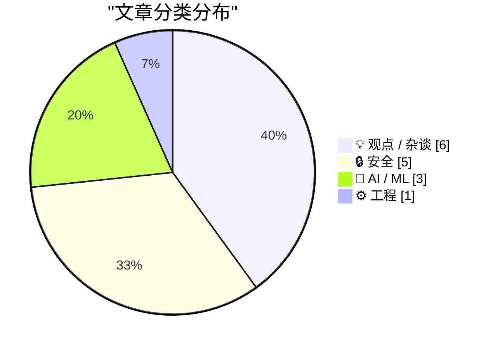
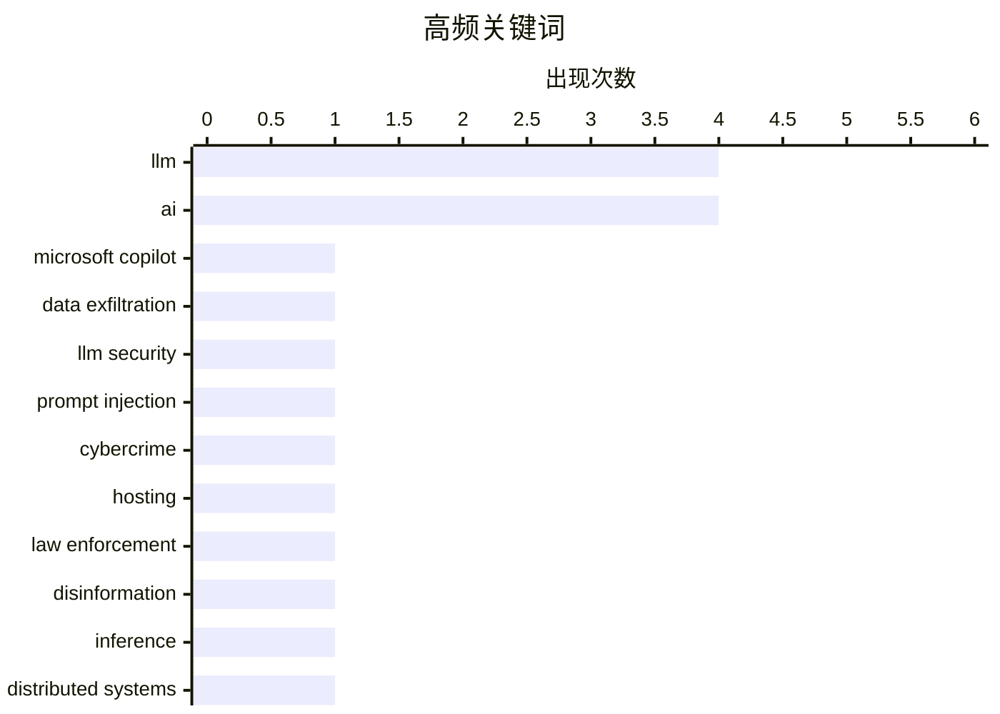

# 📰 May 27, 2026

> 来自 Karpathy 推荐的 92 个顶级技术博客，AI 精选 Top 15

## 📝 今日看点

今日技术圈呈现出对 AI 浪潮的深度审视与技术突破并行的态势。安全领域正面临 AI 辅助漏洞报告激增与大模型隐私泄露的双重挑战，迫使开源社区与科技巨头重新评估防御策略。与此同时，业界对“AI 泡沫”及企业非理性决策的批判声渐起，从伦理准则到生产力衡量标准都在经历重构。而在技术前沿，分布式推理方案的探索与神秘高性能模型的出现，预示着大模型竞争正向更深层的硬件优化与算法演进迈进。

---

## 🏆 今日必读

🥇 **Microsoft Copilot Cowork 存在文件泄露风险**

[Microsoft Copilot Cowork Exfiltrates Files](https://simonwillison.net/2026/May/26/copilot-cowork-exfiltrates-files/#atom-everything) — simonwillison.net · 18 小时前 · 🔒 安全

> Microsoft Copilot Cowork 存在严重的数据泄露漏洞，攻击者可借此窃取用户文件。通过间接提示词注入（Indirect Prompt Injection）手段，恶意指令可以诱导 Copilot 代理将敏感文件内容发送到攻击者控制的外部服务器。该漏洞揭示了代理式 AI 系统在处理不受信输入时的核心安全挑战，即模型可能在执行任务时被恶意操纵。目前，防止 AI 代理成为数据窃取工具仍是此类系统设计中难以攻克的难题。这一案例再次证明，只要 AI 能够访问私有数据并连接互联网，泄露风险就始终存在。

💡 **为什么值得读**: 揭示了 AI 代理系统在实际应用中面临的真实安全威胁，是研究 AI 安全和间接注入攻击的必读案例。

🏷️ Microsoft Copilot, data exfiltration, LLM security, prompt injection

🥈 **荷兰查封 800 台服务器并逮捕两名协助网络攻击的嫌疑人**

[Netherlands Seizes 800 Servers, Arrests 2 for Aiding Cyberattacks](https://krebsonsecurity.com/2026/05/netherlands-seizes-800-servers-arrests-2-for-aiding-cyberattacks/) — krebsonsecurity.com · 1 天前 · 🔒 安全

> 荷兰当局查封了 800 台服务器并逮捕了两名互联网托管公司的负责人，指控其为俄罗斯在欧盟境内的网络攻击和虚假信息活动提供基础设施。这两名嫌疑人经营的托管公司接管了去年被欧盟制裁的 Stark Industries Solutions 的技术架构，长期充当网络犯罪的避风港。此次行动是针对支持国家级网络战的底层 IT 设施进行的重大打击。调查显示，这些服务器被广泛用于影响力行动和破坏性网络攻击。这一执法行动标志着国际社会在打击网络犯罪基础设施方面取得了重要进展。

💡 **为什么值得读**: 了解国际执法机构如何通过打击底层托管服务商，从源头上瓦解国家背景的网络攻击链条。

🏷️ cybercrime, hosting, law enforcement, disinformation

🥉 **在 DwarfStar 中实现分布式 LLM 推理**

[Distributing LLM inference in DwarfStar](http://antirez.com/news/167) — antirez.com · 1 天前 · 🤖 AI / ML

> DwarfStar 项目探索了在非高端服务器硬件上运行大规模语言模型（LLM）的分布式推理方案。针对 NVIDIA 高端显卡成本过高的问题，文章对比了 Apple Mac Studio（最高 512GB 统一内存）和 DGX Spark 等替代方案的性能与成本。DwarfStar 旨在通过分布式计算突破单一设备的显存带宽和容量限制，使运行超大参数模型变得更加经济。该方案特别关注如何在保证推理速度的同时，利用多台低成本设备协同工作。这为个人开发者和小型团队运行顶级模型提供了新的技术路径。

💡 **为什么值得读**: 为希望在有限预算下运行超大规模 AI 模型的开发者提供了实用的分布式推理思路和硬件选型参考。

🏷️ LLM, inference, distributed systems, VRAM

---

## 📊 数据概览

| 扫描源 | 抓取文章 | 时间范围 | 精选 |
|:---:|:---:|:---:|:---:|
| 83/92 | 2459 篇 → 39 篇 | 48h | **15 篇** |

### 分类分布



### 高频关键词



<details>
<summary>📈 纯文本关键词图（终端友好）</summary>

```
llm               │ ████████████████████ 4
ai                │ ████████████████████ 4
microsoft copilot │ █████░░░░░░░░░░░░░░░ 1
data exfiltration │ █████░░░░░░░░░░░░░░░ 1
llm security      │ █████░░░░░░░░░░░░░░░ 1
prompt injection  │ █████░░░░░░░░░░░░░░░ 1
cybercrime        │ █████░░░░░░░░░░░░░░░ 1
hosting           │ █████░░░░░░░░░░░░░░░ 1
law enforcement   │ █████░░░░░░░░░░░░░░░ 1
disinformation    │ █████░░░░░░░░░░░░░░░ 1
```

</details>

### 🏷️ 话题标签

**llm**(4) · **ai**(4) · **microsoft copilot**(1) · data exfiltration(1) · llm security(1) · prompt injection(1) · cybercrime(1) · hosting(1) · law enforcement(1) · disinformation(1) · inference(1) · distributed systems(1) · vram(1) · curl(1) · open source(1) · security(1) · ai ethics(1) · vatican(1) · policy(1) · human rights(1)

---

## 💡 观点 / 杂谈

### 1. AI 泡沫与互联网泡沫并不相同

[Pluralistic: The AI bubble isn't like the internet bubble (26 May 2026)](https://pluralistic.net/2026/05/26/the-ai-will-continue/) — **pluralistic.net** · 1 天前 · ⭐ 27/30

> Cory Doctorow 深入分析了当前的 AI 泡沫与互联网泡沫的本质区别。他指出，早期的互联网是用户主动拥抱的技术，而 AI 更多是企业强制推行给员工和消费者的工具。文章探讨了“AI 泡沫”背后的强制性逻辑，以及这种缺乏原生需求驱动的增长可能带来的社会后果。作者认为，这种“填鸭式”的技术普及路径使得当前的 AI 热潮在经济和社会层面都极具风险。这种强制性消费模式可能导致技术在泡沫破裂后难以留下像互联网那样的遗产。

🏷️ AI bubble, tech history, economics

---

### 2. 商业白痴的复仇

[Revenge of The Business Idiot](https://www.wheresyoured.at/the-revenge-of-the-business-idiot/) — **wheresyoured.at** · 17 小时前 · ⭐ 25/30

> 文章对当前 AI 浪潮中企业领导层的盲目决策进行了尖锐批判。作者 Ed Zitron 分析了 NVIDIA、Anthropic 等巨头的市场地位，认为许多企业高管在不理解技术本质的情况下，正被非理性的 AI 战略所驱动。这种“商业白痴的复仇”表现为过度投资和对 AI 万能论的迷信，往往忽视了实际的落地成本和技术限制。文章警示，这种脱离现实的决策模式可能导致严重的商业失败和资源浪费。作者呼吁回归商业常识，而非盲目追逐技术热词。

🏷️ tech-industry, AI, management, business

---

### 3. 你今天烧了多少 Token？

[How Many Tokens Did You Burn Today](https://idiallo.com/blog/how-many-tokens-did-you-burn-today?src=feed) — **idiallo.com** · 9 小时前 · ⭐ 23/30

> 作者通过回顾二十年前经理要求按“代码行数”考核开发者的荒唐往事，引申出当前 AI 时代下按“消耗 Token 数”衡量生产力的类似误区。文章指出，无论是代码行数还是 AI 生成的 Token 数量，都无法真实反映软件开发的质量和解决问题的能力。这种量化指标的滥用不仅无法提升效率，反而会诱导开发者追求无意义的产出。作者呼吁回归工程本质，警惕在 AI 工具辅助下产生的新型管理官僚主义。真正的生产力在于解决问题的价值，而非产出物的体积。

🏷️ developer productivity, LLM, metrics

---

### 4. AI 与没有移民的世界：唯我论的幻觉

[Pluralistic: AI and a world without migrants (27 May 2026)](https://pluralistic.net/2026/05/27/unnecessariat/) — **pluralistic.net** · 2 小时前 · ⭐ 23/30

> 探讨了 AI 技术如何被政治修辞利用，以构建一个不需要移民劳动力的虚假愿景。作者指出，当前的 AI 热潮正被用来合理化反移民政策，试图通过自动化替代所谓的“非必要人口”（unnecessariat）。这种观点忽视了 AI 运行背后依然依赖的大量廉价、隐形的全球劳动力，本质上是一种技术唯我论。文章警告说，将 AI 视为社会问题的技术解决方案，往往掩盖了深层的阶级矛盾和剥削。这种将技术进步与排外主义挂钩的逻辑，最终会损害劳工权利并加剧社会不平等。

🏷️ AI, labor, ethics, migration

---

### 5. 引用保罗·格雷厄姆：AI 代笔邮件的虚假感

[Quoting Paul Graham](https://simonwillison.net/2026/May/26/paul-graham/#atom-everything) — **simonwillison.net** · 19 小时前 · ⭐ 22/30

> 引用了 YC 创始人 Paul Graham 对 AI 生成内容的看法，指出当前大量创业者使用 AI 撰写具有“强力新闻风格”的邮件。Graham 认为这种风格极易辨识，因为真实的创业者从未以这种方式沟通，一旦意识到是 AI 代笔，读者往往会选择忽略。他强调，由人类署名却由 AI 撰写的邮件本质上是一种欺骗行为，会严重损害沟通的信任基础。这种现象反映了在 AI 普及时代，真实性（Authenticity）正成为稀缺的社交资本。文章提醒开发者，过度依赖 AI 可能会在不经意间疏远核心利益相关者。

🏷️ Paul Graham, AI writing, communication, LLM

---

### 6. Clanker：一个描述机器的词汇

[Clanker: A Word For The Machine](https://lucumr.pocoo.org/2026/5/26/clankers/) — **lucumr.pocoo.org** · 1 天前 · ⭐ 22/30

> Flask 创始人 Armin Ronacher 探讨了他使用“Clanker”一词替代 AI “智能体”（Agent）的原因及引发的争议。在 Hacker News 上，该词被部分读者误解为具有歧视色彩的侮辱性词汇，甚至引发了激烈的道德讨论。作者解释称，使用该词是为了强调机器的工具属性，避免过度拟人化带来的认知偏差。文章深入反思了在 AI 时代，我们如何通过语言定义人机边界，以及技术术语演变背后的文化敏感性。这不仅是词汇之争，更是关于我们如何看待人工智能本质的哲学探讨。

🏷️ AI, agents, terminology, culture

---

## 🔒 安全

### 7. Microsoft Copilot Cowork 存在文件泄露风险

[Microsoft Copilot Cowork Exfiltrates Files](https://simonwillison.net/2026/May/26/copilot-cowork-exfiltrates-files/#atom-everything) — **simonwillison.net** · 18 小时前 · ⭐ 29/30

> Microsoft Copilot Cowork 存在严重的数据泄露漏洞，攻击者可借此窃取用户文件。通过间接提示词注入（Indirect Prompt Injection）手段，恶意指令可以诱导 Copilot 代理将敏感文件内容发送到攻击者控制的外部服务器。该漏洞揭示了代理式 AI 系统在处理不受信输入时的核心安全挑战，即模型可能在执行任务时被恶意操纵。目前，防止 AI 代理成为数据窃取工具仍是此类系统设计中难以攻克的难题。这一案例再次证明，只要 AI 能够访问私有数据并连接互联网，泄露风险就始终存在。

🏷️ Microsoft Copilot, data exfiltration, LLM security, prompt injection

---

### 8. 荷兰查封 800 台服务器并逮捕两名协助网络攻击的嫌疑人

[Netherlands Seizes 800 Servers, Arrests 2 for Aiding Cyberattacks](https://krebsonsecurity.com/2026/05/netherlands-seizes-800-servers-arrests-2-for-aiding-cyberattacks/) — **krebsonsecurity.com** · 1 天前 · ⭐ 28/30

> 荷兰当局查封了 800 台服务器并逮捕了两名互联网托管公司的负责人，指控其为俄罗斯在欧盟境内的网络攻击和虚假信息活动提供基础设施。这两名嫌疑人经营的托管公司接管了去年被欧盟制裁的 Stark Industries Solutions 的技术架构，长期充当网络犯罪的避风港。此次行动是针对支持国家级网络战的底层 IT 设施进行的重大打击。调查显示，这些服务器被广泛用于影响力行动和破坏性网络攻击。这一执法行动标志着国际社会在打击网络犯罪基础设施方面取得了重要进展。

🏷️ cybercrime, hosting, law enforcement, disinformation

---

### 9. 压力山大：AI 辅助报告让 curl 维护者不堪重负

[The pressure](https://simonwillison.net/2026/May/26/the-pressure/#atom-everything) — **simonwillison.net** · 10 小时前 · ⭐ 27/30

> curl 创始人 Daniel Stenberg 揭示了开源项目正面临前所未有的安全报告压力。由于 AI 辅助漏洞挖掘工具的普及，curl 收到的安全报告数量激增，目前平均每天超过 1 份，是 2024 年的 4-5 倍。虽然这些由 AI 生成的报告看似专业，但大多存在幻觉或质量低下，极大地消耗了维护者的审核精力。这种情况反映了 AI 自动化工具对开源生态系统维护成本带来的负面冲击。如果这一趋势持续，开源项目的可持续性将面临严重威胁。

🏷️ curl, AI, open source, security

---

### 10. 荷兰政府否决 Kyndryl 收购 Solvinity 的决策细节及其影响

[Het Solvinity besluit in detail, en de mogelijke gevolgen](https://berthub.eu/articles/posts/het-solvinity-besluit-gevolgen/) — **berthub.eu** · 2 小时前 · ⭐ 23/30

> 详细分析了荷兰经济部禁止美国 IT 巨头 Kyndryl 收购本土云服务商 Solvinity 的重大决策。该禁令源于对国家安全和数字主权的担忧，特别是 Solvinity 承载了大量政府及关键基础设施的敏感数据。决策背后受到了 20 万民众签名请愿以及新成立的“防火墙”（The Firewall）基金会的法律推动。这一案例标志着欧洲在保护关键数字基础设施免受外国资本控制方面迈出了实质性的一步。文章还讨论了该决定对未来跨国技术并购可能产生的深远连锁反应。

🏷️ acquisition, sovereignty, cloud infrastructure

---

### 11. Trump Mobile 网站泄露预购订单数及客户敏感信息

[Trump Mobile Website Exposed the Number of Pre-Orders — Both Completed and Abandoned — and the Associated Customer Information](https://www.theguardian.com/us-news/2026/may/23/trump-mobile-investigating-potential-exposure-of-would-be-customers-personal-information) — **daringfireball.net** · 1 天前 · ⭐ 22/30

> 报道了 Trump Mobile 移动服务网站存在的严重安全漏洞，导致已完成和放弃的预购订单数量及客户个人信息遭到泄露。泄露的数据包括用户的全名、详细地址和电话号码，哥伦比亚大学程序员 Jonathan Soma 指出该漏洞源于网站代码中的常见错误。目前该项目正面临独立网络安全专家的调查，以确定受影响的用户规模。这一事件再次敲响了政治相关商业项目在快速上线时忽视基础安全防护的警钟。文章强调了在处理公众数据时，即便是简单的代码疏忽也可能导致灾难性的隐私后果。

🏷️ data breach, privacy, cybersecurity

---

## 🤖 AI / ML

### 12. 在 DwarfStar 中实现分布式 LLM 推理

[Distributing LLM inference in DwarfStar](http://antirez.com/news/167) — **antirez.com** · 1 天前 · ⭐ 28/30

> DwarfStar 项目探索了在非高端服务器硬件上运行大规模语言模型（LLM）的分布式推理方案。针对 NVIDIA 高端显卡成本过高的问题，文章对比了 Apple Mac Studio（最高 512GB 统一内存）和 DGX Spark 等替代方案的性能与成本。DwarfStar 旨在通过分布式计算突破单一设备的显存带宽和容量限制，使运行超大参数模型变得更加经济。该方案特别关注如何在保证推理速度的同时，利用多台低成本设备协同工作。这为个人开发者和小型团队运行顶级模型提供了新的技术路径。

🏷️ LLM, inference, distributed systems, VRAM

---

### 13. 关于教皇利奥十四世 AI 通谕的笔记

[Notes on Pope Leo XIV's encyclical on AI](https://simonwillison.net/2026/May/25/encyclical-on-ai/#atom-everything) — **simonwillison.net** · 1 天前 · ⭐ 27/30

> 梵蒂冈教皇利奥十四世发布了名为《Magnifica Humanitas》的通谕，系统阐述了在人工智能时代保护人类尊严的伦理准则。该文档被认为是目前关于 AI 融入现代社会伦理讨论中最清晰、最深刻的论述之一。通谕强调技术进步必须服务于人类福祉，警惕 AI 取代人的主体地位或加剧社会不平等。这标志着宗教权威机构开始深度介入 AI 技术对社会结构和道德准则影响的全球对话。文章作者认为，无论信仰如何，该通谕对 AI 伦理的思考都极具参考价值。

🏷️ AI ethics, Vatican, policy, human rights

---

### 14. 神秘的 Hy3 模型在 OpenRouter 排行榜上遥遥领先

[The mysterious Hy3 LLM is topping OpenRouter Model Rankings by a large margin](https://minimaxir.com/2026/05/openrouter-hy3/) — **minimaxir.com** · 18 小时前 · ⭐ 26/30

> 一款名为 Hy3 的神秘大语言模型在 OpenRouter 的模型排行榜上以显著优势位居榜首。目前该模型的开发者背景、参数规模和技术细节均未公开，处于完全神秘的状态。它在实际应用表现中已大幅领先于许多知名商业和开源模型，引发了社区的广泛关注。这种“黑马”现象展示了 LLM 领域竞争的激烈程度，以及新架构或新训练方法可能带来的颠覆性效果。Hy3 的崛起证明了在 AI 领域，性能依然是打破品牌垄断的最强武器。

🏷️ LLM, OpenRouter, Hy3, benchmarks

---

## ⚙️ 工程

### 15. 我为 iozone 编写了补丁以优化现代 macOS 的磁盘基准测试

[I patched iozone for better disk benchmarks on modern macOS](https://www.jeffgeerling.com/blog/2026/i-patched-iozone-for-better-disk-benchmarks-on-modern-macos/) — **jeffgeerling.com** · 8 小时前 · ⭐ 26/30

> 知名技术博主 Jeff Geerling 分享了为现代 macOS 系统修复磁盘基准测试工具 iozone 的过程。尽管 fio 功能更强，但 iozone 凭借其跨平台特性和直观的测试结果，依然是作者进行硬盘和 SSD 性能评估的首选。通过针对 macOS 的特定补丁，作者解决了该工具在现代苹果系统上的运行问题，提升了测试的准确性。文章详细记录了补丁的实现细节及在不同存储设备上的应用效果。这对于需要在 Mac 平台上进行精确 I/O 性能分析的用户非常有价值。

🏷️ iozone, macOS, benchmarking, storage

---

*生成于 2026-05-27 10:10 | 扫描 83 源 → 获取 2459 篇 → 精选 15 篇*
*基于 [Hacker News Popularity Contest 2025](https://refactoringenglish.com/tools/hn-popularity/) RSS 源列表，由 [Andrej Karpathy](https://x.com/karpathy) 推荐*
