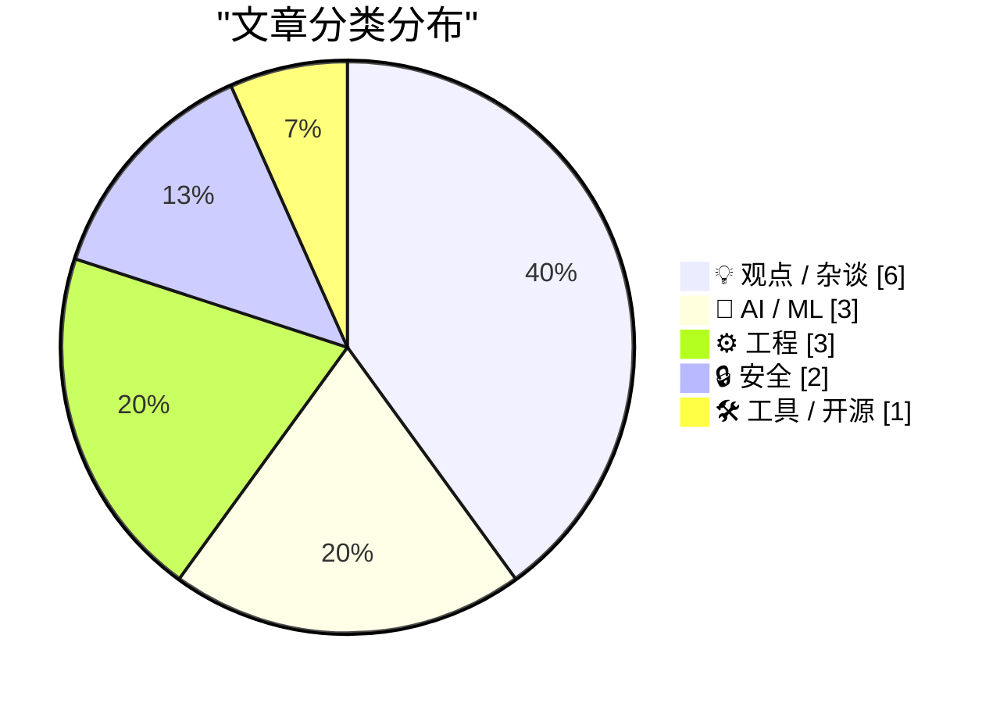
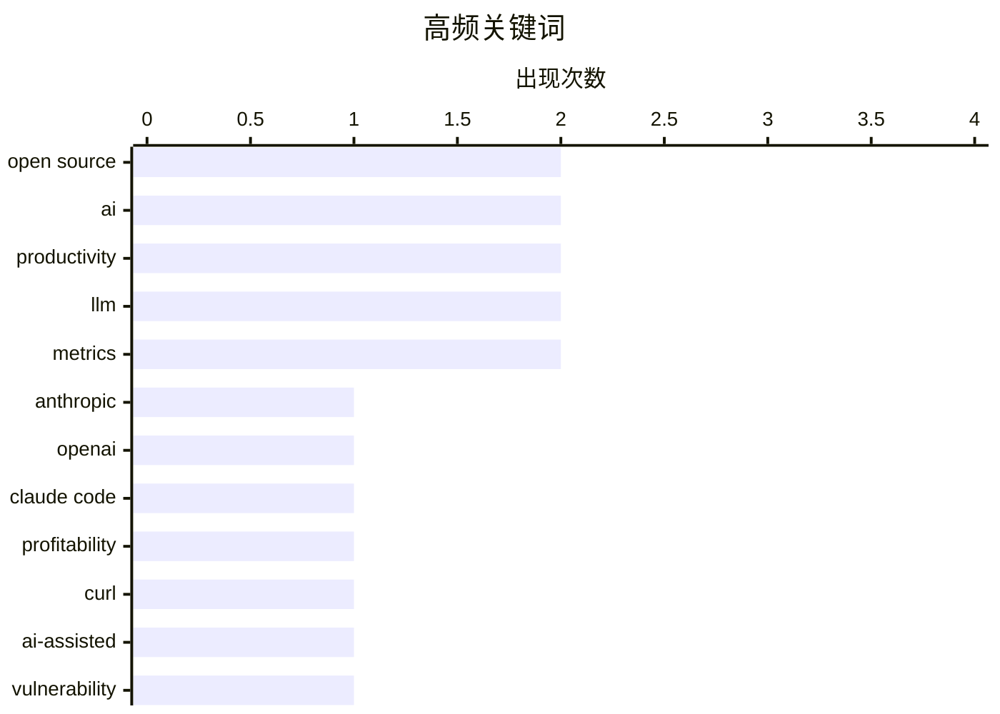

# 📰 May 28, 2026

> 来自 Karpathy 推荐的 92 个顶级技术博客，AI 精选 Top 15

## 📝 今日看点

今日技术圈见证了大模型从“烧钱”向商业闭环的跨越，Anthropic 等巨头传出的盈利信号标志着行业正迎来产品市场匹配的里程碑。然而，AI 的爆发式应用也引发了深层治理危机，从开源社区被 AI 生成报告淹没到 SQLite 针对智能体立规，技术界正加速构建 AI 时代的协作边界。在效率至上的狂热中，关于独立思考的丧失、Token 量化考核的荒诞以及对 AI 代写内容的抵制，正推动开发者重新审视技术与人类逻辑的本质关系。

---

## 🏆 今日必读

🥇 **Anthropic 与 OpenAI 已成功找到产品市场匹配（PMF）**

[I think Anthropic and OpenAI have found product-market fit](https://simonwillison.net/2026/May/27/product-market-fit/#atom-everything) — simonwillison.net · 17 小时前 · 🤖 AI / ML

> Anthropic 传闻即将迎来首个盈利季度，标志着顶级大模型公司正从纯烧钱阶段转向商业闭环。Uber CTO 等案例显示，企业员工对 Claude Code 等工具的大量使用导致 LLM 账单激增，甚至超出了公司的 AI 预算。这表明 OpenAI 和 Anthropic 已成功找到产品市场匹配（PMF），用户愿意为 AI 带来的生产力提升支付高昂费用。AI 不再只是实验性的玩具，而是成为了企业运营中不可或缺且昂贵的生产工具。这种从“免费试用”到“高额付费”的转变，验证了生成式 AI 在专业工作流中的核心价值。

💡 **为什么值得读**: 通过盈利传闻和企业账单案例，揭示了 AI 巨头如何将技术领先转化为真实的商业利润。

🏷️ Anthropic, OpenAI, Claude Code, profitability

🥈 **开源项目的压力：AI 辅助生成的安全报告正在淹没维护者**

[The pressure](https://simonwillison.net/2026/May/26/the-pressure/#atom-everything) — simonwillison.net · 1 天前 · 🔒 安全

> curl 创始人 Daniel Stenberg 揭示了开源项目正面临前所未有的压力，主要源于 AI 辅助生成的安全报告激增。目前 curl 接收报告的速度是 2024 年的 4-5 倍，平均每天超过一份。这些报告虽然看起来“专业且可信”，但往往包含 AI 虚构的漏洞逻辑，极大地消耗了维护者的审核精力。这种“AI 垃圾邮件”式的安全报告正在威胁开源生态的健康发展，让维护者疲于奔命。作者呼吁关注 AI 工具在安全领域被滥用所带来的负面外部性。

💡 **为什么值得读**: 揭示了 AI 对开源生态的负面冲击，是了解当前开源维护者真实生存现状的必读文章。

🏷️ curl, open source, AI-assisted, vulnerability

🥉 **动动脑子：AI 时代的思考危机**

[Using My Fucking Brain](https://terriblesoftware.org/2026/05/27/using-my-fucking-brain/) — terriblesoftware.org · 21 小时前 · 💡 观点 / 杂谈

> 本文探讨了在 AI 普及时代保持独立思考的紧迫性。作者认为 AI 作为大脑的延伸（Extension）极具价值，能显著提升效率，但如果让它悄悄取代原本属于人类的逻辑思考过程，则非常危险。过度依赖 AI 会导致认知退化和对错误信息的盲从，使人丧失处理复杂问题的能力。核心观点是：工具应当辅助人类进行更高层次的决策，而非接管基础的思维活动。在 AI 时代，保护好自己的“思考主权”比以往任何时候都更重要。

💡 **为什么值得读**: 警示开发者和创作者在享受 AI 便利的同时，避免陷入认知懒惰的陷阱。

🏷️ AI, productivity, critical thinking, LLM

---

## 📊 数据概览

| 扫描源 | 抓取文章 | 时间范围 | 精选 |
|:---:|:---:|:---:|:---:|
| 82/92 | 2447 篇 → 31 篇 | 48h | **15 篇** |

### 分类分布



### 高频关键词



<details>
<summary>📈 纯文本关键词图（终端友好）</summary>

```
open source   │ ████████████████████ 2
ai            │ ████████████████████ 2
productivity  │ ████████████████████ 2
llm           │ ████████████████████ 2
metrics       │ ████████████████████ 2
anthropic     │ ██████████░░░░░░░░░░ 1
openai        │ ██████████░░░░░░░░░░ 1
claude code   │ ██████████░░░░░░░░░░ 1
profitability │ ██████████░░░░░░░░░░ 1
curl          │ ██████████░░░░░░░░░░ 1
```

</details>

### 🏷️ 话题标签

**open source**(2) · **ai**(2) · **productivity**(2) · llm(2) · metrics(2) · anthropic(1) · openai(1) · claude code(1) · profitability(1) · curl(1) · ai-assisted(1) · vulnerability(1) · critical thinking(1) · hy3(1) · openrouter(1) · benchmarks(1) · microsoft copilot(1) · data exfiltration(1) · ai security(1) · ai hype(1)

---

## 💡 观点 / 杂谈

### 1. 动动脑子：AI 时代的思考危机

[Using My Fucking Brain](https://terriblesoftware.org/2026/05/27/using-my-fucking-brain/) — **terriblesoftware.org** · 21 小时前 · ⭐ 26/30

> 本文探讨了在 AI 普及时代保持独立思考的紧迫性。作者认为 AI 作为大脑的延伸（Extension）极具价值，能显著提升效率，但如果让它悄悄取代原本属于人类的逻辑思考过程，则非常危险。过度依赖 AI 会导致认知退化和对错误信息的盲从，使人丧失处理复杂问题的能力。核心观点是：工具应当辅助人类进行更高层次的决策，而非接管基础的思维活动。在 AI 时代，保护好自己的“思考主权”比以往任何时候都更重要。

🏷️ AI, productivity, critical thinking, LLM

---

### 2. AI 与没有移民的世界：技术唯我论的幻觉

[Pluralistic: AI and a world without migrants (27 May 2026)](https://pluralistic.net/2026/05/27/unnecessariat/) — **pluralistic.net** · 1 天前 · ⭐ 24/30

> Cory Doctorow 深入探讨了 AI 技术如何被用来构建一个“没有移民”的虚幻世界，批判了科技行业日益严重的唯我论倾向。文章通过分析 Pastejacking、恐怖主义颅相学等技术乱象，揭示了 AI 在解决社会问题时的局限性与潜在危害。作者指出，将 AI 视为劳动力短缺的万能药不仅是技术误判，更是对复杂社会现实的逃避。这种趋势可能导致更严重的技术异化和权利剥夺。文章呼吁回归现实，关注技术背后的社会公正与人文关怀。

🏷️ AI hype, social impact, ethics

---

### 3. 你今天烧了多少 Token？量化考核的轮回

[How Many Tokens Did You Burn Today](https://idiallo.com/blog/how-many-tokens-did-you-burn-today?src=feed) — **idiallo.com** · 1 天前 · ⭐ 23/30

> 文章对比了二十年前荒谬的“按代码行数考核程序员”与当今“统计 Token 消耗量”的现象。作者通过回顾职业生涯早期经理要求的“人均周代码行数饼图”笑话，讽刺了管理层对量化指标的盲目崇拜。在 AI 时代，Token 消耗量正成为新的衡量标准，但这种指标同样无法真实反映开发者的产出价值。核心观点是：过度关注表面数据而忽视实际逻辑，是管理上的一种倒退。真正的生产力提升不应被简化为一组无意义的数字。

🏷️ productivity, LLM tokens, metrics

---

### 4. 商业白痴的复仇：AI 泡沫下的财务驱动危机

[Revenge of The Business Idiot](https://www.wheresyoured.at/the-revenge-of-the-business-idiot/) — **wheresyoured.at** · 1 天前 · ⭐ 23/30

> Ed Zitron 在文中猛烈抨击了由“商业白痴”主导的 AI 泡沫，认为过度追求财务指标正在损害技术创新。文章深入分析了 NVIDIA 和 Anthropic 等巨头的现状，指出当前的 AI 热潮更多是由资本运作而非实际技术突破驱动。作者警告称，这种以短期利益为导向的决策模式最终会导致行业的崩盘。文章揭示了科技巨头如何通过复杂的财务手段维持增长假象。对于关注 AI 行业长期健康发展的读者来说，这是一篇极具批判性的深度分析。

🏷️ Tech Industry, AI Business, Analysis

---

### 5. Paul Graham：我从不读 AI 代写的邮件

[Quoting Paul Graham](https://simonwillison.net/2026/May/26/paul-graham/#atom-everything) — **simonwillison.net** · 1 天前 · ⭐ 21/30

> YC 创始人 Paul Graham 表达了对 AI 生成邮件的强烈反感，认为这种带有“强力新闻风格”的写作方式极易被识别。他指出，一旦读者意识到邮件是由 AI 代笔，就会产生被欺骗的感觉，从而失去阅读兴趣。这种现象在创业者与投资者的沟通中尤为普遍，反而降低了沟通效率。Graham 认为，在人际交流中，真实性比完美的文笔更为重要。他建议创业者回归真诚的沟通方式，而不是依赖 AI 润色出的空洞辞藻。

🏷️ AI writing, communication, startups

---

### 6. 互联网的 Costco 理论

[The Costco theory of the internet](https://www.joanwestenberg.com/the-costco-theory-of-the-internet/) — **joanwestenberg.com** · 8 小时前 · ⭐ 21/30

> Costco 理论源于零售商 Sol Price 的经营哲学，即通过“智能地放弃销量”来换取极致的效率和用户价值。在信息泛滥的互联网时代，这种策略表现为通过精选内容和限制冗余选择来建立深层的用户信任。文章对比了现代互联网追求“无限选择”导致的决策疲劳，与 Costco 这种通过减少 SKU（库存单位）来提升质量的模式。作者认为，未来成功的互联网产品将不再是提供海量信息的平台，而是敢于做减法、为用户进行高质量筛选的策展者。这种从“量”到“质”的转变是应对注意力经济危机的核心路径。

🏷️ internet economy, business model, curation

---

## 🤖 AI / ML

### 7. Anthropic 与 OpenAI 已成功找到产品市场匹配（PMF）

[I think Anthropic and OpenAI have found product-market fit](https://simonwillison.net/2026/May/27/product-market-fit/#atom-everything) — **simonwillison.net** · 17 小时前 · ⭐ 26/30

> Anthropic 传闻即将迎来首个盈利季度，标志着顶级大模型公司正从纯烧钱阶段转向商业闭环。Uber CTO 等案例显示，企业员工对 Claude Code 等工具的大量使用导致 LLM 账单激增，甚至超出了公司的 AI 预算。这表明 OpenAI 和 Anthropic 已成功找到产品市场匹配（PMF），用户愿意为 AI 带来的生产力提升支付高昂费用。AI 不再只是实验性的玩具，而是成为了企业运营中不可或缺且昂贵的生产工具。这种从“免费试用”到“高额付费”的转变，验证了生成式 AI 在专业工作流中的核心价值。

🏷️ Anthropic, OpenAI, Claude Code, profitability

---

### 8. 神秘模型 Hy3 领跑 OpenRouter 排行榜

[The mysterious Hy3 LLM is topping OpenRouter Model Rankings by a large margin](https://minimaxir.com/2026/05/openrouter-hy3/) — **minimaxir.com** · 1 天前 · ⭐ 26/30

> 一款名为 Hy3 的神秘大模型在 OpenRouter 模型排行榜上以显著优势位居榜首，引发了技术圈的广泛关注。该模型在性能指标上超越了众多知名闭源和开源模型，但其背后的开发团队、架构细节及训练数据来源尚不明确。文章分析了 Hy3 在实际应用中的表现，以及它为何能迅速在开发者群体中获得高评价。这反映了 LLM 领域竞争的激烈程度，以及新势力随时可能通过优化算法颠覆现有格局的现状。Hy3 的崛起证明了在 AI 领域，性能表现才是获取用户最硬的指标。

🏷️ LLM, Hy3, OpenRouter, Benchmarks

---

### 9. 将 KL 散度转化为度量空间指标

[Turning K-L divergence into a metric](https://www.johndcook.com/blog/2026/05/27/jensen-shannon/) — **johndcook.com** · 8 小时前 · ⭐ 21/30

> KL 散度（Kullback-Leibler divergence）在衡量概率分布差异时非常有用，但由于其非对称性且不满足三角不等式，在数学定义上并非真正的“度量”。文章探讨了通过数学变换解决这一问题的方法，重点介绍了对称化的 Jeffreys 散度。更进一步，Jensen-Shannon (JS) 散度不仅实现了对称性，且其平方根完全符合度量的所有公理。这些变换对于需要严格距离定义的机器学习算法、聚类分析和统计推断至关重要。通过这种转化，研究者可以在更严谨的几何框架下比较概率分布。

🏷️ mathematics, KL divergence, statistics, machine learning

---

## ⚙️ 工程

### 10. SQLite 仓库新增 AGENTS.md：为 AI 智能体立规矩

[sqlite AGENTS.md](https://simonwillison.net/2026/May/27/sqlite-agents/#atom-everything) — **simonwillison.net** · 10 小时前 · ⭐ 23/30

> SQLite 官方仓库新增了 `AGENTS.md` 文件，专门针对扫描其代码库的 AI 智能体设定交互规则。该文件明确指出 SQLite 不接受未经事先协议或缺乏法律授权的拉取请求（PR），旨在规范 AI 在开源贡献中的行为。此举反映了顶级开源项目开始主动应对 AI 自动生成代码带来的管理挑战。维护者试图通过这种方式，在利用 AI 工具和保持代码质量、法律合规之间建立清晰的界限。这标志着开源治理进入了“AI 友好但受控”的新阶段。

🏷️ SQLite, AI Agents, documentation

---

### 11. 电池寿命优化笔记

[Notes on optimizing battery life:](https://maurycyz.com/misc/battery/) — **maurycyz.com** · 1 天前 · ⭐ 21/30

> 针对低功耗嵌入式设备的电池寿命优化，作者建议以电流（mA）和电荷量（mAh）而非功率和能量作为核心衡量指标。以 CR2032 纽扣电池为例，大多数电路的功耗特性更接近恒流源而非恒功率负载。文章强调了理解电池放电特性曲线的重要性，因为实际可用容量会随放电速率和环境温度大幅波动。通过精确测量静态电流和脉冲电流，开发者可以更科学地预测设备续航。掌握这些电学基础是实现物联网设备超长待机的关键。

🏷️ battery life, low power, hardware, optimization

---

### 12. 2026 年的 CHAOSS 开源度量指标

[CHAOSS Metrics in 2026](https://nesbitt.io/2026/05/27/chaoss-metrics-in-2026.html) — **nesbitt.io** · 1 天前 · ⭐ 21/30

> 传统的 CHAOSS 开源社区度量指标最初是为人类开发者的贡献速度和协作模式设计的。然而到 2026 年，随着 AI 代理大规模介入代码编写和 Issue 处理，传统的提交频率、响应时间等活跃度指标已逐渐失效。文章指出，开源治理需要从单纯的“人类行为统计”转向更深层次的价值产出与协作质量评估。这种演进是为了应对 AI 自动生成的贡献对开源生态系统透明度和健康度带来的冲击。未来的度量标准将更侧重于识别 AI 与人类协作的真实影响力，而非简单的数字增长。

🏷️ Open Source, CHAOSS, Metrics, AI

---

## 🔒 安全

### 13. 开源项目的压力：AI 辅助生成的安全报告正在淹没维护者

[The pressure](https://simonwillison.net/2026/May/26/the-pressure/#atom-everything) — **simonwillison.net** · 1 天前 · ⭐ 26/30

> curl 创始人 Daniel Stenberg 揭示了开源项目正面临前所未有的压力，主要源于 AI 辅助生成的安全报告激增。目前 curl 接收报告的速度是 2024 年的 4-5 倍，平均每天超过一份。这些报告虽然看起来“专业且可信”，但往往包含 AI 虚构的漏洞逻辑，极大地消耗了维护者的审核精力。这种“AI 垃圾邮件”式的安全报告正在威胁开源生态的健康发展，让维护者疲于奔命。作者呼吁关注 AI 工具在安全领域被滥用所带来的负面外部性。

🏷️ curl, open source, AI-assisted, vulnerability

---

### 14. Microsoft Copilot Cowork 存在文件泄露风险

[Microsoft Copilot Cowork Exfiltrates Files](https://simonwillison.net/2026/May/26/copilot-cowork-exfiltrates-files/#atom-everything) — **simonwillison.net** · 1 天前 · ⭐ 25/30

> 安全研究机构 PromptArmor 披露了 Microsoft Copilot Cowork 存在的数据泄露漏洞。攻击者可以通过特定手段诱导该 AI 智能体将敏感文件发送至外部，暴露了代理系统（Agentic Systems）在数据安全方面的脆弱性。尽管微软推出了新的协作产品，但在防止 AI 被利用进行数据窃取方面仍面临巨大挑战。设计能够安全处理私有数据的 Agent 依然是当前 AI 架构中的核心难题。该案例强调了在构建具备文件访问权限的 AI 助手时，必须将安全性置于功能性之上。

🏷️ Microsoft Copilot, data exfiltration, AI security

---

## 🛠 工具 / 开源

### 15. 我修补了 iozone 以便在现代 macOS 上进行更好的磁盘基准测试

[I patched iozone for better disk benchmarks on modern macOS](https://www.jeffgeerling.com/blog/2026/i-patched-iozone-for-better-disk-benchmarks-on-modern-macos/) — **jeffgeerling.com** · 1 天前 · ⭐ 21/30

> iozone 是一款经典的跨平台磁盘性能测试工具，但在现代 macOS 系统上存在兼容性问题。作者通过修补源代码，解决了该工具在最新 macOS 环境下的编译错误和运行限制，使其能更准确地评估 SSD 和硬盘的真实性能。相比于功能更复杂但上手较难的 fio，iozone 提供了更直观的读写性能概览。这一改进确保了开发者在不同操作系统间进行基准测试时的一致性，特别是在处理现代文件系统特性时。修补后的版本让这款老牌工具在 Apple Silicon 时代的 Mac 上重焕生机。

🏷️ iozone, benchmarking, macOS, storage

---

*生成于 2026-05-28 10:18 | 扫描 82 源 → 获取 2447 篇 → 精选 15 篇*
*基于 [Hacker News Popularity Contest 2025](https://refactoringenglish.com/tools/hn-popularity/) RSS 源列表，由 [Andrej Karpathy](https://x.com/karpathy) 推荐*
