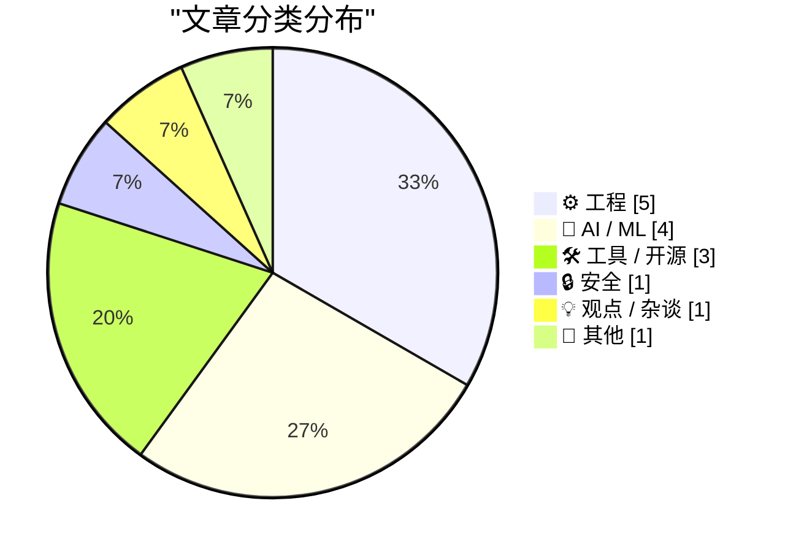
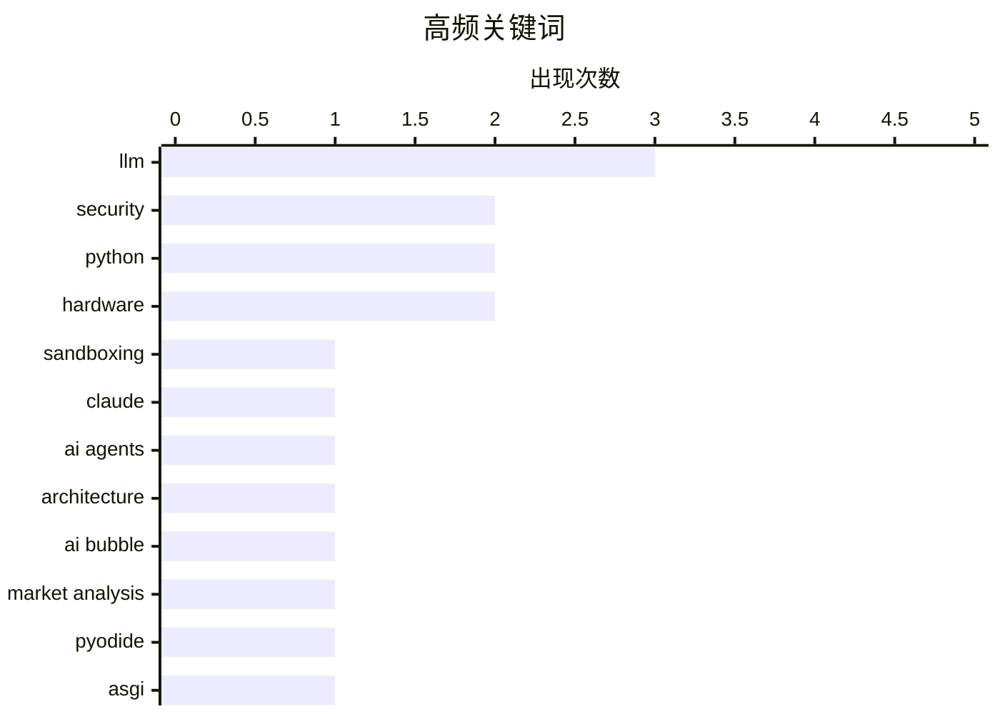

# 📰 May 31, 2026

> 来自 Karpathy 推荐的 92 个顶级技术博客，AI 精选 Top 15

## 📝 今日看点

今日技术圈聚焦 AI 范式的演进与反思，从智能体架构的兴起到对行业泡沫及搜索体验劣化的深度审视，反映了市场在狂热后的理性回归。同时，高性能计算与底层工程依然是核心，涵盖了从 JAX 数值计算到浏览器端运行 Python 的前沿实践。此外，针对系统安全隔离与硬件可维修性的讨论，展现了开发者对构建稳健、透明技术生态的持续追求。

---

## 🏆 今日必读

🥇 **Anthropic 如何在不同产品中隔离 Claude**

[How we contain Claude across products](https://simonwillison.net/2026/May/30/how-we-contain-claude/#atom-everything) — simonwillison.net · 11 小时前 · 🔒 安全

> 探讨了 Anthropic 为 Claude.ai、Claude Code 和 Computer Use 等产品构建的安全沙箱机制。在服务器端，Claude.ai 利用 gVisor 实现多租户隔离，防止恶意代码访问宿主机资源。针对本地运行的 Claude Code，系统通过 Docker 容器或轻量级虚拟机（如 Firecracker）来限制模型对用户文件系统的访问权限。对于具备“计算机操作”能力的模型，则采用了屏幕截图分析与受限输入流的组合方案。作者强调，详尽的沙箱技术文档是建立用户对 AI 代理信任的关键。

💡 **为什么值得读**: 深入了解顶级 AI 公司如何平衡大模型的代码执行能力与系统安全性。

🏷️ sandboxing, Claude, security, LLM

🥈 **构建智能体，而非流水线**

[Build agents, not pipelines](https://seangoedecke.com/build-agents-not-pipelines/) — seangoedecke.com · 8 小时前 · 🤖 AI / ML

> 剖析了在程序中使用大语言模型（LLM）的两种范式：流水线（Pipeline）与智能体（Agent）。流水线模式由开发者在代码中预设控制流，虽然可预测但面对复杂逻辑时极易变得臃肿且难以维护。智能体模式则赋予 LLM 工具使用权，由模型自主决定执行步骤，能更好地处理非结构化任务和边缘情况。作者认为，随着任务复杂度的提升，过度依赖硬编码的流水线会阻碍开发效率。转向智能体架构是提升 LLM 应用灵活性和鲁棒性的核心路径。

💡 **为什么值得读**: 重新思考 LLM 应用的架构设计，帮助开发者从繁琐的条件判断中解脱出来。

🏷️ AI agents, LLM, architecture

🥉 **深度分析：如果我们正处于 AI 泡沫中会怎样？（第三部分）**

[Premium: What If...We're In An AI Bubble? (Part 3)](https://www.wheresyoured.at/premium-what-if-were-in-an-ai-bubble-part-3/) — wheresyoured.at · 1 天前 · 🤖 AI / ML

> 本文是探讨 AI 产业是否存在泡沫及其破裂风险系列文章的第三部分。核心关注点在于当前 AI 基础设施的巨额投入与实际商业产出之间的严重脱节。作者分析了导致泡沫破裂的潜在触发因素，包括企业级应用落地缓慢、推理成本居高不下以及资本市场对 AI 变现能力的耐心流失。通过对比历史上的技术泡沫，文章揭示了当前 AI 繁荣背后的脆弱性。最终指出，如果 AI 无法在短期内证明其能带来实质性的生产力革命，行业将面临剧烈的估值回调。

💡 **为什么值得读**: 批判性地审视当前 AI 热潮，为投资者和从业者提供冷静的风险预警。

🏷️ AI bubble, market analysis, LLM

---

## 📊 数据概览

| 扫描源 | 抓取文章 | 时间范围 | 精选 |
|:---:|:---:|:---:|:---:|
| 84/92 | 2491 篇 → 30 篇 | 48h | **15 篇** |

### 分类分布



### 高频关键词



<details>
<summary>📈 纯文本关键词图（终端友好）</summary>

```
llm             │ ████████████████████ 3
security        │ █████████████░░░░░░░ 2
python          │ █████████████░░░░░░░ 2
hardware        │ █████████████░░░░░░░ 2
sandboxing      │ ███████░░░░░░░░░░░░░ 1
claude          │ ███████░░░░░░░░░░░░░ 1
ai agents       │ ███████░░░░░░░░░░░░░ 1
architecture    │ ███████░░░░░░░░░░░░░ 1
ai bubble       │ ███████░░░░░░░░░░░░░ 1
market analysis │ ███████░░░░░░░░░░░░░ 1
```

</details>

### 🏷️ 话题标签

**llm**(3) · **security**(2) · **python**(2) · hardware(2) · sandboxing(1) · claude(1) · ai agents(1) · architecture(1) · ai bubble(1) · market analysis(1) · pyodide(1) · asgi(1) · webassembly(1) · jax(1) · machine learning(1) · performance(1) · microcode(1) · intel 8087(1) · reverse engineering(1) · google search(1)

---

## ⚙️ 工程

### 1. 通过 Pyodide 和 Service Worker 在浏览器中运行 Python ASGI 应用

[Running Python ASGI apps in the browser via Pyodide + a service worker](https://simonwillison.net/2026/May/30/pyodide-asgi-browser/#atom-everything) — **simonwillison.net** · 11 小时前 · ⭐ 24/30

> 介绍了如何利用 Pyodide 和 WebAssembly 技术在浏览器端直接运行 Python ASGI Web 应用。作者分享了 Datasette Lite 的架构演进，从最初使用 Web Worker 拦截请求转向更高效的 Service Worker 方案。通过 Service Worker，浏览器可以将发往特定 URL 的请求直接路由到 Pyodide 运行环境，实现无服务器的后端逻辑。这种方案支持标准的 Python Web 框架，无需修改代码即可在客户端处理复杂的数据库查询和页面渲染。这一技术突破极大降低了 Python 工具的分发成本和服务器运维压力。

🏷️ Pyodide, ASGI, WebAssembly, Python

---

### 2. 揭秘 Intel 8087 浮点芯片内部微码：寄存器交换机制

[Microcode inside the Intel 8087 floating-point chip: register exchange](http://www.righto.com/feeds/5917097192784199241/comments/default) — **righto.com** · 15 小时前 · ⭐ 23/30

> 深入剖析了 1980 年发布的 Intel 8087 浮点协处理器的底层微码实现。作为现代浮点运算标准的奠基者，8087 通过复杂的微码算法将运算速度提升了近 100 倍。文章详细介绍了芯片内部如何通过低级微码指令实现寄存器交换，这是执行平方根、正切和指数等高级数学函数的核心步骤。作者通过逆向工程展示了早期芯片设计者如何在极有限的硬件资源下，构建出精确的数值计算逻辑。这一研究不仅揭示了硬件历史，也阐明了现代 CPU 浮点运算单元的演进路径。

🏷️ microcode, Intel 8087, reverse engineering, hardware

---

### 3. 在多个协程间共享 Windows 运行时 IAsyncOperation 的结果（第三部分）

[Sharing the result of a single Windows Runtime IAsyncOperation among multiple coroutines, part 3](https://devblogs.microsoft.com/oldnewthing/20260529-00/?p=112368) — **devblogs.microsoft.com/oldnewthing** · 1 天前 · ⭐ 22/30

> 本文是关于 Windows 异步编程的高阶技巧系列文章的第三篇，重点讨论了“仅尝试一次”的执行模式。在 C++/WinRT 开发中，当多个协程需要同时等待同一个异步操作（如网络请求或文件 IO）的结果时，如何避免重复触发该操作是一个常见难题。作者展示了一种改进的实现方案，确保无论有多少个调用者，底层的 IAsyncOperation 只会执行一次，并将结果缓存以供后续协程直接读取。这种模式不仅优化了系统资源利用率，还避免了并发竞争导致的潜在状态错误。文章提供了详细的代码示例，解决了异步操作在多线程环境下的同步与生命周期管理问题。

🏷️ C++, Windows, asynchronous, coroutines

---

### 4. 在线（单次遍历）算法解析

[Online (one-pass) algorithms](https://www.johndcook.com/blog/2026/05/29/online-one-pass-algorithms/) — **johndcook.com** · 1 天前 · ⭐ 20/30

> 探讨了在处理大规模或流式数据时至关重要的“在线算法”或“单次遍历算法”。以样本方差计算为例，传统方法需要先算均值再算平方差，而在线算法允许在数据流经时动态更新结果。这种方法避免了对数据集的二次读取，极大地提升了处理效率并节省了存储空间。掌握此类算法是将复杂的统计公式转化为适合实时计算增量形式的关键。

🏷️ algorithms, statistics, data processing

---

### 5. Composer 的依赖策略管理

[Composer’s dependency policies](https://nesbitt.io/2026/05/29/composer-dependency-policies.html) — **nesbitt.io** · 1 天前 · ⭐ 19/30

> 探讨了 PHP 包管理器 Composer 的依赖策略，重点介绍了如何在执行 `composer install` 时实施精细化的拦截和过滤。文章将这种机制类比为针对依赖安装的“uBlock Origin”，允许开发者限制不安全或不合规的包进入项目。通过配置特定的策略，可以有效防止供应链攻击和恶意代码注入。这种方法为 PHP 项目提供了额外的安全层，增强了开发流程的健壮性。

🏷️ PHP, Composer, dependency management

---

## 🤖 AI / ML

### 6. 构建智能体，而非流水线

[Build agents, not pipelines](https://seangoedecke.com/build-agents-not-pipelines/) — **seangoedecke.com** · 8 小时前 · ⭐ 26/30

> 剖析了在程序中使用大语言模型（LLM）的两种范式：流水线（Pipeline）与智能体（Agent）。流水线模式由开发者在代码中预设控制流，虽然可预测但面对复杂逻辑时极易变得臃肿且难以维护。智能体模式则赋予 LLM 工具使用权，由模型自主决定执行步骤，能更好地处理非结构化任务和边缘情况。作者认为，随着任务复杂度的提升，过度依赖硬编码的流水线会阻碍开发效率。转向智能体架构是提升 LLM 应用灵活性和鲁棒性的核心路径。

🏷️ AI agents, LLM, architecture

---

### 7. 深度分析：如果我们正处于 AI 泡沫中会怎样？（第三部分）

[Premium: What If...We're In An AI Bubble? (Part 3)](https://www.wheresyoured.at/premium-what-if-were-in-an-ai-bubble-part-3/) — **wheresyoured.at** · 1 天前 · ⭐ 26/30

> 本文是探讨 AI 产业是否存在泡沫及其破裂风险系列文章的第三部分。核心关注点在于当前 AI 基础设施的巨额投入与实际商业产出之间的严重脱节。作者分析了导致泡沫破裂的潜在触发因素，包括企业级应用落地缓慢、推理成本居高不下以及资本市场对 AI 变现能力的耐心流失。通过对比历史上的技术泡沫，文章揭示了当前 AI 繁荣背后的脆弱性。最终指出，如果 AI 无法在短期内证明其能带来实质性的生产力革命，行业将面临剧烈的估值回调。

🏷️ AI bubble, market analysis, LLM

---

### 8. 初探 JAX：高性能数值计算的新境界

[On first looking into JAX](https://www.gilesthomas.com/2026/05/on-first-looking-into-jax) — **gilesthomas.com** · 14 小时前 · ⭐ 24/30

> 记录了作者初次接触 Google 推出的高性能数值计算库 JAX 的深刻印象。JAX 结合了 NumPy 的易用性与 Autograd 的自动微分能力，并利用 XLA 编译器在 GPU 和 TPU 上实现极致性能。文章重点讨论了 JAX 的函数式编程范式，强调其无副作用的函数设计对于并行计算和即时编译（JIT）的重要性。通过对比传统的深度学习框架，作者展示了 JAX 在处理复杂数学模型时的简洁与高效。对于追求底层控制和计算效率的开发者来说，JAX 提供了一种全新的编程视角。

🏷️ JAX, machine learning, Python, performance

---

### 9. Anthropic 的“运行率收入”计算公式揭秘

[Quoting Karen Kwok for Reuters Breakingviews](https://simonwillison.net/2026/May/31/anthropic-run-rate/#atom-everything) — **simonwillison.net** · 7 小时前 · ⭐ 20/30

> Anthropic 披露了其独特的“运行率收入”（run-rate revenue）计算逻辑，旨在向投资者展示其商业化潜力。针对按需计费的消耗型客户，该公司取过去 28 天的销售额并乘以 13 进行年化处理；针对月度订阅用户，则将月收入乘以 12，最后将两者相加。这种计算方式将波动性较大的消耗性收入强行年化，反映了 AI 初创公司在财务指标定义上的灵活性。这种“收入幻觉”警示市场在评估大模型公司的真实营收规模时需保持审慎。

🏷️ Anthropic, revenue, AI business

---

## 🛠 工具 / 开源

### 10. 逃离 AI 搜索：&udm=14 参数的流行与反思

[One &udm After Another](https://feed.tedium.co/link/15204/17351430/google-ai-udm14-reflection) — **tedium.co** · 8 小时前 · ⭐ 23/30

> 探讨了 Google 搜索中 &udm=14 URL 参数意外走红背后的用户情绪。随着 Google 强制推行 AI 概览（AI Overviews）导致搜索结果变得臃肿且充满干扰，大量用户开始寻找回归传统搜索的方法。通过在搜索链接后添加该参数，用户可以强制浏览器显示纯粹的网页链接列表，过滤掉 AI 生成的内容和各类推广组件。文章反映了用户对搜索引擎过度“智能化”的反弹，以及对简洁、直接信息获取方式的渴望。这不仅是一个技术技巧，更是对当前互联网搜索体验恶化的无声抗议。

🏷️ Google Search, SEO, web search

---

### 11. 为什么现在很难有理由购买 Framework 12 笔记本

[It's hard to justify buying a Framework 12](https://www.jeffgeerling.com/blog/2026/its-hard-to-justify-framework-12/) — **jeffgeerling.com** · 1 天前 · ⭐ 22/30

> 科技博主 Jeff Geerling 探讨了在当前市场环境下，主打可维修性的 Framework 12 笔记本面临的价值挑战。尽管 Framework 以模块化和易于升级著称，但在与 Apple 新推出的 MacBook Neo 对比时，其性价比显得捉襟见肘。Apple 通过垂直整合实现了极高的性能功耗比，使得入门级 MacBook 在价格相近的情况下提供了更优的使用体验。文章指出，对于预算有限的学生群体，Framework 的“环保和可维修”溢价难以抵消其在电池续航和基础性能上的劣势。作者认为，Framework 需要在保持开放性的同时，显著提升产品的核心竞争力。

🏷️ Framework, MacBook, hardware

---

### 12. 包管理周报：2026 年 5 月 30 日

[This Week in Package Management: 30 May 2026](https://nesbitt.io/2026/05/30/this-week-in-package-management.html) — **nesbitt.io** · 22 小时前 · ⭐ 20/30

> 汇集了截至 2026 年 5 月 30 日当周全球包管理领域的关键更新。内容涵盖了各大主流包管理器的版本发布、安全预警以及深度技术文章。该汇总旨在帮助开发者和运维人员追踪软件供应链的最新变化，确保开发环境的安全与高效。通过阅读此类周报，可以快速补齐在依赖管理和工具链优化方面的知识短板。

🏷️ package management, security, devops

---

## 🔒 安全

### 13. Anthropic 如何在不同产品中隔离 Claude

[How we contain Claude across products](https://simonwillison.net/2026/May/30/how-we-contain-claude/#atom-everything) — **simonwillison.net** · 11 小时前 · ⭐ 26/30

> 探讨了 Anthropic 为 Claude.ai、Claude Code 和 Computer Use 等产品构建的安全沙箱机制。在服务器端，Claude.ai 利用 gVisor 实现多租户隔离，防止恶意代码访问宿主机资源。针对本地运行的 Claude Code，系统通过 Docker 容器或轻量级虚拟机（如 Firecracker）来限制模型对用户文件系统的访问权限。对于具备“计算机操作”能力的模型，则采用了屏幕截图分析与受限输入流的组合方案。作者强调，详尽的沙箱技术文档是建立用户对 AI 代理信任的关键。

🏷️ sandboxing, Claude, security, LLM

---

## 💡 观点 / 杂谈

### 14. 失去卡尼的卡尼主义：垄断、专利与社会变革

[Pluralistic: Carneyism without Carney (30 May 2026)](https://pluralistic.net/2026/05/30/rupture/) — **pluralistic.net** · 23 小时前 · ⭐ 22/30

> 著名作家 Cory Doctorow 在本文中探讨了打破企业垄断和重新定义经济激励机制的多重议题。文章重点介绍了一种替代制药专利的新方案：通过政府奖金（Bounties）激励研发，从而降低白血病等重症药物的价格。同时，作者观察到亚马逊仓库工人正在转型为编码员的社会现象，并以此分析劳动力市场的结构性变化。文中还猛烈抨击了富豪阶层通过财富隔离规避社会责任的行为，以及大数据背景下的隐私匿名化骗局。作者呼吁通过制度性改革，将技术红利从少数垄断者手中夺回，还给普通大众。

🏷️ privacy, monopoly, policy, metadata

---

## 📝 其他

### 15. Meta 为旗下社交应用推出“趣味功能”付费订阅服务

[Meta Is Launching Instagram, Facebook, and WhatsApp Subscriptions for ‘Fun Features’](https://techcrunch.com/2026/05/27/meta-officially-launches-instagram-facebook-and-whatsapp-subscriptions-with-more-to-come-including-ai-plans/) — **daringfireball.net** · 17 小时前 · ⭐ 20/30

> Meta 宣布在全球范围内为其旗舰应用 Instagram、Facebook 和 WhatsApp 推出消费者订阅计划。Instagram Plus 和 Facebook Plus 定价为每月 3.99 美元，WhatsApp Plus 为每月 2.99 美元，旨在提供增值的“趣味功能”和增强体验。此外，Meta 还在同步测试针对企业、创作者及 Meta AI 用户的专项订阅服务。这一举措标志着社交媒体巨头正加速从单一广告模式向直接向用户收费的订阅模式转型。

🏷️ Meta, subscription, social media

---

*生成于 2026-05-31 08:57 | 扫描 84 源 → 获取 2491 篇 → 精选 15 篇*
*基于 [Hacker News Popularity Contest 2025](https://refactoringenglish.com/tools/hn-popularity/) RSS 源列表，由 [Andrej Karpathy](https://x.com/karpathy) 推荐*
