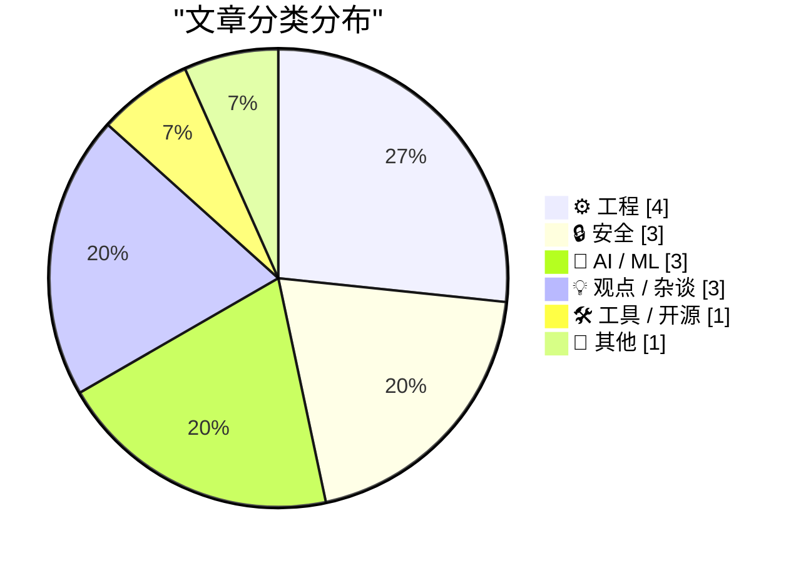
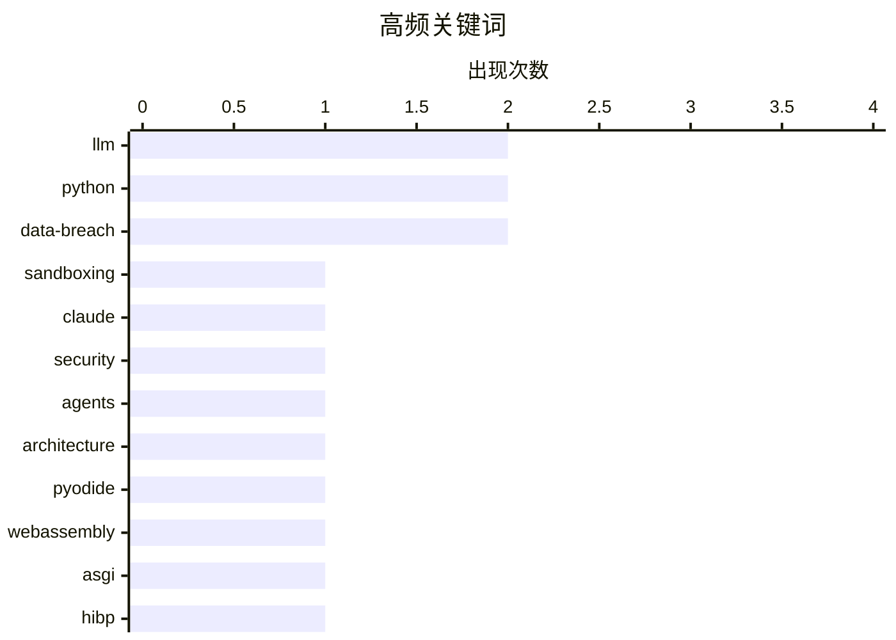

# 📰 Jun 1, 2026

> 来自 Karpathy 推荐的 92 个顶级技术博客，AI 精选 Top 15

## 📝 今日看点

AI 浪潮正从简单的代码辅助转向复杂的智能体范式演进，但在极大地降低实验成本的同时，也引发了开发者对“项目过载”与搜索内容冗余的深度反思。安全领域依然是核心焦点，Anthropic 披露了其多层沙箱防御机制，而全球数据泄露披露的严重滞后则再次敲响了隐私保护的警钟。此外，WebAssembly 与 JAX 等底层技术的突破，正持续拓宽浏览器端应用与高性能计算的边界。

---

## 🏆 今日必读

🥇 **我们如何在不同产品中构建 Claude 的安全沙箱**

[How we contain Claude across products](https://simonwillison.net/2026/May/30/how-we-contain-claude/#atom-everything) — simonwillison.net · 1 天前 · 🔒 安全

> Anthropic 详细披露了其在 Claude.ai、Claude Code 和 Model Context Protocol (MCP) 中采用的多层沙箱安全方案。针对 Web 端，利用 V8 隔离和 Web Workers 限制模型生成的代码执行；在 Claude Code CLI 中，则通过容器化技术（如 Docker 或 gVisor）防止恶意代码访问宿主机系统。文章深入探讨了如何在保证模型功能（如代码执行、文件编辑）的同时，通过最小权限原则和网络隔离来防御潜在的提示注入攻击。作者强调了详尽文档对于建立沙箱信任的重要性，并分享了应对复杂攻击向量的工程实践。

💡 **为什么值得读**: 深入了解顶级 AI 厂商如何平衡大模型代码执行能力与系统安全性，是构建安全 AI 应用的必读指南。

🏷️ sandboxing, Claude, security

🥈 **构建智能体，而非流水线**

[Build agents, not pipelines](https://seangoedecke.com/build-agents-not-pipelines/) — seangoedecke.com · 1 天前 · ⚙️ 工程

> 本文对比了使用大语言模型（LLM）的两种核心范式：确定性管道（Pipelines）与自主智能体（Agents）。管道模式将控制流硬编码在程序中，适合结构化、可预测的任务；而智能体模式则赋予 LLM 工具调用权限，由模型自主决定执行步骤。作者认为，随着模型推理能力的提升，构建智能体能更好地处理模糊需求并降低代码维护成本。文章通过一个简单的“总结并发送邮件”示例，展示了从硬编码逻辑向模型自主决策转变的代码实现差异。

💡 **为什么值得读**: 帮助开发者跳出传统的线性编程思维，理解何时该让 AI 接管程序的控制权以应对复杂逻辑。

🏷️ LLM, agents, architecture

🥉 **通过 Pyodide 和 Service Worker 在浏览器中运行 Python ASGI 应用**

[Running Python ASGI apps in the browser via Pyodide + a service worker](https://simonwillison.net/2026/May/30/pyodide-asgi-browser/#atom-everything) — simonwillison.net · 1 天前 · ⚙️ 工程

> 开发者 Simon Willison 分享了利用 Pyodide 和 WebAssembly 在浏览器中运行完整 Python ASGI 应用的技术演进。通过引入 Service Worker 拦截网络请求，应用可以直接在浏览器端处理 HTTP 流量，而无需后端服务器支持。这种方案解决了 Datasette Lite 早期版本中 Web Worker 通信的局限性，实现了更接近原生 Web 应用的交互体验。该研究展示了如何将原本依赖服务器的 Python Web 框架（如 Datasette）完全迁移到客户端执行。

💡 **为什么值得读**: 探索 WebAssembly 的前沿应用，了解如何在零服务器成本下部署复杂的 Python 数据工具。

🏷️ Python, Pyodide, WebAssembly, ASGI

---

## 📊 数据概览

| 扫描源 | 抓取文章 | 时间范围 | 精选 |
|:---:|:---:|:---:|:---:|
| 82/92 | 2462 篇 → 35 篇 | 48h | **15 篇** |

### 分类分布



### 高频关键词



<details>
<summary>📈 纯文本关键词图（终端友好）</summary>

```
llm          │ ████████████████████ 2
python       │ ████████████████████ 2
data-breach  │ ████████████████████ 2
sandboxing   │ ██████████░░░░░░░░░░ 1
claude       │ ██████████░░░░░░░░░░ 1
security     │ ██████████░░░░░░░░░░ 1
agents       │ ██████████░░░░░░░░░░ 1
architecture │ ██████████░░░░░░░░░░ 1
pyodide      │ ██████████░░░░░░░░░░ 1
webassembly  │ ██████████░░░░░░░░░░ 1
```

</details>

### 🏷️ 话题标签

**llm**(2) · **python**(2) · **data-breach**(2) · sandboxing(1) · claude(1) · security(1) · agents(1) · architecture(1) · pyodide(1) · webassembly(1) · asgi(1) · hibp(1) · privacy-regulation(1) · security-disclosure(1) · coding(1) · side-projects(1) · ai(1) · productivity(1) · burnout(1) · jax(1)

---

## ⚙️ 工程

### 1. 构建智能体，而非流水线

[Build agents, not pipelines](https://seangoedecke.com/build-agents-not-pipelines/) — **seangoedecke.com** · 1 天前 · ⭐ 28/30

> 本文对比了使用大语言模型（LLM）的两种核心范式：确定性管道（Pipelines）与自主智能体（Agents）。管道模式将控制流硬编码在程序中，适合结构化、可预测的任务；而智能体模式则赋予 LLM 工具调用权限，由模型自主决定执行步骤。作者认为，随着模型推理能力的提升，构建智能体能更好地处理模糊需求并降低代码维护成本。文章通过一个简单的“总结并发送邮件”示例，展示了从硬编码逻辑向模型自主决策转变的代码实现差异。

🏷️ LLM, agents, architecture

---

### 2. 通过 Pyodide 和 Service Worker 在浏览器中运行 Python ASGI 应用

[Running Python ASGI apps in the browser via Pyodide + a service worker](https://simonwillison.net/2026/May/30/pyodide-asgi-browser/#atom-everything) — **simonwillison.net** · 1 天前 · ⭐ 27/30

> 开发者 Simon Willison 分享了利用 Pyodide 和 WebAssembly 在浏览器中运行完整 Python ASGI 应用的技术演进。通过引入 Service Worker 拦截网络请求，应用可以直接在浏览器端处理 HTTP 流量，而无需后端服务器支持。这种方案解决了 Datasette Lite 早期版本中 Web Worker 通信的局限性，实现了更接近原生 Web 应用的交互体验。该研究展示了如何将原本依赖服务器的 Python Web 框架（如 Datasette）完全迁移到客户端执行。

🏷️ Python, Pyodide, WebAssembly, ASGI

---

### 3. Intel 8087 浮点芯片内部微代码：寄存器交换

[Microcode inside the Intel 8087 floating-point chip: register exchange](http://www.righto.com/feeds/5917097192784199241/comments/default) — **righto.com** · 1 天前 · ⭐ 22/30

> 硬件考古专家 Ken Shirriff 深入解析了 1980 年代经典的 Intel 8087 浮点协处理器的微代码实现。文章聚焦于寄存器交换（Register Exchange）这一底层操作，揭示了芯片如何通过复杂的微指令序列在有限的硬件资源下实现高效的数学运算。通过对晶体管级电路的逆向工程，作者展示了现代 IEEE 754 浮点标准最初是如何在硅片上落地的。该研究为理解早期高性能计算硬件的设计思路提供了珍贵的细节。

🏷️ Intel 8087, Microcode, Reverse Engineering, CPU Architecture

---

### 4. 请不要破坏链接的原始功能

[Please don't mess with links:](https://maurycyz.com/misc/real_links/) — **maurycyz.com** · 1 天前 · ⭐ 21/30

> 现代 Web 开发中常用 span 标签配合 onclick 事件来模拟链接，但这只是对链接功能的浅薄模仿。真正的 a 标签原生支持 Ctrl+点击在新标签页打开、Shift+点击在新窗口打开、Alt+点击保存文件以及右键复制 URL 等交互。这种“伪链接”破坏了用户的操作预期，降低了网页的可访问性和功能完整性。开发者应当回归语义化 HTML，尊重浏览器内置的链接处理机制，而不是用 JavaScript 去重新发明一个残缺的轮子。

🏷️ HTML, Web Standards, UX, Accessibility

---

## 🔒 安全

### 5. 我们如何在不同产品中构建 Claude 的安全沙箱

[How we contain Claude across products](https://simonwillison.net/2026/May/30/how-we-contain-claude/#atom-everything) — **simonwillison.net** · 1 天前 · ⭐ 28/30

> Anthropic 详细披露了其在 Claude.ai、Claude Code 和 Model Context Protocol (MCP) 中采用的多层沙箱安全方案。针对 Web 端，利用 V8 隔离和 Web Workers 限制模型生成的代码执行；在 Claude Code CLI 中，则通过容器化技术（如 Docker 或 gVisor）防止恶意代码访问宿主机系统。文章深入探讨了如何在保证模型功能（如代码执行、文件编辑）的同时，通过最小权限原则和网络隔离来防御潜在的提示注入攻击。作者强调了详尽文档对于建立沙箱信任的重要性，并分享了应对复杂攻击向量的工程实践。

🏷️ sandboxing, Claude, security

---

### 6. 1000 次数据泄露之后，披露滞后问题比以往任何时候都严重

[1,000 Data Breaches Later, the Disclosure Lag is Worse Than Ever](https://www.troyhunt.com/1000-data-breaches-later-the-disclosure-lag-is-worse-than-ever/) — **troyhunt.com** · 3 小时前 · ⭐ 27/30

> Have I Been Pwned 创始人 Troy Hunt 在录入第 1000 起数据泄露事件之际，指出企业披露数据泄露的滞后问题正日益严重。尽管有 GDPR 等严格的隐私法规，许多组织在发现漏洞后仍倾向于隐瞒数月甚至数年，导致受害者无法及时采取保护措施。文章通过历史数据对比，揭示了合规压力并未能有效缩短“泄露到披露”的时间差。作者反思了在监管加强的今天，为什么公众获取泄露信息的透明度反而没有显著提升。

🏷️ data-breach, HIBP, privacy-regulation, security-disclosure

---

### 7. 每周更新 506 期

[Weekly Update 506](https://www.troyhunt.com/weekly-update-506/) — **troyhunt.com** · 8 小时前 · ⭐ 23/30

> 在第 506 期周报中，Troy Hunt 重点关注了黑客组织 ShinyHunters 近期发起的一系列大规模数据泄露事件，包括备受瞩目的 Ticketmaster 案例。文章分析了这些泄露数据在黑客论坛上的流转过程，以及涉事企业在面对数亿用户信息泄露时迟缓且混乱的应对机制。此外，作者还探讨了现代数据泄露中勒索与公开披露之间日益复杂的博弈关系。周报还涵盖了近期安全工具的更新和行业动态观察。

🏷️ ShinyHunters, data-breach, cybersecurity

---

## 🤖 AI / ML

### 8. 我用 AI 交付的那些“奇怪”项目

[Weird projects I shipped with AI](https://seangoedecke.com/weird-projects-i-shipped-with-ai/) — **seangoedecke.com** · 11 小时前 · ⭐ 25/30

> 针对“AI 既然能写代码，为何没出现应用潮”的质疑，作者分享了多款利用 LLM 快速构建的非典型项目。文章指出，编写代码仅是产品交付的环节之一，AI 的真正价值在于极大地降低了从创意到原型的实验成本。通过展示这些 AI 生成的个性化工具，作者论证了 AI 如何赋能个人开发者在短时间内完成过去需要团队协作的工作。这些项目虽然未必具有商业规模，但证明了 AI 在填补细分需求方面的巨大潜力。

🏷️ LLM, coding, side-projects

---

### 9. 初探 JAX 框架有感

[On first looking into JAX](https://www.gilesthomas.com/2026/05/on-first-looking-into-jax) — **gilesthomas.com** · 1 天前 · ⭐ 23/30

> 作者分享了初次接触 Google JAX 框架的体验，将其比作发现新大陆般的范式转变。JAX 通过结合 NumPy 风格的 API 与 XLA 编译技术，在高性能数值计算和自动微分方面展现出显著优势。文章重点讨论了 JAX 的函数式编程哲学，以及它如何通过 jit、vmap 和 grad 等变换简化复杂的机器学习模型开发。相比 PyTorch，JAX 提供了更纯粹的数学表达方式，适合对性能和灵活性有极致要求的场景。

🏷️ JAX, machine learning, Python, performance

---

### 10. 再次尝试：苹果 AI 核心员工跳槽 OpenAI

[Take Two](https://x.com/markgurman/status/2061236259843182813) — **daringfireball.net** · 11 小时前 · ⭐ 21/30

> 苹果公司负责 2024 年 Siri 重塑演示的关键员工 Kelsey Peterson 已正式入职 OpenAI。这意味着在即将到来的 WWDC 上，苹果将不得不更换新人来主持“下一代 Siri”的第二次发布尝试。此前 2024 年的 Siri 演示被外界视为未能如期发布的失败原型，作者将其讽刺为如同“泰坦尼克二号”的下水仪式需要新主持人。此次人事变动暗示了苹果在 AI 战略执行层面的动荡，以及在追赶生成式 AI 浪潮中的紧迫感。

🏷️ Apple, OpenAI, Siri, Talent

---

## 💡 观点 / 杂谈

### 11. 解决方案可能是取消我的 AI 订阅

[The solution might be cancelling my AI subscription](https://simonwillison.net/2026/May/31/the-solution-might-be-cancelling-my-ai-subscription/#atom-everything) — **simonwillison.net** · 19 小时前 · ⭐ 24/30

> 本文探讨了 AI 编程工具带来的副作用：极低的上手门槛导致开发者陷入“项目过载”的困境。作者引用 David Wilson 的经历指出，原本简单的脚本任务常在 Claude 的辅助下演变成复杂的半成品应用，消耗了大量精力却未解决核心问题。这种现象引发了对 AI 订阅价值的反思，即过度依赖 AI 可能会削弱开发者对项目目标的专注度。文章警示开发者，AI 带来的高产出有时只是“忙碌的假象”，而非真正的生产力提升。

🏷️ AI, productivity, burnout

---

### 12. 自动计票机：软件行业的博彩化转向

[the totalisator](https://computer.rip/2026-05-31-totalisator.html) — **computer.rip** · 1 天前 · ⭐ 20/30

> 软件行业正经历一个不幸的转折，在线博彩和预测市场正成为其核心驱动引擎之一。随着全美范围内体育博彩的合法化，利用算法制定赔率并榨取用户资金的技术已不再局限于离岸岛国，而是成为了主流技术追求。现代电视体育转播与互联网平台深度融合，将博彩包装成大众娱乐。这种趋势反映了技术从创造生产力价值向榨取剩余价值的异化，引发了对行业道德和长期健康发展的深刻担忧。

🏷️ gambling, fintech, industry-trends, prediction-markets

---

### 13. 我将退出技术圈，回归线下生活

[I Am Retiring from Tech to Live Offline](https://simonwillison.net/2026/May/30/retiring-from-tech-to-live-offline/#atom-everything) — **simonwillison.net** · 1 天前 · ⭐ 19/30

> 资深开发者 Chad Whitacre 正式宣布退出技术行业及开源社区，转而追求完全的线下生活。与许多因 AI 威胁而口头宣称辞职的人不同，他采取了实质性行动，甚至通过打字机书写并扫描信件的方式发布了告别信。他将这一过程描述为“远离技术”而非简单的退休，反映了开发者在数字化过度饱和时代对生活本质的重新思考。这一举动在开源社区引发了关于职业倦怠、技术依赖以及开发者生存现状的广泛讨论。

🏷️ career, retirement, culture

---

## 🛠 工具 / 开源

### 14. 一个接一个的 &udm=14

[One &udm After Another](https://feed.tedium.co/link/15204/17351430/google-ai-udm14-reflection) — **tedium.co** · 1 天前 · ⭐ 23/30

> 随着 Google 强制推行 AI 搜索摘要（AI Overviews），用户群体中掀起了使用 &udm=14 参数回归纯净搜索的热潮。该参数能过滤掉 AI 生成内容、广告和冗余的小组件，强制显示传统的网页链接列表。这一现象反映了用户对搜索引擎过度“智能化”的反弹，以及对简洁、直接信息获取方式的渴望。文章探讨了这种技术手段如何成为用户在 AI 时代夺回搜索控制权的临时方案。

🏷️ Google, search engine, SEO, web

---

## 📝 其他

### 15. Meta 为旗下社交平台推出“趣味功能”付费订阅服务

[Meta Is Launching Instagram, Facebook, and WhatsApp Subscriptions for ‘Fun Features’](https://techcrunch.com/2026/05/27/meta-officially-launches-instagram-facebook-and-whatsapp-subscriptions-with-more-to-come-including-ai-plans/) — **daringfireball.net** · 1 天前 · ⭐ 19/30

> Meta 宣布在全球范围内为其核心应用 Instagram、Facebook 和 WhatsApp 推出消费者订阅计划。订阅费用分别为 Instagram Plus 和 Facebook Plus 每月 3.99 美元，WhatsApp Plus 每月 2.99 美元。付费用户将获得专属的“趣味功能”，同时 Meta 也在同步测试针对企业、创作者及 Meta AI 用户的进阶订阅方案。此举标志着 Meta 正在从依赖广告的单一模式，加速向多元化的 C 端订阅收入模式转型，以应对市场环境的变化。

🏷️ Meta, Subscription, Social Media, Business Model

---

*生成于 2026-06-01 11:50 | 扫描 82 源 → 获取 2462 篇 → 精选 15 篇*
*基于 [Hacker News Popularity Contest 2025](https://refactoringenglish.com/tools/hn-popularity/) RSS 源列表，由 [Andrej Karpathy](https://x.com/karpathy) 推荐*
