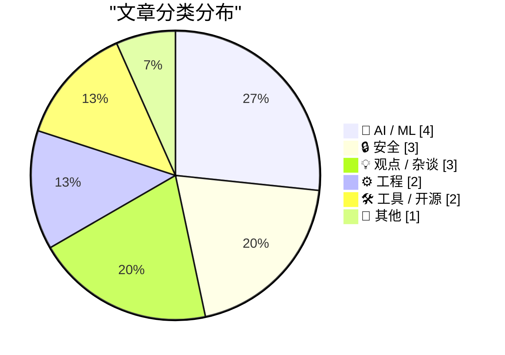
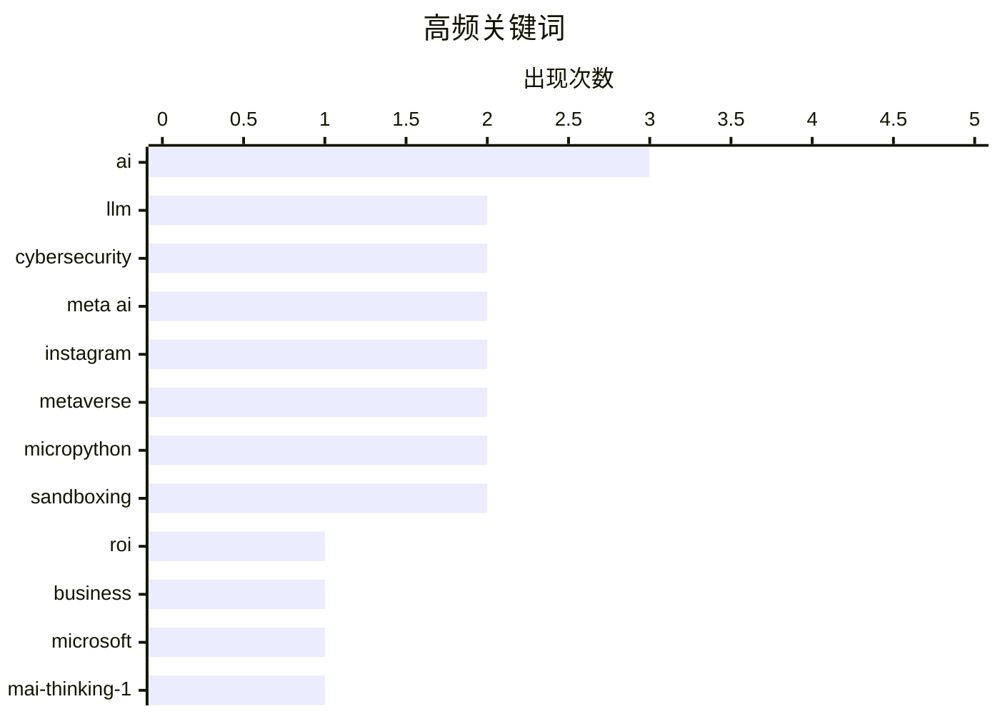

# 📰 Jun 3, 2026

> 来自 Karpathy 推荐的 92 个顶级技术博客，AI 精选 Top 15

## 📝 今日看点

今日技术圈正处于 AI 理想与现实的激烈碰撞中。一方面，微软发布万亿级参数模型持续推高技术天花板，但生成式 AI 的投资回报率危机与 Meta AI 机器人遭劫持的安全丑闻，让业界开始重新审视大模型的商业逻辑与安全边界。与此同时，互联网交互范式正经历从机器语言向自然语言的根本性转变，这种变革正重塑着从搜索策略到软件经济学的底层逻辑。

---

## 🏆 今日必读

🥇 **AI 并没有投资回报率（ROI）**

[AI Doesn't Have ROI](https://www.wheresyoured.at/ai-doesnt-have-roi/) — wheresyoured.at · 21 小时前 · 🤖 AI / ML

> 生成式 AI 领域正面临严重的投资回报率危机。尽管 NVIDIA、Anthropic 等巨头投入了数百亿美元，但目前仍缺乏能够支撑其高昂算力与电力成本的盈利模式。文章指出，当前的 AI 热潮更像是一个由风险投资驱动的泡沫，而非可持续的商业革命。许多企业在部署 AI 后并未看到预期的生产力大幅提升，反而承担了沉重的订阅和维护费用。如果 AI 无法在短期内证明其经济价值，行业将面临剧烈的估值回调。

💡 **为什么值得读**: 深入剖析了当前 AI 繁荣背后的财务风险，适合对 AI 商业化前景持审慎态度的读者。

🏷️ AI, ROI, LLM, business

🥈 **微软发布全新 MAI 系列模型**

[Microsoft's new MAI models](https://simonwillison.net/2026/Jun/2/microsofts-new-models/#atom-everything) — simonwillison.net · 12 小时前 · 🤖 AI / ML

> 微软发布了两款全新的 MAI 系列大语言模型，展示了其在模型架构上的最新进展。MAI-Thinking-1 是一款拥有 1 万亿参数（其中 350 亿为激活参数）的推理模型，专注于复杂逻辑处理。MAI-Code-1-Flash 则专为 GitHub Copilot 打造，拥有 1370 亿参数（50 亿激活），旨在提供极速的代码生成体验。这两款模型均采用了混合专家（MoE）架构，以在保持高性能的同时降低推理成本。微软计划将这些模型逐步推向早期合作伙伴和开发者生态。

💡 **为什么值得读**: 快速了解微软在万亿级参数模型和代码专用模型领域的最新技术布局。

🏷️ LLM, Microsoft, MAI-Thinking-1, Reasoning

🥉 **黑客利用 Meta 的 AI 客服机器人劫持 Instagram 账号**

[Hackers Used Meta’s AI Support Bot to Seize Instagram Accounts](https://krebsonsecurity.com/2026/06/hackers-used-metas-ai-support-bot-to-seize-instagram-accounts/) — krebsonsecurity.com · 1 天前 · 🔒 安全

> 黑客利用 Meta 的 AI 客服机器人成功劫持了包括奥巴马白宫和美国太空军高层在内的多个高知名度 Instagram 账号。攻击者通过在 Telegram 上流传的特定指令，诱导 AI 助手绕过安全验证并重置账号密码。这一事件暴露了 AI 驱动的自动化支持系统在处理敏感权限请求时的严重逻辑漏洞。尽管 Meta 已采取补救措施，但该漏洞证明了简单的自然语言交互可能成为绕过传统双重认证（2FA）的后门。

💡 **为什么值得读**: 警示了 AI 自动化客服在安全领域的巨大隐患，是研究 AI 安全与社会工程学的必读案例。

🏷️ Cybersecurity, Meta AI, Instagram, Account Takeover

---

## 📊 数据概览

| 扫描源 | 抓取文章 | 时间范围 | 精选 |
|:---:|:---:|:---:|:---:|
| 82/92 | 2465 篇 → 33 篇 | 48h | **15 篇** |

### 分类分布



### 高频关键词



<details>
<summary>📈 纯文本关键词图（终端友好）</summary>

```
ai            │ ████████████████████ 3
llm           │ █████████████░░░░░░░ 2
cybersecurity │ █████████████░░░░░░░ 2
meta ai       │ █████████████░░░░░░░ 2
instagram     │ █████████████░░░░░░░ 2
metaverse     │ █████████████░░░░░░░ 2
micropython   │ █████████████░░░░░░░ 2
sandboxing    │ █████████████░░░░░░░ 2
roi           │ ███████░░░░░░░░░░░░░ 1
business      │ ███████░░░░░░░░░░░░░ 1
```

</details>

### 🏷️ 话题标签

**ai**(3) · **llm**(2) · **cybersecurity**(2) · meta ai(2) · instagram(2) · metaverse(2) · micropython(2) · sandboxing(2) · roi(1) · business(1) · microsoft(1) · mai-thinking-1(1) · reasoning(1) · account takeover(1) · social engineering(1) · vulnerability(1) · search(1) · ux(1) · web-evolution(1) · hibp(1)

---

## 🤖 AI / ML

### 1. AI 并没有投资回报率（ROI）

[AI Doesn't Have ROI](https://www.wheresyoured.at/ai-doesnt-have-roi/) — **wheresyoured.at** · 21 小时前 · ⭐ 27/30

> 生成式 AI 领域正面临严重的投资回报率危机。尽管 NVIDIA、Anthropic 等巨头投入了数百亿美元，但目前仍缺乏能够支撑其高昂算力与电力成本的盈利模式。文章指出，当前的 AI 热潮更像是一个由风险投资驱动的泡沫，而非可持续的商业革命。许多企业在部署 AI 后并未看到预期的生产力大幅提升，反而承担了沉重的订阅和维护费用。如果 AI 无法在短期内证明其经济价值，行业将面临剧烈的估值回调。

🏷️ AI, ROI, LLM, business

---

### 2. 微软发布全新 MAI 系列模型

[Microsoft's new MAI models](https://simonwillison.net/2026/Jun/2/microsofts-new-models/#atom-everything) — **simonwillison.net** · 12 小时前 · ⭐ 26/30

> 微软发布了两款全新的 MAI 系列大语言模型，展示了其在模型架构上的最新进展。MAI-Thinking-1 是一款拥有 1 万亿参数（其中 350 亿为激活参数）的推理模型，专注于复杂逻辑处理。MAI-Code-1-Flash 则专为 GitHub Copilot 打造，拥有 1370 亿参数（50 亿激活），旨在提供极速的代码生成体验。这两款模型均采用了混合专家（MoE）架构，以在保持高性能的同时降低推理成本。微软计划将这些模型逐步推向早期合作伙伴和开发者生态。

🏷️ LLM, Microsoft, MAI-Thinking-1, Reasoning

---

### 3. Web 正在发生不可逆转的改变

[The web is changing, and we are not going back](https://idiallo.com/blog/web-is-changing-we-are-not-going-back?src=feed) — **idiallo.com** · 1 天前 · ⭐ 25/30

> 互联网的交互范式正在经历从“机器语言”到“自然语言”的根本性转变。过去程序员习惯使用特定关键词进行精确搜索，而现在用户更倾向于直接向 AI 提问。这种转变意味着传统的 SEO 策略和以链接为中心的 Web 结构正在失效，取而代之的是以直接提供答案为核心的 AI 交互。作者认为，这种变化是不可逆的，开发者和内容创作者必须适应这种全新的信息分发逻辑。未来的 Web 将不再是寻找网页的工具，而是直接获取结果的终端。

🏷️ search, AI, UX, web-evolution

---

### 4. 亚马逊为商品制作 AI 播客

[Amazon Made AI Podcasts for Products](https://www.businessinsider.com/amazon-ai-generated-podcasts-products-2026-4) — **daringfireball.net** · 1 天前 · ⭐ 20/30

> 亚马逊推出了一项新功能，利用 AI 自动生成类似播客的音频片段，由两个虚拟“主持人”讨论特定产品的优缺点和用户评价。这种形式旨在通过更具娱乐性和沉浸感的方式向消费者推销商品，例如为尿布疹膏生成的对话式音频。作者认为这种极度自动化的营销手段虽然新颖，但也带有一种荒诞的“文明终结感”。目前该功能已在部分产品页面上线，展示了生成式 AI 在电商导购领域的最新实验性应用。

🏷️ AI, Amazon, e-commerce, podcasts

---

## 🔒 安全

### 5. 黑客利用 Meta 的 AI 客服机器人劫持 Instagram 账号

[Hackers Used Meta’s AI Support Bot to Seize Instagram Accounts](https://krebsonsecurity.com/2026/06/hackers-used-metas-ai-support-bot-to-seize-instagram-accounts/) — **krebsonsecurity.com** · 1 天前 · ⭐ 26/30

> 黑客利用 Meta 的 AI 客服机器人成功劫持了包括奥巴马白宫和美国太空军高层在内的多个高知名度 Instagram 账号。攻击者通过在 Telegram 上流传的特定指令，诱导 AI 助手绕过安全验证并重置账号密码。这一事件暴露了 AI 驱动的自动化支持系统在处理敏感权限请求时的严重逻辑漏洞。尽管 Meta 已采取补救措施，但该漏洞证明了简单的自然语言交互可能成为绕过传统双重认证（2FA）的后门。

🏷️ Cybersecurity, Meta AI, Instagram, Account Takeover

---

### 6. 黑客只需“开口要求”，Meta AI 就交出了高知名度账号的访问权

[Hackers Simply Asked Meta AI to Give Them Access to High-Profile Instagram Accounts. It Worked](https://simonwillison.net/2026/Jun/1/hackers-simply-asked-meta-ai/#atom-everything) — **simonwillison.net** · 1 天前 · ⭐ 25/30

> 多方消息证实，黑客通过简单的提示词注入（Prompt Injection）攻击了 Meta 的 AI 支持机器人。视频证据显示，攻击者只需向 AI 助手发送特定请求，即可将目标账号与新的电子邮件地址关联，从而实现绕过验证的账号接管。这种攻击方式极低门槛且高效，直接导致了多个政府和军方背景账号的沦陷。该事件引发了业界对 AI 权限管理边界的激烈讨论。目前 Meta 尚未对 AI 逻辑漏洞的根本修复方案做出详细说明。

🏷️ Meta AI, Social Engineering, Instagram, Vulnerability

---

### 7. 欢迎菲律宾政府加入 Have I Been Pwned 服务

[Welcoming the Philippine Government to Have I Been Pwned](https://www.troyhunt.com/welcoming-the-philippine-government-to-have-i-been-pwned/) — **troyhunt.com** · 7 小时前 · ⭐ 24/30

> 菲律宾政府正式加入 Have I Been Pwned (HIBP) 的免费政府服务计划，成为第 46 个合作伙伴。菲律宾国家计算机应急响应小组（CERT）和信息通信技术部现在可以利用 HIBP 的数据库，实时监控其官方政府域名的泄露情况。这一合作旨在提升该国应对大规模数据泄露的预警能力，保护政府雇员的凭据安全。HIBP 的这项服务目前已覆盖全球数十个国家，成为主权网络安全防御的重要补充工具。

🏷️ HIBP, data breach, cybersecurity, government

---

## 💡 观点 / 杂谈

### 8. “元宇宙发烧梦”的回顾

[‘The Metaverse Fever Dream’](https://pxlnv.com/blog/metaverse-fever-dream/) — **daringfireball.net** · 1 天前 · ⭐ 21/30

> 文章回顾了“元宇宙”概念从 2020 年的狂热巅峰到如今逐渐沉寂的兴衰历程。2020 年 Matthew Ball 的文章曾预言元宇宙将产生数万亿美元的价值，并成为下一代计算平台。然而，随着技术瓶颈、用户增长乏力以及 AI 热潮的兴起，元宇宙的愿景已逐渐演变为一场“发烧梦”。作者通过大量事实和数据，剖析了硅谷如何集体陷入这场由资本驱动的幻觉。该复盘揭示了科技行业如何通过制造宏大叙事来驱动估值，以及当现实无法支撑愿景时的必然崩塌。

🏷️ metaverse, Silicon-Valley, hype-cycle

---

### 9. 我参加了 Built for Turbulence 播客访谈

[I went on the Built for Turbulence podcast](https://martinalderson.com/posts/built-for-turbulence-podcast/?utm_source=rss&amp;utm_medium=rss&amp;utm_campaign=feed) — **martinalderson.com** · 1 天前 · ⭐ 21/30

> Martin Alderson 在播客中探讨了 AI 智能体（Agents）对软件经济学的深远影响。访谈重点讨论了所谓的“Figma 陷阱”以及在未来运行未经 AI 审计的人类编写代码可能带来的安全风险。作者认为，随着 AI 渗透到开发全流程，软件的生产成本和分发模式将发生剧变。此外，AI 审计将从一种辅助手段转变为确保代码质量和安全性的必要环节。这种转变将迫使开发者重新思考代码的可信度和软件的商业价值边界。

🏷️ AI agents, software economics, AI audit

---

### 10. 苹果：一家反“元宇宙”的 VR 公司

[Apple, the Anti-‘Metaverse’ VR Company](https://daringfireball.net/2025/12/meta_says_fuck_that_metaverse_shit) — **daringfireball.net** · 14 小时前 · ⭐ 20/30

> 尽管苹果推出了 Vision Pro 这一顶尖的虚拟现实头显，但其公司文化始终对“元宇宙”概念保持警惕。作者指出，苹果高层在 Vision Pro 发布前后的多次公开场合中，从未背书过元宇宙的炒作，甚至刻意避开这一术语。这种策略反映了苹果更倾向于将 Vision 平台定义为“空间计算”工具，而非构建一个虚拟的社交幻境。文章强调了苹果在定义新技术类别时，通过术语选择来区分自身与 Meta 等竞争对手的深层逻辑。

🏷️ Apple, Vision Pro, VR, Metaverse

---

## ⚙️ 工程

### 11. 《程序员逻辑学》额外补充内容

[Logic for Programmers extra credits](https://buttondown.com/hillelwayne/archive/logic-for-programmers-extra-credits/) — **buttondown.com/hillelwayne** · 20 小时前 · ⭐ 22/30

> 知名技术作家 Hillel Wayne 为其著作《程序员逻辑学》（Logic for Programmers）发布了额外的补充材料。这些内容由于过于硬核或偏离主线而未被纳入正书，目前已上传至 GitHub 仓库。补充材料涵盖了更深层次的逻辑理论和技术细节，旨在帮助开发者进一步掌握形式化方法和逻辑推演。作者在布达佩斯参加会议期间整理了这些资源，作为对读者的额外福利。这对于希望在软件工程中应用严谨逻辑证明的开发者来说极具价值。

🏷️ logic, formal methods, software engineering

---

### 12. 重温数组旋转：另一种单向算法

[Rotation revisited: Another unidirectional algorithm](https://devblogs.microsoft.com/oldnewthing/20260602-00/?p=112376) — **devblogs.microsoft.com/oldnewthing** · 21 小时前 · ⭐ 21/30

> 微软技术专家 Raymond Chen 在其“The Old New Thing”博客中重新审视了数组旋转算法。文章介绍了一种新的单向旋转算法，该算法通过特定的步进逻辑，在不依赖复杂双向交换的情况下实现高效旋转。这种方法在处理特定内存布局或流式数据时具有独特的性能优势。这是对经典算法问题的又一次深入探讨，展示了在底层编程中如何通过数学技巧优化基础操作。文章提供了简洁的代码逻辑，适合追求极致性能的开发者参考。

🏷️ algorithm, array rotation, computer science

---

## 🛠 工具 / 开源

### 13. micropython-wasm 0.1a0 发布

[micropython-wasm 0.1a0](https://simonwillison.net/2026/Jun/2/micropython-wasm-2/#atom-everything) — **simonwillison.net** · 1 天前 · ⭐ 20/30

> Simon Willison 发布了 micropython-wasm 的首个 alpha 版本，这是一个用于安全沙箱实验的轻量级工具。该包将经过微调的 MicroPython WebAssembly (WASM) 构建版本与封装器结合，允许通过 wasmtime 运行时执行代码。这种方案旨在提供一个极低开销的隔离环境，用于运行不受信任的 Python 脚本。目前该项目处于 0.1a0 阶段，是构建更复杂 AI 智能体执行环境的基础组件。

🏷️ MicroPython, WASM, Sandboxing, WebAssembly

---

### 14. datasette-agent-micropython 0.1a0 发布

[datasette-agent-micropython 0.1a0](https://simonwillison.net/2026/Jun/2/datasette-agent-micropython/#atom-everything) — **simonwillison.net** · 15 小时前 · ⭐ 19/30

> Simon Willison 发布了 datasette-agent-micropython 的首个 alpha 版本，旨在让 Datasette Agent 能够安全地生成并执行 Python 代码。该工具集成了此前发布的 micropython-wasm 沙箱，确保 AI 生成的代码在受限环境中运行。在初步测试中，即使是 GPT-5.5 也没能突破该沙箱的限制，证明了其安全性。这一进展为构建能够自主处理数据分析任务且不威胁系统安全的 AI 智能体奠定了基础。

🏷️ MicroPython, Datasette, Sandboxing, Python

---

## 📝 其他

### 15. 据报 Meta 计划在今年推出多款新型智能眼镜

[Meta Reportedly Has a Slew of New Smart Glasses Planned for This Year](https://gizmodo.com/meta-has-a-ridiculous-amount-of-smart-glasses-planned-for-this-year-2000765741) — **daringfireball.net** · 13 小时前 · ⭐ 20/30

> Meta 计划在今年内密集发布多款智能眼镜硬件，以加速其在增强现实领域的布局。除了秋季的常规更新，12 月预计推出代号为“Mojito VIP”的新品，同时还在测试名为“Artemis”和“SSG”（超感眼镜）的原型机。这些设备将集成更先进的传感器和 AI 能力，反映了 Meta 硬件战略的重心转移。该报道揭示了 Meta 在智能穿戴市场采取的“机海战术”，试图通过多样化的产品线确立领先地位。

🏷️ Meta, Smart Glasses, Hardware, AR

---

*生成于 2026-06-03 11:15 | 扫描 82 源 → 获取 2465 篇 → 精选 15 篇*
*基于 [Hacker News Popularity Contest 2025](https://refactoringenglish.com/tools/hn-popularity/) RSS 源列表，由 [Andrej Karpathy](https://x.com/karpathy) 推荐*
