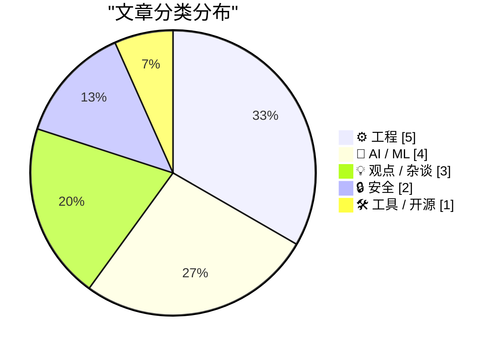
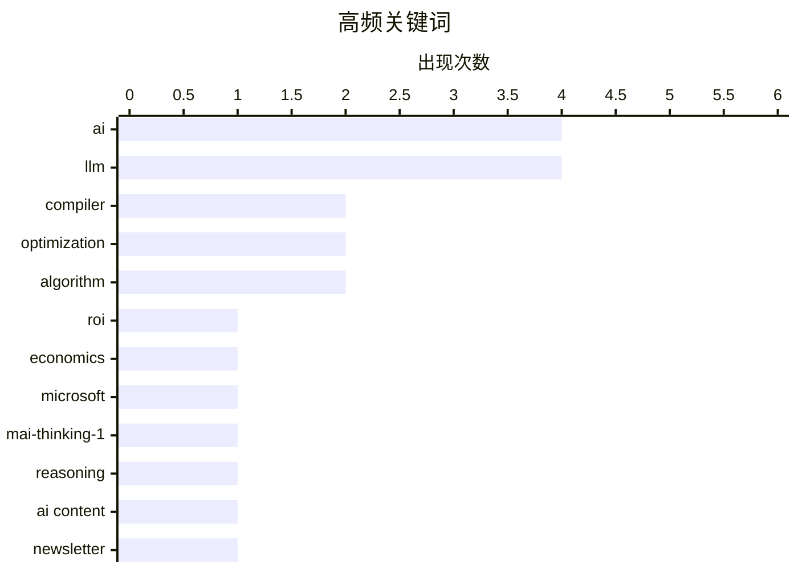

# 📰 Jun 4, 2026

> 来自 Karpathy 推荐的 92 个顶级技术博客，AI 精选 Top 15

## 📝 今日看点

今日技术圈的核心议题聚焦于生成式 AI 的“退烧”与底层技术的持续演进。随着企业端 ROI 难达预期、Uber 因成本超支限制 AI 使用，业界正经历一场关于 AI 经济性与内容信任度的深刻反思。与此同时，微软 MAI 系列模型的发布以及编译器优化算法的深度探讨，显示出技术领域正从盲目扩张转向对模型效能与底层性能的硬核钻研。

---

## 🏆 今日必读

🥇 **AI 并没有投资回报率（ROI）**

[AI Doesn't Have ROI](https://www.wheresyoured.at/ai-doesnt-have-roi/) — wheresyoured.at · 1 天前 · 🤖 AI / ML

> 生成式人工智能（GenAI）正面临严峻的经济性挑战。尽管 NVIDIA、Anthropic 等巨头投入了数百亿美元用于算力和能源建设，但企业端尚未看到与之匹配的生产力飞跃或收入增长。文章指出，当前的 AI 热潮更像是一场资本泡沫，高昂的推理成本和维护费用使得大多数 AI 应用在商业上难以持续。作者认为，如果 AI 无法在短期内证明其明确的经济效益，行业将面临严重的估值回调。这种资本错配可能导致类似于互联网泡沫破裂的后果。

💡 **为什么值得读**: 深入剖析 AI 泡沫背后的经济逻辑，为盲目追逐 AI 热潮的投资者和决策者提供了冷静的警示。

🏷️ AI, ROI, Economics, LLM

🥈 **微软发布全新 MAI 系列模型**

[Microsoft's new MAI models](https://simonwillison.net/2026/Jun/2/microsofts-new-models/#atom-everything) — simonwillison.net · 1 天前 · 🤖 AI / ML

> 微软推出了两款全新的 MAI 系列大语言模型：MAI-Thinking-1 和 MAI-Code-1-Flash。MAI-Thinking-1 是一款拥有 1 万亿参数（其中 350 亿为活跃参数）的推理模型，旨在挑战 OpenAI 的 o1 系列，专注于复杂逻辑推理。MAI-Code-1-Flash 则拥有 1370 亿参数（50 亿活跃参数），专为 GitHub Copilot 的代码补全和快速响应场景优化。这两款模型均采用了混合专家（MoE）架构，力求在保持高性能的同时显著降低推理成本。

💡 **为什么值得读**: 快速了解微软在自研模型层面的最新布局，特别是其在推理和编程效率上的针对性突破。

🏷️ Microsoft, LLM, MAI-Thinking-1, Reasoning

🥉 **既然你的邮件订阅是 AI 生成的，那我退订了**

[Now that your newsletter is AI-generated, I've Unsubscribed](https://idiallo.com/blog/unsubscribed-from-ai-generated-newsletters?src=feed) — idiallo.com · 12 小时前 · 🤖 AI / ML

> 内容创作者在 Newsletter 中过度使用 AI 生成内容正引发读者的信任危机。作者分享了取消订阅多个关注长达 20 年的 Newsletter 的经历，原因是这些创作者开始秘密使用 AI 撰写内容，破坏了建立在“人与人连接”基础上的长期信任。AI 生成的配图和同质化的文字让内容失去了独特的灵魂、深度和个人见解。文章警告，将创作者本人从创作过程中剔除，最终会导致受众的流失和个人品牌的崩塌。真正的价值在于人类的思考，而非机器的堆砌。

💡 **为什么值得读**: 探讨 AI 时代内容创作的伦理与价值，提醒创作者不要因追求效率而牺牲与读者的真实连接。

🏷️ AI content, newsletter, LLM, user experience

---

## 📊 数据概览

| 扫描源 | 抓取文章 | 时间范围 | 精选 |
|:---:|:---:|:---:|:---:|
| 84/92 | 2495 篇 → 36 篇 | 48h | **15 篇** |

### 分类分布



### 高频关键词



<details>
<summary>📈 纯文本关键词图（终端友好）</summary>

```
ai             │ ████████████████████ 4
llm            │ ████████████████████ 4
compiler       │ ██████████░░░░░░░░░░ 2
optimization   │ ██████████░░░░░░░░░░ 2
algorithm      │ ██████████░░░░░░░░░░ 2
roi            │ █████░░░░░░░░░░░░░░░ 1
economics      │ █████░░░░░░░░░░░░░░░ 1
microsoft      │ █████░░░░░░░░░░░░░░░ 1
mai-thinking-1 │ █████░░░░░░░░░░░░░░░ 1
reasoning      │ █████░░░░░░░░░░░░░░░ 1
```

</details>

### 🏷️ 话题标签

**ai**(4) · **llm**(4) · **compiler**(2) · optimization(2) · algorithm(2) · roi(1) · economics(1) · microsoft(1) · mai-thinking-1(1) · reasoning(1) · ai content(1) · newsletter(1) · user experience(1) · tech criticism(1) · monopoly(1) · digital rights(1) · gcc(1) · c++(1) · data structures(1) · datacenter(1)

---

## ⚙️ 工程

### 1. 再谈旋转：关于 GCC 单向旋转算法的惊人发现

[Rotation revisited: A shocking discovery about gcc’s unidirectional rotation algorithm](https://devblogs.microsoft.com/oldnewthing/20260603-00/?p=112378) — **devblogs.microsoft.com/oldnewthing** · 20 小时前 · ⭐ 24/30

> Raymond Chen 深入探讨了 GCC 编译器中 `std::rotate` 算法的单向旋转实现。文章揭示了该算法在处理非随机访问迭代器时的独特行为，以及 GCC 如何通过特定的逻辑优化来减少元素移动次数。通过对源码的剖析，作者展示了一个看似简单的旋转操作在底层实现中隐藏的复杂性。这种单向算法在特定内存布局下比传统的三反转（Triple-reverse）算法更具优势。这对于理解编译器如何处理底层内存操作具有重要参考价值。

🏷️ GCC, Compiler, Optimization, Algorithm

---

### 2. 再谈旋转：另一种单向算法

[Rotation revisited: Another unidirectional algorithm](https://devblogs.microsoft.com/oldnewthing/20260602-00/?p=112376) — **devblogs.microsoft.com/oldnewthing** · 1 天前 · ⭐ 24/30

> 本文延续了对旋转算法的讨论，介绍了另一种不依赖双向迭代器的单向旋转实现方案。该算法通过不同的路径规划实现元素的位移，旨在优化特定链式结构或流式数据的处理效率。作者对比了不同单向旋转逻辑在空间复杂度和元素交换次数上的差异。这为在受限硬件环境或特定数据结构下实现高效内存操作提供了新的思路。文章强调了在不同约束条件下选择最优算法的重要性。

🏷️ Algorithm, C++, Data Structures

---

### 3. 函数内联启发式策略综述

[A survey of inlining heuristics](https://bernsteinbear.com/blog/inlining-heuristics/?utm_source=rss) — **bernsteinbear.com** · 1 天前 · ⭐ 23/30

> 本文系统地综述了编译器中的函数内联（Inlining）启发式策略。内联是提升现代编程语言（尤其是像 Ruby 这样频繁调用方法的动态语言）性能的关键手段，因为它能消除方法分发的开销并扩大优化范围。文章探讨了即时编译器（JIT）在运行时如何根据函数大小、调用频率和系统状态决定是否进行内联。作者分析了多种主流编译器的实现方案，揭示了在代码体积膨胀与执行速度提升之间寻找平衡的复杂逻辑。这对于理解现代虚拟机的性能瓶颈至关重要。

🏷️ compiler, JIT, optimization, inlining

---

### 4. 《程序员逻辑学》额外补充资料发布

[Logic for Programmers extra credits](https://buttondown.com/hillelwayne/archive/logic-for-programmers-extra-credits/) — **buttondown.com/hillelwayne** · 1 天前 · ⭐ 22/30

> 技术作家 Hillel Wayne 为其著作《程序员逻辑学》（Logic for Programmers）发布了一系列补充学习材料。这些内容涵盖了因技术深度过高或主题偏离主线而未被纳入原书的进阶逻辑话题。目前这些补充章节已上传至 GitHub 仓库，供读者免费查阅。资料旨在为希望在形式化方法、逻辑证明和编程理论结合领域深挖的开发者提供额外指引。

🏷️ Logic, Formal Methods, Programming

---

### 5. 天真地对交错级数求和的数值陷阱

[Naively summing an alternating series](https://www.johndcook.com/blog/2026/06/03/naive-sum/) — **johndcook.com** · 18 小时前 · ⭐ 21/30

> 在编写指数函数等幂级数计算代码时，直接进行项的累加往往会导致严重的数值精度问题。即使设置了 10^-12 这样看似严谨的容差，由于浮点数在处理正负交替的大数值项时会产生舍入误差，最终结果可能完全失真。文章通过具体的数学示例展示了这种“天真求和法”的局限性。作者借此提醒开发者，在实现数学算法时必须考虑数值稳定性和计算机算术的特性。

🏷️ Numerical Analysis, Floating Point, Mathematics

---

## 🤖 AI / ML

### 6. AI 并没有投资回报率（ROI）

[AI Doesn't Have ROI](https://www.wheresyoured.at/ai-doesnt-have-roi/) — **wheresyoured.at** · 1 天前 · ⭐ 27/30

> 生成式人工智能（GenAI）正面临严峻的经济性挑战。尽管 NVIDIA、Anthropic 等巨头投入了数百亿美元用于算力和能源建设，但企业端尚未看到与之匹配的生产力飞跃或收入增长。文章指出，当前的 AI 热潮更像是一场资本泡沫，高昂的推理成本和维护费用使得大多数 AI 应用在商业上难以持续。作者认为，如果 AI 无法在短期内证明其明确的经济效益，行业将面临严重的估值回调。这种资本错配可能导致类似于互联网泡沫破裂的后果。

🏷️ AI, ROI, Economics, LLM

---

### 7. 微软发布全新 MAI 系列模型

[Microsoft's new MAI models](https://simonwillison.net/2026/Jun/2/microsofts-new-models/#atom-everything) — **simonwillison.net** · 1 天前 · ⭐ 25/30

> 微软推出了两款全新的 MAI 系列大语言模型：MAI-Thinking-1 和 MAI-Code-1-Flash。MAI-Thinking-1 是一款拥有 1 万亿参数（其中 350 亿为活跃参数）的推理模型，旨在挑战 OpenAI 的 o1 系列，专注于复杂逻辑推理。MAI-Code-1-Flash 则拥有 1370 亿参数（50 亿活跃参数），专为 GitHub Copilot 的代码补全和快速响应场景优化。这两款模型均采用了混合专家（MoE）架构，力求在保持高性能的同时显著降低推理成本。

🏷️ Microsoft, LLM, MAI-Thinking-1, Reasoning

---

### 8. 既然你的邮件订阅是 AI 生成的，那我退订了

[Now that your newsletter is AI-generated, I've Unsubscribed](https://idiallo.com/blog/unsubscribed-from-ai-generated-newsletters?src=feed) — **idiallo.com** · 12 小时前 · ⭐ 24/30

> 内容创作者在 Newsletter 中过度使用 AI 生成内容正引发读者的信任危机。作者分享了取消订阅多个关注长达 20 年的 Newsletter 的经历，原因是这些创作者开始秘密使用 AI 撰写内容，破坏了建立在“人与人连接”基础上的长期信任。AI 生成的配图和同质化的文字让内容失去了独特的灵魂、深度和个人见解。文章警告，将创作者本人从创作过程中剔除，最终会导致受众的流失和个人品牌的崩塌。真正的价值在于人类的思考，而非机器的堆砌。

🏷️ AI content, newsletter, LLM, user experience

---

### 9. Uber 为控制成本限制 Claude Code 等 AI 工具的使用

[Uber Caps Usage of AI Tools Like Claude Code to Manage Costs](https://simonwillison.net/2026/Jun/3/uber-caps-usage/#atom-everything) — **simonwillison.net** · 22 小时前 · ⭐ 23/30

> Uber 最近对其内部使用的 AI 工具（如 Claude Code）实施了使用限制，以遏制失控的成本。由于在 2026 年的前四个月就耗尽了全年的 AI 预算，Uber 不得不采取配额制。这一现象反映了企业在 2025 年制定预算时严重低估了开发者对高性能 AI 编码助手的需求和消耗速度。文章指出，随着 AI 工具深度集成到工作流中，如何平衡生产力提升与高昂的 API 调用费用已成为企业面临的紧迫问题。这标志着企业 AI 应用进入了“精细化运营”阶段。

🏷️ AI costs, Claude Code, Uber, LLM

---

## 💡 观点 / 杂谈

### 10. Pluralistic：幻觉即服务

[Pluralistic: Delusion as a service (04 Jun 2026)](https://pluralistic.net/2026/06/03/mission-space/) — **pluralistic.net** · 3 小时前 · ⭐ 24/30

> Cory Doctorow 在本文中抨击了科技行业中“幻觉即服务”的乱象，重点讨论了破坏性诊断和数字版权管理（DRM）对消费者权益的侵害。文章涵盖了从亚马逊的大规模仲裁规避到驱动程序拥有的 Uber 替代方案等多个社会技术议题。作者指出，当前的科技生态系统正通过技术手段剥夺用户的自主权，并将其包装成“进步”。通过一系列案例，文章揭示了垄断企业如何利用法律和技术漏洞来维持其统治地位。这种系统性的“幻觉”正在损害互联网的开放性。

🏷️ tech criticism, monopoly, AI, digital rights

---

### 11. 数据中心主权真的那么重要吗？

[Is datacentre sovereignty really that important?](https://martinalderson.com/posts/is-datacentre-sovereignty-really-that-important/?utm_source=rss&amp;utm_medium=rss&amp;utm_campaign=feed) — **martinalderson.com** · 10 小时前 · ⭐ 24/30

> 英国政府目前正热衷于在国内建设 AI 数据中心以追求“主权”，但文章指出这一目标可能基于错误的假设。通过分析发现，支持主权论的几个核心理由——延迟、税收和控制权——在实际操作中大多站不住脚。对于大多数 AI 推理任务，跨国延迟的影响微乎其微，而税收优惠往往被高昂的建设成本抵消。作者认为，过度强调物理位置的主权可能是一种误导，真正的控制权应体现在软件栈和数据治理上。盲目建设本地基础设施可能导致资源浪费。

🏷️ datacenter, AI, cloud infrastructure, sovereignty

---

### 12. 反 AI 怀旧主义与过去崇拜

[Anti-AI nostalgia and the cult of the past](https://seangoedecke.com/anti-ai-nostalgia/) — **seangoedecke.com** · 10 小时前 · ⭐ 23/30

> 针对当前编程界盛行的“反 AI 怀旧主义”，作者提出了反思。许多资深开发者怀念那个没有 AI、程序员纯粹靠手艺和热情的时代，认为 LLM 正在摧毁编程的灵魂。然而，文章指出这种对过去的崇拜往往带有主观滤镜，忽略了旧时代编程的低效与痛苦。作者认为 AI 只是工具演进的一环，不应将其视为对“黑客精神”的亵渎，而应关注其如何释放人类的创造力。拥抱新技术并不意味着背叛过去，而是为了更好地解决未来的问题。

🏷️ AI, Programming Culture, Nostalgia, Software Craftsmanship

---

## 🔒 安全

### 13. 菲律宾政府正式加入 Have I Been Pwned 免费政府服务

[Welcoming the Philippine Government to Have I Been Pwned](https://www.troyhunt.com/welcoming-the-philippine-government-to-have-i-been-pwned/) — **troyhunt.com** · 1 天前 · ⭐ 23/30

> 菲律宾成为全球第 46 个加入 Have I Been Pwned (HIBP) 免费政府服务的国家。菲律宾国家计算机应急响应小组（National CERT）与信息和通信技术部合作，现在可以监控其官方政府域名的泄露情况。该服务允许政府机构在发现公职人员凭据出现在已知数据泄露事件中时，第一时间获得通知并采取行动。这一合作标志着 HIBP 在协助主权国家提升网络安全防御能力方面取得了新进展。

🏷️ HIBP, cybersecurity, data breach, government

---

### 14. 拆解 Meta 智能眼镜录制指示灯的地下市场

[The Underworld Market to Remove the Recording Indicator Light on Meta Glasses](https://www.youtube.com/watch?v=EaJSPeJmqis) — **daringfireball.net** · 14 小时前 · ⭐ 22/30

> Facebook Marketplace 上正兴起一种针对 Ray-Ban Meta 智能眼镜的“隐身模式”改装服务，收费约 100 美元。该服务通过物理手段或技术手段禁用拍摄时的 LED 指示灯，将智能眼镜转变为隐蔽的偷拍工具。调查显示，尽管 Meta 在设计上加入了隐私保护灯，但地下市场通过改装轻易绕过了这一限制。这引发了关于可穿戴设备隐私合规性、法律责任以及硬件安全设计的深度讨论。

🏷️ smart glasses, privacy, hardware mod, Meta

---

## 🛠 工具 / 开源

### 15. micropython-wasm 0.1a1 版本发布

[micropython-wasm 0.1a1](https://simonwillison.net/2026/Jun/2/micropython-wasm/#atom-everything) — **simonwillison.net** · 1 天前 · ⭐ 21/30

> Simon Willison 发布了 micropython-wasm 的 0.1a1 预览版。该版本重点修复了在构建 datasette-agent-micropython 过程中发现的若干功能限制。该项目致力于将 MicroPython 编译为 WebAssembly，以便在浏览器或受限的沙箱环境中高效运行 Python 代码。此次更新提升了其在复杂代理（Agent）场景下的稳定性和集成能力。

🏷️ MicroPython, WASM, WebAssembly, Python

---

*生成于 2026-06-04 10:08 | 扫描 84 源 → 获取 2495 篇 → 精选 15 篇*
*基于 [Hacker News Popularity Contest 2025](https://refactoringenglish.com/tools/hn-popularity/) RSS 源列表，由 [Andrej Karpathy](https://x.com/karpathy) 推荐*
