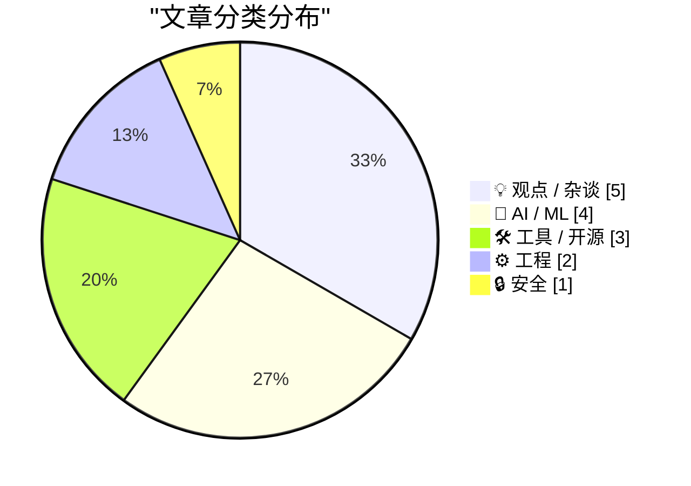
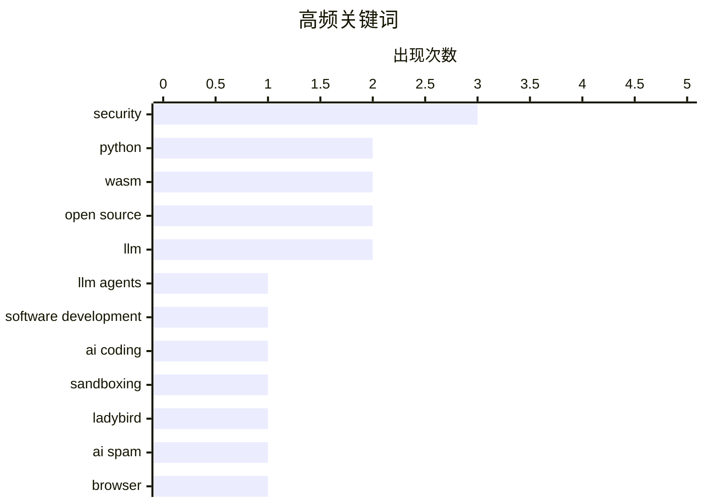

# 📰 Jun 7, 2026

> 来自 Karpathy 推荐的 92 个顶级技术博客，AI 精选 Top 15

## 📝 今日看点

AI 浪潮正深度重塑开发生态，LLM Agent 在加速项目落地的同时，也因生成式代码泛滥引发了开源社区对贡献质量的集体反思与抵制。与此同时，WebAssembly 与沙箱机制成为保障跨平台代码安全运行的关键路径，相关工具链正加速迭代。在硬核工程领域，开发者正通过 JAX 迁移与存储优化，在 AI 泡沫的争议声中持续探索高性能基础设施的边界。

---

## 🏆 今日必读

🥇 **关于使用 LLM Agent 开启新项目的思考**

[Thoughts on starting new projects with LLM agents](https://eli.thegreenplace.net/2026/thoughts-on-starting-new-projects-with-llm-agents/) — eli.thegreenplace.net · 8 小时前 · 🤖 AI / ML

> 探讨了在全新项目（Greenfield）中使用 LLM Agent 的实践体验，这是作者继成功重构 pycparser 后的进一步尝试。LLM 在生成样板代码和初始架构方面表现出色，能显著缩短从零到一的开发周期。然而，过度依赖 Agent 可能导致开发者忽视底层逻辑，产生难以维护的“黑盒”代码。作者强调，开发者必须保持对项目全局设计的掌控，将 LLM 视为提高生产力的杠杆而非完全替代思考的工具。在实际操作中，明确的指令和分步骤的引导是确保 AI 输出质量的关键。

💡 **为什么值得读**: 提供了从“重构旧项目”转向“构建新项目”的实战视角，警示了 LLM 辅助开发中潜在的架构风险。

🏷️ LLM agents, software development, AI coding, Python

🥈 **使用 MicroPython 和 WASM 在沙箱中运行 Python 代码**

[Running Python code in a sandbox with MicroPython and WASM](https://simonwillison.net/2026/Jun/6/micropython-in-a-sandbox/#atom-everything) — simonwillison.net · 1 天前 · ⚙️ 工程

> 介绍了作者开发的 alpha 版本工具包 micropython-wasm，旨在解决在受限环境中安全运行 Python 代码的难题。该方案利用 WebAssembly (WASM) 的隔离特性，结合轻量级的 MicroPython 解释器，构建了一个高性能的执行沙箱。目前该技术已应用于 Datasette Agent 的插件中，支持在浏览器或服务器端安全地处理不可信代码。相比传统的容器化方案，这种方式启动速度更快且资源占用极低。作者通过这种组合，实现了对代码执行权限的精细化控制。

💡 **为什么值得读**: 探索了 WASM 与 MicroPython 结合的前沿应用，是实现轻量级代码沙箱的一种极具启发性的技术路径。

🏷️ Python, WASM, sandboxing, security

🥉 **引用 Andreas Kling：Ladybird 浏览器停止接收公开 PR**

[Quoting Andreas Kling](https://simonwillison.net/2026/Jun/5/andreas-kling/#atom-everything) — simonwillison.net · 1 天前 · ⚙️ 工程

> 记录了 Ladybird 浏览器创始人 Andreas Kling 宣布停止接收公开 Pull Request 的重大决策。核心原因在于 AI 生成代码的泛滥打破了“提交代码量等同于投入精力”的传统假设，导致维护者难以通过补丁规模判断贡献者的诚意。随着 Ladybird 转向面向真实用户的浏览器，团队强调代码的责任归属比编写方式更重要。这一转变反映了开源项目在 AI 时代面临的维护压力与信任危机。未来该项目将转向更受控的协作模式，以确保代码库的长期可维护性。

💡 **为什么值得读**: 揭示了 AI 生成内容对传统开源协作模式的冲击，引发对软件质量责任制和社区治理的深度思考。

🏷️ Open Source, Ladybird, AI spam, browser

---

## 📊 数据概览

| 扫描源 | 抓取文章 | 时间范围 | 精选 |
|:---:|:---:|:---:|:---:|
| 80/92 | 2423 篇 → 30 篇 | 48h | **15 篇** |

### 分类分布



### 高频关键词



<details>
<summary>📈 纯文本关键词图（终端友好）</summary>

```
security             │ ████████████████████ 3
python               │ █████████████░░░░░░░ 2
wasm                 │ █████████████░░░░░░░ 2
open source          │ █████████████░░░░░░░ 2
llm                  │ █████████████░░░░░░░ 2
llm agents           │ ███████░░░░░░░░░░░░░ 1
software development │ ███████░░░░░░░░░░░░░ 1
ai coding            │ ███████░░░░░░░░░░░░░ 1
sandboxing           │ ███████░░░░░░░░░░░░░ 1
ladybird             │ ███████░░░░░░░░░░░░░ 1
```

</details>

### 🏷️ 话题标签

**security**(3) · **python**(2) · **wasm**(2) · open source(2) · llm(2) · llm agents(1) · software development(1) · ai coding(1) · sandboxing(1) · ladybird(1) · ai spam(1) · browser(1) · pull request(1) · career(1) · ai-generated(1) · jax(1) · pytorch(1) · backend(1) · package manager(1) · supply chain(1)

---

## 💡 观点 / 杂谈

### 1. 为什么会有这么多 PR？

[Why all the PRs?](https://idiallo.com/blog/why-all-the-prs) — **idiallo.com** · 1 天前 · ⭐ 23/30

> 分析了开源社区近期涌现大量 AI 生成 PR 的深层动机，认为这本质上是求职市场的一种“信号”博弈。由于招聘方普遍要求候选人通过 GitHub 贡献来证明能力，导致开发者倾向于利用 AI 快速刷取提交记录以美化简历。这种行为虽然增加了活跃度指标，却严重稀释了开源贡献的真实价值，使维护者陷入处理低质量代码的泥潭。作者指出，当“展示作品”变成一种纯粹的求职手段时，其作为技能证明的效力正在迅速瓦解。这种激励错位正在破坏开源生态的健康发展。

🏷️ Open Source, Pull Request, Career, AI-generated

---

### 2. 尊享版：AI 泡沫黑粉指南 3.0

[Premium: The Hater's Guide To The AI Bubble 3.0](https://www.wheresyoured.at/premium-the-haters-guide-to-the-ai-bubble-3-0/) — **wheresyoured.at** · 1 天前 · ⭐ 23/30

> 这是作者关于 AI 泡沫系列评论的第三篇，延续了对当前 AI 热潮的尖锐批判。文章指出 AI 产业的估值与实际产出的商业价值之间存在严重脱节，并深入探讨了“AI 垃圾内容（Slop）”对互联网生态的破坏。作者分析了科技巨头在 AI 投入上的不可持续性，认为当前的增长模式更像是一种由资本驱动的幻象而非技术革命。通过对市场指标和用户反馈的观察，预警了 AI 泡沫可能面临的破裂风险。文章呼吁回归技术本质，关注 AI 真正能解决的问题而非营销噱头。

🏷️ AI bubble, industry critique, generative AI

---

### 3. “不”之社区：基于抵制的身份认同

[Communities of Not](https://lucumr.pocoo.org/2026/6/6/communities-of-not/) — **lucumr.pocoo.org** · 1 天前 · ⭐ 22/30

> 探讨了一种特殊的社会现象：围绕“拒绝某事”而形成的社区，如丁克群体、反汽车运动以及当前的“LLM 怀疑论”开发者社区。作者指出，这类社区往往通过对立面来构建身份认同，虽然初衷可能是追求自主或代码质量，但容易陷入被所抵制的对象定义自身的怪圈。文章分析了这种“负向认同”如何影响社区的长期演化，以及它在技术圈（特别是针对 AI 生成内容）中的具体表现。最终提醒读者，过度关注抵制对象可能会掩盖社区原本追求的积极价值。这种心理机制在技术选型和社区文化建设中具有深远影响。

🏷️ Community, LLM, Identity

---

### 4. Pluralistic：批判“万能机器”

[Pluralistic: Criticizing the everything machine (06 Jun 2026)](https://pluralistic.net/2026/06/06/applied-counterescatology/) — **pluralistic.net** · 15 小时前 · ⭐ 21/30

> Cory Doctorow 在本文中深入批判了所谓的“万能机器”概念，探讨了通用计算设备在版权保护（DRM）与用户自由之间的冲突。文章分析了英国议会关于 DRM 的辩论，指出过度限制技术会导致用户丧失对硬件的所有权。作者通过奢侈品防伪和“焦耳偷窃器”（Joule thief）等案例，揭示了技术锁定如何损害消费者利益。核心观点认为，我们不应为了保护过时的商业模式而阉割通用计算机的潜力。这种技术限制不仅阻碍了创新，还削弱了用户对数字资产的实际控制权。

🏷️ Tech Criticism, Monopoly, AI Ethics

---

### 5. Pluralistic：重塑人性

[Pluralistic: Refining humanity (05 Jun 2026)](https://pluralistic.net/2026/06/05/defining-humanity/) — **pluralistic.net** · 1 天前 · ⭐ 21/30

> 本文探讨了技术如何作为一面镜子，定义并折射出人类的本质。作者通过 GNU Radio 的开源实践与法国政府对社交媒体的监管博弈，对比了开放技术与封闭平台对社会结构的不同影响。文章尖锐地批评了资本主义体系中“不公正的裁判”现象，即监管机构往往偏袒大型科技巨头而非公众利益。作者呼吁通过重申人类在技术开发中的主体地位，来抵制技术对人性的异化和剥削。最终观点是，技术的本质应当是增强人类的能力，而非成为奴役和监控的工具。

🏷️ Humanity, Technology, Philosophy

---

## 🤖 AI / ML

### 6. 关于使用 LLM Agent 开启新项目的思考

[Thoughts on starting new projects with LLM agents](https://eli.thegreenplace.net/2026/thoughts-on-starting-new-projects-with-llm-agents/) — **eli.thegreenplace.net** · 8 小时前 · ⭐ 26/30

> 探讨了在全新项目（Greenfield）中使用 LLM Agent 的实践体验，这是作者继成功重构 pycparser 后的进一步尝试。LLM 在生成样板代码和初始架构方面表现出色，能显著缩短从零到一的开发周期。然而，过度依赖 Agent 可能导致开发者忽视底层逻辑，产生难以维护的“黑盒”代码。作者强调，开发者必须保持对项目全局设计的掌控，将 LLM 视为提高生产力的杠杆而非完全替代思考的工具。在实际操作中，明确的指令和分步骤的引导是确保 AI 输出质量的关键。

🏷️ LLM agents, software development, AI coding, Python

---

### 7. JAX 后端与设备管理

[JAX backends and devices](https://www.gilesthomas.com/2026/06/jax-backends-and-devices) — **gilesthomas.com** · 1 天前 · ⭐ 23/30

> 记录了将 PyTorch 编写的 LLM 代码迁移至 JAX 框架的实战经验，重点讨论了后端与设备的交互机制。作者在处理包含 102 亿个 16 位整数（约 19GiB）的 fineweb-gpt2-tokens 数据集时，详细解析了 JAX 如何识别和管理 CPU、GPU 及 TPU 等硬件资源。文章深入探讨了 JAX 的设备抽象层，以及在加载大规模数据集时如何优化内存分配。通过对比 PyTorch 的显式设备管理，展示了 JAX 在分布式计算和异构后端支持上的独特设计。这对于理解 JAX 如何在底层调度计算资源具有重要参考价值。

🏷️ JAX, LLM, PyTorch, backend

---

### 8. OpenAI 帮助中心：锁定模式（Lockdown Mode）

[OpenAI Help: Lockdown Mode](https://simonwillison.net/2026/Jun/5/openai-help-lockdown-mode/#atom-everything) — **simonwillison.net** · 1 天前 · ⭐ 21/30

> OpenAI 正式上线了“锁定模式”（Lockdown Mode），旨在防止 ChatGPT 账户发生敏感数据外泄。该功能目前已向 Free、Plus、Pro 以及 ChatGPT Business 等个人和自助服务账户开放。锁定模式通过限制高风险操作和加强身份验证，为处理敏感信息的环境提供额外的安全屏障。这是 OpenAI 在今年 2 月预告后的正式落地，标志着其在用户隐私保护和企业级安全功能上的进一步完善。用户可以在账户设置中开启此模式，以应对潜在的账户劫持或恶意数据导出风险。

🏷️ OpenAI, ChatGPT, security, lockdown

---

### 9. 审视 Perplexity 的现状

[Checking in on Perplexity](https://daringfireball.net/linked/2025/08/05/regarding-those-rumors-of-apple-pursuing-an-acquisition-of-perplexity) — **daringfireball.net** · 1 天前 · ⭐ 21/30

> 科技评论家 John Gruber 重新审视了 AI 搜索公司 Perplexity 的现状，并对其被苹果收购的传闻表示怀疑。作者指出，此类传闻更像是 Perplexity 为了提升估值而自导自演，而非苹果高层的真实意图。Perplexity 近期频繁陷入版权争议等负面新闻，在 AI 竞争格局中已逐渐滑向“被边缘化”的梯队。文章认为，苹果更倾向于自主研发或与顶级大厂合作，而非收购一家深陷舆论泥潭且缺乏核心护城河的初创公司。最终结论是，Perplexity 在当前的 AI 浪潮中正失去其最初的领先优势。

🏷️ Perplexity, Apple, AI Search

---

## 🛠 工具 / 开源

### 10. 为你的 Go 应用赋予 Tigris 超能力

[Giving your Go apps Tigris superpowers](https://www.tigrisdata.com/blog/storage-sdk-go/) — **xeiaso.net** · -2312 分钟前 · ⭐ 22/30

> 介绍了 Tigris 专门为 Go 语言开发的存储 SDK，旨在充分发挥其 S3 兼容存储的扩展功能。虽然 Tigris 兼容 AWS S3 协议，但其独有的存储桶分支（Forking）、快照和对象重命名等特性在标准 AWS SDK 中无法直接调用。该 SDK 提供了两种模式：storage 包作为标准 S3 客户端的无缝替代品，增加了原生方法支持；simplestorage 则提供了更高级、更简洁的操作接口。这套方案显著降低了开发者在 Go 应用中集成高级存储特性的复杂度。通过该 SDK，开发者可以更高效地管理云端对象存储。

🏷️ Go, S3, Tigris, SDK

---

### 11. micropython-wasm 0.1a2 版本发布

[micropython-wasm 0.1a2](https://simonwillison.net/2026/Jun/6/micropython-wasm/#atom-everything) — **simonwillison.net** · 1 天前 · ⭐ 21/30

> 宣布了 micropython-wasm 的 0.1a2 预览版更新，核心改进是新增了命令行界面（CLI）。这一功能源于作者在撰写相关技术博客时的灵感，旨在为用户提供一种更直观的方式来演示和测试 WASM 沙箱环境。通过该 CLI，开发者可以更便捷地在本地环境中调用 MicroPython 解释器并执行受限代码。此版本进一步提升了该工具包的易用性，为其在自动化脚本和插件系统中的应用奠定了基础。该更新解决了之前版本中缺乏直接交互手段的痛点。

🏷️ MicroPython, WASM, CLI

---

### 12. 我测试了家庭实验室中的每一款 IP KVM

[I tested every IP KVM in my Homelab](https://www.jeffgeerling.com/blog/2026/i-tested-every-ip-kvm/) — **jeffgeerling.com** · 1 天前 · ⭐ 21/30

> 资深硬件博主 Jeff Geerling 对市面上主流的 IP KVM 设备进行了深度横评，探讨了自 2017 年 PiKVM 问世以来该领域的爆发式增长。文章对比了基于树莓派的 DIY 方案与商业成品在延迟、分辨率及易用性方面的差异。IP KVM 允许用户在不依赖操作系统远程桌面软件的情况下，通过网络直接访问 BIOS 界面或进行系统重装。对于拥有家庭实验室（Homelab）或需要管理远程服务器的用户，作者提供了针对不同预算和性能需求的选型建议。核心结论是，虽然软件远程工具很方便，但硬件级的 IP KVM 依然是底层运维的终极保障。

🏷️ KVM, homelab, hardware, remote management

---

## ⚙️ 工程

### 13. 使用 MicroPython 和 WASM 在沙箱中运行 Python 代码

[Running Python code in a sandbox with MicroPython and WASM](https://simonwillison.net/2026/Jun/6/micropython-in-a-sandbox/#atom-everything) — **simonwillison.net** · 1 天前 · ⭐ 25/30

> 介绍了作者开发的 alpha 版本工具包 micropython-wasm，旨在解决在受限环境中安全运行 Python 代码的难题。该方案利用 WebAssembly (WASM) 的隔离特性，结合轻量级的 MicroPython 解释器，构建了一个高性能的执行沙箱。目前该技术已应用于 Datasette Agent 的插件中，支持在浏览器或服务器端安全地处理不可信代码。相比传统的容器化方案，这种方式启动速度更快且资源占用极低。作者通过这种组合，实现了对代码执行权限的精细化控制。

🏷️ Python, WASM, sandboxing, security

---

### 14. 引用 Andreas Kling：Ladybird 浏览器停止接收公开 PR

[Quoting Andreas Kling](https://simonwillison.net/2026/Jun/5/andreas-kling/#atom-everything) — **simonwillison.net** · 1 天前 · ⭐ 23/30

> 记录了 Ladybird 浏览器创始人 Andreas Kling 宣布停止接收公开 Pull Request 的重大决策。核心原因在于 AI 生成代码的泛滥打破了“提交代码量等同于投入精力”的传统假设，导致维护者难以通过补丁规模判断贡献者的诚意。随着 Ladybird 转向面向真实用户的浏览器，团队强调代码的责任归属比编写方式更重要。这一转变反映了开源项目在 AI 时代面临的维护压力与信任危机。未来该项目将转向更受控的协作模式，以确保代码库的长期可维护性。

🏷️ Open Source, Ladybird, AI spam, browser

---

## 🔒 安全

### 15. 安装脚本白名单机制综述

[Install-script allowlists](https://nesbitt.io/2026/06/05/install-script-allowlists.html) — **nesbitt.io** · 1 天前 · ⭐ 23/30

> 调研了主流包管理器和语言生态系统中针对安装脚本（如 npm 的 postinstall）的白名单管理机制。文章对比了 npm、pnpm、Yarn、Bun 以及 Cargo 等工具在处理第三方包自动执行脚本时的安全策略。重点分析了如何通过配置权限列表来防御供应链攻击，防止恶意脚本在安装过程中窃取敏感信息。结论指出，虽然各生态系统都在加强安全管控，但白名单的易用性与安全性之间仍存在权衡。对于企业级项目，实施严格的脚本执行策略已成为安全基线的必要组成部分。

🏷️ package manager, security, supply chain, allowlist

---

*生成于 2026-06-07 09:28 | 扫描 80 源 → 获取 2423 篇 → 精选 15 篇*
*基于 [Hacker News Popularity Contest 2025](https://refactoringenglish.com/tools/hn-popularity/) RSS 源列表，由 [Andrej Karpathy](https://x.com/karpathy) 推荐*
