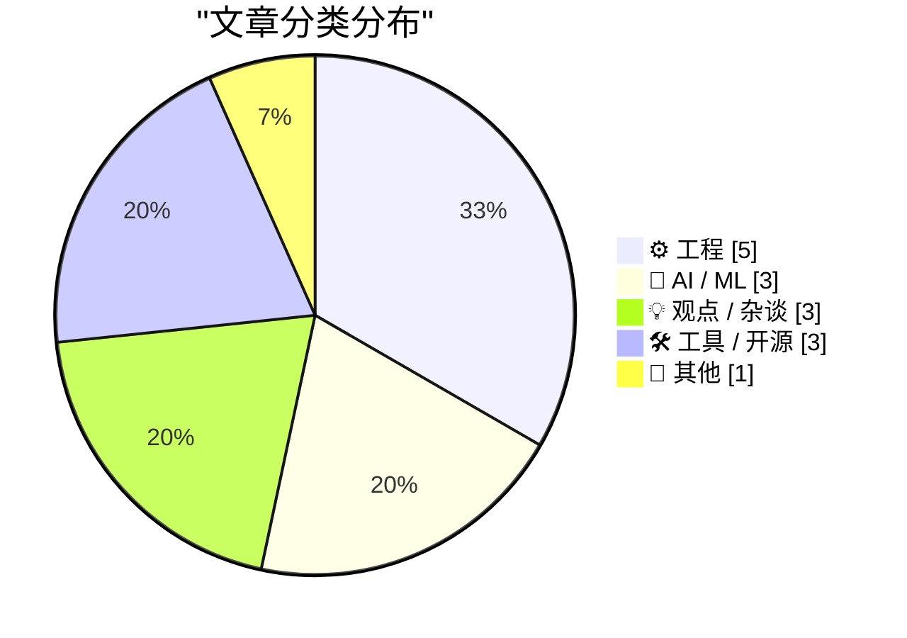
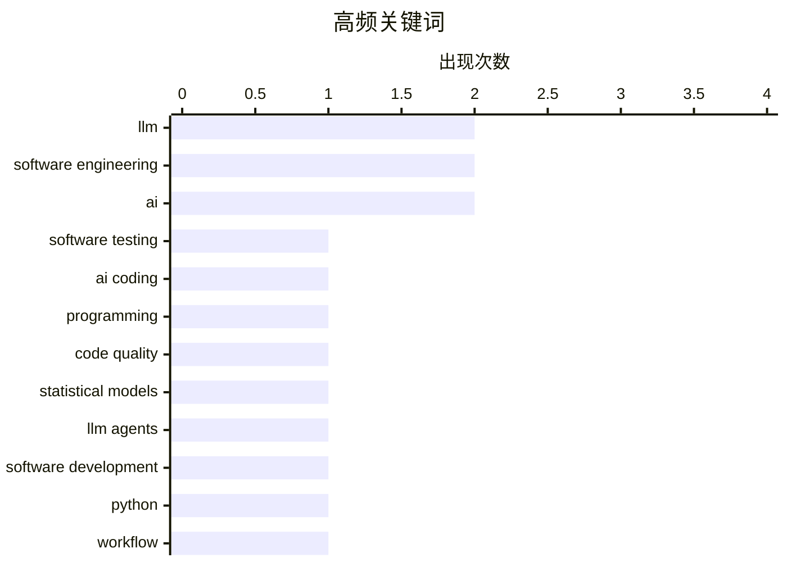

# 📰 Jun 8, 2026

> 来自 Karpathy 推荐的 92 个顶级技术博客，AI 精选 Top 15

## 📝 今日看点

今日技术圈正经历 AI 驱动的工程范式变革，大语言模型在显著提升开发与重构效率的同时，其潜藏的“统计性错误”也引发了对代码质量与长期维护性的深度警惕。与此同时，开发者群体开始反思过度追求开发低门槛与高强度劳作的弊端，转而推崇“少即是多”的设计哲学与预留缓冲的效能管理。此外，围绕 AI 风格版权的法律博弈与巨头们的激进资本投入，标志着技术界正处于从工具狂热回归理性审视的关键节点。

---

## 🏆 今日必读

🥇 **软件测试的新纪元**

[A new era for software testing](http://antirez.com/news/168) — antirez.com · 1 天前 · ⚙️ 工程

> 自动编程在特定场景下极大提升了软件开发速度，虽然其输出在结构质量和复杂度控制上仍不及顶级手写代码，但已超越多数普通水平的手写代码。这种技术进步正引领软件测试进入新纪元，开发者可以利用 AI 快速生成覆盖率更高的测试用例。尽管存在质量与时间的权衡，但 AI 在处理繁琐测试逻辑方面的效率优势显著。作者认为，管理得当的自动编程能够提升整体交付质量，尤其是在测试自动化领域。这种转变要求开发者从编写代码转向更高层次的逻辑验证。

💡 **为什么值得读**: Redis 创始人 antirez 对 AI 辅助编程与测试的深度思考，探讨了 AI 如何重塑代码质量与开发效率的平衡。

🏷️ software testing, LLM, AI coding

🥈 **通往天堂的阶梯**

[Stairway to Heaven](https://geohot.github.io//blog/jekyll/update/2026/06/07/stairway-to-heaven.html) — geohot.github.io · 1 天前 · 🤖 AI / ML

> 大语言模型本质上是旨在模仿编程分布的高度复杂统计模型，其输出的代码往往带有难以察觉的缺陷。随着模型准确率的提升，这种“统计性错误”变得更加隐蔽，形成了所谓的“永恒垃圾月（Eternal Sloptember）”现象。作者指出，这种看似正确实则存在逻辑漏洞的输出，正是统计模型不断逼近分布目标的必然结果。开发者必须警惕这种由高度拟合带来的隐蔽性错误，因为它们比明显的 Bug 更难被发现。这种趋势预示着未来软件维护将面临更严峻的挑战。

💡 **为什么值得读**: 自动驾驶天才 Geohot 对 LLM 生成代码本质的冷峻批判，提醒开发者关注统计模型带来的隐蔽性风险。

🏷️ LLM, programming, code quality, statistical models

🥉 **关于使用 LLM Agent 启动新项目的思考**

[Thoughts on starting new projects with LLM agents](https://eli.thegreenplace.net/2026/thoughts-on-starting-new-projects-with-llm-agents/) — eli.thegreenplace.net · 1 天前 · 🤖 AI / ML

> 作者分享了使用 LLM Agent 重构 Python 项目 pycparser 的成功经验，证明了 AI 辅助重构的代码在长期维护中依然稳健。在启动新项目时，LLM Agent 能够高效处理样板代码并搭建初始框架，显著缩短从零到一的周期。然而，成功的关键在于将 AI 视为协作工具而非完全替代者，仍需人工进行严格的代码审查和逻辑校验。这种模式改变了开发者处理新项目和遗留代码重构的思维方式。通过合理的提示词工程，LLM 可以处理复杂的结构化任务，但人类的架构决策依然不可或缺。

💡 **为什么值得读**: 资深开发者 Eli Bendersky 结合实际项目经验，探讨了 LLM Agent 在项目启动和重构中的实战价值与边界。

🏷️ LLM agents, software development, Python, workflow

---

## 📊 数据概览

| 扫描源 | 抓取文章 | 时间范围 | 精选 |
|:---:|:---:|:---:|:---:|
| 81/92 | 2438 篇 → 25 篇 | 48h | **15 篇** |

### 分类分布



### 高频关键词



<details>
<summary>📈 纯文本关键词图（终端友好）</summary>

```
llm                  │ ████████████████████ 2
software engineering │ ████████████████████ 2
ai                   │ ████████████████████ 2
software testing     │ ██████████░░░░░░░░░░ 1
ai coding            │ ██████████░░░░░░░░░░ 1
programming          │ ██████████░░░░░░░░░░ 1
code quality         │ ██████████░░░░░░░░░░ 1
statistical models   │ ██████████░░░░░░░░░░ 1
llm agents           │ ██████████░░░░░░░░░░ 1
software development │ ██████████░░░░░░░░░░ 1
```

</details>

### 🏷️ 话题标签

**llm**(2) · **software engineering**(2) · **ai**(2) · software testing(1) · ai coding(1) · programming(1) · code quality(1) · statistical models(1) · llm agents(1) · software development(1) · python(1) · workflow(1) · swiftui(1) · ios development(1) · ui design(1) · ai ethics(1) · drm(1) · digital rights(1) · go(1) · s3(1)

---

## ⚙️ 工程

### 1. 软件测试的新纪元

[A new era for software testing](http://antirez.com/news/168) — **antirez.com** · 1 天前 · ⭐ 27/30

> 自动编程在特定场景下极大提升了软件开发速度，虽然其输出在结构质量和复杂度控制上仍不及顶级手写代码，但已超越多数普通水平的手写代码。这种技术进步正引领软件测试进入新纪元，开发者可以利用 AI 快速生成覆盖率更高的测试用例。尽管存在质量与时间的权衡，但 AI 在处理繁琐测试逻辑方面的效率优势显著。作者认为，管理得当的自动编程能够提升整体交付质量，尤其是在测试自动化领域。这种转变要求开发者从编写代码转向更高层次的逻辑验证。

🏷️ software testing, LLM, AI coding

---

### 2. SwiftUI 只会让开发烂应用变得更容易

[★ SwiftUI Only Makes It Easy to Develop Bad Apps](https://daringfireball.net/2026/06/swiftui_only_makes_it_easy_to_develop_bad_apps) — **daringfireball.net** · 9 小时前 · ⭐ 24/30

> 苹果的开发理念曾强调不仅要让应用开发变得简单，更要让开发高质量的原生应用变得简单。虽然 AppKit 和 UIKit 实现了这一目标，但已发布七年的 SwiftUI 却被认为仅降低了开发门槛，却未能在提升应用质量上提供同等支持。作者指出，SwiftUI 使得开发“烂应用”变得非常容易，但在构建符合平台惯例的高质量体验方面仍显乏力。这种易用性与专业性之间的脱节，导致大量缺乏细节打磨的应用涌现。这一观点挑战了目前苹果生态中推崇 SwiftUI 的主流声音。

🏷️ SwiftUI, iOS development, UI design

---

### 3. 为 1948 年的 IBM 604 电子计算器模块通电

[Powering up a module from the IBM 604: an electronic calculator from 1948](http://www.righto.com/feeds/3379514160039863191/comments/default) — **righto.com** · 18 小时前 · ⭐ 19/30

> 1948 年是计算技术的转折点，IBM 604 作为早期电子计算器，标志着从机电继电器向真空管技术的跨越。文章详细记录了对这一古董级计算模块进行通电测试的过程，展示了当时复杂的电路设计和硬件构造。通过修复和通电，读者可以直观感受到二战后雷达和无线电技术如何催生了早期的电子运算设备。作者通过逆向工程揭示了早期计算机硬件在速度和可靠性上的初步尝试，并对比了当时与现代电路设计的巨大差异。

🏷️ IBM 604, retrocomputing, hardware

---

### 4. 软件包管理器专利参考清单

[Package Manager Patents](https://nesbitt.io/2026/06/08/package-manager-patents.html) — **nesbitt.io** · 1 小时前 · ⭐ 19/30

> 该资源汇总了与软件包管理器设计相关的专利及申请列表，并附带了关键的现有技术（Prior Art）说明。清单涵盖了依赖解析、版本控制和分发机制等核心领域的专利布局，旨在为开发者提供法律参考。通过对比不同专利的权利要求，文章揭示了现代包管理工具在技术实现上面临的知识产权风险。作者强调了在开源工具开发中了解这些专利背景对于规避侵权和寻找创新路径的重要性。

🏷️ package manager, patents, software legal

---

### 5. 编程即设计

[Coding Is Designing](https://blog.jim-nielsen.com/2026/code-is-design/) — **blog.jim-nielsen.com** · 16 小时前 · ⭐ 19/30

> 编程不仅仅是实现既定设计的手段，更是探索和发现设计方案的过程。通过编写代码并实时观察界面反馈，开发者可以在不断的“修改-反应”循环中感知元素间的细微关系。这种交互式的开发方式允许设计者在实际使用中调整参数，直到找到最符合直觉的交互体验。作者认为，代码是连接抽象想法与具体触感的桥梁，优秀的界面往往是在反复的代码调试中“生长”出来的。

🏷️ design, UI, software engineering, prototyping

---

## 🤖 AI / ML

### 6. 通往天堂的阶梯

[Stairway to Heaven](https://geohot.github.io//blog/jekyll/update/2026/06/07/stairway-to-heaven.html) — **geohot.github.io** · 1 天前 · ⭐ 26/30

> 大语言模型本质上是旨在模仿编程分布的高度复杂统计模型，其输出的代码往往带有难以察觉的缺陷。随着模型准确率的提升，这种“统计性错误”变得更加隐蔽，形成了所谓的“永恒垃圾月（Eternal Sloptember）”现象。作者指出，这种看似正确实则存在逻辑漏洞的输出，正是统计模型不断逼近分布目标的必然结果。开发者必须警惕这种由高度拟合带来的隐蔽性错误，因为它们比明显的 Bug 更难被发现。这种趋势预示着未来软件维护将面临更严峻的挑战。

🏷️ LLM, programming, code quality, statistical models

---

### 7. 关于使用 LLM Agent 启动新项目的思考

[Thoughts on starting new projects with LLM agents](https://eli.thegreenplace.net/2026/thoughts-on-starting-new-projects-with-llm-agents/) — **eli.thegreenplace.net** · 1 天前 · ⭐ 26/30

> 作者分享了使用 LLM Agent 重构 Python 项目 pycparser 的成功经验，证明了 AI 辅助重构的代码在长期维护中依然稳健。在启动新项目时，LLM Agent 能够高效处理样板代码并搭建初始框架，显著缩短从零到一的周期。然而，成功的关键在于将 AI 视为协作工具而非完全替代者，仍需人工进行严格的代码审查和逻辑校验。这种模式改变了开发者处理新项目和遗留代码重构的思维方式。通过合理的提示词工程，LLM 可以处理复杂的结构化任务，但人类的架构决策依然不可或缺。

🏷️ LLM agents, software development, Python, workflow

---

### 8. Alberto Romero 谈苹果的 AI 投入

[Alberto Romero on Apple’s AI Spending](https://www.thealgorithmicbridge.com/p/what-apple-knows-about-ai-that-silicon) — **daringfireball.net** · 10 小时前 · ⭐ 21/30

> Alberto Romero 将当前的 AI 热潮比作宗教信仰：要么相信它能改变一切，要么完全不信，不存在中间立场。硅谷巨头们投入数千亿美元进行资本支出，仿佛在围绕 AGI 这一“神迹”重组业务。相比之下，苹果虽然在产品中加入了各种 AI 功能，但其投入逻辑更倾向于实用主义而非盲目的宗教式崇拜。文章探讨了在 AGI 信仰笼罩下，苹果如何保持其独特的商业节奏与技术取向。这种差异反映了苹果对用户体验的坚持，而非仅仅追求技术指标的领先。

🏷️ Apple, AI investment, AGI

---

## 💡 观点 / 杂谈

### 9. Pluralistic：批判“万能机器”

[Pluralistic: Criticizing the everything machine (06 Jun 2026)](https://pluralistic.net/2026/06/06/applied-counterescatology/) — **pluralistic.net** · 1 天前 · ⭐ 23/30

> 本文对所谓的“万能机器”（AI）及其过度承诺进行了深度批判，探讨了技术垄断对社会的影响。作者 Cory Doctorow 结合议会与 DRM（数字版权管理）的博弈、奢侈品防伪技术以及“精简媒体”等话题，分析了技术在解决问题时产生的副作用。文章指出，AI 虽被吹捧为全能工具，但在实际应用中往往伴随着版权争议和功能退化。这种对技术的反思旨在提醒公众警惕技术决定论带来的陷阱。作者呼吁通过法律和政策手段，重新夺回对数字工具的控制权。

🏷️ AI ethics, DRM, digital rights

---

### 10. 在工作中“无所事事”

[Doing nothing at work](https://seangoedecke.com/doing-nothing-at-work/) — **seangoedecke.com** · 11 小时前 · ⭐ 21/30

> 许多工程师应当尝试减少工作时长并放慢节奏，建议将日常利用率保持在 80% 左右，预留 20% 的时间远离电脑。作者认为，科技公司的绩效表现通常由少数“离群事件”或高影响力机会决定，而非持续的高强度劳作。通过保持充沛的精力，工程师能在关键时刻迅速响应并产出高质量成果。这种“以退为进”的策略旨在避免过度疲劳，从而在真正重要的任务出现时发挥最大价值。文章强调，慢节奏的工作往往能带来更深层次的思考和更优的架构设计。

🏷️ productivity, software engineering, burnout

---

### 11. 抄袭我的风格

[Copping My Style](https://feed.tedium.co/link/15204/17355475/adobe-creator-act-style-protection-commentary) — **tedium.co** · 1 天前 · ⭐ 21/30

> 针对 AI 模仿艺术风格引发的争议，一项由 Adobe 支持的法案正试图推动“艺术风格”的法律保护。目前法律尚不支持对抽象风格的版权保护，但该法案旨在为创作者提供反击 AI 侵权的法律武器。然而，界定何为“风格”存在大量模糊地带，可能引发新的法律纠纷。文章探讨了在 AI 时代，版权法如何在保护原创性与维持创作自由之间寻找新的平衡。Adobe 的这一举动被视为对生成式 AI 冲击创意产业的直接回应，具有重要的行业风向标意义。

🏷️ AI, copyright, legal, intellectual property

---

## 🛠 工具 / 开源

### 12. 为你的 Go 应用赋予 Tigris 超能力

[Giving your Go apps Tigris superpowers](https://www.tigrisdata.com/blog/storage-sdk-go/) — **xeiaso.net** · -768 分钟前 · ⭐ 22/30

> Tigris 是一款兼容 S3 的存储服务，但其特有的存储桶分叉（forking）、快照和对象重命名等功能在标准 AWS SDK 中无法直接使用。为此，官方推出了专为 Go 语言设计的 SDK，包含 storage 和 simplestorage 两个包。storage 包作为标准 S3 客户端的无缝替代品，提供了对 Tigris 特有操作的一等公民支持；而 simplestorage 则提供了更高层次的抽象。这套 SDK 解决了开发者在利用 Tigris 高级特性时必须编写冗长变通代码的痛点。通过该 SDK，Go 开发者可以更优雅地管理云原生存储资源。

🏷️ Go, S3, cloud storage, SDK

---

### 13. Halide Mark III 发布

[Halide Mark III](https://www.lux.camera/halide-mark-iii/) — **daringfireball.net** · 1 天前 · ⭐ 21/30

> 知名相机应用 Halide 发布了 Mark III 版本，其设计灵感源自开发者对胶片摄影的回归与反思。在体验了胶片摄影中“有限选择带来的自由”后，开发者决定在数字应用中践行“少即是多”的理念。Halide Mark III 摒弃了成千上万的预设，转而提供经过精心调优、适用于多种场景的少数优质选项。这一版本旨在将胶片时代的专注感带入现代移动摄影，提升用户的创作体验。通过减少干扰，应用帮助用户更专注于构图和光影本身。

🏷️ Halide, iOS app, photography

---

### 14. Datasette Agent 编辑插件 datasette-agent-edit 0.1a0 发布

[datasette-agent-edit 0.1a0](https://simonwillison.net/2026/Jun/7/datasette-agent-edit/#atom-everything) — **simonwillison.net** · 11 小时前 · ⭐ 20/30

> Datasette Agent 推出了新插件 datasette-agent-edit 0.1a0，旨在解决 AI 代理在协作编辑 Markdown、SQL 查询和 SVG 文件时的文本修改难题。该插件通过结构化的方式让 AI 能够精准定位并修改现有文本片段，避免了全量重写带来的不稳定性。目前发布的 0.1a0 版本是实现复杂文本交互的基础，未来将支持更广泛的协作编辑场景。作者认为，让 AI 代理具备可靠的文本编辑能力是提升数据分析工具实用性的关键一步。

🏷️ Datasette, LLM agent, open source

---

## 📝 其他

### 15. 建筑物理阅读清单：2026年6月6日

[Reading List 06/06/26](https://www.construction-physics.com/p/reading-list-060626) — **construction-physics.com** · 1 天前 · ⭐ 19/30

> 本期阅读清单聚焦于跨行业的硬科技与 AI 应用，涵盖了聊天机器人取代房产经纪人、中国合成钻石产业现状以及澳大利亚电池技术进展。特别关注了 Meta 公司采用的“数据中心帐篷”方案，探讨了这种快速部署基础设施在应对算力需求激增时的优劣。文章还分析了合成技术对传统珠宝市场的冲击，以及能源存储在全球供应链中的战略地位。作者通过多维度的案例，展示了技术进步如何重塑传统建筑、能源和零售行业。

🏷️ data centers, AI, energy

---

*生成于 2026-06-08 11:12 | 扫描 81 源 → 获取 2438 篇 → 精选 15 篇*
*基于 [Hacker News Popularity Contest 2025](https://refactoringenglish.com/tools/hn-popularity/) RSS 源列表，由 [Andrej Karpathy](https://x.com/karpathy) 推荐*
