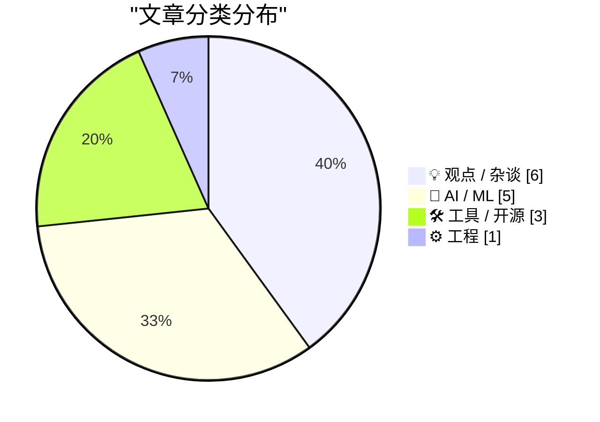
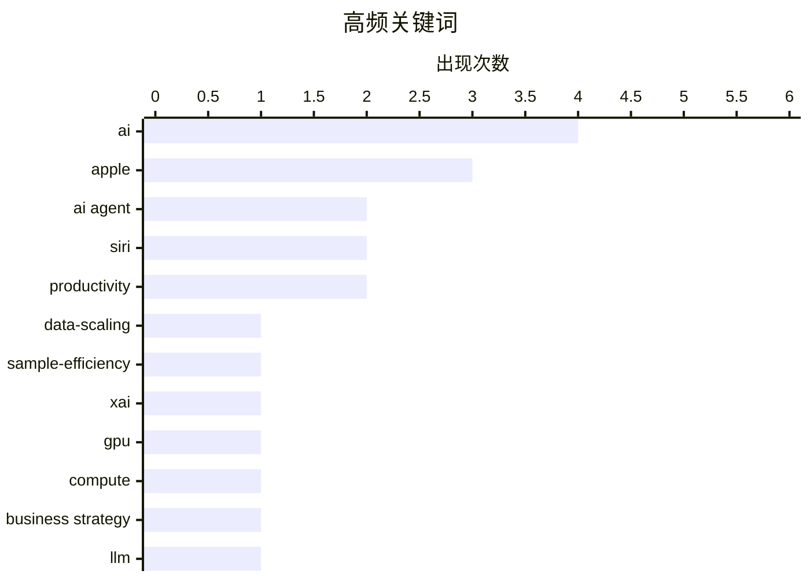

# 📰 Jun 9, 2026

> 来自 Karpathy 推荐的 92 个顶级技术博客，AI 精选 Top 15

## 📝 今日看点

AI 产业正步入反思与转型的深水区，大模型在遭遇样本效率瓶颈与性能增长放缓的同时，正加速向算力基础设施化与智能体协议标准化演进。与此同时，AI 辅助开发带来的代码冗余与 UI 工具链的质量争议，引发了开发者对工程本质与应用品质的重新审视。从国防科技创新到跨职能协作优化，技术圈正试图在狂热之后寻找更务实的落地路径。

---

## 🏆 今日必读

🥇 **样本效率黑洞**

[The sample efficiency black hole](https://www.dwarkesh.com/p/the-sample-efficiency-black-hole) — dwarkesh.com · 15 小时前 · 🤖 AI / ML

> AI 模型在能力上看似群星璀璨，但其核心却是一个吞噬海量数据的“黑洞”。人类仅需极少量样本即可掌握新技能，而当前大模型（LLM）则依赖数万亿级的 Token 进行训练，这种极低的样本效率是通用人工智能（AGI）面临的最大障碍。文章指出，随着互联网公开数据的耗尽，单纯依靠增加数据规模的边际效应正在递减。未来的技术突破必须从模仿人类的低样本学习机制入手，而非继续向这个数据黑洞投入更多资源。这种从“规模”到“效率”的范式转移将决定下一代 AI 的成败。

💡 **为什么值得读**: 深入探讨了 AI 发展的核心瓶颈——数据饥渴与样本效率之间的矛盾，是理解 AGI 演进路径的必读篇目。

🏷️ AI, data-scaling, sample-efficiency

🥈 **xAI 看起来更像是一家数据中心房地产信托，而非前沿实验室**

[xAI is looking more like a datacentre REIT than a frontier lab](https://martinalderson.com/posts/xais-new-rental-business/?utm_source=rss&amp;utm_medium=rss&amp;utm_campaign=feed) — martinalderson.com · 1 天前 · 🤖 AI / ML

> 马斯克的 AI 公司 xAI 正在将其庞大的 GPU 算力资源租赁给竞争对手 Anthropic 和 Google，这种行为使其商业模式更接近数据中心房地产投资信托（REIT）。通过快速建成拥有 10 万张 H100 的 Colossus 集群，xAI 在算力基建上取得了显著的时间优势，但也面临着巨大的财务压力。这种“算力转租”策略可能是为了在 SpaceX IPO 前优化财务报表，同时也反映了当前行业内极度紧缺的算力市场现状。xAI 正在从纯粹的算法研发实验室转型为掌握核心算力命脉的基础设施供应商。

💡 **为什么值得读**: 揭示了 AI 独角兽公司在算力竞赛中独特的商业策略与财务逻辑，提供了观察 xAI 的新视角。

🏷️ xAI, GPU, compute, business strategy

🥉 **大模型与“差强人意”的代码**

[LLMs and almost good code](https://entropicthoughts.com/llms-and-almost-good-code) — entropicthoughts.com · 11 小时前 · 🤖 AI / ML

> 顶尖大模型在处理简单编程任务时，生成的代码往往比实际需求复杂约 10%。开发者倾向于接受这种多余的复杂性，因为 LLM 能够即时解决当前的 CRUD 或管道代码问题，省去了手动编写的时间。然而，这种“差强人意”的代码虽然在当下可行，却在无形中增加了系统的认知负荷。长期来看，过度依赖 AI 生成的冗余代码将导致项目维护成本大幅上升。作者呼吁开发者应保持警惕，不要为了追求短期效率而牺牲代码的简洁性。

💡 **为什么值得读**: 警示开发者关注 AI 生成代码带来的长期维护债务和系统复杂性风险，具有很强的工程实践指导意义。

🏷️ LLM, code-quality, software-complexity

---

## 📊 数据概览

| 扫描源 | 抓取文章 | 时间范围 | 精选 |
|:---:|:---:|:---:|:---:|
| 80/92 | 2433 篇 → 27 篇 | 48h | **15 篇** |

### 分类分布



### 高频关键词



<details>
<summary>📈 纯文本关键词图（终端友好）</summary>

```
ai                │ ████████████████████ 4
apple             │ ███████████████░░░░░ 3
ai agent          │ ██████████░░░░░░░░░░ 2
siri              │ ██████████░░░░░░░░░░ 2
productivity      │ ██████████░░░░░░░░░░ 2
data-scaling      │ █████░░░░░░░░░░░░░░░ 1
sample-efficiency │ █████░░░░░░░░░░░░░░░ 1
xai               │ █████░░░░░░░░░░░░░░░ 1
gpu               │ █████░░░░░░░░░░░░░░░ 1
compute           │ █████░░░░░░░░░░░░░░░ 1
```

</details>

### 🏷️ 话题标签

**ai**(4) · **apple**(3) · **ai agent**(2) · siri(2) · productivity(2) · data-scaling(1) · sample-efficiency(1) · xai(1) · gpu(1) · compute(1) · business strategy(1) · llm(1) · code-quality(1) · software-complexity(1) · ai-bubble(1) · industry-trends(1) · nvidia(1) · swiftui(1) · ios development(1) · ui design(1)

---

## 💡 观点 / 杂谈

### 1. AI 正在减速

[AI Is Slowing Down](https://www.wheresyoured.at/ai-is-slowing-down/) — **wheresyoured.at** · 18 小时前 · ⭐ 24/30

> 尽管英伟达和 Anthropic 等公司投入了巨额资金，但 AI 技术的迭代速度正呈现出明显的放缓迹象。早期的指数级增长正在遭遇物理极限和高质量数据枯竭的双重挑战，导致模型性能提升的边际收益递减。文章通过对行业巨头财务数据和技术进展的深度分析，指出当前的 AI 繁荣更多依赖于资本惯性而非突破性创新。如果无法在架构上取得质的飞跃，AI 产业可能会进入一个漫长的平台期。这种增速放缓将迫使市场重新评估 AI 公司的估值逻辑。

🏷️ AI-bubble, industry-trends, NVIDIA

---

### 2. 斯坦福大学 2026 届“为国防而黑”课程：经验教训总结

[Hacking for Defense @ Stanford 2026 – Lessons Learned Presentations](https://steveblank.com/2026/06/08/g-for-defense-stanford-2026-lessons-learned-presentations/) — **steveblank.com** · 20 小时前 · ⭐ 23/30

> 斯坦福大学完成了第 11 届“为国防而黑”（H4D）课程，重点展示了学生团队如何利用初创企业思维解决复杂的国家安全挑战。2026 年的课程反映了非对称战争（如无人机技术）、AI 驱动的决策系统以及商业航天等颠覆性技术对国防的深刻影响。学生们通过精益创业方法论，在国防部采购系统与前沿技术之间架起桥梁，推动了现成商业技术（COTS）在军事领域的应用。课程总结强调，现代国防竞争已演变为技术迭代速度的竞争。这种教学模式正成为美国国防部获取创新能力的关键渠道。

🏷️ defense tech, startups, innovation

---

### 3. 如何与产品经理协作

[Working with product managers](https://seangoedecke.com/working-with-product-managers/) — **seangoedecke.com** · 1 天前 · ⭐ 21/30

> 工程师与产品经理（PM）之间的关系往往比公司内部任何其他协作关系都更具挑战性。这种功能失调源于缺乏共同的文化背景和专业语言，且在“谁听谁的”这一权力边界上往往模糊不清。尽管工程师与法务或设计部门交集较少，但与 PM 的沟通几乎贯穿每日工作，这使得矛盾更容易激化。文章深入探讨了这种紧张关系的根源，并提供了改善协作的实用建议。作者认为，建立清晰的沟通契约和相互理解的职业目标是提升研发效率的关键。这种跨职能的理解对于构建高效的工程团队至关重要。

🏷️ Product Management, Engineering Culture, Collaboration

---

### 4. ppclp.ai 宣布实现 100 倍生产力提升

[ppclp.ai announces 100x Productivity Gains](https://idiallo.com/blog/100x-productivity-gain) — **idiallo.com** · 14 小时前 · ⭐ 20/30

> 北美第三大 AI 原生办公紧固件制造商 ppclp.ai（原名回形针公司）宣布，通过为期 18 个月的“Project Streamline”计划，其专有的组织生产力指数（OPI™）实现了惊人的 100 倍增长。该公司 340 名员工全部完成了强制性的效率培训，管理层称这一突破为“运营卓越的新纪元”。然而，这种夸张的指标提升和从传统制造向 AI 原生的转型，带有浓厚的讽刺意味。文章通过这个案例揭示了当前企业界在 AI 浪潮下过度包装、虚报数据以及盲目追求 AI 标签的乱象。

🏷️ AI Hype, Satire, Productivity

---

### 5. 在工作中“无所事事”的艺术

[Doing nothing at work](https://seangoedecke.com/doing-nothing-at-work/) — **seangoedecke.com** · 1 天前 · ⭐ 19/30

> 许多软件工程师应当减少实际工作时长，建议将日常负荷维持在 80% 的利用率，并拿出 20% 的时间远离电脑。科技公司的绩效往往由少数“离群事件”或高影响力决策决定，而非持续的加班产出。保持较低的工作节奏能让大脑有空间进行深度思考，从而在关键时刻做出更优的技术选型。这种策略不仅能预防职业倦怠，还能确保在真正的高压项目到来时有充足的精力应对。作者认为，战略性的休息和慢节奏工作反而是提升长期产出的核心。

🏷️ Productivity, Burnout, Software Engineering

---

### 6. Alberto Romero 谈苹果的 AI 投入策略

[Alberto Romero on Apple’s AI Spending](https://www.thealgorithmicbridge.com/p/what-apple-knows-about-ai-that-silicon) — **daringfireball.net** · 1 天前 · ⭐ 19/30

> Alberto Romero 将当前的 AI 热潮比作宗教信仰，认为科技巨头要么投入数千亿美元追求 AGI，要么就被视为落伍。苹果公司在 AI 资本支出上表现得相对克制，拒绝盲目跟风添加华而不实的 AI 功能。文章指出，苹果似乎看透了 AI 实用性的本质，不愿像其他硅谷公司那样为了“信仰”而过度扩张。这种审慎的策略反映了苹果在面对技术泡沫时，更倾向于将资源集中在能真正提升用户体验的领域，而非虚无缥缈的宏大叙事。

🏷️ AI, Apple, Strategy, AGI

---

## 🤖 AI / ML

### 7. 样本效率黑洞

[The sample efficiency black hole](https://www.dwarkesh.com/p/the-sample-efficiency-black-hole) — **dwarkesh.com** · 15 小时前 · ⭐ 25/30

> AI 模型在能力上看似群星璀璨，但其核心却是一个吞噬海量数据的“黑洞”。人类仅需极少量样本即可掌握新技能，而当前大模型（LLM）则依赖数万亿级的 Token 进行训练，这种极低的样本效率是通用人工智能（AGI）面临的最大障碍。文章指出，随着互联网公开数据的耗尽，单纯依靠增加数据规模的边际效应正在递减。未来的技术突破必须从模仿人类的低样本学习机制入手，而非继续向这个数据黑洞投入更多资源。这种从“规模”到“效率”的范式转移将决定下一代 AI 的成败。

🏷️ AI, data-scaling, sample-efficiency

---

### 8. xAI 看起来更像是一家数据中心房地产信托，而非前沿实验室

[xAI is looking more like a datacentre REIT than a frontier lab](https://martinalderson.com/posts/xais-new-rental-business/?utm_source=rss&amp;utm_medium=rss&amp;utm_campaign=feed) — **martinalderson.com** · 1 天前 · ⭐ 25/30

> 马斯克的 AI 公司 xAI 正在将其庞大的 GPU 算力资源租赁给竞争对手 Anthropic 和 Google，这种行为使其商业模式更接近数据中心房地产投资信托（REIT）。通过快速建成拥有 10 万张 H100 的 Colossus 集群，xAI 在算力基建上取得了显著的时间优势，但也面临着巨大的财务压力。这种“算力转租”策略可能是为了在 SpaceX IPO 前优化财务报表，同时也反映了当前行业内极度紧缺的算力市场现状。xAI 正在从纯粹的算法研发实验室转型为掌握核心算力命脉的基础设施供应商。

🏷️ xAI, GPU, compute, business strategy

---

### 9. 大模型与“差强人意”的代码

[LLMs and almost good code](https://entropicthoughts.com/llms-and-almost-good-code) — **entropicthoughts.com** · 11 小时前 · ⭐ 24/30

> 顶尖大模型在处理简单编程任务时，生成的代码往往比实际需求复杂约 10%。开发者倾向于接受这种多余的复杂性，因为 LLM 能够即时解决当前的 CRUD 或管道代码问题，省去了手动编写的时间。然而，这种“差强人意”的代码虽然在当下可行，却在无形中增加了系统的认知负荷。长期来看，过度依赖 AI 生成的冗余代码将导致项目维护成本大幅上升。作者呼吁开发者应保持警惕，不要为了追求短期效率而牺牲代码的简洁性。

🏷️ LLM, code-quality, software-complexity

---

### 10. WWDC 2026 上的 Siri AI

[Siri AI at WWDC 2026](https://simonwillison.net/2026/Jun/8/wwdc/#atom-everything) — **simonwillison.net** · 10 小时前 · ⭐ 21/30

> 鉴于苹果在 2024 年 WWDC 上关于“苹果智能”的承诺未能完全兑现，作者对 2026 年发布的新一代 Siri AI 持谨慎观望态度。虽然本次发布的 Siri AI 功能在技术路径上显得更加务实且具备落地可行性，但实际体验仍需观察。新功能强调了深度系统集成和多模态理解能力，试图让 Siri 真正成为能够跨应用执行复杂指令的智能助手。文章指出，苹果正努力追赶 OpenAI 和 Google 的步伐，但其封闭生态与隐私承诺仍是双刃剑。作者坚持“眼见为实”的原则，提醒用户不要被精美的演示视频过度误导。

🏷️ Apple Intelligence, Siri, WWDC, AI

---

### 11. 知情人士透露：Siri 将在 iOS 27 中引入第三方 AI 扩展

[From the Annals of People Having Knowledge of the Matter, Siri AI Extensions Edition](https://www.bloomberg.com/news/articles/2026-03-26/apple-plans-to-open-up-siri-to-rival-ai-assistants-beyond-chatgpt-in-ios-27) — **daringfireball.net** · 8 小时前 · ⭐ 20/30

> 苹果计划在即将发布的 iOS 27 系统中对 Siri 进行重大重构，将其生态开放给除 ChatGPT 之外的竞争对手 AI 助手。这一举措旨在将 iPhone 打造为一个更具包容性的 AI 平台，打破目前仅与 OpenAI 合作的局限。通过引入第三方 AI 扩展，Siri 将能够根据用户需求调用不同厂商的服务来处理复杂请求。此举标志着苹果在 AI 领域从封闭走向生态开放，试图通过多元化的模型集成来增强产品竞争力。

🏷️ Apple, Siri, iOS, AI

---

## 🛠 工具 / 开源

### 12. WorkOS 发布 auth.md：一种用于智能体注册的开放协议

[[Sponsor] WorkOS Launches auth.md — an Open Protocol for Agent Registration](https://youtu.be/Dqp_b8GHLXU?t=1074) — **daringfireball.net** · 5 小时前 · ⭐ 22/30

> 传统的注册表单是为人类浏览器设计的，而 AI 智能体（Agent）需要一种标准化的程序化方式来访问服务。WorkOS 推出的 auth.md 协议通过在服务根目录下放置一个机器可读的 Markdown 文件，解决了这一难题。该协议允许 AI 智能体动态发现 OAuth 受保护资源的元数据、解析所需的权限范围（Scopes）并实现无缝身份验证。目前 WorkOS AuthKit 已提供原生支持，开发者可以开箱即用。这一举措为“智能体经济”构建了关键的基础设施，使 AI 能够安全、自动化地登录各类应用。

🏷️ AI Agent, Authentication, Protocol, OAuth

---

### 13. datasette-agent-edit 0.1a0 发布

[datasette-agent-edit 0.1a0](https://simonwillison.net/2026/Jun/7/datasette-agent-edit/#atom-everything) — **simonwillison.net** · 1 天前 · ⭐ 20/30

> Simon Willison 发布了 datasette-agent-edit 0.1a0 预览版，旨在为 Datasette Agent 提供强大的文本编辑能力。该插件支持 AI 智能体对 Markdown 文档、复杂 SQL 查询以及 SVG 图形文件进行协作式修改。针对智能体编辑文本时容易出错的难题，作者采用了一种优化设计方案，以确保编辑的准确性和可追溯性。这是构建“智能体原生”数据工具链的重要一步，允许 AI 不仅仅是读取数据，还能直接参与内容的迭代。该工具目前处于 Alpha 阶段，重点解决 Agent 编辑时的交互逻辑。

🏷️ Datasette, AI Agent, Open Source, Python

---

### 14. 为你的 Go 应用赋予 Tigris 超能力

[Giving your Go apps Tigris superpowers](https://www.tigrisdata.com/blog/storage-sdk-go/) — **xeiaso.net** · 9 小时前 · ⭐ 20/30

> Tigris 存储服务虽然兼容 S3 协议，但标准 AWS SDK 无法直接调用其特有的存储桶分支（forking）、快照和对象重命名等高级功能。为此，官方推出了专为 Go 语言设计的 SDK，包含两种模式：storage 包作为标准 S3 客户端的无缝替代品，以及 simplestorage 高级抽象包。该 SDK 引入了一等公民级别的原生方法，消除了使用 AWS SDK 时所需的冗长变通方案。开发者可以借此在 Go 应用中更高效地管理具有版本控制和分支能力的云存储，充分发挥 Tigris 的差异化优势。

🏷️ Go, S3, Tigris, SDK

---

## ⚙️ 工程

### 15. SwiftUI 只会让开发烂应用变得更容易

[★ SwiftUI Only Makes It Easy to Develop Bad Apps](https://daringfireball.net/2026/06/swiftui_only_makes_it_easy_to_develop_bad_apps) — **daringfireball.net** · 1 天前 · ⭐ 23/30

> 苹果的开发者理念曾强调不仅要易于开发，更要易于构建符合原生规范的高质量应用。虽然 AppKit 和 UIKit 成功履行了这一使命，但诞生已七年的 SwiftUI 却始终未能达到同样的标准。SwiftUI 虽然降低了入门门槛，却导致大量应用在交互细节和原生体验上大打折扣，甚至偏离了苹果引以为傲的设计准则。文章批评 SwiftUI 过于追求跨平台的一致性，而牺牲了特定平台（如 macOS）的深度优化。作者认为，这种“易用性优先”的转变正在削弱苹果生态应用的高品质基因。

🏷️ SwiftUI, iOS Development, UI Design, Apple

---

*生成于 2026-06-09 09:58 | 扫描 80 源 → 获取 2433 篇 → 精选 15 篇*
*基于 [Hacker News Popularity Contest 2025](https://refactoringenglish.com/tools/hn-popularity/) RSS 源列表，由 [Andrej Karpathy](https://x.com/karpathy) 推荐*
