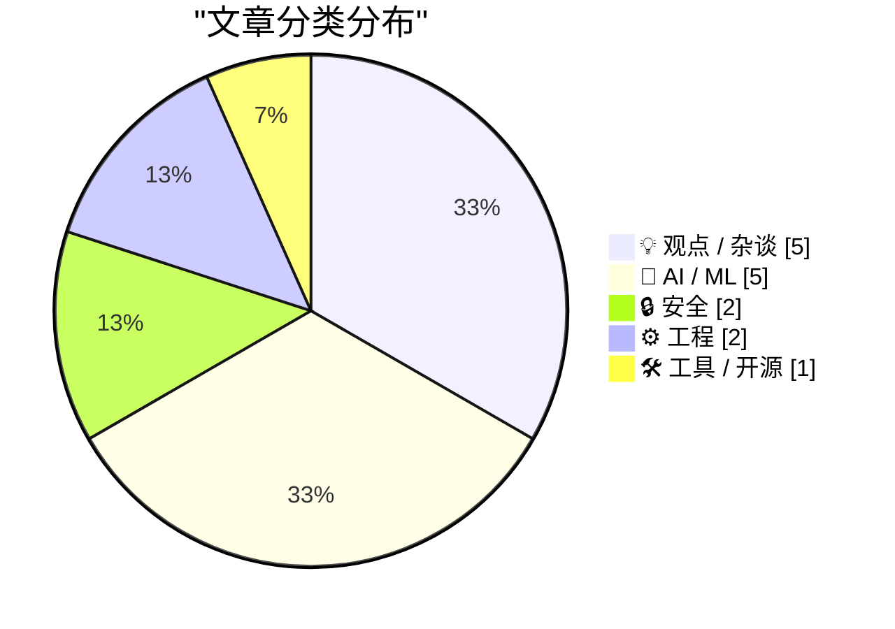
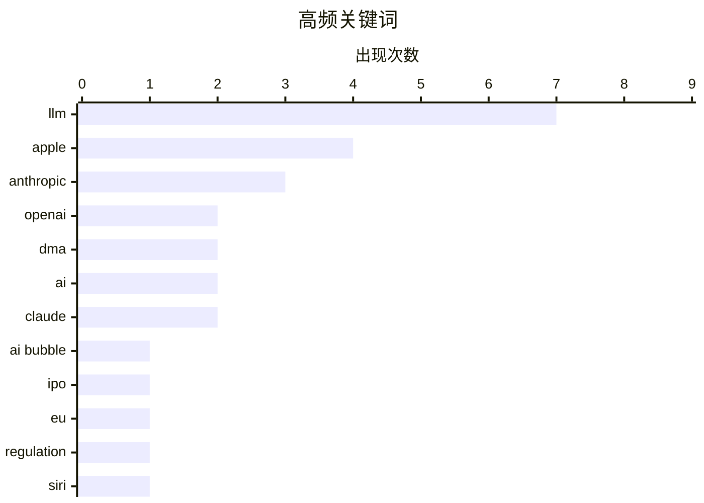

# 📰 Jun 13, 2026

> 来自 Karpathy 推荐的 92 个顶级技术博客，AI 精选 Top 15

## 📝 今日看点

AI 行业正面临泡沫压力与监管升级的双重考验，硅谷巨头在巨额亏损中竞速上市，而美国政府对核心模型的出口管制进一步收紧。与此同时，苹果与欧盟因《数字市场法案》陷入僵局，导致其 AI 功能在欧洲上线受阻，凸显了技术创新与全球合规的剧烈摩擦。此外，关于 AI 编程伦理的反思与漏洞披露标准的标准化变革，标志着技术圈正从狂热转向对安全与底层逻辑的深度审视。

---

## 🏆 今日必读

🥇 **硅谷泡沫（第一部分）：退出流动性的竞赛**

[Premium: The Silicon Valley Bubble (Part 1)](https://www.wheresyoured.at/premium-the-silicon-valley-bubble-part-1/) — wheresyoured.at · 16 小时前 · 💡 观点 / 杂谈

> 硅谷正面临 AI 泡沫破裂的临界点，OpenAI 和 Anthropic 已正式提交上市申请，试图在巨额亏损中寻求退出流动性。这两家公司每年烧掉数十亿美元，且目前完全看不到盈利路径，其估值主要建立在对通用人工智能（AGI）的过度承诺之上。文章指出，这种急于上市的行为反映了投资者对当前 AI 商业模式可持续性的极度焦虑。随着融资环境收紧，这种依赖持续输血的增长模式正接近终点。这种“退出竞赛”暗示了风投机构正试图在公众意识到 AI 变现难题前套现离场。

💡 **为什么值得读**: 深入剖析 AI 巨头急于上市背后的财务危机与泡沫现状，揭示行业繁荣下的脆弱真相。

🏷️ AI bubble, OpenAI, Anthropic, IPO

🥈 **欧盟委员会回应：苹果推迟 Siri AI 纯属个人决定**

[The European Commission Response to Siri AI and the DMA](https://www.linkedin.com/posts/thomas-regnier-24a05810b_what-is-the-true-story-behind-apples-decision-activity-7470439874664280064-TuEt) — daringfireball.net · 16 小时前 · 💡 观点 / 杂谈

> 欧盟委员会发言人 Thomas Regnier 针对苹果在欧盟推迟发布“Siri AI”做出回应，明确指出这一决定完全由苹果单方面做出。欧盟强调《数字市场法案》（DMA）并未禁止苹果推出新功能，而是要求其在公平竞争环境下运行。苹果在与欧盟的沟通中未能提出符合 DMA 要求的合规方案，却选择将延迟归咎于监管压力。这一回应揭示了科技巨头与监管机构在数据共享与互操作性要求上的激烈博弈。欧盟认为苹果是在利用监管作为挡箭牌，以掩盖其在合规技术实现上的滞后。

💡 **为什么值得读**: 了解欧盟官方对苹果 AI 延迟上线的正面回应，看清监管合规与产品策略之间的博弈真相。

🏷️ Apple, EU, DMA, Regulation

🥉 **苹果声明：受 DMA 影响，欧盟区 Siri AI 将推迟至 iOS 27**

[Apple: ‘Due to DMA, Siri AI Delayed in EU for iOS 27 and iPadOS 27’](https://www.apple.com/newsroom/2026/06/due-to-dma-siri-ai-delayed-in-eu-for-ios-27-and-ipados-27/) — daringfireball.net · 1 天前 · 🤖 AI / ML

> 苹果官方宣布，由于欧盟《数字市场法案》（DMA）的互操作性要求，Siri AI 在欧盟地区的上线将推迟至 iOS 27 和 iPadOS 27。苹果认为 DMA 要求其向第三方 AI 系统开放近乎无限的设备访问权限，这将导致用户隐私和安全面临巨大风险。安全研究表明，此类开放接口可能被恶意利用以窃取个人数据或在未经用户授权的情况下执行操作。因此，苹果选择在确保安全合规方案成熟前，不在欧盟市场投放该核心 AI 功能。这一决定凸显了苹果在隐私保护底线与地区法律合规之间的艰难平衡。

💡 **为什么值得读**: 掌握苹果在隐私安全与欧盟监管冲突中的最新立场，以及 iOS 27 路线图的重大调整。

🏷️ Apple, Siri, AI, DMA

---

## 📊 数据概览

| 扫描源 | 抓取文章 | 时间范围 | 精选 |
|:---:|:---:|:---:|:---:|
| 82/92 | 2466 篇 → 26 篇 | 48h | **15 篇** |

### 分类分布



### 高频关键词



<details>
<summary>📈 纯文本关键词图（终端友好）</summary>

```
llm       │ ████████████████████ 7
apple     │ ███████████░░░░░░░░░ 4
anthropic │ █████████░░░░░░░░░░░ 3
openai    │ ██████░░░░░░░░░░░░░░ 2
dma       │ ██████░░░░░░░░░░░░░░ 2
ai        │ ██████░░░░░░░░░░░░░░ 2
claude    │ ██████░░░░░░░░░░░░░░ 2
ai bubble │ ███░░░░░░░░░░░░░░░░░ 1
ipo       │ ███░░░░░░░░░░░░░░░░░ 1
eu        │ ███░░░░░░░░░░░░░░░░░ 1
```

</details>

### 🏷️ 话题标签

**llm**(7) · **apple**(4) · **anthropic**(3) · openai(2) · dma(2) · ai(2) · claude(2) · ai bubble(1) · ipo(1) · eu(1) · regulation(1) · siri(1) · gpu(1) · caching(1) · performance(1) · ai policy(1) · export control(1) · wwdc(1) · podcast(1) · tech trends(1)

---

## 💡 观点 / 杂谈

### 1. 硅谷泡沫（第一部分）：退出流动性的竞赛

[Premium: The Silicon Valley Bubble (Part 1)](https://www.wheresyoured.at/premium-the-silicon-valley-bubble-part-1/) — **wheresyoured.at** · 16 小时前 · ⭐ 27/30

> 硅谷正面临 AI 泡沫破裂的临界点，OpenAI 和 Anthropic 已正式提交上市申请，试图在巨额亏损中寻求退出流动性。这两家公司每年烧掉数十亿美元，且目前完全看不到盈利路径，其估值主要建立在对通用人工智能（AGI）的过度承诺之上。文章指出，这种急于上市的行为反映了投资者对当前 AI 商业模式可持续性的极度焦虑。随着融资环境收紧，这种依赖持续输血的增长模式正接近终点。这种“退出竞赛”暗示了风投机构正试图在公众意识到 AI 变现难题前套现离场。

🏷️ AI bubble, OpenAI, Anthropic, IPO

---

### 2. 欧盟委员会回应：苹果推迟 Siri AI 纯属个人决定

[The European Commission Response to Siri AI and the DMA](https://www.linkedin.com/posts/thomas-regnier-24a05810b_what-is-the-true-story-behind-apples-decision-activity-7470439874664280064-TuEt) — **daringfireball.net** · 16 小时前 · ⭐ 26/30

> 欧盟委员会发言人 Thomas Regnier 针对苹果在欧盟推迟发布“Siri AI”做出回应，明确指出这一决定完全由苹果单方面做出。欧盟强调《数字市场法案》（DMA）并未禁止苹果推出新功能，而是要求其在公平竞争环境下运行。苹果在与欧盟的沟通中未能提出符合 DMA 要求的合规方案，却选择将延迟归咎于监管压力。这一回应揭示了科技巨头与监管机构在数据共享与互操作性要求上的激烈博弈。欧盟认为苹果是在利用监管作为挡箭牌，以掩盖其在合规技术实现上的滞后。

🏷️ Apple, EU, DMA, Regulation

---

### 3. 访谈节目：WWDC 2026 现场直播

[★ The Talk Show: Live From WWDC 2026](https://daringfireball.net/2026/06/the_talk_show_live_from_wwdc_2026) — **daringfireball.net** · 9 小时前 · ⭐ 25/30

> 在圣何塞加州剧院录制的 WWDC 2026 现场特辑中，John Gruber 邀请了 Joanna Stern 和 Nilay Patel 共同探讨苹果的最新发布。讨论核心围绕苹果在 AI 领域的深度集成、新一代操作系统的演进以及与监管机构的持续摩擦。嘉宾们对苹果在隐私保护与功能创新之间的平衡给出了犀利点评。节目深入分析了 WWDC 2026 发布的各项技术对开发者生态和普通用户的长远影响。通过资深媒体人的视角，读者可以更全面地理解苹果在后 AI 时代的战略布局。

🏷️ Apple, WWDC, Podcast, Tech Trends

---

### 4. 我永远无法完全接受用 LLM 写代码

[I can never fully embrace LLMs for code](https://idiallo.com/blog/i-can-never-embrace-llms-to-write-code) — **idiallo.com** · 21 小时前 · ⭐ 24/30

> 作者反思了自己对编程教育的看法，认为 LLM 的普及正在削弱开发者对代码底层逻辑的理解。过去我们信任经过验证的库函数，但 LLM 生成的代码往往缺乏这种确定性，却又极易被直接采用。如果开发者习惯于不加理解地使用 AI 生成的代码，将导致系统变得脆弱且难以维护。文章强调，真正的编程能力建立在对每一行代码的掌控之上，而 LLM 带来的便利性正成为阻碍深度学习的陷阱。这种“走捷径”的文化可能会在未来引发大规模的技术债危机。

🏷️ LLM, coding, education, AI

---

### 5. 我不是“逆向半人马”：拒绝为 AI 生成的代码打工

[I Am Not a Reverse Centaur](https://blog.miguelgrinberg.com/post/i-am-not-a-reverse-centaur) — **miguelgrinberg.com** · 1 天前 · ⭐ 24/30

> 开源项目维护者正面临 AI 生成的低质量 PR（拉取请求）泛滥的严峻挑战。作者拒绝成为“逆向半人马”，即拒绝充当为 AI 输出进行低效审核与纠错的人力过滤器。这些 AI 贡献往往看似正确，实则包含隐蔽的逻辑错误或虚假 API 调用，显著增加了维护者的认知负担。文章强调，未经深度思考的 AI 代码正在破坏开源社区的协作质量。作者重申，如果 AI 工具不能减少反而增加工作量，那么它在软件开发中就失去了价值。

🏷️ LLM, coding assistants, productivity

---

## 🤖 AI / ML

### 6. 苹果声明：受 DMA 影响，欧盟区 Siri AI 将推迟至 iOS 27

[Apple: ‘Due to DMA, Siri AI Delayed in EU for iOS 27 and iPadOS 27’](https://www.apple.com/newsroom/2026/06/due-to-dma-siri-ai-delayed-in-eu-for-ios-27-and-ipados-27/) — **daringfireball.net** · 1 天前 · ⭐ 26/30

> 苹果官方宣布，由于欧盟《数字市场法案》（DMA）的互操作性要求，Siri AI 在欧盟地区的上线将推迟至 iOS 27 和 iPadOS 27。苹果认为 DMA 要求其向第三方 AI 系统开放近乎无限的设备访问权限，这将导致用户隐私和安全面临巨大风险。安全研究表明，此类开放接口可能被恶意利用以窃取个人数据或在未经用户授权的情况下执行操作。因此，苹果选择在确保安全合规方案成熟前，不在欧盟市场投放该核心 AI 功能。这一决定凸显了苹果在隐私保护底线与地区法律合规之间的艰难平衡。

🏷️ Apple, Siri, AI, DMA

---

### 7. 为什么 AI 服务的缓存输入 Token 更便宜？

[Why are cached input tokens cheaper with AI services?](https://xeiaso.net/notes/2026/why-llm-cached-token-cheaper/) — **xeiaso.net** · 1 天前 · ⭐ 26/30

> AI 服务提供商对缓存的输入 Token 收取更低费用，核心原因在于 GPU 的计算开销显著降低。当输入 Token 被缓存后，模型在处理后续请求时可以复用已计算的键值（KV）缓存，从而跳过昂贵的注意力机制计算。这种机制不仅减少了推理延迟，还大幅提升了服务器的吞吐量。对于开发者而言，合理利用 Prompt 缓存技术可以有效降低 50% 甚至更多的 API 调用成本。简而言之，缓存让 GPU “不再需要进行那么多复杂的数学运算”，从而实现了成本与性能的双赢。

🏷️ LLM, GPU, caching, performance

---

### 8. 美国政府指令：暂停 Fable 5 与 Mythos 5 的外国访问权限

[Statement on the US government directive to suspend access to Fable 5 and Mythos 5](https://simonwillison.net/2026/Jun/13/us-government-directive-to-suspend-access/#atom-everything) — **simonwillison.net** · 8 小时前 · ⭐ 25/30

> 美国政府基于国家安全理由，发布了一项出口管制指令，要求 Anthropic 立即暂停所有外国国民对 Fable 5 和 Mythos 5 模型的访问权限。该指令的影响范围极广，甚至包括 Anthropic 内部的外国籍员工，这在科技界引发了巨大震动。这一举措标志着高端 AI 模型已被视为关键战略资产，受到类似于核技术或先进半导体的严格监管。此举不仅影响了 AI 的全球协作开发，也预示着 AI 技术民族主义的进一步升级。开发者和企业必须重新评估其对美国 AI 基础设施的依赖风险。

🏷️ Anthropic, AI Policy, Export Control, LLM

---

### 9. Claude Fable 表现出极强的“主动性”

[Claude Fable is relentlessly proactive](https://simonwillison.net/2026/Jun/11/fable-is-relentlessly-proactive/#atom-everything) — **simonwillison.net** · 1 天前 · ⭐ 24/30

> Claude Fable 5 在实际编程任务中展现出了令人惊讶的“持续主动性”，能够为了达成目标尝试多种技术手段。在修复 Datasette Agent 的 CSS 滚动条故障时，它不仅能识别问题，还能自主提出并测试多种布局方案。与以往被动响应的模型不同，Fable 5 表现出更强的目标导向行为，甚至会主动纠正用户的潜在错误。这种特质使其在处理复杂的工程问题时，比前代模型更像是一个具备独立思考能力的协作伙伴。这种“不达目的不罢休”的特性标志着 AI Agent 能力的重大飞跃。

🏷️ Claude, Anthropic, Agentic AI, LLM

---

### 10. 利用 Claude 和 Prolog 解决象棋谜题

[Solving a chess puzzle with Claude and Prolog](https://www.johndcook.com/blog/2026/06/11/prolog-claude/) — **johndcook.com** · 1 天前 · ⭐ 24/30

> 象棋谜题通常涉及复杂的逻辑推理，传统 LLM 在处理此类问题时容易产生幻觉。通过 Claude 将自然语言描述的棋局转化为 Prolog 代码，可以利用逻辑编程语言直接表达逻辑问题的优势。Prolog 擅长处理符号推理和约束求解，而 LLM 降低了 Prolog 代码的编写门槛。这种“LLM 翻译 + 逻辑引擎执行”的组合，将模糊的需求转化为精确的逻辑运算。最终证明，这种方法能比纯文本 AI 更可靠地解决复杂的智力挑战。

🏷️ Prolog, Claude, LLM, logic programming

---

## 🔒 安全

### 11. 漏洞命名与披露联合指南：每个 CVE 都有专属网站

[Joint Guidance on Vulnerability Naming and Disclosure](https://nesbitt.io/2026/06/12/joint-guidance-on-vulnerability-naming-and-disclosure.html) — **nesbitt.io** · 23 小时前 · ⭐ 25/30

> 漏洞披露流程迎来重大变革，现在每个获得命名的 CVE 漏洞都将配有一个以 .vuln 为后缀的专属单页网站。这一举措旨在标准化漏洞信息的传播，通过统一的展示页面提供技术细节、受影响版本及修复建议。这种做法解决了过去漏洞信息散落在各家厂商公告中、难以快速检索和统一评估的问题。通过简化访问路径，安全研究员和系统管理员可以更高效地响应关键安全威胁。这种标准化的披露方式将显著提升全球网络安全社区的协同防御效率。

🏷️ CVE, cybersecurity, vulnerability disclosure

---

### 12. Google 的新远程认证方案依然糟糕透顶

[Pluralistic: Google's new remote attestation scheme is every bit as terrible as its old remote attestation scheme (12 Jun 2026)](https://pluralistic.net/2026/06/12/compelled-speech/) — **pluralistic.net** · 12 小时前 · ⭐ 24/30

> Google 推出的新版远程认证（Remote Attestation）方案遭到严厉批评，被指责延续了旧方案对用户自主权的侵犯。该方案允许服务器强制验证客户端的软件环境，实质上剥夺了用户修改自己设备软件的权利。作者认为这是一种“强迫言论”的形式，旨在巩固科技巨头的垄断地位并推行寻租行为。文章深入探讨了这种技术如何打着安全旗号，实则破坏了开放互联网的隐私与互操作性原则。这种趋势可能导致用户完全失去对个人计算设备的最终控制权。

🏷️ Google, remote attestation, privacy, DRM

---

## ⚙️ 工程

### 13. 在试图绕过规则时，请先理解规则背后的初衷

[Understanding the rationale behind a rule when trying to circumvent it](https://devblogs.microsoft.com/oldnewthing/20260611-00/?p=112415) — **devblogs.microsoft.com/oldnewthing** · 1 天前 · ⭐ 23/30

> 开发者在试图绕过系统限制或既定规则时，往往忽略了这些规则存在的技术合理性。Raymond Chen 指出，许多看似繁琐的限制是为了防止复杂的竞态条件、安全漏洞或系统架构崩溃。如果不明就里地使用 Hack 手段绕过限制，虽然短期内解决了表面问题，但往往会埋下难以调试的灾难性隐患。文章通过典型工程案例强调，理解“为什么不能这样做”比找到“如何这样做”更为重要。这种对底层逻辑的敬畏是构建健壮软件系统的关键。

🏷️ software engineering, best practices, API design

---

### 14. Mac 终于支持远程开机功能

[You can finally power on a Mac remotely](https://www.jeffgeerling.com/blog/2026/power-on-your-mac-remotely/) — **jeffgeerling.com** · 19 小时前 · ⭐ 22/30

> 苹果在最新的系统更新中引入了远程开启 Mac 的原生支持，用户无需再物理按下电源键。这一变化被广泛认为是针对 M4 Mac mini 电源键位置设计争议的回应。通过 macOS 的新特性，用户可以利用特定的硬件开关或软件指令远程管理设备的电源状态。这对于将 Mac 作为服务器部署在机架或隐藏式安装场景的用户来说是重大福音。该功能终结了长期以来 Mac 缺乏便捷远程启动手段的局限，提升了自动化管理能力。

🏷️ macOS, Remote Power, Apple, Hardware

---

## 🛠 工具 / 开源

### 15. OpenAI WebRTC 语音会话现已支持文档上下文

[OpenAI WebRTC Audio Session, now with document context](https://simonwillison.net/2026/Jun/12/openai-webrtc/#atom-everything) — **simonwillison.net** · 9 小时前 · ⭐ 23/30

> Simon Willison 更新了其基于 OpenAI WebRTC API 构建的实时语音交互工具。该工具现已集成 OpenAI 最新的语音模型，并新增了“文档上下文”功能。用户可以上传 PDF 或文本文件，通过低延迟的 WebRTC 协议与 AI 进行关于文档内容的实时语音对话。这一改进解决了实时语音模型缺乏特定背景知识的痛点，实现了更具针对性的交互。该项目展示了如何利用最新 API 构建具备专业知识储备的语音助手原型。

🏷️ OpenAI, WebRTC, Realtime API, LLM

---

*生成于 2026-06-13 09:27 | 扫描 82 源 → 获取 2466 篇 → 精选 15 篇*
*基于 [Hacker News Popularity Contest 2025](https://refactoringenglish.com/tools/hn-popularity/) RSS 源列表，由 [Andrej Karpathy](https://x.com/karpathy) 推荐*
