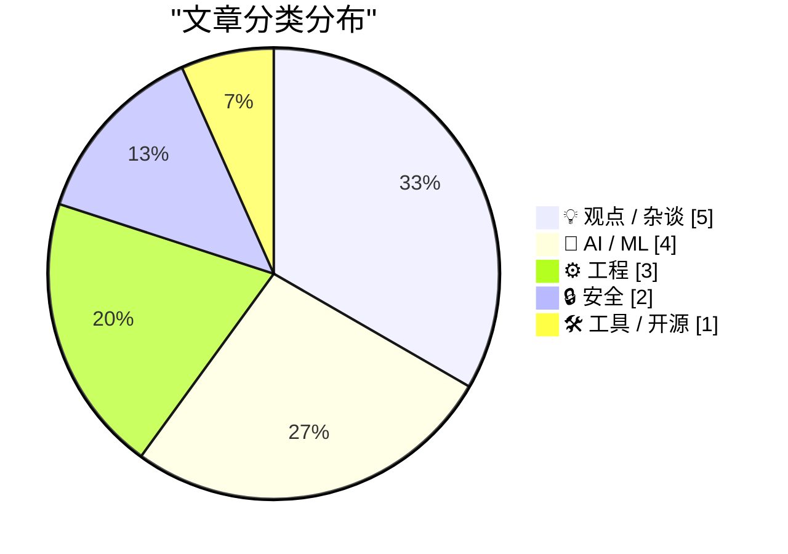
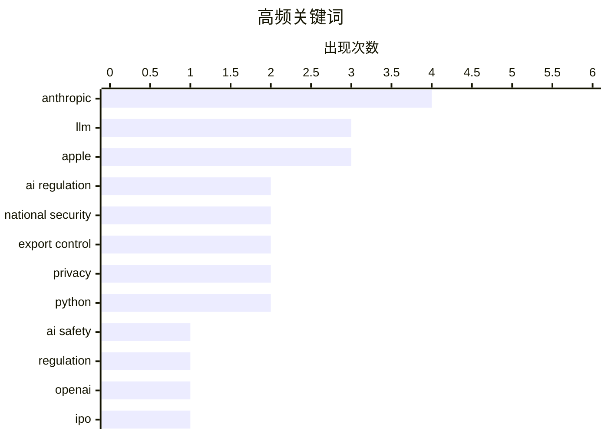

# 📰 Jun 14, 2026

> 来自 Karpathy 推荐的 92 个顶级技术博客，AI 精选 Top 15

## 📝 今日看点

今日技术圈聚焦 AI 领域的监管风暴与资本博弈，美国政府以国家安全为由对 Anthropic 顶级模型实施出口管制，标志着前沿 AI 正式进入“主权技术”时代。与此同时，OpenAI 与 Anthropic 在巨额亏损背景下开启上市进程，引发了业界对硅谷 AI 泡沫及早期投资者套现意图的深度质疑。在生态构建上，苹果与欧盟围绕 AI 准入的合规博弈，以及 Python 对 WASM 标准的深度集成，预示着 AI 基础设施正面临监管环境与技术标准的双重重构。

---

## 🏆 今日必读

🥇 **美国政府指令暂停 Fable 5 和 Mythos 5 的访问权限**

[Statement on the US government directive to suspend access to Fable 5 and Mythos 5](https://simonwillison.net/2026/Jun/13/us-government-directive-to-suspend-access/#atom-everything) — simonwillison.net · 1 天前 · 🤖 AI / ML

> 美国政府援引国家安全授权，发布了一项出口管制指令，禁止任何外国国民（包括 Anthropic 的外籍员工）访问其最先进的 Fable 5 和 Mythos 5 模型。受此突发指令影响，Anthropic 必须立即对全球所有客户禁用这两个模型以确保合规。该指令的范围涵盖了美国境内外的所有非美国公民，标志着 AI 监管已从软件出口转向对运行中模型访问权限的实时行政干预。目前，Anthropic 的其他模型暂未受到此次指令的影响。

💡 **为什么值得读**: 了解地缘政治如何直接干预顶尖 AI 模型的运行，以及出口管制对全球开发者和企业的即时影响。

🏷️ Anthropic, AI regulation, national security, export control

🥈 **美国政府以国家安全为由要求 Anthropic 关闭 Fable 5 和 Mythos 5 模型**

[U.S. Government Directs Anthropic to Shut Down Fable 5 and Mythos 5 Models on National Security Grounds](https://www.anthropic.com/news/fable-mythos-access) — daringfireball.net · 16 小时前 · 🤖 AI / ML

> Anthropic 官方宣布收到美国政府的出口管制指令，要求停止向所有外国国民提供 Fable 5 和 Mythos 5 的访问权限。为了严格执行该命令，Anthropic 不得不采取极端措施，直接对所有客户关停这两个顶级模型。这一限制不仅针对外部用户，甚至限制了 Anthropic 内部的非美籍员工。公司表示将配合政府要求，但目前其他基础模型仍维持正常服务。这是 AI 历史上首次因国家安全指令导致主流商用大模型被整体下架。

💡 **为什么值得读**: 关注 AI 行业里程碑式的监管事件，了解国家安全指令如何强制改变 AI 公司的产品分发策略。

🏷️ Anthropic, AI regulation, national security, LLM

🥉 **仅限美国人的“危险技术”**

[Dangerous Technology For Americans Only](https://lucumr.pocoo.org/2026/6/13/americans-only/) — lucumr.pocoo.org · 1 天前 · 🤖 AI / ML

> 针对 Anthropic 被政府要求禁封顶级模型的事件，科技圈出现了某种“幸灾乐祸”的情绪。Anthropic 领导层长期游说政府将 AI 视为极其危险的技术并要求严厉监管，如今政府采纳了这一逻辑并将其反作用于该公司。文章指出，这种将尖端 AI 视为武器的监管思路，最终导致了技术访问权限的国别隔离。作者认为，Anthropic 这种“作茧自缚”的行为反映了硅谷在安全叙事游说上的策略性失误。这种监管趋势可能导致未来顶尖技术仅能由特定国籍的人员掌握。

💡 **为什么值得读**: 深度剖析 AI 监管游说的反噬效应，探讨安全叙事如何演变为地缘政治限制。

🏷️ Anthropic, AI safety, export control, regulation

---

## 📊 数据概览

| 扫描源 | 抓取文章 | 时间范围 | 精选 |
|:---:|:---:|:---:|:---:|
| 82/92 | 2466 篇 → 31 篇 | 48h | **15 篇** |

### 分类分布



### 高频关键词



<details>
<summary>📈 纯文本关键词图（终端友好）</summary>

```
anthropic         │ ████████████████████ 4
llm               │ ███████████████░░░░░ 3
apple             │ ███████████████░░░░░ 3
ai regulation     │ ██████████░░░░░░░░░░ 2
national security │ ██████████░░░░░░░░░░ 2
export control    │ ██████████░░░░░░░░░░ 2
privacy           │ ██████████░░░░░░░░░░ 2
python            │ ██████████░░░░░░░░░░ 2
ai safety         │ █████░░░░░░░░░░░░░░░ 1
regulation        │ █████░░░░░░░░░░░░░░░ 1
```

</details>

### 🏷️ 话题标签

**anthropic**(4) · **llm**(3) · **apple**(3) · ai regulation(2) · national security(2) · export control(2) · privacy(2) · python(2) · ai safety(1) · regulation(1) · openai(1) · ipo(1) · silicon valley(1) · wwdc(1) · podcast(1) · tech industry(1) · eu(1) · dma(1) · siri ai(1) · google(1)

---

## 💡 观点 / 杂谈

### 1. 硅谷泡沫（第一部分）

[Premium: The Silicon Valley Bubble (Part 1)](https://www.wheresyoured.at/premium-the-silicon-valley-bubble-part-1/) — **wheresyoured.at** · 1 天前 · ⭐ 26/30

> OpenAI 和 Anthropic 已正式提交上市申请，开启了在巨额亏损背景下争夺退出流动性的竞赛。这两家公司每年烧掉数十亿美元，且目前仍未建立明确的盈利路径，上市被视为早期投资者在高点套现的手段。文章认为，这种在缺乏商业可持续性时强行上市的行为，预示着当前 AI 投资热潮可能正接近尾声。作者警告称，硅谷正在重演历史上的泡沫周期，而普通投资者可能成为最后的接盘者。这一阶段的标志是资本从关注技术创新转向关注如何从公众市场撤退。

🏷️ OpenAI, Anthropic, IPO, Silicon Valley

---

### 2. The Talk Show 现场版：WWDC 2026 专题讨论

[★ The Talk Show: Live From WWDC 2026](https://daringfireball.net/2026/06/the_talk_show_live_from_wwdc_2026) — **daringfireball.net** · 1 天前 · ⭐ 25/30

> 本期节目由 John Gruber 主持，邀请了 Joanna Stern 和 Nilay Patel 在圣何塞加州剧院现场录制，深度复盘 WWDC 2026。嘉宾们重点讨论了苹果发布的 Siri AI 及其对苹果生态系统的深远影响。讨论涵盖了苹果在隐私保护与 AI 功能落地之间的平衡策略，以及开发者对新 API 的初步反馈。作为年度开发者大会的深度解读，节目提供了关于苹果未来一年技术走向和产品逻辑的权威视角。现场观众的互动也反映了市场对苹果 AI 战略的真实预期。

🏷️ Apple, WWDC, podcast, tech industry

---

### 3. 股东至上主义与“预言家”型 CEO

[Pluralistic: Shareholder supremacy and the precog CEO (13 Jun 2026)](https://pluralistic.net/2026/06/13/minority-shareholder-report/) — **pluralistic.net** · 15 小时前 · ⭐ 24/30

> 文章探讨了现代企业治理中“股东至上”原则如何扭曲了 CEO 的决策逻辑。作者批评了那些试图通过预测未来市场走向来规避当前责任的“预言家”型 CEO，认为这种行为往往掩盖了对员工和社会的剥削。文中引用了多起法律案例，指出当前的监管环境过于偏袒少数股东利益，而忽视了长期价值。作者呼吁建立更明确的问责机制，以打破这种以短期股价为核心的恶性循环。这种治理模式被认为是对公共利益和企业长期健康发展的威胁。

🏷️ economics, tech monopoly, corporate governance, Cory Doctorow

---

### 4. 我永远无法完全拥抱用 LLM 写代码

[I can never fully embrace LLMs for code](https://idiallo.com/blog/i-can-never-embrace-llms-to-write-code) — **idiallo.com** · 1 天前 · ⭐ 23/30

> 软件开发的核心挑战在于管理复杂性，而理解代码的每一行逻辑是确保系统可维护性的前提。LLM 生成的代码虽然能快速运行，但往往缺乏上下文一致性，且容易引入开发者无法解释的“黑盒”逻辑。过度依赖 AI 辅助编程会导致开发者丧失对代码库的深度掌控，将编程从“创造性解决问题”降级为“对 AI 输出的盲目审计”。作者认为，真正的工程能力建立在对底层细节的透彻理解之上，而 LLM 的黑盒特性与这一原则背道而驰。

🏷️ LLM, coding, education, software development

---

### 5. 机器语言的人肉路由器

[Human Routers of Machine Words](https://borretti.me/article/human-routers-of-machine-words) — **borretti.me** · 1 天前 · ⭐ 23/30

> 现代知识工作者正逐渐演变为“人肉路由器”，其主要工作变成了在不同的 AI 模型和自动化工具之间传递、筛选和润色信息。这种模式虽然提高了产出速度，却削弱了人类进行深度思考和原创性构建的能力。文章指出，当人们习惯于让 AI 代替思考时，思维过程会变得碎片化，最终导致对复杂问题的理解流于表面。作者呼吁警惕这种“思维外包”现象，强调在 AI 时代保持独立思考和深度参与的重要性。

🏷️ AI, LLM, cognition, productivity

---

## 🤖 AI / ML

### 6. 美国政府指令暂停 Fable 5 和 Mythos 5 的访问权限

[Statement on the US government directive to suspend access to Fable 5 and Mythos 5](https://simonwillison.net/2026/Jun/13/us-government-directive-to-suspend-access/#atom-everything) — **simonwillison.net** · 1 天前 · ⭐ 26/30

> 美国政府援引国家安全授权，发布了一项出口管制指令，禁止任何外国国民（包括 Anthropic 的外籍员工）访问其最先进的 Fable 5 和 Mythos 5 模型。受此突发指令影响，Anthropic 必须立即对全球所有客户禁用这两个模型以确保合规。该指令的范围涵盖了美国境内外的所有非美国公民，标志着 AI 监管已从软件出口转向对运行中模型访问权限的实时行政干预。目前，Anthropic 的其他模型暂未受到此次指令的影响。

🏷️ Anthropic, AI regulation, national security, export control

---

### 7. 美国政府以国家安全为由要求 Anthropic 关闭 Fable 5 和 Mythos 5 模型

[U.S. Government Directs Anthropic to Shut Down Fable 5 and Mythos 5 Models on National Security Grounds](https://www.anthropic.com/news/fable-mythos-access) — **daringfireball.net** · 16 小时前 · ⭐ 26/30

> Anthropic 官方宣布收到美国政府的出口管制指令，要求停止向所有外国国民提供 Fable 5 和 Mythos 5 的访问权限。为了严格执行该命令，Anthropic 不得不采取极端措施，直接对所有客户关停这两个顶级模型。这一限制不仅针对外部用户，甚至限制了 Anthropic 内部的非美籍员工。公司表示将配合政府要求，但目前其他基础模型仍维持正常服务。这是 AI 历史上首次因国家安全指令导致主流商用大模型被整体下架。

🏷️ Anthropic, AI regulation, national security, LLM

---

### 8. 仅限美国人的“危险技术”

[Dangerous Technology For Americans Only](https://lucumr.pocoo.org/2026/6/13/americans-only/) — **lucumr.pocoo.org** · 1 天前 · ⭐ 26/30

> 针对 Anthropic 被政府要求禁封顶级模型的事件，科技圈出现了某种“幸灾乐祸”的情绪。Anthropic 领导层长期游说政府将 AI 视为极其危险的技术并要求严厉监管，如今政府采纳了这一逻辑并将其反作用于该公司。文章指出，这种将尖端 AI 视为武器的监管思路，最终导致了技术访问权限的国别隔离。作者认为，Anthropic 这种“作茧自缚”的行为反映了硅谷在安全叙事游说上的策略性失误。这种监管趋势可能导致未来顶尖技术仅能由特定国籍的人员掌握。

🏷️ Anthropic, AI safety, export control, regulation

---

### 9. 欧盟委员会回应 Siri AI 与《数字市场法案》的争议

[The European Commission Response to Siri AI and the DMA](https://www.linkedin.com/posts/thomas-regnier-24a05810b_what-is-the-true-story-behind-apples-decision-activity-7470439874664280064-TuEt) — **daringfireball.net** · 1 天前 · ⭐ 25/30

> 欧盟委员会发言人 Thomas Regnier 针对苹果不在欧盟推出“Siri AI”的决定作出回应，明确指出这是苹果单方面的商业决策。发言人强调，《数字市场法案》(DMA) 并不禁止苹果推出新功能，而是要求其确保公平竞争和互操作性。尽管双方曾就 Siri AI 进行过接触，但苹果并未提出符合合规要求的解决方案，而是选择了直接退出市场。这一表态反驳了苹果此前将功能缺失归咎于欧盟监管的说法。欧盟方面认为，苹果此举是试图利用消费者压力来规避监管义务。

🏷️ Apple, EU, DMA, Siri AI

---

## ⚙️ 工程

### 10. 向 PyPI 发布 WASM Wheel 包以支持 Pyodide

[Publishing WASM wheels to PyPI for use with Pyodide](https://simonwillison.net/2026/Jun/13/publishing-wasm-wheels/#atom-everything) — **simonwillison.net** · 9 小时前 · ⭐ 24/30

> Pyodide 314.0 版本正式发布，标志着 Python 生态对 WebAssembly (WASM) 的支持进入新阶段。根据 PEP 783 定义的 PyEmscripten 平台标准，开发者现在可以直接将为 Pyodide 构建的 WASM Wheel 包发布到 PyPI 官方仓库。这意味着用户可以使用标准的 pip 工具在浏览器环境或兼容的 Python 运行时中直接安装这些包。这一改进极大地简化了 Python 库在 Web 端的分发流程，提升了跨平台开发的便利性。此举有望加速 Python 在前端开发和无服务器计算中的应用普及。

🏷️ WASM, PyPI, Pyodide, Python

---

### 11. 苹果私有云计算（PCC）对第三方开发者的限制

[Apple’s Private Cloud Compute Is Severely Limited for Third-Party Developers](https://developer.apple.com/private-cloud-compute/) — **daringfireball.net** · 16 小时前 · ⭐ 24/30

> 苹果在开发者官网公布了私有云计算（PCC）的接入政策，旨在为应用提供具备隐私保护的尖端 AI 能力。目前，加入“App Store 小型企业计划”且首次下载量低于 200 万次的开发者可以免费调用 PCC 上的苹果基础模型。然而，这一政策对大型开发者或高流量应用设置了显著的门槛，且目前仅限于苹果自家的基础模型。这种限制反映了苹果在推广其隐私计算架构时，在成本控制与生态开放之间的权衡。开发者需要评估在达到下载量阈值后的潜在 API 成本风险。

🏷️ Apple, Private Cloud Compute, privacy, developer policy

---

### 12. 如何在线程池中以低延迟调度任务？

[How can I schedule work on a thread pool with low latency?](https://devblogs.microsoft.com/oldnewthing/20260612-00/?p=112417) — **devblogs.microsoft.com/oldnewthing** · 1 天前 · ⭐ 23/30

> Windows 线程池的设计初衷是优化整体吞吐量而非单个任务的调度延迟，因此默认情况下并不保证即时执行。当系统负载较高时，新任务可能在队列中等待可用线程，导致显著的调度延迟。要实现低延迟，开发者应使用 SetThreadpoolCallbackPriority 将任务优先级设为最高，或通过 SetThreadpoolThreadMaximum 预留足够的备用线程。Raymond Chen 强调，如果对延迟有极高要求，最可靠的方案是创建专用线程而非依赖共享线程池。

🏷️ Windows, thread pool, latency, performance

---

## 🔒 安全

### 13. 谷歌的新远程验证方案与旧方案一样糟糕

[Pluralistic: Google's new remote attestation scheme is every bit as terrible as its old remote attestation scheme (12 Jun 2026)](https://pluralistic.net/2026/06/12/compelled-speech/) — **pluralistic.net** · 1 天前 · ⭐ 25/30

> 谷歌推出了新的远程验证（Remote Attestation）方案，旨在通过硬件级别验证软件的完整性。Cory Doctorow 批评该方案本质上是另一种形式的数字权利管理（DRM），剥夺了用户对自有设备的控制权。文章指出，这种技术允许服务器拒绝与未运行“官方批准”软件的设备通信，严重损害了开放网络和互操作性。作者认为，谷歌此举是在强化其平台垄断，将“安全”作为限制用户自由和强迫言论的遮羞布。这种机制最终会导致用户无法在自己的硬件上运行未经厂商许可的第三方软件。

🏷️ Google, remote attestation, security, privacy

---

### 14. 关于漏洞命名与披露的联合指南

[Joint Guidance on Vulnerability Naming and Disclosure](https://nesbitt.io/2026/06/12/joint-guidance-on-vulnerability-naming-and-disclosure.html) — **nesbitt.io** · 1 天前 · ⭐ 23/30

> 漏洞命名和披露流程正趋向标准化，每个获得命名的 CVE 漏洞现在都配有一个位于 .vuln 顶级域名下的单页网站。这一举措旨在解决漏洞信息碎片化的问题，通过统一的入口提供技术细节、受影响版本及修复建议。该指南强调了跨组织协作的重要性，要求在披露过程中保持透明度并减少命名冲突。这种结构化的披露方式不仅提升了安全响应的速度，也为安全研究人员和运维人员提供了更权威的信息源。

🏷️ CVE, vulnerability disclosure, security standards

---

## 🛠 工具 / 开源

### 15. 插件系统案例研究：Pluggy

[Plugins case study: Pluggy](https://eli.thegreenplace.net/2026/plugins-case-study-pluggy/) — **eli.thegreenplace.net** · 6 小时前 · ⭐ 24/30

> Pluggy 是从 pytest 项目中提取出的独立 Python 库，专门用于构建高度可扩展的插件系统。它通过装饰器（@hookspec 和 @hookimpl）实现了一种基于钩子的解耦模式，允许主程序定义接口而插件提供具体实现。与传统的类继承或动态导入相比，Pluggy 支持 1:N 的钩子调用模式，并提供了精细的执行顺序控制（如 tryfirst 和 trylast）。这种设计不仅支撑了 pytest 极其丰富的生态系统，也为其他需要高度定制化的 Python 项目提供了成熟的架构参考。

🏷️ Python, plugin system, pytest, software architecture

---

*生成于 2026-06-14 09:49 | 扫描 82 源 → 获取 2466 篇 → 精选 15 篇*
*基于 [Hacker News Popularity Contest 2025](https://refactoringenglish.com/tools/hn-popularity/) RSS 源列表，由 [Andrej Karpathy](https://x.com/karpathy) 推荐*
