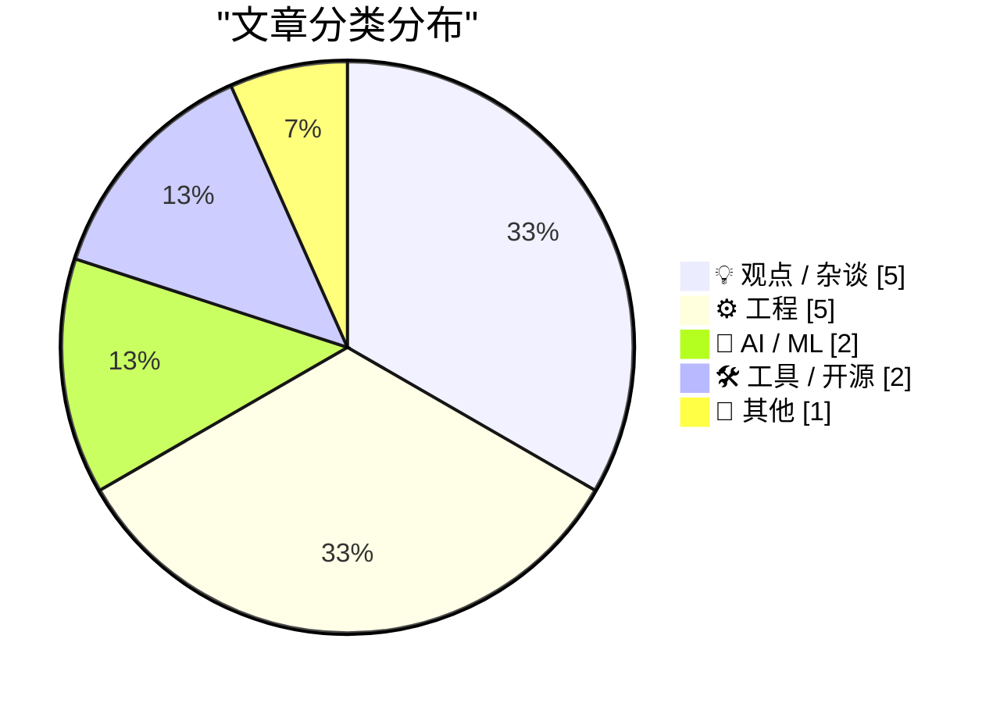
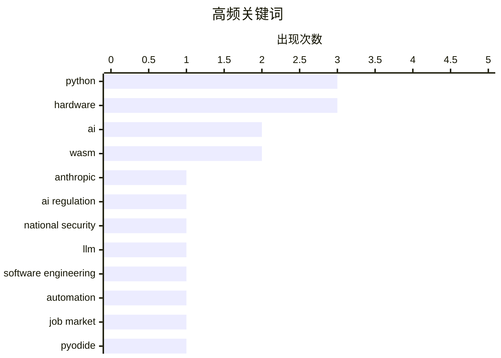

# 📰 Jun 15, 2026

> 来自 Karpathy 推荐的 92 个顶级技术博客，AI 精选 Top 15

## 📝 今日看点

今日技术圈呈现出监管收紧与生态重构的双重趋势。美国政府对 Anthropic 核心模型的出口管制再次将 AI 安全推向风口浪尖，而 AI 代理深度介入开源社区则引发了关于技术信任与工程师价值的广泛讨论。与此同时，WASM 技术的持续演进正加速 Python 等传统语言向 Web 平台的迁移，为跨平台开发注入了新的技术活力。

---

## 🏆 今日必读

🥇 **美国政府以国家安全为由要求 Anthropic 关闭 Fable 5 和 Mythos 5 模型**

[U.S. Government Directs Anthropic to Shut Down Fable 5 and Mythos 5 Models on National Security Grounds](https://www.anthropic.com/news/fable-mythos-access) — daringfireball.net · 1 天前 · 🤖 AI / ML

> 美国政府依据国家安全授权发布了一项出口管制指令，要求 Anthropic 立即停止所有外国公民（包括其内部外籍员工）对 Fable 5 和 Mythos 5 模型的访问。受此指令影响，Anthropic 必须对全球所有客户强制禁用这两个模型以确保合规。目前该限制仅针对 Fable 5 和 Mythos 5，Anthropic 的其他模型访问暂不受影响。这一突发举措凸显了地缘政治对前沿 AI 模型分发的直接干预，甚至波及到了公司内部的研发协作。

💡 **为什么值得读**: 了解地缘政治和出口管制如何直接导致顶级 AI 模型被强制下架的罕见案例。

🏷️ Anthropic, AI regulation, national security, LLM

🥈 **为什么 AI 还没有取代软件工程师，而且将来也不会**

[Why AI hasn’t replaced software engineers, and won’t](https://simonwillison.net/2026/Jun/14/why-ai-hasnt-replaced-software-engineers/#atom-everything) — simonwillison.net · 12 小时前 · 💡 观点 / 杂谈

> Arvind Narayanan 和 Sayash Kapoor 针对 AI 导致大规模失业的论调进行了反驳，并以软件工程这一最易受 AI 冲击的行业作为观察窗口。文章指出，尽管 AI 能力在不断提升，但目前尚无证据支持“AI 能力达到特定阈值就会导致大规模裁员”的叙事。作者认为软件开发涉及复杂的上下文理解、决策和协作，这些是当前生成式 AI 难以完全替代的。结论是 AI 更多是作为生产力工具而非人类工程师的完全替代品。

💡 **为什么值得读**: 深入探讨 AI 对就业市场影响的理性分析，有助于缓解开发者对“被替代”的焦虑。

🏷️ AI, software engineering, automation, job market

🥉 **向 PyPI 发布 WASM Wheel 以供 Pyodide 使用**

[Publishing WASM wheels to PyPI for use with Pyodide](https://simonwillison.net/2026/Jun/13/publishing-wasm-wheels/#atom-everything) — simonwillison.net · 1 天前 · 🛠 工具 / 开源

> Pyodide 314.0 版本正式支持将针对 Pyodide 或兼容 PEP 783 标准的 PyEmscripten 平台构建的 Python 包直接发布到 PyPI。这意味着开发者可以像安装普通 Python 包一样，在浏览器环境或 WASM 运行时中直接安装这些预编译的二进制包。此举极大地简化了 WASM 生态中 Python 库的分发流程，不再需要复杂的自定义托管方案。该功能标志着 Python 在 Web 平台的可移植性迈出了重要一步。

💡 **为什么值得读**: 关注 Python Web 生态的开发者必读，了解如何利用 PEP 783 简化 WASM 库的分发。

🏷️ Python, WASM, Pyodide, PyPI

---

## 📊 数据概览

| 扫描源 | 抓取文章 | 时间范围 | 精选 |
|:---:|:---:|:---:|:---:|
| 81/92 | 2455 篇 → 20 篇 | 48h | **15 篇** |

### 分类分布



### 高频关键词



<details>
<summary>📈 纯文本关键词图（终端友好）</summary>

```
python               │ ████████████████████ 3
hardware             │ ████████████████████ 3
ai                   │ █████████████░░░░░░░ 2
wasm                 │ █████████████░░░░░░░ 2
anthropic            │ ███████░░░░░░░░░░░░░ 1
ai regulation        │ ███████░░░░░░░░░░░░░ 1
national security    │ ███████░░░░░░░░░░░░░ 1
llm                  │ ███████░░░░░░░░░░░░░ 1
software engineering │ ███████░░░░░░░░░░░░░ 1
automation           │ ███████░░░░░░░░░░░░░ 1
```

</details>

### 🏷️ 话题标签

**python**(3) · **hardware**(3) · **ai**(2) · wasm(2) · anthropic(1) · ai regulation(1) · national security(1) · llm(1) · software engineering(1) · automation(1) · job market(1) · pyodide(1) · pypi(1) · apple(1) · private cloud compute(1) · ios(1) · cloud(1) · plugin system(1) · pytest(1) · software architecture(1)

---

## 💡 观点 / 杂谈

### 1. 为什么 AI 还没有取代软件工程师，而且将来也不会

[Why AI hasn’t replaced software engineers, and won’t](https://simonwillison.net/2026/Jun/14/why-ai-hasnt-replaced-software-engineers/#atom-everything) — **simonwillison.net** · 12 小时前 · ⭐ 25/30

> Arvind Narayanan 和 Sayash Kapoor 针对 AI 导致大规模失业的论调进行了反驳，并以软件工程这一最易受 AI 冲击的行业作为观察窗口。文章指出，尽管 AI 能力在不断提升，但目前尚无证据支持“AI 能力达到特定阈值就会导致大规模裁员”的叙事。作者认为软件开发涉及复杂的上下文理解、决策和协作，这些是当前生成式 AI 难以完全替代的。结论是 AI 更多是作为生产力工具而非人类工程师的完全替代品。

🏷️ AI, software engineering, automation, job market

---

### 2. 股东至上主义与“预言家”首席执行官

[Pluralistic: Shareholder supremacy and the precog CEO (13 Jun 2026)](https://pluralistic.net/2026/06/13/minority-shareholder-report/) — **pluralistic.net** · 1 天前 · ⭐ 21/30

> Cory Doctorow 在本文中批判了现代企业中“股东至上”的教条，以及 CEO 们如何利用不可证伪的预测来操纵决策。文章串联了多个案例，包括微软与 Linux 极客的博弈、詹姆斯·乔伊斯遗产继承纠纷以及 iPod 代工厂的劳工问题。作者指出，这种经济模式往往导致短期利益牺牲了长期的技术多样性和员工权益。此外，文中还提及了《ACCESS 法案》等旨在打破科技巨头垄断的法律尝试。

🏷️ corporate governance, tech ethics, Microsoft, Linux

---

### 3. AI 代理向主流开源项目提交 PR 并通过冷启动接触维护者

[Things that made me think: Open Source trust relationships, knowledge without provenance, and theory building](https://tomrenner.com/posts/ttmmt-4/) — **tomrenner.com** · 12 小时前 · ⭐ 21/30

> 随着 AI 代理开始自动向主流开源项目提交拉取请求（PR），开源社区的信任关系正面临前所未有的挑战。这些 AI 代理甚至会通过冷启动邮件直接联系维护者，试图推销其生成的代码。文章探讨了这种现象带来的“无出处知识”问题，即代码虽然可行但缺乏人类开发者的逻辑推演过程。这不仅增加了维护者的审核负担，还可能破坏开源协作中长期建立的信誉体系。

🏷️ open source, AI, trust, theory building

---

### 4. Troy Hunt 每周更新 508 期

[Weekly Update 508](https://www.troyhunt.com/weekly-update-508/) — **troyhunt.com** · 7 小时前 · ⭐ 19/30

> 网络安全专家 Troy Hunt 在本期更新中分享了他在智能家居选型上的困扰，特别是寻找符合“非状态保持（按钮式）”且“美观”标准的智能电灯开关。他指出，市面上大多数产品难以在物理触感、工业设计与智能集成之间达成平衡。除了家居自动化话题，周报通常还涵盖了 Have I Been Pwned 的最新数据加载情况及近期的重大安全漏洞分析。文章反映了技术专家在追求极致用户体验时对硬件细节的严苛要求。这种跨界讨论将日常生活中的 UX 设计与复杂的技术架构思考联系在了一起。

🏷️ IoT, home automation, Troy Hunt

---

### 5. 引用 Julia Evans：为一个人而写

[Quoting Julia Evans](https://simonwillison.net/2026/Jun/15/julia-evans/#atom-everything) — **simonwillison.net** · 10 小时前 · ⭐ 18/30

> Simon Willison 引用了知名技术博主 Julia Evans 关于提升写作质量的核心心法：在创作时“为一个人而写”。这种策略建议作者不要面对模糊的大众，而是想象一个具体的读者，例如“三年前的自己”或某个特定的朋友。通过这种具象化的目标设定，作者能更精准地把握解释的深度、语气和技术细节，避免内容陷入广而不精的困境。这种方法不仅能降低写作时的心理压力，还能让技术文章更具共鸣和实用性。它是解决技术写作中受众定位模糊问题的有效工具。

🏷️ technical writing, blogging, communication

---

## ⚙️ 工程

### 6. 苹果私有云计算（PCC）对第三方开发者限制较多

[Apple’s Private Cloud Compute Is Severely Limited for Third-Party Developers](https://developer.apple.com/private-cloud-compute/) — **daringfireball.net** · 1 天前 · ⭐ 24/30

> 苹果宣布加入“App Store 小型企业计划”且首次下载量低于 200 万次的开发者，可以免费使用运行在私有云计算（PCC）上的苹果基础模型。该方案旨在让小型开发者在无需支付云端 API 费用的情况下，获得具有极高隐私保护能力的尖端智能支持。然而，对于下载量超过此门槛的大型开发者，目前尚无明确的成本方案或接入细节。PCC 强调通过硬件级隔离确保用户数据隐私，是苹果 AI 战略的核心安全底座。

🏷️ Apple, Private Cloud Compute, iOS, cloud

---

### 7. 插件系统案例研究：Pluggy

[Plugins case study: Pluggy](https://eli.thegreenplace.net/2026/plugins-case-study-pluggy/) — **eli.thegreenplace.net** · 1 天前 · ⭐ 23/30

> Pluggy 是一个专门用于构建插件系统的 Python 库，最初作为 pytest 项目的核心组件开发，后被提取为独立库。它支持定义钩子（hooks）规范、实现插件注册以及管理复杂的调用顺序。文章通过案例研究展示了 Pluggy 如何通过解耦核心逻辑与扩展功能，支撑起 pytest 极其丰富的插件生态。对于需要为自己的 Python 应用设计可扩展架构的开发者，Pluggy 提供了一套经过生产环境验证的成熟方案。

🏷️ Python, plugin system, pytest, software architecture

---

### 8. 英特尔 8087 浮点芯片核心的加法器

[The adder at the heart of Intel's 8087 floating-point chip](http://www.righto.com/feeds/3050107772739337632/comments/default) — **righto.com** · 1 天前 · ⭐ 22/30

> 1980 年发布的 Intel 8087 浮点协处理器曾将数学运算速度提升了 100 倍，其核心是一个复杂的 69 位加法器。这个加法器不仅负责基础算术和平方根运算，还是计算正切、指数和对数等超越函数的核心“纳米机器”。文章深入解析了该芯片的内部架构，包括加法器与其相关的寄存器、移位器和控制电路的协作方式。通过对这一历史性硬件的逆向分析，展示了早期高性能计算芯片在有限晶体管资源下的极致设计。

🏷️ Intel 8087, hardware, CPU architecture, floating-point

---

### 9. 将 SQLite 查询结果列映射回原始表和列

[Mapping SQLite result columns back to their source `table.column`](https://simonwillison.net/2026/Jun/13/sqlite-column-provenance/#atom-everything) — **simonwillison.net** · 1 天前 · ⭐ 20/30

> SQLite 默认查询结果仅返回列名，难以在复杂查询中追溯数据的来源表。Simon Willison 探索了利用 SQLite 的 `column_origin_name`、`table_origin_name` 和 `database_origin_name` 等元数据 API 来解决这一问题。该方案要求在编译 SQLite 时开启 `SQLITE_ENABLE_COLUMN_METADATA` 选项，从而允许程序识别 `SELECT` 语句中每一列对应的源数据库、表和原始列名。通过这种映射，Datasette 等工具可以为任意 SQL 查询结果自动生成指向原始数据行的链接。这为构建具有深度交互能力的通用数据库 UI 提供了底层技术支撑。

🏷️ SQLite, SQL, database, Datasette

---

### 10. 打造一台集串口与 VGA 于一体的“万能控制台”

[Building a serial and VGA "everything console"](https://oldvcr.blogspot.com/feeds/7900423283602789203/comments/default) — **oldvcr.blogspot.com** · 1 天前 · ⭐ 19/30

> 针对频繁调试串口设备时搬运 CRT 终端或占用笔记本电脑的不便，作者 DIY 了一款便携式、自给自足的硬件控制台。该项目旨在通过集成廉价 LCD 屏幕、串口转 USB/TTL 模块以及必要的驱动电路，替代昂贵的商业一体化终端。文章详细记录了从解决“设备太重”痛点到选型组装的思考过程，强调了低成本 DIY 方案在灵活性上的优势。这种“万能控制台”不仅提升了实验室调试效率，还通过复用旧硬件实现了高度定制化。最终成品为处理旧系统和嵌入式设备提供了一个轻量化的物理交互界面。

🏷️ hardware, serial console, VGA, DIY

---

## 🤖 AI / ML

### 11. 美国政府以国家安全为由要求 Anthropic 关闭 Fable 5 和 Mythos 5 模型

[U.S. Government Directs Anthropic to Shut Down Fable 5 and Mythos 5 Models on National Security Grounds](https://www.anthropic.com/news/fable-mythos-access) — **daringfireball.net** · 1 天前 · ⭐ 27/30

> 美国政府依据国家安全授权发布了一项出口管制指令，要求 Anthropic 立即停止所有外国公民（包括其内部外籍员工）对 Fable 5 和 Mythos 5 模型的访问。受此指令影响，Anthropic 必须对全球所有客户强制禁用这两个模型以确保合规。目前该限制仅针对 Fable 5 和 Mythos 5，Anthropic 的其他模型访问暂不受影响。这一突发举措凸显了地缘政治对前沿 AI 模型分发的直接干预，甚至波及到了公司内部的研发协作。

🏷️ Anthropic, AI regulation, national security, LLM

---

### 12. AI GPU 的寿命可能远超三年

[AI GPUs probably live longer than three years](https://seangoedecke.com/ai-gpus-live-longer-than-three-years/) — **seangoedecke.com** · 12 小时前 · ⭐ 22/30

> 针对“推理 GPU 在高负载下寿命仅有 1-3 年”的流行观点，作者提出了质疑，认为这一说法缺乏数据支持且过于悲观。文章指出，AI 行业的可持续性往往被硬件损耗率所左右，但实际数据中心的环境控制和 GPU 的耐用性通常能支撑更久的使用周期。如果 GPU 寿命确实较长，那么 AI 基础设施的折旧成本将大幅降低，从而改变对 AI 泡沫的经济评估。作者认为，目前关于硬件快速报废的论调更多是基于特定极端案例而非普遍规律。

🏷️ GPU, hardware, AI infrastructure, data center

---

## 🛠 工具 / 开源

### 13. 向 PyPI 发布 WASM Wheel 以供 Pyodide 使用

[Publishing WASM wheels to PyPI for use with Pyodide](https://simonwillison.net/2026/Jun/13/publishing-wasm-wheels/#atom-everything) — **simonwillison.net** · 1 天前 · ⭐ 25/30

> Pyodide 314.0 版本正式支持将针对 Pyodide 或兼容 PEP 783 标准的 PyEmscripten 平台构建的 Python 包直接发布到 PyPI。这意味着开发者可以像安装普通 Python 包一样，在浏览器环境或 WASM 运行时中直接安装这些预编译的二进制包。此举极大地简化了 WASM 生态中 Python 库的分发流程，不再需要复杂的自定义托管方案。该功能标志着 Python 在 Web 平台的可移植性迈出了重要一步。

🏷️ Python, WASM, Pyodide, PyPI

---

### 14. luau-wasm 0.1a0 版本发布

[luau-wasm 0.1a0](https://simonwillison.net/2026/Jun/13/luau-wasm/#atom-everything) — **simonwillison.net** · 1 天前 · ⭐ 20/30

> Simon Willison 发布了 luau-wasm 的 0.1a0 预览版，这是一个将 Luau（Roblox 开发的 Lua 衍生语言）编译为 WebAssembly 的项目。该版本采用了最新的 PEP 783 标准，通过 WASM Wheel 格式发布到 PyPI，使其可以直接在 Pyodide 环境中运行。开发者现在可以轻松地在浏览器端的 Python 环境中集成高性能的 Luau 脚本引擎。这不仅是 luau-wasm 的里程碑，也是 WASM 生态分发新模式的一次成功实践。

🏷️ Luau, WASM, Python, release

---

## 📝 其他

### 15. 从挂机键到坟墓：AT&T 的兴衰史

[from hookswitch to grave](https://computer.rip/2026-06-14-hookswitch-to-grave.html) — **computer.rip** · 1 天前 · ⭐ 19/30

> 本文深入剖析了 AT&T 错综复杂的企业史，探讨了这家曾与美国联邦政府规模相当的巨头如何通过垄断和垂直整合统治通信行业。文章追溯了从早期电话交换技术到贝尔系统解体的历程，分析了贝尔实验室、西方电气与电信服务之间的紧密耦合关系。作者认为，AT&T 的成功源于其对“普遍服务”愿景的追求以及对整个技术栈的绝对控制。这种垂直集成模式虽然推动了技术进步，但也引发了长达数十年的反垄断博弈。通过对这段历史的回顾，读者可以理解现代通信架构背后的制度基因与商业逻辑。

🏷️ AT&T, telecommunications, history

---

*生成于 2026-06-15 12:33 | 扫描 81 源 → 获取 2455 篇 → 精选 15 篇*
*基于 [Hacker News Popularity Contest 2025](https://refactoringenglish.com/tools/hn-popularity/) RSS 源列表，由 [Andrej Karpathy](https://x.com/karpathy) 推荐*
