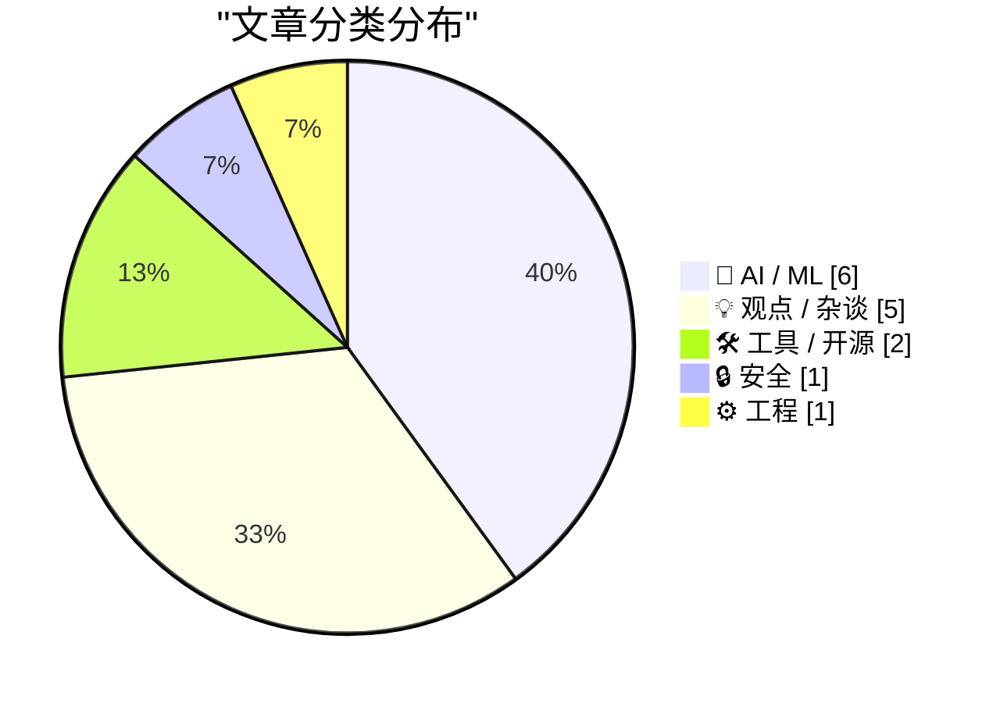
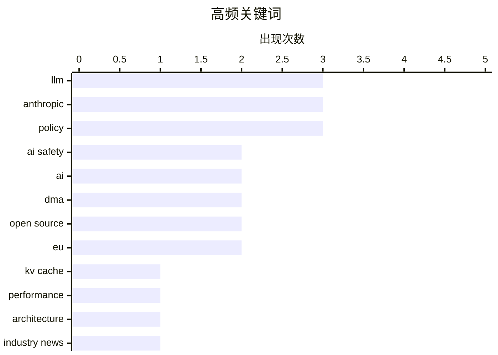

# 📰 Jun 16, 2026

> 来自 Karpathy 推荐的 92 个顶级技术博客，AI 精选 Top 15

## 📝 今日看点

今日技术圈的核心议题聚焦于 AI 产业的经济阵痛与监管博弈。OpenAI 惊人的亏损数据与“破碎的经济学”现状，揭示了高昂算力成本下大模型商业化面临的严峻财务挑战。与此同时，Anthropic 模型下线引发的出口管制争议及欧盟对谷歌的裁定，标志着政策干预正深度重塑技术竞争格局。在底层演进方面，从 KV Cache 优化到智能体自主注册协议的发布，AI 正在从单纯的文本生成向更高效、更具自主性的系统级应用跨越。

---

## 🏆 今日必读

🥇 **KV Cache 压缩技术演进简史**

[A brief history of KV cache compression developments](https://martinalderson.com/posts/a-brief-history-of-kv-cache-compression-developments/?utm_source=rss&amp;utm_medium=rss&amp;utm_campaign=feed) — martinalderson.com · 1 天前 · 🤖 AI / ML

> KV Cache 的显存占用是制约大模型处理长文本能力的核心瓶颈。技术演进经历了从 Multi-Query Attention (MQA) 到 Grouped-Query Attention (GQA) 的过渡，再到 DeepSeek 提出的 Multi-head Latent Attention (MLA) 显著降低了推理开销。此外，线性注意力（Linear Attention）混合架构也在尝试突破二次方复杂度限制。这些压缩技术的进步使得现代 AI Agent 能够处理超长上下文窗口，从而实现复杂的任务规划。

💡 **为什么值得读**: 深入浅出地梳理了让大模型“长记性”的关键底层技术演进路径，是理解长文本模型性能优化的必读综述。

🏷️ LLM, KV cache, performance, architecture

🥈 **“他们坑了我们”：性格冲突导致 Anthropic 模型下线**

["They screwed us": Personality clashes sent Anthropic's models offline](https://simonwillison.net/2026/Jun/15/axios-clashes-anthropics/#atom-everything) — simonwillison.net · 20 小时前 · 🤖 AI / ML

> Anthropic 的模型下线事件并非纯粹的技术故障，而是源于公司高层与美国政府官员之间的激烈性格冲突。Axios 的深度报道披露了关于出口管制政策（Mythos/Fable）背后的权力博弈和内部矛盾。政府消息人士与 Anthropic 内部人士对管制力度的分歧直接影响了模型的可用性。这一事件凸显了地缘政治和行政干预对顶尖 AI 实验室运营的深远影响。

💡 **为什么值得读**: 揭秘 AI 巨头与政府监管之间鲜为人知的“宫斗”内幕及其对技术落地的直接影响。

🏷️ Anthropic, AI safety, policy, industry news

🥉 **独家：OpenAI 2025 年亏损增长近 8 倍，支出高达 340 亿美元**

[Exclusive: OpenAI Losses Increased Nearly 8X in 2025, With Spending Hitting $34 Billion](https://www.wheresyoured.at/exclusive-openai-financials/) — wheresyoured.at · 7 小时前 · 🤖 AI / ML

> OpenAI 在 2025 年面临严峻的财务挑战，年度支出飙升至 340 亿美元，亏损额较往年增长近 8 倍。高昂的算力成本、人才竞争以及持续的模型研发投入是导致巨额支出的主因。尽管营收也在增长，但入不敷出的局面引发了外界对其商业模式可持续性的质疑。这种“烧钱换增长”的模式正面临资本市场更严苛的审视。

💡 **为什么值得读**: 用触目惊心的财务数据揭示了生成式 AI 竞赛背后极高的资金门槛与经营压力。

🏷️ OpenAI, business, AI economics, finance

---

## 📊 数据概览

| 扫描源 | 抓取文章 | 时间范围 | 精选 |
|:---:|:---:|:---:|:---:|
| 80/92 | 2424 篇 → 29 篇 | 48h | **15 篇** |

### 分类分布



### 高频关键词



<details>
<summary>📈 纯文本关键词图（终端友好）</summary>

```
llm         │ ████████████████████ 3
anthropic   │ ████████████████████ 3
policy      │ ████████████████████ 3
ai safety   │ █████████████░░░░░░░ 2
ai          │ █████████████░░░░░░░ 2
dma         │ █████████████░░░░░░░ 2
open source │ █████████████░░░░░░░ 2
eu          │ █████████████░░░░░░░ 2
kv cache    │ ███████░░░░░░░░░░░░░ 1
performance │ ███████░░░░░░░░░░░░░ 1
```

</details>

### 🏷️ 话题标签

**llm**(3) · **anthropic**(3) · **policy**(3) · ai safety(2) · ai(2) · dma(2) · open source(2) · eu(2) · kv cache(1) · performance(1) · architecture(1) · industry news(1) · openai(1) · business(1) · ai economics(1) · finance(1) · software engineering(1) · job market(1) · automation(1) · economics(1)

---

## 🤖 AI / ML

### 1. KV Cache 压缩技术演进简史

[A brief history of KV cache compression developments](https://martinalderson.com/posts/a-brief-history-of-kv-cache-compression-developments/?utm_source=rss&amp;utm_medium=rss&amp;utm_campaign=feed) — **martinalderson.com** · 1 天前 · ⭐ 27/30

> KV Cache 的显存占用是制约大模型处理长文本能力的核心瓶颈。技术演进经历了从 Multi-Query Attention (MQA) 到 Grouped-Query Attention (GQA) 的过渡，再到 DeepSeek 提出的 Multi-head Latent Attention (MLA) 显著降低了推理开销。此外，线性注意力（Linear Attention）混合架构也在尝试突破二次方复杂度限制。这些压缩技术的进步使得现代 AI Agent 能够处理超长上下文窗口，从而实现复杂的任务规划。

🏷️ LLM, KV cache, performance, architecture

---

### 2. “他们坑了我们”：性格冲突导致 Anthropic 模型下线

["They screwed us": Personality clashes sent Anthropic's models offline](https://simonwillison.net/2026/Jun/15/axios-clashes-anthropics/#atom-everything) — **simonwillison.net** · 20 小时前 · ⭐ 26/30

> Anthropic 的模型下线事件并非纯粹的技术故障，而是源于公司高层与美国政府官员之间的激烈性格冲突。Axios 的深度报道披露了关于出口管制政策（Mythos/Fable）背后的权力博弈和内部矛盾。政府消息人士与 Anthropic 内部人士对管制力度的分歧直接影响了模型的可用性。这一事件凸显了地缘政治和行政干预对顶尖 AI 实验室运营的深远影响。

🏷️ Anthropic, AI safety, policy, industry news

---

### 3. 独家：OpenAI 2025 年亏损增长近 8 倍，支出高达 340 亿美元

[Exclusive: OpenAI Losses Increased Nearly 8X in 2025, With Spending Hitting $34 Billion](https://www.wheresyoured.at/exclusive-openai-financials/) — **wheresyoured.at** · 7 小时前 · ⭐ 26/30

> OpenAI 在 2025 年面临严峻的财务挑战，年度支出飙升至 340 亿美元，亏损额较往年增长近 8 倍。高昂的算力成本、人才竞争以及持续的模型研发投入是导致巨额支出的主因。尽管营收也在增长，但入不敷出的局面引发了外界对其商业模式可持续性的质疑。这种“烧钱换增长”的模式正面临资本市场更严苛的审视。

🏷️ OpenAI, business, AI economics, finance

---

### 4. 引用《大西洋月刊》Matteo Wong：Fable 越狱真相

[Quoting Matteo Wong, The Atlantic](https://simonwillison.net/2026/Jun/16/matteo-wong-the-atlantic/#atom-everything) — **simonwillison.net** · 8 小时前 · ⭐ 23/30

> 关于 Anthropic 模型 Fable 被禁的真相逐渐浮出水面，核心在于一份白宫关于“越狱”的报告。网络安全专家评估认为，该报告记录的操作实质上是 IT 专家引导模型进行漏洞扫描与补丁编写。这种行为在安全领域属于常规操作，却被监管机构解读为具有潜在风险的突破。这一争议引发了关于 AI 安全边界界定以及政府如何评估模型风险的广泛讨论。

🏷️ Anthropic, export control, AI regulation

---

### 5. 欧盟委员会裁定谷歌在 Android 中集成 Gemini 违反《数字市场法案》

[The European Commission Ruled Months Ago That Google’s Integration of Gemini in Android Violates the DMA](https://arstechnica.com/ai/2026/04/europe-could-force-google-to-open-android-to-other-ai-assistants/) — **daringfireball.net** · 16 小时前 · ⭐ 23/30

> 欧盟监管机构裁定谷歌在 Android 系统中强制集成 Gemini AI 助手的行为违反了《数字市场法案》（DMA）。为了确保公平竞争，谷歌可能被强制要求向第三方 AI 助手开放系统级权限，包括热词唤醒和物理按键调用。此外，第三方 AI 还应获准访问屏幕上下文和本地数据，以提供主动建议。这一裁决将打破手机厂商对系统级 AI 体验的垄断，为其他 AI 开发者提供更多机会。

🏷️ Google, Gemini, DMA, Android

---

### 6. 四元数旋转、Claude 与 Lean 形式化证明

[Quaternion Rotations, Claude, and Lean](https://www.johndcook.com/blog/2026/06/15/quaternions-claude-lean/) — **johndcook.com** · 15 小时前 · ⭐ 22/30

> 作者通过测试 Claude 3.5 Sonnet 模型，验证其是否能发现一年前关于四元数与旋转矩阵转换博客中的特定拼写错误。实验发现 AI 在处理复杂的数学公式转换时具有一定的纠错潜力，但也揭示了其在逻辑严密性上的局限。文章进一步探讨了使用 Lean 这种形式化验证语言来确保数学推导准确性的必要性。这种结合 AI 辅助与形式化证明的方法，为提升技术文档和数学代码的可靠性提供了新思路。最终结论是，虽然 AI 能提供帮助，但严谨的数学验证仍需依赖 Lean 等专业工具。

🏷️ Claude, LLM, Lean, quaternions

---

## 💡 观点 / 杂谈

### 7. 为什么 AI 没有也不会取代软件工程师

[Why AI hasn’t replaced software engineers, and won’t](https://simonwillison.net/2026/Jun/14/why-ai-hasnt-replaced-software-engineers/#atom-everything) — **simonwillison.net** · 1 天前 · ⭐ 25/30

> 尽管 AI 在代码生成方面表现出色，但软件工程的本质远超单纯的编码。Arvind Narayanan 等专家指出，软件开发涉及复杂的系统设计、需求理解及长期的维护责任，这些是当前 AI 无法胜任的。目前没有证据表明 AI 达到了导致大规模失业的技术阈值。相反，AI 更多是作为生产力工具辅助工程师，而非完全替代人类的决策与架构能力。

🏷️ AI, software engineering, job market, automation

---

### 8. AI 破碎的经济学

[AI's Brokenomics](https://www.wheresyoured.at/brokenomics/) — **wheresyoured.at** · 15 小时前 · ⭐ 25/30

> 当前 AI 产业的经济逻辑存在严重缺陷，即“破碎的经济学”。英伟达等硬件厂商赚取了绝大部分利润，而 Anthropic 等模型开发商则面临极高的运营成本与不确定的盈利路径。文章深入分析了这种利益分配失衡如何威胁整个生态系统的长期健康。如果模型应用层无法产生足以覆盖算力成本的价值，AI 泡沫可能面临破裂风险。

🏷️ AI, economics, NVIDIA, sustainability

---

### 9. Anthropic 的安全超能力

[‘Anthropic’s Safety Superpower’](https://stratechery.com/2026/anthropics-safety-superpower/) — **daringfireball.net** · 18 小时前 · ⭐ 22/30

> Anthropic 正在利用“安全”作为竞争护城河，其政策显示出其不希望除自己以外的任何公司开发前沿大语言模型（Frontier LLMs）。在与美国国防部就 Claude 的使用权限发生争执仅两个月后，该公司便实施了更为严格的限制措施。这种做法引发了对其真实动机的质疑：究竟是为了 AI 安全，还是为了通过政策手段削弱竞争对手。Ben Thompson 指出，Anthropic 的立场实际上是在暗示只有他们才具备安全开发顶级 AI 的资格。这种将安全叙事与商业排他性绑定的策略，正在重塑 AI 行业的竞争格局。

🏷️ Anthropic, AI safety, LLM, competition

---

### 10. 《华盛顿邮报》评欧盟数字市场法案（DMA）的荒谬

[The Washington Post on the EU’s DMA Folly](https://www.washingtonpost.com/opinions/2026/06/14/apple-withholding-siri-ai-europe-is-another-dma-failure/) — **daringfireball.net** · 9 小时前 · ⭐ 21/30

> 苹果公司因欧盟《数字市场法案》（DMA）的限制，决定暂不在欧洲市场推出新版 Siri AI 功能。DMA 要求苹果在发布 AI 代理时，必须允许竞争对手的 AI 代理获得同等的系统级访问权限，包括用户的消息、文件和聊天记录。苹果认为这种强制性的互操作性要求会破坏其软件安全层，导致用户隐私面临风险。这一僵局凸显了监管政策在推动竞争与保护用户隐私、技术创新之间的剧烈冲突。文章认为，欧盟的监管方式可能适得其反，导致欧洲用户无法享受最新的 AI 技术成果。

🏷️ EU, DMA, Apple, regulation

---

### 11. 欧盟与公民社会需在数字自主权上取得实质进展

[EU & Civil Society need to progress on Digital Autonomy](https://berthub.eu/articles/posts/eu-civil-society-need-progress-digital-autonomy/) — **berthub.eu** · 22 小时前 · ⭐ 21/30

> 欧盟关于数字自主权（Digital Autonomy）或数字主权的讨论目前陷入了循环，亟需从单纯的立法和价值观探讨转向实质性的技术进步。公民社会和智库在这一进程中扮演着关键角色，但目前的进展仍停留在表面。实现数字主权是一条漫长的道路，需要涵盖从底层硬件到上层软件生态的全方位建设。作者呼吁各方目光放远，超越现有的法律框架，通过实际的技术投入和长远规划来摆脱对外部技术巨头的依赖。只有建立起自主的技术能力，所谓的“欧洲价值观”才能在数字世界得到保障。

🏷️ digital autonomy, EU, policy, sovereignty

---

## 🛠 工具 / 开源

### 12. WorkOS 发布 Auth.md：AI 智能体注册的开放协议

[WorkOS Launches Auth.md — an Open Protocol for Agent Registration](https://workos.com/auth-md?utm_source=daringfireball&amp;utm_medium=newsletter&amp;utm_campaign=q22026) — **daringfireball.net** · 17 小时前 · ⭐ 23/30

> 传统的注册表单是为人类设计的，而 Auth.md 旨在解决 AI 智能体如何自动注册服务的问题。这是一种基于 Markdown 的开放协议，服务商只需在根目录下放置一个机器可读的文件。AI 智能体通过解析该文件，可以动态发现 OAuth 受保护资源的元数据、权限范围（Scopes）并完成无缝认证。这种方案利用简单的 Markdown 格式实现了 AI 驱动的自动化服务接入。

🏷️ AI agents, protocol, authentication, Auth.md

---

### 13. datasette-agent 0.3a0 发布

[datasette-agent 0.3a0](https://simonwillison.net/2026/Jun/15/datasette-agent/#atom-everything) — **simonwillison.net** · 18 小时前 · ⭐ 22/30

> datasette-agent 发布了 0.3a0 版本，重点引入了 execute_write_sql 工具。该功能允许 AI 智能体在获得用户明确授权后，向数据库执行写入操作。系统在执行前会严格校验用户权限，确保数据安全性。这一更新标志着 Datasette 生态下的 AI 智能体从单纯的数据查询向具备受控写入能力的交互式助手演进。

🏷️ Datasette, LLM agent, SQL, open source

---

## 🔒 安全

### 14. Fable 5 出口管制损害美国网络防御

[The Fable 5 Export Controls Harm US Cyber Defense](https://simonwillison.net/2026/Jun/16/fable-5-export-controls/#atom-everything) — **simonwillison.net** · 6 小时前 · ⭐ 24/30

> 美国政府针对 Claude Fable 5 的出口管制政策可能适得其反，削弱了自身的网络安全防御能力。网络安全专家 Kate Moussouris 证实，所谓的“越狱”行为实际上是 IT 专家要求模型协助发现并修复代码漏洞。将这种正常的安全辅助功能判定为违规，限制了合法安全研究人员利用 AI 提升防御效率。这种过度监管可能导致美国在利用 AI 自动化防御方面落后于对手。

🏷️ export controls, cybersecurity, policy

---

## ⚙️ 工程

### 15. 思考点滴：开源信任关系、无来源知识与理论构建

[Things that made me think: Open Source trust relationships, knowledge without provenance, and theory building](https://tomrenner.com/posts/ttmmt-4/) — **tomrenner.com** · 1 天前 · ⭐ 21/30

> AI 代理正开始通过冷启动接触（Cold Outreach）向大型开源项目提交拉取请求（PR），这引发了对开源社区传统信任模型的挑战。当大量代码由 AI 生成且缺乏明确的知识来源（Provenance）时，维护者面临着前所未有的审核压力和安全风险。文章探讨了在 AI 时代如何重新构建开源项目的信任链条，以及如何处理那些看似正确但无法追溯逻辑来源的“知识”。这种趋势可能迫使开源社区改变现有的协作模式，从信任“人”转向更依赖自动化的验证机制。作者认为，这种转变将深刻影响软件开发的理论构建和知识传递。

🏷️ open source, trust, knowledge, theory

---

*生成于 2026-06-16 11:26 | 扫描 80 源 → 获取 2424 篇 → 精选 15 篇*
*基于 [Hacker News Popularity Contest 2025](https://refactoringenglish.com/tools/hn-popularity/) RSS 源列表，由 [Andrej Karpathy](https://x.com/karpathy) 推荐*
