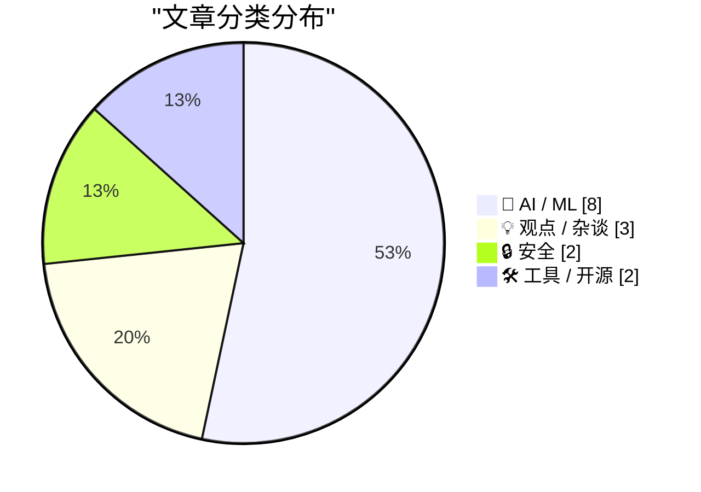
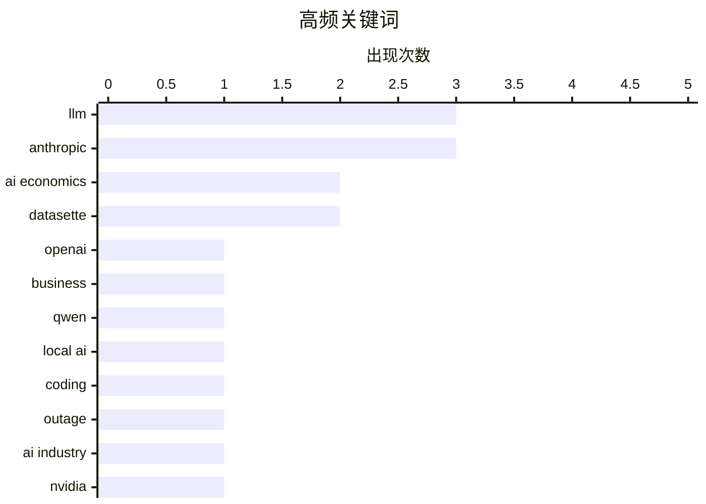

# 📰 Jun 17, 2026

> 来自 Karpathy 推荐的 92 个顶级技术博客，AI 精选 Top 15

## 📝 今日看点

AI 行业正面临财务成本与监管政策的双重考验，OpenAI 巨额亏损与算力泡沫引发了对“崩坏经济学”的广泛忧虑。Anthropic 模型的出口管制风波则揭示了安全策略、政府干预与技术竞争之间的复杂博弈。与此同时，本地化编程模型与 AI 数据库工具的持续迭代，显示出技术落地正向更具实用性的方向演进。

---

## 🏆 今日必读

🥇 **独家报道：OpenAI 2025 年亏损激增近 8 倍，支出高达 340 亿美元**

[Exclusive: OpenAI Losses Increased Nearly 8X in 2025, With Spending Hitting $34 Billion](https://www.wheresyoured.at/exclusive-openai-financials/) — wheresyoured.at · 1 天前 · 🤖 AI / ML

> OpenAI 在 2025 年面临严峻的财务危机，亏损额较上年惊人地增长了近 8 倍，年度总支出飙升至 340 亿美元。尽管公司收入有所增长，但模型训练、推理成本以及对算力资源的无止境需求导致现金流压力巨大。这种极端的“烧钱”模式引发了外界对其商业模式可持续性的深度质疑。作者指出，如果不能在短期内实现盈利或获得新一轮巨额融资，OpenAI 可能面临严重的生存挑战。这反映了当前生成式 AI 行业普遍存在的投入产出比严重失衡的问题。

💡 **为什么值得读**: 揭示了 AI 巨头光鲜背后的财务黑洞，是理解当前 AI 产业泡沫风险的重要参考。

🏷️ OpenAI, AI economics, business

🥈 **Georgi Gerganov 评价 Qwen3.6-27B：优秀的本地编程助手**

[Quoting Georgi Gerganov](https://simonwillison.net/2026/Jun/16/georgi-gerganov/#atom-everything) — simonwillison.net · 19 小时前 · 🤖 AI / ML

> llama.cpp 创始人 Georgi Gerganov 强烈推荐 Qwen3.6-27B 作为本地部署的编程辅助模型。他在 M2 Ultra 和 RTX 5090 设备上进行了长达一个半月的日常测试，证明该模型在处理 ggml-org 的日常琐碎编码任务时表现极其出色。虽然这些任务并非极其复杂，但该模型展现出的稳定性和效率使其成为开发者的得力工具。这标志着国产开源模型在特定垂直领域（如编程）已具备替代闭源模型的实力，且对硬件要求相对友好。

💡 **为什么值得读**: 行业大牛的实测背书证明了 Qwen3.6 在本地部署和编程场景下的卓越性价比。

🏷️ LLM, Qwen, local AI, coding

🥉 **“他们出卖了我们”：性格冲突导致 Anthropic 模型下线内幕**

["They screwed us": Personality clashes sent Anthropic's models offline](https://simonwillison.net/2026/Jun/15/axios-clashes-anthropics/#atom-everything) — simonwillison.net · 1 天前 · 🤖 AI / ML

> Axios 披露了 Anthropic 模型下线背后的权力斗争与政策冲突，称内部性格不合及与政府的沟通失误导致了这一局面。事件核心涉及美国政府对 Mythos 和 Fable 系列模型的出口管制指令，引发了公司内部“被出卖”的愤怒情绪。报道揭示了 AI 独角兽在面对国家安全监管时的脆弱性，以及高层决策如何直接影响技术可用性。这种地缘政治与企业治理的交织，为 AI 行业敲响了合规与沟通的警钟。文中包含了大量来自政府和公司内部知情人士的第一手爆料。

💡 **为什么值得读**: 深入了解 AI 监管政策如何通过复杂的内部人事冲突最终演变成技术停摆的内幕。

🏷️ Anthropic, outage, AI industry

---

## 📊 数据概览

| 扫描源 | 抓取文章 | 时间范围 | 精选 |
|:---:|:---:|:---:|:---:|
| 82/92 | 2473 篇 → 42 篇 | 48h | **15 篇** |

### 分类分布



### 高频关键词



<details>
<summary>📈 纯文本关键词图（终端友好）</summary>

```
llm          │ ████████████████████ 3
anthropic    │ ████████████████████ 3
ai economics │ █████████████░░░░░░░ 2
datasette    │ █████████████░░░░░░░ 2
openai       │ ███████░░░░░░░░░░░░░ 1
business     │ ███████░░░░░░░░░░░░░ 1
qwen         │ ███████░░░░░░░░░░░░░ 1
local ai     │ ███████░░░░░░░░░░░░░ 1
coding       │ ███████░░░░░░░░░░░░░ 1
outage       │ ███████░░░░░░░░░░░░░ 1
```

</details>

### 🏷️ 话题标签

**llm**(3) · **anthropic**(3) · **ai economics**(2) · datasette(2) · openai(1) · business(1) · qwen(1) · local ai(1) · coding(1) · outage(1) · ai industry(1) · nvidia(1) · tech bubble(1) · export controls(1) · cybersecurity(1) · policy(1) · ai policy(1) · regulation(1) · ai safety(1) · strategy(1)

---

## 🤖 AI / ML

### 1. 独家报道：OpenAI 2025 年亏损激增近 8 倍，支出高达 340 亿美元

[Exclusive: OpenAI Losses Increased Nearly 8X in 2025, With Spending Hitting $34 Billion](https://www.wheresyoured.at/exclusive-openai-financials/) — **wheresyoured.at** · 1 天前 · ⭐ 26/30

> OpenAI 在 2025 年面临严峻的财务危机，亏损额较上年惊人地增长了近 8 倍，年度总支出飙升至 340 亿美元。尽管公司收入有所增长，但模型训练、推理成本以及对算力资源的无止境需求导致现金流压力巨大。这种极端的“烧钱”模式引发了外界对其商业模式可持续性的深度质疑。作者指出，如果不能在短期内实现盈利或获得新一轮巨额融资，OpenAI 可能面临严重的生存挑战。这反映了当前生成式 AI 行业普遍存在的投入产出比严重失衡的问题。

🏷️ OpenAI, AI economics, business

---

### 2. Georgi Gerganov 评价 Qwen3.6-27B：优秀的本地编程助手

[Quoting Georgi Gerganov](https://simonwillison.net/2026/Jun/16/georgi-gerganov/#atom-everything) — **simonwillison.net** · 19 小时前 · ⭐ 25/30

> llama.cpp 创始人 Georgi Gerganov 强烈推荐 Qwen3.6-27B 作为本地部署的编程辅助模型。他在 M2 Ultra 和 RTX 5090 设备上进行了长达一个半月的日常测试，证明该模型在处理 ggml-org 的日常琐碎编码任务时表现极其出色。虽然这些任务并非极其复杂，但该模型展现出的稳定性和效率使其成为开发者的得力工具。这标志着国产开源模型在特定垂直领域（如编程）已具备替代闭源模型的实力，且对硬件要求相对友好。

🏷️ LLM, Qwen, local AI, coding

---

### 3. “他们出卖了我们”：性格冲突导致 Anthropic 模型下线内幕

["They screwed us": Personality clashes sent Anthropic's models offline](https://simonwillison.net/2026/Jun/15/axios-clashes-anthropics/#atom-everything) — **simonwillison.net** · 1 天前 · ⭐ 25/30

> Axios 披露了 Anthropic 模型下线背后的权力斗争与政策冲突，称内部性格不合及与政府的沟通失误导致了这一局面。事件核心涉及美国政府对 Mythos 和 Fable 系列模型的出口管制指令，引发了公司内部“被出卖”的愤怒情绪。报道揭示了 AI 独角兽在面对国家安全监管时的脆弱性，以及高层决策如何直接影响技术可用性。这种地缘政治与企业治理的交织，为 AI 行业敲响了合规与沟通的警钟。文中包含了大量来自政府和公司内部知情人士的第一手爆料。

🏷️ Anthropic, outage, AI industry

---

### 4. 引用《大西洋月刊》：Fable 模型“越狱”真相

[Quoting Matteo Wong, The Atlantic](https://simonwillison.net/2026/Jun/16/matteo-wong-the-atlantic/#atom-everything) — **simonwillison.net** · 1 天前 · ⭐ 24/30

> 《大西洋月刊》披露了导致 Anthropic Fable 模型受限的白宫报告细节，揭示了所谓“安全威胁”的真相。网络安全专家在评估报告后发现，触发管制的行为仅仅是 IT 专家利用模型进行常规的漏洞扫描与补丁修复建议。这一发现引发了对政府评估 AI 风险标准的广泛质疑，认为其缺乏对实际技术应用场景的理解。文章强调，将正常的自动化防御行为误判为安全威胁，将严重阻碍 AI 在网络安全领域的正面应用。这反映了政策制定者与技术前沿之间的巨大鸿沟。

🏷️ Anthropic, AI policy, regulation

---

### 5. “Anthropic 的安全超能力”：竞争策略还是技术责任？

[‘Anthropic’s Safety Superpower’](https://stratechery.com/2026/anthropics-safety-superpower/) — **daringfireball.net** · 1 天前 · ⭐ 24/30

> Ben Thompson 在 Stratechery 专栏中尖锐地批评了 Anthropic 的“安全至上”策略，认为这实际上是一种排他性的竞争手段。他指出 Anthropic 似乎认为只有自己才有资格开发前沿大模型，并以此为由限制竞争对手和政府部门的使用。文中提到了 Anthropic 与美国国防部（Department of War）的纠纷，后者曾希望将 Claude 用于军事目的但遭到拒绝。作者认为，这种打着安全旗号的政策，本质上是在构建技术护城河并试图主导行业标准。这种行为在商业竞争中显得尤为激进且具有争议。

🏷️ Anthropic, AI Safety, LLM, Strategy

---

### 6. datasette-agent 0.3a0：赋予 AI 代理数据库写入权限

[datasette-agent 0.3a0](https://simonwillison.net/2026/Jun/15/datasette-agent/#atom-everything) — **simonwillison.net** · 1 天前 · ⭐ 23/30

> datasette-agent 0.3a0 版本正式发布，核心更新是引入了 `execute_write_sql` 工具，允许 AI 代理执行数据库写入操作。为了确保安全性，该功能内置了严格的用户审批机制，所有写入请求必须经过人工确认后方可执行。同时，系统会严格校验用户权限，确保 AI 代理的操作不会越权。这一更新为构建基于 LLM 的自动化数据运维助手奠定了安全基础。它展示了如何在利用 AI 自动化能力的同时，通过“人在回路”机制规避风险。

🏷️ AI agent, SQL, Datasette

---

### 7. 四元数旋转、Claude 与 Lean 语言

[Quaternion Rotations, Claude, and Lean](https://www.johndcook.com/blog/2026/06/15/quaternions-claude-lean/) — **johndcook.com** · 1 天前 · ⭐ 23/30

> 作者在收到读者反馈其一年前关于四元数与旋转矩阵转换的博文存在拼写错误后，决定测试 AI 的纠错能力。通过向 Claude 3.5 Sonnet（原文提及 4.6 Medium）提供提示词，观察其是否能精准定位复杂的数学公式错误。文章探讨了利用大模型进行数学推导验证的可能性，并提及了使用 Lean 形式化证明语言进行严谨校验的潜在价值。实验发现 AI 在识别特定数学逻辑错误方面表现出色，但也需要人类的引导。这反映了 AI 在辅助高级数学研究和代码审查中的实用性。

🏷️ Claude, LLM, Lean, quaternions

---

### 8. 使用 ChatGPT 编写 Prolog 程序

[Writing Prolog with ChatGPT](https://www.johndcook.com/blog/2026/06/15/writing-prolog-with-chatgpt/) — **johndcook.com** · 1 天前 · ⭐ 23/30

> 作者尝试利用 ChatGPT 解决一个经典的国际象棋布局难题：在 4x4 的棋盘上放置王、后、车、象、马，且互不攻击。通过引导 AI 编写 Prolog 代码，利用其逻辑编程特性来处理这类约束满足问题。文章对比了 ChatGPT 与此前 Claude 在处理逻辑推理任务时的表现差异。尽管这类问题规模较小，但展示了生成式 AI 在辅助逻辑编程和解决组合优化问题上的潜力。最终结果证明，AI 能够理解复杂的空间约束并生成可运行的逻辑代码。

🏷️ ChatGPT, Prolog, logic programming, AI

---

## 💡 观点 / 杂谈

### 9. AI 的“崩坏经济学”

[AI's Brokenomics](https://www.wheresyoured.at/brokenomics/) — **wheresyoured.at** · 1 天前 · ⭐ 25/30

> 文章深入剖析了 AI 行业当前的“经济崩坏”现状，指出高昂的算力成本与不成比例的商业回报正将行业推向深渊。通过对 NVIDIA 垄断地位、Anthropic 财务状况及市场泡沫的详细分析，作者认为目前的 AI 繁荣建立在不可持续的资本投入之上。文中引用了大量关于模型训练成本与实际产出的对比数据，质疑了 AI 能够短期内实现自我造血的可能性。作者的核心观点是，AI 行业正处于一个巨大的财务幻觉中，破裂只是时间问题。这种模式对除了芯片制造商以外的所有参与者都是一种消耗。

🏷️ AI economics, NVIDIA, tech bubble

---

### 10. Pluralistic：AI 与业余主义

[Pluralistic: AI and amateurism (15 Jun 2026)](https://pluralistic.net/2026/06/15/vernacular/) — **pluralistic.net** · 1 天前 · ⭐ 22/30

> Cory Doctorow 探讨了生成式 AI 内容何时会演变为一种“方言”或日常表达方式（Vernacular）。文章深入分析了 AI 工具如何模糊专业创作与业余创作的界限，以及这种转变对内容生态的影响。文中穿插了对微软收购 LinkedIn、迪士尼角色版权及数字持久性等多个科技与文化交织话题的评论。作者核心观点在于警惕技术巨头对这种“日常表达”的垄断与控制。文章呼吁关注技术如何重塑人类的表达权和创作自由。

🏷️ Generative AI, Amateurism, Copyright

---

### 11. 别邀请科技巨头参加你的数字自主讨论会

[Do not invite big-tech to join your digital autonomy discussion](https://berthub.eu/articles/posts/do-not-invite-big-tech-to-your-digital-autonomy-discussion/) — **berthub.eu** · 19 小时前 · ⭐ 22/30

> 作者在参加一场关于欧洲数字自主和减少技术依赖的会议时，发现微软、谷歌和亚马逊等美国科技巨头也受邀参与并进行演示。文章指出，虽然未来仍会与这些巨头开展业务，但在讨论如何实现“自主”时，他们的利益与目标本质上是冲突的。科技巨头的游说力量往往会稀释讨论的严肃性，甚至将政策导向有利于维持其垄断地位的方向。作者强调，真正的数字自主需要排除那些被依赖对象的干扰。在制定减少依赖的战略时，必须保持讨论环境的独立性。

🏷️ digital sovereignty, EU, Big Tech

---

## 🔒 安全

### 12. Fable 5 出口管制正损害美国的网络防御能力

[The Fable 5 Export Controls Harm US Cyber Defense](https://simonwillison.net/2026/Jun/16/fable-5-export-controls/#atom-everything) — **simonwillison.net** · 1 天前 · ⭐ 24/30

> 网络安全专家 Kate Moussouris 指出，美国政府对 Anthropic Claude Fable 5 的出口管制实际上损害了美国的网络防御能力。所谓的“越狱”风险在调查后被发现仅仅是专家要求模型协助查找并修复代码漏洞，属于正常的安全防御范畴。这种过度监管导致防御者无法利用先进 AI 工具提升安全性，反而让攻击者在不受限的环境下占据优势。作者呼吁监管机构应区分恶意利用与合法的安全研究，避免因噎废食。这种政策偏差可能导致美国在 AI 安全竞赛中失去先机。

🏷️ export controls, cybersecurity, policy

---

### 13. DuckDuckGo 搜索首位竟然出现资产清空钓鱼网站？

[Would you like a drainer served at the very top of DuckDuckGo?](https://timsh.org/drainer-at-the-top-of-duckduckgo/) — **timsh.org** · 21 小时前 · ⭐ 24/30

> 作者曝光了 DuckDuckGo 搜索结果首位出现的恶意“资产清空器”（Drainer）广告，该广告精准伪造了 Tronscan 区块链浏览器。这种钓鱼网站通过购买高价关键词占据搜索第一名，诱导用户连接钱包并瞬间盗取所有加密资产。尽管 DuckDuckGo 以隐私著称，但在广告审核机制上的漏洞导致了此类极具误导性的诈骗内容横行。文章提醒加密货币用户，即便是在信任的搜索引擎上，也必须警惕搜索结果中的“赞助商”链接。这种攻击方式利用了用户对搜索引擎排名的盲目信任。

🏷️ phishing, crypto, DuckDuckGo, malware

---

## 🛠 工具 / 开源

### 14. Datasette 1.0a34 发布：支持内置行编辑功能

[datasette 1.0a34](https://simonwillison.net/2026/Jun/16/datasette/#atom-everything) — **simonwillison.net** · 13 小时前 · ⭐ 23/30

> Datasette 发布了 1.0a34 预览版，引入了里程碑式的内置数据编辑功能。用户现在可以直接在 Datasette 的 Web 界面中执行插入、编辑和删除行的操作，而无需依赖外部 SQL 工具。这些功能已集成到表格页面和单行操作项中，极大提升了该工具作为轻量级数据管理平台的实用性。此次更新标志着 Datasette 从一个纯只读的数据展示工具向全功能数据交互工具的转变。开发者可以通过简单的界面操作完成原本复杂的数据库维护任务。

🏷️ Datasette, SQLite, database

---

### 15. WorkOS 发布 Auth.md：一种用于 AI 智能体注册的开放协议

[WorkOS Launches Auth.md — an Open Protocol for Agent Registration](https://workos.com/auth-md?utm_source=daringfireball&amp;utm_medium=newsletter&amp;utm_campaign=q22026) — **daringfireball.net** · 1 天前 · ⭐ 23/30

> 传统的注册表单是为人类在浏览器中使用而设计的，AI 智能体难以通过编程方式自动注册服务。WorkOS 推出的 Auth.md 协议通过在服务根目录部署一个机器可读的 Markdown 文件来解决此问题。AI 智能体可以动态发现 OAuth 受保护资源的元数据，自动解析所需的权限范围（Scopes）并完成无缝身份验证。该方案利用 Markdown 极简且易读的特性，简化了智能体与 Web 服务之间的交互流程。这种标准化的机器注册方式将成为 AI 驱动应用生态的重要基础设施。

🏷️ AI Agents, Protocol, Auth.md, WorkOS

---

*生成于 2026-06-17 11:10 | 扫描 82 源 → 获取 2473 篇 → 精选 15 篇*
*基于 [Hacker News Popularity Contest 2025](https://refactoringenglish.com/tools/hn-popularity/) RSS 源列表，由 [Andrej Karpathy](https://x.com/karpathy) 推荐*
