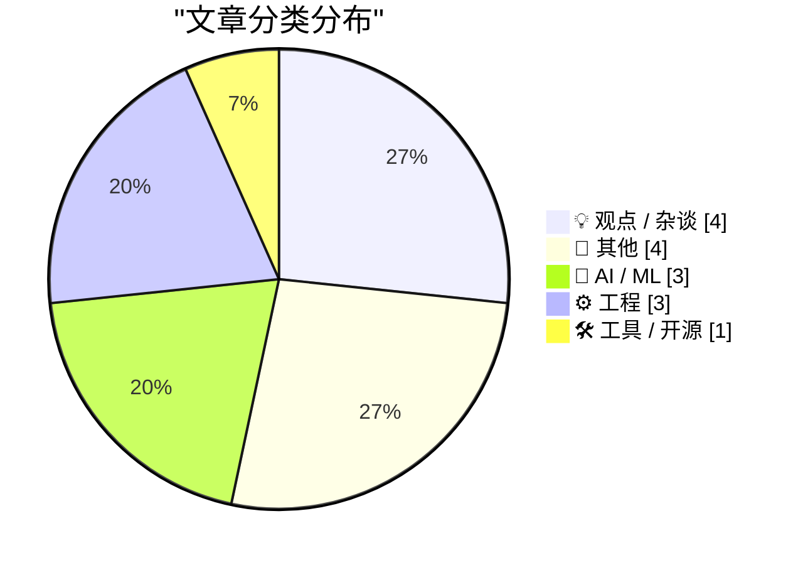
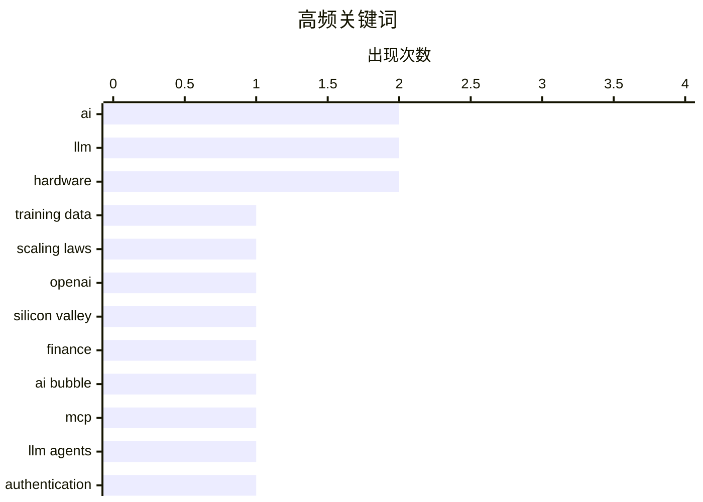

# 📰 Jun 21, 2026

> 来自 Karpathy 推荐的 92 个顶级技术博客，AI 精选 Top 15

## 📝 今日看点

今日技术圈核心关注 AI 产业的“黑洞”危机，从模型训练的极低样本效率到 OpenAI 严峻的财务亏损，行业正重新审视大模型的可持续性。技术演进上，AI 正在向更深层的安全协议与复杂逻辑推理迈进，通过 MCP 协议强化安全隔离并利用 LLM 辅助定理证明。此外，福克斯巨额收购 Roku 以及特朗普手机的硬件争议，也反映了流媒体市场整合与消费电子领域的剧烈波动。

---

## 🏆 今日必读

🥇 **AI 中心的“数据黑洞”：样本效率的危机**

[The data black hole at the center of AI](https://www.dwarkesh.com/p/the-sample-efficiency-black-hole) — dwarkesh.com · 1 天前 · 🤖 AI / ML

> 现代 AI 模型虽然展现出惊人的能力，但其核心存在着一个极低样本效率的“数据黑洞”。LLM 需要数万亿个 token 的训练数据才能达到人类水平，而人类儿童仅凭数百万个词汇就能掌握语言。这种对海量数据的依赖是当前 AI 发展的隐形成本，也是限制其向通用人工智能（AGI）进化的关键瓶颈。作者指出，尽管缩放定律（Scaling Laws）依然有效，但如果不能在算法层面实现样本效率的质变，数据枯竭将成为不可逾越的障碍。未来 AI 的突破点将不再是单纯增加数据量，而是如何让模型像人类一样从极少量样本中学习。

💡 **为什么值得读**: 深刻揭示了当前大模型繁荣背后的数据危机，是理解 AI 发展瓶颈与未来演进方向的必读深度分析。

🏷️ AI, training data, scaling laws, LLM

🥈 **硅谷泡沫（第二部分）：OpenAI 的财务黑洞**

[Premium: The Silicon Valley Bubble (Part 2)](https://www.wheresyoured.at/premium-the-silicon-valley-bubble-part-2/) — wheresyoured.at · 1 天前 · 💡 观点 / 杂谈

> 硅谷正处于由 AI 驱动的巨大泡沫中，OpenAI 的最新财务审计报告揭示了其严峻的经营现状。2024 至 2025 年间，OpenAI 投入了高达 340 亿美元的成本，却仅实现了 130.7 亿美元的收入。这种入不敷出的烧钱模式反映了整个行业对未来增长的过度乐观，以及对实际盈利能力的忽视。作者认为，当前的 AI 繁荣更多依赖于资本市场的击鼓传花，而非可持续的商业逻辑。如果无法解决高昂的算力成本与收入不成正比的问题，这场 AI 盛宴可能面临崩盘风险。

💡 **为什么值得读**: 通过硬核财务数据拆解 OpenAI 的经营困境，为狂热的 AI 投资潮提供了一剂冷静的清醒剂。

🏷️ OpenAI, Silicon Valley, finance, AI bubble

🥉 **重新审视 MCP：核心价值在于身份验证隔离**

[Quoting Sean Lynch](https://simonwillison.net/2026/Jun/19/sean-lynch/#atom-everything) — simonwillison.net · 1 天前 · 🤖 AI / ML

> 模型上下文协议（MCP）的核心价值在于其安全隔离机制，而非单纯的工具调用能力。通过将身份验证（Auth）流程从智能体的上下文窗口和运行环境中剥离，MCP 有效降低了敏感凭证泄露的风险。这种架构允许智能体在不直接接触 API 密钥的情况下与外部服务交互，极大地提升了系统的安全性。作者认为，MCP 的理想形态可能就是一个纯粹的 API 认证网关，这足以改变当前的 AI 应用开发范式。这种解耦设计解决了 AI 代理在复杂企业环境中部署时的最大安全痛点。

💡 **为什么值得读**: 犀利地指出了 MCP 协议在安全架构上的本质优势，是开发者理解 AI 工具集成趋势的重要视角。

🏷️ MCP, LLM agents, authentication, context window

---

## 📊 数据概览

| 扫描源 | 抓取文章 | 时间范围 | 精选 |
|:---:|:---:|:---:|:---:|
| 81/92 | 2445 篇 → 24 篇 | 48h | **15 篇** |

### 分类分布



### 高频关键词



<details>
<summary>📈 纯文本关键词图（终端友好）</summary>

```
ai             │ ████████████████████ 2
llm            │ ████████████████████ 2
hardware       │ ████████████████████ 2
training data  │ ██████████░░░░░░░░░░ 1
scaling laws   │ ██████████░░░░░░░░░░ 1
openai         │ ██████████░░░░░░░░░░ 1
silicon valley │ ██████████░░░░░░░░░░ 1
finance        │ ██████████░░░░░░░░░░ 1
ai bubble      │ ██████████░░░░░░░░░░ 1
mcp            │ ██████████░░░░░░░░░░ 1
```

</details>

### 🏷️ 话题标签

**ai**(2) · **llm**(2) · **hardware**(2) · training data(1) · scaling laws(1) · openai(1) · silicon valley(1) · finance(1) · ai bubble(1) · mcp(1) · llm agents(1) · authentication(1) · context window(1) · z3(1) · prolog(1) · claude(1) · windows(1) · win32(1) · hmodule(1) · memory management(1)

---

## 💡 观点 / 杂谈

### 1. 硅谷泡沫（第二部分）：OpenAI 的财务黑洞

[Premium: The Silicon Valley Bubble (Part 2)](https://www.wheresyoured.at/premium-the-silicon-valley-bubble-part-2/) — **wheresyoured.at** · 1 天前 · ⭐ 27/30

> 硅谷正处于由 AI 驱动的巨大泡沫中，OpenAI 的最新财务审计报告揭示了其严峻的经营现状。2024 至 2025 年间，OpenAI 投入了高达 340 亿美元的成本，却仅实现了 130.7 亿美元的收入。这种入不敷出的烧钱模式反映了整个行业对未来增长的过度乐观，以及对实际盈利能力的忽视。作者认为，当前的 AI 繁荣更多依赖于资本市场的击鼓传花，而非可持续的商业逻辑。如果无法解决高昂的算力成本与收入不成正比的问题，这场 AI 盛宴可能面临崩盘风险。

🏷️ OpenAI, Silicon Valley, finance, AI bubble

---

### 2. 我懂功夫了：信息不等于知识

[I know Kung-fu](https://idiallo.com/blog/i-know-kung-fu) — **idiallo.com** · 1 天前 · ⭐ 19/30

> 现代技术让我们产生了一种错觉，即拥有海量信息就等同于掌握了知识。真正的知识习得并非如《黑客帝国》中那样通过简单的“上传”即可完成，而是需要大脑在实践中不断建立神经连接并经历失败。即便 AI 能够瞬间生成答案，缺乏实际操作和思考过程的“知识”在面对复杂现实问题时往往无能为力。作者强调，技能的掌握必须经过时间的沉淀和肌肉记忆的形成，而非仅仅是数据的堆砌。

🏷️ learning, AI, knowledge, philosophy

---

### 3. 大骗局：堆砌垃圾并不能变出奇迹

[Pluralistic: The Big Con (19 Jun 2026)](https://pluralistic.net/2026/06/19/too-big-to-fact-check/) — **pluralistic.net** · 1 天前 · ⭐ 19/30

> 核心探讨了大型科技公司和咨询机构如何通过制造复杂的“烟幕弹”来掩盖其产品或方案的无能。文章批评了当前 AI 领域存在的过度承诺现象，指出单纯增加数据量或模型规模并不能解决底层逻辑的缺失。文中还串联了 Meta 公开 AI 提示词、W3C 与安全研究的博弈以及零工经济中的虚假民意等多个案例。作者认为，这种“大骗局”本质上是在利用信息不对称来维持不可持续的商业模式。

🏷️ censorship, W3C, security research

---

### 4. 精英阶层是如何招募成员的

[Pluralistic: How the Epstein Class recruits (20 Jun 2026)](https://pluralistic.net/2026/06/20/any-club-that-would-have-me/) — **pluralistic.net** · 17 小时前 · ⭐ 18/30

> 文章深入探讨了权势阶层如何通过特定的社交网络和利益捆绑机制来维持其封闭的圈子。通过分析爱泼斯坦式的社交招募手段，揭示了精英阶层如何利用资源诱惑和道德绑架来同化新成员。内容同时涉及了 RFID 扫描器安全、后苏联时代的创新发明以及俄勒冈州对抗企业化医疗等社会技术议题。作者指出，这种阶层固化和招募机制是导致社会不平等和体制腐败的核心因素。

🏷️ social commentary, privacy, power structures

---

## 📝 其他

### 5. 特朗普 T1 手机真相：披着金漆的两年陈旧 HTC 手机

[Trump Mobile T1 Phone Is a Gold-Painted Two-Year-Old HTC U24 Pro](https://www.nbcnews.com/tech/gadgets/trump-mobile-t1-phone-nearly-identical-htc-device-analysis-rcna349293) — **daringfireball.net** · 1 天前 · ⭐ 21/30

> 针对特朗普推出的 T1 手机进行的拆解分析显示，这款标榜“美国制造”的设备实际上是换壳版的 HTC U24 Pro。iFixit 的技术报告指出，该手机采用了两年前的硬件配置，且大量使用由台湾 HTC 组装的中国零部件。除了外观涂有金色油漆和预装特定软件外，其内部构造与原版 HTC 手机几乎完全一致。这一发现戳穿了其本土制造的营销噱头，揭示了其作为贴牌产品的本质。对于消费者而言，这是一款溢价严重且技术过时的电子产品。

🏷️ smartphone, hardware, iFixit, supply chain

---

### 6. 福克斯 250 亿美元收购 Roku，押注广告支持型流媒体

[Fox to Buy Roku Streaming Service in $25 Billion Deal](https://www.wsj.com/business/deals/fox-roku-deal-f6e564f9?st=mKdQwC&amp;reflink=desktopwebshare_permalink) — **daringfireball.net** · 1 天前 · ⭐ 21/30

> 福克斯（Fox Corp）宣布将以约 250 亿美元的价格收购流媒体平台 Roku，这是福克斯历史上规模最大的一笔交易。此举旨在将福克斯强大的直播新闻和体育赛事资源与 Roku 庞大的联网电视平台及广告系统深度整合。福克斯此前已拥有免费流媒体服务 Tubi，此次收购将显著扩大其在广告支持型流媒体（FAST）市场的版图。这标志着传统媒体巨头在流媒体下半场竞争中正通过大规模并购寻求平台化转型。交易完成后，福克斯将拥有从内容生产到终端分发的全产业链控制力。

🏷️ acquisition, streaming, Roku, Fox

---

### 7. FPS 游戏音乐传奇 Bobby Prince 逝世，享年 81 岁

[Bobby Prince has died](https://oldvcr.blogspot.com/feeds/8983624217005254252/comments/default) — **oldvcr.blogspot.com** · 1 天前 · ⭐ 20/30

> 纪念 90 年代第一人称射击游戏（FPS）音乐大师 Bobby Prince 逝世，享年 81 岁。他曾为《毁灭战士》（Doom）、《德军总部 3D》（Wolfenstein 3D）和《毁灭公爵 3D》等里程碑式作品创作了极具辨识度的配乐。作为 id Software 的长期合作伙伴，他的音乐定义了一个时代的感官体验，将重金属与合成器音效完美融入游戏氛围。文章回顾了他从《指挥官基恩》到 FPS 巅峰时期的职业生涯转型与卓越贡献。他的作品不仅是游戏背景音，更是早期 3D 游戏文化的重要组成部分。

🏷️ game music, id Software, obituary

---

### 8. 建筑物理阅读清单：2026年6月20日

[Reading List 06/20/26](https://www.construction-physics.com/p/reading-list-062026) — **construction-physics.com** · 21 小时前 · ⭐ 19/30

> 本期阅读清单聚焦于基础设施与能源技术的最新进展，涵盖了从政策到硬件的多个维度。重点关注了通用汽车（GM）进军电网级电池市场，以及固态空调技术（Solid-state AC）对未来建筑能耗的潜在影响。针对数据中心建设延迟的质疑，清单中提供了行业视角的深度分析。此外，还涉及了最新的住房法案及其对城市建设的长期推动作用。

🏷️ data centers, energy, infrastructure

---

## 🤖 AI / ML

### 9. AI 中心的“数据黑洞”：样本效率的危机

[The data black hole at the center of AI](https://www.dwarkesh.com/p/the-sample-efficiency-black-hole) — **dwarkesh.com** · 1 天前 · ⭐ 27/30

> 现代 AI 模型虽然展现出惊人的能力，但其核心存在着一个极低样本效率的“数据黑洞”。LLM 需要数万亿个 token 的训练数据才能达到人类水平，而人类儿童仅凭数百万个词汇就能掌握语言。这种对海量数据的依赖是当前 AI 发展的隐形成本，也是限制其向通用人工智能（AGI）进化的关键瓶颈。作者指出，尽管缩放定律（Scaling Laws）依然有效，但如果不能在算法层面实现样本效率的质变，数据枯竭将成为不可逾越的障碍。未来 AI 的突破点将不再是单纯增加数据量，而是如何让模型像人类一样从极少量样本中学习。

🏷️ AI, training data, scaling laws, LLM

---

### 10. 重新审视 MCP：核心价值在于身份验证隔离

[Quoting Sean Lynch](https://simonwillison.net/2026/Jun/19/sean-lynch/#atom-everything) — **simonwillison.net** · 1 天前 · ⭐ 25/30

> 模型上下文协议（MCP）的核心价值在于其安全隔离机制，而非单纯的工具调用能力。通过将身份验证（Auth）流程从智能体的上下文窗口和运行环境中剥离，MCP 有效降低了敏感凭证泄露的风险。这种架构允许智能体在不直接接触 API 密钥的情况下与外部服务交互，极大地提升了系统的安全性。作者认为，MCP 的理想形态可能就是一个纯粹的 API 认证网关，这足以改变当前的 AI 应用开发范式。这种解耦设计解决了 AI 代理在复杂企业环境中部署时的最大安全痛点。

🏷️ MCP, LLM agents, authentication, context window

---

### 11. 在 6x5 棋盘上放置所有棋子：利用 Claude 生成 Z3 代码

[All pieces on a 6 by 5 board](https://www.johndcook.com/blog/2026/06/20/z3-python-claude/) — **johndcook.com** · 12 小时前 · ⭐ 24/30

> 本文探索如何利用 Claude 将复杂的国际象棋布局问题转化为 Z3 定理证明器的 Python 代码。实验目标是在 6x5 的棋盘上放置所有棋子（王、后、双车、双象、双马），且互不攻击。相比之前使用 Prolog 的尝试，Z3 方案在处理约束满足问题（CSP）时展现了更强的逻辑表达力。Claude 能够准确生成棋子移动逻辑和互斥约束，并最终通过 Python 脚本运行得出解。这证明了 LLM 在辅助形式化验证和自动化推理方面具有极高的实用价值。

🏷️ LLM, Z3, Prolog, Claude

---

## ⚙️ 工程

### 12. 当 HMODULE 的最低位被置位时意味着什么？

[What does it mean when the bottom bit of my HMODULE is set?](https://devblogs.microsoft.com/oldnewthing/20260619-00/?p=112447) — **devblogs.microsoft.com/oldnewthing** · 1 天前 · ⭐ 22/30

> 深入解析 Windows 操作系统中 HMODULE 句柄最低位（bottom bit）被置位时的特殊含义。当该位为 1 时，表示该模块是以“仅数据”模式（如 LOAD_LIBRARY_AS_DATAFILE）加载的，而非可执行代码。这类模块主要用于读取资源（如图标、字符串），系统不会为其建立完整的内存映射，因此无法通过 GetProcAddress 调用其中的函数。了解这一底层细节有助于开发者在调试资源加载和模块句柄异常时快速定位问题。这是 Windows 内部处理资源模块的一种优化手段，也是开发者容易忽略的底层知识点。

🏷️ Windows, Win32, HMODULE, memory management

---

### 13. 吹玻璃笔记 #3：改进热离子二极管的设计

[Glassblowing #3: A better thermionic diode](https://maurycyz.com/projects/glass/3/) — **maurycyz.com** · 1 天前 · ⭐ 20/30

> 记录了作者在自制真空管二极管过程中的第三次迭代与技术突破。针对前代设计中电子积聚在玻璃壁上产生负电荷、导致电流极小（1000V 仅 1μA）的问题，作者改进了物理结构。新方案采用金属圆柱体完全包围灯丝作为阳极，从而捕获所有发射的电子并消除玻璃干扰。通过精细的吹玻璃工艺和结构优化，成功制造出了性能更优、更具实用价值的热离子二极管。这一改进显著提升了真空管的导电效率，解决了电子散射带来的电荷积累难题。

🏷️ vacuum tube, hardware, electronics, glassblowing

---

### 14. 哪种 Copyleft 许可证最适合 SVG 文件？

[Which Copyleft Licence is Suitable for an SVG?](https://shkspr.mobi/blog/2026/06/which-copyleft-licence-is-suitable-for-an-svg/) — **shkspr.mobi** · 22 小时前 · ⭐ 19/30

> SVG 格式因其基于 XML 和数学运算的特性，处于“代码”与“艺术品”的模糊地带，导致其授权协议的选择变得复杂。传统的软件许可证如 GPL 可能过于沉重，而针对艺术作品的 Creative Commons (CC) 协议在处理 SVG 内部代码逻辑时又显得力不从心。文章对比了不同许可证在 SVG 场景下的适用性，探讨了如何保护矢量图形的开放性同时兼顾其作为源代码的可读性。作者建议在选择时需考虑 SVG 是被视为静态图像还是可交互的程序组件。

🏷️ SVG, licensing, copyleft, XML

---

## 🛠 工具 / 开源

### 15. 包管理周报：2026 年 6 月 20 日

[This Week in Package Management: 20 June 2026](https://nesbitt.io/2026/06/20/this-week-in-package-management.html) — **nesbitt.io** · 1 天前 · ⭐ 22/30

> 汇总了 2026 年 6 月 20 日当周全球包管理生态系统的关键动态。内容涵盖了主流包管理器（如 npm、PyPI、Cargo 等）的最新版本发布、新发现的安全漏洞预警以及行业深度文章。该简报为开发者提供了快速了解供应链安全和工具链演进的一站式入口。通过阅读本周总结，可以掌握包管理领域的最新技术趋势和潜在风险。对于维护大型项目依赖的工程师来说，这是保持技术同步的高效方式。

🏷️ package management, security, DevOps

---

*生成于 2026-06-21 10:01 | 扫描 81 源 → 获取 2445 篇 → 精选 15 篇*
*基于 [Hacker News Popularity Contest 2025](https://refactoringenglish.com/tools/hn-popularity/) RSS 源列表，由 [Andrej Karpathy](https://x.com/karpathy) 推荐*
