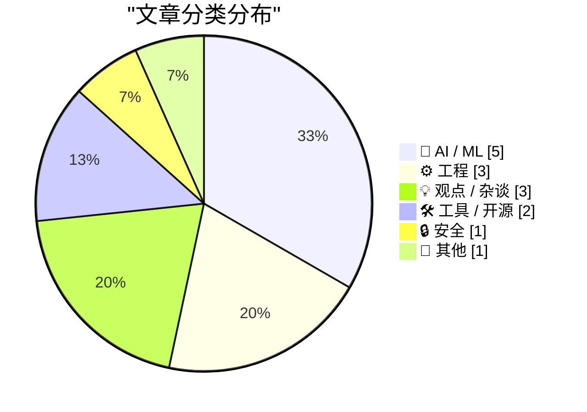
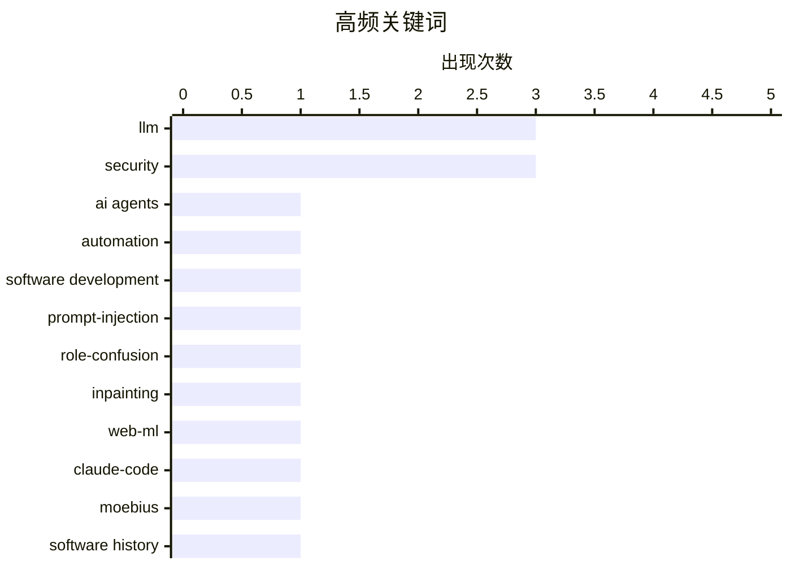

# 📰 Jun 24, 2026

> 来自 Karpathy 推荐的 92 个顶级技术博客，AI 精选 Top 15

## 📝 今日看点

今日技术圈见证了 AI 开发范式的关键转型，软件构建正从手动提示词转向自动化代理循环，且轻量化模型在浏览器端的部署正成为新趋势。安全与治理领域迎来深度反思，开发者不仅在重新审视大模型的“角色混淆”漏洞，也对行业内的“货机崇拜”现象及过度监视政策发出了严厉警示。此外，随着 Web 技术的持续演进，浏览器正通过原生文件系统与 Wasm 的深度集成，进一步释放客户端处理复杂任务与数据的潜能。

---

## 🏆 今日必读

🥇 **循环时代的到来**

[The Coming Loop](https://lucumr.pocoo.org/2026/6/23/the-coming-loop/) — lucumr.pocoo.org · 1 天前 · 🤖 AI / ML

> 软件开发范式正在从手动编写 Prompt 转向构建自动化“循环”（Loops）。开发者不再直接与 Claude 等模型对话，而是编写能够自动调用模型、处理任务队列并根据结果进行迭代的代理系统。这种模式在 Pi 等平台上日益普及，核心在于将工作放入队列并由机器自主尝试、反馈和停止。这一转变标志着从“AI 辅助编程”向“AI 代理自主开发”的跨越，开发者的角色正演变为这些自动化循环的设计者。

💡 **为什么值得读**: 揭示了 AI 编程的下一个进化阶段：从对话式交互转向完全自动化的闭环代理工作流。

🏷️ AI agents, LLM, automation, software development

🥈 **提示词注入即角色混淆**

[Prompt Injection as Role Confusion](https://simonwillison.net/2026/Jun/22/prompt-injection-as-role-confusion/#atom-everything) — simonwillison.net · 1 天前 · 🤖 AI / ML

> 该研究将大语言模型的提示词注入（Prompt Injection）漏洞重新定义为“角色混淆”问题。作者 Charles Ye 等人指出，模型无法有效区分开发者预设的系统指令与用户输入的外部数据，导致权限边界模糊。通过这种视角，安全研究者可以更系统地理解为何现有的防御手段难以根除此类漏洞。文章不仅提供了学术论文的正式论证，还附带了易于理解的博客版解读，旨在提升学术成果的传播力。

💡 **为什么值得读**: 为理解 AI 安全漏洞提供了全新的理论框架，将复杂的注入攻击简化为直观的角色权限问题。

🏷️ Prompt-Injection, LLM, Security, Role-Confusion

🥉 **使用 Claude Code 将 Moebius 0.2B 图像修复模型移植到浏览器**

[Porting the Moebius 0.2B image inpainting model to run in the browser with Claude Code](https://simonwillison.net/2026/Jun/22/porting-moebius/#atom-everything) — simonwillison.net · 1 天前 · 🤖 AI / ML

> 开发者尝试将轻量级图像修复模型 Moebius 移植到浏览器中运行。Moebius 仅拥有 0.2B 参数，却宣称能达到 10B 级别的修复性能，非常适合在客户端环境部署。整个移植过程借助了 Claude Code 这一 AI 编程工具，展示了如何快速处理复杂的模型依赖并实现 Web 环境集成。这种“小模型+浏览器”的组合为低成本、高隐私的图像处理应用提供了新思路，证明了边缘侧运行高性能 AI 的可行性。

💡 **为什么值得读**: 展示了如何利用 AI 工具将高性能轻量级模型快速落地到浏览器端，具有极强的工程实践参考价值。

🏷️ Inpainting, Web-ML, Claude-Code, Moebius

---

## 📊 数据概览

| 扫描源 | 抓取文章 | 时间范围 | 精选 |
|:---:|:---:|:---:|:---:|
| 78/92 | 2280 篇 → 30 篇 | 48h | **15 篇** |

### 分类分布



### 高频关键词



<details>
<summary>📈 纯文本关键词图（终端友好）</summary>

```
llm                  │ ████████████████████ 3
security             │ ████████████████████ 3
ai agents            │ ███████░░░░░░░░░░░░░ 1
automation           │ ███████░░░░░░░░░░░░░ 1
software development │ ███████░░░░░░░░░░░░░ 1
prompt-injection     │ ███████░░░░░░░░░░░░░ 1
role-confusion       │ ███████░░░░░░░░░░░░░ 1
inpainting           │ ███████░░░░░░░░░░░░░ 1
web-ml               │ ███████░░░░░░░░░░░░░ 1
claude-code          │ ███████░░░░░░░░░░░░░ 1
```

</details>

### 🏷️ 话题标签

**llm**(3) · **security**(3) · **ai agents**(1) · automation(1) · software development(1) · prompt-injection(1) · role-confusion(1) · inpainting(1) · web-ml(1) · claude-code(1) · moebius(1) · software history(1) · ui(1) · microsoft word(1) · spellcheck(1) · surveillance(1) · privacy(1) · tech policy(1) · vpn(1) · ai hype(1)

---

## 🤖 AI / ML

### 1. 循环时代的到来

[The Coming Loop](https://lucumr.pocoo.org/2026/6/23/the-coming-loop/) — **lucumr.pocoo.org** · 1 天前 · ⭐ 29/30

> 软件开发范式正在从手动编写 Prompt 转向构建自动化“循环”（Loops）。开发者不再直接与 Claude 等模型对话，而是编写能够自动调用模型、处理任务队列并根据结果进行迭代的代理系统。这种模式在 Pi 等平台上日益普及，核心在于将工作放入队列并由机器自主尝试、反馈和停止。这一转变标志着从“AI 辅助编程”向“AI 代理自主开发”的跨越，开发者的角色正演变为这些自动化循环的设计者。

🏷️ AI agents, LLM, automation, software development

---

### 2. 提示词注入即角色混淆

[Prompt Injection as Role Confusion](https://simonwillison.net/2026/Jun/22/prompt-injection-as-role-confusion/#atom-everything) — **simonwillison.net** · 1 天前 · ⭐ 25/30

> 该研究将大语言模型的提示词注入（Prompt Injection）漏洞重新定义为“角色混淆”问题。作者 Charles Ye 等人指出，模型无法有效区分开发者预设的系统指令与用户输入的外部数据，导致权限边界模糊。通过这种视角，安全研究者可以更系统地理解为何现有的防御手段难以根除此类漏洞。文章不仅提供了学术论文的正式论证，还附带了易于理解的博客版解读，旨在提升学术成果的传播力。

🏷️ Prompt-Injection, LLM, Security, Role-Confusion

---

### 3. 使用 Claude Code 将 Moebius 0.2B 图像修复模型移植到浏览器

[Porting the Moebius 0.2B image inpainting model to run in the browser with Claude Code](https://simonwillison.net/2026/Jun/22/porting-moebius/#atom-everything) — **simonwillison.net** · 1 天前 · ⭐ 25/30

> 开发者尝试将轻量级图像修复模型 Moebius 移植到浏览器中运行。Moebius 仅拥有 0.2B 参数，却宣称能达到 10B 级别的修复性能，非常适合在客户端环境部署。整个移植过程借助了 Claude Code 这一 AI 编程工具，展示了如何快速处理复杂的模型依赖并实现 Web 环境集成。这种“小模型+浏览器”的组合为低成本、高隐私的图像处理应用提供了新思路，证明了边缘侧运行高性能 AI 的可行性。

🏷️ Inpainting, Web-ML, Claude-Code, Moebius

---

### 4. Our hydro deserves better than a chatbot

[Our hydro deserves better than a chatbot](https://hey.paris/posts/ai-data-centres-tasmania/) — **hey.paris** · 1 天前 · ⭐ 21/30

> Our hydro deserves better than a chatbot

🏷️ data centers, AI infrastructure, sustainability

---

### 5. Liminality

[Liminality](https://geohot.github.io//blog/jekyll/update/2026/06/23/liminality.html) — **geohot.github.io** · 1 天前 · ⭐ 20/30

> Liminality

🏷️ AI philosophy, LLM, geohot

---

## ⚙️ 工程

### 6. 纪念那位在单词下画红绿波浪线的人

[In memory of the man who put red and green squiggles under words](https://devblogs.microsoft.com/oldnewthing/20260622-00/?p=112451) — **devblogs.microsoft.com/oldnewthing** · 1 天前 · ⭐ 24/30

> 本文纪念了在 Microsoft Word 中发明红色和绿色波浪下划线（拼写与语法检查）的技术先驱。这一设计最初出现在 Word 中，随后扩展到几乎所有的文字处理器和文本输入框，彻底改变了全球用户的写作习惯。文章回顾了这一交互设计从诞生到成为行业标准的历程，强调了其在人机交互史上的重要地位。它不仅是一项技术发明，更是最成功的视觉反馈机制之一，帮助无数人减少了书写错误。

🏷️ software history, UI, Microsoft Word, spellcheck

---

### 7. OPFS + Pyodide 测试工具

[OPFS + Pyodide test harness](https://simonwillison.net/2026/Jun/23/opfs-pyodide/#atom-everything) — **simonwillison.net** · 14 小时前 · ⭐ 22/30

> Simon Willison 开发了一个测试工具，旨在验证能否通过浏览器原生的 OPFS（源私有文件系统）让 Pyodide 运行的 Python 应用直接编辑本地 SQLite 文件。该方案的核心是利用 WebAssembly 将 Datasette Lite 的持久化能力从内存扩展到磁盘。通过 OPFS，浏览器端应用可以获得接近原生的文件读写性能，且无需用户频繁手动上传下载。这为构建功能完备、数据持久化的浏览器端数据库应用扫清了存储障碍。

🏷️ Pyodide, Wasm, OPFS, Web-Storage

---

### 8. Regular expressions that work “everywhere”

[Regular expressions that work “everywhere”](https://www.johndcook.com/blog/2026/06/23/regex-everywhere/) — **johndcook.com** · 9 小时前 · ⭐ 21/30

> Regular expressions that work “everywhere”

🏷️ regex, portability, programming tools

---

## 💡 观点 / 杂谈

### 9. 以保护之名监视儿童是极其愚蠢的行为

[Pluralistic: Spying on kids to save kids from spying is very, very stupid (23 Jun 2026)](https://pluralistic.net/2026/06/23/destroy-the-village/) — **pluralistic.net** · 22 小时前 · ⭐ 23/30

> Cory Doctorow 猛烈抨击了以保护儿童为名行监视之实的立法趋势，认为这种“为了救孩子而监视孩子”的逻辑极其荒谬。文章探讨了针对 VPN 的禁令、ISP 协同建立的版权惩罚机制以及对公平使用原则的侵蚀。作者指出，这些政策实际上破坏了互联网的隐私基础，并可能导致更严重的社会控制。文中还涉及了 Google 的机器学习转型以及加拿大财富税等多个社会技术议题，呼吁公众警惕技术监管的滥用。

🏷️ surveillance, privacy, tech policy, VPN

---

### 10. 货机崇拜文化

[Cargo Culture](https://www.wheresyoured.at/cargo-culture/) — **wheresyoured.at** · 18 小时前 · ⭐ 23/30

> 文章深入分析了当前 AI 行业的“货机崇拜”（Cargo Culture）现象，质疑行业内过度炒作与实际价值的脱节。作者对 NVIDIA、Anthropic 等巨头进行了详细的财务与技术分析，探讨了 AI 泡沫背后的驱动力。文中指出，许多企业在未解决核心盈利模式的情况下，盲目追随 AI 浪潮，可能面临严重的市场调整。这不仅是对技术的反思，更是对当前科技投资环境的深度批判，提醒读者警惕盲目跟风。

🏷️ AI hype, tech industry, analysis

---

### 11. Pluralistic: Good politics (22 Jun 2026)

[Pluralistic: Good politics (22 Jun 2026)](https://pluralistic.net/2026/06/22/8-for-what-we-will/) — **pluralistic.net** · 1 天前 · ⭐ 20/30

> Pluralistic: Good politics (22 Jun 2026)

🏷️ politics, security, tech culture

---

## 🛠 工具 / 开源

### 12. 包管理器的终结

[Sunsetting a Package Manager](https://nesbitt.io/2026/06/23/sunsetting-a-package-manager.html) — **nesbitt.io** · 23 小时前 · ⭐ 22/30

> 本文探讨了停止维护一个包管理器（Package Manager）所带来的技术与安全挑战。作者指出，一个被“冻结”的注册表（Registry）是极其危险的，因为其中的软件包将永远无法获得安全补丁。文章分析了在生命周期终点如何处理依赖关系、镜像站点以及用户迁移等棘手问题。对于开发者而言，依赖一个处于日落阶段的生态系统意味着巨大的长期风险。这提醒我们在选择技术栈时，必须考虑其生态系统的长期生命力。

🏷️ package manager, security, maintenance, supply chain

---

### 13. Datasette 1.0a35 发布

[datasette 1.0a35](https://simonwillison.net/2026/Jun/23/datasette/#atom-everything) — **simonwillison.net** · 12 小时前 · ⭐ 21/30

> Datasette 发布了 1.0a35 重要预览版，引入了全新的“创建表”交互界面。该功能由底层的 JSON API 驱动，允许用户直接在数据库操作菜单中定义列、主键和自定义设置。这一更新标志着 Datasette 从一个纯只读的数据浏览工具向具备写操作能力的数据库管理平台迈进。此外，新版本还优化了 API 响应结构，提升了开发者构建自定义前端的效率，为 1.0 正式版的发布奠定了基础。

🏷️ Datasette, SQLite, Release

---

## 🔒 安全

### 14. Scattered Spider 黑客在审判首日认罪

[Scattered Spider Hackers Plead Guilty on Day 1 of Trial](https://krebsonsecurity.com/2026/06/scattered-spider-hackers-plead-guilty-on-day-1-of-trial/) — **krebsonsecurity.com** · 17 小时前 · ⭐ 22/30

> 臭名昭著的黑客组织 Scattered Spider 的两名成员在英国法庭审判首日承认了刑事指控。该组织曾于 2024 年 8 月对伦敦交通局（TfL）发起网络攻击，导致伦敦公共交通网络陷入瘫痪。这两名黑客的认罪标志着针对该跨国犯罪团伙打击行动的重大胜利。此案揭示了该组织利用社会工程学和复杂技术手段攻击关键基础设施的危险性，也展示了国际执法合作在打击网络犯罪方面的成效。

🏷️ Cybercrime, Scattered-Spider, Hackers

---

## 📝 其他

### 15. Apple Is Going to Raise Device Prices — but When?

[Apple Is Going to Raise Device Prices — but When?](https://x.com/markgurman/status/2067741507273289766) — **daringfireball.net** · 1 天前 · ⭐ 20/30

> Apple Is Going to Raise Device Prices — but When?

🏷️ Apple, Supply-Chain, Pricing

---

*生成于 2026-06-24 09:45 | 扫描 78 源 → 获取 2280 篇 → 精选 15 篇*
*基于 [Hacker News Popularity Contest 2025](https://refactoringenglish.com/tools/hn-popularity/) RSS 源列表，由 [Andrej Karpathy](https://x.com/karpathy) 推荐*
