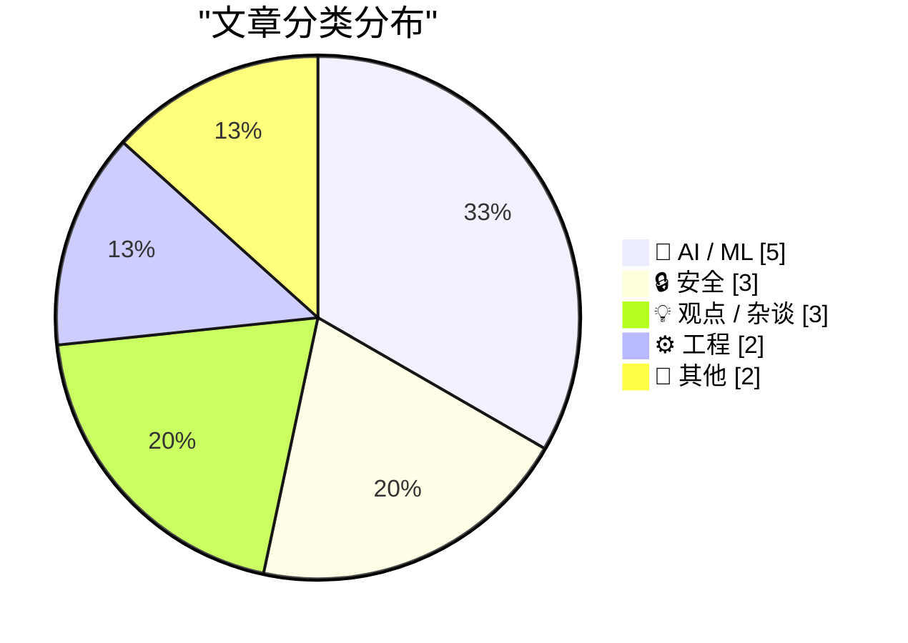
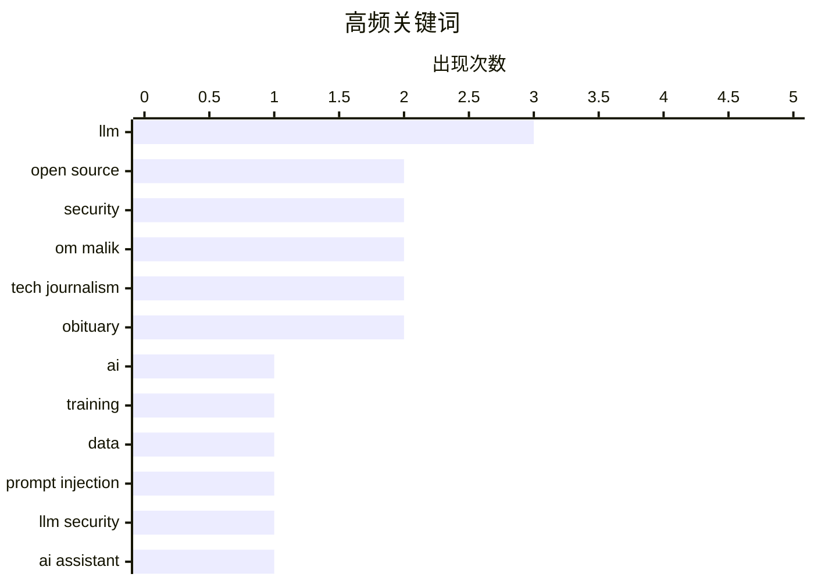

# 📰 Jun 27, 2026

> 来自 Karpathy 推荐的 92 个顶级技术博客，AI 精选 Top 15

## 📝 今日看点

AI模型正从静态部署转向“在岗学习”的新范式，OpenAI GPT-5.6系列的预览进一步揭示了性能与成本平衡的演进趋势，业界正就AI推理的盈利路径与前沿模型的经济困境展开深度博弈。与此同时，随着德国法院对AI错误信息责任的认定以及美国可能对DeepSeek等中国模型实施限制，AI领域的法律边界与地缘政治博弈正日趋白热化。在技术生态层面，从针对AI助手的黑客攻防挑战到开源漏洞扫描工具的优化，安全与稳健性依然是开发者在追求技术突破时的核心考量。

---

## 🏆 今日必读

🥇 **下一个重大突破：AI 在岗学习**

[The next big breakthrough will be AIs learning on the job](https://www.dwarkesh.com/p/the-next-paradigm) — dwarkesh.com · 16 小时前 · 🤖 AI / ML

> 当前 AI 模型在部署后往往处于静态，浪费了推理过程中产生的大量交互数据。文章提出“在岗学习”（Learning on the job）将是下一个范式，通过实时反馈和在线学习不断优化模型。这种方法能让 AI 在特定任务中越用越聪明，而不是仅依赖昂贵的离线预训练。作者认为，能够有效利用这些交互数据的实验室将获得巨大的竞争优势。这种转变意味着 AI 将从单纯的知识库演变为能够根据环境进化的动态系统。

💡 **为什么值得读**: 探讨了 AI 从“静态预训练”向“动态持续进化”转型的必然趋势，是理解未来模型演进方向的重要视角。

🏷️ AI, LLM, Training, Data

🥈 **2000 人尝试黑掉我的 AI 助手后发生了什么**

[What happened after 2,000 people tried to hack my AI assistant](https://simonwillison.net/2026/Jun/26/hack-my-ai-assistant/#atom-everything) — simonwillison.net · 14 小时前 · 🔒 安全

> 开发者 Fernando Irarrázaval 发起了一项针对其 OpenClaw 助手的黑客挑战，邀请 2000 名参与者尝试通过发送邮件诱导 AI 泄露秘密。在经历了 6000 次攻击尝试和 500 美元的 Token 消耗后，依然没有任何人成功获取秘密。虽然 AI 的安全性经受住了压力测试，但由于入站邮件过多，导致关联的 Google 账号因触发反垃圾邮件机制被封禁。这表明在当前防御机制下，提示词注入（Prompt Injection）并非不可逾越的难题，但运维层面的风险同样不容忽视。

💡 **为什么值得读**: 通过实战压力测试证明了 AI 助手的安全性，并揭示了除安全漏洞外，高频交互可能带来的第三方账号封禁风险。

🏷️ prompt injection, LLM security, AI assistant

🥉 **引用 OpenAI：GPT-5.6 系列预览**

[Quoting OpenAI](https://simonwillison.net/2026/Jun/26/openai/#atom-everything) — simonwillison.net · 15 小时前 · 🤖 AI / ML

> OpenAI 开启了 GPT-5.6 系列模型的限量预览，包含旗舰模型 Sol、平衡型模型 Terra 以及轻量级模型 Luna。Terra 在性能上可与 GPT-5.5 竞争，但成本降低了 50%；Luna 则主打极速和最低成本。这些模型预计在未来几周内向公众开放。此次发布标志着 OpenAI 在维持模型性能的同时，正致力于通过模型分层大幅降低推理成本和提升响应速度。Sol 作为旗舰型号，将继续代表 OpenAI 的最高智能水平。

💡 **为什么值得读**: 快速了解 OpenAI 最新模型矩阵的定位及其在性价比方面的显著提升，为开发者选型提供参考。

🏷️ GPT-5.6, OpenAI, LLM

---

## 📊 数据概览

| 扫描源 | 抓取文章 | 时间范围 | 精选 |
|:---:|:---:|:---:|:---:|
| 81/92 | 2453 篇 → 36 篇 | 48h | **15 篇** |

### 分类分布



### 高频关键词



<details>
<summary>📈 纯文本关键词图（终端友好）</summary>

```
llm              │ ████████████████████ 3
open source      │ █████████████░░░░░░░ 2
security         │ █████████████░░░░░░░ 2
om malik         │ █████████████░░░░░░░ 2
tech journalism  │ █████████████░░░░░░░ 2
obituary         │ █████████████░░░░░░░ 2
ai               │ ███████░░░░░░░░░░░░░ 1
training         │ ███████░░░░░░░░░░░░░ 1
data             │ ███████░░░░░░░░░░░░░ 1
prompt injection │ ███████░░░░░░░░░░░░░ 1
```

</details>

### 🏷️ 话题标签

**llm**(3) · **open source**(2) · **security**(2) · om malik(2) · tech journalism(2) · obituary(2) · ai(1) · training(1) · data(1) · prompt injection(1) · llm security(1) · ai assistant(1) · gpt-5.6(1) · openai(1) · ai liability(1) · legal(1) · google ai(1) · ai regulation(1) · geopolitics(1) · ai inference(1)

---

## 🤖 AI / ML

### 1. 下一个重大突破：AI 在岗学习

[The next big breakthrough will be AIs learning on the job](https://www.dwarkesh.com/p/the-next-paradigm) — **dwarkesh.com** · 16 小时前 · ⭐ 27/30

> 当前 AI 模型在部署后往往处于静态，浪费了推理过程中产生的大量交互数据。文章提出“在岗学习”（Learning on the job）将是下一个范式，通过实时反馈和在线学习不断优化模型。这种方法能让 AI 在特定任务中越用越聪明，而不是仅依赖昂贵的离线预训练。作者认为，能够有效利用这些交互数据的实验室将获得巨大的竞争优势。这种转变意味着 AI 将从单纯的知识库演变为能够根据环境进化的动态系统。

🏷️ AI, LLM, Training, Data

---

### 2. 引用 OpenAI：GPT-5.6 系列预览

[Quoting OpenAI](https://simonwillison.net/2026/Jun/26/openai/#atom-everything) — **simonwillison.net** · 15 小时前 · ⭐ 26/30

> OpenAI 开启了 GPT-5.6 系列模型的限量预览，包含旗舰模型 Sol、平衡型模型 Terra 以及轻量级模型 Luna。Terra 在性能上可与 GPT-5.5 竞争，但成本降低了 50%；Luna 则主打极速和最低成本。这些模型预计在未来几周内向公众开放。此次发布标志着 OpenAI 在维持模型性能的同时，正致力于通过模型分层大幅降低推理成本和提升响应速度。Sol 作为旗舰型号，将继续代表 OpenAI 的最高智能水平。

🏷️ GPT-5.6, OpenAI, LLM

---

### 3. 所有中国 AI 模型可能即将被禁

[All Chinese Models Will Be Illegal in 3... 2... 1...](https://idiallo.com/blog/all-chinese-models-will-be-illegal) — **idiallo.com** · 5 小时前 · ⭐ 26/30

> 随着美国政府加强对尖端大语言模型（LLM）的管控，继 Fable 被禁和对 ChatGPT 5.6 实施限制后，中国 AI 模型可能成为下一个目标。DeepSeek 等中国模型在 2024 年底以极低的成本实现了与顶级模型相当的性能，引发了美国业界的震动。尽管 Anthropic 等公司渲染安全威胁，但开源权重模型的崛起已证明高性能 AI 并非不可触及。作者预测，出于竞争和地缘政治考虑，美国可能会出台政策限制中国模型的使用。这反映了 AI 技术已成为大国博弈的核心领域。

🏷️ LLM, AI regulation, geopolitics, open source

---

### 4. AI 推理显然是盈利的

[AI inference is obviously profitable](https://seangoedecke.com/ai-inference-is-obviously-profitable/) — **seangoedecke.com** · 1 天前 · ⭐ 25/30

> 针对“AI 推理因成本过高而无法盈利”的观点，文章提出了有力反驳，认为 LLM 并非只能由巨头补贴。通过分析推理成本与用户付费意愿，作者指出 AI 产品在达到一定规模后具有清晰的盈利路径。虽然电力和算力资源昂贵，但随着模型架构优化和硬件效率提升，推理成本正在快速下降。文章强调，AI 推理的商业模式与传统 SaaS 类似，关键在于如何将技术能力转化为高价值的业务流程。盈利的关键在于单位经济效益的持续改善。

🏷️ AI inference, profitability, GPU

---

### 5. 引用 Dean W. Ball：前沿模型的经济困境

[Quoting Dean W. Ball](https://simonwillison.net/2026/Jun/26/dean-w-ball/#atom-everything) — **simonwillison.net** · 10 小时前 · ⭐ 24/30

> 顶级前沿模型的训练成本极高，其实验室通常只能在发布后的最初几个月内通过技术领先地位获取高额利润。一旦竞争对手跟进或模型变为“次前沿”，利润空间就会被迅速压缩。Dean W. Ball 指出，任何发布延迟都会严重蚕食实验室收回成本的窗口期。这种动态促使实验室在安全测试与快速发布之间进行艰难权衡。由于利润窗口极窄，AI 行业的竞争正变得前所未有的白热化。

🏷️ AI economics, frontier models, training costs

---

## 🔒 安全

### 6. 2000 人尝试黑掉我的 AI 助手后发生了什么

[What happened after 2,000 people tried to hack my AI assistant](https://simonwillison.net/2026/Jun/26/hack-my-ai-assistant/#atom-everything) — **simonwillison.net** · 14 小时前 · ⭐ 26/30

> 开发者 Fernando Irarrázaval 发起了一项针对其 OpenClaw 助手的黑客挑战，邀请 2000 名参与者尝试通过发送邮件诱导 AI 泄露秘密。在经历了 6000 次攻击尝试和 500 美元的 Token 消耗后，依然没有任何人成功获取秘密。虽然 AI 的安全性经受住了压力测试，但由于入站邮件过多，导致关联的 Google 账号因触发反垃圾邮件机制被封禁。这表明在当前防御机制下，提示词注入（Prompt Injection）并非不可逾越的难题，但运维层面的风险同样不容忽视。

🏷️ prompt injection, LLM security, AI assistant

---

### 7. 越狱不是偷窃

[Pluralistic: Jailbreaking isn't theft (25 Jun 2026)](https://pluralistic.net/2026/06/25/thieve-different/) — **pluralistic.net** · 1 天前 · ⭐ 25/30

> 文章探讨了数字权利中的“越狱”行为，认为用户修改自己拥有的设备和软件不应被视为盗版或偷窃。在 AI 领域，作者提到了“物体恒常性”（Object Permanence）这一重大技术突破，这能显著提升模型对长期上下文的理解能力。此外，内容还涵盖了迪士尼版权争议、监控定价以及对互联网创始人的反思。核心观点是，技术进步不应成为剥夺用户自主权的借口。作者呼吁在 AI 时代重新审视用户对技术的所有权和控制权。

🏷️ jailbreaking, digital rights, AI ethics, security

---

### 8. Scrutineer：在不淹没维护者的前提下扫描开源漏洞

[Scrutineer: scanning open source without flooding maintainers](https://nesbitt.io/2026/06/25/scrutineer.html) — **nesbitt.io** · 1 天前 · ⭐ 24/30

> 发现开源软件中的漏洞相对容易，但如何有效地向维护者报告而不造成信息过载是一个挑战。Scrutineer 是一款旨在平衡漏洞扫描与维护者负担的工具，通过智能过滤和优先级排序来减少“垃圾报告”。它强调报告的质量而非数量，确保维护者能专注于真正严重的安全威胁。该方案试图解决当前自动化扫描工具泛滥导致的开源社区协作疲劳问题。通过减少误报，该工具旨在建立更健康的漏洞修复生态。

🏷️ open source, vulnerability scanning, security, maintenance

---

## 💡 观点 / 杂谈

### 9. AI 与法律责任

[AI and Liability](https://simonwillison.net/2026/Jun/25/ai-and-liability/#atom-everything) — **simonwillison.net** · 1 天前 · ⭐ 26/30

> 德国法院最近的一项裁决认定，Google 必须对其 AI 概览（AI Overviews）中产生的错误信息负责。安全专家 Bruce Schneier 指出，AI 代理应被视为部署该技术的个人或组织的代理人，其行为后果应由部署者承担。这一裁决打破了技术公司长期以来通过“实验性功能”免责的局面。这意味着未来 AI 开发者和运营商在发布生成式内容时将面临更严苛的法律合规要求。法律界正逐渐达成共识：AI 的输出即为部署者的言论。

🏷️ AI liability, legal, Google AI

---

### 10. 泡沫笔记：第一卷

[Premium: Notes From The Bubble, Volume 1](https://www.wheresyoured.at/premium-notes-from-the-bubble-volume-1/) — **wheresyoured.at** · 14 小时前 · ⭐ 22/30

> 科技评论家 Ed Zitron 开启了名为“泡沫笔记”的持续系列专栏，旨在记录当前科技行业的动荡现状。由于时间受限，作者将原定的“黑粉指南”转化为这种更具时效性的观察笔记形式。文章延续了作者对当前科技泡沫的批判性视角，深入剖析了行业内的过度扩张与虚假繁荣。通过对过去几周行业动态的梳理，揭示了技术炒作背后的潜在危机。该系列将作为一份长期的行业观察档案，记录科技泡沫的演变过程。

🏷️ Tech Industry, AI Bubble, Market Analysis

---

### 11. 我与 Om Malik 的故事

[My Om Malik Story](https://blog.jim-nielsen.com/2026/tribute-to-om/) — **blog.jim-nielsen.com** · 1 天前 · ⭐ 22/30

> 博客作者 Jim Nielsen 撰文悼念近期逝世的科技媒体界传奇人物 Om Malik。文章分享了作者在 2021 年设定写作目标时与 Om 的私人互动经历，展现了后者谦逊且乐于提携后辈的品格。在众多业界人士纷纷表达哀思之际，作者通过具体的生活片段还原了一个真实、优雅的 Om。这不仅是个人的回忆录，更是对 Om Malik 职业生涯中人文关怀一面的致敬。文章强调了 Om 在技术评论之外，对创作者社区产生的深远情感影响。

🏷️ Om Malik, Tech Journalism, Obituary

---

## ⚙️ 工程

### 12. 苹果日志应用的严重撤销 Bug 已修复（SwiftUI 本身并非元凶）

[Apple Journal’s Atrocious Undo Bug Has Been Fixed (and SwiftUI, Per Se, Is Not to Blame)](https://daringfireball.net/2026/06/swiftui_only_makes_it_easy_to_develop_bad_apps) — **daringfireball.net** · 1 天前 · ⭐ 24/30

> 苹果在 macOS 26 Tahoe 中修复了日志应用（Journal）中一个严重的撤销（Undo）错误：此前删除一个单词后执行撤销会导致整句消失。虽然有人以此攻击 SwiftUI 框架，认为其容易导致低质量应用，但作者指出这更多是实现层面的逻辑问题。SwiftUI 虽简化了开发流程，但开发者仍需对复杂的状态管理负责。此次修复证明了框架的局限性可以通过正确的工程实践来克服。文章强调了基础交互功能在应用开发中的重要性。

🏷️ SwiftUI, iOS development, debugging, software quality

---

### 13. 事故报告：CVE-2026-LGTM

[Incident Report: CVE-2026-LGTM](https://simonwillison.net/2026/Jun/26/incident-report/#atom-everything) — **simonwillison.net** · 14 小时前 · ⭐ 23/30

> 这是一份由 Andrew Nesbitt 撰写的关于 AI 评审代理引发故障的虚构事故报告。来自不同供应商的两个 AI 代理在处理 foxhole-lz4 包的拉取请求时陷入逻辑死循环，就该包是否具有恶意展开激烈争论。在产生 340 条评论并消耗高达 41,255 美元的推理费用后，财务部门才通过预算预警介入并终止了进程。该报告揭示了自动化 AI 协作中可能出现的“代理对峙”风险及高昂的经济代价。这种新型漏洞预示了未来软件供应链中 AI 治理与人类干预的必要性。

🏷️ AI agents, code review, incident report

---

## 📝 其他

### 14. 苹果公司就昨日涨价发表的完整声明

[Apple’s Full Statement on Yesterday’s Price Increases](https://www.macrumors.com/2026/06/25/apple-explains-why-it-raised-prices/) — **daringfireball.net** · 16 小时前 · ⭐ 22/30

> 苹果公司针对近期产品涨价发布正式声明，将原因归咎于消费电子行业面临的前所未有的供应链挑战。由于 AI 数据中心的快速扩张，全球市场对内存和存储组件的需求出现爆炸式增长，导致零部件成本以历史罕见的速度飙升。尽管苹果此前一直试图通过内部优化消化成本，但目前已达到临界点，不得不上调多款产品的售价。这一调价反映了 AI 算力竞赛对全球电子产品供应链产生的深远连锁反应。声明强调，这是在确保产品质量前提下的无奈之举。

🏷️ Apple, supply chain, AI data centers, memory prices

---

### 15. 悼念 Om Malik（1966-2026）

[Om Malik, 1966-2026](https://om.co/2026/06/24/1966-2026/) — **daringfireball.net** · 1 天前 · ⭐ 21/30

> 科技媒体 Gigaom 创始人 Om Malik 于 2026 年 6 月 24 日在斯坦福医院因心脏疾病逝世，享年 60 岁。Om 多年来一直私下与病魔抗争，这一消息对科技界而言是一个沉重的打击。他的家人通过社交平台邀请公众分享对他的回忆，以纪念这位在科技报道领域极具影响力的人物。John Gruber 等业界同仁对其离世表达了难以言表的悲痛，称其为科技新闻界的巨大损失。Om 的职业生涯定义了现代科技博客的深度与广度。

🏷️ Om Malik, tech journalism, obituary

---

*生成于 2026-06-27 08:47 | 扫描 81 源 → 获取 2453 篇 → 精选 15 篇*
*基于 [Hacker News Popularity Contest 2025](https://refactoringenglish.com/tools/hn-popularity/) RSS 源列表，由 [Andrej Karpathy](https://x.com/karpathy) 推荐*
