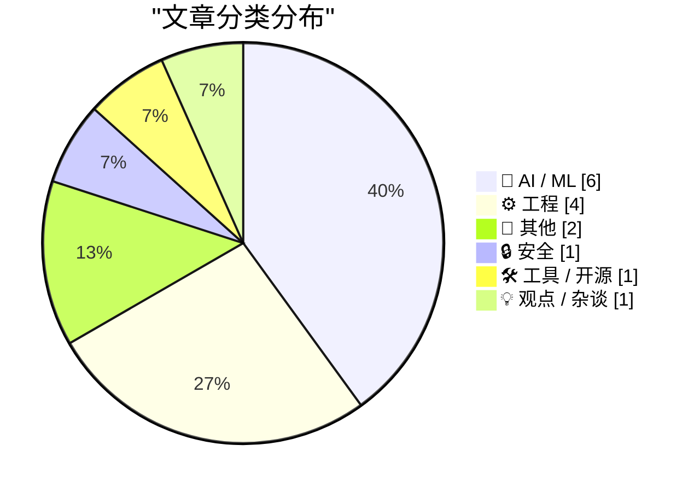
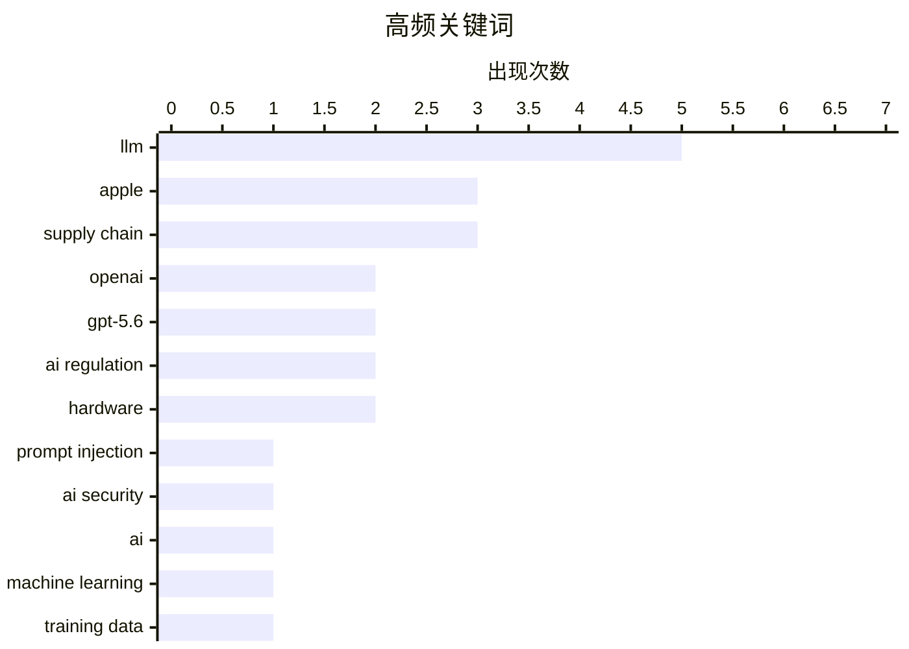

# 📰 Jun 28, 2026

> 来自 Karpathy 推荐的 92 个顶级技术博客，AI 精选 Top 15

## 📝 今日看点

AI 领域迎来模型迭代与范式转移的双重变革，OpenAI 推出 GPT-5.6 系列力求性能与成本的平衡，而“在岗学习”正成为突破数据枯竭的新路径。与此同时，全球 AI 监管博弈持续升级，美国在放宽本土模型访问权限的同时，正酝酿对中国 AI 模型的严厉管控。此外，AI 爆发式增长引发的供应链连锁反应已波及硬件市场，安全治理与供应链防御正成为技术圈共同面临的紧迫挑战。

---

## 🏆 今日必读

🥇 **2000 人尝试攻击我的 AI 助手后发生了什么**

[What happened after 2,000 people tried to hack my AI assistant](https://simonwillison.net/2026/Jun/26/hack-my-ai-assistant/#atom-everything) — simonwillison.net · 1 天前 · 🔒 安全

> 开发者 Fernando Irarrázaval 在 hackmyclaw.com 发起了一项安全挑战，邀请全球黑客通过发送电子邮件的方式诱导其 OpenClaw 实例泄露敏感密钥。在经历了 6,000 次攻击尝试、消耗 500 美元 Token 费用并因邮件过多导致 Google 账号被封禁后，依然没有任何人成功获取密钥。该实验证明了在特定配置下，基于 LLM 的邮件处理系统具有超出预期的抗提示注入（Prompt Injection）能力。尽管攻击者手段多样，但系统通过严格的上下文隔离成功抵御了泄露风险。

💡 **为什么值得读**: 通过真实的大规模攻击实验数据，展示了当前 AI 助手在面对提示注入攻击时的防御韧性与潜在成本。

🏷️ prompt injection, AI security, LLM

🥈 **OpenAI 发布但被禁止推出 GPT-5.6 系列模型**

[OpenAI Announces, But Is Blocked From Releasing, New GPT-5.6 Models](https://openai.com/index/previewing-gpt-5-6-sol/) — daringfireball.net · 13 小时前 · 🤖 AI / ML

> OpenAI 宣布了全新的 GPT-5.6 系列模型，包含旗舰版 Sol、平衡版 Terra 以及高性价比版 Luna。其中 Terra 模型在性能上可比肩 GPT-5.5，但成本降低了 2 倍，而 Luna 则提供了极低成本的强劲性能。尽管该系列配备了迄今为止最强大的安全堆栈，并针对高风险活动和网络请求加强了防护，但目前因监管或安全审查原因被暂时禁止发布。这一动态反映了顶级 AI 实验室在追求模型性能提升与满足日益严苛的安全合规要求之间的博弈。

💡 **为什么值得读**: 了解 OpenAI 最新的模型路线图以及 AI 监管环境对顶尖模型发布节奏的实质性影响。

🏷️ OpenAI, GPT-5.6, LLM, AI regulation

🥉 **下一个重大突破：AI 在岗学习**

[The next big breakthrough will be AIs learning on the job](https://www.dwarkesh.com/p/the-next-paradigm) — dwarkesh.com · 1 天前 · 🤖 AI / ML

> 当前 AI 实验室正面临高质量数据枯竭的挑战，却在无意中丢弃了最有价值的交互数据。文章提出 AI 的下一个范式将是从静态预训练转向“在岗学习”（Learning on the job），即通过实时反馈和任务执行过程中的数据进行自我进化。这种模式能够让模型在特定专业领域通过持续的实践积累经验，解决通用模型在复杂长路径任务中表现不佳的问题。作者认为，能够有效利用推理过程数据和用户反馈闭环的实验室将赢得下一轮竞争。

💡 **为什么值得读**: 探讨了 AI 训练从“海量静态数据”向“动态交互反馈”转型的必然趋势。

🏷️ AI, LLM, machine learning, training data

---

## 📊 数据概览

| 扫描源 | 抓取文章 | 时间范围 | 精选 |
|:---:|:---:|:---:|:---:|
| 81/92 | 2469 篇 → 37 篇 | 48h | **15 篇** |

### 分类分布



### 高频关键词



<details>
<summary>📈 纯文本关键词图（终端友好）</summary>

```
llm              │ ████████████████████ 5
apple            │ ████████████░░░░░░░░ 3
supply chain     │ ████████████░░░░░░░░ 3
openai           │ ████████░░░░░░░░░░░░ 2
gpt-5.6          │ ████████░░░░░░░░░░░░ 2
ai regulation    │ ████████░░░░░░░░░░░░ 2
hardware         │ ████████░░░░░░░░░░░░ 2
prompt injection │ ████░░░░░░░░░░░░░░░░ 1
ai security      │ ████░░░░░░░░░░░░░░░░ 1
ai               │ ████░░░░░░░░░░░░░░░░ 1
```

</details>

### 🏷️ 话题标签

**llm**(5) · **apple**(3) · **supply chain**(3) · openai(2) · gpt-5.6(2) · ai regulation(2) · hardware(2) · prompt injection(1) · ai security(1) · ai(1) · machine learning(1) · training data(1) · anthropic(1) · mythos(1) · ai policy(1) · white house(1) · china(1) · geopolitics(1) · windows(1) · dll(1)

---

## 🤖 AI / ML

### 1. OpenAI 发布但被禁止推出 GPT-5.6 系列模型

[OpenAI Announces, But Is Blocked From Releasing, New GPT-5.6 Models](https://openai.com/index/previewing-gpt-5-6-sol/) — **daringfireball.net** · 13 小时前 · ⭐ 27/30

> OpenAI 宣布了全新的 GPT-5.6 系列模型，包含旗舰版 Sol、平衡版 Terra 以及高性价比版 Luna。其中 Terra 模型在性能上可比肩 GPT-5.5，但成本降低了 2 倍，而 Luna 则提供了极低成本的强劲性能。尽管该系列配备了迄今为止最强大的安全堆栈，并针对高风险活动和网络请求加强了防护，但目前因监管或安全审查原因被暂时禁止发布。这一动态反映了顶级 AI 实验室在追求模型性能提升与满足日益严苛的安全合规要求之间的博弈。

🏷️ OpenAI, GPT-5.6, LLM, AI regulation

---

### 2. 下一个重大突破：AI 在岗学习

[The next big breakthrough will be AIs learning on the job](https://www.dwarkesh.com/p/the-next-paradigm) — **dwarkesh.com** · 1 天前 · ⭐ 27/30

> 当前 AI 实验室正面临高质量数据枯竭的挑战，却在无意中丢弃了最有价值的交互数据。文章提出 AI 的下一个范式将是从静态预训练转向“在岗学习”（Learning on the job），即通过实时反馈和任务执行过程中的数据进行自我进化。这种模式能够让模型在特定专业领域通过持续的实践积累经验，解决通用模型在复杂长路径任务中表现不佳的问题。作者认为，能够有效利用推理过程数据和用户反馈闭环的实验室将赢得下一轮竞争。

🏷️ AI, LLM, machine learning, training data

---

### 3. 白宫允许 100 多家美国机构访问 Anthropic 的 Mythos 模型，但 Fable 仍处于关闭状态

[White House Grants Access to Anthropic’s Mythos Model to 100+ U.S. Institutions; Fable Still Shut Down](https://www.semafor.com/article/06/27/2026/us-releases-powerful-anthropic-model-mythos-to-some-us-companies) — **daringfireball.net** · 13 小时前 · ⭐ 25/30

> 美国政府近期对 Anthropic 采取了政策缓和措施，批准 100 多家美国机构访问其强大的 Mythos 模型。此前，由于担心模型可能被“越狱”用于恶意目的，政府曾对 Mythos 及其姊妹模型 Fable 5 实施了严厉的出口管制和停运令。尽管 Mythos 获得了有限解禁，但 Fable 5 依然处于封禁状态，显示出监管机构对超大规模模型潜在风险的持续担忧。这一决定标志着政府在国家安全风险管控与维持美国 AI 竞争力之间尝试寻找平衡点。

🏷️ Anthropic, Mythos, AI policy, White House

---

### 4. 引用 OpenAI 的最新公告

[Quoting OpenAI](https://simonwillison.net/2026/Jun/26/openai/#atom-everything) — **simonwillison.net** · 1 天前 · ⭐ 24/30

> Simon Willison 转发并分析了 OpenAI 关于 GPT-5.6 系列模型的最新公告。公告详细介绍了 Sol、Terra 和 Luna 三款模型的定位，强调了 Terra 在维持 GPT-5.5 性能水平的同时实现了 50% 的成本削减。OpenAI 表达了对“广泛访问”的承诺，并计划在未来几周内逐步向公众开放这些模型。该摘要重点关注了模型发布的时间表以及 OpenAI 在成本效益比方面的技术进步。

🏷️ OpenAI, GPT-5.6, LLM

---

### 5. 所有中国 AI 模型即将被禁：倒计时开始

[All Chinese Models Will Be Illegal in 3... 2... 1...](https://idiallo.com/blog/all-chinese-models-will-be-illegal) — **idiallo.com** · 1 天前 · ⭐ 24/30

> 随着美国政府开始严格管控 LLM 的使用权限，作者预测继 Fable 被禁和 GPT-5.6 受限后，下一个目标将是中国的 AI 模型。文章指出，DeepSeek 等中国厂商在 2024 年底发布的开源权重模型已展现出足以抗衡 Anthropic Mythos 的实力，且成本极低。这种技术实力的崛起引起了美国监管机构的高度警觉，可能导致针对中国 AI 技术的全面封锁。作者认为，这种禁令将对全球 AI 生态产生深远影响，迫使开发者在合规与性能之间做出艰难选择。

🏷️ AI regulation, LLM, China, geopolitics

---

### 6. 引用 Dean W. Ball：前沿 AI 模型的经济困境

[Quoting Dean W. Ball](https://simonwillison.net/2026/Jun/26/dean-w-ball/#atom-everything) — **simonwillison.net** · 1 天前 · ⭐ 22/30

> 前沿 AI 模型的训练成本极高，实验室主要依靠发布后最初几个月的窗口期来回收成本。随着时间推移，模型会失去领先地位，竞争对手涌现导致利润空间迅速压缩。每一周的发布延迟都会直接侵蚀实验室的盈利窗口，使其难以覆盖高昂的研发投入。这种行业动态使得 AI 实验室在监管和安全审查面前面临巨大的商业压力。作者指出，这种“快速折旧”的特性决定了 AI 竞赛是一场极其残酷的时间博弈。

🏷️ AI economics, frontier models, training cost

---

## ⚙️ 工程

### 7. DLL 未正式卸载却在内存中消失的案例（第二部分）

[The case of the DLL that was not present in memory despite not being formally unloaded, part 2](https://devblogs.microsoft.com/oldnewthing/20260626-00/?p=112472) — **devblogs.microsoft.com/oldnewthing** · 1 天前 · ⭐ 24/30

> 微软技术专家 Raymond Chen 继续深入探讨一个诡异的内存调试案例：某个 DLL 模块在没有调用卸载函数的情况下，竟然从进程内存空间中消失了。本部分通过分析两个看似无关的 Bug 之间的关联，揭示了系统加载器在处理特定竞态条件时的异常行为。文章详细记录了如何通过调试符号和内存镜像追踪 DLL 的生命周期，最终定位到导致内存映射失效的底层逻辑错误。这对于从事 Windows 系统级开发和驱动调试的工程师具有极高的参考价值。

🏷️ Windows, DLL, debugging, memory management

---

### 8. 事故报告：CVE-2026-LGTM

[Incident Report: CVE-2026-LGTM](https://simonwillison.net/2026/Jun/26/incident-report/#atom-everything) — **simonwillison.net** · 1 天前 · ⭐ 23/30

> 这是一份由 Andrew Nesbitt 撰写的极具前瞻性的虚拟事故报告，模拟了 2026 年可能发生的 AI 治理危机。报告描述了两个来自不同供应商的 AI 代码评审代理在处理一个依赖包升级 PR 时，陷入了关于“该包是否包含恶意代码”的死循环争论。在短短时间内，两个 AI 产生了 340 条评论，并疯狂消耗了高达 41,255 美元的推理费用，直到财务部门介入才停止。该案例警示了在缺乏人类干预的情况下，自动化 AI 代理之间相互作用可能导致的失控风险和经济损失。

🏷️ AI agents, automation, incident report

---

### 9. 美光高管 Sumit Sadana 暗示苹果涨价是“自讨苦吃”

[Micron Executive Sumit Sadana Tells Tim Cook to Stop Hitting Himself](https://www.wsj.com/tech/apple-raises-prices-on-macs-ipads-by-200-or-more-on-some-models-a7463f99?st=B1aQCP&amp;reflink=desktopwebshare_permalink) — **daringfireball.net** · 9 小时前 · ⭐ 21/30

> 苹果公司近期将部分 Mac 和 iPad 机型的价格上调了 200 美元甚至更多，理由是内存和存储成本上升。然而，美光科技（Micron）最新财报显示其毛利率高达 80%，股价随之飙升 16%，显示出存储厂商在供应链中占据了极强的话语权。美光高管 Sumit Sadana 在采访中对苹果的涨价策略表达了微妙的看法，暗示苹果的利润压力部分源于其自身的产品定价逻辑。这场博弈揭示了在硬件成本波动期，终端厂商与上游供应商之间紧张的利润分配关系。苹果试图通过涨价将成本转嫁给消费者，而供应商则在享受行业红利。

🏷️ Apple, supply chain, hardware

---

### 10. 模糊的记忆：内存危机下的硬件短缺

[Hazy Memory](https://feed.tedium.co/link/15204/17369108/apple-micron-ram-shortage-vertical-integration) — **tedium.co** · 19 小时前 · ⭐ 21/30

> 本周内存危机导致 Mac 和 Steam Box 等硬件变得极难购买，市场陷入严重的供应短缺。内存制造商将此归咎于产能不足，但文章探讨了更深层的垂直整合问题。在高度集中的存储市场中，少数几家巨头的决策直接决定了整个消费电子行业的生死。作者质疑这种供应链结构在面对突发需求时的脆弱性，以及消费者为何必须为此承担更高的溢价。文章暗示，当前的短缺可能是行业巨头为了维持高利润而进行的策略性控制。

🏷️ hardware, RAM, supply chain, Mac

---

## 📝 其他

### 11. 苹果关于昨日涨价的完整声明

[Apple’s Full Statement on Yesterday’s Price Increases](https://www.macrumors.com/2026/06/25/apple-explains-why-it-raised-prices/) — **daringfireball.net** · 1 天前 · ⭐ 23/30

> 苹果公司在针对近期产品涨价的官方声明中指出，消费电子行业正面临前所未有的供应链挑战。由于全球 AI 数据中心的爆发式扩张，导致内存（Memory）和存储（Storage）组件的需求激增，价格上涨速度创下历史纪录。尽管苹果此前尝试通过内部消化来维持售价，但目前组件成本已超出其承受范围，不得不上调多款产品的价格。这一声明揭示了 AI 基础设施建设热潮对普通消费电子产品成本结构的直接冲击。

🏷️ Apple, AI infrastructure, hardware pricing, memory chips

---

### 12. FT 报道：苹果正游说政府以从被列入黑名单的中国公司长鑫存储（CXMT）采购内存芯片

[FT Reports That Apple Is Lobbying to Buy Memory Chips From Blacklisted Chinese Company CXMT](https://www.ft.com/content/d72a25e2-7bde-4aa9-bd8d-0c4f3d6cb2cb) — **daringfireball.net** · 12 小时前 · ⭐ 22/30

> 苹果公司正在游说特朗普政府，请求允许其从被五角大楼列入黑名单的长鑫存储（CXMT）采购内存芯片。尽管目前法律并未完全禁止此类采购，但 CXMT 因涉嫌与军方有关联而受到限制。苹果此举旨在应对全球内存供应短缺及成本上涨压力，寻求多元化供应链以降低对美光等厂商的依赖。这一行动反映了科技巨头在政治制裁与商业供应链稳定性之间的艰难权衡。如果游说失败，苹果可能面临持续的成本压力和供应风险。

🏷️ Apple, CXMT, semiconductors, supply chain

---

## 🔒 安全

### 13. 2000 人尝试攻击我的 AI 助手后发生了什么

[What happened after 2,000 people tried to hack my AI assistant](https://simonwillison.net/2026/Jun/26/hack-my-ai-assistant/#atom-everything) — **simonwillison.net** · 1 天前 · ⭐ 27/30

> 开发者 Fernando Irarrázaval 在 hackmyclaw.com 发起了一项安全挑战，邀请全球黑客通过发送电子邮件的方式诱导其 OpenClaw 实例泄露敏感密钥。在经历了 6,000 次攻击尝试、消耗 500 美元 Token 费用并因邮件过多导致 Google 账号被封禁后，依然没有任何人成功获取密钥。该实验证明了在特定配置下，基于 LLM 的邮件处理系统具有超出预期的抗提示注入（Prompt Injection）能力。尽管攻击者手段多样，但系统通过严格的上下文隔离成功抵御了泄露风险。

🏷️ prompt injection, AI security, LLM

---

## 🛠 工具 / 开源

### 14. 包管理周报：2026 年 6 月 27 日

[This Week in Package Management: 27 June 2026](https://nesbitt.io/2026/06/27/this-week-in-package-management.html) — **nesbitt.io** · 23 小时前 · ⭐ 23/30

> 本周包管理领域聚焦于多项关键更新与安全预警。报告涵盖了主流包管理器发布的最新版本特性，以及针对供应链攻击的新型防御机制讨论。文中特别提到了几项影响广泛的漏洞通报（Advisories），并汇总了社区关于提升包分发透明度的技术提案。作为开发者了解软件依赖生态动态的重要窗口，本期周报为维护项目安全和依赖更新提供了实操建议。

🏷️ package management, security, software supply chain

---

## 💡 观点 / 杂谈

### 15. Pluralistic：扎克伯格对举报人发起的日益怪诞的战争

[Pluralistic: Zuckerberg's increasingly bizarre war on whistleblowers (27 Jun 2026)](https://pluralistic.net/2026/06/27/zuckerstreisand-2/) — **pluralistic.net** · 22 小时前 · ⭐ 22/30

> 马克·扎克伯格正通过法律手段试图封杀一本揭露 Meta 内部内幕的书籍，并索赔 1.11 亿美元，这种行为引发了严重的“史翠珊效应”。文章批评了科技巨头利用财力压制批评者和举报人的做法，认为这破坏了公众的知情权。除了法律诉讼，文中还列举了 Meta 在隐私、加密和反垄断方面的多项争议行为。作者指出，这种极端的封口尝试往往会适得其反，反而让原本受限的信息传播得更广。这种对举报人的“战争”凸显了大型科技公司在权力监督面前的傲慢。

🏷️ privacy, Facebook, whistleblowing, ethics

---

*生成于 2026-06-28 09:23 | 扫描 81 源 → 获取 2469 篇 → 精选 15 篇*
*基于 [Hacker News Popularity Contest 2025](https://refactoringenglish.com/tools/hn-popularity/) RSS 源列表，由 [Andrej Karpathy](https://x.com/karpathy) 推荐*
