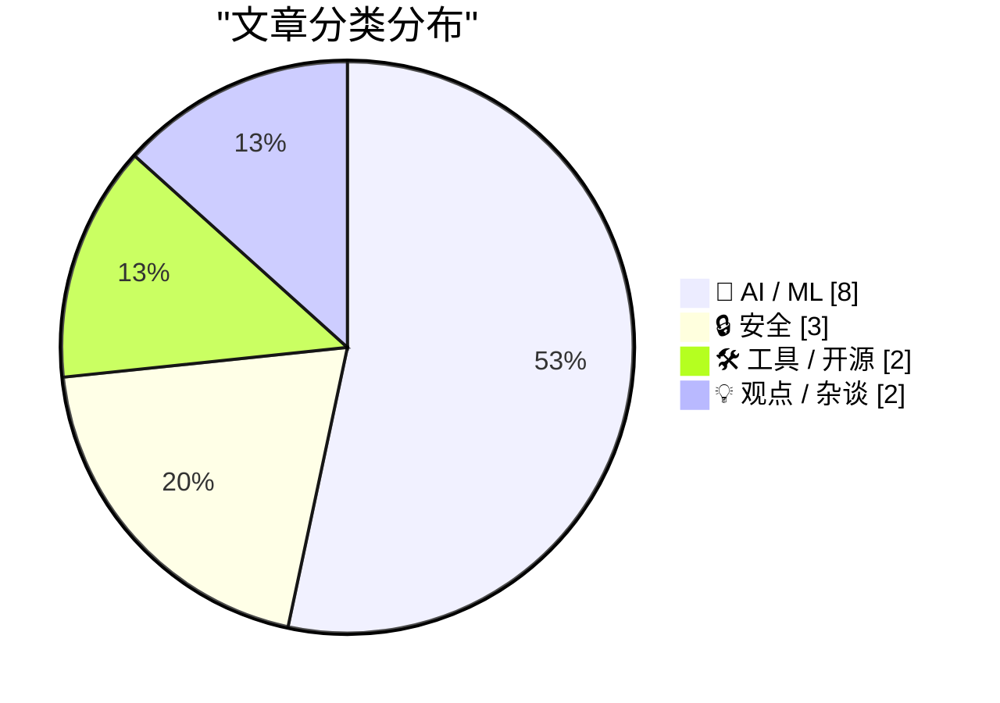
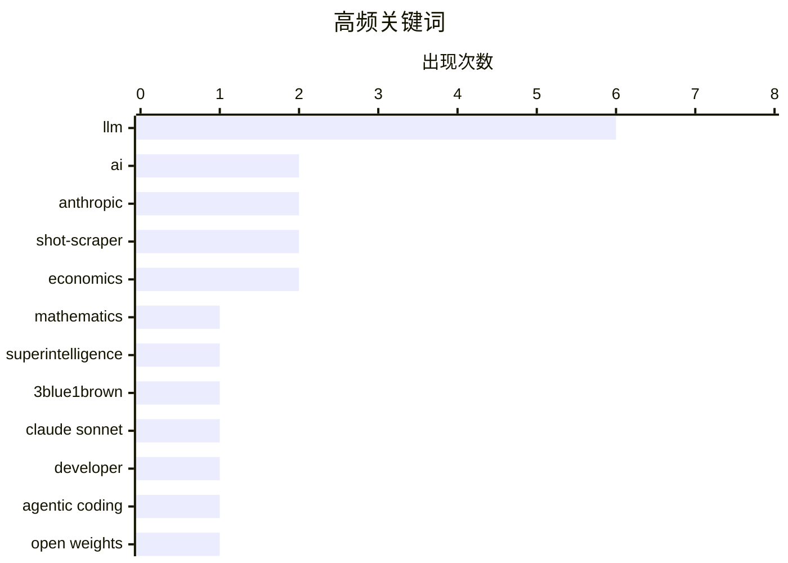

# 📰 Jul 1, 2026

> 来自 Karpathy 推荐的 92 个顶级技术博客，AI 精选 Top 15

## 📝 今日看点

今日技术圈见证了AI模型性能与应用边界的集体跨越，Anthropic与谷歌竞相推出高性价比新版本，推动AI加速渗透至数学逻辑验证与智能体编程等深层领域。与此同时，传统搜索体验的下滑正促使行业向AI原生交互转型，而苹果供应链的重大泄露则再次敲响了硬件安全的警钟。在技术狂热背后，关于AI公司盈利困境与行业可持续性的反思也正在成为舆论焦点。

---

## 🏆 今日必读

🥇 **Grant Sanderson 访谈：AI 与数学的未来**

[Grant Sanderson – AI and the future of math](https://www.dwarkesh.com/p/grant-sanderson-2) — dwarkesh.com · 18 小时前 · 🤖 AI / ML

> 数学将是超级智能最先显现的领域。知名数学科普博主 Grant Sanderson 探讨了 AI 如何改变数学研究与教育，特别是形式化验证工具 Lean 的作用。AI 能够处理极其复杂的逻辑证明，这可能导致数学从人类直觉驱动转向机器验证驱动。访谈深入分析了数学作为 AI 性能“试金石”的独特性，以及未来数学家角色的演变。

💡 **为什么值得读**: 深入了解 3Blue1Brown 创作者对 AI 改变基础科学研究范式的独到见解。

🏷️ AI, mathematics, superintelligence, 3Blue1Brown

🥈 **Claude Sonnet 5 更新详解**

[What's new in Claude Sonnet 5](https://simonwillison.net/2026/Jun/30/claude-sonnet-5/#atom-everything) — simonwillison.net · 12 小时前 · 🤖 AI / ML

> Anthropic 正式发布 Claude Sonnet 5，其性能已逼近 Opus 4.8，但保持了更低的成本和更快的响应速度。开发者文档显示，该版本在代码生成、逻辑推理和长文本遵循能力上有显著提升。新版本进一步优化了 API 调用效率，旨在为大规模企业级应用提供高性价比的智能支持。相比官方通告，开发者文档中包含更多关于模型行为微调的具体技术细节。

💡 **为什么值得读**: 第一时间掌握 Anthropic 最新主力模型的性能指标与开发者实操建议。

🏷️ Claude Sonnet, Anthropic, LLM, developer

🥉 **Ornith-1.0：用于智能体编程的自脚手架大语言模型**

[Ornith-1.0: Self-Scaffolding LLMs for Agentic Coding](https://simonwillison.net/2026/Jun/29/ornith/#atom-everything) — simonwillison.net · 1 天前 · 🤖 AI / ML

> DeepReinforce 发布了采用 MIT 协议开源的 Ornith-1.0 系列模型，包含 9B/31B 稠密版本及 35B/397B MoE 版本。该模型基于 Gemma 4 和 Qwen 3.5 构建，通过“自脚手架（Self-Scaffolding）”技术增强了智能体编程能力。在同尺寸开源模型的编程基准测试中，Ornith-1.0 达到了 SOTA 水平。其核心优势在于能够自主构建解决复杂编程任务的中间步骤。

💡 **为什么值得读**: 关注开源编程大模型新标杆，特别是其独特的自脚手架增强技术。

🏷️ LLM, agentic coding, open weights, Ornith

---

## 📊 数据概览

| 扫描源 | 抓取文章 | 时间范围 | 精选 |
|:---:|:---:|:---:|:---:|
| 82/92 | 2482 篇 → 40 篇 | 48h | **15 篇** |

### 分类分布



### 高频关键词



<details>
<summary>📈 纯文本关键词图（终端友好）</summary>

```
llm               │ ████████████████████ 6
ai                │ ███████░░░░░░░░░░░░░ 2
anthropic         │ ███████░░░░░░░░░░░░░ 2
shot-scraper      │ ███████░░░░░░░░░░░░░ 2
economics         │ ███████░░░░░░░░░░░░░ 2
mathematics       │ ███░░░░░░░░░░░░░░░░░ 1
superintelligence │ ███░░░░░░░░░░░░░░░░░ 1
3blue1brown       │ ███░░░░░░░░░░░░░░░░░ 1
claude sonnet     │ ███░░░░░░░░░░░░░░░░░ 1
developer         │ ███░░░░░░░░░░░░░░░░░ 1
```

</details>

### 🏷️ 话题标签

**llm**(6) · **ai**(2) · **anthropic**(2) · shot-scraper(2) · economics(2) · mathematics(1) · superintelligence(1) · 3blue1brown(1) · claude sonnet(1) · developer(1) · agentic coding(1) · open weights(1) · ornith(1) · automation(1) · ai agents(1) · video(1) · jax(1) · machine learning(1) · python(1) · claude(1)

---

## 🤖 AI / ML

### 1. Grant Sanderson 访谈：AI 与数学的未来

[Grant Sanderson – AI and the future of math](https://www.dwarkesh.com/p/grant-sanderson-2) — **dwarkesh.com** · 18 小时前 · ⭐ 27/30

> 数学将是超级智能最先显现的领域。知名数学科普博主 Grant Sanderson 探讨了 AI 如何改变数学研究与教育，特别是形式化验证工具 Lean 的作用。AI 能够处理极其复杂的逻辑证明，这可能导致数学从人类直觉驱动转向机器验证驱动。访谈深入分析了数学作为 AI 性能“试金石”的独特性，以及未来数学家角色的演变。

🏷️ AI, mathematics, superintelligence, 3Blue1Brown

---

### 2. Claude Sonnet 5 更新详解

[What's new in Claude Sonnet 5](https://simonwillison.net/2026/Jun/30/claude-sonnet-5/#atom-everything) — **simonwillison.net** · 12 小时前 · ⭐ 26/30

> Anthropic 正式发布 Claude Sonnet 5，其性能已逼近 Opus 4.8，但保持了更低的成本和更快的响应速度。开发者文档显示，该版本在代码生成、逻辑推理和长文本遵循能力上有显著提升。新版本进一步优化了 API 调用效率，旨在为大规模企业级应用提供高性价比的智能支持。相比官方通告，开发者文档中包含更多关于模型行为微调的具体技术细节。

🏷️ Claude Sonnet, Anthropic, LLM, developer

---

### 3. Ornith-1.0：用于智能体编程的自脚手架大语言模型

[Ornith-1.0: Self-Scaffolding LLMs for Agentic Coding](https://simonwillison.net/2026/Jun/29/ornith/#atom-everything) — **simonwillison.net** · 1 天前 · ⭐ 26/30

> DeepReinforce 发布了采用 MIT 协议开源的 Ornith-1.0 系列模型，包含 9B/31B 稠密版本及 35B/397B MoE 版本。该模型基于 Gemma 4 和 Qwen 3.5 构建，通过“自脚手架（Self-Scaffolding）”技术增强了智能体编程能力。在同尺寸开源模型的编程基准测试中，Ornith-1.0 达到了 SOTA 水平。其核心优势在于能够自主构建解决复杂编程任务的中间步骤。

🏷️ LLM, agentic coding, open weights, Ornith

---

### 4. 从零手写 LLM（34a）：构建 JAX 训练循环

[Writing an LLM from scratch, part 34a -- building a JAX training loop for an LLM training run](https://www.gilesthomas.com/2026/06/llm-from-scratch-34a-building-a-jax-training-loop-for-an-llm-training-run) — **gilesthomas.com** · 15 小时前 · ⭐ 25/30

> 本教程是“从零构建大语言模型”系列的第 34a 部分，重点介绍如何使用 JAX 框架编写高性能的训练循环。作者基于 Sebastian Raschka 的教材，脱离参考资料独立实现了模型训练的核心逻辑。内容涵盖了 JAX 的状态管理、梯度计算优化以及如何将模型参数与优化器集成。这为理解现代 AI 框架底层运作机制提供了极具参考价值的实战代码。

🏷️ LLM, JAX, machine learning, Python

---

### 5. Anthropic 动态：Claude Fable 5 与 Mythos 5 出口管制解除

[Quoting Anthropic](https://simonwillison.net/2026/Jun/30/anthropic/#atom-everything) — **simonwillison.net** · 10 小时前 · ⭐ 24/30

> 美国商务部已正式取消对 Anthropic 旗下 Claude Fable 5 和 Mythos 5 模型的出口管制。Anthropic 宣布将于明日起逐步恢复这些高性能模型在全球范围内的访问权限。此前受限的地区和开发者将能够重新调用这些代表当前 AI 技术前沿的模型。这一政策变动预示着下一代超大规模模型在全球市场的竞争将进一步加剧。

🏷️ Anthropic, Claude, export controls, LLM

---

### 6. Nano Banana 2 Lite：谷歌最快、最廉价的 Gemini 图像模型

[Nano Banana 2 Lite](https://simonwillison.net/2026/Jun/30/nano-banana-2-lite/#atom-everything) — **simonwillison.net** · 11 小时前 · ⭐ 24/30

> 谷歌 DeepMind 发布了代号为 Nano Banana 2 Lite 的图像生成模型，API 名称为 gemini-3.1-flash-lite-image。该模型专为高并发、大规模生成场景设计，是目前 Gemini 系列中最快且成本最低的图像模型。它在保持较高生成质量的同时，极大地缩短了推理延迟。开发者可以通过 AI Studio 立即体验其在极速生成任务中的表现。

🏷️ Google Gemini, image generation, AI API

---

### 7. Pluralistic：Jo Walton 的《每个人都完美》与 AI 公司的盈利困境

[Pluralistic: Jo Walton's "Everybody's Perfect" (30 Jun 2026)](https://pluralistic.net/2026/06/30/serenissima/) — **pluralistic.net** · 22 小时前 · ⭐ 24/30

> Cory Doctorow 评述了 Jo Walton 的奇幻新作《每个人都完美》，并借此探讨了当前 AI 行业的经济现状。文章指出，尽管 AI 概念火热，但许多 AI 公司实际盈利微薄，甚至面临严重的亏损压力。作者分析了 AI 泡沫背后的腐败现象以及行业对“持久性”认知的缺失。通过文学评论与经济分析的结合，揭示了技术狂热背后的财务脆弱性。

🏷️ AI, economics, Cory Doctorow, profitability

---

### 8. 你该相信谁：Grok 还是官方文档？

[Who you gonna believe: Grok or the docs?](https://www.johndcook.com/blog/2026/06/29/who-you-gonna-believe/) — **johndcook.com** · 1 天前 · ⭐ 23/30

> 在验证计算工具 bc 的数学库功能时，AI 模型 Grok 的回答与官方文档及实际代码逻辑出现了偏差。bc 作为一个极简计算器，其 POSIX 版本并不直接提供正切函数，却意外地内置了复杂的贝塞尔函数 J(x)。作者通过对比发现，尽管 AI 能快速生成答案，但在处理具有特定历史背景或版本差异的技术细节时，其准确性远不如官方文档。文章通过这个具体案例提醒开发者，在涉及底层库函数和标准规范时，必须以文档为准而非盲目信任 AI。这种对“幻觉”的警惕在 AI 辅助编程日益普及的今天尤为重要。

🏷️ LLM, Grok, documentation, hallucination

---

## 🔒 安全

### 9. 塔塔电子数据泄露：iPhone 18 Pro 细节与照片遭曝光

[Data Breach at Indian Supplier Tata Electronics Exposes iPhone 18 Pro Details and Photos](https://www.reuters.com/business/media-telecom/apple-iphone-18-pro-supplier-list-parts-photos-exposed-tata-data-leak-2026-06-29/) — **daringfireball.net** · 1 天前 · ⭐ 24/30

> 苹果印度供应商塔塔电子（Tata Electronics）遭遇勒索软件攻击，导致大量敏感文件泄露至暗网。泄露内容包含尚未发布的 iPhone 18 Pro 的详细零部件清单、供应商名录以及真机照片。路透社报道指出，这次泄露严重威胁了苹果严密保护的供应链机密。目前苹果及其供应商正面临巨大的安全审查压力，该事件可能影响未来产品的发布节奏。

🏷️ data breach, iPhone, ransomware, cybersecurity

---

### 10. 批量数据集与 AIVD/MIVD：影子情报机构

[Bulkdatasets AIVD en MIVD: de schaduw geheime dienst](https://berthub.eu/articles/posts/de-schaduwgeheimedienst/) — **berthub.eu** · 1 小时前 · ⭐ 24/30

> 荷兰情报机构 AIVD 和 MIVD 在处理涉及数百万人的批量数据集时存在违规和疏忽行为。这些数据集通过线人、政府机构、外国情报部门或商业渠道获取，往往包含大量无关平民的敏感信息。调查报告指出，情报部门在数据获取的合法性评估和存储期限管理上缺乏透明度，甚至存在非法使用数据的情况。这种“影子情报”模式严重威胁了公民隐私权，且缺乏有效的外部监管机制。文章呼吁加强对情报机构数据处理流程的法律约束，以防止权力滥用。

🏷️ privacy, intelligence agencies, data protection, surveillance

---

### 11. 每周更新 510：与 Scott Helme 在马略卡岛的现场直播

[Weekly Update 510: Live From Mallorca with Scott Helme](https://www.troyhunt.com/weekly-update-510/) — **troyhunt.com** · 18 小时前 · ⭐ 24/30

> 网络安全专家 Troy Hunt 回顾了与 Scott Helme 共同发起的“Why no HTTPS?”项目八年来的进展，该项目曾通过公开点名未采用传输层安全协议的企业来推动 HTTPS 的普及。本次更新探讨了当前 Web 安全的演进，指出虽然 HTTPS 已成为行业标准，但新的安全挑战依然层出不穷。文中还分享了关于数据泄露、身份验证技术以及安全社区建设的最新见解。通过对过去技术决策的反思，作者强调了持续安全审计和社区监督在保护互联网生态中的关键作用。

🏷️ HTTPS, web security, Troy Hunt, SSL

---

## 🛠 工具 / 开源

### 12. 使用 shot-scraper 为 AI 智能体自动录制操作演示视频

[Have your agent record video demos of its work with shot-scraper video](https://simonwillison.net/2026/Jun/30/shot-scraper-video/#atom-everything) — **simonwillison.net** · 17 小时前 · ⭐ 25/30

> shot-scraper 1.10 版本引入了全新的 video 命令，支持通过 storyboard.yml 文件定义 Web 应用的操作流程。该工具利用 Playwright 驱动浏览器，能够自动将 AI 智能体的执行过程录制为视频。这解决了智能体在执行复杂 Web 任务时“黑盒化”的问题，方便开发者调试和展示智能体的实际工作成果。通过简单的 YAML 配置即可实现高精度的视觉记录。

🏷️ shot-scraper, automation, AI agents, video

---

### 13. shot-scraper 1.10 发布

[shot-scraper 1.10](https://simonwillison.net/2026/Jun/30/shot-scraper/#atom-everything) — **simonwillison.net** · 18 小时前 · ⭐ 22/30

> 网页截图与抓取工具 shot-scraper 发布了 1.10 版本，核心更新是引入了 shot-scraper video 命令。该功能允许用户通过 storyboard.yml 配置文件定义一系列操作流程，自动录制网页交互的视频演示。这一改进特别适用于 AI 代理（Agent）自动展示其工作成果，或开发者批量生成产品功能演示视频。通过集成 Playwright，该工具实现了从静态截图到动态视频录制的跨越，极大地提升了自动化文档和演示的效率。用户只需简单的 YAML 配置即可控制浏览器行为并捕获高质量视频。

🏷️ shot-scraper, open source, release

---

## 💡 观点 / 杂谈

### 14. Pluralistic：Gemini 优于搜索是因为谷歌把搜索搞砸了

[Pluralistic: Gemini is better than search because Google enshittified search (29 Jun 2026)](https://pluralistic.net/2026/06/29/arsonist-firefighters/) — **pluralistic.net** · 1 天前 · ⭐ 24/30

> 文章尖锐地指出，用户转向使用 Gemini 等 AI 工具并非因为 AI 已经完美，而是因为传统的谷歌搜索已经“屎味化（Enshittified）”。由于过度广告和 SEO 垃圾内容的充斥，原生搜索体验极度恶化，迫使人们寻找替代方案。作者认为谷歌正在扮演“纵火的消防员”，通过毁掉搜索来推销其 AI 产品。文中还涉及了微软反垄断案等技术政治议题。

🏷️ Google Search, Gemini, LLM, enshittification

---

### 15. AI 产业正在溃败

[The AI Industry Is Losing](https://www.wheresyoured.at/the-ai-industry-is-losing/) — **wheresyoured.at** · 18 小时前 · ⭐ 24/30

> AI 行业正面临严重的商业化危机，尽管英伟达（NVIDIA）和 Anthropic 等巨头投入了巨额资金，但实际产出与市场预期严重脱节。目前 AI 领域的增长主要依赖于向其他 AI 公司销售算力，而非解决终端用户的实际痛点，形成了一个脆弱的闭环。随着资本市场对生成式 AI 变现能力的质疑加剧，这种缺乏可持续收入模式的“泡沫”正面临破裂风险。作者深入分析了 AI 基础设施的高昂成本与微薄利润之间的矛盾，认为当前的 AI 热潮更像是一场资本游戏而非技术革命。这种不可持续的投入产出比可能导致行业进入漫长的寒冬。

🏷️ AI industry, NVIDIA, tech bubble, economics

---

*生成于 2026-07-01 10:03 | 扫描 82 源 → 获取 2482 篇 → 精选 15 篇*
*基于 [Hacker News Popularity Contest 2025](https://refactoringenglish.com/tools/hn-popularity/) RSS 源列表，由 [Andrej Karpathy](https://x.com/karpathy) 推荐*
