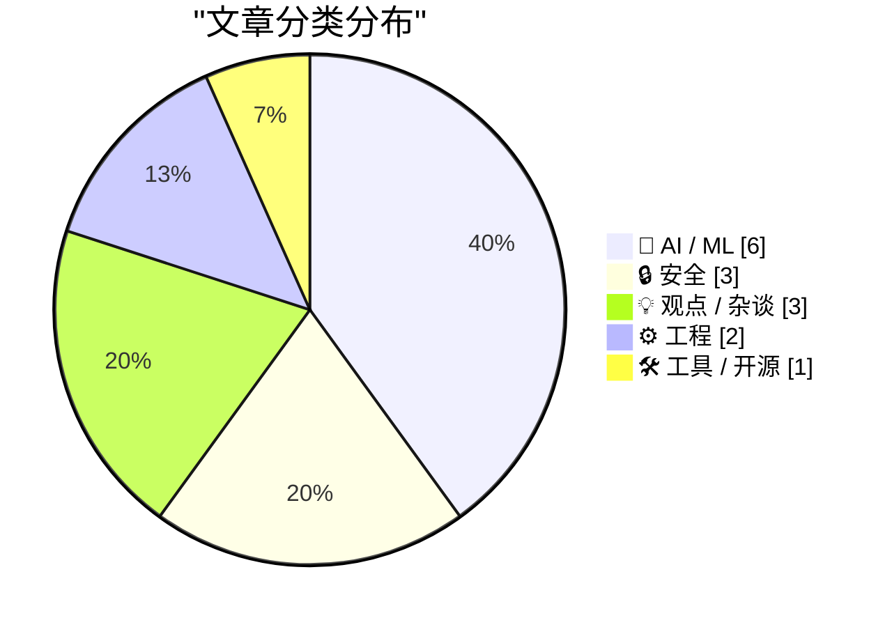
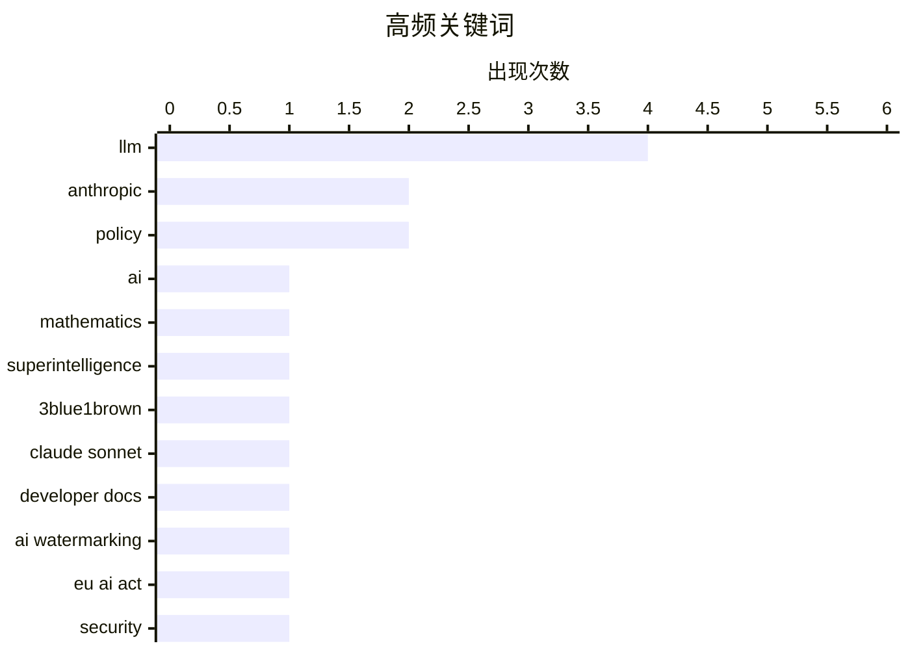

# 📰 Jul 2, 2026

> 来自 Karpathy 推荐的 92 个顶级技术博客，AI 精选 Top 15

## 📝 今日看点

今日技术圈见证了AI模型性能与成本效益的再度飞跃，Anthropic与谷歌竞相发布高性价比新版本，标志着大模型正加速进入普惠与高效应用期。与此同时，AI在数学逻辑验证及社会影响层面的讨论持续深入，但其输出水印的易破解性与隐私漏洞也引发了对安全合规的深度忧虑。在工程实践上，开发者正从单纯的任务交付转向对“增量价值”的长期思考，力求在快速迭代中沉淀更具韧性的技术资产。

---

## 🏆 今日必读

🥇 **Grant Sanderson 访谈：AI 与数学的未来**

[Grant Sanderson – AI and the future of math](https://www.dwarkesh.com/p/grant-sanderson-2) — dwarkesh.com · 1 天前 · 🤖 AI / ML

> 探讨 AI 如何改变数学研究与教育。3Blue1Brown 创作者 Grant Sanderson 认为数学将是首个见证超级智能的领域，因为其逻辑严密且易于验证。讨论涵盖了形式化证明工具（如 Lean）与大语言模型的结合，以及 AI 辅助下数学直觉的演变。作者指出，虽然 AI 能解决复杂计算，但人类在定义“有趣”的问题上仍具独特价值。访谈深入分析了 AI 时代数学家角色的转变。

💡 **为什么值得读**: 深入探讨 AI 在逻辑严密领域（数学）的演变路径及对人类创造力的影响。

🏷️ AI, mathematics, superintelligence, 3Blue1Brown

🥈 **Claude Sonnet 5 更新详解**

[What's new in Claude Sonnet 5](https://simonwillison.net/2026/Jun/30/claude-sonnet-5/#atom-everything) — simonwillison.net · 1 天前 · 🤖 AI / ML

> Anthropic 发布了 Claude Sonnet 5，其性能已接近 Opus 4.8，但成本更低且速度更快。开发者文档显示，该版本在代码生成、视觉理解和复杂推理方面有显著提升。文章重点关注了 API 的新特性，包括更长的上下文处理能力和更优的指令遵循。Simon Willison 建议开发者优先关注官方开发者文档而非宣传稿，以获取更具操作性的技术细节。该模型旨在平衡高性能与大规模部署的经济性。

💡 **为什么值得读**: 快速了解 Claude 最新主力模型的性能定位与开发者关注的技术细节。

🏷️ Anthropic, Claude Sonnet, LLM, Developer Docs

🥉 **文本 AI 水印将永远易于被移除**

[Text AI watermarks will always be trivial to remove](https://seangoedecke.com/text-ai-watermarks/) — seangoedecke.com · 9 小时前 · 🔒 安全

> 针对欧盟《人工智能法案》要求 AI 输出必须可检测的规定，文章论证了文本水印在技术上的脆弱性。作者指出，通过简单的同义词替换、重写或翻译后再翻译，即可轻易破坏基于统计分布的水印。即使是复杂的 Logit 偏置水印，也无法抵御低成本的对抗性攻击。结论认为，强制推行文本水印在技术上是徒劳的，无法从根本上解决 AI 内容识别问题。这种监管要求可能导致合规成本增加却无法达到预期效果。

💡 **为什么值得读**: 从技术底层逻辑剖析了 AI 监管政策（如水印强制化）在实际操作中面临的失效风险。

🏷️ AI Watermarking, EU AI Act, LLM, Security

---

## 📊 数据概览

| 扫描源 | 抓取文章 | 时间范围 | 精选 |
|:---:|:---:|:---:|:---:|
| 82/92 | 2483 篇 → 43 篇 | 48h | **15 篇** |

### 分类分布



### 高频关键词



<details>
<summary>📈 纯文本关键词图（终端友好）</summary>

```
llm               │ ████████████████████ 4
anthropic         │ ██████████░░░░░░░░░░ 2
policy            │ ██████████░░░░░░░░░░ 2
ai                │ █████░░░░░░░░░░░░░░░ 1
mathematics       │ █████░░░░░░░░░░░░░░░ 1
superintelligence │ █████░░░░░░░░░░░░░░░ 1
3blue1brown       │ █████░░░░░░░░░░░░░░░ 1
claude sonnet     │ █████░░░░░░░░░░░░░░░ 1
developer docs    │ █████░░░░░░░░░░░░░░░ 1
ai watermarking   │ █████░░░░░░░░░░░░░░░ 1
```

</details>

### 🏷️ 话题标签

**llm**(4) · **anthropic**(2) · **policy**(2) · ai(1) · mathematics(1) · superintelligence(1) · 3blue1brown(1) · claude sonnet(1) · developer docs(1) · ai watermarking(1) · eu ai act(1) · security(1) · jax(1) · machine-learning(1) · training-loop(1) · ai automation(1) · essays(1) · future of ai(1) · icloud(1) · privacy(1)

---

## 🤖 AI / ML

### 1. Grant Sanderson 访谈：AI 与数学的未来

[Grant Sanderson – AI and the future of math](https://www.dwarkesh.com/p/grant-sanderson-2) — **dwarkesh.com** · 1 天前 · ⭐ 28/30

> 探讨 AI 如何改变数学研究与教育。3Blue1Brown 创作者 Grant Sanderson 认为数学将是首个见证超级智能的领域，因为其逻辑严密且易于验证。讨论涵盖了形式化证明工具（如 Lean）与大语言模型的结合，以及 AI 辅助下数学直觉的演变。作者指出，虽然 AI 能解决复杂计算，但人类在定义“有趣”的问题上仍具独特价值。访谈深入分析了 AI 时代数学家角色的转变。

🏷️ AI, mathematics, superintelligence, 3Blue1Brown

---

### 2. Claude Sonnet 5 更新详解

[What's new in Claude Sonnet 5](https://simonwillison.net/2026/Jun/30/claude-sonnet-5/#atom-everything) — **simonwillison.net** · 1 天前 · ⭐ 27/30

> Anthropic 发布了 Claude Sonnet 5，其性能已接近 Opus 4.8，但成本更低且速度更快。开发者文档显示，该版本在代码生成、视觉理解和复杂推理方面有显著提升。文章重点关注了 API 的新特性，包括更长的上下文处理能力和更优的指令遵循。Simon Willison 建议开发者优先关注官方开发者文档而非宣传稿，以获取更具操作性的技术细节。该模型旨在平衡高性能与大规模部署的经济性。

🏷️ Anthropic, Claude Sonnet, LLM, Developer Docs

---

### 3. 从零开始编写 LLM（第 34a 部分）：构建 JAX 训练循环

[Writing an LLM from scratch, part 34a -- building a JAX training loop for an LLM training run](https://www.gilesthomas.com/2026/06/llm-from-scratch-34a-building-a-jax-training-loop-for-an-llm-training-run) — **gilesthomas.com** · 1 天前 · ⭐ 27/30

> 本文是“从零实现 LLM”系列的实战篇，详细介绍了如何使用 JAX 框架构建大模型的训练循环。作者放弃了现成的库，通过原生 JAX 代码实现了数据加载、梯度计算和参数更新流程。文中对比了 JAX 与 PyTorch 在处理状态管理和并行化方面的差异，并展示了如何优化训练效率。这标志着作者完成了从理论学习到完全自主实现模型训练的关键跨越。该教程为理解现代 AI 训练底层机制提供了极佳参考。

🏷️ LLM, JAX, machine-learning, training-loop

---

### 4. 关于 AI 重大问题的获奖论文集

[The Winning Essays for the Big Questions About AI](https://www.dwarkesh.com/p/blog-prize-winners) — **dwarkesh.com** · 11 小时前 · ⭐ 27/30

> 该合集汇集了探讨 AI 长期影响的获奖论文，涵盖了流行病消除、自动化转型等核心议题。其中一篇论文借鉴香港地铁（MTR）的商业模式，探讨了 AI 基础设施的融资与运营新思路。另一部分内容讨论了在 AI 自动化浪潮中，人类社会应如何调整政策以实现平稳过渡。这些文章从经济、安全和治理等多个维度提供了前瞻性的思考。整体观点倾向于通过制度创新来引导 AI 技术造福人类。

🏷️ AI automation, essays, future of AI, policy

---

### 5. Anthropic 动态：Claude Fable 5 与 Mythos 5 出口管制解除

[Quoting Anthropic](https://simonwillison.net/2026/Jun/30/anthropic/#atom-everything) — **simonwillison.net** · 1 天前 · ⭐ 25/30

> Anthropic 官方宣布，美国商务部已解除对 Claude Fable 5 和 Mythos 5 两个模型的出口管制。公司计划从次日开始逐步恢复相关地区的访问权限，并承诺随后发布详细更新。这一变动意味着更高性能的 AI 模型将能够进入更广泛的国际市场。文章简要记录了这一政策转折点及其对 Anthropic 全球布局的影响。这反映了 AI 监管环境在特定技术领域的动态调整。

🏷️ Anthropic, Claude, LLM, Export Controls

---

### 6. Nano Banana 2 Lite：谷歌最快最廉价的图像模型

[Nano Banana 2 Lite](https://simonwillison.net/2026/Jun/30/nano-banana-2-lite/#atom-everything) — **simonwillison.net** · 1 天前 · ⭐ 25/30

> 谷歌发布了名为 Nano Banana 2 Lite 的图像模型，其 API 名称为 gemini-3.1-flash-lite-image。该模型被定位为 Gemini 系列中最快、成本最低的图像生成工具，专为高并发和大规模应用场景设计。Simon Willison 通过 AI Studio 对其进行了初步测试，验证了其在生成速度上的优势。该模型的推出进一步降低了开发者集成高质量图像生成能力的门槛。它是谷歌在轻量化、高性能模型竞争中的重要布局。

🏷️ Google Gemini, Image Generation, AI Model, Flash Lite

---

## 🔒 安全

### 7. 文本 AI 水印将永远易于被移除

[Text AI watermarks will always be trivial to remove](https://seangoedecke.com/text-ai-watermarks/) — **seangoedecke.com** · 9 小时前 · ⭐ 27/30

> 针对欧盟《人工智能法案》要求 AI 输出必须可检测的规定，文章论证了文本水印在技术上的脆弱性。作者指出，通过简单的同义词替换、重写或翻译后再翻译，即可轻易破坏基于统计分布的水印。即使是复杂的 Logit 偏置水印，也无法抵御低成本的对抗性攻击。结论认为，强制推行文本水印在技术上是徒劳的，无法从根本上解决 AI 内容识别问题。这种监管要求可能导致合规成本增加却无法达到预期效果。

🏷️ AI Watermarking, EU AI Act, LLM, Security

---

### 8. iCloud“隐藏邮件地址”漏洞泄露用户真实邮箱

[404 Media: Vulnerability in iCloud’s ‘Hide My Email’ Reveals Peoples’ Real Email Addresses](https://www.404media.co/apple-hide-my-email-vulnerability-reveals-peoples-real-email-addresses/) — **daringfireball.net** · 18 小时前 · ⭐ 26/30

> 404 Media 披露了苹果 iCloud“隐藏邮件地址”（Hide My Email）功能存在严重隐私漏洞，可能导致用户真实邮箱泄露。该漏洞已在一年前报告给苹果，但至今仍未修复，且目前仍可被利用。由于安全风险，媒体暂未公开具体漏洞细节，但已通过实测验证了其有效性。这引发了用户对苹果隐私保护功能可靠性以及漏洞修复效率的质疑。建议依赖该功能的用户在修复前保持警惕。

🏷️ iCloud, privacy, vulnerability, email

---

### 9. 气密舱门的另一侧：更改管理员设置不等于漏洞

[It rather involved being on the other side of this airtight hatchway: Changing administrative settings](https://devblogs.microsoft.com/oldnewthing/20260701-00/?p=112498) — **devblogs.microsoft.com/oldnewthing** · 19 小时前 · ⭐ 24/30

> Raymond Chen 再次通过“气密舱门”类比，驳斥了关于“管理员可以更改管理设置”是安全漏洞的常见误解。文章指出，安全漏洞的定义是跨越安全边界（如从普通用户提升到管理员），而管理员修改系统配置属于其职权范围内的正常操作。许多所谓的漏洞报告实际上只是在描述系统预期的工作方式，即已经处于“舱门”内部的人在操作舱内设备。作者强调，理解安全边界是评估软件安全性的基础，不应将合法的权限行使误认为安全缺陷。

🏷️ Windows, security-boundary, privilege-escalation

---

## 💡 观点 / 杂谈

### 10. AI 行业正在溃败

[The AI Industry Is Losing](https://www.wheresyoured.at/the-ai-industry-is-losing/) — **wheresyoured.at** · 1 天前 · ⭐ 25/30

> 生成式 AI 行业正面临严重的经济危机，其高昂的运营成本与实际产出的商业价值之间存在巨大鸿沟。尽管 NVIDIA、Anthropic 等巨头投入了数十亿美元，但 AI 仍未能解决核心的可靠性问题，且在提高生产力方面表现平平。随着模型训练成本呈指数级增长，而用户付费意愿和实际应用场景受限，这种“烧钱换增长”的模式已难以为继。作者认为，AI 行业正处于一个不可持续的泡沫中，如果不能迅速转向盈利和实用主义，将面临严重的崩盘。

🏷️ AI industry, economics, NVIDIA, tech bubble

---

### 11. 技术蟹化：平台崩坏的必然性

[Pluralistic: Technocarcinization (01 Jul 2026)](https://pluralistic.net/2026/07/01/ontogeny/) — **pluralistic.net** · 18 小时前 · ⭐ 24/30

> 文章提出了“技术蟹化”（Technocarcinization）概念，探讨了科技平台如何不可避免地走向“屎化”（Enshittification）和垄断。通过分析 Spotify 与苹果的垄断之争以及数字服务中“对象永恒性”的丧失，揭示了平台在捕获用户后，必然会为了榨取利润而牺牲产品质量。作者指出，这种退化并非技术必然，而是资本市场对短期利润的追求和反垄断监管缺失的共同结果。最终，所有平台都会演变成榨取剩余价值的租金机器，除非通过强有力的法律手段进行干预。

🏷️ enshittification, antitrust, monopoly, tech-policy

---

### 12. 欧盟《网络韧性法案》（CRA）并非为了开源

[The CRA is not about open source](https://nesbitt.io/2026/07/01/the-cra-is-not-about-open-source.html) — **nesbitt.io** · 23 小时前 · ⭐ 24/30

> 欧盟《网络韧性法案》（CRA）虽然设立了“开源管家”角色，但其核心目的并非支持开源，而是将其纳入严苛的商业监管框架。该法案要求软件产品满足极高的安全合规标准，却未为开源项目的维护和审计提供任何资金支持。这导致许多依赖志愿者维护的开源项目面临巨大的合规压力和法律风险，甚至可能被迫退出欧洲市场。作者认为，这种只给责任不给资源的立法方式，将严重损害开源生态的创新能力和生存空间。

🏷️ CRA, open source, policy, funding

---

## ⚙️ 工程

### 13. Pluralistic：区分“今日任务”与“增量工作”

[Pluralistic: The difference between "today's task" and "accretive work" (02 Jul 2026)](https://pluralistic.net/2026/07/02/canonization/) — **pluralistic.net** · 1 小时前 · ⭐ 26/30

> Cory Doctorow 探讨了软件开发和创作中“完成任务”与“积累价值”之间的本质区别。他指出，仅仅追求“让代码跑通”往往会产生技术债，而“增量工作”则强调构建可复用、可维护的长期资产。文章通过多个案例说明，过度关注短期交付会导致系统性腐败，使未来的工作变得更加困难。作者呼吁开发者和管理者应平衡即时需求与系统的长期健康。这种思维方式对于避免职业倦怠和提升工程质量至关重要。

🏷️ productivity, software engineering, technical debt

---

### 14. Clickhouse 正在赢得可观测性之战

[Clickhouse is winning the Observability Wars](https://matduggan.com/clickhouse-is-winning-the-observability-wars/) — **matduggan.com** · 20 小时前 · ⭐ 25/30

> Clickhouse 凭借其卓越的列式存储性能和极高的成本效益，正在颠覆由 Datadog 和 New Relic 主导的可观测性市场。传统的监控方案因数据量激增导致费用失控，而 Clickhouse 允许开发者以极低的硬件成本处理每秒数百万条的日志和指标。目前，诸如 HyperDX、SigNoz 和 Highlight.io 等新兴平台均选择 Clickhouse 作为底层引擎，而非传统的 Elasticsearch。这种趋势标志着可观测性技术栈正从昂贵的 SaaS 转向基于高性能开源数据库的自建方案。

🏷️ Clickhouse, observability, monitoring, database

---

## 🛠 工具 / 开源

### 15. 使用 shot-scraper video 让 AI 代理记录工作演示视频

[Have your agent record video demos of its work with shot-scraper video](https://simonwillison.net/2026/Jun/30/shot-scraper-video/#atom-everything) — **simonwillison.net** · 1 天前 · ⭐ 25/30

> 开发者工具 shot-scraper 1.10 版本引入了 video 命令，支持通过 storyboard.yml 文件定义自动化流程。该工具利用 Playwright 驱动浏览器运行预设脚本，并将其执行过程录制为视频。这为 AI 代理（Agent）展示其网页操作过程提供了一种标准化的可视化方案。作者强调，这种自动化的视频记录对于调试 AI 行为和向用户展示工作成果至关重要。该工具极大简化了从自动化脚本到视频演示的转化流程。

🏷️ Automation, Browser Scripting, shot-scraper, Video

---

*生成于 2026-07-02 09:26 | 扫描 82 源 → 获取 2483 篇 → 精选 15 篇*
*基于 [Hacker News Popularity Contest 2025](https://refactoringenglish.com/tools/hn-popularity/) RSS 源列表，由 [Andrej Karpathy](https://x.com/karpathy) 推荐*
