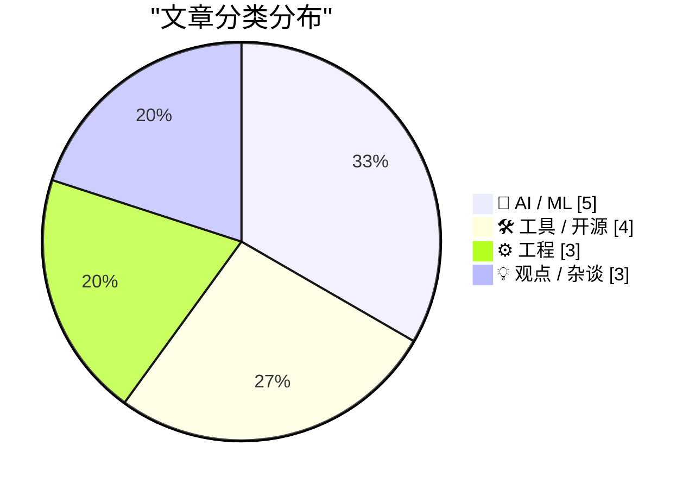
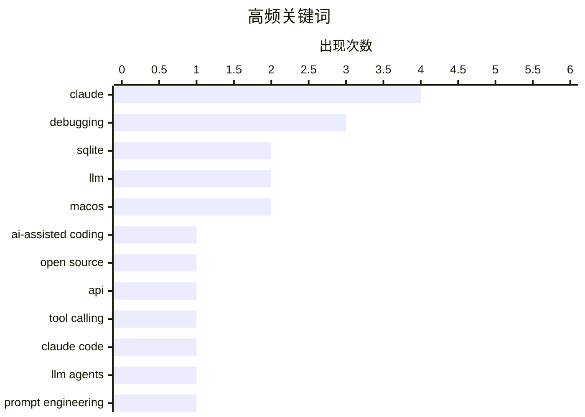

# 📰 Jul 5, 2026

> 来自 Karpathy 推荐的 92 个顶级技术博客，AI 精选 Top 15

## 📝 今日看点

今日技术圈见证了 AI 辅助编程从“辅助”向“自主”的跨越，开发者开始利用智能体以极低成本完成复杂软件的重大版本更新。与此同时，AI 的快速渗透正深刻重塑行业生态，不仅引发了工具调用幻觉等技术挑战，更对传统开发者教育市场造成了显著冲击。此外，针对开源与闭源模型技术代差的量化追踪，反映出业界在构建 AI 公共选项与技术公平方面的最新努力。

---

## 🏆 今日必读

🥇 **sqlite-utils 4.0rc2 发布：主要由 Claude Fable 编写（耗资约 149 美元）**

[sqlite-utils 4.0rc2, mostly written by Claude Fable (for about $149.25)](https://simonwillison.net/2026/Jul/5/sqlite-utils-fable/#atom-everything) — simonwillison.net · 8 小时前 · 🛠 工具 / 开源

> Simon Willison 利用 Claude Fable 智能体完成了 sqlite-utils 4.0rc2 的开发，旨在实现符合 SemVer 规范的重大版本更新。在约 149.25 美元的 API 成本下，Fable 协助处理了不兼容的重大变更、重构了核心代码并修复了长期存在的 Bug。该版本重点优化了 CLI 工具的易用性，并确保了 API 的一致性。作者通过此过程验证了 AI 智能体在维护复杂开源项目和处理破坏性更新方面的极高效率。

💡 **为什么值得读**: 展示了如何利用 AI 智能体（而非简单的聊天机器人）低成本、高质量地完成开源软件的重大版本迭代。

🏷️ SQLite, Claude, AI-assisted coding, Open Source

🥈 **更强的模型，更糟的工具：Claude Opus 4.8 的工具调用幻觉**

[Better Models: Worse Tools](https://simonwillison.net/2026/Jul/4/better-models-worse-tools/#atom-everything) — simonwillison.net · 10 小时前 · 🤖 AI / ML

> Armin Ronacher 发现 Claude Opus 4.8 等最新模型在调用 Pi 的编辑工具时，会频繁在 edits[] 数组中伪造 Schema 之外的字段。尽管模型生成的编辑逻辑通常正确，但由于参数不符合定义的 JSON 规范，导致系统因校验失败而拒绝执行。这种现象揭示了模型“通用智能”提升与“严格遵循指令”能力之间的脱节。作者认为，更强大的模型在处理结构化工具调用时反而可能表现出更差的可靠性。

💡 **为什么值得读**: 揭示了顶级 AI 模型在结构化输出和工具调用中存在的“越聪明越不听话”的反直觉退化现象。

🏷️ LLM, Claude, API, Debugging

🥉 **更强的模型，更糟的工具：Claude Opus 4.8 的工具调用幻觉**

[Better Models: Worse Tools](https://lucumr.pocoo.org/2026/7/4/better-models-worse-tools/) — lucumr.pocoo.org · 1 天前 · 🤖 AI / ML

> Armin Ronacher 发现 Claude Opus 4.8 等最新模型在调用 Pi 的编辑工具时，会频繁在 edits[] 数组中伪造 Schema 之外的字段。尽管模型生成的编辑逻辑通常正确，但由于参数不符合定义的 JSON 规范，导致系统因校验失败而拒绝执行。这种现象揭示了模型“通用智能”提升与“严格遵循指令”能力之间的脱节。作者认为，更强大的模型在处理结构化工具调用时反而可能表现出更差的可靠性。

💡 **为什么值得读**: 揭示了顶级 AI 模型在结构化输出和工具调用中存在的“越聪明越不听话”的反直觉退化现象。

🏷️ LLM, Claude, tool calling, debugging

---

## 📊 数据概览

| 扫描源 | 抓取文章 | 时间范围 | 精选 |
|:---:|:---:|:---:|:---:|
| 83/92 | 2489 篇 → 23 篇 | 48h | **15 篇** |

### 分类分布



### 高频关键词



<details>
<summary>📈 纯文本关键词图（终端友好）</summary>

```
claude             │ ████████████████████ 4
debugging          │ ███████████████░░░░░ 3
sqlite             │ ██████████░░░░░░░░░░ 2
llm                │ ██████████░░░░░░░░░░ 2
macos              │ ██████████░░░░░░░░░░ 2
ai-assisted coding │ █████░░░░░░░░░░░░░░░ 1
open source        │ █████░░░░░░░░░░░░░░░ 1
api                │ █████░░░░░░░░░░░░░░░ 1
tool calling       │ █████░░░░░░░░░░░░░░░ 1
claude code        │ █████░░░░░░░░░░░░░░░ 1
```

</details>

### 🏷️ 话题标签

**claude**(4) · **debugging**(3) · **sqlite**(2) · llm(2) · macos(2) · ai-assisted coding(1) · open source(1) · api(1) · tool calling(1) · claude code(1) · llm agents(1) · prompt engineering(1) · ascii(1) · codex(1) · data compression(1) · visualization(1) · open source ai(1) · ai policy(1) · landscape(1) · electron(1)

---

## 🤖 AI / ML

### 1. 更强的模型，更糟的工具：Claude Opus 4.8 的工具调用幻觉

[Better Models: Worse Tools](https://simonwillison.net/2026/Jul/4/better-models-worse-tools/#atom-everything) — **simonwillison.net** · 10 小时前 · ⭐ 27/30

> Armin Ronacher 发现 Claude Opus 4.8 等最新模型在调用 Pi 的编辑工具时，会频繁在 edits[] 数组中伪造 Schema 之外的字段。尽管模型生成的编辑逻辑通常正确，但由于参数不符合定义的 JSON 规范，导致系统因校验失败而拒绝执行。这种现象揭示了模型“通用智能”提升与“严格遵循指令”能力之间的脱节。作者认为，更强大的模型在处理结构化工具调用时反而可能表现出更差的可靠性。

🏷️ LLM, Claude, API, Debugging

---

### 2. 更强的模型，更糟的工具：Claude Opus 4.8 的工具调用幻觉

[Better Models: Worse Tools](https://lucumr.pocoo.org/2026/7/4/better-models-worse-tools/) — **lucumr.pocoo.org** · 1 天前 · ⭐ 25/30

> Armin Ronacher 发现 Claude Opus 4.8 等最新模型在调用 Pi 的编辑工具时，会频繁在 edits[] 数组中伪造 Schema 之外的字段。尽管模型生成的编辑逻辑通常正确，但由于参数不符合定义的 JSON 规范，导致系统因校验失败而拒绝执行。这种现象揭示了模型“通用智能”提升与“严格遵循指令”能力之间的脱节。作者认为，更强大的模型在处理结构化工具调用时反而可能表现出更差的可靠性。

🏷️ LLM, Claude, tool calling, debugging

---

### 3. 信任 Fable 的判断：AI 辅助编程的新策略

[Fable's judgement](https://simonwillison.net/2026/Jul/3/judgement/#atom-everything) — **simonwillison.net** · 1 天前 · ⭐ 24/30

> Simon Willison 分享了来自 Claude Code 团队的核心建议：在与 Fable 或 Opus 等高级模型协作时，应给予其更多自主判断权，而非过度约束。例如在测试环节，与其生硬规定“仅为大功能编写自动化测试”，不如让模型根据代码复杂度和风险自行决定测试策略。这种方法能减少提示词中的摩擦，充分发挥模型在特定上下文中的推理能力。作者认为，学会“放权”是提升 AI 协作效率的关键进阶技巧。

🏷️ Claude Code, LLM Agents, Prompt Engineering

---

### 4. 开源 AI 差距地图：追踪开放与封闭模型的技术鸿沟

[Open Source AI Gap Map](https://simonwillison.net/2026/Jul/3/open-source-ai-gap-map/#atom-everything) — **simonwillison.net** · 1 天前 · ⭐ 22/30

> 非营利组织 Current AI 发布了“差距地图（Gap Map）v0.1”，旨在量化开源 AI 与闭源商业模型之间的技术代差。该组织已获得 4 亿美元资金支持，致力于构建 AI 的“公共选项”，确保开源生态的竞争力。地图通过多维度指标索引当前 AI 领域的发展现状，识别开源模型在推理、多模态等方面的滞后点。这为开发者和政策制定者提供了一个透明的基准，以推动更开放的 AI 技术普及。

🏷️ Open Source AI, AI Policy, Landscape

---

### 5. 增加数据是否总能减小后验方差？

[Does additional data always reduce posterior variance?](https://www.johndcook.com/blog/2026/07/03/does-additional-data-always-reduce-posterior-variance/) — **johndcook.com** · 1 天前 · ⭐ 18/30

> 在统计学中，人们普遍认为更多的数据会减少估计的不确定性，使后验分布更加集中。然而，从贝叶斯视角来看，后验方差并不总是随着样本量的增加而单调递减。文章探讨了在特定概率模型（如柯西分布或模型失配）下，新观测值可能反而增加分布的离散程度。这提醒开发者和数据科学家，在处理非正态分布或复杂模型时，不能盲目假设数据量与置信度成正比。理解这种非直觉现象对于构建鲁棒的推断模型至关重要。

🏷️ Bayesian, statistics, data science, probability

---

## 🛠 工具 / 开源

### 6. sqlite-utils 4.0rc2 发布：主要由 Claude Fable 编写（耗资约 149 美元）

[sqlite-utils 4.0rc2, mostly written by Claude Fable (for about $149.25)](https://simonwillison.net/2026/Jul/5/sqlite-utils-fable/#atom-everything) — **simonwillison.net** · 8 小时前 · ⭐ 27/30

> Simon Willison 利用 Claude Fable 智能体完成了 sqlite-utils 4.0rc2 的开发，旨在实现符合 SemVer 规范的重大版本更新。在约 149.25 美元的 API 成本下，Fable 协助处理了不兼容的重大变更、重构了核心代码并修复了长期存在的 Bug。该版本重点优化了 CLI 工具的易用性，并确保了 API 的一致性。作者通过此过程验证了 AI 智能体在维护复杂开源项目和处理破坏性更新方面的极高效率。

🏷️ SQLite, Claude, AI-assisted coding, Open Source

---

### 7. Fantastical 4.1.15 推出“日历镜像”功能：兼顾隐私与防冲突

[Fantastical 4.1.15 Adds Calendar Mirroring](https://flexibits.com/blog/2026/06/double-booked-never-heard-of-it-meet-calendar-mirroring-in-fantastical/) — **daringfireball.net** · 16 小时前 · ⭐ 18/30

> 知名日历应用 Fantastical 在 4.1.15 版本中引入了“日历镜像（Calendar Mirroring）”功能，允许用户同步工作与个人日历。该功能支持将一个日历的事件自动映射到另一个日历中，并可选择仅显示“忙碌”状态以隐藏私人细节。所有同步过程均在本地设备完成，不会将事件信息上传至 Flexibits 服务器，确保了极高的隐私性。这一更新解决了多日历用户在避免会议冲突时难以保护个人隐私的长期痛点。

🏷️ calendar, productivity, privacy, macOS

---

### 8. 包管理周报：2026 年 7 月 4 日

[This Week in Package Management: 4 July 2026](https://nesbitt.io/2026/07/04/this-week-in-package-management.html) — **nesbitt.io** · 23 小时前 · ⭐ 18/30

> 本期周报汇集了全球主流包管理系统的最新动态，涵盖了软件发布、安全预警及深度技术文章。内容涉及 npm、PyPI、Cargo 等生态系统的版本更新，并重点关注了近期发现的供应链安全漏洞。通过汇总这些零散信息，开发者可以快速掌握依赖管理领域的最佳实践。这是维护现代软件供应链安全和稳定性的重要参考资料。对于关注 DevOps 和自动化构建的工程师来说，这是不可或缺的行业快讯。

🏷️ package management, security, releases

---

### 9. sqlite-utils 4.0rc2 发布：AI 协作开发的里程碑

[sqlite-utils 4.0rc2](https://simonwillison.net/2026/Jul/5/sqlite-utils/#atom-everything) — **simonwillison.net** · 8 小时前 · ⭐ 17/30

> Simon Willison 发布了 sqlite-utils 4.0 的第二个候选版本，这是一个用于操作 SQLite 数据库的 Python 工具库。值得关注的是，该版本的大部分代码是由 AI 模型 Claude Fable 编写的，总计开发成本约为 149.25 美元。新版本在保持原有强大功能的基础上，进一步优化了 CLI 交互和 API 设计。这一发布不仅是工具的升级，更是 AI 辅助大规模软件开发的一个成功实践案例。它展示了在人类监督下，AI 如何显著降低高质量开源软件的开发成本。

🏷️ SQLite, release

---

## ⚙️ 工程

### 10. 仅用 500 字节构建世界地图

[Building a World Map with only 500 bytes](https://simonwillison.net/2026/Jul/4/building-a-world-map-with-only-500-bytes/#atom-everything) — **simonwillison.net** · 10 小时前 · ⭐ 22/30

> Iwo Kadziela 在 AI 助手 Codex 的帮助下，成功实现仅用 445 字节数据生成一张效果惊人的 ASCII 字符世界地图。该方案的核心技巧在于利用 Deflate 压缩算法，将地理坐标信息极度精简。生成的地图使用黑色星号（*）渲染，在极小的体积下保持了极高的辨识度。这一实验展示了在极端资源受限环境下，结合现代压缩技术与 AI 辅助优化的无限潜力。

🏷️ ASCII, Codex, Data Compression, Visualization

---

### 11. 我们是如何判定 CcNamespace.dll 是 DLL 提前卸载事件的“主谋”的？

[How did we conclude that CcNamespace.dll was the ringleader of a group of DLLs that unloaded prematurely?](https://devblogs.microsoft.com/oldnewthing/20260703-00/?p=112504) — **devblogs.microsoft.com/oldnewthing** · 1 天前 · ⭐ 19/30

> Windows 技术专家 Raymond Chen 分享了一个复杂的调试案例，涉及一组 DLL 动态链接库被异常提前卸载的问题。通过分析系统日志和内存状态中的上下文线索，排错团队最终锁定了 CcNamespace.dll 是导致连锁反应的根源。文章详细介绍了如何通过细微的迹象推断组件间的依赖关系和执行顺序。这展示了在缺乏直接错误报告的情况下，资深工程师如何利用经验进行逻辑推理。

🏷️ Windows, DLL, debugging, system architecture

---

### 12. 结合一维码与二维码：一种混合条码方案

[Combined 1D and 2D Barcodes](https://shkspr.mobi/blog/2026/07/combined-1d-and-2d-barcodes/) — **shkspr.mobi** · 21 小时前 · ⭐ 18/30

> 随着零售业计划从传统一维条码向二维码（QR Code）过渡，如何兼容旧设备成为一个实际挑战。作者提出了一种将 UPC 一维码直接嵌入到 QR 二维码中的创新方案。通过调整扫描距离，手机在靠近时（遮挡定位角）可读取一维码数字，而在正常距离下则识别二维码信息。这种设计利用了二维码的容错特性，在不增加额外标签空间的前提下实现了双重兼容。该方案为零售业从 1970 年代的旧技术向现代标准平滑过渡提供了新思路。

🏷️ barcode, QR code, UPC, design

---

## 💡 观点 / 杂谈

### 13. Claude 糟糕的 Electron Mac 应用：一场“内部人士”的杰作

[★ Claude’s Criminally Bad Electron Mac App Is an Inside Job](https://daringfireball.net/2026/07/claudes_criminally_bad_mac_app_is_an_inside_job) — **daringfireball.net** · 1 天前 · ⭐ 22/30

> John Gruber 猛烈抨击了 Claude 的 macOS 客户端，认为其作为 Electron 应用的表现极其糟糕。文章指出，该应用的开发者之一 Felix Rieseberg 正是 Electron 社区的领军人物，这解释了为何 Anthropic 坚持使用 Electron 框架。Gruber 认为这种开发模式牺牲了 Mac 原生应用的精致感和性能，如同为了推销锤子而把所有螺丝都钉进墙里。作者以此案例探讨了跨平台框架在追求开发效率时对用户体验造成的负面影响。

🏷️ Electron, Claude, macOS, performance

---

### 14. Josh W. Comeau：AI 冲击下的开发者教育市场

[Quoting Josh W. Comeau](https://simonwillison.net/2026/Jul/3/josh-w-comeau/#atom-everything) — **simonwillison.net** · 1 天前 · ⭐ 19/30

> 知名教程作者 Josh W. Comeau 透露其新课程《Whimsical Animations》的销量仅为往常的三分之一，且旧课程销量也大幅下滑。他认为 AI 的兴起造成了“双重打击”：一方面新手怀疑编程是否仍是值得投入的职业，另一方面学习者倾向于依赖 AI 生成代码而非系统学习。这种趋势反映了开发者教育市场的剧烈动荡，AI 正在改变人们获取技能的动机和方式。作者对编程教育的未来表示担忧，认为这种“走捷径”的心态可能削弱开发者的底层能力。

🏷️ Education, Market Trends, Developer Career

---

### 15. Maxis 的兴衰史（第一部分）：模拟万物

[The Life and Times of Maxis, Part 1: SimEverything](https://www.filfre.net/2026/07/the-life-and-times-of-maxis-part-1-simeverything/) — **filfre.net** · 1 天前 · ⭐ 17/30

> 本文回顾了传奇游戏工作室 Maxis 的早期历史及其核心灵魂人物 Will Wright 的设计哲学。Maxis 以《模拟城市》（SimCity）闻名，其核心理念是将大陆漂移等看似枯燥的科学系统转化为极具吸引力的游戏机制。文章详细描述了工作室如何挑战传统游戏定义，致力于通过“模拟万物”来激发玩家的创造力。这不仅是一段商业史，更是对复杂系统模拟与交互设计早期探索的深度记录。对于游戏开发者和系统设计师来说，Maxis 的方法论至今仍有启发意义。

🏷️ Maxis, SimCity, gaming history, simulation

---

*生成于 2026-07-05 09:16 | 扫描 83 源 → 获取 2489 篇 → 精选 15 篇*
*基于 [Hacker News Popularity Contest 2025](https://refactoringenglish.com/tools/hn-popularity/) RSS 源列表，由 [Andrej Karpathy](https://x.com/karpathy) 推荐*
