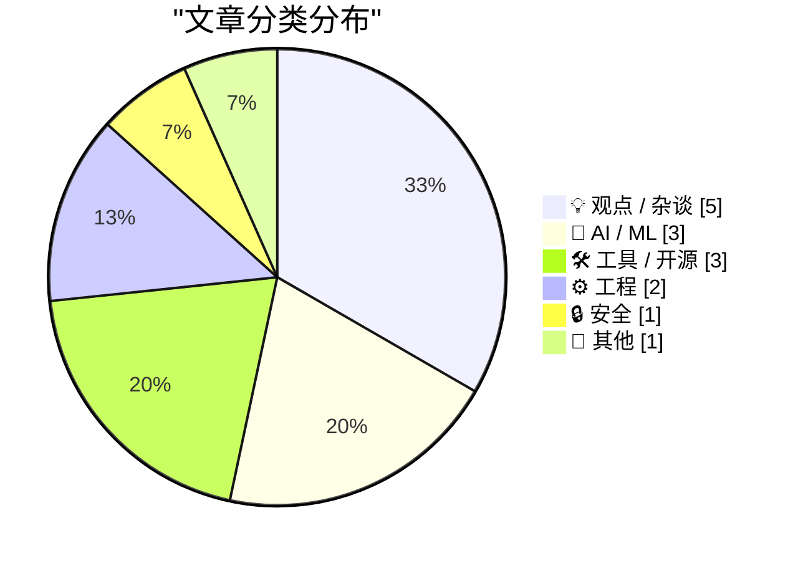
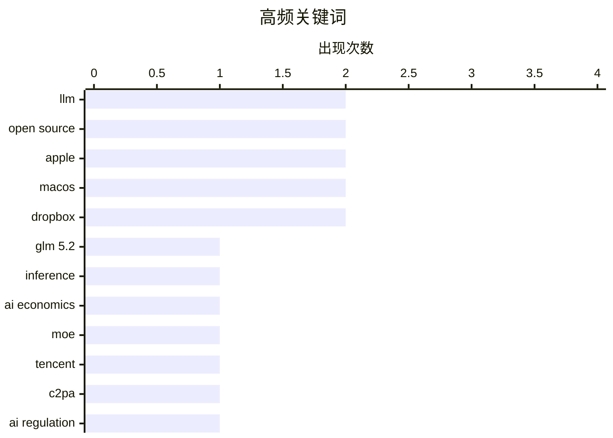

# 📰 Jul 7, 2026

> 来自 Karpathy 推荐的 92 个顶级技术博客，AI 精选 Top 15

## 📝 今日看点

今日技术圈见证了高性能开源AI模型的集体发力，腾讯与GLM的最新成果正通过极低的推理成本直接挑战闭源巨头的市场地位。在技术狂热背后，业界对AI治理缺陷的审视、对宏大叙事的质疑以及普遍的“审美疲劳”情绪也开始集中爆发。此外，苹果对Markdown标准的官方支持以及云存储备份生态的剧烈变动，标志着基础开发环境与数据服务正迎来新一轮的规范化与整合。

---

## 🏆 今日必读

🥇 **GLM 5.2 与即将到来的 AI 利润率崩盘（第一部分）**

[GLM 5.2 and the coming AI margin collapse (part 1)](https://martinalderson.com/posts/the-upcoming-ai-margin-collapse-part-1-glm-5-2/?utm_source=rss&amp;utm_medium=rss&amp;utm_campaign=feed) — martinalderson.com · 1 天前 · 🤖 AI / ML

> GLM 5.2 是首个在智能体（Agentic）任务中能与 GPT-4 和 Claude Opus 真正竞争的开源权重模型。其推理成本仅为顶级闭源模型的 15-20%，极大地降低了高性能 AI 应用的门槛。文章指出，随着此类高性能开源模型的普及，AI 推理服务的利润空间将面临剧烈压缩。这种趋势预示着 AI 行业正从高溢价阶段转向以成本和效率为核心的竞争阶段。作者认为，这种“利润崩盘”将迫使闭源模型厂商重新寻找差异化竞争点。

💡 **为什么值得读**: 揭示了高性能开源大模型如何通过极致性价比重塑 AI 商业版图并冲击闭源模型护城河。

🏷️ LLM, GLM 5.2, inference, AI economics

🥈 **腾讯发布 Hy3：295B 参数的开源混合专家模型**

[tencent/Hy3](https://simonwillison.net/2026/Jul/6/hy3/#atom-everything) — simonwillison.net · 9 小时前 · 🤖 AI / ML

> 腾讯正式发布了采用 Apache 2.0 协议开源的 Hy3 模型，这是一个拥有 295B 总参数量的混合专家（MoE）架构模型。该模型包含 21B 激活参数和 3.8B MTP 层参数，在收集 50 多个产品的反馈后，通过高质量数据进行了大规模后训练。Hy3 在性能上超越了同尺寸的其他模型，展现了腾讯在超大规模 MoE 架构上的技术积累。该模型现已在 Hugging Face 上线，供开发者免费使用和研究。

💡 **为什么值得读**: 了解国产顶级开源 MoE 模型的最新进展及其在参数规模与授权协议上的突破。

🏷️ MoE, LLM, Tencent, Open Source

🥉 **C2PA 协议的困局：除非全员签名，否则形同虚设**

[C2PA only works if everything is signed](https://seangoedecke.com/c2pa-only-works-if-everything-is-signed/) — seangoedecke.com · 1 天前 · 🔒 安全

> 欧盟 AI 法案要求通过数字签名元数据（如 C2PA 协议）来识别 AI 生成内容，以应对虚假信息。然而，C2PA 协议存在核心逻辑缺陷：如果只有部分内容签名，用户无法区分未签名的真实照片与未签名的 AI 伪造图。该协议只有在所有相机和创作工具都强制执行签名时，才能通过“缺失签名”来判定内容可疑。作者认为，目前的监管要求在技术落地层面面临巨大的“全量覆盖”挑战，难以真正解决识别难题。

💡 **为什么值得读**: 深入分析了 AI 内容溯源技术在现实监管与技术实现层面之间的逻辑漏洞。

🏷️ C2PA, AI Regulation, Watermarking, Provenance

---

## 📊 数据概览

| 扫描源 | 抓取文章 | 时间范围 | 精选 |
|:---:|:---:|:---:|:---:|
| 83/92 | 2498 篇 → 25 篇 | 48h | **15 篇** |

### 分类分布



### 高频关键词



<details>
<summary>📈 纯文本关键词图（终端友好）</summary>

```
llm          │ ████████████████████ 2
open source  │ ████████████████████ 2
apple        │ ████████████████████ 2
macos        │ ████████████████████ 2
dropbox      │ ████████████████████ 2
glm 5.2      │ ██████████░░░░░░░░░░ 1
inference    │ ██████████░░░░░░░░░░ 1
ai economics │ ██████████░░░░░░░░░░ 1
moe          │ ██████████░░░░░░░░░░ 1
tencent      │ ██████████░░░░░░░░░░ 1
```

</details>

### 🏷️ 话题标签

**llm**(2) · **open source**(2) · **apple**(2) · macos(2) · dropbox(2) · glm 5.2(1) · inference(1) · ai economics(1) · moe(1) · tencent(1) · c2pa(1) · ai regulation(1) · watermarking(1) · provenance(1) · softbank(1) · ai investment(1) · masayoshi son(1) · windows api(1) · file system(1) · win32(1)

---

## 💡 观点 / 杂谈

### 1. 软银黑粉指南：孙正义的 AI 狂想曲

[Premium: The Hater's Guide To SoftBank](https://www.wheresyoured.at/premium-the-haters-guide-to-softbank/) — **wheresyoured.at** · 19 小时前 · ⭐ 24/30

> 本文对软银第 46 届股东大会及孙正义展示的极具争议的幻灯片进行了深度剖析。孙正义在会上展示了被戏称为“脱缰野鹅”的愿景图，试图通过宏大叙事证明软银在 AI 领域的领导地位。文章批评了软银过度包装的叙事风格，认为其投资策略中存在明显的逻辑断层。作者通过对这些荒诞细节的解读，揭示了软银在当前 AI 热潮中试图通过口号挽回投资者信心的窘境。

🏷️ SoftBank, AI Investment, Masayoshi Son

---

### 2. 我对 AI 话题感到厌烦透了

[I'm just so bored of AI](https://shkspr.mobi/blog/2026/07/im-just-so-bored-of-ai/) — **shkspr.mobi** · 22 小时前 · ⭐ 22/30

> 作者表达了对当前社交媒体和技术圈中无休止的 AI 讨论的极度审美疲劳。他将听人谈论 AI 比作听电子烟民吹嘘烟油口味，认为这些对话充满了重复且毫无营养的辞藻。文章批评了将简单的自动化任务过度神化为“神秘启示”的倾向，认为这种狂热已经让人感到厌倦。这种观点反映了在 AI 浪潮下，一部分技术从业者对泡沫化叙事和过度营销的反感。

🏷️ AI, Industry Culture, AI Fatigue

---

### 3. 亚马逊自营：针对知识产权的“Amazon Basics”策略

[Amazon Basics, but for intellectual property.](https://idiallo.com/blog/amazon-basics-but-intellectual-property) — **idiallo.com** · 1 天前 · ⭐ 20/30

> 亚马逊作为平台方与自营品牌（Amazon Basics）的双重身份引发了严重的利益冲突。平台通过掌握所有第三方的销售指标、利润率和用户搜索数据，能够精准识别爆款并推出低价仿制品。这种行为本质上是利用数据优势进行知识产权掠夺，使卖家面临“为平台做市场调研”的困境。当平台既当裁判又当运动员时，第三方卖家的创新动力会被严重削弱。作者认为这种模式正在破坏电商生态的公平性，使平台成为最终的垄断赢家。

🏷️ Amazon, Intellectual Property, E-commerce

---

### 4. 撰写关于你尚不理解的事物

[Blog about things you don't understand yet](https://seangoedecke.com/blog-about-things-you-dont-understand-yet/) — **seangoedecke.com** · 9 小时前 · ⭐ 19/30

> 写作不应只是记录已知事实，而应是探索未知领域的过程。通过撰写关于自己尚不完全理解的主题，作者被迫在成文过程中填补知识盲点并发现深层逻辑。例如在分析 o3 模型 Geoguessr 提示词时，写作揭示了 AI 空间推理的意外局限。这种“边学边写”的模式不仅能提升文章的专业深度，也能确保内容对读者具有真正的启发性。作者认为，如果写作过程中没有学到新东西，那么这篇文章就不值得发布。

🏷️ Blogging, Learning, Career, Writing

---

### 5. 苹果应该打破 App 图标的“圆角矩形监狱”

[★ Apple Should Eliminate the App Icon ‘Squircle Jail’](https://daringfireball.net/2026/07/eliminate_app_icon_squircle_jail) — **daringfireball.net** · 11 小时前 · ⭐ 18/30

> 苹果强制要求 iOS 和 macOS 所有 App 图标采用统一的“圆角矩形”（Squircle）限制了设计的表现力。在早期 GUI 设计中，形状是图标最具辨识度的特征，而现在的统一规范导致了严重的视觉同质化。这种“图标监狱”削弱了品牌的独特性，使得用户在视觉搜索应用时的效率降低。作者呼吁苹果放开限制，允许开发者使用更具创意的非规则形状以增强系统的视觉活力。恢复图标形状的多样性将是提升用户界面个性化的关键一步。

🏷️ UI/UX, Apple, Design, Icons

---

## 🤖 AI / ML

### 6. GLM 5.2 与即将到来的 AI 利润率崩盘（第一部分）

[GLM 5.2 and the coming AI margin collapse (part 1)](https://martinalderson.com/posts/the-upcoming-ai-margin-collapse-part-1-glm-5-2/?utm_source=rss&amp;utm_medium=rss&amp;utm_campaign=feed) — **martinalderson.com** · 1 天前 · ⭐ 27/30

> GLM 5.2 是首个在智能体（Agentic）任务中能与 GPT-4 和 Claude Opus 真正竞争的开源权重模型。其推理成本仅为顶级闭源模型的 15-20%，极大地降低了高性能 AI 应用的门槛。文章指出，随着此类高性能开源模型的普及，AI 推理服务的利润空间将面临剧烈压缩。这种趋势预示着 AI 行业正从高溢价阶段转向以成本和效率为核心的竞争阶段。作者认为，这种“利润崩盘”将迫使闭源模型厂商重新寻找差异化竞争点。

🏷️ LLM, GLM 5.2, inference, AI economics

---

### 7. 腾讯发布 Hy3：295B 参数的开源混合专家模型

[tencent/Hy3](https://simonwillison.net/2026/Jul/6/hy3/#atom-everything) — **simonwillison.net** · 9 小时前 · ⭐ 25/30

> 腾讯正式发布了采用 Apache 2.0 协议开源的 Hy3 模型，这是一个拥有 295B 总参数量的混合专家（MoE）架构模型。该模型包含 21B 激活参数和 3.8B MTP 层参数，在收集 50 多个产品的反馈后，通过高质量数据进行了大规模后训练。Hy3 在性能上超越了同尺寸的其他模型，展现了腾讯在超大规模 MoE 架构上的技术积累。该模型现已在 Hugging Face 上线，供开发者免费使用和研究。

🏷️ MoE, LLM, Tencent, Open Source

---

### 8. 为什么 ChatGPT 的 Mac 客户端体验如此出色？

[Allen Pike, Back in November: ‘Why Is ChatGPT for Mac So Good?’](https://allenpike.com/2025/why-is-chatgpt-so-good-claude/) — **daringfireball.net** · 16 小时前 · ⭐ 19/30

> AI 巨头在桌面端原生应用的竞争日益白热化，OpenAI 凭借 ChatGPT for Mac 的深度集成占据先机。相比 Google 长期坚持的浏览器优先策略，Anthropic 正试图通过更精良的桌面客户端来争夺专业生产力用户。桌面端依然是重度工作的核心阵地，原生 App 在系统快捷键集成、屏幕感知和交互响应上的优势不可替代。OpenAI 此前收购 Sky 团队正是为了强化桌面端体验，这已成为 AI 厂商留住高价值用户的关键护城河。

🏷️ ChatGPT, Desktop App, Product Strategy, OpenAI

---

## 🛠 工具 / 开源

### 9. sqlite-utils 4.0rc3 发布：AI 辅助开发的成果

[sqlite-utils 4.0rc3](https://simonwillison.net/2026/Jul/6/sqlite-utils/#atom-everything) — **simonwillison.net** · 1 天前 · ⭐ 21/30

> Simon Willison 发布了 sqlite-utils 4.0 的第三个候选版本，该版本在 Claude Fable 5 和 GPT-5.5 的辅助下完成了大量更新。核心新功能是增强了对 SQLite 数据库的内省（Introspection）支持，能够更深入地分析表结构。由于 AI 辅助显著提高了开发效率，rc3 修复的问题和合并的 PR 数量远超预期。该工具继续巩固其作为处理 SQLite 数据最便捷命令行工具的地位，展示了 AI 改变开源开发节奏的潜力。

🏷️ SQLite, Python, Database, CLI

---

### 10. Backblaze 与 Dropbox 的备份之争

[Backblaze Versus Dropbox](https://mjtsai.com/blog/2025/12/19/backblaze-no-longer-backs-up-dropbox/) — **daringfireball.net** · 15 小时前 · ⭐ 21/30

> Backblaze 最近停止了对 Dropbox、iCloud Drive 和 OneDrive 等云存储服务本地同步文件夹的备份支持。这一改变引发了用户的广泛担忧，因为许多人依赖 Backblaze 作为云端数据的“二次保险”。Backblaze 认为这些服务本身已具备版本控制，且其同步机制与传统备份逻辑存在冲突。文章汇总了多方观点，探讨了在现代云存储环境下，用户该如何构建可靠的多重备份策略以规避风险。

🏷️ Backup, Cloud Storage, Backblaze, Dropbox

---

### 11. 开源 Dropbox 客户端 Maestral 宣布停止维护

[Maestral, the Open Source Splendidly Simple Mac Dropbox Client, Has Been Retired](https://maestral.app/) — **daringfireball.net** · 16 小时前 · ⭐ 20/30

> 备受好评的开源轻量级 Dropbox 客户端 Maestral 已正式宣布停止维护并归档 GitHub 项目。开发者 Sam Schott 表示，由于个人精力有限且已不再使用 Dropbox，决定结束该项目。目前的版本在证书过期前仍可继续使用，但未来将不再有功能更新或 Bug 修复。Maestral 曾以不占用大量系统资源、不强制集成系统组件而受到追求简洁的 Mac 用户的青睐。

🏷️ Open Source, Dropbox, macOS, Maintenance

---

## ⚙️ 工程

### 12. 使用 FILE_FLAG_DELETE_ON_CLOSE 打开文件后如何撤销删除？

[I opened a file with FILE_FLAG_DELETE_ON_CLOSE, but now I changed my mind](https://devblogs.microsoft.com/oldnewthing/20260706-00/?p=112506) — **devblogs.microsoft.com/oldnewthing** · 19 小时前 · ⭐ 23/30

> 在 Windows 编程中，一旦使用 FILE_FLAG_DELETE_ON_CLOSE 标志打开文件，系统会在最后一个句柄关闭时自动删除该文件。开发者无法在打开后直接取消这个标志，因为它是文件对象的一个永久属性。如果需要保留文件，必须在创建时避免使用该标志，或者通过重命名等变通方法处理。这篇文章明确了 Win32 API 在处理临时文件删除逻辑时的不可逆性，并提供了正确的替代方案建议。

🏷️ Windows API, File System, Win32

---

### 13. 苹果 OS 27 为 Markdown 引入官方统一类型标识符 (UTI)

[Markdown Now Has a UTI in Apple’s Version 27 OSes](https://developer.apple.com/documentation/uniformtypeidentifiers/uttype-swift.struct/markdown) — **daringfireball.net** · 13 小时前 · ⭐ 22/30

> 苹果在最新的 OS 27 开发者测试版中，正式为 Markdown 数据引入了内置的统一类型标识符（UTI）：net.daringfireball.markdown。该标识符遵循 public.utf8-plain-text 标准，确立了 Markdown 文件在苹果生态系统中的官方地位。Markdown 创始人 John Gruber 对此表示认可，并更新了其关于使用 UTF-8 编码的建议。这一变动将显著改善 Markdown 文件在 macOS 和 iOS 应用间的识别、预览与协作体验。

🏷️ Markdown, Apple, UTI, macOS

---

## 🔒 安全

### 14. C2PA 协议的困局：除非全员签名，否则形同虚设

[C2PA only works if everything is signed](https://seangoedecke.com/c2pa-only-works-if-everything-is-signed/) — **seangoedecke.com** · 1 天前 · ⭐ 25/30

> 欧盟 AI 法案要求通过数字签名元数据（如 C2PA 协议）来识别 AI 生成内容，以应对虚假信息。然而，C2PA 协议存在核心逻辑缺陷：如果只有部分内容签名，用户无法区分未签名的真实照片与未签名的 AI 伪造图。该协议只有在所有相机和创作工具都强制执行签名时，才能通过“缺失签名”来判定内容可疑。作者认为，目前的监管要求在技术落地层面面临巨大的“全量覆盖”挑战，难以真正解决识别难题。

🏷️ C2PA, AI Regulation, Watermarking, Provenance

---

## 📝 其他

### 15. Solvinity 股东起诉荷兰政府案始末

[Kort geding aandeelhouders Solvinity](https://berthub.eu/articles/posts/kort-geding-aandeelhouder-solvinity/) — **berthub.eu** · 35 分钟前 · ⭐ 19/30

> 荷兰身份认证系统 DigiD 的服务商 Solvinity 股东与政府之间的法律诉讼，揭示了数字主权背后的利益冲突。股东指责政府拒绝履行收购承诺，而政府则在数字经济安全与主权控制之间进行权衡。庭审现场暴露了媒体报道中未提及的技术主权细节和关于公司估值的核心争议。这起案件反映了国家关键基础设施在依赖私营企业运营时，面临的安全、所有权与商业利益难以调和的矛盾。最终裁决将对荷兰乃至欧洲的数字主权政策产生深远影响。

🏷️ digital sovereignty, legal, tech policy

---

*生成于 2026-07-07 09:55 | 扫描 83 源 → 获取 2498 篇 → 精选 15 篇*
*基于 [Hacker News Popularity Contest 2025](https://refactoringenglish.com/tools/hn-popularity/) RSS 源列表，由 [Andrej Karpathy](https://x.com/karpathy) 推荐*
