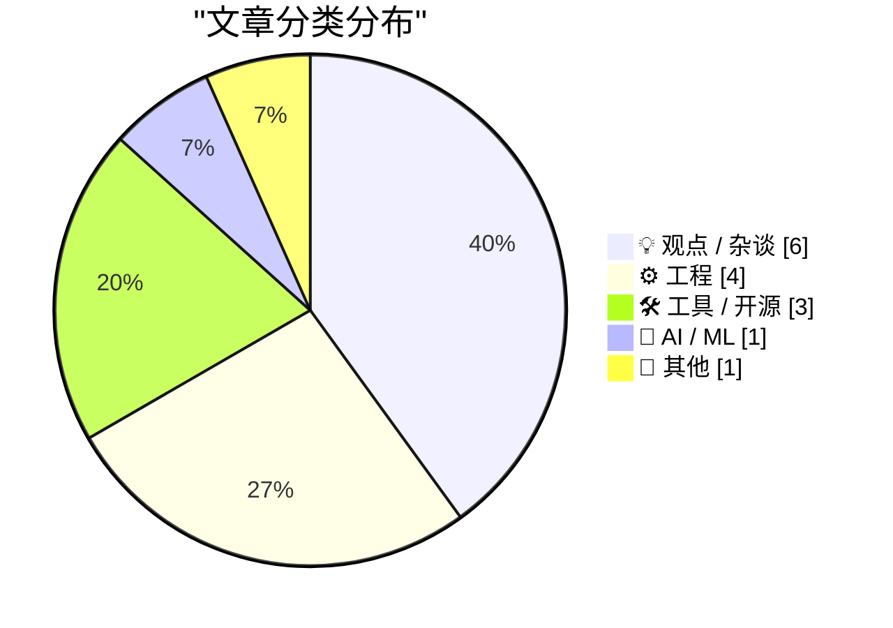
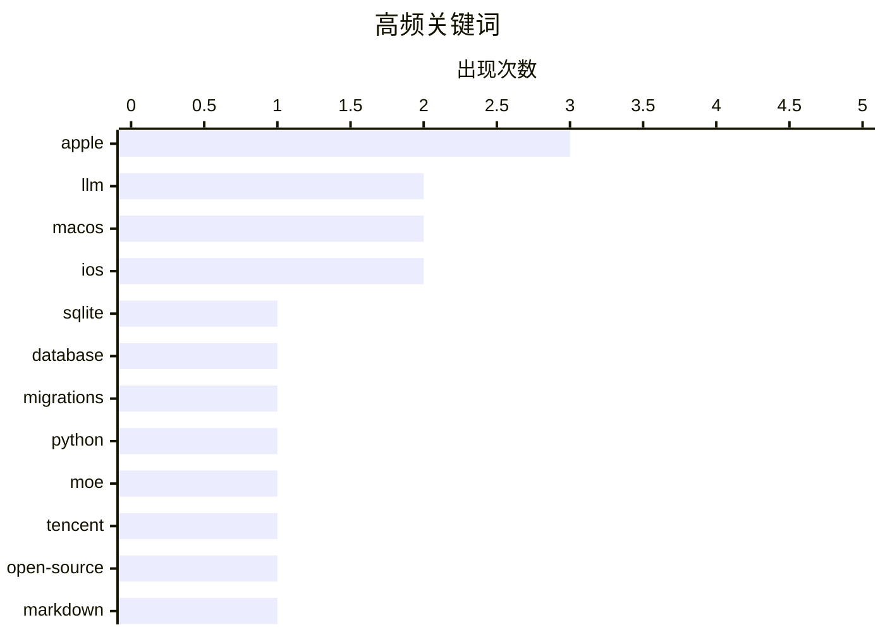

# 📰 Jul 8, 2026

> 来自 Karpathy 推荐的 92 个顶级技术博客，AI 精选 Top 15

## 📝 今日看点

今日技术圈呈现出大模型竞赛与行业反思并行的态势，腾讯发布295B参数开源模型的同时，市场对AI泡沫及软银式愿景的质疑声不断。苹果OS 27在标准化Markdown与增强Siri交互上持续发力，但其固化的设计规范正引发开发者对创意自由的讨论。此外，sqlite-utils 4.0等基础工具的重大迭代与全球反垄断监管的加强，共同构成了技术演进与合规治理的新常态。

---

## 🏆 今日必读

🥇 **sqlite-utils 4.0 发布：现已支持数据库模式迁移**

[sqlite-utils 4.0, now with database schema migrations](https://simonwillison.net/2026/Jul/7/sqlite-utils-4/#atom-everything) — simonwillison.net · 13 小时前 · 🛠 工具 / 开源

> sqlite-utils 发布了 4.0 重大版本更新，这是该项目自 2020 年 11 月 v3.0 以来首次主版本升级。新版本最核心的特性是引入了数据库模式迁移（schema migrations）机制，允许开发者更系统地管理数据库结构的演进。此外，4.0 版本包含了一些破坏性变更，并同步发布了详细的升级指南。该工具目前已累计发布 124 个版本，进一步巩固了其作为 SQLite 生态中全能型操作工具的地位。

💡 **为什么值得读**: SQLite 用户的必备工具迎来里程碑更新，终于补齐了模式迁移这一生产环境开发的关键短板。

🏷️ SQLite, database, migrations, Python

🥈 **腾讯发布 Hy3：拥有 295B 参数的开源混合专家模型**

[tencent/Hy3](https://simonwillison.net/2026/Jul/6/hy3/#atom-everything) — simonwillison.net · 1 天前 · 🤖 AI / ML

> 腾讯 Hy 团队正式发布了采用 Apache 2.0 协议开源的 Hy3 混合专家（MoE）模型。该模型总参数量达 295B，其中激活参数为 21B，并包含 3.8B 的 MTP 层参数。Hy3 在 4 月份预览版的基础上，结合 50 多个产品的反馈并使用更高质量的数据进行了大规模后训练。评测数据显示，Hy3 的性能表现超越了同等规模的其他主流模型。

💡 **为什么值得读**: 了解国产大模型在 MoE 架构上的最新开源进展，以及 295B 规模下的参数激活效率。

🏷️ LLM, MoE, Tencent, open-source

🥉 **Markdown 在苹果 OS 27 系统中获得统一类型标识符 (UTI)**

[Markdown Now Has a Uniform Type Identifer (UTI) in Apple’s Version 27 OSes](https://developer.apple.com/documentation/uniformtypeidentifiers/uttype-swift.struct/markdown) — daringfireball.net · 1 天前 · ⚙️ 工程

> 苹果在最新的 OS 27 开发者测试版中，为 Markdown 数据引入了官方内置的统一类型标识符（UTI）。该标识符被定义为 `net.daringfireball.markdown`，并明确遵循 `public.utf8-plain-text` 标准。这一变动意味着 Markdown 在苹果生态系统中正式获得了系统级的身份识别。开发者现在可以弃用通用的纯文本标识，转而使用这一更精确的标准来处理文档交换。

💡 **为什么值得读**: Markdown 开发者必看，苹果终于在系统层面标准化了 Markdown 的文件类型定义，有助于提升跨应用协作体验。

🏷️ Markdown, Apple, standards, macOS

---

## 📊 数据概览

| 扫描源 | 抓取文章 | 时间范围 | 精选 |
|:---:|:---:|:---:|:---:|
| 83/92 | 2498 篇 → 30 篇 | 48h | **15 篇** |

### 分类分布



### 高频关键词



<details>
<summary>📈 纯文本关键词图（终端友好）</summary>

```
apple      │ ████████████████████ 3
llm        │ █████████████░░░░░░░ 2
macos      │ █████████████░░░░░░░ 2
ios        │ █████████████░░░░░░░ 2
sqlite     │ ███████░░░░░░░░░░░░░ 1
database   │ ███████░░░░░░░░░░░░░ 1
migrations │ ███████░░░░░░░░░░░░░ 1
python     │ ███████░░░░░░░░░░░░░ 1
moe        │ ███████░░░░░░░░░░░░░ 1
tencent    │ ███████░░░░░░░░░░░░░ 1
```

</details>

### 🏷️ 话题标签

**apple**(3) · **llm**(2) · **macos**(2) · ios(2) · sqlite(1) · database(1) · migrations(1) · python(1) · moe(1) · tencent(1) · open-source(1) · markdown(1) · standards(1) · ai bubble(1) · tech industry(1) · critique(1) · antitrust(1) · big tech(1) · regulation(1) · monopoly(1)

---

## 💡 观点 / 杂谈

### 1. 让 AI 泡沫破裂吧

[Let AI Burn](https://www.wheresyoured.at/let-ai-burn/) — **wheresyoured.at** · 15 小时前 · ⭐ 25/30

> 文章对当前人工智能行业的狂热现状提出了深度质疑，呼吁让不可持续的 AI 投资泡沫自行破裂。作者通过对 NVIDIA、Anthropic 等行业巨头的详细分析，揭示了高昂运营成本与实际产出价值之间的巨大鸿沟。文中指出，当前的 AI 发展模式过于依赖资本输血而非真实的商业逻辑。这种批判性视角旨在提醒从业者重新审视 AI 技术的真实落地前景与潜在财务风险。

🏷️ AI bubble, tech industry, critique

---

### 2. Pluralistic：美国各州与国际反垄断者如何击败科技巨头

[Pluralistic: How US states and international trustbusters can beat Big Tech (07 Jul 2026)](https://pluralistic.net/2026/07/07/going-global/) — **pluralistic.net** · 20 小时前 · ⭐ 24/30

> 本文探讨了美国各州政府与国际监管机构联手对抗大型科技公司垄断行为的策略。作者分析认为，跨区域的法律协作是制约科技巨头滥用市场地位的有效手段。文章还涉及了版权保护、隐私监管以及自我出版等多个领域的社会观察。通过对具体案例的剖析，展示了监管力量如何通过法律手段重塑数字市场的竞争格局。

🏷️ antitrust, Big Tech, regulation, monopoly

---

### 3. 写博客去探索你还不理解的事物

[Blog about things you don't understand yet](https://seangoedecke.com/blog-about-things-you-dont-understand-yet/) — **seangoedecke.com** · 1 天前 · ⭐ 23/30

> 作者提倡将撰写博客作为一种学习工具，去探索和梳理那些自己尚未完全掌握的技术领域。文章认为，每篇博文都应包含作者在写作过程中新习得的知识，这种“以写促学”的方式能有效提升思维深度。以 o3 geoguessr 提示词的研究为例，作者展示了如何从一个简单的假设出发，最终挖掘出深层的技术细节。这种方法不仅能产出高质量内容，更能加速个人的技术成长。

🏷️ learning, writing, career

---

### 4. 苹果应该打破应用图标的“超椭圆监狱”

[★ Apple Should Eliminate the App Icon ‘Squircle Jail’](https://daringfireball.net/2026/07/eliminate_app_icon_squircle_jail) — **daringfireball.net** · 1 天前 · ⭐ 22/30

> 文章尖锐地批评了苹果强制所有应用图标必须遵循“超椭圆”（Squircle）形状的限制，称其抹杀了设计的多样性。作者指出，形状曾是图标最具辨识度的特征，而现在的统一化设计让品牌个性变得模糊。文中呼吁苹果放开这一视觉枷锁，允许开发者在图标外形上拥有更多创意空间。这种设计上的反思挑战了苹果长期以来坚持的视觉一致性原则。

🏷️ iOS, design, UI, Apple

---

### 5. 软银黑粉指南：透视孙正义的愿景泡沫

[Premium: The Hater's Guide To SoftBank](https://www.wheresyoured.at/premium-the-haters-guide-to-softbank/) — **wheresyoured.at** · 1 天前 · ⭐ 22/30

> 本文对软银第 46 届年度股东大会及孙正义的演讲内容进行了辛辣讽刺。作者重点分析了会上展示的逻辑跳跃的演示幻灯片，质疑其所谓“进化”愿景的真实性。文章回顾了软银在 WeWork 等项目上的失败历史，剖析了其在当前 AI 浪潮中激进策略背后的巨大风险。这是一份针对软银财务现状与未来战略的深度批判性报告。

🏷️ SoftBank, venture capital, Masayoshi Son

---

### 6. 我真的对 AI 感到厌烦了

[I'm just so bored of AI](https://shkspr.mobi/blog/2026/07/im-just-so-bored-of-ai/) — **shkspr.mobi** · 1 天前 · ⭐ 20/30

> 作者表达了对当前泛滥且同质化的 AI 讨论的极度审美疲劳，将其比作听人反复吹嘘电子烟的口味。文章批评了目前将所有事物都强行与 AI 挂钩的趋势，认为这种“自动化一切”的狂热正在消解真正的创造力。这种无休止的、浅薄的 LLM 讨论已经变成了社交噪音，掩盖了技术本身应有的价值。作者呼吁回归到更有意义的人类对话和实际问题的解决上，而不是沉溺于计算机生成的平庸内容。这反映了技术圈内对于 AI 泡沫化和信息过载的一种清醒反思。

🏷️ AI hype, AI fatigue, industry trends

---

## ⚙️ 工程

### 7. Markdown 在苹果 OS 27 系统中获得统一类型标识符 (UTI)

[Markdown Now Has a Uniform Type Identifer (UTI) in Apple’s Version 27 OSes](https://developer.apple.com/documentation/uniformtypeidentifiers/uttype-swift.struct/markdown) — **daringfireball.net** · 1 天前 · ⭐ 25/30

> 苹果在最新的 OS 27 开发者测试版中，为 Markdown 数据引入了官方内置的统一类型标识符（UTI）。该标识符被定义为 `net.daringfireball.markdown`，并明确遵循 `public.utf8-plain-text` 标准。这一变动意味着 Markdown 在苹果生态系统中正式获得了系统级的身份识别。开发者现在可以弃用通用的纯文本标识，转而使用这一更精确的标准来处理文档交换。

🏷️ Markdown, Apple, standards, macOS

---

### 8. 关于 FILE_FLAG_DELETE_ON_CLOSE 标志的误区与对策

[I opened a file with FILE_FLAG_DELETE_ON_CLOSE, but now I changed my mind](https://devblogs.microsoft.com/oldnewthing/20260706-00/?p=112506) — **devblogs.microsoft.com/oldnewthing** · 1 天前 · ⭐ 21/30

> 在 Windows 开发中，使用 `FILE_FLAG_DELETE_ON_CLOSE` 标志打开文件意味着句柄关闭时文件将被自动删除。文章明确指出，一旦以此标志打开文件，开发者无法在中途撤销删除决定。作者详细解释了这一 Win32 API 的底层行为逻辑，并提供了一种替代方案来实现更灵活的文件生命周期管理。这对于需要处理临时文件或底层文件操作的开发者具有重要的避坑参考价值。

🏷️ Win32 API, file system, C++, Windows

---

### 9. 包管理器中的内容寻址

[Content addressing in package managers](https://nesbitt.io/2026/07/07/content-addressing-in-package-managers.html) — **nesbitt.io** · 22 小时前 · ⭐ 21/30

> 现代包管理器面临着名称冲突、版本漂移和供应链攻击等固有风险。内容寻址（Content Addressing）通过将包的哈希值作为其唯一标识符，从根本上解决了这些问题，确保了代码的不可变性。Nix、Unison 和 IPFS 等系统已经证明了这种模式在实现 100% 可复现构建方面的巨大优势。相比传统的语义化版本（SemVer），内容寻址让依赖关系变得透明且可验证，消除了“在我机器上能跑”的玄学问题。这种从“名称寻址”向“内容寻址”的转变，是构建更安全、更可靠的软件分发系统的关键演进。

🏷️ package manager, content addressing, hashing

---

### 10. Windows 95 是如何判断安装程序正在运行的？

[How did Windows 95 decide that a setup program ran?](https://devblogs.microsoft.com/oldnewthing/20260707-00/?p=112508) — **devblogs.microsoft.com/oldnewthing** · 18 小时前 · ⭐ 20/30

> Windows 95 为了实现“添加/删除程序”等系统管理功能，必须能够准确识别用户何时运行了安装软件。系统采用了一套复杂的启发式算法（Heuristics），通过检测文件名（如 setup.exe 或 install.exe）、窗口标题以及特定的 API 调用序列来做出判断。这种机制在当时缺乏统一安装标准的环境下，是确保系统兼容性和注册表清理的关键。Raymond Chen 揭示了这些看似简单的判断背后隐藏的工程考量和历史背景。这展示了操作系统如何在底层通过“猜测”来弥补应用程序行为的不规范，是典型的向后兼容性设计。

🏷️ Windows 95, heuristics, operating systems, legacy code

---

## 🛠 工具 / 开源

### 11. sqlite-utils 4.0 发布：现已支持数据库模式迁移

[sqlite-utils 4.0, now with database schema migrations](https://simonwillison.net/2026/Jul/7/sqlite-utils-4/#atom-everything) — **simonwillison.net** · 13 小时前 · ⭐ 27/30

> sqlite-utils 发布了 4.0 重大版本更新，这是该项目自 2020 年 11 月 v3.0 以来首次主版本升级。新版本最核心的特性是引入了数据库模式迁移（schema migrations）机制，允许开发者更系统地管理数据库结构的演进。此外，4.0 版本包含了一些破坏性变更，并同步发布了详细的升级指南。该工具目前已累计发布 124 个版本，进一步巩固了其作为 SQLite 生态中全能型操作工具的地位。

🏷️ SQLite, database, migrations, Python

---

### 12. github-code Web 组件：直接嵌入 GitHub 代码片段

[github-code Web Component](https://simonwillison.net/2026/Jul/7/github-code-component/#atom-everything) — **simonwillison.net** · 16 小时前 · ⭐ 20/30

> 这是一个利用 GPT-5.5 实验性构建的 Web 组件，旨在简化从 GitHub 仓库直接嵌入代码的过程。开发者只需使用 <github-code> 标签并传入 GitHub 文件 URL，即可在网页中展示特定行号的代码片段。该组件利用了 GitHub 的原始文件 API，并集成了语法高亮功能，无需复杂的后端配置或第三方插件。这种基于 AI 提示词生成的组件开发模式，展示了 Web Components 在微前端和文档工具中的高效应用潜力。它为技术博客和文档站提供了一种极其轻量且标准化的代码引用方案。

🏷️ Web Components, LLM, frontend

---

### 13. Backblaze 与 Dropbox 的博弈：云备份的失效危机

[Backblaze Versus Dropbox](https://mjtsai.com/blog/2025/12/19/backblaze-no-longer-backs-up-dropbox/) — **daringfireball.net** · 1 天前 · ⭐ 19/30

> Backblaze 近期停止了对 Dropbox、iCloud Drive 和 OneDrive 等云存储服务同步文件夹的备份，引发了用户的广泛担忧。这一变化源于苹果 FileProvider API 的调整，导致同步文件被移动到 Backblaze 默认排除的隐藏路径中。许多用户曾将 Backblaze 视为云同步之外的“二次保险”，但现在的技术限制打破了这一安全链条。文章深入探讨了本地备份软件与云同步服务在文件系统层面的冲突，以及这种变化对个人数据安全策略的影响。这提醒用户，云同步并不等同于真正的离线或异地备份，依赖单一链条存在巨大风险。

🏷️ backup, cloud storage, macOS, file provider

---

## 🤖 AI / ML

### 14. 腾讯发布 Hy3：拥有 295B 参数的开源混合专家模型

[tencent/Hy3](https://simonwillison.net/2026/Jul/6/hy3/#atom-everything) — **simonwillison.net** · 1 天前 · ⭐ 25/30

> 腾讯 Hy 团队正式发布了采用 Apache 2.0 协议开源的 Hy3 混合专家（MoE）模型。该模型总参数量达 295B，其中激活参数为 21B，并包含 3.8B 的 MTP 层参数。Hy3 在 4 月份预览版的基础上，结合 50 多个产品的反馈并使用更高质量的数据进行了大规模后训练。评测数据显示，Hy3 的性能表现超越了同等规模的其他主流模型。

🏷️ LLM, MoE, Tencent, open-source

---

## 📝 其他

### 15. iOS 27 Beta 3 为 Siri 新语音启用“语速”与“表现力”调节滑块

[OS 27 Developer Beta 3 Enables New ‘Pace’ and ‘Expressivity’ Sliders for Siri’s New Voices](https://techcrunch.com/2026/07/06/you-can-now-customize-siris-pace-and-expressivity-in-the-latest-ios-27-beta/) — **daringfireball.net** · 17 小时前 · ⭐ 23/30

> 苹果在 iOS 27 开发者测试版 Beta 3 中，正式启用了 Siri 语音的自定义控制功能。用户现在可以通过新增的“语速”（Pace）和“表现力”（Expressivity）滑块，手动调节 AI 助手的说话风格。这些功能在之前的测试版中仅为占位符，此次更新标志着苹果在提升 Siri 交互自然度方面迈出了实质性一步。这为用户提供了更精细的个性化语音合成体验。

🏷️ iOS, Siri, Apple, UX

---

*生成于 2026-07-08 08:40 | 扫描 83 源 → 获取 2498 篇 → 精选 15 篇*
*基于 [Hacker News Popularity Contest 2025](https://refactoringenglish.com/tools/hn-popularity/) RSS 源列表，由 [Andrej Karpathy](https://x.com/karpathy) 推荐*
