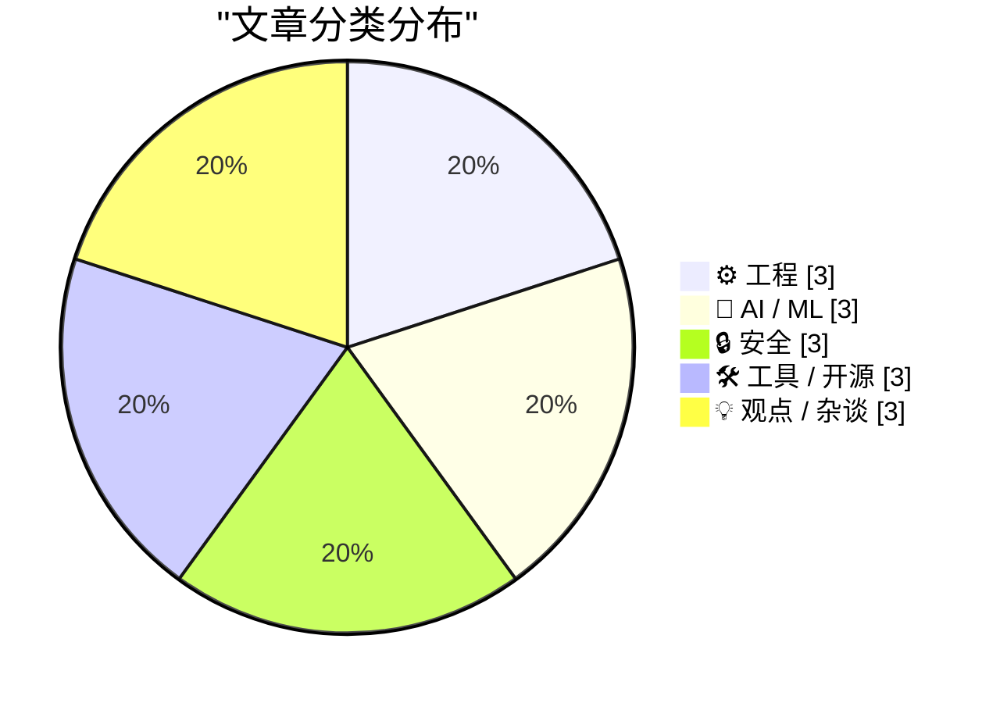
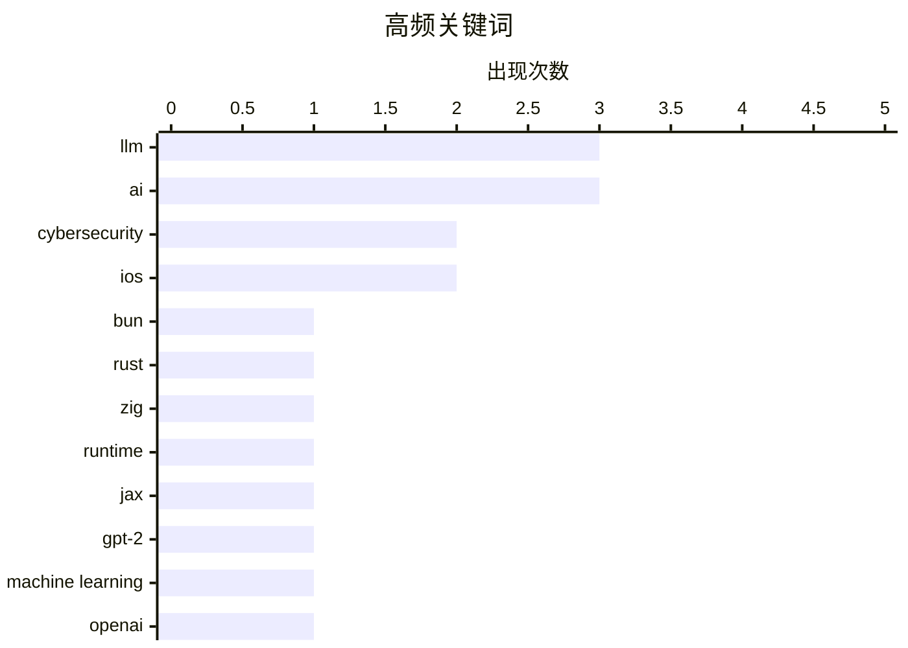

# 📰 Jul 9, 2026

> 来自 Karpathy 推荐的 92 个顶级技术博客，AI 精选 Top 15

## 📝 今日看点

今日技术圈呈现出 AI 极速演进与理性反思并存的局面：OpenAI 发布 GPT-Live 刷新实时交互体验，而资深架构师开始带头抵制 AI 生成的低质量开发文档。工程领域迎来架构级重塑，Bun 借助智能体工程完成 Rust 重写，sqlite-utils 4.0 则补齐了数据库迁移的关键短板。此外，关于 AI 经济泡沫的质疑与网络安全行业的诚信危机，也为当前的技术热潮敲响了警钟。

---

## 🏆 今日必读

🥇 **用 Rust 重写 Bun**

[Rewriting Bun in Rust](https://simonwillison.net/2026/Jul/8/rewriting-bun-in-rust/#atom-everything) — simonwillison.net · 9 小时前 · ⚙️ 工程

> Bun 的创始人 Jarred Sumner 完成了将 Bun 从 Zig 语言向 Rust 语言的大规模迁移。这次重写并非完全手动完成，而是采用了一种极其复杂的“智能体工程（Agentic Engineering）”方法。通过构建动态工作流、试运行和 AI 驱动的自动化代码转换，Sumner 在极短的时间内完成了这一壮举。这不仅是 Bun 架构的重大演进，更展示了 AI 智能体在处理大规模底层系统重构时的巨大潜力。目前该过程的详细技术细节已在博客中公开，涵盖了从内存管理到类型系统转换的实战经验。

💡 **为什么值得读**: 这是目前利用 AI 智能体进行大规模底层系统重构的最前沿案例，值得所有关注 AI 辅助编程和高性能运行时的开发者阅读。

🏷️ Bun, Rust, Zig, runtime

🥈 **从零开始编写 LLM（第 34b 部分）：使用 JAX 逐步构建 GPT-2**

[Writing an LLM from scratch, part 34b -- from bigrams to GPT-2, one component at a time (in JAX)](https://www.gilesthomas.com/2026/07/llm-from-scratch-34b-building-and-training-gpt-2-small-in-jax) — gilesthomas.com · 15 小时前 · 🤖 AI / ML

> 这是作者长期连载系列的收官之作，旨在通过 JAX 框架从头实现一个 GPT-2 Small 模型。文章严格遵循 Sebastian Raschka 的课程，详细演示了从最简单的二元语法（Bigram）模型演进到拥有 1.63 亿参数的 Transformer 架构的全过程。开发者可以跟随教程逐一实现注意力机制、层归一化和前馈网络等核心组件。该项目不仅提供了完整的代码实现，还深入探讨了在 JAX 中进行高效张量运算的技术细节。最终产出的模型能够完成基本的文本生成任务，验证了从零构建生产级架构的可行性。

💡 **为什么值得读**: 如果你想通过动手实践彻底理解 GPT 架构，这个基于 JAX 的保姆级教程是目前最扎实的参考资料之一。

🏷️ LLM, JAX, GPT-2, machine learning

🥉 **GPT-Live 正式发布**

[Introducing GPT‑Live](https://simonwillison.net/2026/Jul/8/introducing-gptlive/#atom-everything) — simonwillison.net · 10 小时前 · 🤖 AI / ML

> OpenAI 终于升级了 ChatGPT 的语音模式模型，并将其命名为 GPT-Live。新模型在 iPhone 应用中表现出极高的响应速度和更自然的交互感，显著降低了对话延迟。最核心的改进在于其后台调度机制：当遇到需要联网搜索、深度推理或复杂计算的任务时，它会自动将任务委派给更强大的 GPT-5.5 模型处理。这种“前端轻量交互+后端强力推理”的混合架构，使得语音助手在保持流畅的同时具备了处理尖端问题的能力。目前该功能已向部分预览用户开放。

💡 **为什么值得读**: 揭示了 OpenAI 语音模式的最新架构演进，以及备受期待的 GPT-5.5 模型是如何在幕后发挥作用的。

🏷️ OpenAI, GPT-Live, Voice Mode, LLM

---

## 📊 数据概览

| 扫描源 | 抓取文章 | 时间范围 | 精选 |
|:---:|:---:|:---:|:---:|
| 84/92 | 2516 篇 → 36 篇 | 48h | **15 篇** |

### 分类分布



### 高频关键词



<details>
<summary>📈 纯文本关键词图（终端友好）</summary>

```
llm           │ ████████████████████ 3
ai            │ ████████████████████ 3
cybersecurity │ █████████████░░░░░░░ 2
ios           │ █████████████░░░░░░░ 2
bun           │ ███████░░░░░░░░░░░░░ 1
rust          │ ███████░░░░░░░░░░░░░ 1
zig           │ ███████░░░░░░░░░░░░░ 1
runtime       │ ███████░░░░░░░░░░░░░ 1
jax           │ ███████░░░░░░░░░░░░░ 1
gpt-2         │ ███████░░░░░░░░░░░░░ 1
```

</details>

### 🏷️ 话题标签

**llm**(3) · **ai**(3) · **cybersecurity**(2) · ios(2) · bun(1) · rust(1) · zig(1) · runtime(1) · jax(1) · gpt-2(1) · machine learning(1) · openai(1) · gpt-live(1) · voice mode(1) · zero-day(1) · startup(1) · investigation(1) · sqlite(1) · database(1) · migrations(1)

---

## ⚙️ 工程

### 1. 用 Rust 重写 Bun

[Rewriting Bun in Rust](https://simonwillison.net/2026/Jul/8/rewriting-bun-in-rust/#atom-everything) — **simonwillison.net** · 9 小时前 · ⭐ 27/30

> Bun 的创始人 Jarred Sumner 完成了将 Bun 从 Zig 语言向 Rust 语言的大规模迁移。这次重写并非完全手动完成，而是采用了一种极其复杂的“智能体工程（Agentic Engineering）”方法。通过构建动态工作流、试运行和 AI 驱动的自动化代码转换，Sumner 在极短的时间内完成了这一壮举。这不仅是 Bun 架构的重大演进，更展示了 AI 智能体在处理大规模底层系统重构时的巨大潜力。目前该过程的详细技术细节已在博客中公开，涵盖了从内存管理到类型系统转换的实战经验。

🏷️ Bun, Rust, Zig, runtime

---

### 2. 包管理器中的内容寻址机制

[Content addressing in package managers](https://nesbitt.io/2026/07/07/content-addressing-in-package-managers.html) — **nesbitt.io** · 1 天前 · ⭐ 22/30

> 本文深入探讨了包管理器中“内容寻址（Content Addressing）”的核心价值，强调“名称供人阅读，哈希供系统识别”。通过对比传统的基于名称或版本的寻址方式，作者阐述了哈希校验如何确保依赖项的不可变性与安全性。内容寻址能够有效避免依赖冲突（Dependency Hell）并显著提升构建的可重复性。作者认为，现代包管理器的演进方向应是全面转向以内容哈希为核心的存储与分发架构。

🏷️ package manager, content addressing, hashing

---

### 3. Agent 即单子（Monad），但不是你想的那种

[Agents are monads (but not that kind)](https://xeiaso.net/blog/2026/hyle-pneuma/) — **xeiaso.net** · 1 天前 · ⭐ 21/30

> 文章尝试从函数式编程的角度重新定义 AI Agent 的行为模式，将其类比为一种特殊的“单子（Monad）”。作者避开了晦涩的范畴论术语，重点讨论了 Agent 在处理状态转换、副作用以及链式调用时的逻辑结构。这种视角有助于开发者理解 Agent 如何在不确定的环境中维持上下文并进行复杂的任务编排。最终指出，将 Agent 视为一种计算抽象而非简单的脚本，是构建健壮 AI 应用的关键。

🏷️ monads, software agents, functional programming

---

## 🤖 AI / ML

### 4. 从零开始编写 LLM（第 34b 部分）：使用 JAX 逐步构建 GPT-2

[Writing an LLM from scratch, part 34b -- from bigrams to GPT-2, one component at a time (in JAX)](https://www.gilesthomas.com/2026/07/llm-from-scratch-34b-building-and-training-gpt-2-small-in-jax) — **gilesthomas.com** · 15 小时前 · ⭐ 27/30

> 这是作者长期连载系列的收官之作，旨在通过 JAX 框架从头实现一个 GPT-2 Small 模型。文章严格遵循 Sebastian Raschka 的课程，详细演示了从最简单的二元语法（Bigram）模型演进到拥有 1.63 亿参数的 Transformer 架构的全过程。开发者可以跟随教程逐一实现注意力机制、层归一化和前馈网络等核心组件。该项目不仅提供了完整的代码实现，还深入探讨了在 JAX 中进行高效张量运算的技术细节。最终产出的模型能够完成基本的文本生成任务，验证了从零构建生产级架构的可行性。

🏷️ LLM, JAX, GPT-2, machine learning

---

### 5. GPT-Live 正式发布

[Introducing GPT‑Live](https://simonwillison.net/2026/Jul/8/introducing-gptlive/#atom-everything) — **simonwillison.net** · 10 小时前 · ⭐ 26/30

> OpenAI 终于升级了 ChatGPT 的语音模式模型，并将其命名为 GPT-Live。新模型在 iPhone 应用中表现出极高的响应速度和更自然的交互感，显著降低了对话延迟。最核心的改进在于其后台调度机制：当遇到需要联网搜索、深度推理或复杂计算的任务时，它会自动将任务委派给更强大的 GPT-5.5 模型处理。这种“前端轻量交互+后端强力推理”的混合架构，使得语音助手在保持流畅的同时具备了处理尖端问题的能力。目前该功能已向部分预览用户开放。

🏷️ OpenAI, GPT-Live, Voice Mode, LLM

---

### 6. iOS 27 测试版为 Siri 启用“语速”与“表现力”调节滑块

[OS 27 Developer Beta 3 Enables New ‘Pace’ and ‘Expressivity’ Sliders for Siri’s New Voices](https://techcrunch.com/2026/07/06/you-can-now-customize-siris-pace-and-expressivity-in-the-latest-ios-27-beta/) — **daringfireball.net** · 1 天前 · ⭐ 22/30

> 在最新的 iOS 27 开发者测试版 Beta 3 中，苹果正式启用了此前预告的 Siri 语音自定义功能。用户现在可以通过新增的“语速（Pace）”和“表现力（Expressivity）”滑块，精细调整 AI 助手的说话节奏和情感起伏。这一更新标志着苹果在 AI 语音合成领域从“预设音色”向“个性化交互”的转变。通过赋予用户对语音细节的控制权，Siri 的交互体验将变得更加自然且符合个人偏好。

🏷️ iOS, Siri, AI, Beta

---

## 🔒 安全

### 7. 重罪犯与骗子经营的攻击性网络安全初创公司

[Felons, Fraudsters Flog Offensive Cybersecurity Startup](https://krebsonsecurity.com/2026/07/felons-fraudsters-flog-offensive-cybersecurity-startup/) — **krebsonsecurity.com** · 21 小时前 · ⭐ 26/30

> 一家声称斥资数百万美元收购主流软件 0-day 漏洞的初创公司被曝存在严重背景问题。调查显示，该公司的运营者是两名极右翼阴谋论者及重罪犯，他们曾多次经营虚假情报公司。两人此前还运营过一个现已倒闭的 AI 游说平台，并使用假名来掩盖其犯罪前科。该公司在网络安全社区中大肆宣传，试图吸引安全研究人员出售高价值漏洞。这一事件引发了业界对 0-day 交易市场缺乏监管以及中间商信用风险的深度担忧。

🏷️ cybersecurity, zero-day, startup, investigation

---

### 8. Troy Hunt 每周更新 511：来自马拉喀什的现场报道

[Weekly Update 511: Live from my Riad in Marrakech](https://www.troyhunt.com/weekly-update-511/) — **troyhunt.com** · 19 小时前 · ⭐ 24/30

> 安全专家 Troy Hunt 在本周更新中讨论了近期发生的多起重大数据泄露事件。他提出了一个生动的比喻：试图从互联网上删除已泄露的数据，就像试图“从游泳池里捞出尿液”一样徒劳。文章强调，一旦敏感信息进入公共领域或黑客论坛，任何补救措施都无法完全消除风险。此外，他还分享了自己在摩洛哥旅行期间对全球网络安全态势的观察。本期更新再次提醒企业和个人，预防泄露的价值远高于事后清理。

🏷️ data breach, cybersecurity, privacy, HIBP

---

### 9. 另一种控制流守卫检查：验证与调用的合并

[The other kind of control flow guard check: The combined validate and call](https://devblogs.microsoft.com/oldnewthing/20260708-00/?p=112510) — **devblogs.microsoft.com/oldnewthing** · 19 小时前 · ⭐ 23/30

> 本文深入探讨了 Windows 控制流守卫（Control Flow Guard, CFG）的一项性能优化技术。传统的 CFG 在进行间接调用前需要执行独立的验证检查，这会带来一定的性能开销。微软引入了“验证与调用合并（Combined Validate and Call）”机制，通过 `__guard_check_icall_setup` 等指令将安全检查与跳转操作整合。文章详细解析了编译器如何生成此类代码，以及底层汇编指令如何实现高效的安全防御。这种方法在不牺牲安全性的前提下，显著提升了系统底层防御的执行效率。

🏷️ Windows, CFG, low-level, security

---

## 🛠 工具 / 开源

### 10. sqlite-utils 4.0 发布：现已支持数据库模式迁移

[sqlite-utils 4.0, now with database schema migrations](https://simonwillison.net/2026/Jul/7/sqlite-utils-4/#atom-everything) — **simonwillison.net** · 1 天前 · ⭐ 25/30

> sqlite-utils 4.0 是该项目自 2020 年 3.0 版本以来的首个重大版本更新。本次更新最核心的特性是引入了正式的数据库模式（Schema）迁移系统，解决了 SQLite 长期以来难以处理结构变更的痛点。除了新功能，4.0 版本还包含了一些必要的破坏性变更，旨在优化 API 的一致性和长期可维护性。作者同步发布了详细的升级指南，帮助用户从旧版本平滑过渡。该工具进一步巩固了其作为 SQLite 数据处理和管理首选 CLI 工具的地位。

🏷️ SQLite, database, migrations, Python

---

### 11. Poppy 训练箱（一）：起步篇

[poppy the training box, part 1: the beginnings](https://www.gilesthomas.com/2026/07/poppy-the-training-box-1-the-beginnings) — **gilesthomas.com** · 8 小时前 · ⭐ 23/30

> 作者分享了构建专用本地 LLM 训练机器“Poppy”的初衷与过程。此前作者一直使用配备 RTX 3090 的主力 PC 进行训练，但发现长达数天的训练任务严重影响了日常办公和系统响应。为了解决这一矛盾，作者决定组装一台独立的深度学习工作站，专门用于运行 JAX 等框架的训练任务。本篇作为系列的第一部分，重点讨论了硬件选型的考量，特别是显存容量与散热对训练稳定性的影响。这为希望在本地进行模型微调或实验的开发者提供了实用的参考方案。

🏷️ GPU, LLM training, hardware

---

### 12. github-code Web 组件：直接嵌入 GitHub 代码片段

[github-code Web Component](https://simonwillison.net/2026/Jul/7/github-code-component/#atom-everything) — **simonwillison.net** · 1 天前 · ⭐ 22/30

> 该工具是一个用于在网页中直接嵌入 GitHub 代码的实验性 Web 组件，由作者利用 GPT-5.5 辅助开发完成。用户只需在 HTML 中使用 <github-code> 标签并传入 GitHub 文件的 URL，即可实现代码的自动抓取与展示。该组件支持通过 URL 参数指定特定的分支、提交哈希以及行号范围，并利用 Shadow DOM 确保样式隔离。这种方案解决了手动复制粘贴代码导致的版本同步滞后问题，展示了 AI 驱动下 Web 组件开发的极高效率。

🏷️ Web Components, GPT, frontend, AI-generated

---

## 💡 观点 / 杂谈

### 13. 让 AI 燃烧吧

[Let AI Burn](https://www.wheresyoured.at/let-ai-burn/) — **wheresyoured.at** · 1 天前 · ⭐ 25/30

> 这篇文章对当前 AI 行业的经济可持续性提出了尖锐批评，重点分析了 NVIDIA 和 Anthropic 等巨头的财务逻辑。作者认为，当前的 AI 热潮建立在不可持续的资本支出之上，投入的巨额资金与实际产出的商业价值严重脱节。文章详细剖析了训练超大规模模型所带来的环境成本和财务风险，并将其比作一场即将破裂的泡沫。作者呼吁市场回归理性，停止盲目追求参数规模，转而关注真正的效率和实用性。其核心观点是，目前的 AI 发展模式更像是一种资源消耗竞赛而非技术革命。

🏷️ AI, tech industry, economic bubble, NVIDIA

---

### 14. 引用 Kenton Varda：禁止 AI 生成代码变更说明

[Quoting Kenton Varda](https://simonwillison.net/2026/Jul/8/kenton-varda/#atom-everything) — **simonwillison.net** · 13 小时前 · ⭐ 23/30

> Cloudflare Workers 的架构师 Kenton Varda 宣布在其团队中禁止使用 AI 编写 PR（拉取请求）和 Commit 消息。他指出，AI 生成的描述往往“比没用更糟糕”，因为它们只会机械地描述代码表面的变化，而这些变化通过阅读代码本身就能轻易发现。AI 描述缺失了最关键的“高层框架感”，即解释代码为什么要这样改以及背后的设计意图。Varda 认为，这种自动化的文档降低了代码审查的质量，阻碍了团队成员之间的有效沟通。这一观点引发了关于 AI 是否在降低工程文档质量的广泛讨论。

🏷️ AI, code review, engineering culture, LLM

---

### 15. 适用于 iOS 的设计准则往往并不适用于 macOS

[★ What’s Good for the iOS Goose Is Often Not Good for the MacOS Gander](https://daringfireball.net/2026/07/whats_good_for_the_ios_goose_is_often_not_good_for_the_macos_gander) — **daringfireball.net** · 8 小时前 · ⭐ 22/30

> 文章探讨了 macOS 与 iOS 在应用图标设计哲学上的本质差异。作者指出，macOS 图标不仅是启动按钮，更是可拖拽、可承载文件投放的交互对象，具备更复杂的交互逻辑。相比 iOS 追求的扁平化与统一性，macOS 需要更丰富的视觉语言来体现其作为“桌面对象”的属性。结论认为，强行将移动端的设计规范套用到桌面端会削弱操作系统的功能直观性，开发者应尊重不同平台的交互直觉。

🏷️ UI/UX, macOS, iOS, design philosophy

---

*生成于 2026-07-09 09:52 | 扫描 84 源 → 获取 2516 篇 → 精选 15 篇*
*基于 [Hacker News Popularity Contest 2025](https://refactoringenglish.com/tools/hn-popularity/) RSS 源列表，由 [Andrej Karpathy](https://x.com/karpathy) 推荐*
