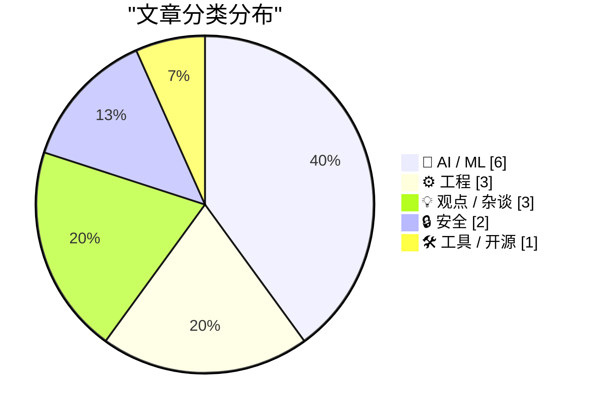
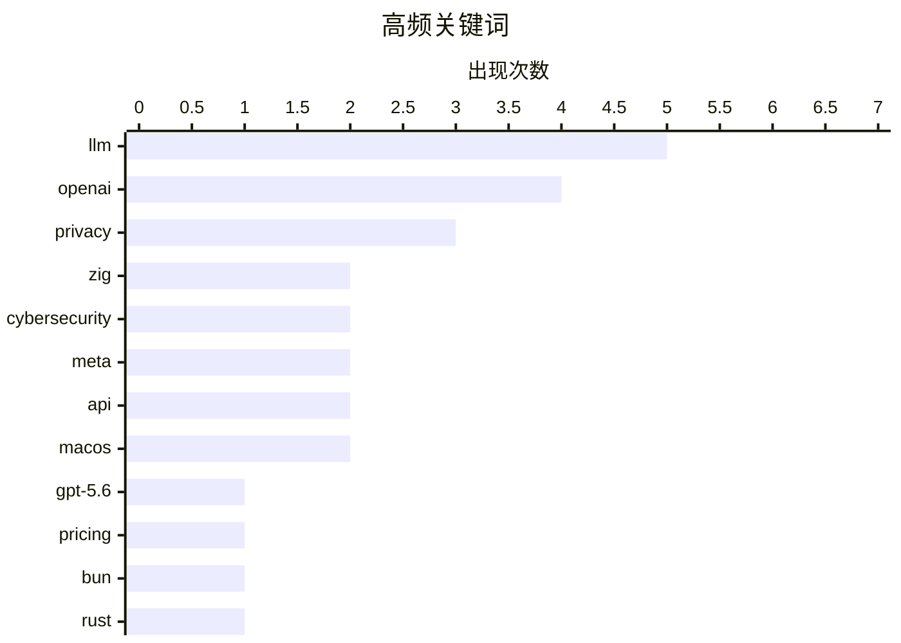

# 📰 Jul 10, 2026

> 来自 Karpathy 推荐的 92 个顶级技术博客，AI 精选 Top 15

## 📝 今日看点

AI 领域迎来爆发式更新，OpenAI 发布 GPT-5.6 系列及 GPT-Live 语音模式，Meta 则通过 Muse 系列加速智能体与 API 的商业化布局。工程界正经历范式转移，Bun 尝试利用 AI 智能体完成 Rust 重写，标志着自动化开发进入新阶段。与此同时，Meta 的数据重用政策与苹果的广告扩张引发了广泛的隐私伦理争议，提醒开发者在技术狂飙中审视安全与合规边界。

---

## 🏆 今日必读

🥇 **全新 GPT-5.6 系列发布：Luna、Terra 与 Sol**

[The new GPT-5.6 family: Luna, Terra, Sol](https://simonwillison.net/2026/Jul/9/gpt-5-6/#atom-everything) — simonwillison.net · 14 小时前 · 🤖 AI / ML

> OpenAI 正式发布 GPT-5.6 旗舰系列模型，包含 Luna（小）、Terra（中）和 Sol（大）三种尺寸。Luna 定价为每百万输入/输出令牌 1/6 美元，Terra 为 2.5/15 美元，而最强大的 Sol 则为 5/30 美元。与竞品相比，Sol 的价格略高于 Claude Opus（5/25 美元），但低于 Claude Fable 5（10/50 美元）。由于推理模型在处理复杂任务时消耗的推理令牌数量差异巨大，单纯的每百万令牌价格已不足以衡量实际成本。该系列模型已向公众全面开放使用。

💡 **为什么值得读**: 了解 OpenAI 最新旗舰模型的定价策略及其与 Anthropic 竞品的市场定位对比。

🏷️ GPT-5.6, OpenAI, LLM, pricing

🥈 **使用 Rust 重写 Bun 运行时**

[Rewriting Bun in Rust](https://simonwillison.net/2026/Jul/8/rewriting-bun-in-rust/#atom-everything) — simonwillison.net · 1 天前 · ⚙️ 工程

> Bun 创始人 Jarred Sumner 详细介绍了将 Bun 从 Zig 语言重写为 Rust 的过程。这次重写并非纯人工完成，而是采用了一种极其复杂的“智能体工程（agentic engineering）”方案。该方案包含动态工作流、自动试运行和自我纠错机制，展示了 AI 在大规模底层系统重构中的潜力。尽管重写过程极具挑战，但最终实现的工程质量和开发效率得到了显著提升。这篇文章是关于 AI 辅助大规模工程实践的深度技术总结。

💡 **为什么值得读**: 深度解析 AI 智能体如何辅助完成从 Zig 到 Rust 的复杂底层系统重构，是 AI 辅助编程的巅峰案例。

🏷️ Bun, Rust, Zig, JavaScript runtime

🥉 **重罪犯与诈骗者经营的攻击性网络安全初创公司**

[Felons, Fraudsters Flog Offensive Cybersecurity Startup](https://krebsonsecurity.com/2026/07/felons-fraudsters-flog-offensive-cybersecurity-startup/) — krebsonsecurity.com · 1 天前 · 🔒 安全

> 一家声称斥资数百万美元收购热门软件零日漏洞（Zero-day）的网络安全初创公司，被曝其背后的运营者是两名极右翼阴谋论者及定罪重犯。调查显示，这两名创始人曾以假名经营虚假情报公司和现已倒闭的 AI 游说平台。该公司通过高额赏金吸引安全研究人员，但其复杂的犯罪背景和不透明的运营历史引发了严重的行业信任危机。这种背景使得该公司收购漏洞的真实意图和资金来源备受质疑。

💡 **为什么值得读**: 揭露网络安全地下市场中高额漏洞收购背后的欺诈风险与道德陷阱。

🏷️ cybersecurity, zero-day, startup, fraud

---

## 📊 数据概览

| 扫描源 | 抓取文章 | 时间范围 | 精选 |
|:---:|:---:|:---:|:---:|
| 83/92 | 2498 篇 → 38 篇 | 48h | **15 篇** |

### 分类分布



### 高频关键词



<details>
<summary>📈 纯文本关键词图（终端友好）</summary>

```
llm           │ ████████████████████ 5
openai        │ ████████████████░░░░ 4
privacy       │ ████████████░░░░░░░░ 3
zig           │ ████████░░░░░░░░░░░░ 2
cybersecurity │ ████████░░░░░░░░░░░░ 2
meta          │ ████████░░░░░░░░░░░░ 2
api           │ ████████░░░░░░░░░░░░ 2
macos         │ ████████░░░░░░░░░░░░ 2
gpt-5.6       │ ████░░░░░░░░░░░░░░░░ 1
pricing       │ ████░░░░░░░░░░░░░░░░ 1
```

</details>

### 🏷️ 话题标签

**llm**(5) · **openai**(4) · **privacy**(3) · zig(2) · cybersecurity(2) · meta(2) · api(2) · macos(2) · gpt-5.6(1) · pricing(1) · bun(1) · rust(1) · javascript runtime(1) · zero-day(1) · startup(1) · fraud(1) · instagram(1) · ai training(1) · jax(1) · gpt-2(1)

---

## 🤖 AI / ML

### 1. 全新 GPT-5.6 系列发布：Luna、Terra 与 Sol

[The new GPT-5.6 family: Luna, Terra, Sol](https://simonwillison.net/2026/Jul/9/gpt-5-6/#atom-everything) — **simonwillison.net** · 14 小时前 · ⭐ 26/30

> OpenAI 正式发布 GPT-5.6 旗舰系列模型，包含 Luna（小）、Terra（中）和 Sol（大）三种尺寸。Luna 定价为每百万输入/输出令牌 1/6 美元，Terra 为 2.5/15 美元，而最强大的 Sol 则为 5/30 美元。与竞品相比，Sol 的价格略高于 Claude Opus（5/25 美元），但低于 Claude Fable 5（10/50 美元）。由于推理模型在处理复杂任务时消耗的推理令牌数量差异巨大，单纯的每百万令牌价格已不足以衡量实际成本。该系列模型已向公众全面开放使用。

🏷️ GPT-5.6, OpenAI, LLM, pricing

---

### 2. Meta 将 Instagram 账户默认设置为允许 AI 重用内容

[Meta Sets Default for Instagram Accounts to Permit Content Reuse by AI](https://www.nytimes.com/2026/07/08/technology/meta-instagram-ai.html?unlocked_article_code=1.wVA.Q5Do.Uvg5yPwCEB5H) — **daringfireball.net** · 19 小时前 · ⭐ 26/30

> Meta 推出的全新 AI 图像生成器 Muse Image 允许用户基于 Instagram 公开账户的照片生成图像。所有拥有公开账户的成年用户均被系统默认设置为“允许使用”，无需额外授权即可成为 AI 训练和生成的素材。用户可以通过 Meta AI 独立聊天应用访问此功能，将社交媒体上的真实照片转化为 AI 生成内容。这一举措引发了关于隐私边界和社交媒体内容所有权的广泛争议。目前该功能已在 Meta AI 应用中上线。

🏷️ Meta, Instagram, AI Training, Privacy

---

### 3. 从零开始编写 LLM 第 34b 部分：从二元语法到 GPT-2 (JAX 实现)

[Writing an LLM from scratch, part 34b -- from bigrams to GPT-2, one component at a time (in JAX)](https://www.gilesthomas.com/2026/07/llm-from-scratch-34b-building-and-training-gpt-2-small-in-jax) — **gilesthomas.com** · 1 天前 · ⭐ 26/30

> 这是“从零开始编写大模型”系列的收官之作，详细记录了使用 JAX 框架构建并训练 GPT-2 Small 模型（约 1.63 亿参数）的全过程。作者遵循 Sebastian Raschka 的教材，从最基础的二元语法（Bigram）模型逐步演进到完整的 Transformer 架构。文章深入探讨了 JAX 在模型训练中的具体实现，包括各组件的编码细节和性能优化。通过这一过程，读者可以清晰地理解现代大语言模型从数据处理到权重加载的每一个技术环节。

🏷️ LLM, JAX, GPT-2, machine learning

---

### 4. Muse Spark 1.1 发布：支持 API 与增强型智能体能力

[Introducing Muse Spark 1.1](https://simonwillison.net/2026/Jul/9/muse-spark-1-1/#atom-everything) — **simonwillison.net** · 17 小时前 · ⭐ 25/30

> Meta 发布了 Muse Spark 1.1 版本，这是该系列中首个提供 API 接入的模型。新版本在智能体工具调用（Tool Calling）和计算机操作（Computer Use）能力上实现了显著提升。官方同步发布了详细的评估报告，展示了其在处理复杂自动化任务时的性能改进。该模型旨在为开发者提供更强大的底层支持，以构建具备自主操作能力的 AI 应用。相比 4 月份发布的版本，1.1 版在逻辑推理和指令遵循方面表现更佳。

🏷️ Meta, Muse Spark, API, LLM

---

### 5. OpenAI 发布 GPT-Live：升级版 ChatGPT 语音模式

[Introducing GPT‑Live](https://simonwillison.net/2026/Jul/8/introducing-gptlive/#atom-everything) — **simonwillison.net** · 1 天前 · ⭐ 25/30

> OpenAI 正式升级了 ChatGPT 的语音模式，推出了全新的 GPT-Live 模型。该模型在响应速度和交互自然度上表现优异，并具备后台调度能力。当遇到需要联网搜索、深度推理或复杂逻辑的任务时，GPT-Live 会自动将请求转发给后台的 GPT-5.5 旗舰模型处理。这种分层架构确保了语音交互的即时性，同时兼顾了处理高难度问题的准确性。目前该功能已在 iPhone 应用中向部分用户开放预览。

🏷️ GPT-Live, OpenAI, voice mode, LLM

---

### 6. Poppy 训练机箱实录（一）：项目起航

[poppy the training box, part 1: the beginnings](https://www.gilesthomas.com/2026/07/poppy-the-training-box-1-the-beginnings) — **gilesthomas.com** · 1 天前 · ⭐ 24/30

> 作者分享了构建名为“Poppy”的专用本地 LLM 训练服务器的初衷与过程。此前作者一直使用配备 RTX 3090 的主力桌面电脑进行训练（如 1.63 亿参数的 GPT-2），但发现训练任务严重影响日常办公。文章详细列出了硬件选型的考量，旨在打造一个能够长时间运行深度学习任务而不干扰日常工作的独立计算环境。这是该系列的第一部分，重点讨论了从通用 PC 转向专用训练机的必要性及初步规划。

🏷️ LLM, hardware, GPU, local training

---

## ⚙️ 工程

### 7. 使用 Rust 重写 Bun 运行时

[Rewriting Bun in Rust](https://simonwillison.net/2026/Jul/8/rewriting-bun-in-rust/#atom-everything) — **simonwillison.net** · 1 天前 · ⭐ 26/30

> Bun 创始人 Jarred Sumner 详细介绍了将 Bun 从 Zig 语言重写为 Rust 的过程。这次重写并非纯人工完成，而是采用了一种极其复杂的“智能体工程（agentic engineering）”方案。该方案包含动态工作流、自动试运行和自我纠错机制，展示了 AI 在大规模底层系统重构中的潜力。尽管重写过程极具挑战，但最终实现的工程质量和开发效率得到了显著提升。这篇文章是关于 AI 辅助大规模工程实践的深度技术总结。

🏷️ Bun, Rust, Zig, JavaScript runtime

---

### 8. 深度解析：Zig 语言包管理器

[Unboxed: Zig](https://nesbitt.io/2026/07/09/unboxed-zig.html) — **nesbitt.io** · 23 小时前 · ⭐ 24/30

> Zig 官方包管理器通过 build.zig.zon 文件和哈希校验机制实现了去中心化的依赖管理。它摒弃了传统的中心化仓库模式，转而采用基于 URL 和内容寻址（Content-addressing）的方案，确保了构建的可重现性。文章深入探讨了其治理模型，强调了社区驱动而非单一实体控制的安全性，并详细分析了针对供应链攻击的威胁模型。这种设计在灵活性与安全性之间取得了平衡，特别是在处理 C/C++ 互操作性时表现出色。

🏷️ Zig, package manager, security, systems programming

---

### 9. 非 App Store 应用如何逃离 macOS 的“圆角监狱”

[Mac Apps Can Escape From Squircle Jail If They’re Not in the Mac App Store](https://tyler.io/2026/07/05/escape-from-squircle-jail/) — **daringfireball.net** · 1 天前 · ⭐ 23/30

> macOS Tahoe 强制要求所有应用图标采用圆角矩形（Squircle），这一限制被开发者戏称为“圆角监狱”。对于非 Mac App Store 分发的应用，开发者可以通过 NSDockTilePlugIn API 绕过这一限制，实现自定义形状的图标。虽然该 API 的原始用途并非修改图标形状，且无法通过 App Store 审核，但它为追求个性化的第三方应用提供了技术后门。Iris 应用在其最新版本中已利用此方案提供了三种非标准形状的图标供用户选择。

🏷️ macOS, App Design, API, Icons

---

## 💡 观点 / 杂谈

### 10. John Ternus 应当扭转苹果在广告业务上的滑坡趋势

[★ John Ternus Should Reverse Apple’s Slide Down the Advertising Slippery Slope](https://daringfireball.net/2026/07/ternus_apple_slippery_slope) — **daringfireball.net** · 14 小时前 · ⭐ 24/30

> 资深苹果观察家 John Gruber 撰文指出，苹果公司正逐渐背离其 2014 年确立的隐私至上原则，滑向依赖广告收入的深渊。文章对比了十年前苹果几乎不展示广告的清白记录与现状，批评当前的广告策略损害了用户体验。作者呼吁苹果高管 John Ternus 应当扭转这一趋势，重新审视广告业务与品牌核心价值之间的冲突。文章认为，如果苹果继续扩大广告版位，其长期以来建立的隐私护城河将面临崩塌风险。

🏷️ Apple, Privacy, Advertising, Strategy

---

### 11. Kenton Varda：禁止在团队中使用 AI 生成 Commit 信息

[Quoting Kenton Varda](https://simonwillison.net/2026/Jul/8/kenton-varda/#atom-everything) — **simonwillison.net** · 1 天前 · ⭐ 23/30

> Cloudflare 工程师 Kenton Varda 宣布在其团队中禁止使用 AI 生成的变更说明（如 PR 和 Commit 消息）。他指出 AI 生成的内容往往只是机械地描述代码改动细节，而这些细节通过阅读代码本身就能轻易获取。AI 最大的缺陷在于忽略了高层级的背景框架和设计意图，导致代码审查者无法理解“为什么要这么改”。这种“低信息熵”的自动化描述反而增加了审查负担，降低了团队协作效率。

🏷️ AI ethics, software engineering, code review

---

### 12. 意料之中：OpenAI 二号人物 Fidji Simo 离职

[Shocking No One, Fidji Simo, Would-Be Usurper, Is Out at OpenAI](https://www.wsj.com/tech/openai-top-executive-fidji-simo-to-step-down-c3daca47?st=NfBZTe) — **daringfireball.net** · 9 小时前 · ⭐ 23/30

> OpenAI 二号人物 Fidji Simo 宣布因健康状况恶化将辞去全职职务，转任公司兼职顾问。此前她曾因病长期休假，此次离职标志着 OpenAI 核心管理层的又一次重大变动。与此同时，OpenAI 正在经历战略重心转移，将资源集中投入到 AI 驱动的编程工具开发中。这一人事变动发生在公司内部权力结构调整和产品路线图剧烈波动的关键时期。

🏷️ OpenAI, Leadership, Fidji Simo

---

## 🔒 安全

### 13. 重罪犯与诈骗者经营的攻击性网络安全初创公司

[Felons, Fraudsters Flog Offensive Cybersecurity Startup](https://krebsonsecurity.com/2026/07/felons-fraudsters-flog-offensive-cybersecurity-startup/) — **krebsonsecurity.com** · 1 天前 · ⭐ 26/30

> 一家声称斥资数百万美元收购热门软件零日漏洞（Zero-day）的网络安全初创公司，被曝其背后的运营者是两名极右翼阴谋论者及定罪重犯。调查显示，这两名创始人曾以假名经营虚假情报公司和现已倒闭的 AI 游说平台。该公司通过高额赏金吸引安全研究人员，但其复杂的犯罪背景和不透明的运营历史引发了严重的行业信任危机。这种背景使得该公司收购漏洞的真实意图和资金来源备受质疑。

🏷️ cybersecurity, zero-day, startup, fraud

---

### 14. Troy Hunt 每周更新 511 期：来自马拉喀什的现场报道

[Weekly Update 511: Live from my Riad in Marrakech](https://www.troyhunt.com/weekly-update-511/) — **troyhunt.com** · 1 天前 · ⭐ 25/30

> 网络安全专家 Troy Hunt 在摩洛哥马拉喀什发布了第 511 期每周更新。本期重点讨论了近期发生的几起重大数据泄露事件，并形象地将清理泄露数据的尝试比作“从泳池中捞出尿液”般徒劳。文章还涉及了数据泄露后的补救措施以及当前网络安全环境下的个人隐私保护现状。此外，作者还分享了在马略卡岛和马拉喀什的旅行见闻，将技术讨论与生活随笔相结合。

🏷️ data breach, cybersecurity, privacy

---

## 🛠 工具 / 开源

### 15. OpenAI 搞砸了 ChatGPT Mac 版应用的品牌重塑

[Today’s the Day OpenAI Fucked Up the ChatGPT Mac App](https://9to5mac.com/2026/07/09/openai-announcing-the-next-chapter-for-chatgpt-today-watch-here/) — **daringfireball.net** · 13 小时前 · ⭐ 23/30

> OpenAI 对其 macOS 桌面应用进行了混乱的品牌重塑，原有的 ChatGPT 应用被更名为 ChatGPT Classic。新的桌面应用实际上由 Codex 演变而来，并拆分为 ChatGPT Work 和 ChatGPT Codex 两种模式。Codex 模式会向用户展示更多技术细节，而 Work 模式则进行了抽象简化，两者共享插件系统。这种命名逻辑和产品拆分引发了用户体验上的困惑，被批评为产品线管理的倒退。

🏷️ ChatGPT, macOS, Product Design, OpenAI

---

*生成于 2026-07-10 09:48 | 扫描 83 源 → 获取 2498 篇 → 精选 15 篇*
*基于 [Hacker News Popularity Contest 2025](https://refactoringenglish.com/tools/hn-popularity/) RSS 源列表，由 [Andrej Karpathy](https://x.com/karpathy) 推荐*
