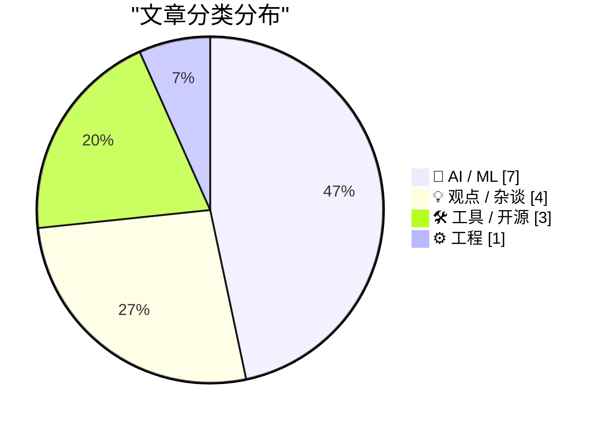
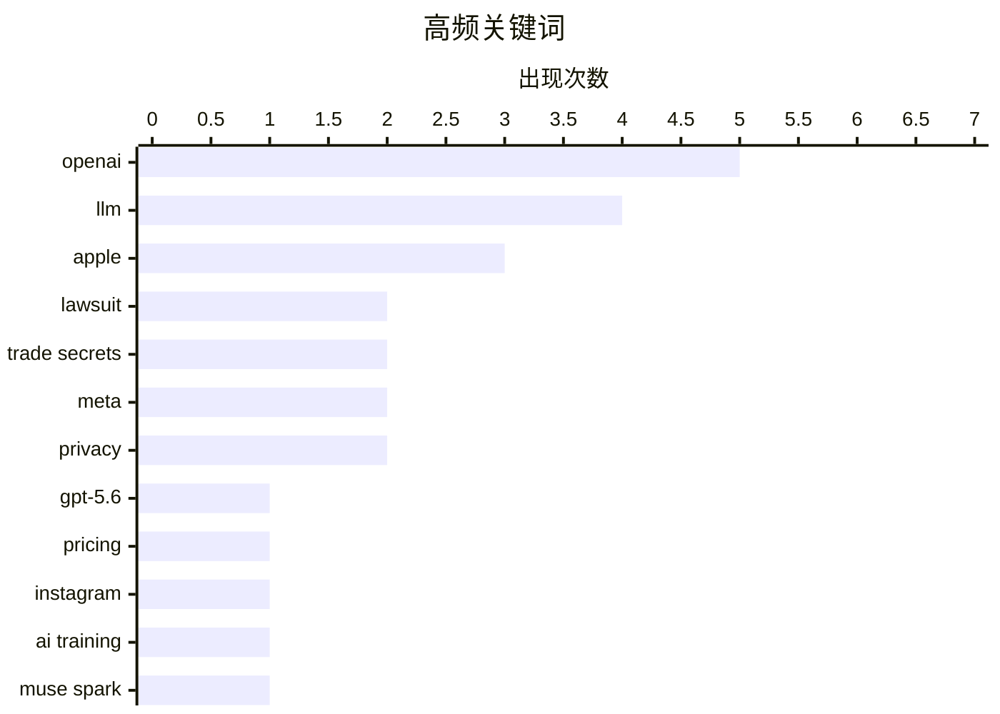

# 📰 Jul 11, 2026

> 来自 Karpathy 推荐的 92 个顶级技术博客，AI 精选 Top 15

## 📝 今日看点

OpenAI 成为今日技术圈的绝对焦点，在发布 GPT-5.6 系列模型的同时，正深陷与苹果的商业机密诉讼及核心高层的人事变动。Meta 默认调用 Instagram 用户数据生成 AI 图像的行为再度引爆隐私伦理争议，折射出大厂在模型迭代压力下日益激进的数据策略。此外，从穿墙探测无线电阵列的硬件突破到对“机器人权利”的深度思辨，展现了技术演进中前沿创新与人文反思的激烈交织。

---

## 🏆 今日必读

🥇 **苹果起诉 OpenAI 及前员工，指控其窃取商业机密**

[Apple Sues OpenAI, io, and Former Employees, Alleging Theft of Trade Secrets](https://9to5mac.com/2026/07/10/apple-sues-openai-trade-secret-theft/) — daringfireball.net · 11 小时前 · 🤖 AI / ML

> 苹果公司正式对 OpenAI、io Products 及两名核心前员工提起诉讼，指控其窃取硬件设计的商业机密。被告包括苹果前产品设计副总裁 Tang Tan（曾领导 iPhone 和 Apple Watch 设计）以及资深系统电气工程师 Chang Liu。Tang Tan 在 2024 年离职后加入 Jony Ive 的公司，而 Chang Liu 则于 2026 年加入 OpenAI。这起诉讼揭示了 OpenAI 在开发自有硬件设备过程中，与苹果在顶尖工程人才和技术专利上的激烈冲突。苹果试图通过法律手段阻止核心硬件技术流向竞争对手的 AI 硬件项目。

💡 **为什么值得读**: 了解苹果与 OpenAI 在 AI 硬件赛道上的正面交锋以及硅谷顶尖人才流动的法律风险。

🏷️ Apple, OpenAI, lawsuit, trade secrets

🥈 **新一代 GPT-5.6 家族发布：Luna、Terra 与 Sol**

[The new GPT-5.6 family: Luna, Terra, Sol](https://simonwillison.net/2026/Jul/9/gpt-5-6/#atom-everything) — simonwillison.net · 1 天前 · 🤖 AI / ML

> OpenAI 正式发布了其最新旗舰模型 GPT-5.6 系列，包含 Luna（小）、Terra（中）、Sol（大）三种尺寸。定价策略方面，Luna 为每百万输入/输出指令 1/6 美元，Terra 为 2.5/15 美元，而最强的 Sol 则为 5/30 美元。相比之下，Claude Opus 的定价为 5/25 美元，GPT-5.6 在高阶推理任务上展现出更强的性价比竞争力。由于不同模型在推理 Token（Reasoning Tokens）的消耗上存在显著差异，实际使用成本将取决于具体任务的复杂度。OpenAI 旨在通过这三款模型覆盖从轻量级应用到极高复杂度推理的全场景需求。

💡 **为什么值得读**: 快速掌握 OpenAI 最新模型的产品矩阵、定价策略及其与 Anthropic 竞品的成本对比。

🏷️ GPT-5.6, OpenAI, LLM, pricing

🥉 **Meta 将 Instagram 账户默认设置为允许 AI 重用内容**

[Meta Sets Default for Instagram Accounts to Permit Content Reuse by AI](https://www.nytimes.com/2026/07/08/technology/meta-instagram-ai.html?unlocked_article_code=1.wVA.Q5Do.Uvg5yPwCEB5H) — daringfireball.net · 1 天前 · 🤖 AI / ML

> Meta 推出的新型 AI 图像生成器 Muse Image 引入了一项争议性功能：允许用户直接基于 Instagram 公开账户的照片生成 AI 图像。所有拥有公开账户的成年用户已被系统自动设置为“加入（Opt-in）”状态，无需额外授权。用户可以通过 Meta AI 应用输入指令，利用他人的真实照片作为素材进行 AI 创作。这一举措引发了关于隐私边界和社交媒体数据所有权的广泛讨论。目前 Meta 尚未提供简单的一键退出机制，引发了创作者对内容被无偿用于训练和生成的担忧。

💡 **为什么值得读**: 关注社交媒体巨头如何利用用户隐私数据喂养 AI，以及这对个人隐私和版权保护带来的冲击。

🏷️ Meta, Instagram, AI training, privacy

---

## 📊 数据概览

| 扫描源 | 抓取文章 | 时间范围 | 精选 |
|:---:|:---:|:---:|:---:|
| 82/92 | 2474 篇 → 34 篇 | 48h | **15 篇** |

### 分类分布



### 高频关键词



<details>
<summary>📈 纯文本关键词图（终端友好）</summary>

```
openai        │ ████████████████████ 5
llm           │ ████████████████░░░░ 4
apple         │ ████████████░░░░░░░░ 3
lawsuit       │ ████████░░░░░░░░░░░░ 2
trade secrets │ ████████░░░░░░░░░░░░ 2
meta          │ ████████░░░░░░░░░░░░ 2
privacy       │ ████████░░░░░░░░░░░░ 2
gpt-5.6       │ ████░░░░░░░░░░░░░░░░ 1
pricing       │ ████░░░░░░░░░░░░░░░░ 1
instagram     │ ████░░░░░░░░░░░░░░░░ 1
```

</details>

### 🏷️ 话题标签

**openai**(5) · **llm**(4) · **apple**(3) · lawsuit(2) · trade secrets(2) · meta(2) · privacy(2) · gpt-5.6(1) · pricing(1) · instagram(1) · ai training(1) · muse spark(1) · api(1) · chatgpt(1) · macos(1) · product design(1) · jax(1) · gpt-2(1) · neural networks(1) · rf(1)

---

## 🤖 AI / ML

### 1. 苹果起诉 OpenAI 及前员工，指控其窃取商业机密

[Apple Sues OpenAI, io, and Former Employees, Alleging Theft of Trade Secrets](https://9to5mac.com/2026/07/10/apple-sues-openai-trade-secret-theft/) — **daringfireball.net** · 11 小时前 · ⭐ 28/30

> 苹果公司正式对 OpenAI、io Products 及两名核心前员工提起诉讼，指控其窃取硬件设计的商业机密。被告包括苹果前产品设计副总裁 Tang Tan（曾领导 iPhone 和 Apple Watch 设计）以及资深系统电气工程师 Chang Liu。Tang Tan 在 2024 年离职后加入 Jony Ive 的公司，而 Chang Liu 则于 2026 年加入 OpenAI。这起诉讼揭示了 OpenAI 在开发自有硬件设备过程中，与苹果在顶尖工程人才和技术专利上的激烈冲突。苹果试图通过法律手段阻止核心硬件技术流向竞争对手的 AI 硬件项目。

🏷️ Apple, OpenAI, lawsuit, trade secrets

---

### 2. 新一代 GPT-5.6 家族发布：Luna、Terra 与 Sol

[The new GPT-5.6 family: Luna, Terra, Sol](https://simonwillison.net/2026/Jul/9/gpt-5-6/#atom-everything) — **simonwillison.net** · 1 天前 · ⭐ 26/30

> OpenAI 正式发布了其最新旗舰模型 GPT-5.6 系列，包含 Luna（小）、Terra（中）、Sol（大）三种尺寸。定价策略方面，Luna 为每百万输入/输出指令 1/6 美元，Terra 为 2.5/15 美元，而最强的 Sol 则为 5/30 美元。相比之下，Claude Opus 的定价为 5/25 美元，GPT-5.6 在高阶推理任务上展现出更强的性价比竞争力。由于不同模型在推理 Token（Reasoning Tokens）的消耗上存在显著差异，实际使用成本将取决于具体任务的复杂度。OpenAI 旨在通过这三款模型覆盖从轻量级应用到极高复杂度推理的全场景需求。

🏷️ GPT-5.6, OpenAI, LLM, pricing

---

### 3. Meta 将 Instagram 账户默认设置为允许 AI 重用内容

[Meta Sets Default for Instagram Accounts to Permit Content Reuse by AI](https://www.nytimes.com/2026/07/08/technology/meta-instagram-ai.html?unlocked_article_code=1.wVA.Q5Do.Uvg5yPwCEB5H) — **daringfireball.net** · 1 天前 · ⭐ 26/30

> Meta 推出的新型 AI 图像生成器 Muse Image 引入了一项争议性功能：允许用户直接基于 Instagram 公开账户的照片生成 AI 图像。所有拥有公开账户的成年用户已被系统自动设置为“加入（Opt-in）”状态，无需额外授权。用户可以通过 Meta AI 应用输入指令，利用他人的真实照片作为素材进行 AI 创作。这一举措引发了关于隐私边界和社交媒体数据所有权的广泛讨论。目前 Meta 尚未提供简单的一键退出机制，引发了创作者对内容被无偿用于训练和生成的担忧。

🏷️ Meta, Instagram, AI training, privacy

---

### 4. Meta 发布 Muse Spark 1.1：首个支持 API 的 Spark 模型

[Introducing Muse Spark 1.1](https://simonwillison.net/2026/Jul/9/muse-spark-1-1/#atom-everything) — **simonwillison.net** · 1 天前 · ⭐ 25/30

> 继 4 月发布 Muse Spark 后，Meta 推出了升级版 Muse Spark 1.1，这是该系列中首个提供 API 接入的模型。新版本在智能体工具调用（Agentic Tool Calling）和计算机操作（Computer Use）能力上实现了显著提升。Meta 发布的评估报告显示，该模型在处理复杂多步任务和调用外部 API 方面表现优异。Muse Spark 1.1 的目标是让开发者能够构建更具行动力的 AI 助手，直接在操作系统层面执行任务。这一更新标志着 Meta 在 AI 智能体生态系统建设上迈出了关键一步。

🏷️ Meta, Muse Spark, API, LLM

---

### 5. 深入理解 LLM 参数量：从零构建 GPT-2 的直觉

[Building intuition about LLM parameter counts](https://www.gilesthomas.com/2026/07/llm-parameter-counts) — **gilesthomas.com** · 10 小时前 · ⭐ 25/30

> 作者通过在 JAX 框架下从零实现 GPT-2，探讨了模型参数量的分布逻辑。实验发现，即使是一个剥离了 Transformer 块、注意力和前馈网络的极简模型，仅 Token 嵌入层和输出头就占据了 7700 万个参数。这表明在小型 LLM 中，词表大小对总参数量的贡献远超想象。文章通过具体代码实践，揭示了参数并不等同于“推理能力”，很大一部分被消耗在了基础的向量映射中。这一发现有助于开发者在进行模型压缩或架构设计时，更准确地评估各组件的权重占比。

🏷️ LLM, JAX, GPT-2, neural networks

---

### 6. OpenAI 二把手 Fidji Simo 离职，公司重心转向 AI 编程

[Shocking No One, Fidji Simo, Would-Be Usurper, Is Out at OpenAI](https://www.wsj.com/tech/openai-top-executive-fidji-simo-to-step-down-c3daca47?st=NfBZTe) — **daringfireball.net** · 1 天前 · ⭐ 24/30

> OpenAI 二号人物 Fidji Simo 宣布因健康状况恶化将辞去全职职务，转任公司兼职顾问。在离职信中，她透露康复周期将远超预期，无法继续承担高强度的管理工作。与此同时，OpenAI 内部正经历战略重心转移，资源正向 AI 驱动的编程工具（AI-powered coding）大幅倾斜。这一变动发生在公司多名高管变动的敏感期，反映出内部权力的重新洗牌。Simo 的离去标志着 OpenAI 早期管理层的进一步更迭，而编程 AI 将成为其下一阶段的核心产品方向。

🏷️ OpenAI, Fidji Simo, leadership

---

### 7. 点积：分量定义与几何定义的等价性证明

[Dot product: Component vs. Geometric definition](https://eli.thegreenplace.net/2026/dot-product-component-vs-geometric-definition/) — **eli.thegreenplace.net** · 6 小时前 · ⭐ 23/30

> 欧几里得空间中向量点积存在两种定义：基于坐标分量的乘积和以及基于模长与夹角余弦的几何定义。文章通过严谨的数学推导，展示了这两种看似迥异的定义为何在本质上是完全等价的。推导过程利用了余弦定理（Law of Cosines）以及向量分量的代数展开，清晰地揭示了代数运算与几何直观之间的内在联系。这对于理解线性代数底层逻辑以及计算机图形学中的向量运算至关重要。掌握这一等价性是深入学习高维空间变换的基础。

🏷️ mathematics, linear algebra, dot product, geometry

---

## 💡 观点 / 杂谈

### 8. John Ternus 应当扭转苹果在广告陷阱中的滑坡

[★ John Ternus Should Reverse Apple’s Slide Down the Advertising Slippery Slope](https://daringfireball.net/2026/07/ternus_apple_slippery_slope) — **daringfireball.net** · 1 天前 · ⭐ 24/30

> 文章尖锐批评了苹果公司近年来背离隐私初衷、过度扩张广告业务的行为。回顾 2014 年，蒂姆·库克曾以“苹果不靠广告赚钱”作为隐私承诺的基石，但如今广告已渗透进 App Store 等多个系统层面。作者呼吁苹果硬件工程高级副总裁 John Ternus（被视为潜在接班人）应在掌权后拨乱反正。文章认为，苹果目前的广告策略正在透支其品牌信誉，将短期利润置于长期用户信任之上。重回“纯净”的硬件与服务生态，被视为维持苹果高端定位的关键。

🏷️ Apple, privacy, advertising, John Ternus

---

### 9. 机器人权利与 AI 奴隶制的幻想：一场危险的误导

[Pluralistic: "Rights for robots" and the AI slavery fantasy (10 Jul 2026)](https://pluralistic.net/2026/07/10/posthuman-as-in-no-humans/) — **pluralistic.net** · 22 小时前 · ⭐ 24/30

> 科利·多克托罗（Cory Doctorow）在本文中猛烈抨击了“机器人权利”这一概念，称其为掩盖现实剥削的幻想。他认为，将 AI 描述为“可能受苦的实体”或“数字奴隶”，实际上是企业逃避法律责任、剥夺人类劳工权利的烟雾弹。文章指出，AI 并非生命，而是由人类数据和劳动喂养的代码，讨论其权利会分散公众对科技巨头垄断和数据掠夺的注意力。作者主张，我们应该关注被 AI 算法伤害的真实人类的权利，而非赋予软件虚假的法律人格。这种“后人类主义”叙事被视为一种服务于资本的哲学陷阱。

🏷️ AI ethics, robot rights, policy

---

### 10. 讨厌鬼指南：内存危机

[Premium: The Hater's Guide To The Memory Crisis](https://www.wheresyoured.at/premium-the-haters-guide-to-the-memory-crisis/) — **wheresyoured.at** · 14 小时前 · ⭐ 23/30

> 科技行业正面临一场由生成式 AI 狂热引发的“内存危机”，这不仅涉及物理硬件的短缺，更关乎数据质量的退化。文章批判了当前大模型训练中过度消耗存储资源且产生大量“数字垃圾”的现状，认为这种不可持续的扩张正在透支计算资源的未来。作者指出，企业在追求模型规模的同时，忽视了内存管理的效率与真实数据的稀缺性。这种盲目扩张可能导致技术泡沫的破裂，而非真正的智能突破。这种危机预示着 AI 行业即将迎来资源瓶颈的洗礼。

🏷️ tech industry, AI, memory crisis

---

### 11. “没兴趣”：评 OpenAI 对窃取商业机密指控的回应

[‘No Interest’](https://x.com/drewpusateri/status/2075708238650089981) — **daringfireball.net** · 4 小时前 · ⭐ 22/30

> OpenAI 通讯总监在回应一起涉及商业机密的诉讼时称，“我们对其他公司的商业机密没有兴趣”。作者 John Gruber 对此进行了尖锐讽刺，认为这种表述在逻辑上并非对“是否窃取”的直接否认，而是一种避重就轻的公关辞令。文章通过“偷钱包”的类比，揭示了科技巨头在面对版权和机密指控时，如何利用模糊语言掩盖核心法律问题。这种回应方式反映了当前 AI 巨头在数据获取合法性争议中的典型防御姿态。这种文字游戏可能预示着未来更激烈的法律博弈。

🏷️ OpenAI, Apple, lawsuit, trade secrets

---

## 🛠 工具 / 开源

### 12. OpenAI 彻底搞乱了 ChatGPT Mac 客户端

[Today’s the Day OpenAI Fucked Up the ChatGPT Mac App](https://9to5mac.com/2026/07/09/openai-announcing-the-next-chapter-for-chatgpt-today-watch-here/) — **daringfireball.net** · 1 天前 · ⭐ 25/30

> OpenAI 对其桌面应用程序进行了大幅度重组，但其混乱的命名和功能划分引发了用户不满。原有的 ChatGPT 应用被更名为 ChatGPT Classic，而原本的 Codex 客户端则成为了新的 ChatGPT 主程序。新版应用被拆分为 ChatGPT Work 和 ChatGPT Codex 两种模式，两者共享插件系统。Codex 模式会向用户展示更多技术细节，而 Work 模式则将这些细节抽象化以保持界面简洁。这种突如其来的 UI 变更和功能迁移被指责破坏了用户的使用习惯，增加了操作的复杂性。

🏷️ ChatGPT, macOS, OpenAI, product design

---

### 13. 深入解析：Zig 语言包管理器

[Unboxed: Zig](https://nesbitt.io/2026/07/09/unboxed-zig.html) — **nesbitt.io** · 1 天前 · ⭐ 24/30

> Zig 语言的包管理器在设计上追求极简与确定性，通过 build.zig.zon 文件管理依赖。它采用基于哈希的完整性校验机制，确保构建过程的可重复性，并详细划分了依赖的分类与治理模式。文章深入探讨了其威胁模型，分析了如何防范供应链攻击以及在去中心化生态中的安全性权衡。相比于 Rust 的 Cargo 或 Go 的模块系统，Zig 更加强调与构建系统的深度集成。这种设计避免了中心化注册表的依赖，提升了系统的灵活性。

🏷️ Zig, package manager, systems programming

---

### 14. llm-meta-ai 0.1 版本发布

[llm-meta-ai 0.1](https://simonwillison.net/2026/Jul/9/llm-meta-ai/#atom-everything) — **simonwillison.net** · 1 天前 · ⭐ 22/30

> 知名开发者 Simon Willison 发布了 llm-meta-ai 0.1 插件，扩展了其 llm 命令行工具的功能。该插件允许用户直接调用 Meta 最新发布的 muse-spark-1.1 模型 API 进行提示词交互。通过简单的安装命令，开发者可以在终端环境中无缝集成 Meta 的 AI 能力，支持快速原型开发和自动化脚本。这标志着 llm 生态系统对 Meta 模型家族的进一步支持，显著提升了多模型切换与对比的便利性。该工具为本地 AI 工作流提供了更丰富的模型选择。

🏷️ LLM, Meta AI, CLI, plugin

---

## ⚙️ 工程

### 15. QuadRF：能识别无人机并穿墙探测 WiFi 的无线电阵列

[QuadRF can spot drones and see WiFi through my wall](https://www.jeffgeerling.com/blog/2026/quadrf-can-spot-drones-and-see-wifi-through-my-wall/) — **jeffgeerling.com** · 18 小时前 · ⭐ 24/30

> QuadRF 是一款基于树莓派 5 和 FPGA 板构建的相控阵无线电系统，具备皮秒级的定时精度。它利用先进的信号处理和波束成形技术，能够实现穿墙探测 WiFi 信号分布。该设备还可以精准追踪无人机的射频轨迹，在安全监测领域具有极高应用价值。作者通过实测展示了其强大的空间感知能力，能够将不可见的无线电波可视化。这种高性能射频硬件的民用化，为无线电爱好者和安全研究员提供了全新的探索工具。

🏷️ RF, hardware, security, drone

---

*生成于 2026-07-11 08:06 | 扫描 82 源 → 获取 2474 篇 → 精选 15 篇*
*基于 [Hacker News Popularity Contest 2025](https://refactoringenglish.com/tools/hn-popularity/) RSS 源列表，由 [Andrej Karpathy](https://x.com/karpathy) 推荐*
