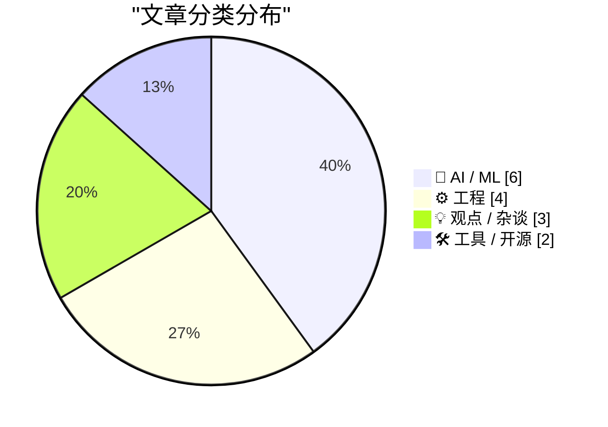
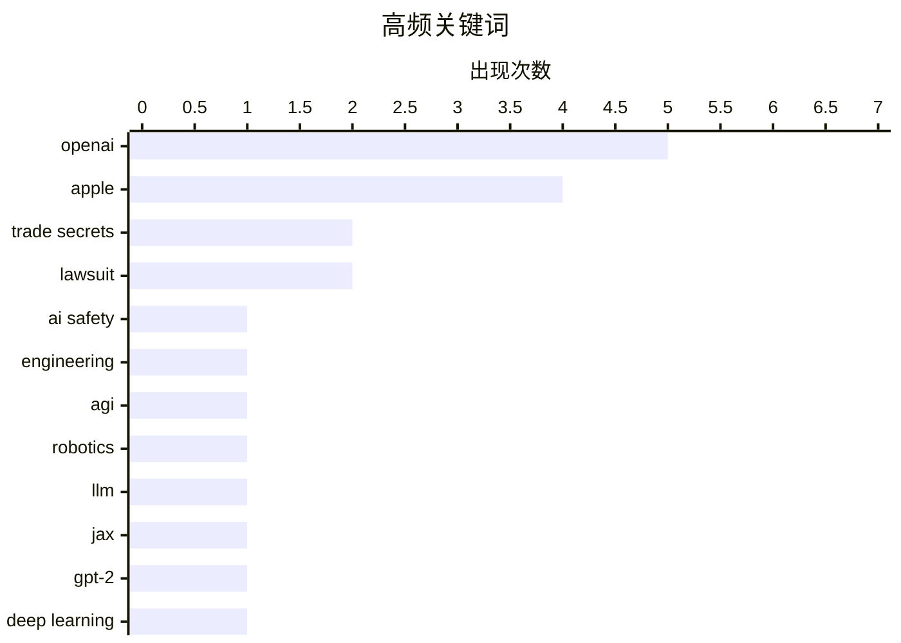

# 📰 Jul 12, 2026

> 来自 Karpathy 推荐的 92 个顶级技术博客，AI 精选 Top 15

## 📝 今日看点

苹果起诉OpenAI窃取商业机密，标志着科技巨头间的AI竞合关系正转向激烈的法律对抗。与此同时，业界掀起对“AI崇拜”与产品逻辑乱象的深度反思，呼吁将关注点从宏观幻想回归到现实的工程细节与劳工权益。从穿墙雷达的硬件突破到对大型代码库维护理念的重构，技术领域正经历一场从理论热潮向务实主义的范式转移。

---

## 🏆 今日必读

🥇 **苹果起诉 OpenAI 及前员工，指控其窃取商业机密**

[Apple Sues OpenAI, io, and Former Employees, Alleging Theft of Trade Secrets](https://9to5mac.com/2026/07/10/apple-sues-openai-trade-secret-theft/) — daringfireball.net · 1 天前 · 🤖 AI / ML

> 苹果公司正式起诉 OpenAI、io Products 以及两名前员工，指控其窃取有关消费级硬件的商业机密。被告包括苹果前产品设计副总裁 Tang Tan（曾领导 iPhone 和 Apple Watch 设计）和高级系统电气工程师 Chang Liu。Tang Tan 于 2024 年离职加入 Jony Ive 的公司，而 Chang Liu 则在 2026 年加入 OpenAI。这起诉讼揭示了 OpenAI 在硬件领域的野心，也解释了近期苹果高层对双方合作关系的冷淡态度。法律文件显示，苹果认为这些前员工将核心设计机密带到了竞争对手手中。

💡 **为什么值得读**: 揭示了科技巨头之间表面合作、背后博弈的激烈竞争现状，是理解苹果与 OpenAI 关系的重要背景。

🏷️ Apple, OpenAI, trade secrets, lawsuit

🥈 **AI 2040 与智能崇拜**

[AI 2040 and the Cult of Intelligence](https://geohot.github.io//blog/jekyll/update/2026/07/11/ai-2040.html) — geohot.github.io · 1 天前 · 💡 观点 / 杂谈

> 著名黑客 George Hotz 针对“AI 2040”及智能崇拜现象发表了尖锐批评，反思了自己曾对递归自我改进理论的迷信。他指出，在 comma.ai 研发类似手机复杂度的硬件产品时，现实世界的琐碎细节远比理论模型复杂。即便拥有超强智能的 ChatGPT，在面对换自行车轮胎等物理任务时也可能束手无策。作者认为，当前的 AI 讨论过于神化智能，而忽视了工程实践中的物理限制。他强调，真正的世界运行在复杂的物理细节之上，而非纯粹的逻辑推理。

💡 **为什么值得读**: 顶级黑客从工程实践角度出发，为狂热的 AI 进化论泼了一盆清醒的冷水。

🏷️ AI safety, engineering, AGI, robotics

🥉 **建立对 LLM 参数量的直观理解**

[Building intuition about LLM parameter counts](https://www.gilesthomas.com/2026/07/llm-parameter-counts) — gilesthomas.com · 1 天前 · 🤖 AI / ML

> 作者通过在 JAX 中从零实现 GPT-2 Small（124M 参数）的过程，探讨了模型参数的分布规律。实验发现，即便移除所有 Transformer 块、注意力和前馈网络，仅保留 Token 嵌入层和输出头，模型参数量仍高达 77M。这揭示了在不使用权重共享（Weight Tying）的情况下，嵌入层占据了模型总参数的极大比例。文章旨在帮助开发者通过具体代码实现，建立对大模型规模构成的直观认识。通过这种拆解，读者可以更清晰地理解模型每一层对内存和计算的需求。

💡 **为什么值得读**: 深入浅出地拆解了模型参数的构成，是理解 LLM 架构成本和优化方向的绝佳实践指南。

🏷️ LLM, JAX, GPT-2, deep learning

---

## 📊 数据概览

| 扫描源 | 抓取文章 | 时间范围 | 精选 |
|:---:|:---:|:---:|:---:|
| 83/92 | 2500 篇 → 35 篇 | 48h | **15 篇** |

### 分类分布



### 高频关键词



<details>
<summary>📈 纯文本关键词图（终端友好）</summary>

```
openai        │ ████████████████████ 5
apple         │ ████████████████░░░░ 4
trade secrets │ ████████░░░░░░░░░░░░ 2
lawsuit       │ ████████░░░░░░░░░░░░ 2
ai safety     │ ████░░░░░░░░░░░░░░░░ 1
engineering   │ ████░░░░░░░░░░░░░░░░ 1
agi           │ ████░░░░░░░░░░░░░░░░ 1
robotics      │ ████░░░░░░░░░░░░░░░░ 1
llm           │ ████░░░░░░░░░░░░░░░░ 1
jax           │ ████░░░░░░░░░░░░░░░░ 1
```

</details>

### 🏷️ 话题标签

**openai**(5) · **apple**(4) · **trade secrets**(2) · lawsuit(2) · ai safety(1) · engineering(1) · agi(1) · robotics(1) · llm(1) · jax(1) · gpt-2(1) · deep learning(1) · ai ethics(1) · robot rights(1) · philosophy(1) · automation(1) · debugging(1) · c++(1) · compiler(1) · assembly(1)

---

## 🤖 AI / ML

### 1. 苹果起诉 OpenAI 及前员工，指控其窃取商业机密

[Apple Sues OpenAI, io, and Former Employees, Alleging Theft of Trade Secrets](https://9to5mac.com/2026/07/10/apple-sues-openai-trade-secret-theft/) — **daringfireball.net** · 1 天前 · ⭐ 26/30

> 苹果公司正式起诉 OpenAI、io Products 以及两名前员工，指控其窃取有关消费级硬件的商业机密。被告包括苹果前产品设计副总裁 Tang Tan（曾领导 iPhone 和 Apple Watch 设计）和高级系统电气工程师 Chang Liu。Tang Tan 于 2024 年离职加入 Jony Ive 的公司，而 Chang Liu 则在 2026 年加入 OpenAI。这起诉讼揭示了 OpenAI 在硬件领域的野心，也解释了近期苹果高层对双方合作关系的冷淡态度。法律文件显示，苹果认为这些前员工将核心设计机密带到了竞争对手手中。

🏷️ Apple, OpenAI, trade secrets, lawsuit

---

### 2. 建立对 LLM 参数量的直观理解

[Building intuition about LLM parameter counts](https://www.gilesthomas.com/2026/07/llm-parameter-counts) — **gilesthomas.com** · 1 天前 · ⭐ 25/30

> 作者通过在 JAX 中从零实现 GPT-2 Small（124M 参数）的过程，探讨了模型参数的分布规律。实验发现，即便移除所有 Transformer 块、注意力和前馈网络，仅保留 Token 嵌入层和输出头，模型参数量仍高达 77M。这揭示了在不使用权重共享（Weight Tying）的情况下，嵌入层占据了模型总参数的极大比例。文章旨在帮助开发者通过具体代码实现，建立对大模型规模构成的直观认识。通过这种拆解，读者可以更清晰地理解模型每一层对内存和计算的需求。

🏷️ LLM, JAX, GPT-2, deep learning

---

### 3. 机器人权利与 AI 奴隶制的幻想

[Pluralistic: "Rights for robots" and the AI slavery fantasy (10 Jul 2026)](https://pluralistic.net/2026/07/10/posthuman-as-in-no-humans/) — **pluralistic.net** · 1 天前 · ⭐ 23/30

> Cory Doctorow 探讨了“机器人权利”这一概念背后的荒诞逻辑，认为这是一种逃避现实人类劳动力问题的幻想。文章指出，将 AI 拟人化并讨论其是否被“奴役”，实际上掩盖了科技公司对人类劳动者的剥削。作者通过历史和科幻视角，批判了这种“后人类主义”倾向如何让人们忽视了真正的社会契约。这种讨论往往服务于资本利益，通过赋予机器“人格”来规避企业的法律责任。最终，作者呼吁回归对人类权利和劳动保障的关注。

🏷️ AI ethics, robot rights, philosophy, automation

---

### 4. Benedict Evans 评 ChatGPT 的“超级应用”乱象

[Benedict Evans on the New ‘Super App’ ChatGPT](https://www.threads.com/@benedictevans/post/Dano_uvDr8F) — **daringfireball.net** · 10 小时前 · ⭐ 22/30

> 知名分析师 Benedict Evans 对 ChatGPT 近期的 UI 更新给出了“一团糟”的评价，质疑其产品逻辑的混乱。他指出，用户难以区分项目（Project）、任务（Task）和聊天（Chat）的功能边界，且 UI 交互极不统一。此外，OpenAI 强制要求关联 Slack 或 Google Drive 才能完成设置的做法也引发了用户反感。这反映了 OpenAI 在试图从单一聊天工具转型为“超级应用”平台时，面临着严重的产品设计挑战。作者认为，这种功能堆砌反而削弱了 AI 原生的简洁体验。

🏷️ ChatGPT, UX, product design, OpenAI

---

### 5. 冰冷的合作关系：苹果与 OpenAI 的紧张局势

[Ice Cold](https://www.threads.com/@alexheath/post/DaoI2jaEioX) — **daringfireball.net** · 1 天前 · ⭐ 22/30

> 科技记者 Alex Heath 观察到，在 WWDC 期间，苹果高管在谈及与 OpenAI 的合作伙伴关系时态度极其冷淡。这种“冰冷”的反应与近期苹果起诉 OpenAI 窃取商业机密的新闻形成了呼应。Daring Fireball 的作者 John Gruber 也证实了这一观察，指出在询问 Siri 与 ChatGPT 集成的问题时，苹果表现得异常谨慎。这表明双方的合作并非基于信任，而是充满法律博弈的权宜之计。这种紧张关系可能会影响未来苹果 AI 功能的迭代速度和深度。

🏷️ Apple, OpenAI, partnership, Sun Valley

---

### 6. “毫无兴趣”：评 OpenAI 对窃取商业机密指控的回应

[‘No Interest’](https://x.com/drewpusateri/status/2075708238650089981) — **daringfireball.net** · 1 天前 · ⭐ 21/30

> 针对苹果等公司发起的窃取商业机密诉讼，OpenAI 通讯总监回应称公司对他人的商业机密“毫无兴趣”。科技博主 John Gruber 对此辞令进行了辛辣讽刺，认为这种表态在法律和逻辑上极度无力。他通过“偷钱包”的类比指出，“没兴趣”并不等同于“没偷”或“没用”，这种避重就轻的回应反而加深了外界对其行为的质疑。文章批判了科技巨头在面临严重合规指控时常用的公关话术。

🏷️ OpenAI, Apple, lawsuit, trade secrets

---

## ⚙️ 工程

### 7. 整数神秘变化的案例：本不该发生的编译影响

[The case of the mysterious changes to integers when there shouldn’t have been any code generation effect](https://devblogs.microsoft.com/oldnewthing/20260710-00/?p=112514) — **devblogs.microsoft.com/oldnewthing** · 1 天前 · ⭐ 23/30

> Raymond Chen 记录了一次离奇的调试经历，涉及在没有任何代码生成更改的情况下，整数值却发生了变化。通过对二进制文件和编译器行为的深入分析，作者解开了这些神秘数字的来源。文章展示了底层调试中如何追踪那些看似不可能发生的副作用，并最终定位到编译器优化或链接器行为的细微差异。这对于理解编译器优化、链接器行为以及内存布局的潜在影响具有重要参考价值。该案例强调了在底层开发中，即使是微小的环境变化也可能导致非预期的结果。

🏷️ debugging, C++, compiler, assembly

---

### 8. 为“不理解代码库”辩护

[In defense of not understanding your codebase](https://seangoedecke.com/in-defense-of-not-understanding-your-codebase/) — **seangoedecke.com** · 1 天前 · ⭐ 22/30

> 文章挑战了“优秀工程师必须完全理解代码库”的传统观念，认为在大型、高流动性的团队中，这种要求是不切实际的。作者对比了 Redis 等小型项目与超大规模系统的差异，指出过度追求全局理解会显著降低开发效率。相反，工程师应当学会依赖接口契约和局部推理，在不掌握每一个细节的情况下安全地进行修改。这种“局部理解”策略是应对现代复杂软件系统的必要生存技能。文章最后建议，建立良好的抽象和文档比要求开发者记住所有逻辑更为重要。

🏷️ software engineering, codebase, productivity, architecture

---

### 9. 优先在 SQLite 中使用 STRICT 表

[Prefer STRICT tables in SQLite](https://evanhahn.com/prefer-strict-tables-in-sqlite/) — **evanhahn.com** · 1 天前 · ⭐ 22/30

> SQLite 默认的灵活类型系统允许在整型列中插入文本，这常导致难以察觉的数据完整性问题。通过在 CREATE TABLE 语句末尾添加 STRICT 关键字，可以强制执行严格的数据类型校验。该特性自 SQLite 3.37.0 版本引入，能有效防止非法数据写入并减少类型转换带来的潜在 Bug。对于习惯了 PostgreSQL 或 MySQL 等传统数据库行为的开发者，启用此模式能显著提升代码的健壮性。

🏷️ SQLite, database, SQL, data integrity

---

### 10. 点积：分量定义与几何定义的等价性证明

[Dot product: Component vs. Geometric definition](https://eli.thegreenplace.net/2026/dot-product-component-vs-geometric-definition/) — **eli.thegreenplace.net** · 1 天前 · ⭐ 22/30

> 欧几里得空间中的向量点积存在两种定义：基于分量的代数和与基于模长及夹角余弦的几何表示。本文旨在推导并解释为什么这两个看似迥异的公式在数学上是完全等价的。通过余弦定理（Law of Cosines）以及向量分解的推演，揭示了线性代数运算与物理几何直觉之间的内在联系。这对于理解计算机图形学、物理模拟等领域的基础数学逻辑至关重要。

🏷️ mathematics, linear algebra, geometry, dot product

---

## 💡 观点 / 杂谈

### 11. AI 2040 与智能崇拜

[AI 2040 and the Cult of Intelligence](https://geohot.github.io//blog/jekyll/update/2026/07/11/ai-2040.html) — **geohot.github.io** · 1 天前 · ⭐ 26/30

> 著名黑客 George Hotz 针对“AI 2040”及智能崇拜现象发表了尖锐批评，反思了自己曾对递归自我改进理论的迷信。他指出，在 comma.ai 研发类似手机复杂度的硬件产品时，现实世界的琐碎细节远比理论模型复杂。即便拥有超强智能的 ChatGPT，在面对换自行车轮胎等物理任务时也可能束手无策。作者认为，当前的 AI 讨论过于神化智能，而忽视了工程实践中的物理限制。他强调，真正的世界运行在复杂的物理细节之上，而非纯粹的逻辑推理。

🏷️ AI safety, engineering, AGI, robotics

---

### 12. 职场“灵活性”的谎言

[Pluralistic: Workplace "flexibility" isn't (11 Jul 2026)](https://pluralistic.net/2026/07/11/your-risk/) — **pluralistic.net** · 23 小时前 · ⭐ 22/30

> Cory Doctorow 深入批判了零工经济（Gig Economy）所宣扬的“灵活性”本质，认为这实际上是企业将经营风险转嫁给劳动者的手段。文章指出，所谓的自主安排时间，代价是失去了社会保障、稳定的收入以及对工作条件的控制权。作者列举了从服务条款（ToS）到算法管理等多种手段，揭示了科技平台如何利用技术手段剥削劳动力。这种模式并非创造自由，而是构建了一种新型的、不稳定的雇佣关系。文章呼吁重新审视技术在职场中扮演的角色，防止其成为剥削的工具。

🏷️ gig economy, labor rights, flexibility, tech industry

---

### 13. 古尔曼评 OpenAI 挖角苹果高管：Tang Tan 与 Paul Meade 事件

[Gurman on Tang Tan and Paul Meade](https://www.bloomberg.com/news/articles/2026-07-11/openai-engineer-s-lol-moment-set-stage-for-legal-fight-with-apple) — **daringfireball.net** · 14 小时前 · ⭐ 21/30

> OpenAI 近期针对苹果硬件与设计团队发起了激进的招聘攻势，导致苹果多个工程部门人才流失严重。其中，苹果智能眼镜负责人 Paul Meade 被 OpenAI 挖走后，苹果立即将其解雇且不提供任何交接期，反映出两家公司关系的极度恶化。彭博社记者 Mark Gurman 指出，这种大规模的人才“掠夺”已成为双方法律纠纷的导火索。这一系列动作预示着 OpenAI 在硬件领域（如 AI 可穿戴设备）的巨大野心。

🏷️ Apple, OpenAI, recruiting, hardware

---

## 🛠 工具 / 开源

### 14. QuadRF：能穿墙探测 WiFi 并追踪无人机的相位阵列雷达

[QuadRF can spot drones and see WiFi through my wall](https://www.jeffgeerling.com/blog/2026/quadrf-can-spot-drones-and-see-wifi-through-my-wall/) — **jeffgeerling.com** · 1 天前 · ⭐ 22/30

> QuadRF 是一款基于 Raspberry Pi 5 和 FPGA 构建的相位阵列无线电设备，具备皮秒级的定时精度。它利用先进的信号处理和波束成形技术，能够实现穿墙探测 WiFi 信号以及实时追踪无人机轨迹。该设备展示了高性能射频技术如何通过模块化硬件实现，并提供了强大的空间感知能力。作者 Jeff Geerling 详细演示了其在复杂环境下的信号捕捉表现，证明了 DIY 硬件也能达到专业级的探测水平。这一技术在安防、监测和无线电研究领域具有广泛的应用潜力。

🏷️ RF, SDR, drones, WiFi

---

### 15. 包管理技术周报：2026 年 7 月 11 日

[This Week in Package Management: 11 July 2026](https://nesbitt.io/2026/07/11/this-week-in-package-management.html) — **nesbitt.io** · 22 小时前 · ⭐ 21/30

> 本周报汇总了 2026 年 7 月 11 日当周全球包管理领域的最新动态。内容涵盖了主流包管理器（如 npm、PyPI、Cargo 等）的新版本发布、关键安全漏洞预警以及行业深度文章。通过追踪软件包供应链的最新趋势，帮助开发者及时了解工具链的演进。对于关注软件分发安全和构建自动化的工程师来说，这是获取一手资讯的高效渠道。

🏷️ package management, security, releases

---

*生成于 2026-07-12 08:28 | 扫描 83 源 → 获取 2500 篇 → 精选 15 篇*
*基于 [Hacker News Popularity Contest 2025](https://refactoringenglish.com/tools/hn-popularity/) RSS 源列表，由 [Andrej Karpathy](https://x.com/karpathy) 推荐*
