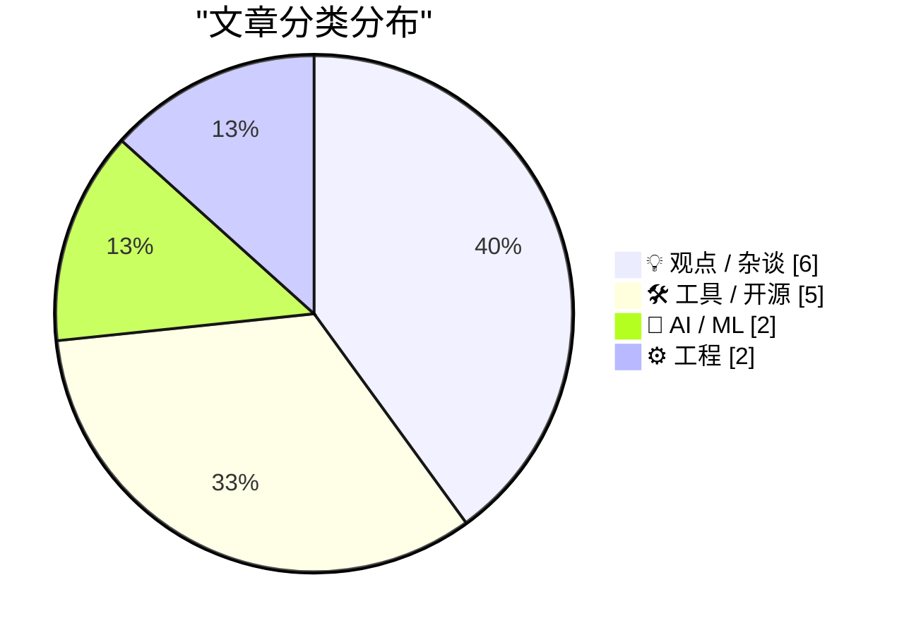
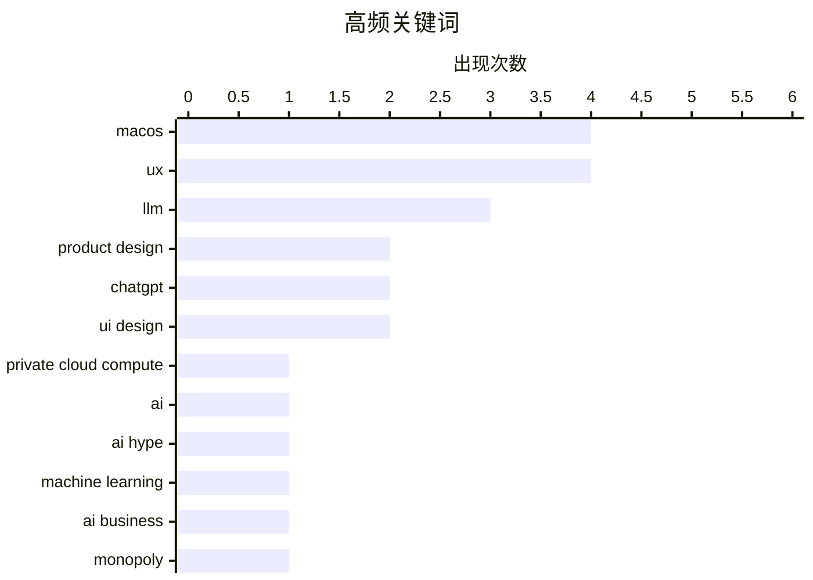

# 📰 Jul 13, 2026

> 来自 Karpathy 推荐的 92 个顶级技术博客，AI 精选 Top 15

## 📝 今日看点

AI 领域正处于高性能模型迭代与产品逻辑重构的交汇点，GPT-5.6 Sol 的基准效应迫使竞品调整策略，而业界对 AI 商业模式及“超级应用”界面臃肿化的反思也日益深刻。与此同时，macOS 27 带来的私有云计算与系统级模型调用正重塑原生开发范式，驱动开发者重新审视 UI 设计的清晰度与“每一帧都完美”的质量准则。在技术飞速演进的背景下，从供应链安全到 DRI 责任制，工程效能与设计美学的系统性回归正成为当前技术圈的核心议题。

---

## 🏆 今日必读

🥇 **TwoMillionKit：无需权限在 macOS 27 中调用私有云计算模型**

[TwoMillionKit: Use Private Cloud Compute in MacOS 27 Foundation Models Without an Entitlement](https://github.com/insidegui/TwoMillionKit) — daringfireball.net · 15 小时前 · 🛠 工具 / 开源

> macOS 27 内置了名为 fm 的命令行工具，允许用户在终端或脚本中直接调用本地系统模型及私有云计算（PCC）进行推理。开发者 Guilherme Rambo 利用 GPT-5.6 Sol 编写了 Swift 封装包 TwoMillionKit，通过在后台调用该 CLI 工具，让普通 Mac 应用无需申请复杂的 Entitlement 授权即可使用这些底层 AI 能力。该方案通过 LanguageModel 接口实现了对 fm 工具的封装，极大地降低了开发者集成苹果原生大模型的门槛。这意味着第三方应用现在可以绕过官方限制，灵活调用苹果最先进的云端与本地推理基础设施。

💡 **为什么值得读**: 揭示了在 macOS 27 中无需官方授权即可调用苹果私有云计算（PCC）能力的“黑科技”实现方式。

🏷️ macOS, Private Cloud Compute, LLM, AI

🥈 **我热爱大语言模型，但我讨厌炒作**

[I love LLMs, I hate hype](https://geohot.github.io//blog/jekyll/update/2026/07/12/i-love-llms.html) — geohot.github.io · 1 天前 · 💡 观点 / 杂谈

> 著名黑客 George Hotz (geohot) 表达了他对 AI 技术进步的极度兴奋，尽管他非常反感行业内的过度炒作。他分享了近期在本地 GLM-5.2 模型上配置 opencode 的体验，仅需自然语言指令即可完成复杂的 tmux 环境安装与配置。他认为随着 LLM、自动驾驶和视频生成模型的成熟，AI 正在实质性地改变开发者的生产力。这种技术突破让他感叹，由于 AI 编程助手的出现，真正的“Linux 桌面元年”终于到来。作者强调，尽管存在泡沫，但 AI 带来的工具链革命是真实且令人振奋的。

💡 **为什么值得读**: 顶级黑客 geohot 对当前 AI 落地现状的真实评价，展示了本地大模型对开发者工作流的实际改变。

🏷️ LLM, AI hype, machine learning

🥉 **为什么 AI 公司不直接与他们的客户竞争？**

[Pluralistic: Why aren't AI companies competing directly with their customers? (13 Jul 2026)](https://pluralistic.net/2026/07/13/go-meta-meta/) — pluralistic.net · 1 小时前 · 💡 观点 / 杂谈

> 文章探讨了 AI 行业商业模式中的核心矛盾：如果 AI 真的如宣传般强大，为何巨头们倾向于售卖 API 和算力（卖铲子），而不是直接生产最终产品。作者 Cory Doctorow 质疑 AI 公司是否在通过向客户转嫁风险，来掩盖技术在实际业务应用中的局限性。文中深入分析了这种“卖水人”策略背后的经济动机，以及 AI 行业可能存在的泡沫风险。结论认为，AI 公司不直接下场竞争，往往是因为技术尚未达到能独立支撑高价值业务的成熟度。这种模式反映了当前 AI 产业在实际价值创造上的不确定性。

💡 **为什么值得读**: 犀利剖析 AI 行业商业逻辑的深度评论，适合对 AI 商业化路径和潜在泡沫感兴趣的读者。

🏷️ AI business, monopoly, economics

---

## 📊 数据概览

| 扫描源 | 抓取文章 | 时间范围 | 精选 |
|:---:|:---:|:---:|:---:|
| 84/92 | 2518 篇 → 29 篇 | 48h | **15 篇** |

### 分类分布



### 高频关键词



<details>
<summary>📈 纯文本关键词图（终端友好）</summary>

```
macos                 │ ████████████████████ 4
ux                    │ ████████████████████ 4
llm                   │ ███████████████░░░░░ 3
product design        │ ██████████░░░░░░░░░░ 2
chatgpt               │ ██████████░░░░░░░░░░ 2
ui design             │ ██████████░░░░░░░░░░ 2
private cloud compute │ █████░░░░░░░░░░░░░░░ 1
ai                    │ █████░░░░░░░░░░░░░░░ 1
ai hype               │ █████░░░░░░░░░░░░░░░ 1
machine learning      │ █████░░░░░░░░░░░░░░░ 1
```

</details>

### 🏷️ 话题标签

**macos**(4) · **ux**(4) · **llm**(3) · product design(2) · chatgpt(2) · ui design(2) · private cloud compute(1) · ai(1) · ai hype(1) · machine learning(1) · ai business(1) · monopoly(1) · economics(1) · ui quality(1) · trust(1) · package management(1) · security advisories(1) · open source(1) · anthropic(1) · claude(1)

---

## 💡 观点 / 杂谈

### 1. 我热爱大语言模型，但我讨厌炒作

[I love LLMs, I hate hype](https://geohot.github.io//blog/jekyll/update/2026/07/12/i-love-llms.html) — **geohot.github.io** · 1 天前 · ⭐ 26/30

> 著名黑客 George Hotz (geohot) 表达了他对 AI 技术进步的极度兴奋，尽管他非常反感行业内的过度炒作。他分享了近期在本地 GLM-5.2 模型上配置 opencode 的体验，仅需自然语言指令即可完成复杂的 tmux 环境安装与配置。他认为随着 LLM、自动驾驶和视频生成模型的成熟，AI 正在实质性地改变开发者的生产力。这种技术突破让他感叹，由于 AI 编程助手的出现，真正的“Linux 桌面元年”终于到来。作者强调，尽管存在泡沫，但 AI 带来的工具链革命是真实且令人振奋的。

🏷️ LLM, AI hype, machine learning

---

### 2. 为什么 AI 公司不直接与他们的客户竞争？

[Pluralistic: Why aren't AI companies competing directly with their customers? (13 Jul 2026)](https://pluralistic.net/2026/07/13/go-meta-meta/) — **pluralistic.net** · 1 小时前 · ⭐ 25/30

> 文章探讨了 AI 行业商业模式中的核心矛盾：如果 AI 真的如宣传般强大，为何巨头们倾向于售卖 API 和算力（卖铲子），而不是直接生产最终产品。作者 Cory Doctorow 质疑 AI 公司是否在通过向客户转嫁风险，来掩盖技术在实际业务应用中的局限性。文中深入分析了这种“卖水人”策略背后的经济动机，以及 AI 行业可能存在的泡沫风险。结论认为，AI 公司不直接下场竞争，往往是因为技术尚未达到能独立支撑高价值业务的成熟度。这种模式反映了当前 AI 产业在实际价值创造上的不确定性。

🏷️ AI business, monopoly, economics

---

### 3. “每一帧都完美”

[‘Every Frame Perfect’](https://tonsky.me/blog/every-frame-perfect/) — **daringfireball.net** · 13 小时前 · ⭐ 23/30

> 开发者 Nikita Prokopov 提出了“每一帧都完美”的 UI 设计准则，强调应用在任何瞬间的截图都应具备可解释的清晰度。他认为 UI 是用户判断软件质量的唯一直观依据，精美的界面暗示了开发者在底层代码上也投入了同等的打磨精力。文章指出，UI 的细节缺失或视觉混乱往往是代码质量失控的先兆，因此追求视觉上的极致严谨是一种有效的质量保证启发法。这种对“像素级”完美的追求，本质上是为了建立用户对软件可靠性的深度信任。通过打磨 UI，开发者实际上是在向用户传递一种专业且负责的态度。

🏷️ UI quality, UX, Product Design, Trust

---

### 4. Benedict Evans 评 ChatGPT “超级应用”新界面

[Benedict Evans on the New ‘Super App’ ChatGPT](https://www.threads.com/@benedictevans/post/Dano_uvDr8F) — **daringfireball.net** · 1 天前 · ⭐ 22/30

> 著名科技分析师 Benedict Evans 对 ChatGPT 转型“超级应用”后的新界面给出了极其负面的评价，称其为“一团糟”。他质疑了产品中“项目”、“任务”与“对话”之间模糊的逻辑界限，并批评了浮动窗口设计的不一致性。此外，Evans 还吐槽了强制关联 Slack 或 Google Drive 才能完成设置的糟糕用户路径，认为这增加了不必要的认知负担。他认为这种混乱反映了在工程主导的公司中，当试图强行整合多种功能时，往往会牺牲产品的易用性和直观性。这种 UI 的退化可能会阻碍普通用户对复杂 AI 功能的深度使用。

🏷️ ChatGPT, UX, product design

---

### 5. 直接责任人 (DRI) 制度解析

[Directly Responsible Individuals (DRI)](https://simonwillison.net/2026/Jul/12/directly-responsible-individuals/#atom-everything) — **simonwillison.net** · 9 小时前 · ⭐ 21/30

> Simon Willison 探讨了“直接责任人”（DRI）这一管理概念，该术语起源于苹果公司，现已被 GitLab 等公司广泛采用并写入手册。DRI 指的是对特定项目、倡议或活动的最终成败负有绝对责任的个人，是决策的终极节点。文章强调，设立 DRI 的核心目的不是为了事后问责，而是为了消除决策中的模糊地带，确保每个环节都有明确的推进者。这种管理模式在分布式协作和高压力的技术项目中显得尤为重要，能显著提升团队的执行效率。明确 DRI 有助于在复杂组织中保持初创公司般的敏捷性。

🏷️ DRI, management, GitLab, accountability

---

### 6. 用户界面是如何随时间退化的

[How UIs Degrade Over Time](https://grumpy.website/1723) — **daringfireball.net** · 13 小时前 · ⭐ 21/30

> 文章指出，尽管技术在进步，但 Windows 和 macOS 的系统 UI 视觉清晰度却在逐年退化。作者通过对比不同时期的系统警告框示例，展示了曾经追求清晰、直观的 UI 装饰（Chrome）如何演变为如今模糊且难以辨识的设计。这种退化现象在主流操作系统中普遍存在，且缺乏合理的解释，甚至影响了基础的交互逻辑。作者认为，现代 UI 设计过于追求极简或风格化，反而背离了用户界面作为信息传递媒介的初衷。这种趋势反映了现代软件开发中对基础交互美学和可用性的某种忽视。

🏷️ UI design, UX, macOS, Windows

---

## 🛠 工具 / 开源

### 7. TwoMillionKit：无需权限在 macOS 27 中调用私有云计算模型

[TwoMillionKit: Use Private Cloud Compute in MacOS 27 Foundation Models Without an Entitlement](https://github.com/insidegui/TwoMillionKit) — **daringfireball.net** · 15 小时前 · ⭐ 27/30

> macOS 27 内置了名为 fm 的命令行工具，允许用户在终端或脚本中直接调用本地系统模型及私有云计算（PCC）进行推理。开发者 Guilherme Rambo 利用 GPT-5.6 Sol 编写了 Swift 封装包 TwoMillionKit，通过在后台调用该 CLI 工具，让普通 Mac 应用无需申请复杂的 Entitlement 授权即可使用这些底层 AI 能力。该方案通过 LanguageModel 接口实现了对 fm 工具的封装，极大地降低了开发者集成苹果原生大模型的门槛。这意味着第三方应用现在可以绕过官方限制，灵活调用苹果最先进的云端与本地推理基础设施。

🏷️ macOS, Private Cloud Compute, LLM, AI

---

### 8. 包管理周报：2026 年 7 月 11 日

[This Week in Package Management: 11 July 2026](https://nesbitt.io/2026/07/11/this-week-in-package-management.html) — **nesbitt.io** · 1 天前 · ⭐ 23/30

> 该周报汇总了 2026 年 7 月 11 日当周全球包管理领域的最新动态，涵盖了多个主流生态系统的版本发布、安全预警及技术文章。内容涉及 npm、PyPI、Cargo 等工具的更新，以及针对供应链攻击的最新防御策略。对于需要追踪依赖管理工具演进和安全漏洞的开发者来说，这是一个关键的信息源。通过阅读本期周报，读者可以快速掌握包管理领域的行业标准变化和潜在的技术风险。该系列持续关注开发者工具链的底层稳定性与安全性。

🏷️ package management, security advisories, open source

---

### 9. Stacks：适用于现代 macOS 的 HyperCard 播放器

[Stacks — HyperCard Player for Modern MacOS](https://morphing.cloud/hypercard/) — **daringfireball.net** · 17 小时前 · ⭐ 21/30

> Stacks 是一款专为现代 macOS 设计的原生应用，允许用户无需模拟器即可直接运行经典的 HyperCard 堆栈。该工具深度集成了 Internet Archive 的 HyperCard 资源库，支持一键加载并运行各类历史交互作品。它完美复刻了当年的排版风格，并支持音频、乐器模拟以及经典的 MacinTalk 语音合成技术。通过实现跨堆栈导航，它在保持 1987 年复古体验的同时，提供了符合现代系统标准的流畅交互。这种“2026 风格”与“1987 风格”的结合，为数字考古提供了极佳的工具。

🏷️ HyperCard, macOS, software preservation

---

### 10. shot-scraper 1.11 版本发布

[shot-scraper 1.11](https://simonwillison.net/2026/Jul/12/shot-scraper/#atom-everything) — **simonwillison.net** · 9 小时前 · ⭐ 20/30

> 网页截图与自动化工具 shot-scraper 发布了 1.11 版本，重点优化了命令行选项的一致性。新版本改进了 server: 机制，该机制被 shot-scraper video 和 shot-scraper multi 命令共同调用。此次更新解决了当本地服务器启动时间超过一秒时，截图任务可能因超时而失败的问题。该工具基于 Playwright 构建，旨在通过简单的 YAML 配置实现复杂的网页截图和录屏任务。这些改进进一步增强了该工具在自动化 CI/CD 流水线中的鲁棒性。

🏷️ shot-scraper, automation, screenshot, CLI

---

### 11. WorkOS Pipes：简化 SaaS 集成的单一 API 方案

[WorkOS Pipes](https://workos.com/pipes?utm_source=daringfireball&amp;utm_medium=newsletter&amp;utm_campaign=q32026) — **daringfireball.net** · 11 小时前 · ⭐ 19/30

> WorkOS 推出名为 Pipes 的集成方案，旨在解决 B2B 应用在对接第三方工具时面临的 OAuth 流程复杂和令牌生命周期管理难题。通过单一 API 调用，开发者即可接入 GitHub、Slack、Salesforce 和 Google Drive 等主流平台的预建连接器。Pipes 自动处理身份验证、令牌刷新及凭据存储，无需开发者自行构建繁琐的底层基础设施。这一方案能将原本需要数周的开发工作缩短至几分钟，让团队专注于核心产品逻辑。它有效地屏蔽了不同服务商之间 API 实现的差异性。

🏷️ WorkOS, OAuth, API, integration

---

## 🤖 AI / ML

### 12. Claude Fable 模型访问权限再次延长

[Fable gets another bump](https://simonwillison.net/2026/Jul/12/bump/#atom-everything) — **simonwillison.net** · 12 小时前 · ⭐ 22/30

> 随着 GPT-5.6 Sol 确立了 Fable/Mythos 级别模型的新基准，Anthropic 宣布再次延长 Claude Fable 5 在所有付费计划中的访问期限。目前该模型的使用权限已延长至 7 月 19 日，且 Claude Code 的每周速率限制保持在 50% 的高位。用户在 Claude Max 计划中可以继续使用高达一半的配额来调用 Fable 5，之后配额将有所调整。这一举动反映了顶级模型竞争的白热化，以及厂商为了留住高端用户而不断调整资源分配策略。Simon Willison 指出，这种“不断跳票”的截止日期显示了 Fable 5 模型在用户中的极高需求。

🏷️ Anthropic, Claude, LLM, AI models

---

### 13. OpenAI 帮助中心揭示新版 ChatGPT 的局限性

[OpenAI Help Center Describes What Is Wrong With the New ChatGPT](https://help.openai.com/en/articles/20001275-chatgpt-work-and-codex) — **daringfireball.net** · 1 天前 · ⭐ 21/30

> OpenAI 帮助中心详细说明了新推出的 ChatGPT “Work” 与 “Codex” 功能的运行机制与限制。该功能目前仅面向符合条件的付费方案，且在 Web、移动端与桌面端存在显著差异：Web 和移动端完全在云端运行，而桌面端则可获得授权访问本地文件和应用。值得注意的是，发布初期云端 Work 对话与桌面端并不互通，桌面端的线程和本地文件将保留在用户本地计算机上。这种架构设计揭示了 OpenAI 在处理本地隐私与云端协作时的技术权衡。目前 Codex 功能的可用性也受到特定方案的限制。

🏷️ ChatGPT, OpenAI, product update

---

## ⚙️ 工程

### 14. Paulo Andrade：WWDC 27 关于构建原生 Mac 应用的更新

[Paulo Andrade: ‘A WWDC 27 Update on Building a Mac-Assed App With SwiftUI’](https://pfandrade.me/blog/swiftui-mac-assed-wwdc27-update/) — **daringfireball.net** · 12 小时前 · ⭐ 22/30

> Paulo Andrade 分享了在 WWDC 27 之后，利用 SwiftUI 构建具备原生质感的“Mac-assed”应用的最新进展。在收到苹果工程师的反馈后，作者针对 macOS 27 的新特性对应用进行了深度优化，并提交了多项反馈报告（FB）。文章详细记录了如何解决 SwiftUI 在 Mac 平台上的特定交互痛点，以及如何利用新 API 提升应用的系统集成度。作者强调，构建真正的 Mac 应用不仅是跨平台代码的迁移，更需要对平台特有设计哲学的深刻理解。这篇更新为开发者提供了大量关于 SwiftUI 在 macOS 上落地细节的实战经验。

🏷️ SwiftUI, macOS, WWDC, App Development

---

### 15. 2026 年的图标意味着什么？

[What’s an Icon in 2026?](https://blog.jim-nielsen.com/2026/icons-as-software/) — **blog.jim-nielsen.com** · 14 小时前 · ⭐ 21/30

> 随着苹果平台图标设计的持续演进，资深数字收藏家 Jim Nielsen 探讨了图标定义从静态图像向动态实体转变的趋势。他从长期用户和档案管理员的双重视角出发，分析了图标如何逐渐具备“软件”属性，而不仅仅是像素集合。文章反思了苹果在图标规范上的调整对应用品牌识别和用户心理预期的深远影响。这种转变标志着图标不再仅仅是功能的入口，而是系统交互体验中更具生命力的一部分。作者试图通过回顾图标的历史，来界定在高度动态化的系统界面中，图标的核心价值所在。

🏷️ UI design, Apple, icons, UX

---

*生成于 2026-07-13 09:40 | 扫描 84 源 → 获取 2518 篇 → 精选 15 篇*
*基于 [Hacker News Popularity Contest 2025](https://refactoringenglish.com/tools/hn-popularity/) RSS 源列表，由 [Andrej Karpathy](https://x.com/karpathy) 推荐*
