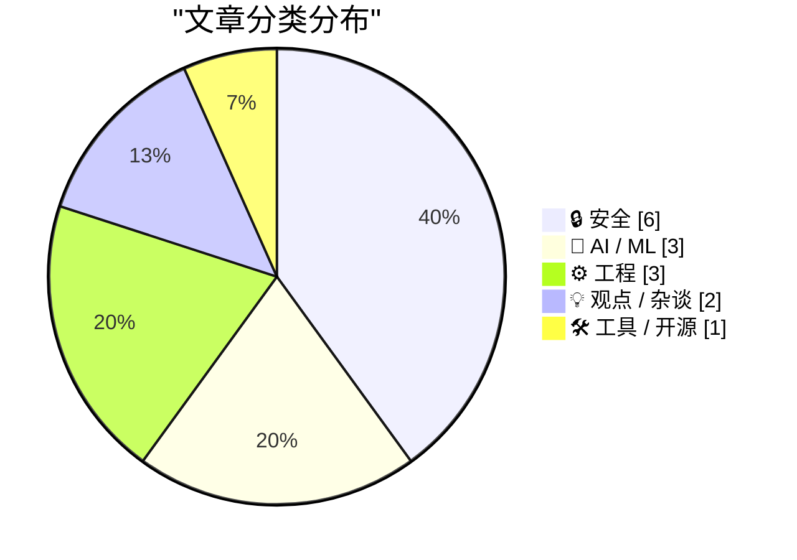
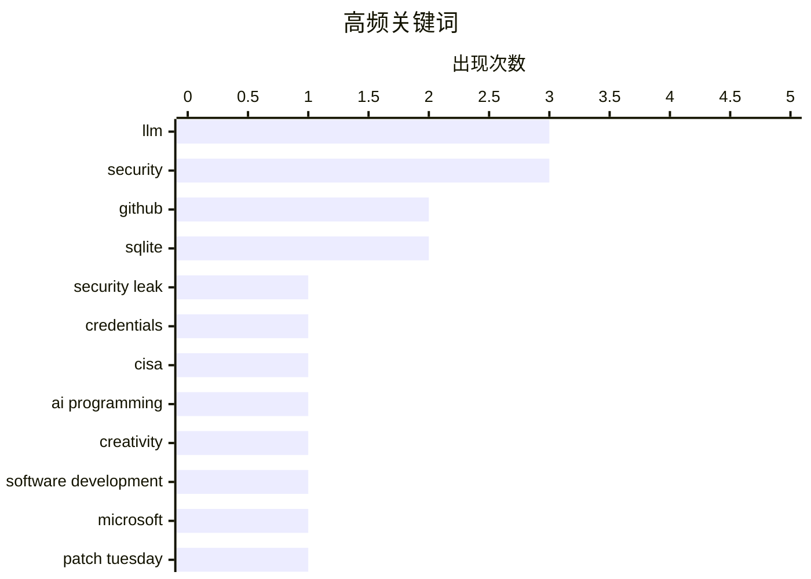

# 📰 Jul 15, 2026

> 来自 Karpathy 推荐的 92 个顶级技术博客，AI 精选 Top 15

## 📝 今日看点

今日技术圈聚焦于安全防御体系的深度重构，从微软创纪录的漏洞修复到 GitHub 引入依赖包冷却期，供应链安全正从被动响应转向主动预防。与此同时，AI 浪潮正重塑开发者的核心价值，业界开始强调对系统架构与核心思想的掌控，而非单纯的代码生成。此外，Lobsters 转向 SQLite 等案例反映出工程实践正回归简洁与高性能的务实主义。

---

## 🏆 今日必读

🥇 **从 CISA 最近的 GitHub 泄露事件中吸取的教训**

[Lessons Learned from CISA’s Recent GitHub Leak](https://krebsonsecurity.com/2026/07/lessons-learned-from-cisas-recent-github-leak/) — krebsonsecurity.com · 1 天前 · 🔒 安全

> 美国网络安全和基础设施安全局 (CISA) 发布了关于承包商在公共 GitHub 仓库泄露内部凭据（包括 AWS Govcloud 密钥）长达六个月的复盘报告。该事件暴露了机构在初始响应中的重大漏洞，直到 KrebsOnSecurity 提醒后才得以解决。专家指出，CISA 的响应迟缓反映了内部监控和凭据轮换机制的失效。安全团队应从中学习如何建立更有效的公开仓库扫描和快速响应流程。该报告为所有依赖云基础设施的机构提供了关于影子 IT 和第三方风险管理的深刻教训。

💡 **为什么值得读**: 深入了解国家级安全机构在处理敏感凭据泄露时的失误，为企业构建防御性开发流程提供警示。

🏷️ GitHub, security leak, credentials, CISA

🥈 **掌控思想，而非代码**

[Control the ideas, not the code](http://antirez.com/news/169) — antirez.com · 1 天前 · 🤖 AI / ML

> Redis 创始人 antirez 探讨了在 AI 编程时代程序员角色的转变。他认为尽管 AI 可以生成大量代码，但程序员的核心价值在于对系统架构、逻辑边界和核心思想的掌控。他结合自己开发本地 LLM 推理软件的经验，强调不应被 AI 牵着鼻子走，而应将其作为实现复杂想法的工具。作者主张资深开发者应保持对技术本质的洞察，而非仅仅追求编码速度。这种视角对于在自动化浪潮中感到焦虑的开发者具有重要的启发意义。

💡 **为什么值得读**: 听取 Redis 创始人对 AI 编程浪潮的深度思考，帮助开发者在自动化时代重新定位个人价值。

🏷️ AI programming, LLM, creativity, software development

🥉 **微软修复创纪录的 570 个安全漏洞**

[Microsoft Patches a Record 570 Security Flaws](https://krebsonsecurity.com/2026/07/microsoft-patches-a-record-570-security-flaws/) — krebsonsecurity.com · 13 小时前 · 🔒 安全

> 微软在最新的“补丁星期二”发布了针对 Windows 及其软件的更新，修复了多达 570 个安全漏洞。这一数字几乎是上个月创纪录补丁数量的三倍，标志着漏洞修复规模的巨大飞跃。微软将漏洞发现数量的激增归功于人工智能（AI）辅助的漏洞挖掘技术。这一趋势预示着安全攻防两端都将因 AI 的介入而进入高频对抗的新阶段。对于企业 IT 管理员而言，如此庞大的补丁量对测试和部署流程提出了前所未有的挑战。

💡 **为什么值得读**: 了解 AI 如何改变漏洞挖掘的规模，以及这对企业补丁管理策略带来的巨大挑战。

🏷️ Microsoft, security, Patch Tuesday

---

## 📊 数据概览

| 扫描源 | 抓取文章 | 时间范围 | 精选 |
|:---:|:---:|:---:|:---:|
| 83/92 | 2502 篇 → 31 篇 | 48h | **15 篇** |

### 分类分布



### 高频关键词



<details>
<summary>📈 纯文本关键词图（终端友好）</summary>

```
llm                  │ ████████████████████ 3
security             │ ████████████████████ 3
github               │ █████████████░░░░░░░ 2
sqlite               │ █████████████░░░░░░░ 2
security leak        │ ███████░░░░░░░░░░░░░ 1
credentials          │ ███████░░░░░░░░░░░░░ 1
cisa                 │ ███████░░░░░░░░░░░░░ 1
ai programming       │ ███████░░░░░░░░░░░░░ 1
creativity           │ ███████░░░░░░░░░░░░░ 1
software development │ ███████░░░░░░░░░░░░░ 1
```

</details>

### 🏷️ 话题标签

**llm**(3) · **security**(3) · **github**(2) · sqlite(2) · security leak(1) · credentials(1) · cisa(1) · ai programming(1) · creativity(1) · software development(1) · microsoft(1) · patch tuesday(1) · uv(1) · github actions(1) · ci/cd(1) · caching(1) · career development(1) · soft skills(1) · politics(1) · database(1)

---

## 🔒 安全

### 1. 从 CISA 最近的 GitHub 泄露事件中吸取的教训

[Lessons Learned from CISA’s Recent GitHub Leak](https://krebsonsecurity.com/2026/07/lessons-learned-from-cisas-recent-github-leak/) — **krebsonsecurity.com** · 1 天前 · ⭐ 26/30

> 美国网络安全和基础设施安全局 (CISA) 发布了关于承包商在公共 GitHub 仓库泄露内部凭据（包括 AWS Govcloud 密钥）长达六个月的复盘报告。该事件暴露了机构在初始响应中的重大漏洞，直到 KrebsOnSecurity 提醒后才得以解决。专家指出，CISA 的响应迟缓反映了内部监控和凭据轮换机制的失效。安全团队应从中学习如何建立更有效的公开仓库扫描和快速响应流程。该报告为所有依赖云基础设施的机构提供了关于影子 IT 和第三方风险管理的深刻教训。

🏷️ GitHub, security leak, credentials, CISA

---

### 2. 微软修复创纪录的 570 个安全漏洞

[Microsoft Patches a Record 570 Security Flaws](https://krebsonsecurity.com/2026/07/microsoft-patches-a-record-570-security-flaws/) — **krebsonsecurity.com** · 13 小时前 · ⭐ 25/30

> 微软在最新的“补丁星期二”发布了针对 Windows 及其软件的更新，修复了多达 570 个安全漏洞。这一数字几乎是上个月创纪录补丁数量的三倍，标志着漏洞修复规模的巨大飞跃。微软将漏洞发现数量的激增归功于人工智能（AI）辅助的漏洞挖掘技术。这一趋势预示着安全攻防两端都将因 AI 的介入而进入高频对抗的新阶段。对于企业 IT 管理员而言，如此庞大的补丁量对测试和部署流程提出了前所未有的挑战。

🏷️ Microsoft, security, Patch Tuesday

---

### 3. 预签名 URL 在技术上是一种安全漏洞

[Presigned URLs are technically a security vuln](https://www.tigrisdata.com/blog/presigned-urls-security-vuln/) — **xeiaso.net** · 1 天前 · ⭐ 23/30

> 预签名 URL 本质上是一种“故意为之”的重放攻击，因为它们允许持有令牌的任何人重复访问资源。尽管重放令牌在安全教科书中被视为漏洞，但 Tigris 和 AWS S3 等对象存储系统将其作为核心功能以简化授权。文章探讨了这种权衡：虽然它带来了便利，但也引入了令牌泄露后无法轻易撤销的风险。开发者在使用此类功能时，必须在易用性与重放攻击的潜在威胁之间寻找平衡。文章建议通过缩短过期时间和限制 IP 等手段来缓解此类风险。

🏷️ presigned URLs, cloud security, replay attack

---

### 4. GitHub 更新：Dependabot 引入默认包冷却期

[Quoting GitHub Changelog](https://simonwillison.net/2026/Jul/14/github-changeling/#atom-everything) — **simonwillison.net** · 9 小时前 · ⭐ 22/30

> GitHub 宣布 Dependabot 现在将默认等待新版本发布至少三天后，才会自动开启版本更新的拉取请求（PR）。这一冷却期机制旨在降低开发者受到恶意包注入或包含重大 Bug 的“零日”发布影响的风险。该功能无需任何配置即可生效，为供应链安全增加了一层天然的防御屏障。此举反映了 GitHub 在平衡依赖更新的及时性与安全性方面的最新策略。对于依赖大量开源包的项目，这能有效减少因上游突发故障导致的构建中断。

🏷️ Dependabot, GitHub, supply chain, security

---

### 5. 匿名末日：文本身份关联的猜想

[Pseudpocalypse](https://dynomight.net/pseudpocalypse/) — **dynomight.net** · 1 天前 · ⭐ 21/30

> 提出了一个关于互联网匿名性终结的严峻猜想：只要在网上留下足够数量的文本，不同马甲背后的身份就能仅凭文字风格被关联起来。这种“语言指纹”分析技术使得跨平台的身份隐藏变得极其困难。文章探讨了文体测定学（Stylometry）如何通过词频、句式结构等特征锁定写作者。这意味着在算法面前，传统的匿名手段正逐渐失效，互联网正进入一个“伪装终结”的时代。

🏷️ stylometry, privacy, anonymity

---

### 6. 每周更新 512：物联网门锁失效引发的惨剧

[Weekly Update 512: IoT Lockout Fail](https://www.troyhunt.com/weekly-update-512/) — **troyhunt.com** · 7 小时前 · ⭐ 21/30

> 记录了安全专家 Troy Hunt 遭遇的一次物联网设备故障：在结束 33 小时长途旅行后的深夜，因智能门锁电池耗尽且缺乏有效物理备份而被拒之门外。文章以此为切入点，反思了过度依赖智能家居技术的潜在风险。它揭示了当“智能”遇到断电、网络故障或电池耗尽等极端情况时，便利性如何瞬间转化为安全隐患。作者强调了在构建智能家庭时，保留可靠的物理冗余方案是多么至关重要。

🏷️ IoT, Smart Home, Security

---

## 🤖 AI / ML

### 7. 掌控思想，而非代码

[Control the ideas, not the code](http://antirez.com/news/169) — **antirez.com** · 1 天前 · ⭐ 26/30

> Redis 创始人 antirez 探讨了在 AI 编程时代程序员角色的转变。他认为尽管 AI 可以生成大量代码，但程序员的核心价值在于对系统架构、逻辑边界和核心思想的掌控。他结合自己开发本地 LLM 推理软件的经验，强调不应被 AI 牵着鼻子走，而应将其作为实现复杂想法的工具。作者主张资深开发者应保持对技术本质的洞察，而非仅仅追求编码速度。这种视角对于在自动化浪潮中感到焦虑的开发者具有重要的启发意义。

🏷️ AI programming, LLM, creativity, software development

---

### 8. GitHub 上的 Datasette 代码频率图表

[datasette code-frequency chart on GitHub](https://simonwillison.net/2026/Jul/13/datasette-code-frequency/#atom-everything) — **simonwillison.net** · 1 天前 · ⭐ 22/30

> 探讨了 AI 编码助手（如 Opus 4.5 级别模型）对个人开源项目产出的实际影响。作者通过分析 Datasette 项目的 GitHub 代码频率图表，直观展示了引入 AI 工具后代码提交量和变更频率的显著变化。这种量化视角揭示了大型语言模型如何改变传统开发者的工作流。图表中的波峰与 AI 技术的演进节点高度吻合，证明了 AI 并非只是辅助，而是生产力的倍增器。

🏷️ AI coding, productivity, LLM

---

### 9. DOOMQL：以 SQLite 为引擎的类 Doom 游戏

[DOOMQL](https://simonwillison.net/2026/Jul/13/doomql/#atom-everything) — **simonwillison.net** · 1 天前 · ⭐ 21/30

> 展示了一个由 GPT-5.6 Sol 辅助开发的奇特项目，将 SQLite 从单纯的数据存储工具转变为完整的游戏引擎。在 DOOMQL 中，SQL 语句负责处理玩家移动、碰撞检测、敌人 AI、战斗逻辑以及屏幕上每个像素的 RGB 渲染。该项目挑战了数据库能力的极限，证明了声明式查询语言在复杂逻辑模拟中的潜力。这种“不合理”的技术尝试为探索 SQLite 的边界提供了极具趣味性的视角。

🏷️ SQLite, LLM, game engine

---

## ⚙️ 工程

### 10. lobste.rs 社区现已运行在 SQLite 之上

[lobste.rs is now running on SQLite](https://simonwillison.net/2026/Jul/14/lobsters-sqlite/#atom-everything) — **simonwillison.net** · 12 小时前 · ⭐ 23/30

> 知名技术社区 Lobsters 完成了从 MariaDB 到 SQLite 的数据库迁移。该计划始于 2018 年，最初曾考虑 PostgreSQL，但最终因 SQLite 的高性能和运维简便性而选定。这次迁移证明了 SQLite 在处理中等规模、读多写少的 Web 应用时具有极高的可靠性和效率。这一转变反映了现代 Web 开发中“回归单机数据库”以简化架构的趋势。对于许多中小型项目，这种架构简化可以显著降低维护成本并提高响应速度。

🏷️ SQLite, database, migration

---

### 11. 为什么我们不把整个栈都做成保护页？

[Why don’t we just make the entire stack out of guard pages?](https://devblogs.microsoft.com/oldnewthing/20260713-00/?p=112528) — **devblogs.microsoft.com/oldnewthing** · 1 天前 · ⭐ 23/30

> 微软资深工程师 Raymond Chen 探讨了操作系统栈内存管理中“保护页”（Guard Pages）的机制。文章回应了一个看似荒谬的技术设想：如果整个栈都由保护页组成会发生什么。通过分析 Windows 内存分配和栈增长的底层逻辑，作者解释了保护页如何用于检测栈溢出以及动态扩展栈空间。这篇硬核技术短文揭示了操作系统在性能优化与内存安全之间的精妙平衡。读者可以从中了解到 Windows 如何通过异常处理机制来管理线程栈的物理内存提交。

🏷️ Windows, memory-management, stack, guard-pages

---

### 12. 傅里叶变换笔记

[Notes on the Fourier Transform](https://eli.thegreenplace.net/2026/notes-on-the-fourier-transform/) — **eli.thegreenplace.net** · 5 小时前 · ⭐ 22/30

> 深入解析了从处理周期性函数的傅里叶级数向处理非周期性函数的傅里叶变换的演进过程。文章通过将非周期函数视为周期趋于无穷大的特殊情况，推导了连续傅里叶变换的核心公式。内容涵盖了时域与频域的转换逻辑，并探讨了在有限区间内处理非周期信号的数学技巧。这为理解信号处理、图像压缩等现代技术提供了坚实的数学理论基础。

🏷️ Fourier-Transform, math, signal-processing

---

## 💡 观点 / 杂谈

### 13. 软件工程师所谓的“玩政治”究竟意味着什么？

[What does "playing politics" mean for software engineers?](https://seangoedecke.com/playing-politics/) — **seangoedecke.com** · 1 天前 · ⭐ 24/30

> 许多工程师误将职场政治等同于权谋斗争，但作者指出其本质是资源分配和共识达成。在软件工程背景下，政治意味着理解不同利益相关者的目标，并通过非强制手段推动技术决策。文章分析了如何通过建立信任、对齐目标和有效沟通来获取项目支持。掌握这些软技能能帮助工程师在不参与“宫斗”的情况下，更顺利地推进技术架构的演进。作者强调，优秀的工程师不仅要写好代码，更要学会如何让自己的技术方案在组织中获得认可。

🏷️ career development, soft skills, politics

---

### 14. 引用 Armin Ronacher：软件项目的共同语言

[Quoting Armin Ronacher](https://simonwillison.net/2026/Jul/14/armin-ronacher/#atom-everything) — **simonwillison.net** · 14 小时前 · ⭐ 23/30

> Flask 创作者 Armin Ronacher 提出，软件项目的核心语言并非编程语言本身，而是团队对概念、边界和不变性的共同理解。这种“语言”往往散落在文档、代码审查、日常对话和历史经验中，难以被单一文档完全捕捉。理解系统为何呈现现状以及谁拥有哪些部分，是维持项目长期生命力的关键。作者强调，技术债往往源于这种共同理解的断裂，而非单纯的代码质量问题。建立这种深层的团队共识比单纯追求代码规范更为重要。

🏷️ software design, team culture, communication

---

## 🛠 工具 / 开源

### 15. 在 GitHub Actions 中以缓存友好的方式使用 uvx

[Using uvx in GitHub Actions in a cache-friendly way](https://simonwillison.net/2026/Jul/14/uvx-github-actions-cache/#atom-everything) — **simonwillison.net** · 1 天前 · ⭐ 24/30

> Simon Willison 分享了在 GitHub Actions 工作流中高效使用 uvx tool-name 的缓存方案。核心技巧是设置 UV_EXCLUDE_NEWER 环境变量（如 "2026-07-12"）并将其包含在 GitHub Actions 的缓存键中。这种方法确保了即使在不同运行中，uvx 也能拉取到确定的依赖版本，从而大幅提升构建速度。该方案解决了 uvx 在 CI 环境中因频繁下载工具而导致的性能瓶颈。这对于追求极致构建速度的 Python 开发者来说是一个非常实用的技巧。

🏷️ uv, GitHub Actions, CI/CD, caching

---

*生成于 2026-07-15 08:26 | 扫描 83 源 → 获取 2502 篇 → 精选 15 篇*
*基于 [Hacker News Popularity Contest 2025](https://refactoringenglish.com/tools/hn-popularity/) RSS 源列表，由 [Andrej Karpathy](https://x.com/karpathy) 推荐*
