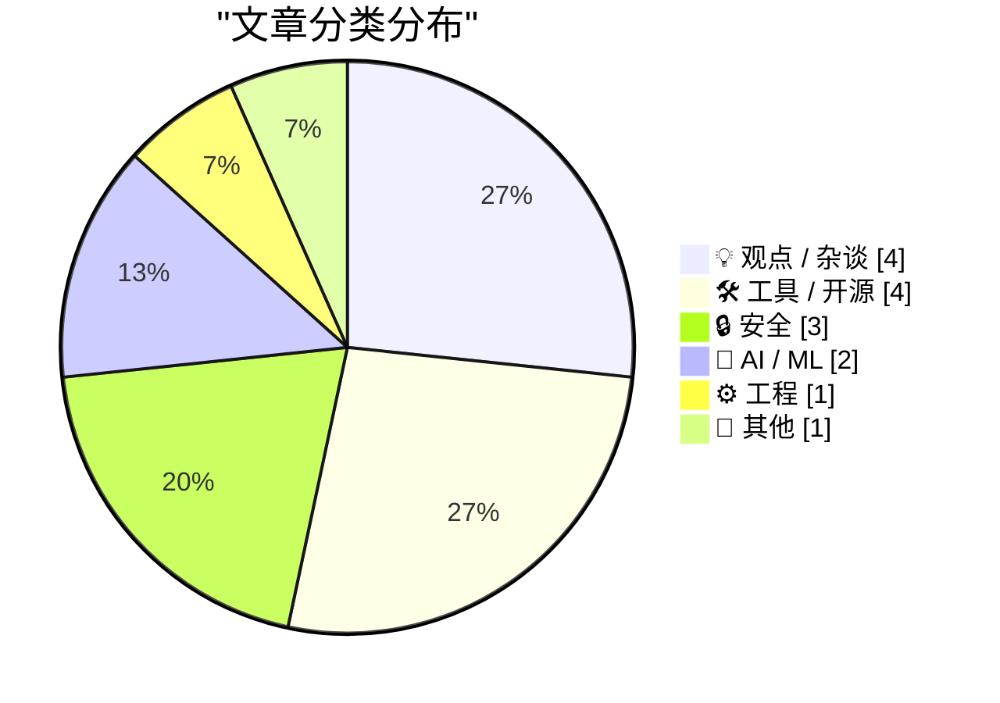
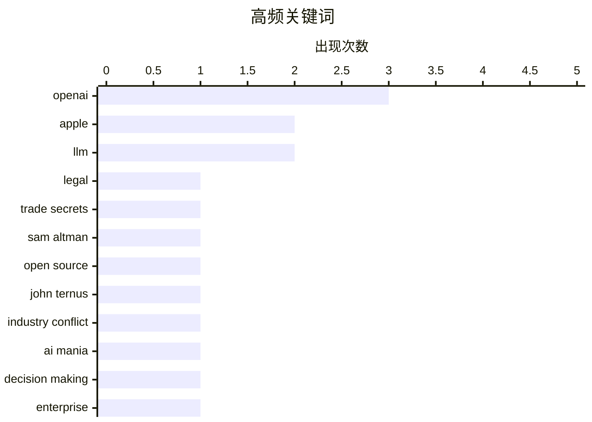

# 📰 Jul 20, 2026

> 来自 Karpathy 推荐的 92 个顶级技术博客，AI 精选 Top 15

## 📝 今日看点

苹果对 OpenAI 开启“全面战争”，通过法律手段严控人才流失，标志着库比蒂诺激进竞争风格的回归。AI 领域在狂热扩张中显现隐忧，高管盲目决策与平台管理不稳定揭示了技术繁荣背后的治理危机。底层生态则在持续进化，Rust 驱动的工具链优化与应用商店的灰产治理成为当前技术圈关注的重点。

---

## 🏆 今日必读

🥇 **苹果向数十名跳槽至 OpenAI 的前员工发出律师函**

[Apple Sends Letters to Dozens of Former Employees Now at OpenAI](https://www.ft.com/content/1b8c9d52-88a9-426b-ba47-f1811f859166?syn-25a6b1a6=1) — daringfireball.net · 1 天前 · 🔒 安全

> 苹果公司已向约 40 名加入 OpenAI 的前员工发出法律信函，要求他们保留所有相关文件和通信记录，并要求与苹果律师会面。此举紧随苹果上周对 OpenAI 发起的重磅诉讼之后，显示出苹果在人才流失和知识产权保护方面的激进姿态。目前苹果和 OpenAI 均拒绝就此置评。这一行动标志着两家公司在生成式 AI 领域的竞争已从技术博弈全面升级为法律对抗。

💡 **为什么值得读**: 揭示了苹果在 AI 人才争夺战中采取的极端法律防御手段，是观察科技巨头竞争态势的重要信号。

🏷️ Apple, OpenAI, legal, trade secrets

🥈 **引用萨姆·奥特曼：关于开源策略的内幕**

[Quoting Sam Altman](https://simonwillison.net/2026/Jul/20/sam-altman/#atom-everything) — simonwillison.net · 5 小时前 · 🤖 AI / ML

> 萨姆·奥特曼在泄露的邮件中详细讨论了 OpenAI 的开源策略，提议发布一个具备 GPT-3 级别能力且能在消费级硬件上本地运行的模型。该计划的核心意图是抢在 Stability AI 等竞争对手之前占领市场，通过先发优势抑制其他开发者发布类似的开源模型。这反映了 OpenAI 早期如何将开源视为一种商业防御手段，而非纯粹的开放精神。这种策略性开源旨在通过掌控生态来维持其市场主导地位。

💡 **为什么值得读**: 深入了解 OpenAI 早期战略决策的内幕，特别是其如何利用开源作为一种战术手段来遏制竞争。

🏷️ OpenAI, Sam Altman, open source, LLM

🥉 **库比蒂诺的早晨再次弥漫着“凝固汽油弹”的味道**

[★ Mornings in Cupertino Have the Aroma of Napalm Once Again](https://daringfireball.net/2026/07/mornings_in_cupertino_have_the_aroma_of_napalm_once_again) — daringfireball.net · 1 天前 · 💡 观点 / 杂谈

> 苹果近期对 OpenAI 采取的激进法律行动被视为史蒂夫·乔布斯式“战争思维”的回归。文章推测苹果硬件工程主管 John Ternus 可能在决策中效仿了乔布斯在面临威胁时全力反击、不惜一战的风格。这种转变意味着苹果正从温和的库克时代转向更具攻击性的竞争模式，试图通过法律手段夺回在 AI 领域失去的话语权。这种“战争模式”的重启预示着硅谷巨头间的关系将进一步恶化。

💡 **为什么值得读**: 探讨苹果企业文化的回归与转变，以及这种激进风格对未来科技竞争格局的影响。

🏷️ Apple, OpenAI, John Ternus, industry conflict

---

## 📊 数据概览

| 扫描源 | 抓取文章 | 时间范围 | 精选 |
|:---:|:---:|:---:|:---:|
| 83/92 | 2503 篇 → 17 篇 | 48h | **15 篇** |

### 分类分布



### 高频关键词



<details>
<summary>📈 纯文本关键词图（终端友好）</summary>

```
openai            │ ████████████████████ 3
apple             │ █████████████░░░░░░░ 2
llm               │ █████████████░░░░░░░ 2
legal             │ ███████░░░░░░░░░░░░░ 1
trade secrets     │ ███████░░░░░░░░░░░░░ 1
sam altman        │ ███████░░░░░░░░░░░░░ 1
open source       │ ███████░░░░░░░░░░░░░ 1
john ternus       │ ███████░░░░░░░░░░░░░ 1
industry conflict │ ███████░░░░░░░░░░░░░ 1
ai mania          │ ███████░░░░░░░░░░░░░ 1
```

</details>

### 🏷️ 话题标签

**openai**(3) · **apple**(2) · **llm**(2) · legal(1) · trade secrets(1) · sam altman(1) · open source(1) · john ternus(1) · industry conflict(1) · ai mania(1) · decision making(1) · enterprise(1) · hype(1) · bun(1) · rust(1) · claude code(1) · performance(1) · ai agents(1) · quota(1) · email(1)

---

## 💡 观点 / 杂谈

### 1. 库比蒂诺的早晨再次弥漫着“凝固汽油弹”的味道

[★ Mornings in Cupertino Have the Aroma of Napalm Once Again](https://daringfireball.net/2026/07/mornings_in_cupertino_have_the_aroma_of_napalm_once_again) — **daringfireball.net** · 1 天前 · ⭐ 24/30

> 苹果近期对 OpenAI 采取的激进法律行动被视为史蒂夫·乔布斯式“战争思维”的回归。文章推测苹果硬件工程主管 John Ternus 可能在决策中效仿了乔布斯在面临威胁时全力反击、不惜一战的风格。这种转变意味着苹果正从温和的库克时代转向更具攻击性的竞争模式，试图通过法律手段夺回在 AI 领域失去的话语权。这种“战争模式”的重启预示着硅谷巨头间的关系将进一步恶化。

🏷️ Apple, OpenAI, John Ternus, industry conflict

---

### 2. AI 狂热正在摧毁全球决策机制

[AI Mania Is Eviscerating Global Decision-Making](https://simonwillison.net/2026/Jul/19/ai-mania/#atom-everything) — **simonwillison.net** · 1 天前 · ⭐ 23/30

> AI 狂热正严重损害全球企业的决策质量，许多高管在从未实际使用过 ChatGPT 等工具的情况下，盲目推动耗资巨大的 AI 转型。文章引用了大量匿名信源的辛辣轶事，揭示了企业内部因追逐热点而导致的逻辑缺失和资源浪费。这种“AI 躁郁症”使得长期战略被短期泡沫所取代，导致决策过程脱离实际业务需求。作者认为，这种缺乏认知的决策模式正在对全球商业生态造成系统性的破坏。

🏷️ AI mania, decision making, enterprise, hype

---

### 3. 先做完还是先做好：开发者与设计师的博弈

[Make It Work vs. Make It Good](https://blog.jim-nielsen.com/2026/make-it-work-make-it-good/) — **blog.jim-nielsen.com** · 1 天前 · ⭐ 19/30

> 软件开发中存在“让功能运行”与“让体验变好”两种思维的博弈。开发者往往倾向于追求功能实现，因为从无到有的功能交付能带来即时的成就感和外部赞誉。相比之下，设计师追求的“好”往往是主观且难以量化的，需要更深层次的打磨。作者指出，追求“能用”往往比追求“好用”更容易获得成就感，因为前者是二元对立的成功，而后者是无止境的优化。真正的挑战在于如何平衡这种心理驱动力，不因追求简单的“完成”而忽视了长期的“品质”。

🏷️ software design, philosophy, craftsmanship

---

### 4. 《即兴表演》：一本关于“邪教”运作的手册？

[Impro is a handbook for running a cult](https://seangoedecke.com/impro/) — **seangoedecke.com** · 1 天前 · ⭐ 16/30

> 本文对 Keith Johnstone 的名著《即兴表演》（Impro）进行了另类解读，认为其核心逻辑在于通过“去抑制”来释放创造力。书中指出成年人的创造力被教育体系压抑，而即兴表演是打破社会面具、重获表达欲的关键。作者进一步提出，这种通过打破社交规范来建立深度连接的方法，在本质上与某些组织的运作模式高度相似。这种视角揭示了创造力训练背后潜藏的心理操纵与群体动力学。文章引导读者重新思考艺术训练与社会控制之间的微妙界限。

🏷️ creativity, psychology, culture, improvisation

---

## 🛠 工具 / 开源

### 5. Claude Code 现已使用 Rust 编写的 Bun 运行时

[Claude Code uses Bun written in Rust now](https://simonwillison.net/2026/Jul/19/claude-code-in-bun-in-rust/#atom-everything) — **simonwillison.net** · 1 天前 · ⭐ 23/30

> Anthropic 开发的命令行工具 Claude Code 在 v2.1.181 版本后已迁移至使用 Rust 重写的 Bun 运行时。这一底层架构的变更使得 Linux 平台上的启动速度提升了 10%，且在保持稳定性的前提下实现了性能优化。开发者通过验证二进制文件中的字符串确认了这一转变，而大多数用户甚至没有察觉到变化。这种“无感”的性能提升再次证明了 Rust 在现代高性能开发工具链中的核心地位。

🏷️ Bun, Rust, Claude Code, performance

---

### 6. 包管理周报：2026 年 7 月 18 日

[This Week in Package Management: 18 July 2026](https://nesbitt.io/2026/07/18/this-week-in-package-management.html) — **nesbitt.io** · 1 天前 · ⭐ 21/30

> 本周包管理领域简报汇总了 2026 年 7 月 18 日当周的主要动态，涵盖了 npm、PyPI 等主流生态系统的版本发布和安全预警。内容重点关注了近期发现的供应链漏洞修复以及包管理器功能的重大更新。该简报旨在帮助开发者快速掌握软件依赖安全的最新趋势，规避潜在的恶意包风险。通过追踪这些变化，开发团队可以更及时地调整其自动化构建和安全审计策略。

🏷️ package management, devops, software supply chain

---

### 7. SQLite 查询计划解释器工具

[SQLite Query Explainer](https://simonwillison.net/2026/Jul/18/sqlite-query-explainer/#atom-everything) — **simonwillison.net** · 1 天前 · ⭐ 20/30

> 开发者 Simon Willison 受 Julia Evans 启发，开发了一款名为 SQLite Query Explainer 的交互式工具。该工具利用 Fable 构建，能将 SQLite 复杂的 `EXPLAIN QUERY PLAN` 输出转化为直观、易读的视觉化解释。它通过简化索引使用情况和扫描路径的分析，大幅降低了数据库性能调优的门槛。这对于需要优化本地数据库查询性能的开发者来说是一个非常实用的辅助工具。

🏷️ SQLite, SQL, query optimization, developer tools

---

### 8. Paper：让设计稿直接变成 HTML/CSS 的新一代设计工具

[Paper](https://paper.design/?utm_source=df) — **daringfireball.net** · 10 小时前 · ⭐ 16/30

> Paper 是一款打破设计与开发隔阂的专业设计工具，其核心特性是所有图层均由真实的 HTML 和 CSS 构成。这种“代码即设计”的模式消除了传统交付中的抽象层，实现了设计稿与最终产物的无缝转换。该工具支持 MCP 协议，允许 AI 智能体直接读取并编辑设计方案，极大提升了自动化协作效率。此外，其 Snapshot 功能可将现有网页直接捕获为可编辑的图层，简化了逆向工程和迭代流程。这种双向同步的机制确保了设计与代码的始终一致。

🏷️ design tool, HTML, CSS, frontend

---

## 🔒 安全

### 9. 苹果向数十名跳槽至 OpenAI 的前员工发出律师函

[Apple Sends Letters to Dozens of Former Employees Now at OpenAI](https://www.ft.com/content/1b8c9d52-88a9-426b-ba47-f1811f859166?syn-25a6b1a6=1) — **daringfireball.net** · 1 天前 · ⭐ 26/30

> 苹果公司已向约 40 名加入 OpenAI 的前员工发出法律信函，要求他们保留所有相关文件和通信记录，并要求与苹果律师会面。此举紧随苹果上周对 OpenAI 发起的重磅诉讼之后，显示出苹果在人才流失和知识产权保护方面的激进姿态。目前苹果和 OpenAI 均拒绝就此置评。这一行动标志着两家公司在生成式 AI 领域的竞争已从技术博弈全面升级为法律对抗。

🏷️ Apple, OpenAI, legal, trade secrets

---

### 10. 电子邮件加密的历史与困局

[email encryption](https://computer.rip/2026-07-19-email-encryption.html) — **computer.rip** · 1 天前 · ⭐ 22/30

> 电子邮件作为一种起源于 20 世纪 60 年代的去中心化技术，其架构设计之初并未考虑安全性，导致实现统一加密极其困难。文章回顾了邮件系统从大型机到 PC 时代的演进，指出其长寿性与缺乏原生加密的脆弱性并存。现有的加密方案在兼容性、密钥管理和用户体验方面面临多重挑战，难以在全网普及。作者认为，邮件系统的历史包袱使其成为了现代互联网中最难被彻底安全化的基础设施之一。

🏷️ email, encryption, cryptography, history

---

### 11. 9to5Mac 揭露巴西 App Store 存在数十款伪装赌博应用

[9to5Mac Uncovers Dozens of Disguised Gambling Apps on the App Store in Brazil](https://9to5mac.com/2026/07/17/investigation-reveals-dozens-of-disguised-gambling-apps-on-the-app-store-in-brazil/) — **daringfireball.net** · 16 小时前 · ⭐ 21/30

> 调查发现巴西 App Store 中存在超过 60 款伪装成导航、天气或旅行工具的非法赌博应用。这些被称为“马甲包”的应用通常使用 AI 生成的动物图标，通过审核后在后台切换为博彩界面，甚至能冲上分类榜单前列。这暴露了苹果应用商店在特定地区审核机制的严重漏洞以及对非法内容的监管失灵。尽管用户反馈不断，这些应用仍能通过操纵排名误导大量用户下载。

🏷️ App Store, gambling apps, fraud, Brazil

---

## 🤖 AI / ML

### 12. 引用萨姆·奥特曼：关于开源策略的内幕

[Quoting Sam Altman](https://simonwillison.net/2026/Jul/20/sam-altman/#atom-everything) — **simonwillison.net** · 5 小时前 · ⭐ 24/30

> 萨姆·奥特曼在泄露的邮件中详细讨论了 OpenAI 的开源策略，提议发布一个具备 GPT-3 级别能力且能在消费级硬件上本地运行的模型。该计划的核心意图是抢在 Stability AI 等竞争对手之前占领市场，通过先发优势抑制其他开发者发布类似的开源模型。这反映了 OpenAI 早期如何将开源视为一种商业防御手段，而非纯粹的开放精神。这种策略性开源旨在通过掌控生态来维持其市场主导地位。

🏷️ OpenAI, Sam Altman, open source, LLM

---

### 13. 近期 AI 智能体配额频繁异常重置是怎么回事？

[What's the deal with all the random weekly quota resets for agents lately?](https://minimaxir.com/2026/07/agent-quota-reset/) — **minimaxir.com** · 1 天前 · ⭐ 23/30

> 近期多个 AI 智能体平台出现了异常的每周配额重置现象，导致用户获得了超出预期的免费使用额度。作者探讨了这种看似利好用户、实则反映出平台后端管理不稳定的现状。这种不确定的配额策略可能源于平台在模型推理成本压力与用户留存指标之间的反复权衡。虽然用户短期内获得了“免费午餐”，但这种随机性也暴露了 AI 服务在商业化和资源调度过程中的不成熟。

🏷️ LLM, AI agents, quota

---

## ⚙️ 工程

### 14. 如何为单词列表匹配最合适的正则表达式

[Fitting a regular expression to a list of words](https://www.johndcook.com/blog/2026/07/19/fitting-a-regex/) — **johndcook.com** · 13 小时前 · ⭐ 17/30

> 在处理大规模单词搜索时，常用的工具如 grep 可以通过 -f 参数读取文件，并配合 -F 参数将模式视为固定字符串。本文探讨了如何针对特定单词列表构建高效的正则表达式，以优化搜索性能。这种方法在处理日志分析或文本挖掘等需要精确匹配大量关键词的场景中非常实用。通过合理构造正则，可以显著减少计算开销并提高匹配速度。文章强调了在特定约束下，选择合适的正则构造策略对执行效率的影响。

🏷️ regex, grep, string matching

---

## 📝 其他

### 15. 建筑物理周刊：加州新城受阻与工业制造挑战

[Reading List 07/18/26](https://www.construction-physics.com/p/reading-list-071826) — **construction-physics.com** · 1 天前 · ⭐ 16/30

> 本期阅读清单聚焦于大型工程与制造业的现实困境，涵盖了从城市规划到精密制造的多个领域。重点讨论了 California Forever 城市项目的挫折，以及耗资 5 亿美元的炮弹工厂面临的生产瓶颈。文章还深入分析了电动汽车（EV）电池回收的技术难题，以及汽车线束制造中难以自动化的复杂性。这些案例共同揭示了现代工业在规模化生产和可持续转型中遭遇的物理与经济限制。通过这些具体的工业实例，读者可以洞察宏观政策在落地过程中的微观阻力。

🏷️ manufacturing, infrastructure, EV batteries

---

*生成于 2026-07-20 09:28 | 扫描 83 源 → 获取 2503 篇 → 精选 15 篇*
*基于 [Hacker News Popularity Contest 2025](https://refactoringenglish.com/tools/hn-popularity/) RSS 源列表，由 [Andrej Karpathy](https://x.com/karpathy) 推荐*
