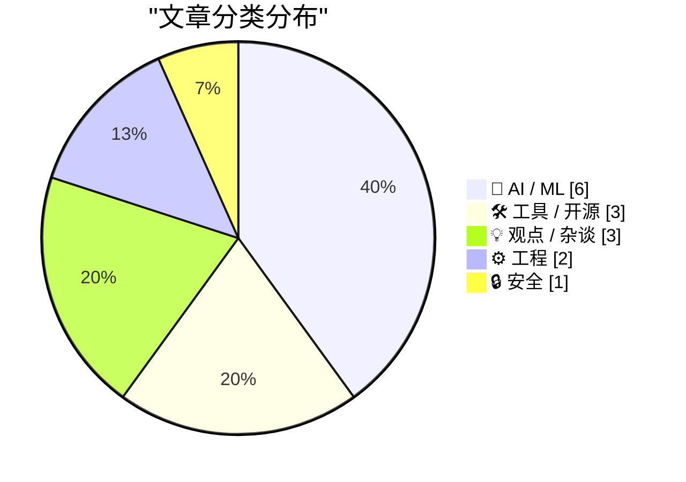
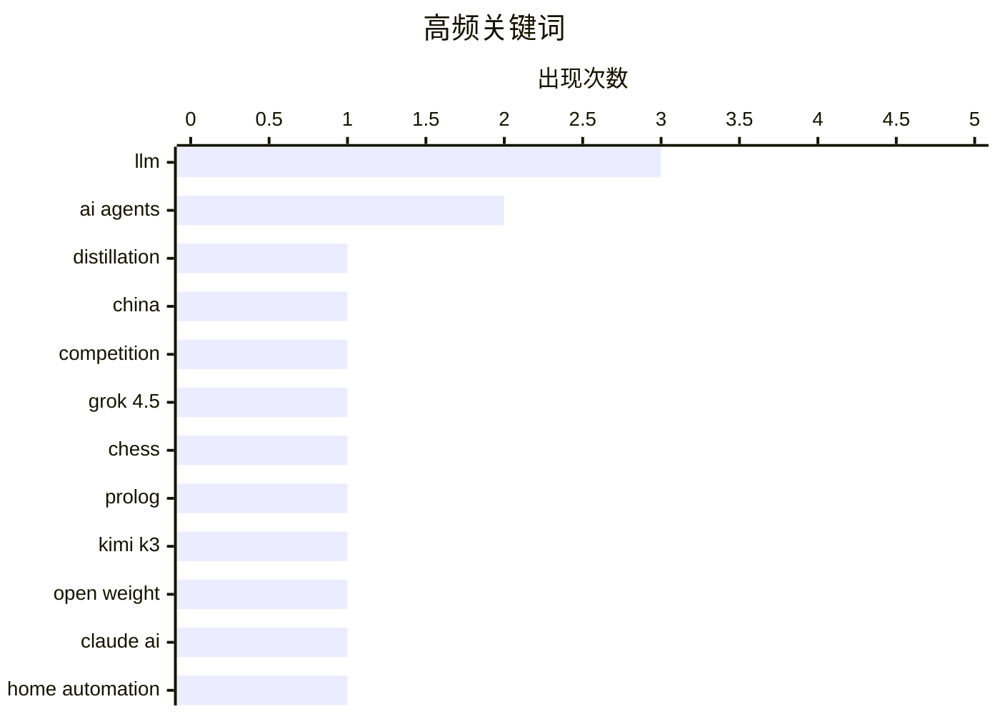

# 📰 Jul 21, 2026

> 来自 Karpathy 推荐的 92 个顶级技术博客，AI 精选 Top 15

## 📝 今日看点

中国大模型的强势崛起正重塑全球 AI 竞争格局，引发了业界对美国开源模型法律限制与“蒸馏困境”的深刻反思。AI 智能体正从对话工具演变为深度工程助手，在逆向工程、自动化运维及身份管理等实战场景中展现出极高的降本增效潜力。此外，内存安全与应用商店安全治理依然是技术底层不容忽视的核心议题。

---

## 🏆 今日必读

🥇 **谁在害怕中国模型？**

[Who’s Afraid of Chinese Models?](https://simonwillison.net/2026/Jul/20/afraid-of-chinese-models/#atom-everything) — simonwillison.net · 15 小时前 · 🤖 AI / ML

> 针对 Kimi K3 等中国模型的崛起，Ben Thompson 提出了应对美国开源模型竞争劣势的法律建议。目前美国开源模型受限于闭源实验室（如 OpenAI/Google）的服务条款，禁止利用其输出进行蒸馏，导致其在性能上落后于不受此限制的中国模型。作者建议美国通过法律明确：用于训练模型的数据采集属于“合理使用”，且禁止通过合同条款限制模型蒸馏。这一方案旨在打破闭源巨头的垄断，让西方开源模型能直接从最强模型中学习，从而在技术竞赛中保持竞争力。

💡 **为什么值得读**: 深入探讨了中美 AI 模型竞争中的法律与政策博弈，特别是关于“蒸馏合法化”对开源生态的战略意义。

🏷️ LLM, distillation, China, competition

🥈 **使用 Grok 4.5 解决国际象棋谜题**

[Solving a chess puzzle with Grok 4.5](https://www.johndcook.com/blog/2026/07/20/grok-chess/) — johndcook.com · 18 小时前 · 🤖 AI / ML

> 作者测试了 xAI 最新发布的 Grok 4.5 在处理复杂逻辑任务时的表现，具体为生成 Prolog 或 Lean 代码来解决国际象棋谜题。此前作者曾使用 Claude 和 ChatGPT 完成类似任务，而此次 Grok 4.5 展现出了极高的准确性和代码生成能力。实验证明 Grok 4.5 能够理解复杂的棋局逻辑并将其转化为可执行的逻辑编程语言。这标志着 Grok 在推理能力上已跻身第一梯队，足以应对严苛的编程与数学逻辑挑战。

💡 **为什么值得读**: 验证了 Grok 4.5 在逻辑推理和形式化编程方面的实战能力，是评估大模型前沿水平的直观案例。

🏷️ Grok 4.5, LLM, chess, Prolog

🥉 **谁在害怕中国模型？（Stratechery 观点）**

[‘Who’s Afraid of Chinese Models?’](https://stratechery.com/2026/whos-afraid-of-chinese-models/) — daringfireball.net · 16 小时前 · 🤖 AI / ML

> 本文转述了 Ben Thompson 对 Kimi K3 现象的分析，指出美国开源模型正陷入“蒸馏的蒸馏”这一尴尬境地。由于美国法律和厂商条款限制，本地开发者无法直接蒸馏顶级闭源模型，反而可能在间接使用已经过中国实验室蒸馏的技术。作者质疑禁止蒸馏的合理性，认为这种限制削弱了西方开源社区的创新速度。文章呼吁重新审视数据使用权，以防止中国模型在开源领域通过更灵活的合规策略实现反超。

💡 **为什么值得读**: 揭示了美国 AI 监管政策如何意外地为中国模型创造了竞争优势，对行业政策制定者极具启发。

🏷️ LLM, Kimi K3, open weight

---

## 📊 数据概览

| 扫描源 | 抓取文章 | 时间范围 | 精选 |
|:---:|:---:|:---:|:---:|
| 83/92 | 2505 篇 → 20 篇 | 48h | **15 篇** |

### 分类分布



### 高频关键词



<details>
<summary>📈 纯文本关键词图（终端友好）</summary>

```
llm          │ ████████████████████ 3
ai agents    │ █████████████░░░░░░░ 2
distillation │ ███████░░░░░░░░░░░░░ 1
china        │ ███████░░░░░░░░░░░░░ 1
competition  │ ███████░░░░░░░░░░░░░ 1
grok 4.5     │ ███████░░░░░░░░░░░░░ 1
chess        │ ███████░░░░░░░░░░░░░ 1
prolog       │ ███████░░░░░░░░░░░░░ 1
kimi k3      │ ███████░░░░░░░░░░░░░ 1
open weight  │ ███████░░░░░░░░░░░░░ 1
```

</details>

### 🏷️ 话题标签

**llm**(3) · **ai agents**(2) · **distillation**(1) · china(1) · competition(1) · grok 4.5(1) · chess(1) · prolog(1) · kimi k3(1) · open weight(1) · claude ai(1) · home automation(1) · home assistant(1) · reverse-engineering(1) · automation(1) · memory safety(1) · programming languages(1) · rust(1) · app store(1) · fraud(1)

---

## 🤖 AI / ML

### 1. 谁在害怕中国模型？

[Who’s Afraid of Chinese Models?](https://simonwillison.net/2026/Jul/20/afraid-of-chinese-models/#atom-everything) — **simonwillison.net** · 15 小时前 · ⭐ 27/30

> 针对 Kimi K3 等中国模型的崛起，Ben Thompson 提出了应对美国开源模型竞争劣势的法律建议。目前美国开源模型受限于闭源实验室（如 OpenAI/Google）的服务条款，禁止利用其输出进行蒸馏，导致其在性能上落后于不受此限制的中国模型。作者建议美国通过法律明确：用于训练模型的数据采集属于“合理使用”，且禁止通过合同条款限制模型蒸馏。这一方案旨在打破闭源巨头的垄断，让西方开源模型能直接从最强模型中学习，从而在技术竞赛中保持竞争力。

🏷️ LLM, distillation, China, competition

---

### 2. 使用 Grok 4.5 解决国际象棋谜题

[Solving a chess puzzle with Grok 4.5](https://www.johndcook.com/blog/2026/07/20/grok-chess/) — **johndcook.com** · 18 小时前 · ⭐ 26/30

> 作者测试了 xAI 最新发布的 Grok 4.5 在处理复杂逻辑任务时的表现，具体为生成 Prolog 或 Lean 代码来解决国际象棋谜题。此前作者曾使用 Claude 和 ChatGPT 完成类似任务，而此次 Grok 4.5 展现出了极高的准确性和代码生成能力。实验证明 Grok 4.5 能够理解复杂的棋局逻辑并将其转化为可执行的逻辑编程语言。这标志着 Grok 在推理能力上已跻身第一梯队，足以应对严苛的编程与数学逻辑挑战。

🏷️ Grok 4.5, LLM, chess, Prolog

---

### 3. 谁在害怕中国模型？（Stratechery 观点）

[‘Who’s Afraid of Chinese Models?’](https://stratechery.com/2026/whos-afraid-of-chinese-models/) — **daringfireball.net** · 16 小时前 · ⭐ 25/30

> 本文转述了 Ben Thompson 对 Kimi K3 现象的分析，指出美国开源模型正陷入“蒸馏的蒸馏”这一尴尬境地。由于美国法律和厂商条款限制，本地开发者无法直接蒸馏顶级闭源模型，反而可能在间接使用已经过中国实验室蒸馏的技术。作者质疑禁止蒸馏的合理性，认为这种限制削弱了西方开源社区的创新速度。文章呼吁重新审视数据使用权，以防止中国模型在开源领域通过更灵活的合规策略实现反超。

🏷️ LLM, Kimi K3, open weight

---

### 4. 每周更新 513：用 Claude 整合家庭网络

[Weekly Update 513: Clauding The Home Network](https://www.troyhunt.com/weekly-update-513/) — **troyhunt.com** · 1 小时前 · ⭐ 25/30

> Troy Hunt 分享了利用 Claude AI 整合 UniFi 网络设备、Home Assistant 自动化平台和 Pi-Hole 广告拦截器数据的实践。通过 AI 处理这些设备产生的海量原始日志和杂乱信息，用户可以更直观地理解家庭网络状态。这种方案展示了 AI 在“降噪”方面的巨大价值，将原本难以解读的技术数据转化为易于理解的洞察。这不仅提升了家庭网络管理的效率，也为 AI 在智能家居领域的落地提供了实用范例。

🏷️ Claude AI, home automation, Home Assistant

---

### 5. 逆向工程现在变得廉价了

[Reverse-engineering is cheap now](https://simonwillison.net/2026/Jul/20/cheap-reverse-engineering/#atom-everything) — **simonwillison.net** · 13 小时前 · ⭐ 24/30

> 随着 AI 编码智能体（Coding Agents）的普及，逆向工程和自动化家用设备的成本大幅下降。过去由于投入产出比（ROI）过低，程序员往往不愿花费大量时间去破解文档缺失、接口不稳定的私有 API。现在 AI 可以快速分析协议并生成控制代码，即使未来接口发生变化，再次修复的成本也极低。这种技术门槛的降低彻底改变了开发者与封闭硬件生态的博弈关系。

🏷️ AI agents, reverse-engineering, automation

---

### 6. Kuiper Q-Q 图：这些分布是否相同？

[Kuiper Q-Q plot: are these the same?](https://entropicthoughts.com/kuiper-q-q-plot) — **entropicthoughts.com** · 10 小时前 · ⭐ 16/30

> 评估两组数据分布是否一致是统计分析的核心，文章重点介绍了 Kuiper 检验与 Q-Q 图的结合应用。相比于常见的 Kolmogorov-Smirnov (K-S) 检验，Kuiper 检验对分布的尾部差异和周期性数据更为敏感，能更准确地捕捉到实验组与对照组之间的细微波动。通过 Q-Q 图的视觉化呈现，研究者可以直观地观察到处理组在特定分位数上的变异性增加。这种方法论对于需要精确分析算法 A/B 测试结果或临床实验数据的技术人员具有极高的参考价值。文章强调了在均值比较之外，关注分布形态（Variation）的重要性。

🏷️ statistics, data analysis, Q-Q plot

---

## 🛠 工具 / 开源

### 7. WorkOS MCP：通过 AI 智能体管理你的身份验证平台

[[Sponsor] WorkOS MCP: Manage Your Auth Platform From Any AI Agent](https://workos.com/blog/management-mcp-server?utm_source=daringfireball&amp;utm_medium=newsletter&amp;utm_campaign=q32026) — **daringfireball.net** · 9 小时前 · ⭐ 20/30

> WorkOS 推出了基于模型上下文协议（MCP）的服务，允许 AI 智能体直接管理 SSO 调试、用户管理和权限策略配置。过去这些任务必须由人工通过 UI 界面操作，而现在智能体可以通过 OAuth 授权获得与控制台同等的访问权限。该服务支持数百种操作，且能在运行时被智能体自动发现。开发者只需一条命令即可连接，甚至可以要求智能体根据截图自动匹配登录页面的品牌设计。

🏷️ MCP, auth, AI agents

---

### 8. 为单词列表匹配最合适的正则表达式

[Fitting a regular expression to a list of words](https://www.johndcook.com/blog/2026/07/19/fitting-a-regex/) — **johndcook.com** · 1 天前 · ⭐ 17/30

> 如何为一组特定的单词列表构建最高效的正则表达式是文本处理中的常见挑战。虽然可以使用 grep -F 处理固定字符串，但在编程环境中，将单词列表转换为紧凑的正则表达式（如利用 Trie 树结构）能显著提升匹配性能。文章探讨了从简单的“或”逻辑（A|B|C）到更复杂的自动生成算法的演进过程。这种优化在处理大规模敏感词过滤或日志分析时，能有效减少回溯并降低计算开销。作者展示了如何通过算法手段，将离散的单词集合压缩成一个高效的状态机表示。

🏷️ regex, grep, text processing

---

### 9. OpenTK：现已支持互联网咨询与通知功能

[OpenTK: nu ook met Internetconsultaties & notificaties](https://berthub.eu/articles/posts/opentk-internetconsultaties/) — **berthub.eu** · 21 小时前 · ⭐ 17/30

> OpenTK 是一个旨在提高荷兰议会透明度的开源项目，近期新增了互联网咨询和邮件通知功能。该工具源于作者对一项涉及 DNS 技术的法律在无预警情况下即将投票的担忧，旨在防止技术社区错过关键立法动态。通过自动化抓取议会数据并提供精准推送，OpenTK 让公民能够实时跟踪法律草案的进展。这种技术手段有效地解决了信息不对称问题，确保技术专家能及时参与到相关公共政策的讨论中。项目展示了如何利用简单的邮件通知系统（Email Notifications）构建起技术与政治之间的桥梁。

🏷️ open data, DNS, government

---

## 💡 观点 / 杂谈

### 10. 引用 Sam Altman：OpenAI 的开源策略往事

[Quoting Sam Altman](https://simonwillison.net/2026/Jul/20/sam-altman/#atom-everything) — **simonwillison.net** · 1 天前 · ⭐ 18/30

> 本文引用了 Sam Altman 早期关于开源策略的内部讨论，揭示了 OpenAI 曾计划发布一个类似 GPT-3 级别的本地模型。当时 Altman 认为在 Stability AI 等竞争对手行动之前发布本地模型，可以有效遏制其他厂商发布更具破坏性的开源模型。这一策略表明 OpenAI 最初将开源视为一种防御性的商业手段，而非纯粹的社区贡献。这段历史回顾为理解当前大模型厂商在开源与闭源之间的立场转变提供了重要背景。

🏷️ OpenAI, open source, Sam Altman

---

### 11. 公共交通：别让我思考！

[Public Transport - Don't Make Me Think!](https://shkspr.mobi/blog/2026/07/public-transport-dont-make-me-think/) — **shkspr.mobi** · 21 小时前 · ⭐ 17/30

> 公共交通票务系统的用户体验在不同城市间存在巨大差异，直接影响乘客的出行效率。许多城市仍采用复杂的区域划分、专属 App 和繁琐的限制条件，形成了一种官僚主义式的“迷宫”。相比之下，优秀的系统应遵循《别让我思考》中的设计原则，通过非接触式支付（Contactless）或统一平台简化购票流程。作者认为，票务技术不应成为出行的阻碍，而应像成熟的互联网产品一样追求极致的易用性。实现“无感支付”不仅是技术升级，更是城市服务理念从管理者中心向用户中心的转变。

🏷️ UX, ticketing, usability

---

### 12. “昂贵”如今已沦为一种品牌营销手段

[Expensive Is Just a Brand Now](https://idiallo.com/blog/expensive-is-just-branding) — **idiallo.com** · 9 小时前 · ⭐ 16/30

> 传统的“贵有贵的道理”观念在现代消费市场正逐渐失效，高昂的价格已演变为一种纯粹的品牌营销手段。经典的“维姆斯靴子理论”认为高价商品因耐用而更具长期性价比，但如今许多奢侈品牌在生产工艺和材料上与廉价品牌并无本质区别。文章指出，价格与质量之间的强关联性已被品牌溢价所取代，消费者面临着“支付溢价却获得平庸产品”的风险。这种现象在电子产品和服装行业尤为明显，耐用性不再是高价的必然保证。作者提醒读者，在当前环境下，必须穿透品牌光环，重新审视产品的实际工程质量而非仅仅看标价。

🏷️ consumerism, quality, branding

---

## ⚙️ 工程

### 13. 内存安全最难的问题

[Memory Safety's Hardest Problem](https://matklad.github.io/2026/07/20/memory-safety-hardest-problem.html) — **matklad.github.io** · 1 天前 · ⭐ 24/30

> 本文探讨了内存安全领域中最为棘手的核心挑战，即如何在不牺牲性能的前提下处理复杂的内存所有权。作者引用了 Lobsters 社区的深度讨论，分析了 Rust 等语言在解决此类问题时的权衡。讨论涉及了引用计数、借用检查以及在并发环境下的内存管理复杂度。结论指出，内存安全不仅是编译器技术问题，更是程序员心智模型与系统性能之间的博弈。

🏷️ memory safety, programming languages, Rust

---

### 14. 在 C++/WinRT 中创建 Windows 运行时委托的敏捷版本

[Making an agile version of a Windows Runtime delegate in C++/WinRT, part 1](https://devblogs.microsoft.com/oldnewthing/20260720-00/?p=112545) — **devblogs.microsoft.com/oldnewthing** · 18 小时前 · ⭐ 21/30

> 本文介绍了在 C++/WinRT 开发中如何处理 Windows 运行时（WinRT）委托的线程敏捷性（Agility）问题。在多线程环境下，默认的委托可能无法在不同线程间安全传递，导致调用失败。作者 Raymond Chen 探讨了如何通过特定的编程模式使委托变得“敏捷”，从而允许其在任何线程上执行。第一部分重点讨论了最基础且易于实现的场景，为后续复杂的线程同步问题奠定基础。

🏷️ C++, WinRT, Windows

---

## 🔒 安全

### 15. 9to5Mac 揭露巴西 App Store 中数十款伪装的赌博应用

[9to5Mac Uncovers Dozens of Disguised Gambling Apps on the App Store in Brazil](https://9to5mac.com/2026/07/17/investigation-reveals-dozens-of-disguised-gambling-apps-on-the-app-store-in-brazil/) — **daringfireball.net** · 1 天前 · ⭐ 21/30

> 调查发现巴西 App Store 的导航、旅行和天气分类榜单中出现了大量制作粗糙的“马甲包”应用。这些应用通常使用 AI 生成的动物图标作为封面，表面上是简单的工具或游戏，实则是非法赌博平台的入口。9to5Mac 已确认超过 60 款此类违规应用，它们利用苹果审核机制的漏洞进行分发。这一现象引发了对苹果 App Store 审核质量以及 AI 生成内容被滥用于欺诈行为的担忧。

🏷️ App Store, fraud, gambling

---

*生成于 2026-07-21 08:39 | 扫描 83 源 → 获取 2505 篇 → 精选 15 篇*
*基于 [Hacker News Popularity Contest 2025](https://refactoringenglish.com/tools/hn-popularity/) RSS 源列表，由 [Andrej Karpathy](https://x.com/karpathy) 推荐*
